# E-Commerce Multi-Store SaaS - Architecture Document

> **Version:** 1.0  
> **Date:** 2026-06-07  
> **Author:** OWL (AI Assistant)  
> **Repository:** [eCommerce-multi-store-saas](https://github.com/gowtamkumar/eCommerce-multi-store-saas.git)

---

## Table of Contents

1. [Executive Summary](#1-executive-summary)
2. [System Overview](#2-system-overview)
3. [High-Level Architecture](#3-high-level-architecture)
4. [Technology Stack](#4-technology-stack)
5. [Module Architecture](#5-module-architecture)
6. [Multi-Store Architecture](#6-multi-store-architecture)
7. [Authentication & Authorization](#7-authentication--authorization)
8. [Database Architecture](#8-database-architecture)
9. [Infrastructure & Deployment](#9-infrastructure--deployment)
10. [Key Workflows](#10-key-workflows)
11. [Design Principles](#11-design-principles)

---

## 1. Executive Summary

This is a **modular-monolith, multi-store SaaS ERP platform** designed to run the full back-office of retail businesses. It supports:

- **Multi-store store and ERP management**
- **Multi-branch and multi-warehouse operations**
- **Retail POS and online sales**
- **Inventory ledger and warehouse workflows**
- **Procurement and supplier management**
- **Finance, accounting, AP, AR, and reporting**
- **CRM, loyalty, wallet, and customer credit**
- **HRM, attendance, leave, payroll, recruitment**
- **Strong RBAC, audit logs, subscription gating, and feature permissions**

### Key Characteristics

| Aspect                   | Description                            |
| ------------------------ | -------------------------------------- |
| **Architecture Pattern** | Modular Monolith                       |
| **Store Isolation**     | Strict per-store data isolation       |
| **Data Consistency**     | Strong consistency for money & stock   |
| **Async Processing**     | Event-driven with transactional outbox |
| **Offline Support**      | POS supports offline operations        |

---

## 2. System Overview

### 2.1 Bounded Contexts

The system is organized into 12 bounded contexts plus cross-cutting infrastructure services:

```
┌─────────────────────────────────────────────────────────────────────────────────┐
│                           E-COMMERCE MULTI-STORE SaaS                         │
├─────────────────────────────────────────────────────────────────────────────────┤
│                                                                                 │
│  ┌─────────────┐  ┌─────────────┐  ┌─────────────┐  ┌─────────────┐            │
│  │   System    │  │  Identity   │  │   Catalog   │  │    Sales    │            │
│  │  (Store,   │  │  (Auth,     │  │  (Product,  │  │  (Order,    │            │
│  │   Sub, Org) │  │   RBAC)     │  │   Pricing)  │  │   POS)      │            │
│  └─────────────┘  └─────────────┘  └─────────────┘  └─────────────┘            │
│                                                                                 │
│  ┌─────────────┐  ┌─────────────┐  ┌─────────────┐  ┌─────────────┐            │
│  │  Inventory  │  │ Procurement │  │   Finance   │  │    CRM      │            │
│  │  (Ledger,   │  │  (PR, RFQ,  │  │  (CoA,      │  │  (Customer, │            │
│  │   WMS)      │  │   PO, GRN)  │  │   Journal)  │  │   Loyalty)  │            │
│  └─────────────┘  └─────────────┘  └─────────────┘  └─────────────┘            │
│                                                                                 │
│  ┌─────────────┐  ┌─────────────┐  ┌─────────────┐  ┌─────────────┐            │
│  │    HRM      │  │ Fulfillment │  │  Marketing  │  │   Infra     │            │
│  │  (Employee, │  │  (Pick,     │  │  (Campaign, │  │  (Cache,    │            │
│  │   Payroll)  │  │   Ship)     │  │   Content)  │  │   Queue)    │            │
│  └─────────────┘  └─────────────┘  └─────────────┘  └─────────────┘            │
│                                                                                 │
└─────────────────────────────────────────────────────────────────────────────────┘
```

### 2.2 Module to Source Mapping

| #   | Context               | Source Location                                            | Key Entities                                      |
| --- | --------------------- | ---------------------------------------------------------- | ------------------------------------------------- |
| 1   | **System**            | `modules/system/*`                                         | Store, Subscription, Branch, Warehouse, AuditLog |
| 2   | **Identity & Access** | `modules/admin/core/{auth,user,rbac}`                      | User, Role, Permission, UserRoleAssignment        |
| 3   | **Catalog**           | `modules/admin/catalog/*`                                  | Product, Variant, Category, Brand, PriceBook      |
| 4   | **Sales**             | `modules/admin/sales/*`                                    | Order, Cart, Coupon, Promotion, Payment           |
| 5   | **POS**               | `modules/admin/sales/pos`                                  | Register, Shift, DrawerTransaction                |
| 6   | **Inventory/WMS**     | `modules/admin/operations/logistics/*`                     | InventoryLedger, StockReservation, Transfer       |
| 7   | **Procurement**       | `modules/admin/operations/finance/{purchase,supplier}`     | PurchaseOrder, GRN, SupplierInvoice               |
| 8   | **Finance**           | `modules/admin/operations/finance/{accounting,expense}`    | CoA, JournalEntry, LedgerEntry, AR, AP            |
| 9   | **CRM**               | `modules/admin/customer/*`                                 | Customer, Lead, Loyalty, Wallet                   |
| 10  | **HRM**               | `modules/admin/operations/hrm`                             | Employee, Attendance, Leave, Payroll              |
| 11  | **Fulfillment**       | `modules/admin/operations/logistics/{fulfillment,courier}` | PickList, Shipment, CourierIntegration            |
| 12  | **Marketing**         | `modules/admin/marketing/*`                                | Campaign, PageBuilder, FAQ                        |

---

## 3. High-Level Architecture

### 3.1 System Architecture Diagram

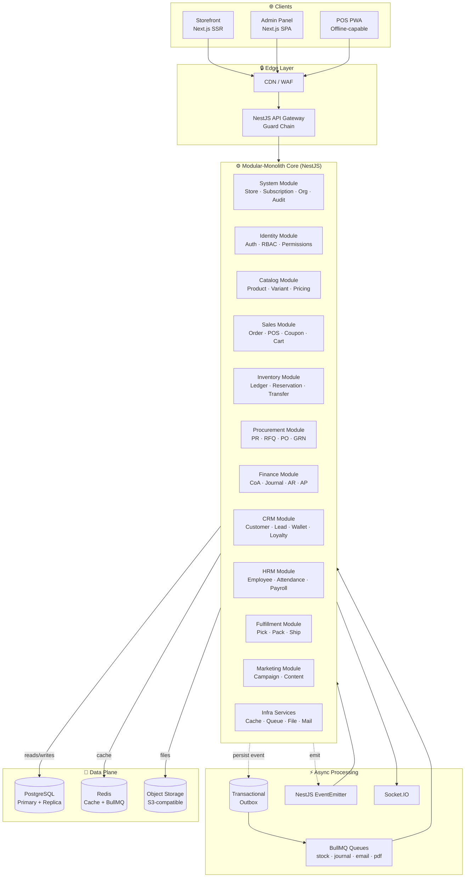

### 3.2 Request Lifecycle

```
HTTP Request
     │
     ▼
┌─────────────────────────────────────────────────────────────────┐
│                    GUARD CHAIN EXECUTION                         │
├─────────────────────────────────────────────────────────────────┤
│                                                                 │
│  1. StoreContextMiddleware                                     │
│     └─> Resolve store from JWT / subdomain / custom domain     │
│                                                                 │
│  2. MaintenanceGuard                                            │
│     └─> Check if system is in maintenance mode                  │
│                                                                 │
│  3. JwtAuthGuard                                                │
│     └─> Verify JWT token, load user from DB                     │
│                                                                 │
│  4. StoreIsolationGuard                                        │
│     └─> Ensure store context is valid                          │
│                                                                 │
│  5. StoreStatusGuard                                           │
│     └─> Check store subscription status                        │
│                                                                 │
│  6. SubscriptionGuard                                           │
│     └─> Verify @RequireFeature() against store plan            │
│                                                                 │
│  7. PermissionsGuard                                            │
│     └─> Verify @RequirePermission() against user permissions    │
│                                                                 │
│  8. BranchScopeGuard                                            │
│     └─> Verify user's branch scope covers requested branch      │
│                                                                 │
│  9. WarehouseScopeGuard                                         │
│     └─> Verify user's warehouse scope                           │
│                                                                 │
└─────────────────────────────────────────────────────────────────┘
     │
     ▼
┌─────────────────────────────────────────────────────────────────┐
│                      CONTROLLER                                 │
├─────────────────────────────────────────────────────────────────┤
│  - Receive RequestContextDto                                    │
│  - Delegate to Service                                          │
└─────────────────────────────────────────────────────────────────┘
     │
     ▼
┌─────────────────────────────────────────────────────────────────┐
│                       SERVICE                                   │
├─────────────────────────────────────────────────────────────────┤
│  - Business logic                                               │
│  - DB transactions for money & stock                            │
│  - Emit events / Write to outbox                                │
└─────────────────────────────────────────────────────────────────┘
     │
     ▼
┌─────────────────────────────────────────────────────────────────┐
│                    REPOSITORY                                   │
├─────────────────────────────────────────────────────────────────┤
│  - Store-filtered queries                                      │
│  - TypeORM operations                                           │
└─────────────────────────────────────────────────────────────────┘
     │
     ▼
   Database
```

---

## 4. Technology Stack

### 4.1 Backend (Server)

| Category          | Technology            | Version | Purpose                   |
| ----------------- | --------------------- | ------- | ------------------------- |
| **Runtime**       | Node.js               | v25.x   | JavaScript runtime        |
| **Framework**     | NestJS                | v11.x   | Modular backend framework |
| **Language**      | TypeScript            | v6.x    | Type-safe development     |
| **ORM**           | TypeORM               | v1.x    | Database ORM              |
| **Database**      | PostgreSQL            | v17     | Primary data store        |
| **Cache**         | Redis                 | v7      | Caching & session store   |
| **Queue**         | BullMQ                | v5.x    | Job queue (Redis-backed)  |
| **Auth**          | Passport + JWT        | -       | Authentication            |
| **Validation**    | class-validator + Zod | -       | Input validation          |
| **Documentation** | Swagger/OpenAPI       | -       | API documentation         |
| **Real-time**     | Socket.io             | v4.x    | WebSocket connections     |
| **Storage**       | MinIO (S3)            | -       | Object storage            |
| **Email**         | Nodemailer            | -       | Email sending             |
| **PDF**           | PDFKit                | -       | PDF generation            |

### 4.2 Frontend (Client)

| Category       | Technology       | Version | Purpose                   |
| -------------- | ---------------- | ------- | ------------------------- |
| **Framework**  | Next.js          | v16.x   | React framework (SSR/SSG) |
| **UI Library** | React            | v19.x   | Component library         |
| **Styling**    | Tailwind CSS     | v4.x    | Utility-first CSS         |
| **State**      | React Context    | -       | State management          |
| **Auth**       | NextAuth.js      | v4.x    | Authentication            |
| **Charts**     | Recharts         | v3.x    | Data visualization        |
| **Tables**     | TanStack Table   | -       | Data tables               |
| **Forms**      | React Hook Form  | -       | Form handling             |
| **HTTP**       | Axios            | -       | API client                |
| **Real-time**  | Socket.io-client | v4.x    | WebSocket client          |
| **PDF**        | jsPDF            | -       | Client-side PDF           |
| **Editor**     | TipTap           | v3.x    | Rich text editor          |

### 4.3 Infrastructure

| Category             | Technology        | Purpose                    |
| -------------------- | ----------------- | -------------------------- |
| **Containerization** | Docker            | Application containers     |
| **Orchestration**    | Docker Compose    | Multi-container management |
| **Reverse Proxy**    | Caddy             | HTTPS termination, routing |
| **Process Manager**  | PM2 (production)  | Node.js process management |
| **Monitoring**       | Systeminformation | System metrics             |

---

## 5. Module Architecture

### 5.1 Backend Module Structure

```
server/src/
├── main.ts                          # Application entry point
├── app.module.ts                    # Root module with global guards
├── common/                          # Shared utilities
│   ├── guards/                      # Global guards
│   │   ├── branch-scope.guard.ts
│   │   ├── maintenance.guard.ts
│   │   ├── permissions.guard.ts
│   │   ├── store-isolation.guard.ts
│   │   └── store-status.guard.ts
│   ├── interceptors/                # Global interceptors
│   │   ├── audit-log.interceptor.ts
│   │   ├── logging.interceptor.ts
│   │   └── transform.interceptor.ts
│   ├── middleware/                  # Global middleware
│   │   └── store-context.middleware.ts
│   ├── exception/                   # Exception handling
│   │   └── exception-filter.ts
│   ├── decorators/                  # Custom decorators
│   ├── pipes/                       # Validation pipes
│   └── utils/                       # Utility functions
├── database/                        # Database configuration
│   ├── database.module.ts
│   ├── data-source.ts
│   └── migrations/
└── modules/                         # Feature modules
    ├── admin/                       # Admin domain
    │   ├── core/                    # Core admin module
    │   │   ├── auth/                # Authentication
    │   │   ├── rbac/                # Role-based access control
    │   │   └── user/                # User management
    │   ├── catalog/                 # Product catalog
    │   │   ├── brand/
    │   │   ├── category/
    │   │   ├── pricing/
    │   │   ├── product/
    │   │   └── review/
    │   ├── sales/                   # Sales module
    │   │   ├── cart/
    │   │   ├── coupon/
    │   │   ├── order/
    │   │   ├── payment/
    │   │   ├── pos/
    │   │   └── promotion/
    │   ├── customer/                # Customer management
    │   ├── marketing/               # Marketing module
    │   ├── content/                 # Content management
    │   ├── operations/              # Operations module
    │   │   ├── finance/             # Finance & accounting
    │   │   │   ├── accounting/
    │   │   │   ├── expense/
    │   │   │   ├── invoice/
    │   │   │   ├── purchase/
    │   │   │   ├── report/
    │   │   │   └── supplier/
    │   │   ├── hrm/                 # HRM module
    │   │   ├── infra/               # Infrastructure services
    │   │   │   ├── cache/
    │   │   │   └── queue/
    │   │   └── logistics/           # Logistics module
    │   │       ├── courier/
    │   │       ├── fulfillment/
    │   │       ├── grn/
    │   │       └── inventory-transaction/
    │   └── settings/                # Store settings
    ├── store/                       # Storefront domain
    │   ├── cart/
    │   ├── return/
    │   ├── shipping-address/
    │   ├── wallet/
    │   └── wishlist/
    └── system/                      # System domain
        ├── store/                  # Store management
        ├── organization/            # Branch & warehouse
        ├── audit-log/               # Audit logging
        ├── subscription-plan/       # Plan definitions
        ├── subscription-billing/    # Billing lifecycle
        ├── platform/                # Platform settings
        ├── super-admin/             # Super admin features
        └── addon-catalog/           # Add-on marketplace
```

### 5.2 Frontend Module Structure

```
client/app/
├── layout.tsx                       # Root layout
├── globals.css                      # Global styles
├── (user)/                          # Public storefront routes
│   ├── page.tsx                     # Home page
│   ├── products/                    # Product listing
│   ├── categories/                  # Category pages
│   └── cart/                        # Shopping cart
├── admin/                           # Admin panel routes
│   ├── layout.tsx                   # Admin layout
│   ├── page.tsx                     # Dashboard
│   ├── products/                    # Product management
│   ├── orders/                      # Order management
│   ├── pos/                         # POS interface
│   ├── inventory/                   # Inventory management
│   ├── customers/                   # Customer management
│   ├── hrm/                         # HRM interface
│   ├── finance/                     # Finance interface
│   ├── reports/                     # Reports
│   └── settings/                    # Settings
├── api/                             # API routes (Next.js)
├── billing/                         # Billing pages
├── supplier-portal/                 # Supplier portal
└── system/                          # System pages
```

### 5.3 Module Dependency Diagram

```mermaid
graph TB
    AppModule["AppModule<br/>(Root)"]

    %% Core modules
    AppModule --> DatabaseModule
    AppModule --> ConfigModule
    AppModule --> CacheModule
    AppModule --> QueueModule

    %% System domain
    AppModule --> SystemModule
    SystemModule --> StoreModule
    SystemModule --> OrganizationModule
    SystemModule --> AuditLogModule
    SystemModule --> SubscriptionPlanModule
    SystemModule --> SubscriptionBillingModule
    SystemModule --> PlatformModule
    SystemModule --> SuperAdminModule

    %% Admin domain
    AppModule --> AdminModule
    AdminModule --> AuthModule
    AdminModule --> RBACModule
    AdminModule --> UserModule
    AdminModule --> SettingsModule

    %% Catalog domain
    AppModule --> CatalogModule
    CatalogModule --> BrandModule
    CatalogModule --> CategoryModule
    CatalogModule --> ProductModule
    CatalogModule --> PricingModule
    CatalogModule --> ReviewModule

    %% Sales domain
    AppModule --> SalesModule
    SalesModule --> CartModule
    SalesModule --> OrderModule
    SalesModule --> CouponModule
    SalesModule --> PromotionModule
    SalesModule --> POSModule
    AppModule --> PaymentModule

    %% Operations domain
    AppModule --> OperationsModule
    OperationsModule --> FinanceModule
    OperationsModule --> HRMModule
    OperationsModule --> LogisticsModule
    OperationsModule --> InfraModule

    %% Store domain
    AppModule --> StoreCartModule
    AppModule --> StoreReturnModule
    AppModule --> ShippingAddressModule
    AppModule --> StoreWalletModule
    AppModule --> WishlistModule

    %% Other modules
    AppModule --> CustomerModule
    AppModule --> MarketingModule
    AppModule --> ContentModule

    classDef root fill:#ef4444,stroke:#dc2626,color:#fff
    classDef system fill:#8b5cf6,stroke:#6d28d9,color:#fff
    classDef admin fill:#3b82f6,stroke:#1d4ed8,color:#fff
    classDef operations fill:#10b981,stroke:#059669,color:#fff
    classDef store fill:#f59e0b,stroke:#d97706,color:#fff
    classDef core fill:#6b7280,stroke:#4b5563,color:#fff

    class AppModule root
    class SystemModule,StoreModule,OrganizationModule,AuditLogModule system
    class AdminModule,AuthModule,CatalogModule,SalesModule admin
    class OperationsModule,FinanceModule,HRMModule,LogisticsModule operations
    class StoreCartModule,StoreReturnModule,ShippingAddressModule store
    class DatabaseModule,ConfigModule,CacheModule,QueueModule core
```

---

## 6. Multi-Store Architecture

### 6.1 Store Hierarchy

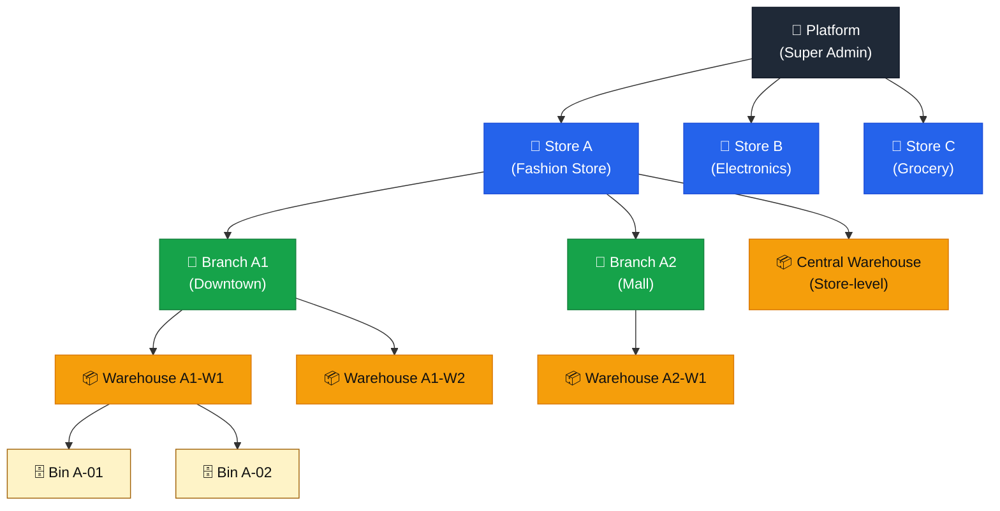

### 6.2 Store Isolation Layers

```
┌─────────────────────────────────────────────────────────────────┐
│                    STORE ISOLATION MODEL                        │
├─────────────────────────────────────────────────────────────────┤
│                                                                 │
│  Layer 1: HTTP Guard Chain                                      │
│  ├─ StoreContextMiddleware (resolve from JWT/host)             │
│  ├─ StoreIsolationGuard (validate store context)              │
│  └─ StoreStatusGuard (check subscription status)               │
│                                                                 │
│  Layer 2: Service Layer                                         │
│  ├─ RequestContextDto (storeId from context, NOT body)         │
│  └─ All services receive store-scoped context                  │
│                                                                 │
│  Layer 3: Repository Layer                                      │
│  ├─ All queries include store filter                           │
│  └─ .andWhere('e.storeId = :storeId', ctx)                    │
│                                                                 │
│  Layer 4: Database Layer                                        │
│  ├─ Composite FK (store_id, id) references                     │
│  ├─ Composite UK for business keys                              │
│  └─ Row-Level Security (optional)                               │
│                                                                 │
│  Layer 5: Infrastructure Layer                                  │
│  ├─ Cache keys: t:{storeId}:key                                │
│  ├─ File paths: t/{storeId}/path                               │
│  ├─ Queue jobs: { storeId } in payload                         │
│  └─ Search index: store-scoped                                 │
│                                                                 │
└─────────────────────────────────────────────────────────────────┘
```

### 6.3 Data Ownership Matrix

| Data Entity           | Scope     | Branch Link                | Notes                   |
| --------------------- | --------- | -------------------------- | ----------------------- |
| **Product/Variant**   | Store    | None                       | One SKU per store      |
| **Customer**          | Store    | `preferredBranchId` (info) | Can shop at any branch  |
| **Supplier**          | Store    | None                       | Serves any branch       |
| **Employee**          | Store    | `defaultBranchId`          | Single HR profile       |
| **Chart of Accounts** | Store    | None                       | Branch is dimension     |
| **Order**             | Store    | `branchId` (transaction)   | Attribution dimension   |
| **Inventory**         | Warehouse | Via warehouse              | Physical stock location |
| **Journal Entry**     | Store    | `branchId` (dimension)     | Reporting slice         |

---

## 7. Authentication & Authorization

### 7.1 RBAC Model

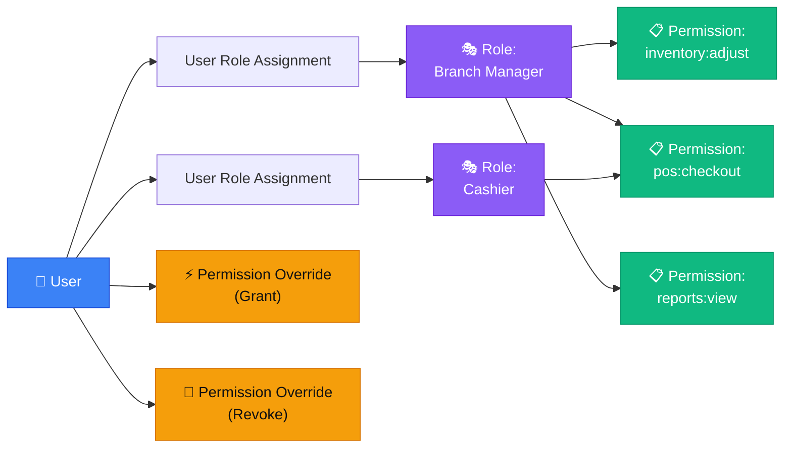

### 7.2 Permission Resolution Logic

```
Effective Permission = User Override (if exists) > Role Permissions

Resolution Steps:
1. Load all UserRoleAssignment records for the user
2. For each role assignment, load the role's permissions
3. Check for any UserPermissionOverride records
4. If override isGranted=false → DENY (even if role grants)
5. If override isGranted=true → GRANT (even if no role covers)
```

### 7.3 Access Control Layers

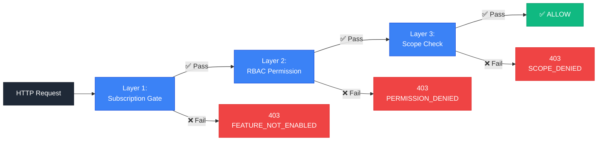

### 7.4 Standard Role Personas

| Persona              | Branch Scope        | Warehouse Scope | Typical Permissions              |
| -------------------- | ------------------- | --------------- | -------------------------------- |
| **Store Owner**     | ALL                 | ALL             | Full access                      |
| **Store Admin**     | ALL                 | ALL             | Full access (except super-admin) |
| **Branch Manager**   | EXPLICIT [B1]       | Derived         | Branch P&L, staff, POS           |
| **Regional Manager** | EXPLICIT [B1,B2,B3] | Derived         | Multi-branch oversight           |
| **Cashier**          | EXPLICIT [B1]       | Read-only       | POS checkout only                |
| **Warehouse Clerk**  | NONE                | EXPLICIT [W1]   | Receive, transfer, adjust        |
| **Accountant**       | ALL                 | NONE            | Finance read/write               |
| **HR Manager**       | ALL                 | NONE            | HRM read/write                   |
| **Auditor**          | ALL (read)          | ALL (read)      | Read-only everywhere             |

---

## 8. Database Architecture

### 8.1 Database Schema Overview

```mermaid
erDiagram
    %% System Domain
    STORE {
        uuid id PK
        varchar storeName
        varchar subdomain UK
        varchar customDomain UK
        enum status
        uuid subscriptionPlanId FK
        enum subscriptionStatus
        timestamp subscriptionEndsAt
    }

    BRANCH {
        uuid id PK
        uuid storeId FK
        varchar name
        varchar address
        boolean isActive
    }

    WAREHOUSE {
        uuid id PK
        uuid storeId FK
        uuid branchId FK "nullable"
        varchar name
        enum type "MAIN,RETAIL,TRANSIT,DROPSHIP"
    }

    %% Identity Domain
    USER {
        uuid id PK
        uuid storeId FK
        varchar email
        varchar passwordHash
        boolean isStaff
        boolean isActive
    }

    ROLE {
        uuid id PK
        uuid storeId FK
        varchar name
        boolean isSystemRole
    }

    PERMISSION {
        uuid id PK
        varchar code UK
        varchar module
    }

    USER_ROLE_ASSIGNMENT {
        uuid userId FK
        uuid roleId FK
        uuid scopeBranchId FK "nullable"
        uuid scopeWarehouseId FK "nullable"
    }

    ROLE_PERMISSION {
        uuid roleId FK
        uuid permissionId FK
    }

    %% Catalog Domain
    PRODUCT {
        uuid id PK
        uuid storeId FK
        varchar sku
        varchar name
        uuid categoryId FK
        uuid brandId FK
    }

    PRODUCT_VARIANT {
        uuid id PK
        uuid productId FK
        varchar sku
        varchar attributes
        decimal price
    }

    CATEGORY {
        uuid id PK
        uuid storeId FK
        varchar name
        uuid parentId FK "self-ref"
    }

    BRAND {
        uuid id PK
        uuid storeId FK
        varchar name
    }

    %% Sales Domain
    ORDER {
        uuid id PK
        uuid storeId FK
        uuid branchId FK "nullable"
        uuid customerId FK
        enum status
        decimal total
        enum source "POS,WEBSITE,ADMIN"
    }

    ORDER_ITEM {
        uuid id PK
        uuid orderId FK
        uuid variantId FK
        int quantity
        decimal unitPrice
        decimal totalPrice
    }

    CART {
        uuid id PK
        uuid userId FK
    }

    CART_ITEM {
        uuid id PK
        uuid cartId FK
        uuid variantId FK
        int quantity
    }

    %% Inventory Domain
    INVENTORY_LEDGER {
        uuid id PK
        uuid storeId FK
        uuid variantId FK
        uuid warehouseId FK
        int qtyDelta
        varchar refType
        uuid refId
        timestamp createdAt
    }

    STOCK_RESERVATION {
        uuid id PK
        uuid storeId FK
        uuid variantId FK
        uuid warehouseId FK
        uuid orderId FK
        int quantity
        enum status "ACTIVE,RELEASED,CONSUMED"
    }

    STOCK_TRANSFER {
        uuid id PK
        uuid storeId FK
        uuid sourceWarehouseId FK
        uuid destWarehouseId FK
        enum status
    }

    %% Procurement Domain
    PURCHASE_ORDER {
        uuid id PK
        uuid storeId FK
        uuid supplierId FK
        uuid warehouseId FK
        enum status
        decimal total
    }

    GOODS_RECEIVED_NOTE {
        uuid id PK
        uuid storeId FK
        uuid purchaseOrderId FK
        uuid warehouseId FK
        date receivedDate
    }

    %% Finance Domain
    CHART_OF_ACCOUNTS {
        uuid id PK
        uuid storeId FK
        varchar code
        varchar name
        enum type "ASSET,LIABILITY,EQUITY,REVENUE,EXPENSE"
    }

    JOURNAL_ENTRY {
        uuid id PK
        uuid storeId FK
        uuid branchId FK "dimension"
        varchar reference
        date entryDate
    }

    LEDGER_ENTRY {
        uuid id PK
        uuid journalEntryId FK
        uuid accountId FK
        uuid branchId FK "dimension"
        decimal debit
        decimal credit
    }

    %% CRM Domain
    CUSTOMER {
        uuid id PK
        uuid storeId FK
        varchar email
        uuid preferredBranchId FK "info only"
        enum membershipTier
    }

    WALLET_LEDGER {
        uuid id PK
        uuid storeId FK
        uuid userId FK
        decimal amount
        varchar refType
        uuid refId
    }

    LOYALTY_LEDGER {
        uuid id PK
        uuid storeId FK
        uuid userId FK
        int points
        varchar refType
        uuid refId
    }

    %% HRM Domain
    EMPLOYEE {
        uuid id PK
        uuid storeId FK
        uuid userId FK
        uuid defaultBranchId FK
        varchar employeeId
        date joinDate
    }

    ATTENDANCE {
        uuid id PK
        uuid storeId FK
        uuid employeeId FK
        uuid branchId FK
        timestamp checkIn
        timestamp checkOut
    }

    PAYSLIP {
        uuid id PK
        uuid storeId FK
        uuid employeeId FK
        uuid branchId FK
        decimal grossSalary
        decimal netSalary
        date payPeriod
    }

    %% Audit Domain
    AUDIT_LOG {
        uuid id PK
        uuid storeId FK
        uuid userId FK
        varchar action
        varchar resourceType
        uuid resourceId
        jsonb payload
        varchar ipAddress
        timestamp createdAt
    }

    %% Relationships
    STORE ||--o{ BRANCH : "has"
    STORE ||--o{ WAREHOUSE : "has"
    BRANCH ||--o{ WAREHOUSE : "owns (optional)"
    STORE ||--o{ USER : "has"
    STORE ||--o{ ROLE : "has"
    ROLE ||--o{ USER_ROLE_ASSIGNMENT : "assigned via"
    USER ||--o{ USER_ROLE_ASSIGNMENT : "has"
    ROLE ||--o{ ROLE_PERMISSION : "has"
    PERMISSION ||--o{ ROLE_PERMISSION : "granted via"
    STORE ||--o{ PRODUCT : "has"
    PRODUCT ||--o{ PRODUCT_VARIANT : "has"
    STORE ||--o{ ORDER : "has"
    ORDER ||--o{ ORDER_ITEM : "contains"
    STORE ||--o{ INVENTORY_LEDGER : "tracks"
    STORE ||--o{ CUSTOMER : "has"
    STORE ||--o{ EMPLOYEE : "has"
    STORE ||--o{ AUDIT_LOG : "logs"
```

### 8.2 Key Database Constraints

```sql
-- Composite unique indexes for store-scoped business keys
CREATE UNIQUE INDEX uq_product_sku_store
  ON products (store_id, sku) WHERE deleted_at IS NULL;

CREATE UNIQUE INDEX uq_customer_email_store
  ON customers (store_id, email) WHERE deleted_at IS NULL;

CREATE UNIQUE INDEX uq_branch_code_store
  ON branches (store_id, code) WHERE deleted_at IS NULL;

-- Composite foreign keys for store consistency
ALTER TABLE warehouses
  ADD CONSTRAINT warehouses_branch_same_store_fk
  FOREIGN KEY (store_id, branch_id)
  REFERENCES branches (store_id, id);

-- Partial indexes for common queries
CREATE INDEX idx_orders_store_status
  ON orders (store_id, status) WHERE deleted_at IS NULL;

CREATE INDEX idx_inventory_ledger_variant_warehouse
  ON inventory_ledger (store_id, variant_id, warehouse_id);
```

### 8.3 Ledger-First Design

| Truth                   | Source Table                              | Aggregation Method                         |
| ----------------------- | ----------------------------------------- | ------------------------------------------ |
| **Stock on hand**       | `inventory_ledger`                        | SUM by (storeId, variantId, warehouseId)  |
| **Available stock**     | `inventory_ledger` - `stock_reservations` | Computed in StockReservationService        |
| **Customer AR balance** | `ar_ledger`                               | SUM by (storeId, customerId)              |
| **Supplier AP balance** | `supplier_ap_ledger`                      | SUM by (storeId, supplierId)              |
| **GL account balance**  | `ledger_entries`                          | SUM by (storeId, accountId, fiscalPeriod) |
| **Wallet balance**      | `wallet_ledger`                           | SUM by (storeId, userId)                  |
| **Loyalty points**      | `loyalty_ledger`                          | SUM by (storeId, userId)                  |

> **Important:** No code path may UPDATE these aggregates directly. New rows only.

---

## 9. Infrastructure & Deployment

### 9.1 Docker Compose Architecture

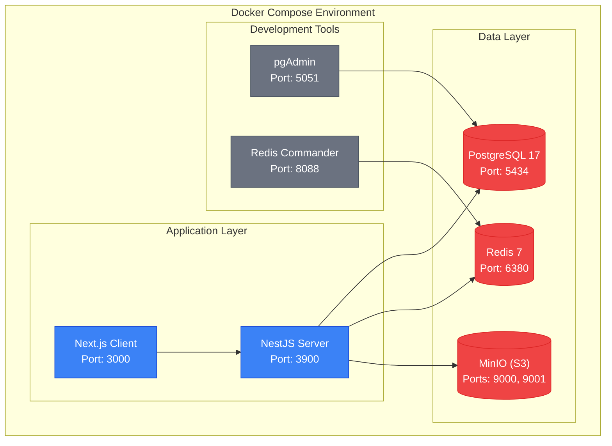

### 9.2 Production Deployment Topology

```
┌─────────────────────────────────────────────────────────────────┐
│                     PRODUCTION DEPLOYMENT                        │
├─────────────────────────────────────────────────────────────────┤
│                                                                 │
│  ┌─────────────────────────────────────────────────────────┐   │
│  │                    CDN / WAF                             │   │
│  │              (CloudFlare / AWS CloudFront)               │   │
│  └─────────────────────────────────────────────────────────┘   │
│                              │                                  │
│                              ▼                                  │
│  ┌─────────────────────────────────────────────────────────┐   │
│  │                 Load Balancer (Nginx/ALB)                │   │
│  └─────────────────────────────────────────────────────────┘   │
│                              │                                  │
│              ┌───────────────┼───────────────┐                 │
│              ▼               ▼               ▼                 │
│  ┌───────────────┐ ┌───────────────┐ ┌───────────────┐        │
│  │  API Instance │ │  API Instance │ │  API Instance │        │
│  │      #1       │ │      #2       │ │      #3       │        │
│  └───────────────┘ └───────────────┘ └───────────────┘        │
│                              │                                  │
│              ┌───────────────┼───────────────┐                 │
│              ▼               ▼               ▼                 │
│  ┌───────────────┐ ┌───────────────┐ ┌───────────────┐        │
│  │  PostgreSQL   │ │     Redis     │ │  Object Store │        │
│  │   Primary     │ │   (Managed)   │ │    (S3)       │        │
│  │      +        │ │               │ │               │        │
│  │   Replica     │ │               │ │               │        │
│  └───────────────┘ └───────────────┘ └───────────────┘        │
│                                                                 │
│  ┌─────────────────────────────────────────────────────────┐   │
│  │              Background Workers (BullMQ)                 │   │
│  │  ┌─────────┐ ┌─────────┐ ┌─────────┐ ┌─────────┐      │   │
│  │  │  Stock  │ │ Journal │ │  Email  │ │   PDF   │      │   │
│  │  │  Queue  │ │  Queue  │ │  Queue  │ │  Queue  │      │   │
│  │  └─────────┘ └─────────┘ └─────────┘ └─────────┘      │   │
│  └─────────────────────────────────────────────────────────┘   │
│                                                                 │
└─────────────────────────────────────────────────────────────────┘
```

### 9.3 Service Ports (Development)

| Service              | Port | Description            |
| -------------------- | ---- | ---------------------- |
| **Client (Next.js)** | 3000 | Frontend application   |
| **Server (NestJS)**  | 3900 | Backend API            |
| **PostgreSQL**       | 5434 | Primary database       |
| **Redis**            | 6380 | Cache & queue          |
| **MinIO API**        | 9000 | Object storage         |
| **MinIO Console**    | 9001 | Storage management UI  |
| **pgAdmin**          | 5051 | Database management UI |
| **Redis Commander**  | 8088 | Redis management UI    |

---

## 10. Key Workflows

### 10.1 Order-to-Cash Flow

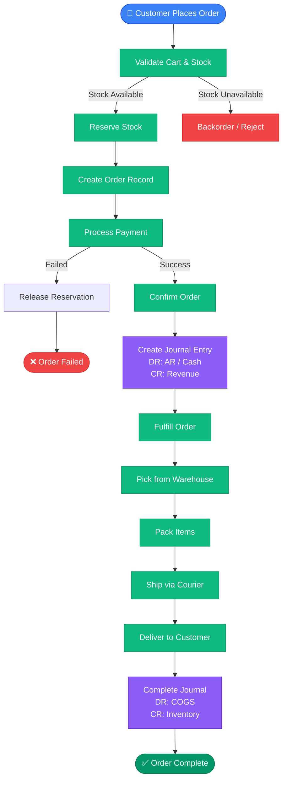

### 10.2 Procure-to-Pay Flow

```mermaid
flowchart TB
    Start(["📋 Purchase Request Created"])

    Start --> ApprovePR["Approve Purchase Request"]
    ApprovePR --> CreateRFQ["Create RFQ"]

    CreateRFQ --> SendRFQ["Send to Suppliers"]
    SendRFQ --> ReceiveQuotes["Receive Quotes"]
    ReceiveQuotes --> SelectSupplier["Select Supplier"]

    SelectSupplier --> CreatePO["Create Purchase Order"]
    CreatePO --> ApprovePO["Approve PO"]
    ApprovePO --> SendPO["Send PO to Supplier"]

    SendPO --> ReceiveGoods["Receive Goods"]
    ReceiveGoods --> CreateGRN["Create GRN<br/>Goods Received Note"]

    CreateGRN --> UpdateInventory["Update Inventory Ledger<br/>DR: Inventory<br/>CR: GR/IR"]

    UpdateInventory --> ReceiveInvoice["Receive Supplier Invoice"]
    ReceiveInvoice --> MatchInvoice["3-Way Match<br/>PO + GRN + Invoice"]

    MatchInvoice -->|"Match"| ApprovePayment["Approve Payment"]
    MatchInvoice -->|"Mismatch"| ResolveDiscrepancy["Resolve Discrepancy"]
    ResolveDiscrepancy --> ApprovePayment

    ApprovePayment --> ProcessPayment["Process Payment"]
    ProcessPayment --> CreateJournal["Create Journal Entry<br/>DR: GR/IR<br/>CR: AP"]

    CreateJournal --> End(["✅ Procurement Complete"])

    classDef start fill:#3b82f6,stroke:#1d4ed8,color:#fff
    classDef process fill:#10b981,stroke:#059669,color:#fff
    classDef journal fill:#8b5cf6,stroke:#6d28d9,color:#fff
    classDef success fill:#059669,stroke:#047857,color:#fff

    class Start start
    class ApprovePR,CreateRFQ,SendRFQ,ReceiveQuotes,SelectSupplier,CreatePO,ApprovePO,SendPO,ReceiveGoods,CreateGRN,UpdateInventory,ReceiveInvoice,MatchInvoice,ApprovePayment,ProcessPayment process
    class CreateJournal journal
    class End success
```

### 10.3 Inventory Transfer Flow

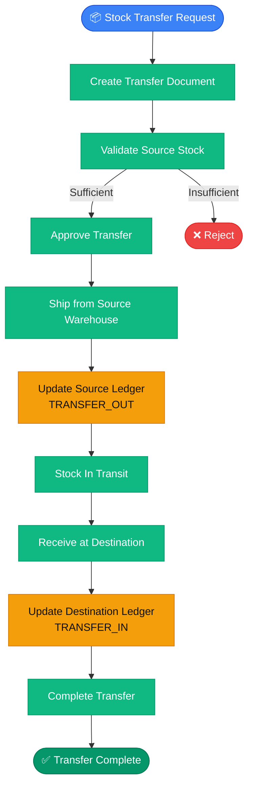

### 10.4 POS Sale Flow

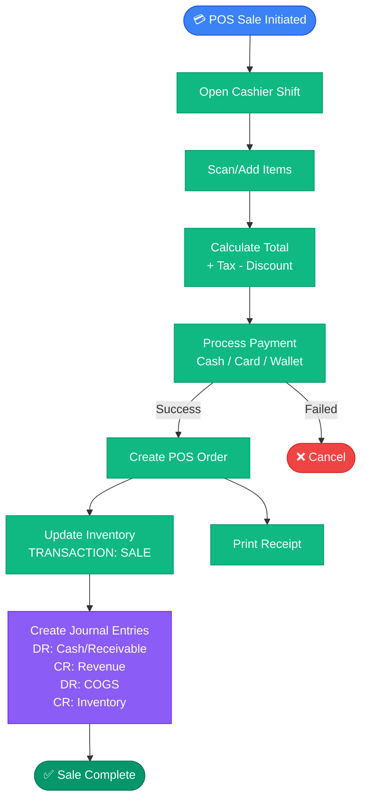

---

## 11. Design Principles

### 11.1 Core Principles

| #   | Principle                         | Description                                                                         |
| --- | --------------------------------- | ----------------------------------------------------------------------------------- |
| 1   | **Ledger First**                  | Stock and money are always derived from append-only ledgers, never mutable counters |
| 2   | **Store Isolation Everywhere**   | Every row, cache key, queue job, file path carries `storeId`                       |
| 3   | **Strong Consistency**            | DB transactions wrap source-of-truth writes; side effects go async via outbox       |
| 4   | **Idempotent Operations**         | Webhooks, POS sync, queue jobs are safe to retry                                    |
| 5   | **Human Approval for High-Risk**  | Stock adjustments, payments, payroll require permission + audit + reason            |
| 6   | **Feature-Gated by Subscription** | Plan entitlement checked separately from RBAC permission                            |
| 7   | **Boundary-Respecting**           | Store → Branch → Warehouse hierarchy enforced consistently                         |
| 8   | **Reversibility**                 | Every business mutation has a reversal path                                         |
| 9   | **Snapshots Over Joins**          | Order items, invoices store snapshots at time of event                              |
| 10  | **Boring Before Clever**          | Deterministic ERP first; AI/analytics on top later                                  |

### 11.2 Forbidden Patterns

| ❌ Anti-Pattern                 | ✅ Correct Approach                       |
| ------------------------------- | ----------------------------------------- |
| Globally unique SKU index       | Composite unique (store_id, sku)         |
| Read storeId from request body | Read from RequestContextDto               |
| Update variant.stock directly   | Insert row in inventory_ledger            |
| Move stock with UPDATE          | Create stock_transfer document            |
| Branch-specific products        | One SKU + warehouse stock + price book    |
| Hard-delete store              | Soft delete + retention worker            |
| Cross-store joins in app code  | Platform-level only with super-admin auth |

---

## Appendix

### A. Related Documents

| Document              | Location                                                 | Description              |
| --------------------- | -------------------------------------------------------- | ------------------------ |
| System Infrastructure | `doc/codebase-understanding/01_system_infrastructure.md` | System module details    |
| Auth & RBAC           | `doc/codebase-understanding/07_auth_and_rbac.md`         | Authentication details   |
| ERP System Design     | `doc/system-design/erp_master_system_design.md`          | Comprehensive ERP design |
| Database Design       | `doc/system-design/erp_master_database_design.md`        | Database schemas         |
| Low-Level Design      | `doc/system-design/erp_low_level_system_design.md`       | Module-level design      |
| Dataflow              | `doc/system-design/erp_master_dataflow.md`               | Request/response flows   |

### B. Glossary

| Term                 | Definition                                                |
| -------------------- | --------------------------------------------------------- |
| **Store**           | A business using the SaaS. Top-level isolation boundary.  |
| **Branch**           | Physical/logical business location belonging to a store. |
| **Warehouse**        | Physical storage location owning stock.                   |
| **Bin**              | Subdivision inside a warehouse (rack, shelf, zone).       |
| **Inventory Ledger** | Immutable append-only log of all stock movements.         |
| **Journal Entry**    | Balanced double-entry accounting record.                  |
| **Outbox Event**     | Row written in same DB transaction as business mutation.  |
| **Idempotency Key**  | Client-provided value preventing duplicate processing.    |
| **Feature Gate**     | Subscription-level check for feature access.              |
| **Permission**       | RBAC entitlement granting action rights.                  |
| **Scope**            | Branch/warehouse limit applied to user permissions.       |

---

> **Document Version:** 1.0  
> **Last Updated:** 2026-06-07  
> **Generated By:** OWL (AI Assistant)
