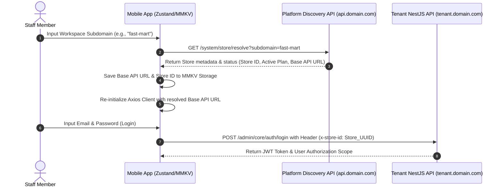
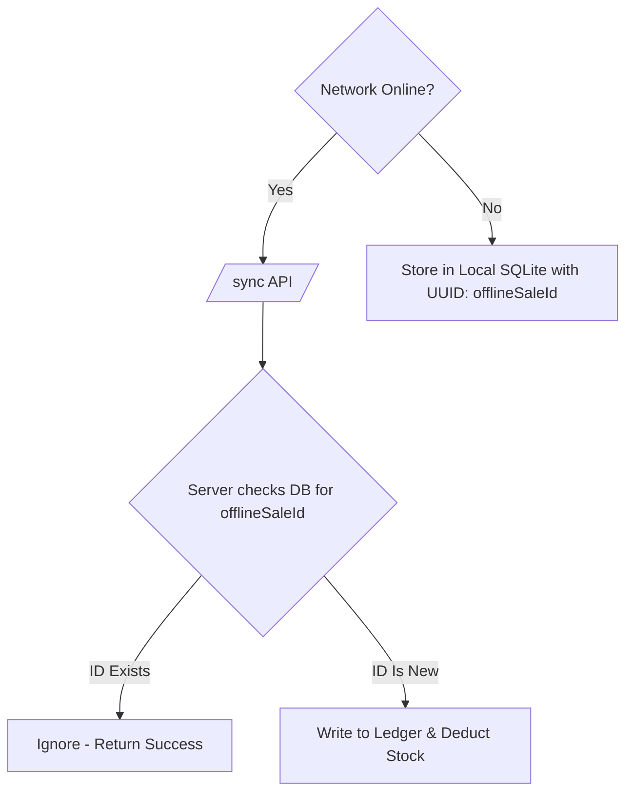

# React Native Mobile App Development Blueprint
## eCommerce Multi-Store SaaS ERP Platform

This document serves as the **A to Z Guide** for building a companion React Native mobile application for the **Enterprise Multi-Store SaaS ERP Platform**. It outlines how the modular monolith NestJS web backend server located at [server/](file:///home/gowtamkumar/projects/eCommerce-multi-store-saas-erp/server) is consumed, how the mobile UI should be structured, and what hardware integrations are needed.

---

## 1. Executive Strategy: Who is the Mobile App For?

An ERP system contains broad business logic. Creating a single monolithic mobile application can result in high maintenance overhead and a cluttered user experience. We define a **two-app strategy** or a **Unified App with Strict Persona Gating** to separate public consumer functions from internal operations.

```
                  ┌─────────────────────────────────────────┐
                  │          Multi-Store SaaS ERP           │
                  │              (NestJS API)               │
                  └────────────────────┬────────────────────┘
                                       │
            ┌──────────────────────────┴──────────────────────────┐
            ▼                                                     ▼
┌─────────────────────────┐                             ┌─────────────────────────┐
│   Consumer Storefront   │                             │  Staff & Operations ERP │
│   (Customer Shopping)   │                             │      (POS, WMS, HR)     │
└─────────────────────────┘                             └─────────────────────────┘
  - Browse Products & Cats                                - Mobile Point of Sale (POS)
  - Cart, Wishlist, checkout                              - Warehouse Scan & Counts (WMS)
  - Wallet & Loyalty Points                               - HRM Geofenced Attendance
  - Support & Order History
```

### 1.1 Persona Matrices & Scopes

The mobile architecture targets four distinct user roles, each with specific interface scopes, security permissions, and offline needs:

| User Persona | Application Domain | Core Scopes Required | Hardware Access | Offline Requirement |
| :--- | :--- | :--- | :--- | :--- |
| **Retail Cashier** | Staff & Operations | `branchId` (Session locked) | Camera, ESC/POS Printer, Haptics | **High** (Must support complete checkout, offline cart, and sync) |
| **WMS Clerk** | Staff & Operations | `warehouseId` (Session locked) | Camera (Continuous Scanning) | **Medium** (Count sheets, transfers pre-fetched; uploads online) |
| **Company Employee** | Staff & Operations | `employeeId` (Auth resolved) | GPS Location, Front Camera (Selfie) | **Low** (Must be online to punch timecard) |
| **Consumer (Customer)** | Consumer Storefront | `storeId` (Global lock) | Push Notifications, Apple/Google Pay | **Low** (Requires active network connection for checkout) |

### 1.2 Multi-Tenant Strategy
*   **Staff App**: A single application published to the stores. Staff input their company workspace domain (tenant resolved via `/system/store/resolve`) to direct API calls to their store's partitioned database context.
*   **Consumer App**: A white-labeled template compiled and built per tenant using distinct bundling IDs (e.g. `com.storename.app`), hardcoding the `STORE_ID` inside the build environmental config.

---

## 2. Detailed Technical Stack & Mobile Architecture

The mobile app must utilize Expo's modern prebuild system to ensure rapid prototyping while supporting native hardware modules.

### 2.1 Dependency Matrix & Rationale

| Dependency Category | Library | Version Group | Implementation Rationale |
| :--- | :--- | :--- | :--- |
| **Runtime & Core** | `expo` | `~51.0.0` or higher | Managed native project configuration, OTA updates, and native wrappers. |
| **Routing** | `expo-router` | matching Expo | File-system-based navigation matching Next.js. Supports multi-group layouts. |
| **Styling** | `nativewind` + `tailwindcss` | `^4.0.0` | Utilizes Tailwind styling tokens directly, sharing colors with the web UI. |
| **Local DB Engine** | `expo-sqlite` | matching Expo | Local SQLite database for offline products, carts, and transaction queues. |
| **Key-Value Store** | `react-native-mmkv` | `^3.0.0` | Ultra-fast synchronous storage for access tokens and user settings. |
| **Secure Keyring** | `expo-secure-store` | matching Expo | Hardware-backed keychain storage for JWT credentials and biometrics. |
| **Server State** | `@tanstack/react-query`| `^5.0.0` | Declarative data fetching, stale-while-revalidate caching, and mutations. |
| **API Client** | `axios` | `^1.7.0` | Interceptor chain to inject headers (`x-store-id`, `x-branch-id`, JWT). |
| **Scanning** | `expo-camera` | matching Expo | Custom barcode overlay rendering with fast haptic callback triggers. |
| **Location** | `expo-location` | matching Expo | Background/foreground high-accuracy GPS coordinates for HR punching. |
| **Print Output** | `expo-print` / ESC-POS | matching Expo | Bluetooth, Wi-Fi, and USB thermal printer raw ESC/POS command parser. |

### 2.2 Global App Architecture Directory Layout

```
native-app/
├── app.json                         # Expo configuration (plugins, bundle IDs)
├── tailwind.config.js               # Tailwind variables matching web client
└── src/
    ├── app/                         # Expo Router Folder
    │   ├── _layout.tsx              # Root Layout, Providers, Theme setups
    │   ├── onboarding/              # Workspace/Tenant lookup routes
    │   ├── auth/                    # Auth, Login, Scope selection
    │   ├── (pos)/                   # POS Route Group (Drawer, Terminal, Cart)
    │   ├── (wms)/                   # WMS Route Group (GRN, Transfer, Count)
    │   ├── (hrm)/                   # HRM Route Group (Punch, Leaves, Pay)
    │   └── (storefront)/            # Consumer Shopping Layout Group
    ├── components/                  # UI Components (NativeWind styled)
    │   ├── ui/                      # Button, Input, Card primitives
    │   └── camera-scanner.tsx       # Shared Camera Scanner modal
    ├── constants/                   # Theme tokens, geofence values
    ├── hooks/                       # useAuth, useOfflineCart, useScanner
    └── lib/
        ├── api-client.ts            # Axios configuration
        ├── local-db.ts              # SQLite database controllers
        └── store.ts                 # Zustand client stores
```

---

## 3. Architecture Alignment: Multi-Store & Security

The mobile app operates as a client of the NestJS server located at [server/](file:///home/gowtamkumar/projects/eCommerce-multi-store-saas-erp/server). It must respect the strict database isolation and guard rules defined in the backend architecture.

### 3.1 Tenant & Domain Resolution Sequence

To prevent cross-tenant data leakage, the mobile app resolves tenant endpoints dynamically before executing any login requests.



### 3.2 Secure API Authentication Flow & RBAC Guards

The mobile app must parse the user roles and scopes received from the `/admin/core/user/me` endpoint. The client handles authorization locally by implementing permission gates.

```typescript
// src/hooks/usePermission.ts
import { useAuthStore } from '@/lib/store';

export function usePermission() {
  const { user } = useAuthStore();
  
  const hasPermission = (code: string): boolean => {
    if (!user) return false;
    
    // Store Owner has absolute access
    if (user.roles.some(r => r.name === 'Store Owner')) return true;
    
    // Resolve overrides first (explicit denials)
    const override = user.permissionOverrides?.find(o => o.permissionCode === code);
    if (override) return override.isGranted;
    
    // Resolve standard role permissions
    return user.roles.some(role => 
      role.permissions.some(p => p.code === code)
    );
  };

  return { hasPermission };
}
```

*   **UI Enforcement**: Wrap dashboard blocks, scanner modules, and POS cash buttons in a `<PermissionGate code="pos:checkout">` component. If permission checks fail, the user is navigated away or visual overlays are displayed.
*   **Branch/Warehouse Scope Gating**: Session storage must keep `activeBranchId` or `activeWarehouseId` variables. All operations (fetching catalog items, adjusting inventory, making sales) must append these scoped IDs into request payloads or headers (`x-branch-id`, `x-warehouse-id`).

### 3.3 Offline Synchronization & Idempotency Controls

Retail stores cannot halt operations when connection drops. The React Native app must feature offline robustness matching the web browser's IndexedDB pattern, utilizing an idempotent sync API.

1.  **Local SQLite Cache**: The app downloads and syncs product pricing books and inventory lists whenever connection is active.
2.  **Offline Transaction Storage**: When the app detects it is offline (`NetInfo.isConnected === false`), or when a network request fails with a timeout:
    *   Generate a client-side transaction UUID: `clientSaleId` (stored in the database table as `offlineSaleId`).
    *   Write the payload structure directly to the local SQLite transaction queue.
    *   Show a banner: `"Running in Offline Mode - Transaction Saved Locally"`.
3.  **Idempotent Background Synchronization**:
    *   A background job listens for network reconnection.
    *   When reconnected, the app sends a batch POST to `server/src/modules/admin/sales/pos` at the `/sync` endpoint, including the `offlineSaleId` in the body.
    *   **Idempotency Check**: The NestJS server evaluates the `offlineSaleId`. If the ID exists in the database, the server returns a `201 Success` immediately without duplicate processing. If it is new, it processes the sale, updates the general ledger, and releases the inventory transaction, guaranteeing zero duplicate entries.



### 3.4 Ledger & Stock Security Constraints
*   **Negative Stock Gating**: The local SQLite database checks the store's settings. If `allowNegativeStock === false` and the local item count is `0`, the checkout buttons are disabled to prevent out-of-sync inventory logs.
*   **Ledger Rules**: Transactions are logged as draft journal ledger adjustments locally, and are strictly marked as unverified until the NestJS server returns verification IDs during the background sync.

---

## 4. Screen-by-Screen Implementation Guide (A to Z)

Here is the exact screen-by-screen roadmap for the mobile application layout, outlining UI structures, required state schemas, endpoints mapped to the backend server in `/server`, and detailed offline-first behavior patterns.

### A. Authentication & Onboarding
*   **Target Backend Module:** [AuthModule](file:///home/gowtamkumar/projects/eCommerce-multi-store-saas-erp/server/src/modules/admin/core/auth) / [RBACModule](file:///home/gowtamkumar/projects/eCommerce-multi-store-saas-erp/server/src/modules/admin/core/rbac)
*   **Screens to Build:**
    1.  `app/onboarding/tenant.tsx` (Tenant Domain Lookup)
        *   **UI Layout**: Standard card layout with input for workspace subdomains (e.g. `fast-mart`), dynamic validation alerts, and a loading spinner button.
        *   **API Mapping**: `GET /system/store/resolve?subdomain=:subdomain`
        *   **State & Storage**: If successful, saves `{ storeId, apiBaseUrl, storeName }` into local MMKV storage and redirects to the Login screen.
    2.  `app/auth/login.tsx` (Secure Login & Biometrics)
        *   **UI Layout**: Input fields for Email and Password (with toggle hide/show), biometric login button icon, submit button, and forgot password triggers.
        *   **API Mapping**: `POST /admin/core/auth/login` (request body: `{ email, password }`)
        *   **State & Storage**: On success, the response JWT credentials `{ accessToken, refreshToken }` are committed to the secure keyring (`expo-secure-store`). User details are saved in the Zustand `useAuthStore`.
    3.  `app/auth/scope-select.tsx` (Branch & Warehouse Selection Gate)
        *   **UI Layout**: Dropdown selectors loaded with active Branch assignments and Warehouse scopes. Display warnings if no active scopes are found. A button to finalize selection and initialize the dashboard router.
        *   **API Mapping**: Resolves from profile data at `GET /admin/core/user/me`
        *   **State & Storage**: Saves selected `activeBranchId` and `activeWarehouseId` to session state inside Zustand. All subsequent Axios requests inject these parameters into headers.

### B. Mobile Point of Sale (POS) Terminal
*   **Target Backend Module:** [POSModule](file:///home/gowtamkumar/projects/eCommerce-multi-store-saas-erp/server/src/modules/admin/sales/pos)
*   **Screens to Build:**
    1.  `app/(pos)/register.tsx` (Shift Register Controls)
        *   **UI Layout**: If register is closed: Input for opening cash balance float, notes field, and "Open Register" action. If register is open: Expected cash calculation cards, input for actual closing drawer cash balance, discrepancy metrics, and a "Close Register & Print Z-Report" button.
        *   **API Mapping**:
            *   Open Shift: `POST /admin/sales/pos/shift/open` (body: `{ openingBalance, notes }`)
            *   Close Shift: `POST /admin/sales/pos/shift/close` (body: `{ closingBalance, notes, actualBalance }`)
        *   **State & Storage**: Registers active shift state `activeShiftId` in the local Zustand store.
    2.  `app/(pos)/terminal.tsx` (POS Grid & Barcode Scanning)
        *   **UI Layout**: Grid system displaying product item cards (thumbnail, name, SKU, price, stock quantity). Category tabs at the top for quick filters. A floating barcode scanner button to pop open a camera overlay sheet for rapid continuous product additions.
        *   **API Mapping**: `GET /admin/catalog/products?branchId=:branchId`
        *   **State & Storage**: Syncs catalog locally to SQLite database `cached_products` schema for complete offline search and grid load speeds.
    3.  `app/(pos)/cart.tsx` (Cart & Promotion Builder)
        *   **UI Layout**: List of items in the cart showing variant selections, quantity increment controllers, and swipe-to-delete actions. Customer search and link button (allows tracking loyalty accounts). Discount coupon input field.
        *   **API Mapping**:
            *   Validate Coupon: `POST /admin/sales/coupon/validate` (body: `{ code, cartTotal }`)
            *   Find Customer: `GET /admin/customer/search?query=:query`
        *   **State & Storage**: Cart state managed via a fast Zustand store: `items: Array<{ variantId, qty, unitPrice, discount }>`, `appliedCoupon`, `customerId`.
    4.  `app/(pos)/checkout.tsx` (Tender & Receipt Printer Layout)
        *   **UI Layout**: Checkout summary displaying items total, applied discounts, tax details, and final due amount. Quick-cash buttons, Card terminal indicators, Split Payment sliders, and a "Finalize Transaction" action button.
        *   **API Mapping**: `POST /admin/sales/pos/order`
        *   **Offline Synchronization Logic**: If network request fails, saves payload locally into SQLite table `offline_orders` with a generated transaction UUID `clientSaleId` (mapping to backend field `offlineSaleId`). Upon connection recovery, syncs batch data to `/admin/sales/pos/sync` which evaluates idempotency rules to prevent duplicate accounting ledgers.

### C. Warehouse Management System (WMS) & Inventory
*   **Target Backend Module:** [LogisticsModule](file:///home/gowtamkumar/projects/eCommerce-multi-store-saas-erp/server/src/modules/admin/operations/logistics)
*   **Screens to Build:**
    1.  `app/(wms)/grn-list.tsx` (Goods Received Note List)
        *   **UI Layout**: Searchable lists grouped by status (Pending, Partially Received, Verified). Displaying Supplier names, PO References, and delivery dates.
        *   **API Mapping**: `GET /admin/logistics/grn?warehouseId=:warehouseId`
        *   **State & Storage**: Pre-fetches GRN items using TanStack Query, enabling instant loading of the details list.
    2.  `app/(wms)/grn-detail.tsx` (GRN Scan & Verify Receiver)
        *   **UI Layout**: Displays expected item quantities vs received quantities. Triggers the barcode scanner camera continuously. Scanning an item increments the `qtyReceived` indicator. Displays color warnings for variances. Fields for lot number and expiry entries (FEFO tracking support).
        *   **API Mapping**: `POST /admin/logistics/grn/:id/verify` (body: `{ items: Array<{ variantId, qtyReceived, lotNumber, expiryDate }> }`)
        *   **State & Storage**: Saves intermediate scan counts locally to SQLite.
    3.  `app/(wms)/stock-count.tsx` (Cycle Counting)
        *   **UI Layout**: Warehouse Bin selection selector. List of items expected in the bin. Scanner overlay counts items as they are scanned. Shows discrepancies (variance count) immediately on screen.
        *   **API Mapping**: `POST /admin/logistics/inventory/count-adjust` (body: `{ warehouseId, items: Array<{ variantId, countedQty, systemQty }> }`)
        *   **State & Storage**: Validates inventory variances and forces double-check counts if discrepancies exceed 10%.
    4.  `app/(wms)/stock-transfer.tsx` (Warehouse Transfers)
        *   **UI Layout**: Source and Destination Warehouse dropdown fields. Scan items to transfer. Digital signature input canvas for drivers and receiver verification.
        *   **API Mapping**: `POST /admin/logistics/inventory/transfer` (body: `{ fromWarehouseId, toWarehouseId, items: Array<{ variantId, qty }> }`)

### D. HRM & Employee Portal
*   **Target Backend Module:** [HRMModule](file:///home/gowtamkumar/projects/eCommerce-multi-store-saas-erp/server/src/modules/admin/operations/hrm)
*   **Screens to Build:**
    1.  `app/(hrm)/attendance.tsx` (Geofenced Punch-Clock)
        *   **UI Layout**: Current timestamp display. Active location coordinate checker widget. Displays status indicators (e.g. "Inside Branch Boundary" in green or "Outside Geofence" in red). A single large button for "Punch In" / "Punch Out". Camera capture popup for visual identity verification.
        *   **API Mapping**: `POST /admin/operations/hrm/attendance/punch` (body: `{ type: 'IN' | 'OUT', lat, lng, timestamp, selfieUrl }`)
        *   **State & Storage**: Requires location permissions. Checks radius limits against branch coordinates retrieved from the user profiles payload.
    2.  `app/(hrm)/leaves.tsx` (Leave Tracker & Requests)
        *   **UI Layout**: Grid displaying current balances (Sick, Casual, Annual leaves). List of past request cards showing approval states. A floating "Request Leave" button opening a form with date selection calendars, type dropdowns, reason text fields, and document upload triggers.
        *   **API Mapping**:
            *   Get summary: `GET /admin/operations/hrm/leaves/summary`
            *   Submit request: `POST /admin/operations/hrm/leaves/request` (supports multipart/form-data for PDF attachments)
    3.  `app/(hrm)/payroll.tsx` (Monthly Payslips)
        *   **UI Layout**: Simple lists of monthly payroll runs. Tap a record to open an inline PDF viewer showing detailed calculations (Basic pay, overtime bonuses, tax deductions, provident fund entries).
        *   **API Mapping**: `GET /admin/operations/hrm/payroll/payslips`

### E. Consumer eCommerce Storefront App
*   **Target Backend Modules:** [StoreCartModule](file:///home/gowtamkumar/projects/eCommerce-multi-store-saas-erp/server/src/modules/store/cart), [StoreReturnModule](file:///home/gowtamkumar/projects/eCommerce-multi-store-saas-erp/server/src/modules/store/return), [ShippingAddressModule](file:///home/gowtamkumar/projects/eCommerce-multi-store-saas-erp/server/src/modules/store/shipping-address), [StoreWalletModule](file:///home/gowtamkumar/projects/eCommerce-multi-store-saas-erp/server/src/modules/store/wallet), [WishlistModule](file:///home/gowtamkumar/projects/eCommerce-multi-store-saas-erp/server/src/modules/store/wishlist)
*   **Screens to Build:**
    1.  `app/(storefront)/home.tsx` (Home Feed & Marketing)
        *   **UI Layout**: Auto-scrolling image sliders for campaigns/banners. Horizontal scrolling categories bubbles. Product grids with card layouts showing pricing, discounts, ratings, and a quick-add cart button.
        *   **API Mapping**: `GET /store/feed`
        *   **State & Storage**: Prefetches catalog indexes using React Query to achieve zero-latency navigation.
    2.  `app/(storefront)/search.tsx` (Catalog Browsing & Filters)
        *   **UI Layout**: Sticky search bar, category chips, and a filter sheet slider (options for Brand, Price Range sliders, and Rating counts).
        *   **API Mapping**: `GET /store/catalog/products?search=:search&category=:cat&brand=:brand&priceMin=:min&priceMax=:max`
    3.  `app/(storefront)/product/[id].tsx` (Product Details & Variants)
        *   **UI Layout**: Large image carousels with zoom. Name, description, and ratings grids. Variant swatches (sizes, color selections). Add-to-cart buttons with quantity counters.
        *   **API Mapping**: `GET /store/catalog/products/:id`
        *   **State & Storage**: Keeps a list of recently viewed product IDs locally in MMKV.
    4.  `app/(storefront)/cart.tsx` (Shopping Cart Manager)
        *   **UI Layout**: List of items, variant details, subtotal summary cards, coupon code validator inputs, and checkout transition buttons.
        *   **API Mapping**:
            *   Add Item: `POST /store/cart/items`
            *   Modify Quantity: `PATCH /store/cart/items/:itemId` (body: `{ quantity }`)
            *   Delete: `DELETE /store/cart/items/:itemId`
        *   **State & Storage**: Syncs cart contents to backend database when authenticated, otherwise falls back to a local cart state in Zustand.
    5.  `app/(storefront)/checkout.tsx` (Address & Courier Gateway)
        *   **UI Layout**: Selected shipping address cards, courier option radio buttons, split shipping summaries, online payment gateway modules (e.g. Stripe card fields), and final checkout submission buttons.
        *   **API Mapping**: `POST /store/orders/checkout` (body: `{ addressId, courierId, paymentMethod, couponCode }`)
    6.  `app/(storefront)/profile.tsx` (User Account & Ledgers)
        *   **UI Layout**: Account avatar header. Cards displaying Wallet Balance (with top-up prompts) and Loyalty Points. Scrollable list menus for Order History, Return Request logs, and Address book controls.
        *   **API Mapping**:
            *   Wallet status: `GET /store/wallet/balance`
            *   Order history: `GET /store/orders/history`
            *   Request returns: `POST /store/returns/request`

---

## 5. Key Native Integrations & Library Mapping

Below is a reference guide for libraries that need to be configured in the React Native project to handle mobile-specific hardware capabilities.

```
                  ┌────────────────────────────────────────┐
                  │         NATIVE APP HARDWARE            │
                  └───────────────────┬────────────────────┘
                                      │
         ┌────────────────────────────┼────────────────────────────┐
         ▼                            ▼                            ▼
┌──────────────────┐        ┌──────────────────┐         ┌──────────────────┐
│   expo-camera    │        │  expo-location   │         │    expo-print    │
│ Barcode Scanning │        │   GPS Geofence   │         │ Thermal Printer  │
│ (POS & WMS)      │        │   (HRM Punch)    │         │ (POS Receipts)   │
└──────────────────┘        └──────────────────┘         └──────────────────┘
```

1. **Barcode / QR Code Scanning (`expo-camera` or `react-native-vision-camera`)**
   * *Usage:* Integrated directly into WMS and POS screens.
   * *Best Practice:* Use a bounding box frame overlay and trigger a short haptic buzz (`expo-haptics`) upon a successful scan to notify the user.

2. **GPS Geofencing (`expo-location` + geofencing maths)**
   * *Usage:* HRM Attendance module.
   * *Algorithm:*
     ```typescript
     import * as Location from 'expo-location';

     async function checkGeofence(branchLat: number, branchLng: number, radiusMeters: number) {
       const { coords } = await Location.getCurrentPositionAsync({});
       const distance = calculateHaversineDistance(coords.latitude, coords.longitude, branchLat, branchLng);
       return distance <= radiusMeters; // Allow punch only if inside boundary
     }
     ```

3. **Receipt Printing (`expo-print` or `react-native-thermal-receipt-printer`)**
   * *Usage:* POS cashier printing.
   * *Standard:* Support Bluetooth/Wi-Fi ESC/POS printers. Register shifts print Z-Reports, checkout prints purchase slips.

4. **Biometric Security (`expo-local-authentication`)**
   * *Usage:* Lock the app after 5 minutes of inactivity. Quick unlock via FaceID or TouchID to prevent customer checkout delays.

---

## 6. A to Z Step-by-Step Build Order

Follow this roadmap to build out the application in stages.

### Phase 1: Setup, Themes & Global Client
1. Initialize the project with Expo Prebuild support (if adding custom native packages later).
2. Configure **NativeWind** to share the theme/color variables (`NAV_THEME`) matching the web dashboard (dark/light themes).
3. Setup **Axios Client** with interceptors. If a token is stored, attach it: `headers['Authorization'] = `Bearer ${token}`. If a branch is selected, attach `headers['x-branch-id'] = selectedBranchId`.

### Phase 2: Gateway & Authentication
1. Build the Tenant Discovery screen.
2. Build the Login screen and secure Token storage.
3. Build the User Scope selector (Branch/Warehouse router).

### Phase 3: The WMS Operations Engine
*Why build WMS first?* WMS is simpler than POS and introduces barcode scanning early on.
1. Build GRN verification scanning.
2. Build warehouse inventory count adjusters.

### Phase 4: Point of Sale (POS) Integration
1. Configure `expo-sqlite` database schema for offline synchronization.
2. Build the cashier register panel (Open / Close shift).
3. Build the cart builder & product search screen.
4. Integrate the receipt printer module.

### Phase 5: HRM Geofenced Punching
1. Design the dashboard widget for quick punch in/out.
2. Add location permissions checking and geofence verification logic.

### Phase 6: Consumer eCommerce Storefront Integration
1. Configure build-time environment variables (`STORE_ID`) to locked subdomains.
2. Build the main shopping tabs (Home, Catalog, Cart, and Account Profile).
3. Connect search and category browsing to customer-facing catalog APIs.
4. Implement standard shipping-address selection and online payment gateways (e.g., Stripe, SSLCommerz).

---

## 7. Build, Testing & EAS Deployment

### Testing Strategies
*   **API Mocking:** Use MSW (Mock Service Worker) for testing mobile features when the NestJS server is offline.
*   **E2E Testing:** Use **Maestro** (recommended) or **Detox** to run end-to-end user flows (e.g., scanning an item, checking out, verifying the order count).

### Deployment Setup (EAS)
1. **Configure EAS Build** (`eas.json`):
   ```json
   {
     "cli": { "version": ">= 9.0.0" },
     "build": {
       "development": {
         "developmentClient": true,
         "distribution": "internal"
       },
       "preview": { "distribution": "internal" },
       "production": {}
     }
   }
   ```
2. **Over-The-Air (OTA) Updates (`expo-updates`):**
   * Use OTA updates to push bug fixes (such as updating pricing rules or WMS layouts) immediately without waiting for App Store / Google Play review approval.
