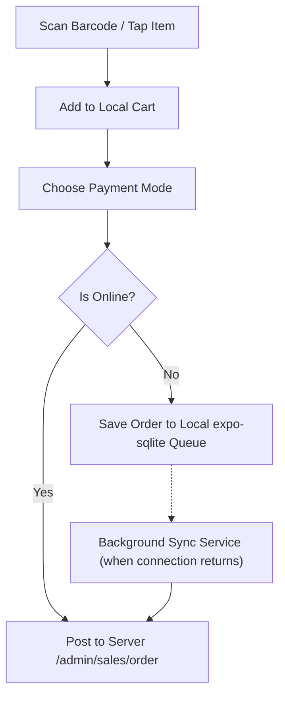

# React Native Mobile App Development Blueprint
## eCommerce Multi-Store SaaS ERP Platform

This document serves as the **A to Z Guide** for building a companion React Native mobile application for the **Enterprise Multi-Store SaaS ERP Platform**. It outlines how the modular monolith NestJS web backend server located at [server/](file:///home/gowtamkumar/projects/eCommerce-multi-store-saas-erp/server) is consumed, how the mobile UI should be structured, and what hardware integrations are needed.

---

## 1. Executive Strategy: Who is the Mobile App For?

An ERP system serves various roles. Creating a single app for both the end-consumer and internal staff can result in bloating. We recommend a **two-app strategy** or a **Unified Staff Companion App** with strict Role-Based Access Control (RBAC).

```
                  ┌─────────────────────────────────────────┐
                  │          Multi-Store SaaS ERP           │
                  └────────────────────┬────────────────────┘
                                       │
            ┌──────────────────────────┴──────────────────────────┐
            ▼                                                     ▼
┌─────────────────────────┐                             ┌─────────────────────────┐
│   Consumer Storefront   │                             │  Staff & Operations ERP │
│   (Customer Shopping)   │                             │      (POS, WMS, HR)     │
└─────────────────────────┘                             └─────────────────────────┘
  - Browse Products & Cats                                - Mobile Point of Sale (POS)
  - Cart, Wishlist, checkout                              - Warehouse Scan & Counts (WMS)
  - Wallet & Loyalty Points                               - HRM Geofenced Attendance
  - Support & Order History
```

### Core Targets: Staff & Operations Companion App & Consumer eCommerce Storefront App
This guide covers both the **Staff & Operations Companion App** (for internal business workflows like POS, WMS, and HRM) and the **Consumer eCommerce Storefront App** (for customer shopping, cart management, and online checkout), showing how to implement their respective screens and features using React Native.

---

## 2. Technical Stack Recommendation

To match the existing ecosystem and ensure high performance, the following mobile stack is recommended:

| Tech Component | Recommended Technology | Purpose / Rationale |
| :--- | :--- | :--- |
| **Framework** | **Expo (React Native)** | Simplifies updates, builds (EAS), and native library integrations. |
| **Navigation** | **Expo Router** | File-based routing that matches Next.js app routing. |
| **Styling** | **NativeWind (Tailwind CSS v4)** | Direct parity with the web client (`client` uses Tailwind CSS v4). |
| **State Management**| **Zustand** + **TanStack Query** | Zustand for local app state; Query for server caching, offline prefetching. |
| **API Client** | **Axios** | Standardized request interception for multi-tenant headers. |
| **Local Storage** | **react-native-mmkv** | High-performance key-value storage for tokens, settings, and cache. |
| **Offline DB** | **expo-sqlite** | Relational local storage required for offline POS queue processing. |
| **Icons** | **lucide-react-native** | Matches Lucide icons used in the Next.js web client. |

---

## 3. Architecture Alignment: Multi-Store & Security

The mobile app connects to the main backend NestJS web server located at [server/](file:///home/gowtamkumar/projects/eCommerce-multi-store-saas-erp/server) and must adhere to the core design foundations of this backend modular monolith (see [ARCHITECTURE.md](file:///home/gowtamkumar/projects/eCommerce-multi-store-saas-erp/doc/ARCHITECTURE.md)).

### 3.1 Tenant & Domain Resolution
The backend uses a `StoreContextMiddleware` to resolve the current store from the subdomain or custom domain. On mobile, this must be handled dynamically:
1. **Tenant Discovery Screen**: Upon first load, users enter their store's workspace name (e.g., `my-shop`).
2. **Domain Mapping**: The app hits a platform-level API `https://api.domain.com/system/store/resolve?tenant=my-shop` to get the base API URL (custom domain or subdomain) and store status.
3. **Subdomain Header**: The resolved URL becomes the base endpoint, and the header `x-store-id` (or subdomain host) is attached to all API requests.

### 3.2 Secure API Authentication Flow
```
Mobile Login (Email/Password)
     │
     ▼
API: /admin/core/auth/login ──> Returns Access Token & Refresh Token
     │
     ▼
Save to SecureStore (react-native-mmkv / expo-secure-store)
     │
     ▼
API: /admin/core/user/me ──> Get User Profile, User Roles & Permissions
     │
     ▼
Resolve User Scopes (Branch ID & Warehouse ID constraints)
```

> [!IMPORTANT]
> Since users can belong to multiple branches (e.g., a cashier scopes to Branch A; a warehouse manager to Warehouse B), the login flow **MUST** present a **Scope Selection Screen** immediately after login if the user has multiple scopes assigned.

---

## 4. Screen-by-Screen Implementation Guide (A to Z)

Here are the specific modules and UI scopes to build in the mobile app, mapped directly to their backend counterparts.

### A. Authentication & Onboarding
*   **Target Backend Module:** [AuthModule](file:///home/gowtamkumar/projects/eCommerce-multi-store-saas-erp/server/src/modules/admin/core/auth) / [RBACModule](file:///home/gowtamkumar/projects/eCommerce-multi-store-saas-erp/server/src/modules/admin/core/rbac)
*   **Screens to Build:**
    *   `app/onboarding/tenant.tsx`: Enter tenant name (resolves base API endpoint).
    *   `app/auth/login.tsx`: Username/password with Biometric toggle (FaceID / Fingerprint).
    *   `app/auth/scope-select.tsx`: If the user has multiple branches or warehouses, choose the active branch/warehouse for the session.

### B. Mobile Point of Sale (POS) Terminal
Cashiers need to sell on the go or at small counters.
*   **Target Backend Module:** [POSModule](file:///home/gowtamkumar/projects/eCommerce-multi-store-saas-erp/server/src/modules/admin/sales/pos)
*   **Screens to Build:**
    *   `app/(pos)/register.tsx`: Open/close shift, enter drawer starting cash.
    *   `app/(pos)/terminal.tsx`: The checkout interface.
        *   *Barcode Scanner Integration:* Icon to launch camera scanner to instantly add SKUs.
        *   *Product Grid:* Fast-tap categories and product cards.
    *   `app/(pos)/cart.tsx`: Adjust quantities, apply promotions, select/add customers (loyalty lookup).
    *   `app/(pos)/checkout.tsx`: Payment selection (Cash, Card, Mobile Wallet, Split Payment, Store Credit).
*   **Offline-First POS Engine (Critical):**
    *   Maintain a local SQLite database of products, pricing books, and active promotions.
    *   When offline: save order transactions locally.
    *   When online: sync transactions via BullMQ-backed `/admin/sales/pos/sync` endpoint in the background.



### C. Warehouse Management System (WMS) & Inventory
Warehouse personnel require a mobile layout optimized for rapid physical scanning.
*   **Target Backend Module:** [LogisticsModule](file:///home/gowtamkumar/projects/eCommerce-multi-store-saas-erp/server/src/modules/admin/operations/logistics)
*   **Screens to Build:**
    *   `app/(wms)/grn-list.tsx`: List of pending Goods Received Notes from suppliers.
    *   `app/(wms)/grn-detail.tsx`: Scan items as they are unboxed. Verify quantities against PO (3-way matching support).
    *   `app/(wms)/stock-count.tsx`: Cycle counting. Staff select a warehouse bin, scan items, and report variances.
    *   `app/(wms)/stock-transfer.tsx`: Inter-warehouse stock transfers. Scan items out of Transit Warehouse, scan them in at destination.

### D. HRM & Employee Portal
*   **Target Backend Module:** [HRMModule](file:///home/gowtamkumar/projects/eCommerce-multi-store-saas-erp/server/src/modules/admin/operations/hrm)
*   **Screens to Build:**
    *   `app/(hrm)/attendance.tsx`: Clock in/out button.
        *   *GPS Guard:* Fetch location. Check if coordinate falls within the branch's geofence boundary coordinates.
        *   *Selfie Verification:* Optional camera capture during punch-in.
    *   `app/(hrm)/leaves.tsx`: View remaining leave quotas; submit a request (date picker, reason, document attachment).
    *   `app/(hrm)/payroll.tsx`: View monthly salary slips, history, and tax deductions.

### E. Consumer eCommerce Storefront App
To build a customer-facing shopping application, we integrate with the customer-scoped storefront endpoints in the backend modular monolith.
*   **Target Backend Modules:** [StoreCartModule](file:///home/gowtamkumar/projects/eCommerce-multi-store-saas-erp/server/src/modules/store/cart), [StoreReturnModule](file:///home/gowtamkumar/projects/eCommerce-multi-store-saas-erp/server/src/modules/store/return), [ShippingAddressModule](file:///home/gowtamkumar/projects/eCommerce-multi-store-saas-erp/server/src/modules/store/shipping-address), [StoreWalletModule](file:///home/gowtamkumar/projects/eCommerce-multi-store-saas-erp/server/src/modules/store/wallet), [WishlistModule](file:///home/gowtamkumar/projects/eCommerce-multi-store-saas-erp/server/src/modules/store/wishlist)
*   **Screens to Build:**
    *   `app/(storefront)/home.tsx`: Landing page with promotional carousels, categorized grids, and highlighted campaigns/coupons.
    *   `app/(storefront)/search.tsx`: Full-catalog search, filtering by brand/price, and sorting options.
    *   `app/(storefront)/product/[id].tsx`: Product page with image gallery, variant swatches (size, color), description, and stock status.
    *   `app/(storefront)/cart.tsx`: Add/remove items, update quantity, and apply coupon discount codes.
    *   `app/(storefront)/checkout.tsx`: Choose shipping address, select delivery courier, and interface with online payment gateways.
    *   `app/(storefront)/profile.tsx`: Edit shipping addresses, view wallet/loyalty points balance, track orders, and request returns.
*   **Multi-Tenant White-Labeling Strategy:**
    *   Unlike the staff app where the user inputs the workspace subdomain, the consumer app is built and branded per store.
    *   Store variables (e.g. `STORE_ID`) are embedded at build-time using Expo Config Plugins or `.env` files.
    *   The API client automatically appends the `x-store-id` header to lock all requests to the specific store's dataset.

---

## 5. Key Native Integrations & Library Mapping

Below is a reference guide for libraries that need to be configured in the React Native project to handle mobile-specific hardware capabilities.

```
                  ┌────────────────────────────────────────┐
                  │         NATIVE APP HARDWARE            │
                  └───────────────────┬────────────────────┘
                                      │
         ┌────────────────────────────┼────────────────────────────┐
         ▼                            ▼                            ▼
┌──────────────────┐        ┌──────────────────┐         ┌──────────────────┐
│   expo-camera    │        │  expo-location   │         │    expo-print    │
│ Barcode Scanning │        │   GPS Geofence   │         │ Thermal Printer  │
│ (POS & WMS)      │        │   (HRM Punch)    │         │ (POS Receipts)   │
└──────────────────┘        └──────────────────┘         └──────────────────┘
```

1. **Barcode / QR Code Scanning (`expo-camera` or `react-native-vision-camera`)**
   * *Usage:* Integrated directly into WMS and POS screens.
   * *Best Practice:* Use a bounding box frame overlay and trigger a short haptic buzz (`expo-haptics`) upon a successful scan to notify the user.

2. **GPS Geofencing (`expo-location` + geofencing maths)**
   * *Usage:* HRM Attendance module.
   * *Algorithm:*
     ```typescript
     import * as Location from 'expo-location';

     async function checkGeofence(branchLat: number, branchLng: number, radiusMeters: number) {
       const { coords } = await Location.getCurrentPositionAsync({});
       const distance = calculateHaversineDistance(coords.latitude, coords.longitude, branchLat, branchLng);
       return distance <= radiusMeters; // Allow punch only if inside boundary
     }
     ```

3. **Receipt Printing (`expo-print` or `react-native-thermal-receipt-printer`)**
   * *Usage:* POS cashier printing.
   * *Standard:* Support Bluetooth/Wi-Fi ESC/POS printers. Register shifts print Z-Reports, checkout prints purchase slips.

4. **Biometric Security (`expo-local-authentication`)**
   * *Usage:* Lock the app after 5 minutes of inactivity. Quick unlock via FaceID or TouchID to prevent customer checkout delays.

---

## 6. A to Z Step-by-Step Build Order

Follow this roadmap to build out the application in stages.

### Phase 1: Setup, Themes & Global Client
1. Initialize the project with Expo Prebuild support (if adding custom native packages later).
2. Configure **NativeWind** to share the theme/color variables (`NAV_THEME`) matching the web dashboard (dark/light themes).
3. Setup **Axios Client** with interceptors. If a token is stored, attach it: `headers['Authorization'] = `Bearer ${token}`. If a branch is selected, attach `headers['x-branch-id'] = selectedBranchId`.

### Phase 2: Gateway & Authentication
1. Build the Tenant Discovery screen.
2. Build the Login screen and secure Token storage.
3. Build the User Scope selector (Branch/Warehouse router).

### Phase 3: The WMS Operations Engine
*Why build WMS first?* WMS is simpler than POS and introduces barcode scanning early on.
1. Build GRN verification scanning.
2. Build warehouse inventory count adjusters.

### Phase 4: Point of Sale (POS) Integration
1. Configure `expo-sqlite` database schema for offline synchronization.
2. Build the cashier register panel (Open / Close shift).
3. Build the cart builder & product search screen.
4. Integrate the receipt printer module.

### Phase 5: HRM Geofenced Punching
1. Design the dashboard widget for quick punch in/out.
2. Add location permissions checking and geofence verification logic.

### Phase 6: Consumer eCommerce Storefront Integration
1. Configure build-time environment variables (`STORE_ID`) to locked subdomains.
2. Build the main shopping tabs (Home, Catalog, Cart, and Account Profile).
3. Connect search and category browsing to customer-facing catalog APIs.
4. Implement standard shipping-address selection and online payment gateways (e.g., Stripe, SSLCommerz).

---

## 7. Build, Testing & EAS Deployment

### Testing Strategies
*   **API Mocking:** Use MSW (Mock Service Worker) for testing mobile features when the NestJS server is offline.
*   **E2E Testing:** Use **Maestro** (recommended) or **Detox** to run end-to-end user flows (e.g., scanning an item, checking out, verifying the order count).

### Deployment Setup (EAS)
1. **Configure EAS Build** (`eas.json`):
   ```json
   {
     "cli": { "version": ">= 9.0.0" },
     "build": {
       "development": {
         "developmentClient": true,
         "distribution": "internal"
       },
       "preview": { "distribution": "internal" },
       "production": {}
     }
   }
   ```
2. **Over-The-Air (OTA) Updates (`expo-updates`):**
   * Use OTA updates to push bug fixes (such as updating pricing rules or WMS layouts) immediately without waiting for App Store / Google Play review approval.
