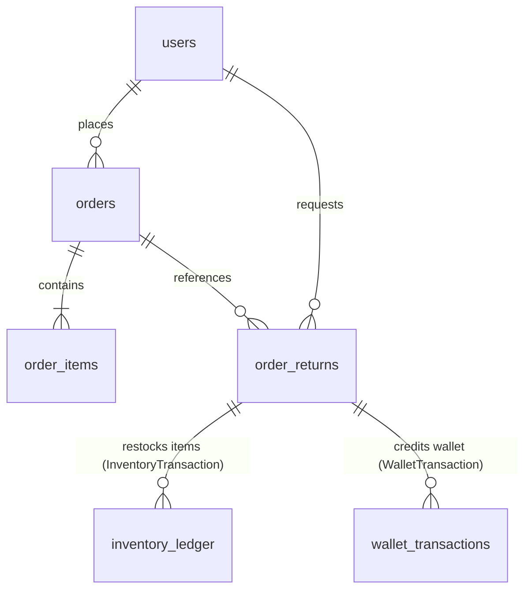
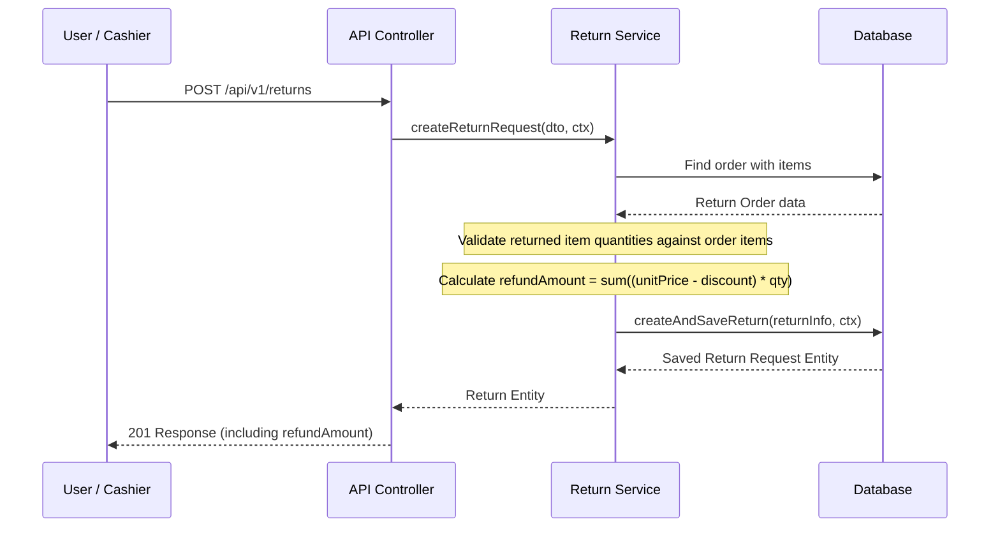
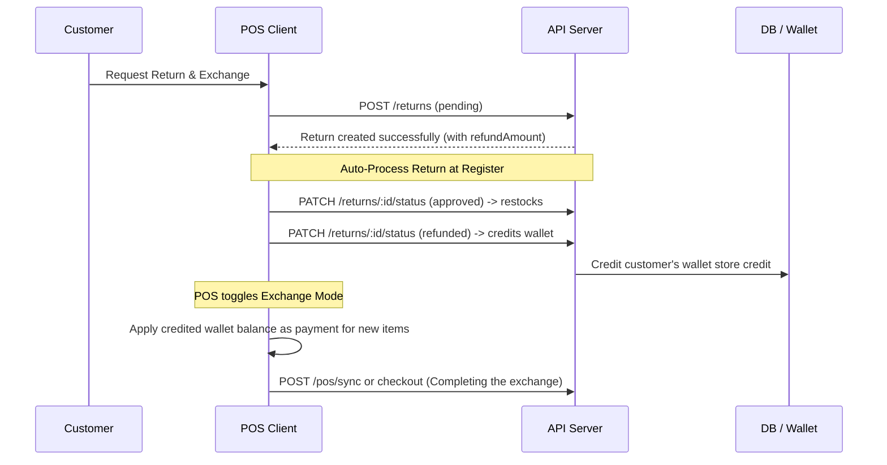

# Codebase Understanding — Returns, Refunds, & Exchange Modules

This document details the **Return, Refund, and Exchange** system architecture with verified field-level accuracy and step-by-step workflows.

---

## Module Locations

```
server/src/modules/admin/sales/
├── order/
│   ├── entities/
│   │   ├── order.entity.ts           # Original purchase orders
│   │   ├── order-item.entity.ts      # Line items belonging to orders
│   │   └── order-return.entity.ts    # Return requests
│   ├── services/
│   │   └── return.service.ts         # Core returns logic (validation, restocking, wallet credit)
│   ├── repositoris/                  # DB access layer (Note: 'repositoris' typo in paths)
│   │   └── order-return.repository.ts
│   └── controllers/
│       └── return.controller.ts      # HTTP endpoints for admin & POS returns
```

---

## 1. Database Relations & Entity Diagram

The return and refund flow bridges sales, inventory, and finance/accounting (via customer wallets).



### Entity Fields Relevant to Returns

#### `OrderReturnEntity` (`order_returns` table)
- `id` (UUID, Primary Key)
- `orderId` (UUID, Foreign Key) -> `OrderEntity`
- `userId` (UUID, Foreign Key) -> `UserEntity` (the customer)
- `status` (Enum: `pending`, `approved`, `rejected`, `refunded`)
- `reason` (Text) -> Customer-provided reason
- `adminComment` (Text, Nullable) -> Internal notes
- `refundAmount` (Decimal) -> Calculated refund value
- `items` (JSONB) -> Array of returned products: `[{ productId, variantId, quantity }]`
- `tenantId` (UUID) -> Multi-tenant boundary

#### `OrderItemEntity` (`order_items` table)
- `unitPrice` (Decimal) -> Original unit cost
- `discountAmount` (Decimal) -> Applied discount at order time
- `quantity` (Int) -> Purchased quantity

---

## 2. Deconstructive Step-by-Step Workflows

The Return & Refund module follows a strict lifecycle state machine:
```
[PENDING] ──(Approve & Restock)──> [APPROVED] ──(Finalize & Credit Wallet)──> [REFUNDED]
```

### Flow A: Creating a Return Request (`POST /api/v1/returns`)
1. **Initiation**: The request is created either by a customer (via Storefront) or a cashier (via Admin Return Modal or POS Register).
2. **Order Verification**: The backend validates that the original order exists and belongs to the active tenant.
3. **Item Quantities Validation**: The backend checks each returned item against the original order items:
   - Validates that the product and variant exist in the original order.
   - Checks that the return quantity does not exceed the originally purchased quantity.
4. **Calculated Refund Amount**:
   - For each returned item, the net unit price is computed:
     $$\text{netUnitPrice} = \text{unitPrice} - \text{discountAmount}$$
   - The total refund amount is aggregated:
     $$\text{refundAmount} = \sum (\text{netUnitPrice} \times \text{returnedQuantity})$$
5. **Persistence**: The return request is created with state `pending` and saved to the database.
6. **Notification**: A system alert/notification is generated to warn administrators about the new request.



---

### Flow B: Approving & Restocking Return (`PATCH /returns/:id/status` to `'approved'`)
1. **Transition Check**: The backend verifies that the return is transitioning from `pending` to `approved` (preventing duplicate restocks).
2. **Restocking Process**: The backend loops through all items inside the return:
   - Inserts a new entry into the `inventory_ledger` with type `RETURN` and reference type `SALES_RETURN`.
   - This ledger entry updates the physical stock on hand for the product/variant in the respective warehouse.
3. **Status Update**: Saves the status as `approved` in the database.

---

### Flow C: Finalizing & Refunding (`PATCH /returns/:id/status` to `'refunded'`)
1. **Verification**: Verifies that `refundAmount` exists and is greater than `0`.
2. **Wallet Credit**:
   - Calls the `WalletService.creditWallet` helper.
   - Deducts from system revenue and credits the customer's wallet balance using the transaction type `STORE_CREDIT` (linked to reference type `ORDER_RETURN`).
3. **Status Update**: Saves status as `refunded` in the database.

---

## 3. POS Exchange Flow (Special Case)

When a customer brings items to a physical store for an **exchange**:



1. **Lookup**: Cashier queries the invoice code to retrieve the order.
2. **Process Return**: Cashier selects which items are being returned. POS UI posts to `/returns`.
3. **Instant Credit**: POS automatically patches the return status to `approved` (triggering restock) and then `refunded` (crediting the customer's wallet).
4. **Exchange Cart offsetting**:
   - The customer selects the replacement items (exchange).
   - The POS cart is loaded with these new items.
   - The cashier enters customer profile, which fetches their updated wallet balance (including the refund credit).
   - Cashier selects the `wallet` payment method (with `useWalletBalance: true`) up to the calculated refund amount, offsetting the exchange total.
   - If the new items cost more, the customer pays the difference using Cash/Card. If less, the excess credit remains in their wallet.

---

## 4. Key Endpoints Summary

| Method | Path | Request Body | Description |
| :--- | :--- | :--- | :--- |
| `POST` | `/api/v1/returns` | `{ orderId: string, reason: string, items: Array<{productId, variantId, quantity}> }` | Creates return request & calculates refund amount |
| `PATCH` | `/api/v1/returns/:id/status` | `{ status: ReturnStatus, comment?: string }` | Transition return state (`approved`, `rejected`, `refunded`) |
| `GET` | `/api/v1/returns` | *(Query parameters for pagination/search)* | List return requests |
| `GET` | `/api/v1/returns/:id` | *None* | Get return details with original order relations |
