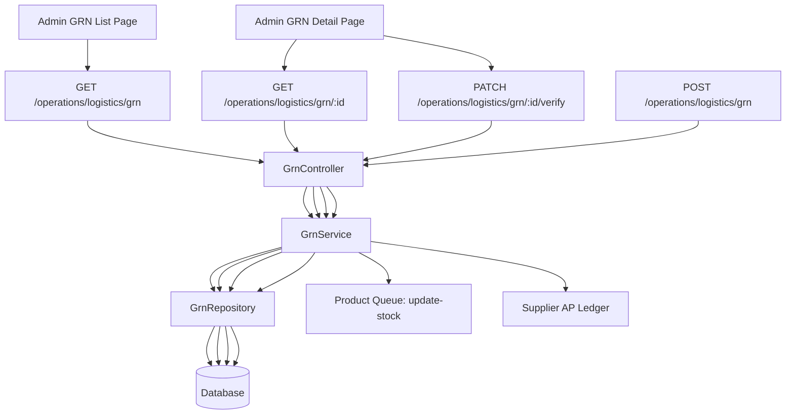

# Goods Received Notes (GRN) Module

## 1. Overview

Goods Received Notes (GRNs) are the system record of incoming inventory receipt for a purchase order. The module tracks:

- purchase order reference (`poId`)
- supplier
- destination warehouse and branch
- receiving user
- received items, quantities, and costs
- verification status

The main GRN status values are:

- `DRAFT` – created but not verified
- `RECEIVED` – verified and inventory posted
- `REJECTED` – rejected receipt

## 2. Core entities and relationships

### `GoodsReceivedNoteEntity`

Fields:

- `grnNumber` (generated sequentially)
- `poId` (Purchase Order)
- `supplierId` (Supplier)
- `warehouseId` (Warehouse)
- `branchId` (Branch)
- `receivedDate` (timestamp)
- `receivedByUserId` (User)
- `status` (`GrnStatus`)
- `notes`
- `storeId`

Relations:

- `purchaseOrder` → `PurchaseOrderEntity`
- `supplier` → `SupplierEntity`
- `warehouse` → `WarehouseEntity`
- `branch` → `BranchEntity`
- `receivedByUser` → `UserEntity`
- `items` → `GrnItemEntity[]`

### `GrnItemEntity`

Fields:

- `productId`
- `variantId` (optional)
- `orderedQty`
- `receivedQty`
- `unitCost`
- `condition`
- `storeId`

Relations:

- `product` → `ProductEntity`
- `variant` → `VariantEntity`
- `grn` → `GoodsReceivedNoteEntity`

## 3. API endpoints

### `POST /operations/logistics/grn`

Creates a new GRN.
Request body is `CreateGrnDto`:

- `poId`
- `supplierId`
- `warehouseId`
- `branchId`
- `notes?`
- `items[]`
  - `productId`
  - `variantId?`
  - `orderedQty`
  - `receivedQty`
  - `unitCost`
  - `condition?`

### `GET /operations/logistics/grn`

Returns paginated GRN list.
Query params supported by client:

- `page`
- `limit`
- `status`
- `q` (search term)

Important: in the current backend implementation, the `q` search parameter is sent by the frontend but not processed by `GrnService.findAll()`.

### `GET /operations/logistics/grn/:id`

Loads one GRN with relations:

- `items`
- `items.product`
- `items.variant`
- `supplier`
- `warehouse`
- `branch`
- `receivedByUser`
- `purchaseOrder`

### `PATCH /operations/logistics/grn/:id/verify`

Verifies or rejects a GRN.
Request body is `VerifyGrnDto`:

- `status` (`GrnStatus.RECEIVED` or `GrnStatus.REJECTED`)
- `notes?`

## 4. Full GRN lifecycle (A → Z)

### Step A: List page loads

Client code:

- `client/app/admin/procurement/grn/page.tsx`
- uses `fetchAPI(`/operations/logistics/grn?...`)
- sends `page`, `limit`, optional `q`, optional `status`
- 500ms debounce on search/status filter changes

Backend:

- `GrnController.findAll()` receives the request
- `GrnService.findAll()` calls `GrnRepository.findAll()`
- list query selects `supplier` and `warehouse` only
- returns `{ items, total }`

Current issue:

- list page computes GRN valuation from `grn.items`, but `findAll()` does not load `items`.
- that means row totals may be incorrect or zero in the list.

### Step B: Open GRN detail page

Client code:

- `client/app/admin/procurement/grn/[id]/page.tsx`
- fetches `/operations/logistics/grn/${id}`
- stores `response.data` in state
- renders `GrnDetailPage`

Backend:

- `GrnController.findOne()` calls `GrnService.findById()`
- `GrnRepository.findById()` loads the complete GRN with all relations

### Step C: Verify or reject GRN

Client triggers:

- `handleVerify()` on detail page calls PATCH `/operations/logistics/grn/${id}/verify` with `status: GrnStatus.RECEIVED`
- `handleReject()` calls same endpoint with `status: GrnStatus.REJECTED` and `notes`

Backend:

- `GrnController.verify()` calls `GrnService.verifyGrn()`
- `GrnService.verifyGrn()` loads GRN with relations
- if status is not `DRAFT` → throws error

If `REJECTED`:

- update `grn.status = REJECTED`
- update notes
- save GRN

If `RECEIVED`:

- start DB transaction
- set `grn.status = RECEIVED`
- save GRN via `repository.save(grn, queryRunner.manager)`
- for each item:
  - compute `totalGrnCost += receivedQty * unitCost`
  - enqueue `productQueue.add('update-stock', {...})`
    - `productId`
    - `variantId`
    - `quantity` = `receivedQty`
    - `type` = `PURCHASE`
    - `referenceType` = `GOODS_RECEIVED_NOTE`
    - `referenceId` = `grn.id`
    - `supplierId`
    - `storeId`
    - `unitCost`
- if `totalGrnCost > 0`, create supplier AP ledger entry:
  - `referenceType` = `GRN`
  - `referenceId` = `grn.id`
  - `credit` = `totalGrnCost`
  - remarks = `GRN Verification: ${grn.grnNumber}`
- commit transaction

## 5. Data origin for each GRN field

### Created by frontend

- `poId` → selected purchase order reference
- `supplierId` → supplier of the shipment
- `warehouseId` → warehouse receiving the stock
- `branchId` → branch scope for the GRN
- `notes` → optional internal notes
- `items` → line items with product, quantity, cost, condition

### Automatically created by backend

- `grnNumber` → generated by `GrnRepository.generateGrnNumber()`
- `receivedDate` → set to `new Date()` in `createAndSave()`
- `receivedByUserId` → current user from `RequestContext`
- `storeId` → current store from `RequestContext`

### Loaded from DB relations

- `purchaseOrder` → via `poId`
- `supplier` → via `supplierId`
- `warehouse` → via `warehouseId`
- `branch` → via `branchId`
- `receivedByUser` → via `receivedByUserId`
- `items` → child GRN item records
- `items.product` / `items.variant` → loaded when `findById()` is called

## 6. Module file mapping

### Server

- `server/src/modules/admin/operations/logistics/grn/grn.controller.ts`
- `server/src/modules/admin/operations/logistics/grn/grn.service.ts`
- `server/src/modules/admin/operations/logistics/grn/grn.repository.ts`
- `server/src/modules/admin/operations/logistics/grn/dto/grn.dto.ts`
- `server/src/modules/admin/operations/logistics/grn/entities/grn.entity.ts`
- `server/src/modules/admin/operations/logistics/grn/entities/grn-item.entity.ts`

### Client

- `client/app/admin/procurement/grn/page.tsx`
- `client/app/admin/procurement/grn/[id]/page.tsx`
- `client/features/admin/grn/components/GrnListPage.tsx`
- `client/features/admin/grn/components/GrnDetailPage.tsx`
- `client/services/procurement.ts` (`processGRN` POST helper)

## 7. Data flow diagram

## 8. Current implementation notes and guidance

- `GET /operations/logistics/grn` returns only supplier and warehouse relations, not item details.
  - This makes list-level total valuation unreliable if the UI depends on `grn.items`.
- Search parameter `q` is forwarded from the client but not currently implemented in `GrnService.findAll()`.
- `createGrn()` does not validate PO line items against GRN items; it accepts the request payload as-is.
- `verifyGrn()` uses a transaction and queue, so stock and AP updates happen only after successful verification.

## 9. Recommended checks when debugging data

1. Confirm the list page HTTP request:
   - `GET /operations/logistics/grn?page=1&limit=10&q=...&status=...`
2. Confirm the detail page HTTP request:
   - `GET /operations/logistics/grn/:id`
3. Confirm the verify request payload:
   - `PATCH /operations/logistics/grn/:id/verify`
4. Inspect the database row in `goods_received_notes` and `grn_items` for:
   - `po_id`, `supplier_id`, `warehouse_id`, `branch_id`
   - `received_by_user_id`, `received_date`
   - item `product_id`, `variant_id`, `received_qty`, `unit_cost`
5. If stock does not update after verification, inspect the product queue worker and `SupplierAPLedgerRepository.createEntry()`.

## 10. User-facing meaning

- The GRN list page is the warehouse/receiving team’s overview of inbound materials.
- The GRN detail page is the authoritative receipt document for a purchase order.
- Verifying a GRN means:
  - physical goods have arrived,
  - system stock is increased,
  - supplier liability is recorded.
- Rejecting a GRN means the receipt was not accepted and remains a rejected record.
