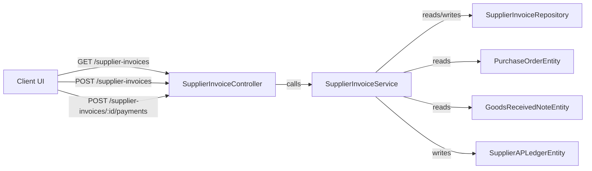

# Supplier Invoices Module

## Overview

Supplier Invoices is the Purchase module responsible for receiving vendor invoices, performing audit matching, and tracking accounts payable.

This module is used by purchasing and finance teams to:

- Receive supplier invoice documents against a Purchase Order.
- Perform automatic 3-way matching between Invoice, Purchase Order (PO), and Goods Received Notes (GRN).
- Detect discrepancies in price or quantity.
- Record payment against supplier invoices.
- Generate aging reports for Accounts Payable.

## Key Responsibilities

- Create and persist supplier invoice headers and line items.
- Match invoice items to PO items and received inventory.
- Mark invoices as `PENDING_MATCH`, `MATCHED`, `DISCREPANCY`, or `PAID`.
- Allow vendor payment recording and ledger updates.
- Expose list/detail endpoints for admin UI.

## Main Files

- `server/src/modules/admin/operations/finance/purchase/controllers/supplier-invoice.controller.ts`
- `server/src/modules/admin/operations/finance/purchase/services/supplier-invoice.service.ts`
- `server/src/modules/admin/operations/finance/purchase/repositories/supplier-invoice.repository.ts`
- `server/src/modules/admin/operations/finance/purchase/entities/supplier-invoice.entity.ts`
- `server/src/modules/admin/operations/finance/purchase/entities/supplier-invoice-item.entity.ts`
- `server/src/modules/admin/operations/finance/purchase/dto/supplier-invoice.dto.ts`
- `server/src/modules/admin/operations/finance/purchase/dto/record-payment.dto.ts`
- `client/app/admin/procurement/invoices/page.tsx`
- `client/services/procurement.ts`

## Data Model and Relationships

### Supplier Invoice

- `SupplierInvoiceEntity`
  - `invoiceNumber`
  - `supplierId` -> `SupplierEntity`
  - `purchaseOrderId` -> `PurchaseOrderEntity`
  - `invoiceDate`
  - `dueDate`
  - `totalAmount`, `paidAmount`
  - `status` (`DRAFT`, `PENDING_MATCH`, `MATCHED`, `DISCREPANCY`, `PAID`, `CANCELLED`)
  - `matchStatus` (`PENDING`, `MATCHED`, `DISCREPANCY`)
  - `discrepancyNotes`
  - `items` -> `SupplierInvoiceItemEntity[]`

### Supplier Invoice Item

- `SupplierInvoiceItemEntity`
  - `productId`
  - `quantity`
  - `unitPrice`
  - `supplierInvoiceId`

### Related Entities

- `PurchaseOrderEntity` (linked via `purchaseOrderId`)
- `SupplierEntity` (linked via `supplierId`)
- `GoodsReceivedNoteEntity` (used for receipt quantity comparison)
- `SupplierAPLedgerEntity` (used when invoice payments are recorded)
- `SupplierPayment` (payment records stored by `SupplierPaymentRepository`)

## Module Diagram

> If Mermaid is not supported in your Markdown viewer, use this fallback outline:
>
> - Client UI → SupplierInvoiceController
> - SupplierInvoiceController → SupplierInvoiceService
> - SupplierInvoiceService → SupplierInvoiceRepository
> - SupplierInvoiceService → PurchaseOrderEntity
> - SupplierInvoiceService → GoodsReceivedNoteEntity
> - SupplierInvoiceService → SupplierAPLedgerEntity

## Backend Workflow Step-by-Step

### 1. Create Supplier Invoice

- User fills the invoice form in the procurement UI.
- Client sends POST `/supplier-invoices` with:
  - `invoiceNumber`
  - `supplierId`
  - `purchaseOrderId`
  - `invoiceDate`
  - `dueDate`
  - `items[]` (productId, quantity, unitPrice)

#### Backend processing in `SupplierInvoiceService.createInvoice()`

1. Calculate `totalAmount` from line items.
2. Start a transaction.
3. Create `SupplierInvoiceEntity` with `status = PENDING_MATCH` and `matchStatus = PENDING`.
4. Load the associated Purchase Order using `PurchaseOrderRepository.findByIdWithRelations()`.
5. Load all received GRNs for the PO with `status = RECEIVED` and relation `items`.
6. Build `receivedQtyMap` from the GRN line items.
7. For each invoice line:
   - Compare against PO line price and quantity.
   - Compare invoiced quantity against GRN received quantity.
8. If any mismatch is found:
   - Set `matchStatus = DISCREPANCY`
   - Set `status = DISCREPANCY`
   - Capture human-readable `discrepancyNotes`
9. If all lines pass:
   - Set `matchStatus = MATCHED`
   - Set `status = MATCHED`
10. Save the invoice and commit the transaction.
11. Invalidate cache key `si:list` for the store.

### 2. List Supplier Invoices

- Client calls `getSupplierInvoices()`.
- Service `findAllInvoices()` returns paginated invoices.
- Results are cached using `CacheService.rememberCache()`.
- The repository includes relations for supplier, purchase order, and created-by user.

### 3. View Supplier Invoice Detail

- Client shows invoice detail drawer for selected row.
- Uses the loaded invoice object from the list page.
- Detail view exposes line items, match status, discrepancy details, and payment action.

### 4. Record Payment

- User clicks `Record Payment` in the detail drawer.
- Client sends POST `/supplier-invoices/:id/payments` with:
  - `amount`
  - `paymentMethod`
  - optional `transactionId`
  - optional `note`

#### Backend processing in `SupplierInvoiceService.payInvoice()`

1. Start a transaction.
2. Load invoice with relations by `id`.
3. Validate the invoice is not already `PAID`.
4. Create a supplier payment record through `SupplierPaymentRepository.createAndSave()`.
5. Update the invoice `paidAmount`.
6. If `paidAmount >= totalAmount`, set invoice `status = PAID`.
7. Save updated invoice.
8. Insert a `SupplierAPLedgerEntity` entry to reflect liability reduction.
9. Create a general ledger journal entry via `AccountingService.createJournalEntry()`.
10. Commit the transaction.
11. Invalidate cache keys `si:list` and `si:id:${invoice.id}`.

### 5. Update Invoice Status Manually

- API PATCH `/supplier-invoices/:id/status` allows changing invoice status for workflow adjustments.
- The service prevents status changes on already-paid invoices.
- Status can be updated together with `discrepancyNotes`.

### 6. Accounts Payable Aging Report

- API GET `/supplier-invoices/aging` computes AP aging buckets.
- Categorizes unpaid invoice balances into `current`, `1-30`, `31-60`, `61-90`, and `90+` days.
- Uses all suppliers for the store and unpaid supplier invoice balances.

## Frontend Workflow Step-by-Step

### 1. Page Load

- `client/app/admin/procurement/invoices/page.tsx` renders the Supplier Invoices UI.
- On mount it fetches:
  - `getSupplierInvoices()`
  - `getSuppliers()`
  - `getPurchaseOrders()`
  - `fetchAPI('/products?limit=100')` for item selection
- Invoice data is stored in state and filtered locally by search.

### 2. Search and Selection

- Users can search invoices by invoice number or supplier name.
- Clicking a row opens a detail drawer showing:
  - invoice header
  - supplier and PO link
  - 3-way match status
  - line items
  - payment button when invoice is not yet paid.

### 3. Receive Supplier Invoice UI

- The modal captures invoice header and line items.
- Product lines are added to the invoice using an item builder.
- When submitted, the client posts the invoice object to `/supplier-invoices`.
- On success, the modal closes and the invoice list refreshes.

### 4. Record Payment UI

- The detail drawer displays `Record Payment` for invoices with open balance.
- Payment fields include amount, payment method, transaction ID, and note.
- On submit, the client posts to `/supplier-invoices/:id/payments`.
- The list and current invoice state refresh after payment.

## Important Business Logic Notes

- This module is not only a CRUD invoice screen. It is a 3-way matching engine for audit control.
- The service intentionally compares:
  - Invoice line price vs PO line price.
  - Invoice quantity vs PO quantity.
  - Invoice quantity vs received GRN quantity.
- Discrepancies are surfaced immediately on invoice receive.
- Payments are posted to both Supplier AP ledger and the general journal.

## Extension and Troubleshooting Tips

- If invoice line items are not matching:
  - verify `purchaseOrderId` matches the correct PO.
  - verify the PO has related `items` loaded.
  - verify GRNs are in `RECEIVED` status and contain the expected `receivedQty` values.
- To add vendor credit note support, extend the `SupplierInvoiceStatus` flow and add a new line item type.
- To support invoice search by PO number or supplier invoice item names, expand `SupplierInvoiceRepository.findAllByStore()`.

## Summary

The Supplier Invoices module connects procurement receiving, purchase orders, warehouse receipt, and accounts payable. The frontend page is a procurement dashboard that creates and views supplier invoices, while the backend is responsible for audit matching, payment recording, and ledger updates.
