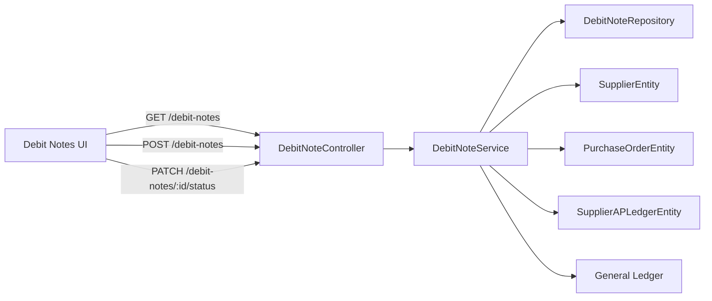

# Debit Notes Module

## Overview

The Debit Notes module handles supplier return and adjustment requests that reduce accounts payable liability.

It is used when a supplier issues a debit note for damaged goods, return claims, or pricing/quantity corrections backed by a purchase order.

This module is mainly a procurement and finance reconciliation tool that:

- creates debit notes as draft adjustment requests,
- links them to a supplier and optional purchase order,
- approves the note and records the accounting impact,
- updates supplier AP ledger and general ledger entries.

## Main Files

- `server/src/modules/admin/operations/finance/purchase/controllers/debit-note.controller.ts`
- `server/src/modules/admin/operations/finance/purchase/services/debit-note.service.ts`
- `server/src/modules/admin/operations/finance/purchase/repositories/debit-note.repository.ts`
- `server/src/modules/admin/operations/finance/purchase/entities/debit-note.entity.ts`
- `server/src/modules/admin/operations/finance/purchase/dto/debit-note.dto.ts`
- `client/app/admin/procurement/debit-notes/page.tsx`
- `client/services/procurement.ts`

## Data Model and Relations

### DebitNoteEntity

- `debitNoteNumber`: unique identifier generated by the repository.
- `supplierId` → `SupplierEntity`
- `purchaseOrderId` → `PurchaseOrderEntity` (optional)
- `amount`: adjustment amount for the supplier credit.
- `reason`: claim description or return memo.
- `status`: `DRAFT`, `APPROVED`, `APPLIED`, `CANCELLED`.
- `storeId` → `StoreEntity`
- `createdById` → `UserEntity`

### Related Entities

- `SupplierEntity`: the vendor receiving the debit note.
- `PurchaseOrderEntity`: optional PO reference for the adjustment.
- `SupplierAPLedgerEntity`: updated when the note is approved.
- `AccountingService` / journal entries: used to post financial impact.

## Module Diagram

> Fallback:
>
> - Client UI calls `DebitNoteController`
> - Controller forwards to `DebitNoteService`
> - Service uses `DebitNoteRepository`
> - Approved notes post to `SupplierAPLedgerEntity` and the general ledger

## Backend Workflow

### 1. Create Debit Note

- User submits the form via client POST `/debit-notes`.
- Request payload includes:
  - `supplierId`
  - `purchaseOrderId` (optional but usually provided)
  - `amount`
  - `reason`

#### Processing in `DebitNoteService.createDebitNote()`

1. The service logs "Creating Debit Note".
2. Calls `DebitNoteRepository.createAndSave()`.
3. Repository generates `DN-<year>-<sequence>` using store invoice count.
4. Creates and saves the entity with status `DRAFT`.
5. Cache key `dn:list` is invalidated.

### 2. List Debit Notes

- Client hits GET `/debit-notes` through `getDebitNotes()`.
- Service `findAllDebitNotes()` uses cache (`dn:list:p...`) for 5 minutes.
- Repository returns paginated results with relations to supplier, PO, and creator.

### 3. View Debit Note Details

- Client opens the selected row.
- The detail drawer displays note header, supplier, PO reference, amount, reason, and status.
- The controller returns the entity with relations via `findOneDebitNote()`.

### 4. Approve Debit Note

- When a note is in `DRAFT`, the UI allows approval.
- Client sends PATCH `/debit-notes/:id/status` with `{ status: 'APPROVED' }`.

#### Processing in `DebitNoteService.updateDebitNoteStatus()`

1. Load the note by ID.
2. Reject updates if status is already `APPROVED` or `CANCELLED`.
3. If new status is `APPROVED`, call `approveDebitNote()`.
4. Otherwise save a normal status change and invalidate cache keys.

#### Processing in `DebitNoteService.approveDebitNote()`

1. Start a DB transaction.
2. Set `dn.status = APPROVED` and save the debit note.
3. Read the latest `SupplierAPLedgerEntity` entry for supplier and store with a pessimistic lock.
4. Calculate `balanceAfter = previousBalance - amount`.
5. Insert an AP ledger entry with type `ADJUSTMENT` and debit = amount.
6. Post a financial journal entry:
   - Debit `2100 Accounts Payable`
   - Credit `1100 Inventory`
7. Commit transaction.
8. Invalidate cache keys `dn:list` and `dn:id:${dn.id}`.

### 5. Update Status Messages and Restrictions

- Only `DRAFT` notes can be approved from UI.
- `APPROVED` and `CANCELLED` notes cannot be changed again.
- The controller exposes a single status patch endpoint.

## Frontend Workflow

### 1. Page Load

- `client/app/admin/procurement/debit-notes/page.tsx` mounts.
- Fetches:
  - `getDebitNotes()`
  - `getSuppliers()`
  - `getPurchaseOrders()`
- Stores results in component state.
- Search filtering is performed locally by note number or supplier name.

### 2. Create Debit Note UI

- Open the `New Debit Note` modal.
- Fill required fields:
  - Supplier
  - Purchase order
  - Adjustment amount
  - Reason / return memo
- Submit calls `createDebitNote()`.
- After success:
  - modal closes
  - new note appears in the list
  - note is created in `DRAFT` state

### 3. Debit Note Detail Drawer

- Clicking a row opens detail drawer.
- The drawer shows:
  - debit note number
  - supplier name
  - related PO reference
  - amount
  - reason
  - status badge
- If note status is `DRAFT`, an approve button appears.

### 4. Approve and Post

- Clicking `Approve & Post to Accounts` sends `approveDebitNote(id)`.
- Confirmation prompt warns that approving will write ledger entries.
- On success, the page refreshes and the note status changes to `APPROVED`.

## How to Use Debit Notes

1. Create a debit note when supplier deliveries are damaged, short-shipped, or require a credit.
2. Attach the note to the originating purchase order whenever possible.
3. Enter the adjustment amount and a clear reason.
4. Approve the note only after validation by procurement/finance.
5. Approved notes post AP ledger and general ledger impact automatically.

## Important Notes

- Debit Notes reduce supplier liability and inventory value at approval time.
- The approval logic is transactional to ensure AP ledger and general journal are posted together.
- Because the status patch endpoint can change status to `CANCELLED`, the UI should only expose that path for proper workflow.
- Search and listing use cache, but approval invalidates the list cache immediately.

## Summary

This module is a lightweight supplier claim and adjustment workflow. It creates draft debit notes, lets users approve them, and records the financial impact using supplier AP ledger and general ledger journal entries.
