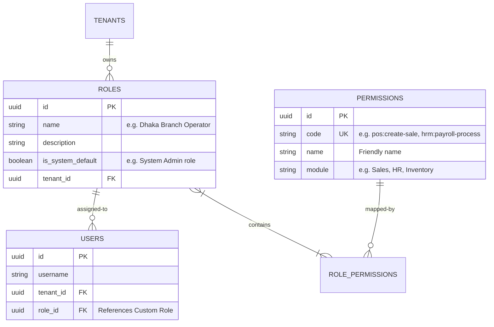

# Dynamic Role-Based Access Control (RBAC) Architecture

**Author:** Senior Engineering Team  
**Context:** Multi-tenant, multi-branch ERP SaaS.  
**Objective:** Replace static, hardcoded role enums with a dynamic database-driven permission matrix. This allows each tenant to define custom roles (e.g., "Night Shift Cashier", "Assistant Store Manager") and fine-tune their access privileges.

---

## 1. Database Schema Design (Entities)

To support fully dynamic permissions, we introduce a Many-to-Many mapping between **Roles** and **Permissions**, and link users to these custom roles.



---

## 2. Step-by-Step Implementation Guideline

### 📅 Phase 1: Database Setup & Seeding

1.  **Create `PermissionEntity`:** Create the base entity to store all standard system capability strings (`pos:create-sale`, `hrm:payroll-process`, `inventory:read`, etc.).
2.  **Create `RoleEntity`:** Create the role entity with a Many-to-Many mapping to `PermissionEntity`.
3.  **Update `UserEntity`:** Change the relation from static string/enum `role` to `@ManyToOne` referencing `RoleEntity`. Keep the legacy `role` enum field as a fallback mapping for retrocompatibility.
4.  **Write the Permission Seeder:** Automatically run a startup database routine that scans your system and registers all default system capability strings into the `permissions` table, and seeds the default roles (Super Admin, Admin, Manager, Operator) with their respective privilege configurations.

---

### 🛡️ Phase 2: Custom Decorator & NestJS Guard

1.  **Define `@RequirePermissions()` Decorator:** Create a decorator to attach permission codes directly onto NestJS route controllers.
    ```typescript
    @Get('shifts')
    @RequirePermissions('pos:read-shifts')
    async getShifts() { ... }
    ```
2.  **Build the `PermissionsGuard`:** Create a security guard that fetches the authenticated user's assigned role and permissions, and compares them with the codes requested by the decorator.
3.  **Register the Guard Globally:** Register the new guard in `AppModule` so that all routes are dynamically checked for permissions automatically.

---

### 💻 Phase 3: Administrative UI Management

1.  **Role Creation Form:** Build a settings screen where Store Owners can name a role and choose which branch(es) it can access.
2.  **Interactive Permission Matrix Checkboxes:** Show a comprehensive list of system checkboxes grouped by module (Sales, HRM, Inventory, Finance) so administrators can toggle specific permissions.
3.  **Assign to Team Member:** Update the Team Invitation and Edit Team Member forms to show a dropdown of custom roles instead of a hardcoded list.

---

## 3. The Blueprint Implementation Plan

### A. The Permission Codes (Static Dictionary)
To prevent typos, define all system permissions as a frozen TypeScript object:

```typescript
export const SystemPermissions = {
  // POS & Retail
  POS_SALE_CREATE: 'pos:create-sale',
  POS_SHIFT_MANAGE: 'pos:manage-shifts',
  
  // Finance & Ledger
  FINANCE_LEDGER_READ: 'finance:read-ledger',
  FINANCE_EXPENSE_WRITE: 'finance:write-expense',
  
  // HRM & Staff
  HRM_ATTENDANCE_CLOCK: 'hrm:clock-attendance',
  HRM_PAYROLL_PROCESS: 'hrm:process-payroll',
} as const;

export type SystemPermissionCode = typeof SystemPermissions[keyof typeof SystemPermissions];
```

### B. Custom Decorator Definition (`/common/decorators/permissions.decorator.ts`)
```typescript
import { SetMetadata } from '@nestjs/common';
import { SystemPermissionCode } from '../enums/permissions.enum';

export const PERMISSIONS_KEY = 'permissions';
export const RequirePermissions = (...permissions: SystemPermissionCode[]) => 
  SetMetadata(PERMISSIONS_KEY, permissions);
```

### C. Permissions Guard Definition (`/common/guards/permissions.guard.ts`)
```typescript
import { CanActivate, ExecutionContext, Injectable, ForbiddenException } from '@nestjs/common';
import { Reflector } from '@nestjs/core';
import { PERMISSIONS_KEY } from '../decorators/permissions.decorator';

@Injectable()
export class PermissionsGuard implements CanActivate {
  constructor(private reflector: Reflector) {}

  async canActivate(context: ExecutionContext): Promise<boolean> {
    const requiredPermissions = this.reflector.getAllAndOverride<string[]>(PERMISSIONS_KEY, [
      context.getHandler(),
      context.getClass(),
    ]);

    if (!requiredPermissions) {
      return true; // No permissions required
    }

    const { user } = context.switchToHttp().getRequest();
    if (!user) return false;

    // Super Admin has global bypass privileges
    if (user.isAdmin || user.role === 'super_admin') return true;

    // Extract assigned permission codes from user's custom role
    const assignedPermissions: string[] = user.roleEntity?.permissions?.map(p => p.code) || [];

    const hasAllRequired = requiredPermissions.every(p => assignedPermissions.includes(p));
    if (!hasAllRequired) {
      throw new ForbiddenException('Access Denied: You do not possess the required functional permission to execute this operation.');
    }

    return true;
  }
}
```

---

## 4. Immediate Next Step Strategy

To transition safely to this architecture without breaking your current active build:
1. Create the base entity models (`RoleEntity`, `PermissionEntity`).
2. Map the relation on `UserEntity`.
3. Provide default fallback permissions based on the old `role` string so that existing staff members continue to work flawlessly until custom roles are populated.
