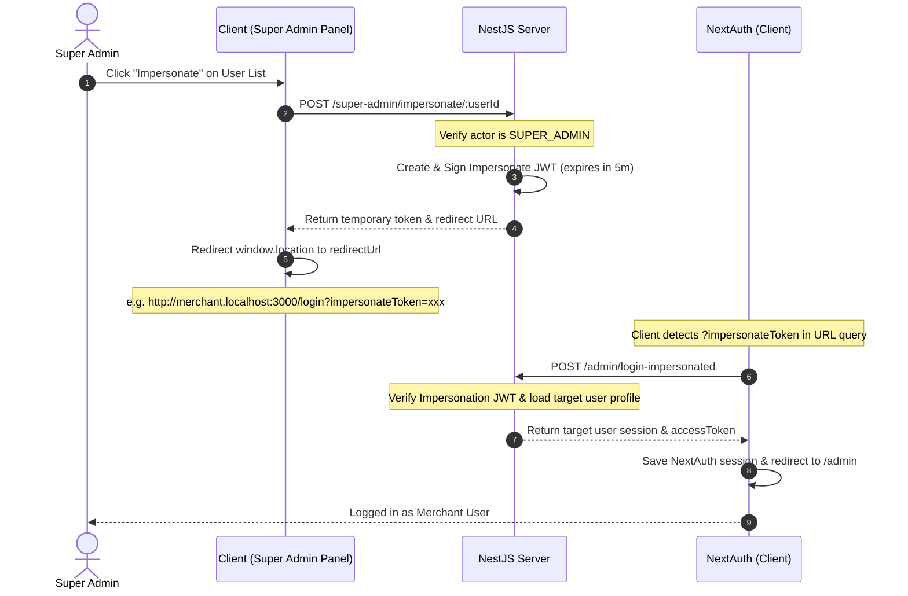

# Impersonation and Maintenance Modes Guide

This document details the architecture, configuration, and implementation workflows for two critical administrative features of the multi-store SaaS platform:
1. **Login As Merchant (Impersonation Mode)**: Allows Super Admins to securely access a merchant user's account context without credentials.
2. **Platform-Wide Maintenance Mode**: Allows the platform owner to temporarily lock storefronts and merchant admin views during system migrations or maintenance, while allowing Super Admins to bypass.

---

## 1. Secure Merchant Impersonation

Impersonation mode is designed to aid support staff in troubleshooting merchant issues. It allows a Super Admin to establish an authenticated session in a specific user's context securely and transparently.

### Architectural Workflow



### Security Details
- **Token Validity**: Impersonation tokens are signed using a server-side secret key with a short expiration window (5 minutes). This prevents replay attacks if a URL is leaked.
- **Access Logs**: The NestJS controller logs impersonation requests to track admin activity.
- **NextAuth Integration**: NextAuth has been configured with an optional `impersonateToken` field in the credentials schema, routing requests through the `login-impersonated` backend controller.

### Key Code References
- **Backend Service & Token Signer**: [auth.service.ts](file:///home/gowtamkumar/projects/eCommerce-multi-store-saas/server/src/modules/admin/core/auth/services/auth.service.ts)
- **Super Admin API Endpoint**: [super-admin.controller.ts](file:///home/gowtamkumar/projects/eCommerce-multi-store-saas/server/src/modules/system/super-admin/super-admin.controller.ts)
- **Credentials Validation Controller**: [admin-auth.controller.ts](file:///home/gowtamkumar/projects/eCommerce-multi-store-saas/server/src/modules/admin/core/auth/controllers/admin-auth.controller.ts)
- **NextAuth Configurations**: [authOptions.ts](file:///home/gowtamkumar/projects/eCommerce-multi-store-saas/client/lib/authOptions.ts)
- **Frontend Action Button & Trigger**: [UserRow.tsx](file:///home/gowtamkumar/projects/eCommerce-multi-store-saas/client/features/system/components/UserRow.tsx) and [UserList.tsx](file:///home/gowtamkumar/projects/eCommerce-multi-store-saas/client/features/system/components/UserList.tsx)
- **Auto-Login Hook & Loader**: [Login.tsx](file:///home/gowtamkumar/projects/eCommerce-multi-store-saas/client/features/storefront/auth/components/Login.tsx)

---

## 2. Platform-Wide Maintenance Mode

Maintenance Mode provides platform owners with a global "kill-switch" to freeze client traffic during system upgrades, server maintenance, or database migration pipelines, while keeping admin APIs accessible for developers and Super Admins.

### Technical Implementation

#### A. Database Schema
Settings are persisted in the global `PlatformSettings` entity:
- `isMaintenanceMode` (`boolean`, default: `false`)
- `maintenanceMessage` (`text`, default: `"Platform is currently undergoing scheduled upgrades. Please try again shortly."`)

Entity location: [platform-settings.entity.ts](file:///home/gowtamkumar/projects/eCommerce-multi-store-saas/server/src/modules/system/platform/entities/platform-settings.entity.ts)

#### B. Backend API Protection (`MaintenanceGuard`)
The global NestJS [MaintenanceGuard](file:///home/gowtamkumar/projects/eCommerce-multi-store-saas/server/src/common/guards/maintenance.guard.ts) enforces this block:
1. **Public Routes Bypass**: Routes decorated with `@Public()` (e.g. static landing assets, login endpoints, webhook receivers) bypass checks.
2. **Super Admin Bypass**: Requests carrying a valid `SUPER_ADMIN` role token bypass the checks.
3. **Rejection**: Any other request results in a `503 Service Unavailable` error returning the configured `maintenanceMessage`.

#### C. Frontend UI Lock (`MaintenanceWrapper`)
The client root layout implements a [MaintenanceWrapper](file:///home/gowtamkumar/projects/eCommerce-multi-store-saas/client/components/shared/MaintenanceWrapper.tsx) that wraps `{children}` inside [layout.tsx](file:///home/gowtamkumar/projects/eCommerce-multi-store-saas/client/app/layout.tsx):
- Periodically checks platform settings status.
- If maintenance mode is active, it locks the page, replacing the workspace/storefront with a custom-designed dark-mode splash page showing rotating gears, warning indicators, and the admin-configured warning message.
- **Smart Path Bypass**: Bypasses paths starting with `/login`, `/system`, `/api`, and `/accept-invitation` so system owners can log in and manage the settings to disable maintenance.

### Settings UI Interface
Super Admins can manage this feature under **Platform Settings > System & Cache**:
- **Switch Toggle**: Activates or deactivates maintenance.
- **Message Field**: Customizable warning textarea. Saved updates immediately sync globally.

---

## 3. Development and Verification

### Compilation & Quality Checks
Before committing any changes to these features, verify that both the client-side Next.js app and the NestJS server compile cleanly and tests pass.

```bash
# 1. Compile Check Client
docker exec multi_store_client_dev npx tsc --noEmit

# 2. Compile Check Server
docker exec multi_store_server_dev npx tsc --noEmit

# 3. Run Backend Jest Tests
docker exec multi_store_server_dev npm run test
```
