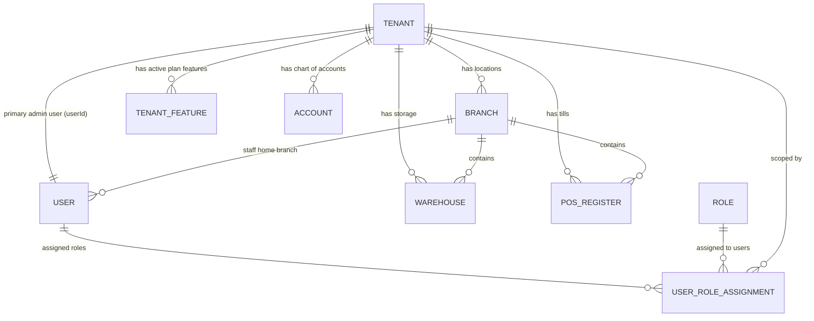

# 🏁 Tenant Onboarding Data Flow & Relational Architecture

This document describes the exact sequence of database insertions, entity relationships, and transactional boundaries that occur when a new merchant registers (onboards) a store on the platform.

---

## 1. Onboarding Pipeline Flow

When a merchant completes the registration form on the storefront, a `POST` request is sent to the `/api/v1/onboard` endpoint.

```
[Client Request] ──> OnboardController.onboard()
                             │
                             ▼
                    TenantService.createTenant()
                             │
                             ▼
         ┌──────────────────────────────────────┐
         │      DB Transactional Boundary       │
         │  (Guarantees all-or-nothing inserts)  │
         ├──────────────────────────────────────┤
         │  1. Insert TenantEntity              │
         │  2. Insert BranchEntity              │
         │  3. Insert WarehouseEntity           │
         │  4. Insert PosRegisterEntity         │
         │  5. Insert Admin UserEntity          │
         │  6. Link Tenant back to User         │
         │  7. Seed Tenant Roles & Permissions  │
         │  8. Assign Super Admin Role to User  │
         │  9. Enable Plan features             │
         │ 10. Seed Chart of Accounts (COA)     │
         └──────────────────┬───────────────────┘
                            │
                            ▼ (Transaction Commits)
         ┌──────────────────────────────────────┐
         │        Post-Onboard Tasks            │
         │ (Non-critical async operations)      │
         ├──────────────────────────────────────┤
         │  - Initialize Settings               │
         │  - Send Verification Email           │
         │  - Notify platform Super Admin       │
         └──────────────────────────────────────┘
```

---

## 2. Onboarding Relational Architecture

During the onboarding transaction, a network of highly-interconnected tables is built to isolate and configure the merchant's workspace. Below is the Mermaid entity relationship diagram generated during this step:



---

## 3. Database Insertion Sequence (Inside Transaction)

The database operations are handled atomically within `this.dataSource.transaction(async (manager) => { ... })` inside `tenant.service.ts`:

### Step 3.1: Create & Save the Tenant
The first step creates the core tenant metadata, linked to their subscription tier.
```typescript
const tenant = tenantRepo.create({
  storeName,
  subdomain,
  subscriptionStatus: SubscriptionStatus.TRIAL,
  subscriptionBillingCycle: billingCycle,
  subscriptionStartsAt: now,
  subscriptionEndsAt: trialEndsAt,
  subscriptionPlan, // Relations mapped to SubscriptionPlanEntity
})
const savedTenant = await tenantRepo.save(tenant)
```

### Step 3.2: Create the Default Main Branch
Every tenant must have at least one branch for inventory tracking and operations.
```typescript
const defaultBranch = branchRepo.create({
  name: 'Main Branch',
  code: `MAIN-${subdomain.toUpperCase()}`,
  tenantId: savedTenant.id,
  isActive: true,
})
const savedBranch = await branchRepo.save(defaultBranch)
```

### Step 3.3: Create the Default Main Warehouse
A primary warehouse is mapped directly to the default branch to support immediate catalog stock management.
```typescript
const defaultWarehouse = warehouseRepo.create({
  name: 'Main Warehouse',
  code: `WH-${subdomain.toUpperCase()}`,
  tenantId: savedTenant.id,
  branchId: savedBranch.id,
  isActive: true,
})
await warehouseRepo.save(defaultWarehouse)
```

### Step 3.4: Create the Default POS Register (Till)
To enable point-of-sale functionality out of the box, a register is assigned to the main branch.
```typescript
const defaultRegister = posRegisterRepo.create({
  name: 'Main Till',
  branchId: savedBranch.id,
  tenantId: savedTenant.id,
})
await posRegisterRepo.save(defaultRegister)
```

### Step 3.5: Create the Admin User & Link back to Tenant
The primary administrative user is created and assigned to the main branch. Once saved, the `TenantEntity`'s `userId` reference is updated to point to this user.
```typescript
const user = userRepo.create({
  name,
  username,
  email,
  password: hashedPassword,
  role: UserRole.ADMIN,
  tenantId: savedTenant.id,
  branch: savedBranch,
  isAdmin: false,
})
const savedUser = await userRepo.save(user)

// Link the primary owner user back to the tenant record
savedTenant.userId = savedUser.id
await tenantRepo.save(savedTenant)
```

### Step 3.6: Seed Tenant Roles & Assign Super Admin permissions
Standard roles (e.g. Store Manager, Operator) are seeded for the new tenant, and the owner is assigned the tenant-level "Super Admin" role.
```typescript
const superAdminRole = await this.roleManagementService.seedSuperAdminRole(savedTenant.id, manager)
await this.roleManagementService.seedDefaultRoles(savedTenant.id, manager)

await assignmentRepo.save(
  assignmentRepo.create({
    userId: savedUser.id,
    roleId: superAdminRole.id,
    tenantId: savedTenant.id,
    scopeType: RoleScopeType.GLOBAL,
    assignedBy: savedUser.id,
  })
)
```

### Step 3.7: Seed Tenant Feature Flag Entitlements
Plan-based features are copied from the subscription plan's features list into the `TenantFeatureEntity` table.
```typescript
const featuresToSeed = uniqueFeatures.map(f => featureRepo.create({
  tenantId: savedTenant.id,
  featureSlug: f,
  isEnabled: true,
  enabledBy: savedUser.id,
  enabledAt: new Date(),
}))
await featureRepo.save(featuresToSeed)
```

### Step 3.8: Seed the Chart of Accounts (COA)
To support accounting operations (Ledger postings, Accounts Receivable/Payable tracking), a standard Chart of Accounts list is initialized.
```typescript
const accounts = DEFAULT_CHART_OF_ACCOUNTS.map((coa) =>
  accountRepo.create({
    ...coa,
    tenantId: savedTenant.id,
  }),
)
await accountRepo.save(accounts)
```

---

## 4. Key Architectural Safeguards

1. **Transactional Isolation**: If any step fails (e.g. duplicate email index validation error on `UserEntity`, or database connection drops), the entire sequence rollback triggers immediately. No orphaned branch or settings rows will remain.
2. **Denormalized Foreign Keys**: Every record created (`Branch`, `Warehouse`, `PosRegister`, `User`, `TenantFeature`, `Account`) contains a `tenant_id` field indexed to optimize performance.
3. **Post-Transaction Task Decoupling**: Tasks like sending emails and sending notifications to the global administration panel are executed asynchronously *outside* of the database transaction context. This prevents SMTP network delays from locking database connections.
