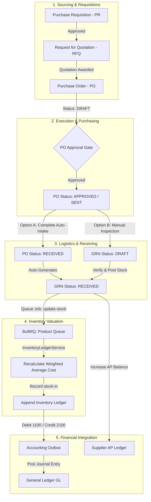
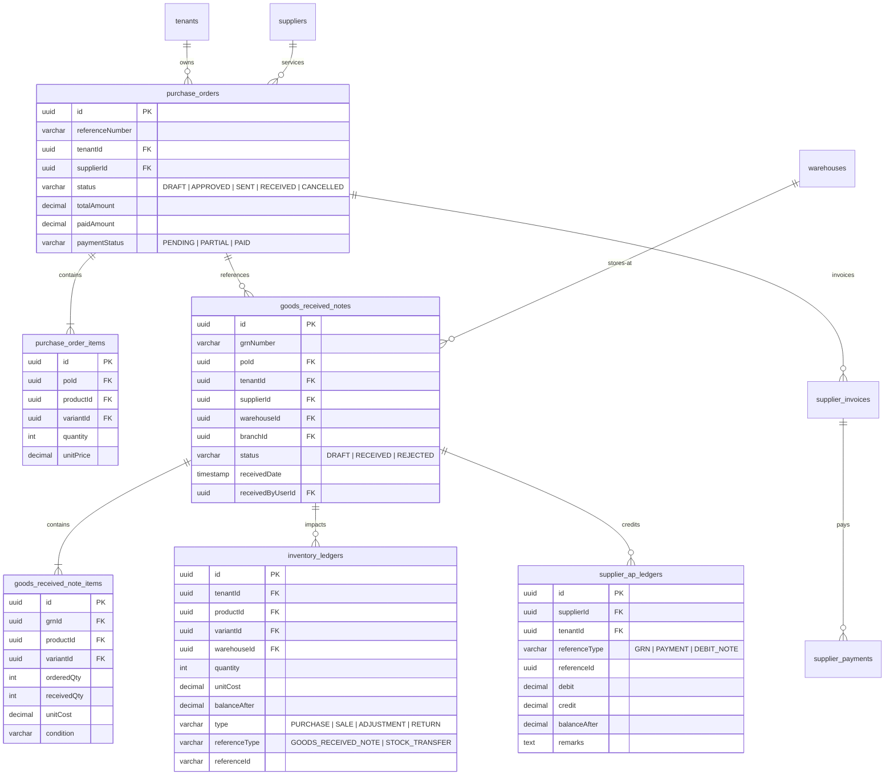

# Purchase Cycle Guide: Create to Receipt (A-to-Z Guide)

This guide documents the procurement intake lifecycle in the Multi-Tenant ERP eCommerce SaaS platform. It tracks the journey of acquiring inventory—starting from a Purchase Order (PO), transitioning through physical intake via a Goods Received Note (GRN), updating stock quantities/valuation (Weighted Average Cost), and ending with Accounts Payable (AP) and General Ledger (GL) financial postings.

---

## 1. End-to-End Procurement Workflow

The workflow consists of five distinct logical phases, coordinating Logistics, Sourcing, and Accounting:



### Stage A: Initiation & Sourcing

- **Purchase Requisition (PR):** Internal document requesting items. Requires department/budget approvals.
- **Request for Quotation (RFQ):** Bidding process sent to multiple suppliers. Awarding an RFQ automatically generates the core Purchase Order.

### Stage B: Purchase Order (PO) Execution

- **Creation:** Created in `DRAFT` status. Represents the legal intention to buy. Contains tenant validation, specific branch constraints, supplier details, warehouse destination, and ordered quantities.
- **Approval & Delivery:** Once approved, PO transitions to `APPROVED` or `SENT` and is emailed to the supplier.

### Stage C: Physical Delivery & Goods Received Note (GRN)

- **Intake:** When delivery arrives, warehouse operators count and verify item conditions.
- **GRN States:**
  - **`DRAFT`:** Saved while count is in progress. No inventory or accounting impact.
  - **`RECEIVED`:** The count is committed. This starts a database transaction to record stock and accounts payable balances.
  - **`REJECTED`:** Shipment returned to supplier due to damage or incorrect specifications.

---

## 2. Database Schema & Table Relationships

The database utilizes TypeORM. All tables are securely partitioned by `tenant_id` to maintain multi-tenant isolation.



### Table Mapping Definitions

1. **`purchase_orders` / `purchase_order_items`**
   - Stores the baseline contract. `totalAmount` is calculated as $\sum (\text{quantity} \times \text{unitPrice})$.
2. **`goods_received_notes` / `goods_received_note_items`**
   - Tracks physical receipts. The `receivedQty` can be less than (under-received), equal to, or greater than (over-received) the PO's `orderedQty`.
3. **`inventory_ledgers`**
   - The ledger representing chronological stock movements. `balanceAfter` represents the running balance of stock for the given product/variant in a specific warehouse.
4. **`supplier_ap_ledgers`**
   - Stores accounts payable transactions per vendor. A `credit` increases the balance (the tenant owes money), whereas a `debit` reduces the balance (the tenant paid the supplier).

---

## 3. Dynamic Stock Valuation & The FIFO/Average Cost Engine

Stock receipts don't just increment quantities; they recalculate the **Weighted Average Cost (WAC)** for inventory asset valuation.

### WAC Recalculation Algorithm

When a `PURCHASE` type transaction is recorded via the inventory ledger:

1. Fetch current on-hand stock balance before the receipt ($S_{current}$).
2. Fetch current Weighted Average Cost of the product or variant ($C_{current}$).
3. Calculate the incoming stock quantity ($Q_{incoming}$) and its unit cost ($C_{incoming}$).
4. Calculate new average cost:

$$\text{New Average Cost} = \frac{(S_{current} \times C_{current}) + (Q_{incoming} \times C_{incoming})}{S_{current} + Q_{incoming}}$$

### Code Implementation Map

- **Recalculation logic trigger:** [InventoryLedgerService.createLedgerEntry](file:///home/gowtamkumar/projects/eCommerce-multi-tenant-saas/server/src/modules/admin/operations/logistics/inventory-transaction/inventory-ledger.service.ts#L97-L126)
- **Underlying Repositories:** [ProductVariantRepository](file:///home/gowtamkumar/projects/eCommerce-multi-tenant-saas/server/src/modules/admin/catalog/product/repositories/variant.repository.ts) and [ProductRepository](file:///home/gowtamkumar/projects/eCommerce-multi-tenant-saas/server/src/modules/admin/catalog/product/repositories/product.repository.ts) execute raw atomic updates to avoid race conditions:
  ```typescript
  await this.variantRepository.updateAverageCost(
    variantId,
    tenantId,
    newAvgCost,
    entityManager,
  );
  ```

---

## 4. BullMQ Asynchronous Processing

To prevent slow response times when receiving large purchase orders, the database commits the receipt first and updates individual variant inventory metrics asynchronously.

```
                  ┌──────────────────────────────┐
                  │   GRN Verification Complete  │
                  └──────────────┬───────────────┘
                                 │
                   (Adds jobs for each product)
                                 ▼
                     ┌───────────────────────┐
                     │ BullMQ: product queue │
                     └───────────┬───────────┘
                                 │
                         (Worker executes)
                                 ▼
                   ┌──────────────────────────┐
                   │ ProductProcessor Worker  │
                   └─────────────┬────────────┘
                                 │
                       (Appends stock logs)
                                 ▼
                     ┌───────────────────────┐
                     │ InventoryLedger Entry │
                     └───────────────────────┘
```

- **Job Dispatcher:** [GrnService.verifyGrn](file:///home/gowtamkumar/projects/eCommerce-multi-tenant-saas/server/src/modules/admin/operations/logistics/grn/grn.service.ts#L69-L80) enqueues `update-stock` jobs.
- **Worker Process:** [ProductProcessor.handleUpdateStock](file:///home/gowtamkumar/projects/eCommerce-multi-tenant-saas/server/src/modules/admin/catalog/product/queue/product.processor.ts#L52-L87) executes in a separate thread/process to handle the stock update, Average Cost recalculation, and system warnings (e.g., low stock alerts).

---

## 5. Double-Entry Accounting Specifications

Procurement intake directly impacts the Balance Sheet. When a GRN transitions to `RECEIVED`, the platform records a balanced transaction in the ledger via [AccountingIntegrationService.postInventoryMovement](file:///home/gowtamkumar/projects/eCommerce-multi-tenant-saas/server/src/modules/admin/operations/finance/accounting/services/accounting-integration.service.ts#L61-L83).

### Accounting Entry Rules

#### 1. On Goods Receipt (GRN Verification)

The value of inventory received is moved to Asset accounts, offset by a Liability to the supplier.

- **Formula:** $\text{Transaction Amount} = \text{receivedQty} \times \text{unitCost}$
- **Journal Entry:**

| Account Number | Account Name     | Type      | Debit (DR)               | Credit (CR)                  |
| :------------- | :--------------- | :-------- | :----------------------- | :--------------------------- |
| **1100**       | Inventory Asset  | Asset     | **DR** (Increases Asset) |                              |
| **2100**       | Accounts Payable | Liability |                          | **CR** (Increases Liability) |

#### 2. On Supplier Payment

When payment is settled against the corresponding supplier invoice.

- **Formula:** $\text{Transaction Amount} = \text{Amount Paid}$
- **Journal Entry:**

| Account Number | Account Name        | Type      | Debit (DR)                 | Credit (CR)            |
| :------------- | :------------------ | :-------- | :------------------------- | :--------------------- |
| **2100**       | Accounts Payable    | Liability | **DR** (Reduces Liability) |                        |
| **1000**       | Cash / Bank Account | Asset     |                            | **CR** (Reduces Asset) |

---

## 6. The Three-Way Matching Audit Engine

The final guardrail in the procurement flow is the **Three-Way Matching Engine** executed during supplier invoicing. This ensures the company only pays for what was ordered and received.

```
       [ Purchase Order ] ─── (Matches Price & Qty Ordered) ───┐
                                                               │
                                                               ▼
       [ Goods Received ] ─── (Matches Qty Received) ───► [ 3-Way Match Engine ]
                                                               ▲
                                                               │
       [ Supplier Invoice] ── (Compares Billing Inputs) ───────┘
```

- **Execution Trigger:** [SupplierInvoiceService.createInvoice](file:///home/gowtamkumar/projects/eCommerce-multi-tenant-saas/server/src/modules/admin/operations/finance/purchase/services/supplier-invoice.service.ts#L33-L140)
- **Discrepancy Validation Checks:**
  1. **Item Validity:** Is the invoiced Product ID actually present on the original Purchase Order?
  2. **Price Mismatch:** Does the Invoiced Unit Price match the agreed Purchase Order Unit Price?
  3. **Over-Billing (PO):** Does the Invoiced Quantity exceed the ordered Purchase Order Quantity?
  4. **Over-Billing (GRN):** Does the Invoiced Quantity exceed the actual verified received quantity on the GRNs?
- **Outcomes:**
  - **Success:** Status changes to `MATCHED`. Ready for payment.
  - **Failure:** Status changes to `DISCREPANCY`, locking the invoice from payment runs and generating a descriptive ledger note indicating audit failures.
