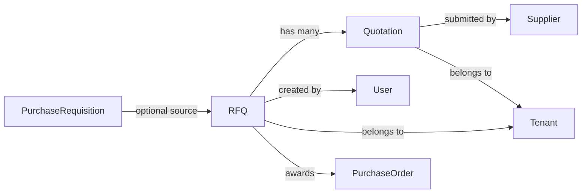

# Supplier Quotations (RFQs) — Architecture and Workflow

## Overview

Supplier Quotations (RFQs) in this system are the formal sourcing workflow that sits between a Purchase Requisition and a Purchase Order. RFQs allow the system to:

- collect and compare supplier bids against a sourcing need,
- link the bid request to an existing Purchase Requisition when available,
- accept one supplier quotation and automatically create a Purchase Order.

This document explains:

- why RFQs exist,
- what the RFQ feature does,
- how the feature is implemented in code,
- the end-to-end lifecycle, and
- key technical notes and improvement opportunities.

---

## Why RFQs?

### Business purpose

RFQs are used when the organization wants to solicit supplier proposals rather than purchasing directly from a single preferred vendor. They are useful for:

- competitive sourcing,
- validating pricing and lead times,
- comparing supplier terms and total cost,
- converting an approved sourcing requirement into a PO only after a supplier has been selected.

### Why this matters in the app

This application already supports Purchase Requisitions and Purchase Orders. RFQs add the missing procurement step:

1. user raises sourcing need (PR),
2. system issues an RFQ,
3. suppliers submit quotations,
4. buyer awards one quotation,
5. system generates a Purchase Order.

That enables better procurement controls and improves traceability.

---

## What RFQs represent in code

### RFQ entity

Location: `server/src/modules/admin/operations/finance/purchase/entities/rfq.entity.ts`

Key fields:

- `rfqNumber` — unique business identifier,
- `status` — `OPEN`, `CLOSED`, `AWARDED`, `CANCELLED`,
- `deadlineDate` — supplier bid deadline,
- `prId` — optional link to a Purchase Requisition,
- `purchaseRequisition` — relation to the linked PR,
- `createdById` / `createdBy` — creator user,
- `quotations` — child supplier bids.

Relationships:

- optional `PurchaseRequisitionEntity`,
- many `QuotationEntity` children.

### Quotation entity

Location: `server/src/modules/admin/operations/finance/purchase/entities/quotation.entity.ts`

Key fields:

- `rfqId` — parent RFQ,
- `supplierId` — submitting supplier,
- `totalAmount` — supplier bid total,
- `leadTimeDays` — supplier lead time,
- `status` — `PENDING`, `ACCEPTED`, `REJECTED`,
- `termsAndConditions` — optional supplier text.

This is a simple bid model: one quotation per supplier, submitted against one RFQ.

### DTOs and validation

Location: `server/src/modules/admin/operations/finance/purchase/dto/rfq.dto.ts`

Supported API payloads:

- `CreateRfqDto` — create a new RFQ, requires `deadlineDate`, optional `prId`,
- `UpdateRfqStatusDto` — set RFQ status,
- `CreateQuotationDto` — supplier quote data,
- `UpdateQuotationStatusDto` — update quote result.

Validation is done with `class-validator`.

---

## Entity relationships

The RFQ workflow connects several procurement entities. The core relationships are:

- `RFQ` optionally links to a `PurchaseRequisition` (`prId`),
- `RFQ` owns many `Quotation` records,
- each `Quotation` belongs to a `Supplier`,
- `RFQ` is created by a `User` and belongs to a `Tenant`,
- awarding a `Quotation` triggers `PurchaseOrder` creation.

### Relationship diagram



If Mermaid rendering is unavailable, the same relationship can be read as:

```
PurchaseRequisition (optional) -> RFQ -> Quotation -> Supplier
                       |
                       +-> createdBy User
                       +-> belongsTo Tenant
                       +-> awards PurchaseOrder
```

---

## API endpoints

Location: `server/src/modules/admin/operations/finance/purchase/controllers/rfq.controller.ts`

### Routes

- `POST /rfqs` — create a new RFQ
- `GET /rfqs` — list RFQs with pagination, search and optional status filter
- `GET /rfqs/:id` — fetch one RFQ with related quotations
- `PATCH /rfqs/:id/status` — update RFQ status
- `POST /rfqs/:id/quotations` — submit a supplier quotation
- `POST /rfqs/quotations/:id/award` — award a quotation and generate a PO

### Security and features

- all RFQ routes are guarded by `JwtAuthGuard` and `SubscriptionGuard`,
- feature gating via `@RequireFeature('purchasing')`,
- permissions are enforced with `SystemPermissions.PURCHASING_READ` / `PURCHASING_WRITE`.

---

## Service layer behavior

Location: `server/src/modules/admin/operations/finance/purchase/services/rfq.service.ts`

### createRfq()

- persists the RFQ with status `OPEN`,
- converts `deadlineDate` string into a JavaScript `Date`,
- optionally links an existing PR via `prId`,
- clears RFQ list cache.

### findAllRfqs()

- supports pagination (`page`, `limit`),
- supports full-text search on RFQ number,
- supports filtering by status,
- caches list responses for 300 seconds.

### findOneRfq()

- loads a single RFQ with relations,
- returns 404 if not found.

### updateRfqStatus()

- loads and updates the RFQ,
- clears list and item cache keys.

### submitQuotation()

- validates RFQ exists and is in `OPEN` state,
- persists supplier quotation with status `PENDING`,
- invalidates RFQ detail cache.

### awardQuotation()

- transactional logic using `QueryRunner`,
- loads the quotation and parent RFQ with relations,
- checks RFQ is still `OPEN`,
- marks the winning quotation `ACCEPTED`, rejects the others,
- sets RFQ status to `AWARDED`,
- creates a Purchase Order by delegating to `PurchaseOrderService`,
- invalidates cache after commit.

Important note: the current `awardQuotation` implementation creates PO line items by splitting `quotation.totalAmount` evenly over PR items. That is a business simplification and likely needs enhancement if real PO line-level pricing is required.

---

## Repository behavior

### RFQ repository

Location: `server/src/modules/admin/operations/finance/purchase/repositories/rfq.repository.ts`

- creates RFQ with generated sequential `rfqNumber`,
- loads RFQs with related PR and supplier quote data,
- filters by tenant, search, and status,
- supports `findByIdWithRelations()` to eager-load `purchaseRequisition`, `createdBy`, `quotations`, `quotations.supplier`.

### Quotation repository

Location: `server/src/modules/admin/operations/finance/purchase/repositories/quotation.repository.ts`

- persists supplier quotations,
- finds by RFQ or by quotation id,
- includes supplier relation when needed.

---

## Client flow

Location: `client/app/admin/procurement/rfqs/page.tsx`

### page behavior

- loads RFQs from `client/services/procurement.ts` via `getRFQs()`,
- shows a grid of RFQs,
- supports search over RFQ number and linked PR number,
- opens a detail drawer when an RFQ is clicked,
- supports creating a new RFQ,
- supports submitting supplier bids,
- supports awarding a selected bid.

### RFQ API caller

Location: `client/services/procurement.ts`

Key client functions:

- `getRFQs()` — GET `/rfqs?limit=100`, returns `res.data?.items || []`,
- `createRFQ(data)` — POST `/rfqs`,
- `submitQuotation(rfqId, data)` — POST `/rfqs/${rfqId}/quotations`,
- `awardQuotation(quotationId)` — POST `/rfqs/quotations/${quotationId}/award`.

### UI model

The page uses a simplified RFQ model:

- `rfqNumber`,
- `deadlineDate`,
- `status`,
- optional `purchaseRequisition` metadata,
- `createdBy`,
- `quotations[]` with supplier name, total amount, lead time, terms, status.

The RFQ detail drawer is the main approval interface.

---

## End-to-end lifecycle

### 1. Raise or link a Purchase Requisition

A user can create an RFQ with a deadline and optionally attach a PR using `prId`. This lets procurement source specific demand from an existing requisition.

### 2. Publish the RFQ

When created, the RFQ status is `OPEN`. That means the RFQ is live and suppliers can submit bids.

### 3. Suppliers submit quotations

Each supplier bid becomes a `QuotationEntity` with:

- `supplierId`,
- `totalAmount`,
- `leadTimeDays`,
- optional `termsAndConditions`,
- `status = PENDING`.

The RFQ remains open until a bid is awarded or the RFQ is manually closed/cancelled.

### 4. Award a supplier quotation

When a quotation is awarded:

- the chosen quotation is marked `ACCEPTED`,
- all other quotations are marked `REJECTED`,
- the RFQ status becomes `AWARDED`,
- a Purchase Order is created automatically.

### 5. Purchase Order creation

A PO is generated by `PurchaseOrderService.createPurchaseOrder()` with:

- `supplierId` from the accepted quotation,
- `referenceNumber = PO-RFQ-${rfq.rfqNumber}`,
- items derived from the linked PR if available.

If no PR is attached, the current code creates an empty PO item list.

---

## What this implementation does not currently cover

### Gaps and assumptions

- RFQ line-item detail is not modeled: the RFQ entity has no bid item breakdown, only `totalAmount`.
- PO item pricing is currently estimated by dividing total quotation amount over PR items.
- No supplier invitation workflow or supplier-side app is implemented here;
  suppliers are selected through the admin UI.
- `RFQStatus.CLOSED` and `CANCELLED` are defined but not driven by a dedicated workflow in the UI.
- No event or notification system for supplier bid submission or award.
- No audit trail of status transitions other than DB status values.

### Technical risks

- `awardQuotation()` is transactional, but the PO item pricing logic is not accurate if the PR has item quantities or line-level prices.
- Caching is used in `findAllRfqs()`, so changes may not appear instantly unless cache invalidation is correct.
- The client page currently fetches all RFQs in one request (`limit=100`) rather than handling server-side pagination.

---

## Code path map

### Server

- `server/src/modules/admin/operations/finance/purchase/purchase.module.ts`
- `server/src/modules/admin/operations/finance/purchase/controllers/rfq.controller.ts`
- `server/src/modules/admin/operations/finance/purchase/services/rfq.service.ts`
- `server/src/modules/admin/operations/finance/purchase/repositories/rfq.repository.ts`
- `server/src/modules/admin/operations/finance/purchase/repositories/quotation.repository.ts`
- `server/src/modules/admin/operations/finance/purchase/entities/rfq.entity.ts`
- `server/src/modules/admin/operations/finance/purchase/entities/quotation.entity.ts`
- `server/src/modules/admin/operations/finance/purchase/dto/rfq.dto.ts`

### Client

- `client/app/admin/procurement/rfqs/page.tsx`
- `client/services/procurement.ts`
- `client/routes.ts`

---

## Practical debugging guide

### If RFQs list is empty

1. Check `client/services/procurement.ts:getRFQs()` response shape.
2. Confirm the backend route is reachable at `/api/v1/rfqs`.
3. Verify the RFQ repository query returns items by tenant.

### If supplier bids are not saved

1. Confirm `POST /rfqs/:id/quotations` receives `supplierId`, `totalAmount` and optional `leadTimeDays`.
2. Ensure RFQ status is `OPEN` before submission.
3. Check `QuotationEntity` for `tenantId` and supplier relation.

### If award does not create PO correctly

1. Inspect the transaction in `awardQuotation()`, especially the generated items list.
2. Validate that `rfq.purchaseRequisition.items` contains product IDs and quantities.
3. Consider storing line-level quote prices rather than a single total.

---

## Recommended next improvements

### Short-term

- add RFQ item lines so each supplier quote can include per-product pricing,
- improve PO creation to preserve actual supplier quote line pricing,
- add server-side pagination and filtering to the RFQ listing,
- add a dedicated RFQ detail endpoint if the client needs more data.

### Medium-term

- implement supplier-facing portal/notification flow,
- add status transition events (`OPEN -> CLOSED`, `AWARDED`, `CANCELLED`),
- audit history on RFQ and quotation status changes,
- support RFQ amendment and bid revision.

---

## Summary

Supplier Quotations (RFQs) in this codebase are a procurement flow that:

- starts with a sourcing need,
- collects supplier bids,
- allows a buyer to award one supplier,
- automatically creates a Purchase Order.

The implementation is currently good for simple RFQ workflows, but it has strong assumptions around quote pricing and PR linkage. If you need robust supplier-side bidding, the next step is to model RFQ line items and quote item pricing explicitly.
