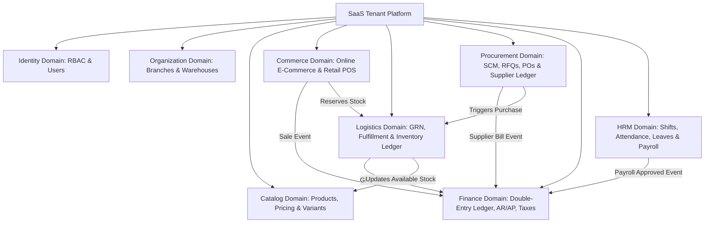
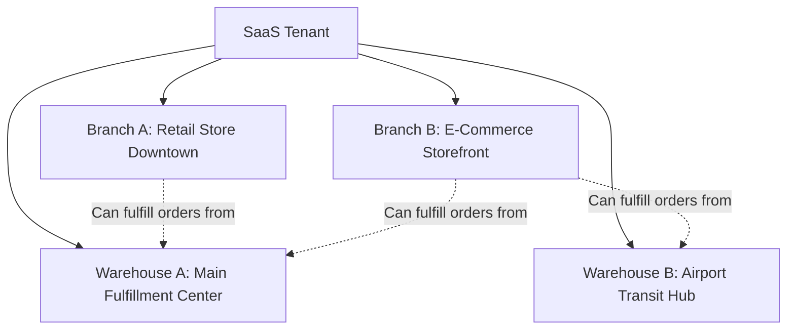
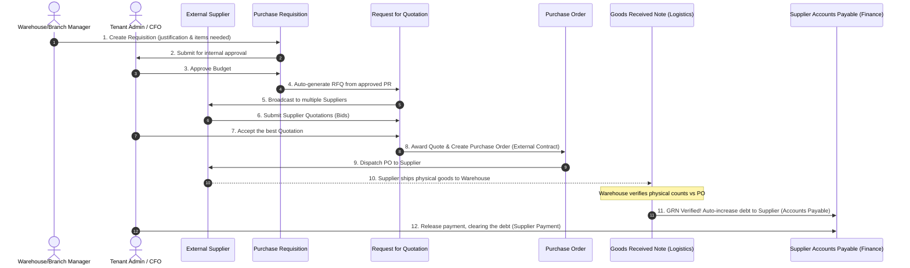
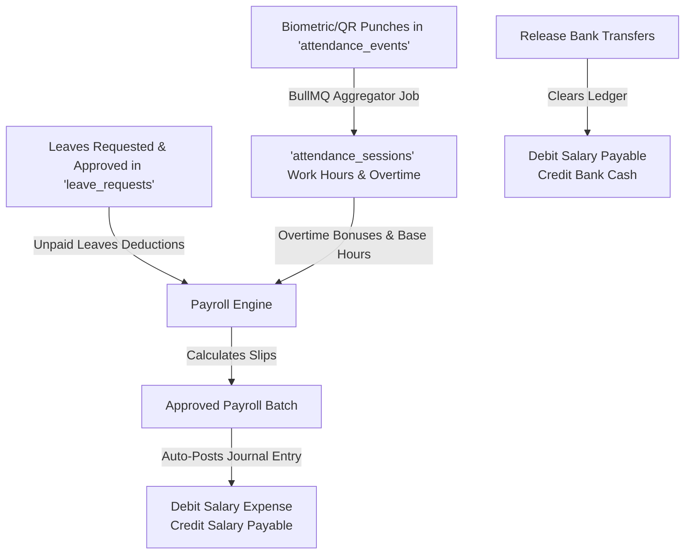

# ERP & E-Commerce: Deep-Dive Architectural & Domain Guide
*Written from the perspective of a Senior Systems Architect & Principal Engineer.*

Welcome to the definitive guide to this **Multi-Tenant SaaS E-commerce & Enterprise Resource Planning (ERP)** system. 

ERP projects are notoriously complex because they bridge two very different worlds:
1. **The Fast-Paced Commerce World**: Web storefronts, cart checkouts, and mobile POS terminals that need real-time, low-latency responsiveness.
2. **The Strict Financial/Logistical World**: Immutable double-entry general ledgers, audited stock movement ledgers, strict authorization hierarchies, and regulatory compliance.

If you are new to this project or concepts like **Procurement**, **Requisitions**, **Accounts Payable**, or **Double-Entry Bookkeeping**, this guide is written specifically for you. It explains **what** these concepts mean, **why** they are designed this way, and **how** every module in this NestJS + TypeORM codebase connects.

---

## Table of Contents
1. [Core Business Jargon Demystified (For Developers)](#1-core-business-jargon-demystified-for-developers)
2. [Macro System Architecture](#2-macro-system-architecture)
3. [Module 1: Multi-Tenancy & Identity Domain](#module-1-multi-tenancy--identity-domain)
4. [Module 2: Organization Domain (The Structural Grid)](#module-2-organization-domain-the-structural-grid)
5. [Module 3: Catalog & Multi-Tier Pricing Domain](#module-3-catalog--multi-tier-pricing-domain)
6. [Module 4: Procurement Domain (Supply Chain)](#module-4-procurement-domain-supply-chain)
7. [Module 5: Logistics & Inventory Ledger Domain](#module-5-logistics--inventory-ledger-domain)
8. [Module 6: Finance & Accounting Domain (The Ledger)](#module-6-finance--accounting-domain-the-ledger)
9. [Module 7: Point of Sale (POS) & Retail Domain](#module-7-point-of-sale-pos--retail-domain)
10. [Module 8: Human Resource Management (HRM) Domain](#module-8-human-resource-management-hrm-domain)
11. [Summary: How to Complete the Project](#11-summary-how-to-complete-the-project)

---

## 1. Core Business Jargon Demystified (For Developers)

Before reading database schemas, let's understand the core business terminology in simple words:

| Term | What it means in Plain English | Why it exists in an ERP |
| :--- | :--- | :--- |
| **Procurement** | The process of **buying** stock, raw materials, or services from external suppliers. It is the "buying" side of the business. | Businesses need to buy products in bulk at a low cost before they can sell them on their website or POS. |
| **Purchase Requisition (PR)** | An **internal request** where an employee asks their manager: *"Hey, our stock is low. Can we get permission to buy 100 more laptops?"* | **Internal control.** It prevents employees from wasting company money or buying unnecessary items without approval. |
| **Request for Quotation (RFQ)** | A sheet sent to 3-4 different suppliers saying: *"We want to buy 100 laptops. Give us your best price, shipping fee, and delivery time."* | **Bidding.** It ensures the business gets the absolute best deal (lowest price, highest quality, fastest delivery) from suppliers. |
| **Supplier Quotation** | The official response/bid from a supplier containing their prices and delivery timelines. | It represents the competing offers from vendors. One of these will be accepted/awarded. |
| **Purchase Order (PO)** | The official, **legally binding contract** sent to the winning supplier: *"We accept your quote. Deliver 100 laptops to our warehouse by next week at $800 each."* | **Legal & Financial commitment.** It binds both parties and acts as the official tracking number for the incoming purchase. |
| **Goods Received Note (GRN)** | A receipt created by the warehouse team when the delivery truck arrives: *"The truck arrived. We counted 98 working laptops. 2 were damaged and rejected."* | **Logistical Verification.** It ensures the company only updates stock for what physically arrived and got accepted. |
| **Supplier Bill (Invoice)** | The financial document sent by the supplier: *"Please pay us $78,400 ($800 x 98 accepted laptops) within 30 days."* | It represents what the business actually owes the supplier. |
| **Accounts Payable (AP)** | The list of money that the company **owes** to its suppliers (debts to vendors). | It tracks liabilities. ERPs use this to schedule cash payments. |
| **Accounts Receivable (AR)** | The list of money that customers **owe** to the company (e.g., credit sales to wholesale buyers). | It tracks short-term assets (what people owe us). |
| **Chart of Accounts (COA)** | A structured list of all financial folders (accounts) where money is logged (e.g., "Cash at Bank", "Inventory Asset", "Sales Revenue"). | It is the index card system of the accountant, categorizing all cash, assets, debts, revenues, and expenses. |
| **Double-Entry Bookkeeping** | A system where every transaction is recorded twice: once as a **Debit (DR)** and once as a **Credit (CR)**. The sum must always equal zero. | **Fraud prevention & mathematical accuracy.** If you buy a laptop for $500 cash, your Cash asset decreases by $500 (Credit) and your Inventory asset increases by $500 (Debit). |

---

## 2. Macro System Architecture

This SaaS is built as a **Modular Monolith** using **NestJS**, **TypeORM**, and **PostgreSQL**.
Each domain is strictly decoupled at the code level, communicating via asynchronous **Events** (NestJS `EventEmitter` or a Message Queue like `BullMQ`).

### Domain Boundaries Overview



---

## Module 1: Multi-Tenancy & Identity Domain
*Found in: `server/src/modules/system/tenant` & `server/src/modules/admin/core/user`*

### 1. What is it?
This is a **Multi-Tenant SaaS (Software as a Service)**. A single server running in the cloud hosts hundreds of completely separate businesses (tenants). Each business has its own sub-domain (e.g., `apple.store.com`, `nike.store.com`), its own staff, its own database scopes, and its own customers.

### 2. Core Tables
*   `tenants`: The master list of SaaS clients. Contains their status, subdomain, custom domains, and subscription plan (trial, active, expired).
*   `users`: Authentication credentials. Holds passwords, emails, verification codes, and roles.
*   `staff_invitations`: Safe invitation tokens sent to new employees.

### 3. Connection & Why: The Security Scoping
To prevent Tenant A from seeing Tenant B's data, **every single database entity (except global system tables) must contain a `tenant_id` column.**
When a request hits the NestJS server:
1. An Express middleware inspects the request headers or subdomain (e.g., `tenant-id: xxxx` or `apple.yourdomain.com`).
2. The user's JWT token is parsed.
3. The database queries are automatically injected with `.andWhere('entity.tenantId = :tenantId')` to guarantee isolation.

---

## Module 2: Organization Domain (The Structural Grid)
*Found in: `server/src/modules/system/organization`*

### 1. What is it?
In simple shops, you have a single counter with a pile of boxes behind it. In an Enterprise ERP, business operations are separated from storage.
*   **Branch (Operations)**: A retail storefront, showroom, or virtual sales unit where sales happen, cash registers sit, and customers visit.
*   **Warehouse (Inventory)**: A physical warehouse, garage, or fulfillment yard where raw stock is loaded, boxed, and shipped.



### 2. Core Tables
*   `branches`: Scopes POS registers, sales records, local expenses, and employee designations.
*   `warehouses`: Scopes raw stock, bins, transfers, and shipping fulfillment tasks.
*   `warehouse_bins`: The physical addresses inside a warehouse (e.g., Zone A, Rack 3, Shelf 5, Bin A-01-05).

### 3. Connection & Why: Branch vs. Warehouse Separation
**Why are they separated?**
A typical developer mistake is creating `Tenant -> Branch -> Inventory`. This fails at scale because:
1. An E-commerce website (a virtual Branch) doesn't have its own physical shelves; it ships goods from a regional Warehouse.
2. A retail Branch may run out of stock and request a direct delivery from a central Warehouse.
By decoupling **Branches (legal/financial operations)** from **Warehouses (physical stock storage)**, a single warehouse can serve multiple branches, and a single branch can pull inventory from different warehouses.

---

## Module 3: Catalog & Multi-Tier Pricing Domain
*Found in: `server/src/modules/admin/catalog`*

### 1. What is it?
The repository of everything the business sells. It supports attributes (e.g., Size, Color), variants (e.g., Red-Large iPhone, Blue-Small iPhone), and wholesale pricing models.

### 2. Core Tables
*   `products`: Master item details (Name, description, tax rates, images, low stock thresholds).
*   `product_variants`: The actual SKUs sold. Contains specific prices, variant combinations (e.g., Color: Gold, Size: 256GB), and individual images.
*   `product_attributes`: Defining properties (e.g., Size: S, M, L).
*   `price_books` & `product_prices`: Price lists allowing different pricing policies depending on the buyer (Retail, VIP, Bulk Wholesale).

### 3. Connection & Why: Deprecating product.stock
In basic tutorials, a product has a `stock: integer` column. In a professional ERP, **this is strictly prohibited.**
The `stock` column is marked `@Deprecated` because it is vulnerable to race conditions (two people checking out at the exact same millisecond). Instead:
*   **The stock level is derived dynamically** from the sum of transaction ledger rows inside the `InventoryLedger` table.
*   To read stock instantly, the system queries the `InventoryLedger` with a cached snapshot of the stock level (`balance_after`), updating it asynchronously.

---

## Module 4: Procurement Domain (Supply Chain)
*Found in: `server/src/modules/admin/operations/finance/purchase` & `.../supplier`*

### 1. What is it?
The procurement engine manages the entire life-cycle of sourcing and buying inventory from external suppliers. This is the exact workflow you asked about!

### 2. Core Tables
*   `suppliers`: Supplier details (Vendor code, credit limits, contact person, payment terms).
*   `purchase_requisitions` (PR): Internal requests for buying stock. Must specify the justification (e.g., "Reorder threshold hit for iPhone 15") and expected date.
*   `rfqs`: Requests for Quotations sent to multiple vendors to trigger bidding.
*   `quotations`: Bids received from suppliers containing pricing and lead times.
*   `purchase_orders` (PO): Official purchase contracts generated and sent to suppliers.
*   `supplier_payments`: Payments released to the supplier linked to specific purchase orders.
*   `debit_notes`: Financial records generated when returning damaged goods to suppliers for refunds.

### 3. Step-by-Step Connection Lifecycle: The "Buying" Path



---

## Module 5: Logistics & Inventory Ledger Domain
*Found in: `server/src/modules/admin/operations/logistics`*

### 1. What is it?
This domain handles the physical movement of stock in and out of the warehouses. It ensures absolute auditability of what enters, stays, and leaves the company.

### 2. Core Tables
*   `goods_received_notes` (GRN): Document logged when delivery trucks arrive. Records `quantity_accepted` (goes into stock) vs `quantity_rejected` (damaged/returned immediately).
*   `inventory_ledger`: **The absolute source of truth for stock.** Logs every single movement (IN/OUT) with positive/negative decimals, reference types (ORDER, GRN, STOCK_ADJUSTMENT), and balance snapshots.
*   `stock_reservations`: Temporary holds on stock for unpaid e-commerce carts or pending POS checkouts.
*   `fulfillment_tasks`: Picking and packing operations assigned to warehouse staff.

### 3. Connection & Why: The GRN-to-Inventory Bridge
When a delivery truck from a supplier arrives:
1. Warehouse staff do not edit the Purchase Order (the PO is a legal record and cannot be mutated).
2. Instead, they create a **Goods Received Note (GRN)** linked to the PO.
3. Upon verifying the GRN, NestJS triggers two critical background operations:
    *   **Stock Ledger Update**: It pushes an asynchronous job to the `product` BullMQ queue. This job adds a positive quantity entry to the `inventory_ledger` mapped to a specific `warehouse_id` and `bin_id`.
    *   **Accounts Payable Trigger**: It updates the `SupplierAPLedger` with a **Credit** entry representing the cost of the goods received.

```typescript
// From: server/src/modules/admin/operations/logistics/grn/grn.service.ts
if (dto.status === GrnStatus.RECEIVED) {
  // 1. Dispatch Stock Movements to Queue for Ledger Updates
  for (const item of grn.items) {
    await this.productQueue.add('update-stock', {
      productId: item.productId,
      variantId: item.variantId || null,
      quantity: item.receivedQty,
      type: InventoryTransactionType.PURCHASE,
      referenceType: InventoryTransactionReferenceType.GOODS_RECEIVED_NOTE,
      referenceId: grn.id,
      unitCost: item.unitCost, // Tracking FIFO costs
    })
  }

  // 2. Increase the Accounts Payable debt to the Supplier
  await this.apLedgerRepository.createEntry({
    supplierId: grn.supplierId,
    tenantId: ctx.tenantId,
    referenceType: SupplierAPReferenceType.GRN,
    referenceId: grn.id,
    credit: totalGrnCost, // We owe this money to the vendor now
  }, queryRunner.manager)
}
```

---

## Module 6: Finance & Accounting Domain (The Ledger)
*Found in: `server/src/modules/admin/operations/finance/accounting`*

### 1. What is it?
This is the financial brain of the ERP. It translates real-world physical events (shipping a package, receiving a supplier delivery, paying rent) into monetary records.

### 2. Core Tables
*   `chart_of_accounts` (COA): The ledger categories (Assets, Liabilities, Equity, Revenues, Expenses).
*   `journal_entries` (Header): The record of a transaction with an entry date and reference number.
*   `ledger_entries` (Lines): The individual debit and credit rows. A journal entry must have at least one Debit and one Credit line, and their sum **must match exactly**.

### 3. Connection & Why: Event-Driven Immutability
**Why are financial entries immutable?**
In an ERP, **you can never delete or run SQL `UPDATE` on accounting records.** If a cashier makes a mistake, they cannot change history because of tax and audit compliance rules. They must post a **Reversal Journal Entry** to cancel out the error.

**How does it connect to other modules?**
Accounting is designed as a decoupled listener. It listens to system-wide events asynchronously to compile the books:

```mermaid
graph LR
    OrderEvent[Order Paid Event] -->|Async Event| AccountingListener
    GrnEvent[GRN Verified Event] -->|Async Event| AccountingListener
    PayrollEvent[Payroll Batch Approved] -->|Async Event| AccountingListener
    
    AccountingListener -->|Auto-Creates| JournalEntry[Balanced Journal Entry]
    
    subgraph Accounting Entry Example (Order Paid)
        JournalEntry --> Line1[Debit Cash: +$100]
        JournalEntry --> Line2[Credit Sales Revenue: -$100]
    end
```

---

## Module 7: Point of Sale (POS) & Retail Domain
*Found in: `server/src/modules/admin/sales` & `client/features/admin/pos`*

### 1. What is it?
The retail storefront terminal. When customers walk into a branch and buy items off the shelf, this cashier-facing system processes payments and updates stock immediately.

### 2. Core Tables
*   `pos_registers`: Physical terminals/counters linked to branches.
*   `pos_shifts`: Shift sessions. Cashiers count cash before opening and closing shifts.
*   `pos_orders` & `pos_payments`: Records the retail transaction and cash/card/wallet breakdowns.

### 3. Connection & Why: Offline-First Session Sync
**Why does POS need its own register and shift records?**
Retail stores lose internet connection, but sales cannot stop. The POS UI uses **IndexedDB** in the browser to store inventory catalogs and record cash sales offline.
*   **POS Shifts** act as the cash guard. If a cashier starts with $100 cash (Opening Balance) and completes $500 in cash sales, they must have exactly $600 at the end of their shift. 
*   When the internet comes back online, a background sync pushes the offline orders to the NestJS backend, creating positive movements in the `inventory_ledger` and logging cash deposits in the `accounting` ledger under the respective **Branch**.

---

## Module 8: Human Resource Management (HRM) Domain
*Found in: `server/src/modules/admin/operations/hrm`*

### 1. What is it?
Manages the internal staff, working shifts, geofenced QR/biometric attendance logs, paid leave workflows, and the monthly salary payroll processing.

### 2. Core Tables
*   `employees`: Detailed HR profiles linked to the core auth `UserEntity`.
*   `designation_levels` & `departments`: Scopes employee ranks, hierarchies, and cost centers.
*   `attendance_events`: Immutable logs of every check-in/check-out punch (QR scan, mobile GPS, or biometrics).
*   `attendance_sessions`: Aggregated work sessions calculating late minutes, regular hours, and overtime hours.
*   `leave_requests`: Requests for paid/unpaid leaves with approval workflows.
*   `payroll_batches` & `payroll_slips`: The monthly calculations of base salary, overtime bonuses, tax deductions, and net payouts.

### 3. Step-by-Step Connection Lifecycle: Punches to Payouts



---

## 11. Summary: How to Complete the Project

If you are tasked with completing or expanding this SaaS ERP system, always follow this six-step implementation pipeline:

1.  **Scope by Tenant and Org Unit**: Always ask: *"Which Tenant owns this record?"* and *"Which Branch (Sales) or Warehouse (Stock) is executing this action?"*
2.  **Use the Ledger for Inventory**: Never do direct mathematical additions or subtractions on product entities. Always write balanced ledger rows to the `InventoryLedger` using positive quantities for inputs (purchases, customer returns) and negative quantities for outputs (store sales, scrap/damage waste).
3.  **Automate Finance with Events**: Avoid hardcoupling catalog or sales modules directly with financial accounting code. Emit NestJS `EventEmitter` events (e.g., `grn.verified`, `order.paid`) and let the `accounting` module listen to these events asynchronously to record double-entry entries in the General Ledger.
4.  **Enforce Multi-Tenant Database Security**: Ensure all repository queries check `tenant_id` scoping inside database transactions.
5.  **Always Perform 3-Way Matching**: Before paying suppliers, verify that the **Purchase Order** matches what was physically verified in the **GRN** and billed in the **Supplier Invoice**.
6.  **Protect Raw Audit Logs**: Raw punches, financial ledgers, and audit logs are legally sensitive. Never provide APIs to delete or directly modify these tables. Implement adjustment/reversal operations instead.

---
*For any questions during feature development, refer to specific design files located in the [doc/erp/](file:///media/gowtam/ec12c572-6d78-4d1a-87a8-f5267d2ec86612/gp/eCommerce-multi-tenant-saas/doc/erp/) folder.*
