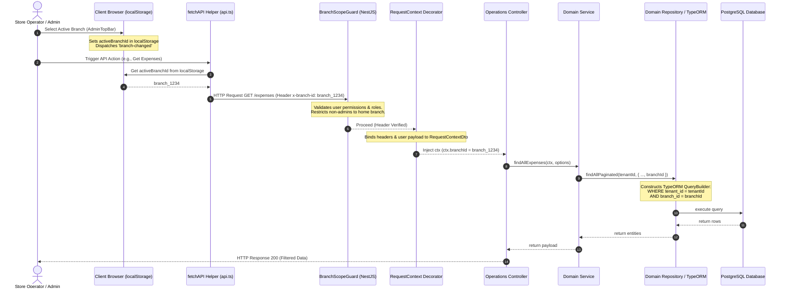

# ERP Multi-Branch Data Scoping Architecture

This document defines the architectural patterns, request lifecycle, and data scoping rules established for multi-branch support across the e-commerce SaaS ERP ecosystem.

---

## 1. Overview & Goals
In this multi-tenant system, a catalog (products, variants, brands) is shared globally at the **Tenant** level, while operational transactions, financial entries, and human resources are scoped at the **Branch** level. 

Instead of a complex, multi-warehouse stock-routing system, the active branch context implements logical **Data Scoping** ("Branch-by-data visibility"). Every operator or manager sees and interacts with data isolated to their authorized operating branch.

---

## 2. Request Scoping Lifecycle

The following sequence diagram outlines how the client-side active branch selection is propagated, validated, and applied to database queries:



---

## 3. Core Architectural Components

### A. Client-Side Header Injection (`client/services/api.ts`)
The `fetchAPI` helper acts as a global fetch wrapper. If a browser context is active, it reads `activeBranchId` from `localStorage` and appends it to request headers:
```typescript
if (typeof window !== "undefined" && !headers["x-branch-id"]) {
  const activeBranchId = localStorage.getItem("activeBranchId");
  if (activeBranchId) {
    headers["x-branch-id"] = activeBranchId;
  }
}
```

### B. Backend Context Parsing & Authorization (`BranchScopeGuard`)
The `BranchScopeGuard` operates at the route-handler boundary:
1. **Corporate Administrators / Super Admins:** Can switch dynamically to any branch by passing the `x-branch-id` header.
2. **Restricted Employees / Branch Managers:** Cannot switch scopes. If they attempt to pass an unauthorized `x-branch-id` header, a `ForbiddenException` is thrown.
3. **Implicit Scoping:** If a restricted user passes no header, the guard automatically binds the user's home branch (`user.branchId`) to the request headers.

### C. Database Query Isolation (`TypeORM Repositories`)
Database tables holding branch-scoped records (e.g., `expenses`, `employees`, `attendance_sessions`) use a nullable foreign key `branch_id` referencing the `branches` table.
Repositories construct queries containing:
```typescript
if (branchId) {
  qb.andWhere('entity.branchId = :branchId', { branchId });
}
```

---

## 4. Domain Boundaries Mapping

The following rules dictate how various transaction domains scope data:

| Entity / Domain | Scoped by Branch? | Creation Rule | Scoping Strategy |
| :--- | :--- | :--- | :--- |
| **Expenses** | Yes | Auto-assigned from `ctx.branchId` if not specified in DTO. | Paginated list, raw reports, and P&L aggregates filter by `branchId`. |
| **Employees** | Yes | Auto-assigned from `ctx.branchId` on profile creation. | Employee listing filtered by `branchId`. |
| **Attendance Sessions** | Yes | Assigned to employee's `branchId` at clock-in. | Session history and hourly statistics filtered by `branchId`. |
| **Financial Reports** | Yes | N/A | Financial summaries, aggregates, and cash flows query branch-scoped transactions. |
| **Product Catalog** | No (Shared) | Handled globally. | Unified across all branches. |
| **Customer Directory** | No (Shared) | Handled globally. | Unified across all branches. |

---

## 5. Implementation Reference Checklist
When adding branch scoping to any new domain or controller:
1. Ensure the DB Entity defines a nullable `branchId` column and standard TypeORM relationship.
2. Register `BranchScopeGuard` in the controller:
   ```typescript
   @UseGuards(JwtAuthGuard, SubscriptionGuard, BranchScopeGuard)
   ```
3. Pass `RequestContextDto` to the service method.
4. Extract `ctx.branchId` and filter TypeORM queries in the repository layer.
5. Scope any cached lists or queries by including the `branchId` in the cache key format.
