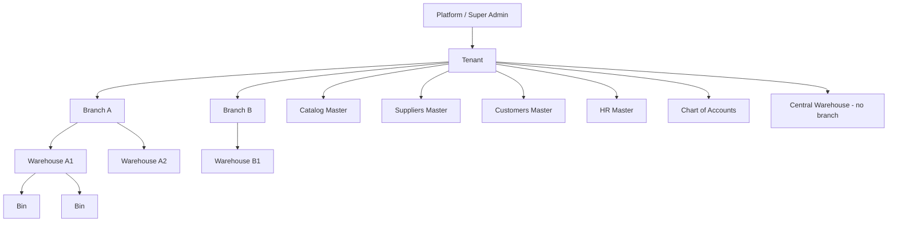
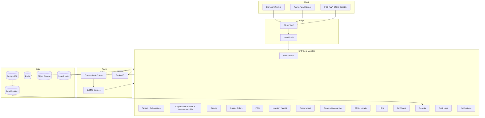
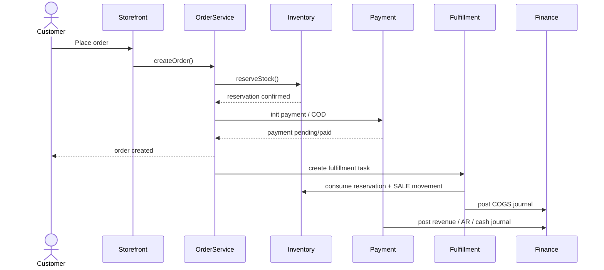
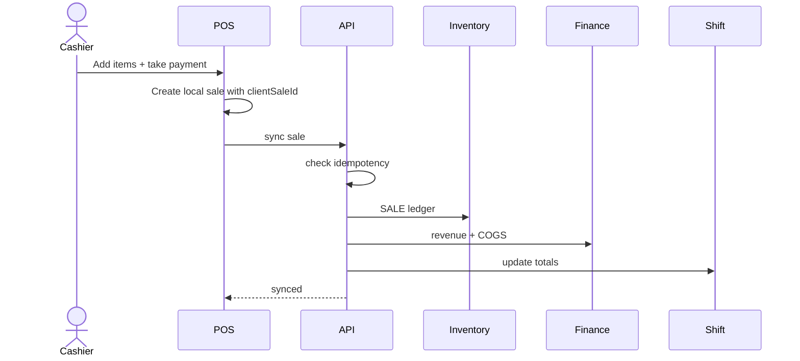
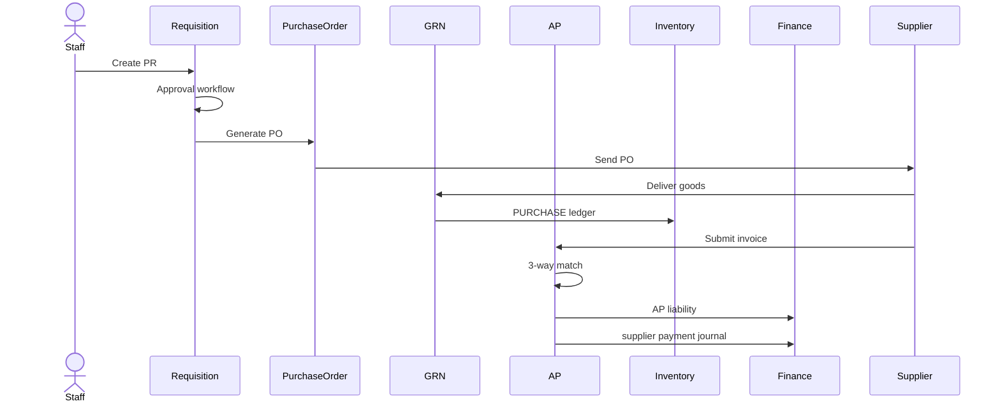
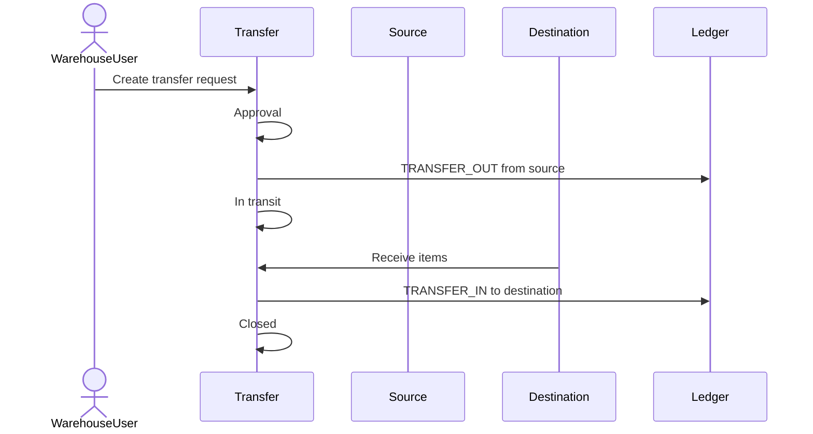
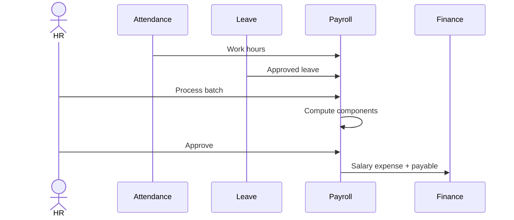

# ERP System Design

> Senior engineering system design for the `eCommerce-multi-tenant-saas` platform as a multi-tenant ERP, POS, CRM, procurement, inventory, finance, and HRM platform.
> AI is intentionally excluded. AI/API features will sit on top of this ERP core later as a separate extension layer.
> Date: 2026-05-20

---

## Table of Contents

**Part I — Foundations**
1. [Purpose & Scope](#1-purpose--scope)
2. [Goals & Non-Goals](#2-goals--non-goals)
3. [Design Principles](#3-design-principles)
4. [Glossary](#4-glossary)

**Part II — Boundaries (Tenant / Branch / Warehouse)**
5. [Hierarchy Overview](#5-hierarchy-overview)
6. [Tenant Boundary](#6-tenant-boundary)
7. [Branch Boundary](#7-branch-boundary)
8. [Warehouse Boundary](#8-warehouse-boundary)
9. [User & Customer Scope Inside Boundaries](#9-user--customer-scope-inside-boundaries)
10. [Cross-Boundary Operations](#10-cross-boundary-operations)
11. [Boundary Enforcement Rules](#11-boundary-enforcement-rules)
12. [Data Ownership Matrix](#12-data-ownership-matrix)

**Part III — Architecture**
13. [High-Level Architecture](#13-high-level-architecture)
14. [Technology Stack](#14-technology-stack)
15. [Bounded Contexts (Modules)](#15-bounded-contexts-modules)
16. [Module Ownership & Service Boundaries](#16-module-ownership--service-boundaries)

**Part IV — Domain Workflows & Rules**
17. [Core Workflows](#17-core-workflows)
18. [Domain Invariants](#18-domain-invariants)
19. [Data Model Strategy](#19-data-model-strategy)

**Part V — Reliability**
20. [Transaction Boundaries](#20-transaction-boundaries)
21. [Locking Strategy](#21-locking-strategy)
22. [Event-Driven Architecture](#22-event-driven-architecture)
23. [Failure Mode Analysis](#23-failure-mode-analysis)
24. [Reconciliation & Repair Tools](#24-reconciliation--repair-tools)

**Part VI — APIs, Access & Security**
25. [API Contract Standards](#25-api-contract-standards)
26. [RBAC, Feature Gating & Scope](#26-rbac-feature-gating--scope)
27. [Security](#27-security)

**Part VII — Infrastructure**
28. [Database Constraints & Indexes](#28-database-constraints--indexes)
29. [Caching Strategy](#29-caching-strategy)
30. [Offline POS Design](#30-offline-pos-design)
31. [Observability](#31-observability)
32. [Deployment](#32-deployment)

**Part VIII — Delivery & Operations**
33. [Testing Strategy](#33-testing-strategy)
34. [Migration Strategy from Current Codebase](#34-migration-strategy-from-current-codebase)
35. [Production Readiness Checklist](#35-production-readiness-checklist)
36. [Phased Implementation Roadmap](#36-phased-implementation-roadmap)

**Part IX — Wrap**
37. [Acceptance Criteria](#37-acceptance-criteria)
38. [Final Senior Engineering View](#38-final-senior-engineering-view)

---

# Part I — Foundations

## 1. Purpose & Scope

This document defines the target architecture and rules to evolve the current multi-tenant eCommerce SaaS into a production-grade ERP platform.

The system supports:

- Multi-tenant store and ERP management.
- Multi-branch and multi-warehouse operations.
- Retail POS and online sales.
- Inventory ledger and warehouse workflows.
- Procurement and supplier management.
- Finance, accounting, AP, AR, and reporting.
- CRM, loyalty, wallet, and customer credit.
- HRM, attendance, leave, payroll, recruitment.
- Strong RBAC, audit logs, subscription gating, and feature permissions.

The system is designed for deterministic ERP behavior first: stock accuracy, financial correctness, tenant isolation, and auditable business workflows.

---

## 2. Goals & Non-Goals

### 2.1 Goals

- Run thousands of tenants on a shared codebase with safe isolation.
- Cover order-to-cash, procure-to-pay, inventory-to-finance, HR-to-payroll lifecycles.
- Make every business event auditable and reversible.
- Make every cross-module event idempotent.
- Keep storefront eCommerce fast while ERP back-office grows.
- Allow each tenant to opt into modules by subscription tier.

### 2.2 Non-Goals (v1)

- AI/ML features (covered in a separate document).
- Cross-tenant analytics or shared customer master.
- Heavy data warehouse — analytics rely on Postgres + read replicas + materialized views.
- Multi-region active-active database.

---

## 3. Design Principles

1. **Ledger first.** Inventory and accounting are ledger-driven. Cached counters exist only as derived values.
2. **Tenant isolation everywhere.** Every row, cache key, queue job, file path, and report carries `tenantId`.
3. **Strong consistency for money and stock.** Orders, reservations, movements, payments, and journals run inside DB transactions.
4. **Event-driven but not event-dependent for correctness.** Source-of-truth records are written transactionally; side effects flow via outbox and queues.
5. **Idempotent external operations.** Payment webhooks, POS sync, courier callbacks, queue jobs are safe to retry.
6. **Human approval for high-risk workflows.** Stock adjustments, supplier payments, payroll, journal reversals, and credit overrides require permission + audit + approval.
7. **Feature-gated by subscription.** Feature flags and RBAC permissions are separate concerns.
8. **Boundary-respecting design.** Tenant > Branch > Warehouse hierarchy is enforced consistently in services, repositories, and APIs.
9. **Reversibility.** Every business mutation must be reversible through audit/reversal paths.
10. **Boring before clever.** Make the deterministic system work; add intelligence later.

---

## 4. Glossary

| Term | Meaning |
| :--- | :--- |
| **Tenant** | A business that uses the SaaS. Top-level isolation boundary. |
| **Branch** | A physical or logical business location belonging to a tenant (store, office). |
| **Warehouse** | A physical storage location owning stock. May belong to a branch or be tenant-level. |
| **Bin** | A subdivision inside a warehouse (rack, shelf, zone). |
| **Cashier shift** | An open POS session at a register, owned by one user inside a branch. |
| **Stock reservation** | A commitment of stock for an order, not yet physically deducted. |
| **Inventory ledger** | Immutable append-only log of all stock movements. |
| **Journal entry** | A balanced double-entry accounting record. |
| **Outbox event** | A row written in the same DB transaction as a business mutation, later published as an event. |
| **Idempotency key** | A client-provided value that prevents duplicate processing of the same logical request. |
| **Feature gate** | A subscription-level check that the tenant is allowed to use a feature. |
| **Permission** | An RBAC entitlement granting a user the right to perform an action. |
| **Scope** | The branch/warehouse limit applied to a user's permissions. |

---

# Part II — Boundaries (Tenant / Branch / Warehouse)

Boundaries are the most important rules in this ERP. They define who can see what, who can do what, and how data flows between locations.

## 5. Hierarchy Overview



Rules:

- The chain is always `Platform → Tenant → Branch → Warehouse → Bin`.
- A warehouse can be attached to a branch (branch warehouse) or directly to the tenant (central/shared warehouse).
- A branch may have zero or many warehouses; a warehouse always belongs to exactly one tenant.
- Master data (catalog, suppliers, customers, CoA) lives at the tenant level and is shared across branches/warehouses.

---

## 6. Tenant Boundary

**Tenant is the strict isolation boundary.**

### 6.1 What Lives at Tenant Level

- Catalog: products, variants, categories, brands, media.
- Suppliers (master).
- Customers (master).
- Employees (master).
- Subscriptions, billing, feature flags, plan.
- Chart of accounts, fiscal periods, currency settings.
- Audit logs.
- Marketing assets, loyalty program config.
- Domain mappings, store settings.

### 6.2 Tenant-Level Rules

- A tenant cannot see or write another tenant's rows under any condition.
- Every tenant-owned table has `tenantId` (UUID) and indexes start with `tenantId`.
- Tenant context is **derived from the authenticated session or domain**, never from request body.
- Tenant ID in URLs is forbidden for store admin; only platform admin can use a tenant query param.
- Tenant deletion is logical (soft delete) and triggers anonymization/export workflows.

### 6.3 Master Data Inside a Tenant

- A single customer can shop in any branch — there is **one customer record per tenant**, optionally tagged with `preferredBranchId`.
- A single supplier serves any branch/warehouse — there is **one supplier record per tenant**.
- A single product has **one master** but can have different stock per warehouse and different prices per price book.

---

## 7. Branch Boundary

**Branch is the operational dimension for retail/store activity and reporting.**

### 7.1 What Lives at Branch Level

- POS registers.
- Cashier shifts.
- Local staff team and scoped roles.
- Branch-specific opening hours and rules.
- Branch attendance/HR view.
- Branch-tagged orders (for reports).
- Branch-attached warehouses (optional ownership).
- Local promotions / branch-tagged campaigns (optional).
- Local courier/payment overrides if allowed.

### 7.2 Branch-Level Rules

- Branch belongs to exactly one tenant.
- Branch acts as a **reporting dimension** for sales, POS, HR, expenses, and stock movements.
- Branch cannot own catalog products, customers, suppliers, or accounts — these are tenant-level.
- A branch user without explicit cross-branch permission cannot read other branches' data.
- Inventory belonging to a branch warehouse is reported under that branch.
- A branch can be temporarily disabled without deleting historical data.

### 7.3 Branch and Customer

- Customer profile is tenant-wide.
- `preferredBranchId` is informational and used by:
  - branch marketing,
  - default branch for online orders,
  - branch-specific loyalty rules (when enabled).

### 7.4 Branch and Orders

- Online orders default to a tenant view but can be tagged with a fulfillment branch.
- POS orders are inherently branch-scoped (cashier shift → register → branch).
- Online orders can be **assigned to a branch for fulfillment** and reported there.

---

## 8. Warehouse Boundary

**Warehouse is the physical inventory ownership boundary.**

### 8.1 What Lives at Warehouse Level

- Stock on hand.
- Bins / racks / zones.
- Inventory ledger entries (`warehouseId` required for physical events).
- Stock reservations (warehouse-allocated).
- Goods received notes (GRN).
- Stock transfers (out / in).
- Cycle counts and adjustments.
- Fulfillment tasks (pick/pack/ship from the warehouse).

### 8.2 Warehouse-Level Rules

- A warehouse always belongs to exactly one tenant.
- A warehouse may belong to one branch or be tenant-level (central/shared).
- Physical stock movement always has `warehouseId`.
- Reservation always has `warehouseId`.
- Catalog product master never carries warehouse-specific stock; stock is derived from ledger by `(tenantId, productId, variantId?, warehouseId)`.
- Negative stock requires an explicit approved override.

### 8.3 Warehouse and Reporting

- Stock-on-hand reports group by warehouse, but can roll up to branch (sum of warehouses attached) and to tenant (all warehouses).
- Stock valuation is a tenant-level financial summary, decomposable to warehouses.

### 8.4 Bins

- Bins exist for high-density picking accuracy.
- Bins are optional and can be added incrementally per tenant.
- Bin-level stock is a refinement of warehouse stock, not a separate boundary.

---

## 9. User & Customer Scope Inside Boundaries

### 9.1 Staff Scope

Each staff user has:

- `tenantId` — strict isolation.
- `roleIds` — assigned roles (each role has permissions).
- `branchScope` — list of branches the user can act on (may be `ALL`).
- `warehouseScope` — list of warehouses the user can act on (may be `ALL`).

Examples:

- A **Tenant Owner** has `branchScope: ALL`, `warehouseScope: ALL`.
- A **Branch Manager** has `branchScope: [branchA]`, `warehouseScope: [warehouses inside branchA]`.
- A **Warehouse Clerk** has `warehouseScope: [warehouseA1]`, no branch admin scope.
- A **Cashier** has `branchScope: [branchA]`, restricted POS permissions, no admin access.
- An **Accountant** is `branchScope: ALL` typically but only finance permissions.

### 9.2 Customer Scope

- Customer is **tenant-wide**.
- `preferredBranchId` is informational for marketing / branch reports.
- A customer cannot belong to a branch in a way that blocks them from shopping elsewhere in the tenant.
- Customer credit limit, wallet, loyalty are tenant-wide (not branch-specific) unless explicitly enabled.

### 9.3 Supplier Scope

- Supplier is **tenant-wide**.
- A PO can be issued from any branch/warehouse with permission.
- Supplier ledger (AP) is tenant-wide.

---

## 10. Cross-Boundary Operations

Some operations cross the natural boundary. They need explicit cross-context services and explicit permissions.

| Operation | Crosses | Rule |
| :--- | :--- | :--- |
| Stock transfer between warehouses | Warehouse ↔ Warehouse (same tenant) | First-class transfer document with statuses `DRAFT`, `APPROVED`, `IN_TRANSIT`, `RECEIVED`. Requires permission on both sides. |
| Branch reassignment of a warehouse | Branch ↔ Branch (same tenant) | Org-admin permission only. Future inventory ledger keeps prior branch dimension on historical rows. |
| Cross-branch sale fulfillment | Branch A order → Warehouse in Branch B | Requires fulfillment-routing permission. Reports attribute revenue to selling branch, COGS to source warehouse. |
| Customer order across branches | Customer (tenant) ↔ multiple branches | Allowed; order is tagged with selling branch (or none for online). |
| Procurement for multiple warehouses | PO header ↔ multiple GRNs | PO header is tenant-level; GRN(s) are warehouse-level. |
| Payroll for multi-branch staff | HR ↔ many branches | Payroll batch tenant-level; payslip carries branch tag. |
| Refund to wallet | Order branch ↔ Customer wallet (tenant) | Wallet ledger is tenant-level; record references the original branch/order. |

**Rule:** No service can perform a cross-boundary write silently. There must be an explicit method (e.g. `StockTransferService.create`), an explicit permission, and an audit trail.

---

## 11. Boundary Enforcement Rules

### 11.1 Backend Enforcement

- Every repository method takes `RequestContextDto` and filters by `tenantId`.
- Every branch/warehouse-scoped query also filters by `branchId` / `warehouseId` when scope is restricted.
- Cross-tenant data is impossible to retrieve via app paths; only platform admin SQL/jobs can.
- Guards:
  - `JwtAuthGuard` → authenticates user.
  - `SubscriptionGuard` → feature gate.
  - `PermissionsGuard` → permission check.
  - `BranchScopeGuard` → branch limit.
  - `WarehouseScopeGuard` → warehouse limit.

### 11.2 Foreign Key Tenant Consistency

When linking a warehouse to a branch, link a PO to a supplier, etc., the system must validate that all referenced rows belong to the same tenant.

Pattern:

```sql
ALTER TABLE warehouses
ADD CONSTRAINT warehouses_branch_same_tenant
CHECK (
  branch_id IS NULL OR
  branch_id IN (SELECT id FROM branches WHERE tenant_id = warehouses.tenant_id)
);
```

In practice this is enforced in repositories (validate `tenantId` match) and tested as integration invariants.

### 11.3 Cache and Queue Enforcement

- Cache key prefix: `t:{tenantId}:...`.
- Queue job payload schema requires `tenantId`. Workers reject jobs without it.
- Search index naming: `t-{tenantId}-{resource}`.
- File storage prefix: `t/{tenantId}/...`.

### 11.4 Frontend Enforcement

- Sidebar groups filtered by user role + branch scope.
- Resource lists default to user's scope (e.g. branch manager sees only their branch orders).
- Scope override (e.g. "All branches") requires explicit permission.

### 11.5 Test Enforcement

- Integration tests must include "User from tenant A cannot read tenant B" cases.
- Integration tests must include "Branch manager B cannot view branch A POS data".
- Integration tests must include "Warehouse clerk B cannot adjust warehouse A stock".

---

## 12. Data Ownership Matrix

| Resource | Tenant | Branch | Warehouse | Notes |
| :--- | :---: | :---: | :---: | :--- |
| Products / Variants | ✅ |  |  | Master at tenant. |
| Categories / Brands | ✅ |  |  | Tenant-wide. |
| Customers | ✅ |  |  | Tenant-wide; preferredBranch is informational. |
| Suppliers | ✅ |  |  | Tenant-wide. |
| Employees (master) | ✅ |  |  | Optional branch assignment. |
| Chart of Accounts | ✅ |  |  | Tenant-wide. |
| Journals / Ledger | ✅ |  |  | Branch is reporting dimension on line. |
| Orders (online) | ✅ | optional |  | Branch may be assigned for fulfillment. |
| Orders (POS) | ✅ | ✅ |  | Always belong to a branch via shift/register. |
| Returns | ✅ | optional |  | Inherits from the original order. |
| Stock on hand | ✅ | rollup | ✅ | Authoritative per warehouse. |
| Inventory ledger | ✅ | dim | ✅ | Warehouse required; branch is a dimension. |
| Stock reservation | ✅ |  | ✅ | Reserve by warehouse. |
| GRN / Stock receipt | ✅ | dim | ✅ | Warehouse required. |
| Stock transfer | ✅ |  | ✅ × 2 | Source and destination warehouses. |
| POS register | ✅ | ✅ |  | Belongs to a branch. |
| POS shift | ✅ | ✅ |  | Belongs to a branch via register. |
| Cash drawer movements | ✅ | ✅ |  | Belongs to a shift. |
| Purchase orders | ✅ | optional | optional | PO is tenant-level; warehouse on lines. |
| Supplier invoices | ✅ |  |  | Tenant-wide. |
| AP ledger | ✅ |  |  | Per supplier. |
| AR ledger | ✅ |  |  | Per customer. |
| Wallet / loyalty | ✅ |  |  | Per customer. |
| Payroll batch | ✅ | dim |  | Branch on slip for reporting. |
| Audit logs | ✅ |  |  | Tenant-wide append-only. |
| Notifications | ✅ |  |  | Tenant-wide; scoped by recipient. |
| Subscription / billing | ✅ |  |  | Tenant-wide. |

`dim` = dimension column for reporting only, not for ownership.

---

# Part III — Architecture

## 13. High-Level Architecture



---

## 14. Technology Stack

| Layer | Technology |
| :--- | :--- |
| Backend | NestJS 11 |
| ORM | TypeORM 0.3 |
| Database | PostgreSQL |
| Queue | BullMQ |
| Cache | Redis / cache-manager |
| Realtime | Socket.IO |
| Frontend | Next.js 16 + React 19 |
| Styling | Tailwind CSS 4 |
| Auth | JWT + Passport |
| Validation | class-validator, Zod |
| Files | Existing file module, should evolve to S3-compatible storage |
| Payments | Existing payment module + gateway integrations |
| Courier | Pathao, Steadfast |

---

## 15. Bounded Contexts (Modules)

### 15.1 Tenant / Subscription
- Onboarding, plans, billing, feature entitlement, suspension.

### 15.2 Organization
- Branch, warehouse, warehouse bin, default warehouse, branch-warehouse links.

### 15.3 Catalog
- Products, variants, categories, brands, media, price books, reviews, taxes.

### 15.4 Sales / Orders
- Online orders, admin-created orders, lifecycle, coupons/promotions, payments, invoices, returns.

### 15.5 POS
- Registers, shifts, sale sync, receipts, multi-payment, cash drawer reconciliation.

### 15.6 Inventory / WMS
- Ledger, reservations, transfers, adjustments, cycle counts, batch/expiry, low-stock alerts.

### 15.7 Procurement
- Suppliers, PR, RFQ, PO, GRN, supplier invoice, debit note, supplier payment, 3-way match.

### 15.8 Finance / Accounting
- CoA, journals, GL, P&L, BS, cash flow, AP, AR, tax, fiscal periods, reversals.

### 15.9 CRM / Loyalty
- Customer 360, segments, loyalty points, wallet, credit limits, AR aging, referrals, consent.

### 15.10 HRM
- Departments, designations, employees, shifts, attendance, leave, payroll, recruitment, performance.

### 15.11 Fulfillment
- Pick/pack/ship, multi-warehouse routing, split shipments, courier integration.

### 15.12 Reports
- Tenant + branch + warehouse rollups; export center.

### 15.13 Audit & Notifications
- Append-only audit log; in-app, email, SMS, push notifications.

---

## 16. Module Ownership & Service Boundaries

### 16.1 Ownership Matrix

| Data / Action | Owning module | Other modules can |
| :--- | :--- | :--- |
| Product master | Catalog | Read product snapshots. |
| Product stock | Inventory | Request availability / reservation / movement only. |
| Order lifecycle | Sales | Trigger fulfillment / payment / finance events. |
| POS sale | POS | Create sales through Sales + Inventory + Finance services. |
| Supplier master | Procurement | Finance reads AP relations. |
| AP ledger | Finance | Procurement triggers events. |
| AR ledger | Finance / CRM | Sales triggers credit invoice. |
| Journal | Finance | Other modules request posting, not mutate directly. |
| Employee profile | HRM | Auth links staff user. |
| Customer profile | CRM / User | Sales reads snapshot. |
| Audit logs | System / Audit | All modules write append-only events. |

### 16.2 Service Boundary Rules

- Modules own their tables and expose services.
- Cross-module writes go through services, not repositories.
- Shared repositories across modules are a smell unless infrastructure-level.
- Business events should carry enough snapshot data to preserve historical truth.

Snapshot examples:

- Order item stores product name, SKU, price, tax, discount snapshot.
- Supplier invoice stores supplier name and tax snapshot.
- Payroll slip stores salary component snapshot.

---

# Part IV — Domain Workflows & Rules

## 17. Core Workflows

### 17.1 Order-to-Cash



### 17.2 POS Sale



### 17.3 Procure-to-Pay



### 17.4 Inventory Transfer



### 17.5 HR-to-Payroll



---

## 18. Domain Invariants

These rules must hold even under retries, queue replays, late webhooks, and offline POS reconnects.

### 18.1 Tenant Invariants

| Invariant | Enforcement |
| :--- | :--- |
| A tenant cannot read/write another tenant's data. | `tenantId` filter in every query. |
| Cache cannot leak between tenants. | Cache key starts with `t:{tenantId}:`. |
| Queue jobs cannot run without tenant context. | Job schema requires `tenantId`. |
| Files are tenant-scoped. | Path `t/{tenantId}/...`, signed URL. |
| Reports default to tenant scope. | Service accepts `ctx` and optional branch/warehouse filters after validation. |

### 18.2 Inventory Invariants

| Invariant | Enforcement |
| :--- | :--- |
| Physical stock changes only via ledger. | No direct stock updates. |
| Reservation ≠ physical movement. | Use `stock_reservations`. |
| Available = on hand − active reservations. | `StockAvailabilityService`. |
| On hand cannot go below zero unless approved. | Lock + permission check. |
| Transfer must have equal out/in after close. | Transfer close validation. |
| Adjustment requires reason and audit. | Approval workflow + `reasonCode`. |

### 18.3 Accounting Invariants

| Invariant | Enforcement |
| :--- | :--- |
| Every journal balances. | `debitTotal == creditTotal`. |
| Posted journals are immutable. | No update/delete; reversal only. |
| Every money movement maps to a journal. | Accounting event map and reconciliation. |
| AP = unpaid supplier invoices − payments. | AP ledger consistency check. |
| AR = unpaid customer invoices − payments. | AR ledger consistency check. |
| Closed fiscal periods block postings. | Period service validates date. |

### 18.4 POS Invariants

| Invariant | Enforcement |
| :--- | :--- |
| A POS sale syncs once. | Unique `(tenantId, clientSaleId)`. |
| One open shift per cashier. | Partial unique index on open shift. |
| Closed shift rejects new sales. | Sync checks shift status. |
| Cash variance is auditable. | Shift close stores expected, counted, variance, reason. |
| Offline sale keeps sale-time price. | Order item snapshot. |

### 18.5 Procurement Invariants

| Invariant | Enforcement |
| :--- | :--- |
| PO cannot be received before approval. | Status guard. |
| GRN cannot exceed ordered qty unless tolerance allowed. | Receiving validation. |
| Supplier invoice must match PO/GRN unless override approved. | 3-way matching result. |
| Supplier payment cannot exceed open AP unless advance allowed. | Lock + check. |

### 18.6 HRM / Payroll Invariants

| Invariant | Enforcement |
| :--- | :--- |
| Payroll batch cannot be paid before approval. | Status guard. |
| Approved payroll posts journal exactly once. | Idempotency key `payroll:{batchId}:journal`. |
| Attendance cannot be edited silently. | Correction record with approver. |
| Sensitive employee fields need stricter permission. | Field-level checks. |

---

## 19. Data Model Strategy

### 19.1 Shared Rules

- Every tenant-owned table includes `tenantId`.
- Every business document has a status enum and audit timestamps.
- Every ledger table is append-only.
- Every money table stores currency + exchange-rate snapshot.
- Every high-risk action stores `createdBy`, `approvedBy`, `approvedAt`, `reason`.

### 19.2 New Tables to Add

**Inventory**

- `stock_reservations`
- `stock_transfers`, `stock_transfer_items`
- `inventory_lots`
- `cycle_counts`, `cycle_count_items`
- `inventory_adjustment_approvals`

**Procurement**

- `purchase_requisition_approvals`
- `rfq_suppliers`, `quotation_items`
- `supplier_invoices`, `supplier_invoice_items`
- `three_way_match_results`
- `supplier_payment_allocations`

**Finance**

- `accounting_events`
- `journal_reversals`
- `fiscal_periods`
- `tax_codes`, `tax_jurisdictions`
- `customer_ar_ledger`
- `payment_allocations`

**CRM**

- `customer_segments`, `customer_segment_members`
- `loyalty_programs`, `loyalty_tiers`, `loyalty_ledger`
- `wallet_ledger`
- `ar_ledger`
- `referrals`
- `customer_notes`
- `customer_communication_log`

**POS**

- `pos_cash_movements`
- `pos_sync_attempts`
- `pos_sale_idempotency_keys`
- `pos_return_sessions`

**HRM**

- `payroll_components`
- `payroll_approvals`
- `attendance_policies`
- `holiday_calendars`
- `overtime_rules`

---

# Part V — Reliability

## 20. Transaction Boundaries

### 20.1 Must Commit Atomically

| Workflow | Inside one DB transaction |
| :--- | :--- |
| Online order creation | Order header, items, reservations, coupon usage, outbox event. |
| POS sale sync | Idempotency record, order, items, payment, SALE movement, shift totals, journal, outbox. |
| PO receiving | GRN, GRN items, PURCHASE movement, AP accrual, outbox. |
| Supplier payment | Payment record, AP ledger, journal, outbox. |
| Customer credit sale | Order, AR invoice, AR ledger, journal, outbox. |
| Stock adjustment approval | Approval record, ledger entry, journal if value changes. |
| Payroll approval | Batch status, payslips, payroll journal, outbox. |

### 20.2 Should Run Async

| Async task | Why |
| :--- | :--- |
| Email/SMS/push | Don't block user. |
| Search index update | Eventually consistent. |
| Dashboard aggregates | Seconds/minutes lag is fine. |
| PDF generation | Slow and retryable. |
| Export jobs | Large data volumes. |
| Courier order creation | External dependency. |

---

## 21. Locking Strategy

| Resource | Lock | Why |
| :--- | :--- | :--- |
| Product/variant stock availability | Pessimistic write / advisory | Prevent oversell. |
| Customer AR balance | Pessimistic write | Prevent credit race. |
| Supplier AP balance | Pessimistic write | Prevent overpayment. |
| POS shift totals | Pessimistic write | Prevent total corruption. |
| Journal account balance | Pessimistic write | Maintain running balance. |

Advisory lock key examples:

```text
tenant:{tenantId}:stock:{warehouseId}:{productId}:{variantId}
tenant:{tenantId}:ar:{customerId}
tenant:{tenantId}:ap:{supplierId}
tenant:{tenantId}:shift:{shiftId}
```

Lock acquisition order (to avoid deadlocks):

1. Tenant / account.
2. Customer / supplier.
3. Product / variant.
4. Warehouse / bin.
5. Journal account.

---

## 22. Event-Driven Architecture

### 22.1 Why Events

Events decouple core workflows from side effects (notifications, search index, dashboards, downstream reports).

### 22.2 Transactional Outbox

```sql
outbox (
  id uuid primary key,
  tenant_id uuid not null,
  aggregate_type text not null,
  aggregate_id uuid not null,
  event_type text not null,
  payload jsonb not null,
  status text default 'PENDING',
  attempts int default 0,
  next_attempt_at timestamptz default now(),
  created_at timestamptz default now()
);
```

A dispatcher worker reads `PENDING` rows and publishes to BullMQ. Consumers ack only on success.

### 22.3 Important Events

| Event | Consumers |
| :--- | :--- |
| `OrderCreated` | Invoice, notification, reservation expiry job. |
| `OrderPaid` | Finance, fulfillment. |
| `OrderShipped` | Inventory, finance, notification. |
| `ReturnApproved` | Inventory, finance, wallet/loyalty. |
| `PoApproved` | Supplier notification. |
| `GrnVerified` | Inventory, AP. |
| `SupplierInvoicePosted` | Finance / AP. |
| `SupplierPaymentRecorded` | Finance / AP. |
| `StockLow` | Notification, procurement. |
| `PayrollApproved` | Finance, notification. |
| `CustomerCreditExceeded` | CRM, notification. |

---

## 23. Failure Mode Analysis

### 23.1 Payment Webhook Arrives Twice
- Idempotent by gateway transaction ID.
- Repeat call returns success without mutation.
- No duplicate payment row, revenue posting, or receipt email.

### 23.2 POS Device Reconnects After Hours Offline
- POS sends queued sales with `clientSaleId`.
- Backend processes each idempotently.
- Stock conflicts go to `CONFLICT_REVIEW`, never silently dropped.
- Shift close warns about unsynced or conflicted sales.

### 23.3 Queue Job Fails After Business Transaction
- If the side effect is source-of-truth (stock, journal), include it in the transaction.
- Pure side effects (notification, search, PDF) go through queues with retries.
- If async mutation is unavoidable, expose failures in a reconciliation dashboard.

### 23.4 Accounting Posting Fails
- Required journal failure should fail the parent transaction.
- Outbox-style postings store `FAILED` status with retry path.
- Admin reconciliation dashboard surfaces failed events.

### 23.5 Redis Unavailable
- Critical writes continue.
- Rate limiting degrades to local fallback.
- Queue processing pauses; API does not depend on Redis as source of truth.

### 23.6 DB Deadlock
- Standardize lock order (see §21).
- Retry deadlock-safe transactions with jittered backoff up to 2-3 times.

---

## 24. Reconciliation & Repair Tools

### 24.1 Reconciliation Jobs

| Job | Checks |
| :--- | :--- |
| Stock reconciliation | Ledger aggregate vs cached stock summary. |
| Accounting balance reconciliation | Account balance vs ledger entry sum. |
| AP reconciliation | Supplier AP ledger vs unpaid invoices. |
| AR reconciliation | Customer AR ledger vs unpaid invoices. |
| POS shift reconciliation | Shift totals vs synced payments. |
| Reservation reconciliation | Active reservations vs open order lines. |
| Outbox reconciliation | Failed / stuck events. |

### 24.2 Admin Repair Rules

- High-level permission required.
- Audit log entry mandatory.
- No ledger deletion — repairs create correcting entries.
- Show before/after numbers in the repair UI.

---

# Part VI — APIs, Access & Security

## 25. API Contract Standards

### 25.1 Response Shape

Success:

```json
{
  "success": true,
  "statusCode": 200,
  "message": "Human readable message",
  "data": {},
  "meta": { "requestId": "uuid", "tenantId": "uuid" }
}
```

Error:

```json
{
  "success": false,
  "statusCode": 400,
  "message": "Validation failed",
  "error": { "code": "STOCK_INSUFFICIENT", "details": {} },
  "meta": { "requestId": "uuid" }
}
```

### 25.2 Stable Error Codes

| Code | Meaning |
| :--- | :--- |
| `TENANT_NOT_FOUND` | Invalid tenant context. |
| `FEATURE_NOT_ENABLED` | Subscription does not allow feature. |
| `PERMISSION_DENIED` | User lacks permission. |
| `SCOPE_DENIED` | User cannot access branch/warehouse. |
| `STOCK_INSUFFICIENT` | Not enough available stock. |
| `CREDIT_LIMIT_EXCEEDED` | Customer exceeds credit limit. |
| `SHIFT_CLOSED` | POS shift no longer open. |
| `DUPLICATE_IDEMPOTENCY_KEY` | Request already processed. |
| `IDEMPOTENCY_PAYLOAD_MISMATCH` | Same key, different body. |
| `JOURNAL_UNBALANCED` | Debit/credit mismatch. |
| `FISCAL_PERIOD_CLOSED` | Posting date is locked. |
| `THREE_WAY_MATCH_FAILED` | PO / GRN / invoice mismatch. |

### 25.3 Pagination

```text
GET /resource?page=1&limit=20&q=...&sort=-createdAt
```

Meta:

```json
{ "page": 1, "limit": 20, "total": 120, "totalPages": 6 }
```

### 25.4 Idempotency Header

```http
Idempotency-Key: uuid-or-client-generated-key
```

Backend stores `(tenantId, idempotencyKey, actionType, requestHash, responseBody, status, expiresAt)`. Different payload with same key returns `409 IDEMPOTENCY_PAYLOAD_MISMATCH`.

### 25.5 Naming Convention

```text
/admin/catalog/products
/admin/sales/orders
/admin/sales/returns
/admin/pos/registers
/admin/pos/shifts
/admin/inventory/ledger
/admin/inventory/reservations
/admin/inventory/transfers
/admin/procurement/requisitions
/admin/procurement/purchase-orders
/admin/procurement/grn
/admin/procurement/supplier-invoices
/admin/finance/journals
/admin/finance/reports/profit-loss
/admin/crm/customers
/admin/crm/segments
/admin/hrm/employees
/admin/hrm/payroll
```

Keep existing routes as aliases; new routes follow the standard above.

---

## 26. RBAC, Feature Gating & Scope

### 26.1 Layered Access Model

| Layer | Question | Example |
| :--- | :--- | :--- |
| Subscription feature gate | Is the tenant allowed this feature? | `/admin/inventory/transfers` |
| RBAC permission | Is the user allowed this action? | `inventory.transfer.approve` |
| Branch scope | Can the user operate on this branch? | Branch manager A vs B. |
| Warehouse scope | Can the user operate on this warehouse? | Clerk A vs W1. |
| Audit log | Who did what, when, and why? | Always written. |

All four must pass for any high-risk write.

### 26.2 Example Permissions

```text
inventory.read
inventory.adjust.create
inventory.adjust.approve
inventory.transfer.create
inventory.transfer.approve
procurement.po.create
procurement.po.approve
finance.journal.post
finance.journal.reverse
pos.shift.close
crm.credit_limit.approve
hrm.payroll.process
hrm.payroll.approve
```

### 26.3 High-Risk Actions

Require an additional explicit reason captured in the audit log:

- Stock adjustment approval.
- Stock transfer approval.
- Supplier payment.
- Journal reversal.
- Credit-limit override.
- Payroll approval.
- POS cash variance approval.

---

## 27. Security

### 27.1 Baseline

- HTTPS only.
- JWT with rotating refresh tokens.
- Rate limiting via `@nestjs/throttler` + Redis.
- Input validation (DTO + Zod).
- File upload scanning.
- Signed URLs for private files.
- Strict CORS.

### 27.2 Tenant Security

- Always filter by `tenantId`.
- Never trust `tenantId` from request body.
- Tenant comes from authenticated token or domain.
- Cache keys and queue payloads must include `tenantId`.

### 27.3 Finance Security

- Posting permission separated from finance read.
- Reversal permission separated from posting.
- Period close permission restricted.
- Supplier payment requires approval.
- Payroll approval requires its own permission.

---

# Part VII — Infrastructure

## 28. Database Constraints & Indexes

### 28.1 Must-Have Constraints

```sql
-- POS idempotency
CREATE UNIQUE INDEX uq_pos_sale_client_id
ON pos_sales (tenant_id, client_sale_id);

-- One open shift per cashier
CREATE UNIQUE INDEX uq_open_shift_per_user
ON pos_shifts (tenant_id, user_id)
WHERE status = 'OPEN';

-- Unique SKU per tenant
CREATE UNIQUE INDEX uq_product_sku_tenant
ON products (tenant_id, sku)
WHERE sku IS NOT NULL;

-- Unique supplier invoice number per supplier
CREATE UNIQUE INDEX uq_supplier_invoice_number
ON supplier_invoices (tenant_id, supplier_id, invoice_number);

-- One journal per source event
CREATE UNIQUE INDEX uq_journal_source
ON journal_entries (tenant_id, reference_type, reference_id, type);
```

### 28.2 Recommended Indexes

| Table | Index |
| :--- | :--- |
| `orders` | `(tenant_id, status, created_at)` |
| `orders` | `(tenant_id, user_id, created_at)` |
| `inventory_ledger` | `(tenant_id, product_id, variant_id, warehouse_id, created_at)` |
| `stock_reservations` | `(tenant_id, status, expires_at)` |
| `purchase_orders` | `(tenant_id, supplier_id, status, created_at)` |
| `supplier_invoices` | `(tenant_id, supplier_id, status, due_date)` |
| `journal_entries` | `(tenant_id, date, type)` |
| `ledger_entries` | `(tenant_id, account_id, created_at)` |
| `ar_ledger` | `(tenant_id, customer_id, created_at)` |
| `ap_ledger` | `(tenant_id, supplier_id, created_at)` |
| `audit_logs` | `(tenant_id, entity, entity_id, created_at)` |

### 28.3 Partitioning Candidates

- `audit_logs` by month.
- `inventory_ledger` by tenant or month.
- `ledger_entries` by fiscal year.
- `notifications` by month.
- `outbox` periodically archived.

---

## 29. Caching Strategy

### 29.1 Key Convention

```text
t:{tenantId}:{domain}:{resource}:{paramsHash}
```

Examples:

```text
t:abc:inventory:summary
t:abc:orders:list:p1:l20:status-pending
t:abc:finance:pnl:2026-01:2026-05
```

### 29.2 Invalidation Rules

| Event | Invalidate |
| :--- | :--- |
| Product updated | Catalog/product caches, search index. |
| Ledger movement | Inventory summary, stock value reports. |
| Order created/updated | Order list, sales dashboard. |
| Journal posted | Finance reports. |
| Supplier payment | AP reports. |
| Customer payment | AR reports. |
| Payroll approved | Finance + HR reports. |

---

## 30. Offline POS Design

### 30.1 Client Storage (IndexedDB)

- Product cache, price/tax cache.
- Customer minimal profile.
- Open shift state.
- Unsynced sale queue.
- Receipt templates.

### 30.2 Sync Flow

1. POS creates a local sale with `clientSaleId`.
2. Sale is stored locally as `LOCAL_ONLY`.
3. Background sync calls `/pos/sync`.
4. Backend checks `clientSaleId`.
5. If new, it creates the order, SALE movement, journals, shift totals.
6. Response marks sale `SYNCED`.
7. If duplicate, backend returns the existing server sale.

### 30.3 Conflict Handling

| Conflict | Handling |
| :--- | :--- |
| Product price changed | Use sale-time snapshot. |
| Product deleted | Accept sale if snapshot was valid. |
| Stock insufficient | Mark conflict; manager approval needed. |
| Shift closed | Reject sync; reopen/override required. |
| Duplicate sale | Return existing sale. |

---

## 31. Observability

### 31.1 Logs

Every log includes `tenantId`, `userId`, `requestId`, `module`, `action`, `entityId`.

### 31.2 Metrics

- API latency.
- DB query time.
- Queue lag.
- Outbox backlog.
- Payment failure rate.
- POS sync failure rate.
- Journal posting failure count.
- Negative stock attempts.

### 31.3 Alerts

- Payment webhook failures.
- Accounting posting failure.
- Negative stock attempt.
- Outbox backlog above threshold.
- Redis unavailable.
- DB connection saturation.
- POS sync error spike.

---

## 32. Deployment

### 32.1 Topology

- 2+ NestJS API instances.
- 1+ Next.js storefront/admin instances.
- 1+ BullMQ worker instance.
- 1 outbox dispatcher.
- PostgreSQL primary + read replica.
- Redis managed.
- Object storage (S3-compatible).
- CDN/WAF.

### 32.2 Environments

`dev`, `staging`, `production` — each with isolated DB, Redis, file storage, payment keys, courier keys, and domain config.

---

# Part VIII — Delivery & Operations

## 33. Testing Strategy

### 33.1 Unit Tests
- Pricing, tax, discount/coupon, ledger sign rules, journal validation, permission guard behavior.

### 33.2 Integration Tests
- Order → reserve stock.
- Ship → consume reservation + SALE ledger + COGS journal.
- POS sale sync idempotency.
- PO receive → GRN + PURCHASE + AP.
- Supplier payment → AP reduction + journal.
- Return approval → restock/refund/reversal.
- Payroll approval → salary payable journal.
- **Boundary tests:** cross-tenant read denied, cross-branch read denied, cross-warehouse adjust denied.

### 33.3 E2E Tests
- Storefront checkout.
- Admin order lifecycle.
- POS shift open/sale/close.
- Procurement PO receive.
- Inventory adjustment approval.
- Payroll process approval.

### 33.4 Consistency Tests
- Stock summary = ledger aggregate.
- Account balance = ledger entries.
- AP balance = supplier invoices − payments.
- AR balance = customer invoices − payments.
- POS shift totals = synced sales + cash movements.

---

## 34. Migration Strategy from Current Codebase

### 34.1 Current Reality

Already present in the codebase:

- Inventory ledger.
- Procurement PO/GRN/supplier/AP slices.
- Finance CoA/journals/reports.
- POS register/shift/sync.
- Fulfillment pick/pack/ship.
- HRM breadth.
- RBAC and feature gates.

Partial systems that need work:

- Reservation lives as inventory transaction, not a first-class model.
- Accounting posting coverage is narrow.
- PR / RFQ / supplier invoice workflows are incomplete.
- HRM includes demo / schema-repair code.
- POS offline is not truly durable yet.

### 34.2 Safe Migration Order

1. Add idempotency infrastructure (no behavior change).
2. Add outbox table and route side effects through it.
3. Introduce `stock_reservations` alongside existing reservation ledger type.
4. Migrate order creation to write into `stock_reservations`.
5. Change fulfillment shipping to consume reservation + post SALE.
6. Add accounting events and reconciliation dashboard before expanding journal coverage.
7. Move demo/repair HRM code into scripts or dev-only endpoints.
8. Add new procurement workflows incrementally: PR → RFQ → supplier invoice.

### 34.3 Compatibility Rules

- Do not break existing routes immediately.
- Add new canonical routes and keep old aliases temporarily.
- Backfill new tables from existing records.
- Run dual-read mode first, then dual-write, then cutover.
- Add a reconciliation dashboard before disabling old behavior.

---

## 35. Production Readiness Checklist

### 35.1 Before First Real Tenant
- [ ] All tenant-owned tables have `tenantId`.
- [ ] Every admin route has feature gate + permission guard.
- [ ] POS sync idempotency exists.
- [ ] Payment webhook idempotency exists.
- [ ] Inventory reservation model exists.
- [ ] Accounting event failure is visible in admin.
- [ ] Basic backup/restore tested.
- [ ] Audit logs enabled for high-risk actions.
- [ ] Seed/demo endpoints removed from production path.
- [ ] Error codes standardized.

### 35.2 Before Multi-Branch Tenant
- [ ] Branch scope guard tested.
- [ ] Warehouse scope guard tested.
- [ ] Warehouse stock availability tested.
- [ ] Stock transfers implemented.
- [ ] POS register tied to branch.
- [ ] Cashier shift scope enforced.
- [ ] Reports filter by branch.
- [ ] Staff role assignments support branch/warehouse scope.

### 35.3 Before Finance-Heavy Tenant
- [ ] Fiscal periods.
- [ ] Journal reversal.
- [ ] AP aging.
- [ ] AR aging.
- [ ] Tax/VAT support.
- [ ] Supplier payment journal.
- [ ] Customer payment journal.
- [ ] Account reconciliation report.

### 35.4 Before Retail Chain Tenant
- [ ] Offline POS IndexedDB queue.
- [ ] Stock transfer workflow.
- [ ] Cycle counts.
- [ ] Batch/expiry if needed.
- [ ] Shift cash movements.
- [ ] POS return/exchange.
- [ ] Low-stock auto PR draft.

---

## 36. Phased Implementation Roadmap

### Phase 1 — ERP Core Stabilization
- Idempotency framework.
- Outbox dispatcher.
- First-class reservations.
- POS sync uniqueness.
- Core integration tests.

### Phase 2 — Inventory / WMS Maturity
- Stock transfers (in-transit).
- Stock adjustments approval.
- Cycle counts.
- Batch/expiry.
- Warehouse / bin reporting.

### Phase 3 — Procurement Depth
- Persistent PR workflow.
- RFQ / quotations.
- Supplier invoices.
- 3-way matching.
- Supplier payments + AP aging.

### Phase 4 — Finance System of Record
- Accounting event table.
- Journal reversals.
- Fiscal periods.
- Tax/VAT.
- AR ledger.
- Cash flow.

### Phase 5 — CRM / Loyalty
- Customer 360.
- Segments.
- Loyalty points.
- Wallet / store credit.
- Credit limits.
- AR aging.
- Referrals.

### Phase 6 — HRM Production Hardening
- Attendance policies.
- Payroll components.
- Overtime rules.
- Payroll approval.
- Payslip generation.
- Remove demo/schema-repair paths.

### Phase 7 — Future AI/API Extension (separate doc)
- Product content assistant.
- Semantic search.
- Invoice OCR.
- Admin assistant.
- Demand forecasting.
- AR collection drafts.

AI uses ERP APIs/services, never bypasses them. AI produces drafts/recommendations only.

---

# Part IX — Wrap

## 37. Acceptance Criteria

The ERP system is production-ready when:

- Tenant isolation is enforced in every repository/query.
- Branch and warehouse scope is enforced in every restricted query.
- POS sync is idempotent.
- Stock reservation and physical stock movement are separated.
- Inventory ledger never goes negative without explicit approved override.
- Every financial event posts a balanced journal.
- Posted journals are immutable.
- Procurement supports PR → PO → GRN → Supplier Invoice → Payment.
- AR/AP aging reports match their ledgers.
- Payroll is approval-based and posts accounting entries.
- High-risk operations require permission + audit reason.
- Core workflows have integration tests.
- Reports are based on ledgers/materialized views, not UI state.
- Feature gates align with subscription plan.

---

## 38. Final Senior Engineering View

Build the deterministic ERP first.

Do not start with AI, dashboards, or automation until these are solid:

- stock truth,
- money truth,
- tenant / branch / warehouse boundaries,
- idempotency,
- audit,
- permission boundaries,
- workflow approvals.

Once the ERP core is correct, AI/API extensions can sit safely on top of it. If the core is weak, AI will only make wrong decisions faster. If the core is strong, AI becomes a productivity multiplier.

---

*This document intentionally excludes detailed AI implementation. See the separate AI design only when the ERP core is ready for extension.*
