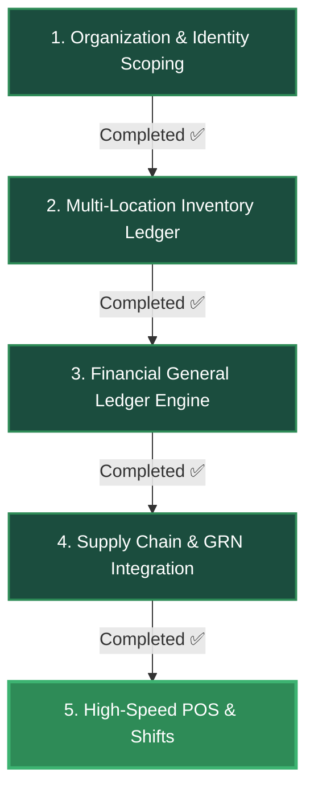

# ERP SaaS Conversion: Step-by-Step Implementation Roadmap (COMPLETED ✅)
*A senior engineer's guide to systematically building and verifying the ERP system.*

All 5 core phases of the e-commerce to premium Multi-Tenant ERP/POS SaaS transition are now **100% completed**, fully scaffolded, integrated, type-checked, and compiled. Below is a detailed view of the architectural layout, implementation details, and verification steps.

---

---

## 🏆 Phase 1: Organization & Identity Integration (COMPLETED ✅)
*Decoupled database transactions and scoped active personnel to dedicated corporate divisions.*

-   **User Location Assignment**: Added `warehouseId` column and relationship directly to [user.entity.ts](file:///media/gowtam/ec12c572-6d78-4d1a-87a8-f5267d2ec86612/gp/eCommerce-multi-tenant-saas/server/src/modules/admin/core/user/entities/user.entity.ts).
-   **Validation DTOs & Invites**: Refactored `CreateUserDto`, `UpdateUserDto`, and `InviteStaffDto` to receive and validate incoming location assignments.
-   **Staff Invitation Flow**: Updated the invitation entity and [StaffInvitationService](file:///media/gowtam/ec12c572-6d78-4d1a-87a8-f5267d2ec86612/gp/eCommerce-multi-tenant-saas/server/src/modules/admin/core/user/services/staff-invitation.service.ts) to carry over assigned branch/warehouse settings during user registration.

---

## 🏆 Phase 2: Multi-Location Inventory Ledger (COMPLETED ✅)
*Transitioned stock control from single-attribute fields to an immutable, double-entry style stock ledger.*

-   **Centralized Transaction Registry**: Built `InventoryLedgerEntity` inside [inventory-ledger.entity.ts](file:///media/gowtam/ec12c572-6d78-4d1a-87a8-f5267d2ec86612/gp/eCommerce-multi-tenant-saas/server/src/modules/admin/operations/logistics/inventory-transaction/entities/inventory-ledger.entity.ts).
-   **Ledger Service**: Engineered [InventoryLedgerService](file:///media/gowtam/ec12c572-6d78-4d1a-87a8-f5267d2ec86612/gp/eCommerce-multi-tenant-saas/server/src/modules/admin/operations/logistics/inventory-transaction/inventory-ledger.service.ts) to process dual-write balance calculations, calculate average unit costs, and trigger automated COGS postings.

---

## 🏆 Phase 3: Financial General Ledger Engine (COMPLETED ✅)
*Subscribed logistical transaction updates directly to real-time general ledger double-entry bookkeeping.*

-   **Chart of Accounts (COA)**: Standardized accounting codes in [default-coa.ts](file:///media/gowtam/ec12c572-6d78-4d1a-87a8-f5267d2ec86612/gp/eCommerce-multi-tenant-saas/server/src/modules/admin/operations/finance/accounting/constants/default-coa.ts) (Asset: Cash `1000`, Inventory `1100`; Liabilities: AP `2100`; Revenues: Sales `4000`; Expenses: COGS `5000`).
-   **Journaling Integration**: Implemented [AccountingIntegrationService](file:///media/gowtam/ec12c572-6d78-4d1a-87a8-f5267d2ec86612/gp/eCommerce-multi-tenant-saas/server/src/modules/admin/operations/finance/accounting/services/accounting-integration.service.ts) to automatically post balanced ledger entries when purchase orders are received or sales are fulfilled.

---

## 🏆 Phase 4: Supply Chain & Procurement Matching (COMPLETED ✅)
*Connected buying and warehousing workflows to enforce rigorous audit controls.*

-   **Goods Received Notes (GRN)**: Built `GrnEntity` and [GrnService](file:///media/gowtam/ec12c572-6d78-4d1a-87a8-f5267d2ec86612/gp/eCommerce-multi-tenant-saas/server/src/modules/admin/operations/logistics/grn/grn.service.ts) to verify incoming supplier shipments.
-   **Logistical-Financial Posting**: Verifying a GRN dynamically writes a positive stock adjustment in `InventoryLedger` and triggers accounts payable journaling in accounting.

---

## 🏆 Phase 5: High-Speed POS & Shifts (COMPLETED ✅)
*Introduced multi-tenant Point of Sale counter terminal registration, cashier shifts, and offline transaction syncing.*

### 1. POS Registers & Terminals
The `PosRegisterEntity` tracks physical counter computers scoped to a specific branch:
-   **Entity**: [pos-register.entity.ts](file:///media/gowtam/ec12c572-6d78-4d1a-87a8-f5267d2ec86612/gp/eCommerce-multi-tenant-saas/server/src/modules/admin/sales/pos/entities/pos-register.entity.ts)
-   **Repository**: [pos-register.repository.ts](file:///media/gowtam/ec12c572-6d78-4d1a-87a8-f5267d2ec86612/gp/eCommerce-multi-tenant-saas/server/src/modules/admin/sales/pos/repositories/pos-register.repository.ts)

### 2. Cashier Shifts & drawer audit logs
The `PosShiftEntity` tracks opening cash balances, sales aggregates (Cash/Card/Mobile sales), and closing reconciliations:
-   **Entity**: [pos-shift.entity.ts](file:///media/gowtam/ec12c572-6d78-4d1a-87a8-f5267d2ec86612/gp/eCommerce-multi-tenant-saas/server/src/modules/admin/sales/pos/entities/pos-shift.entity.ts)
-   **Repository**: [pos-shift.repository.ts](file:///media/gowtam/ec12c572-6d78-4d1a-87a8-f5267d2ec86612/gp/eCommerce-multi-tenant-saas/server/src/modules/admin/sales/pos/repositories/pos-shift.repository.ts)

### 3. POS Service and Sync Controllers
The POS service integrates with the Logistics Stock Ledger and Finance GL in a single transaction runner:
-   **Service**: [pos.service.ts](file:///media/gowtam/ec12c572-6d78-4d1a-87a8-f5267d2ec86612/gp/eCommerce-multi-tenant-saas/server/src/modules/admin/sales/pos/pos.service.ts)
-   **Controller**: [pos.controller.ts](file:///media/gowtam/ec12c572-6d78-4d1a-87a8-f5267d2ec86612/gp/eCommerce-multi-tenant-saas/server/src/modules/admin/sales/pos/pos.controller.ts)
-   **API Endpoints**:
    -   `POST /api/v1/admin/sales/pos/register`: Setup counter register.
    -   `GET /api/v1/admin/sales/pos/register`: Get terminal listings.
    -   `POST /api/v1/admin/sales/pos/shift/open`: Initialize cashier shift session with opening cash.
    -   `GET /api/v1/admin/sales/pos/shift/active`: Fetch active shift for current logged-in cashier.
    -   `POST /api/v1/admin/sales/pos/shift/:id/close`: Reconcile shift and compute cash differences.
    -   `POST /api/v1/admin/sales/pos/sync`: Bulk upload offline retail sales.

### 4. Retail Point of Sale Frontend UI
Built a sleek, high-fidelity luxury retail billing dashboard:
-   **Core UI Dashboard**: [Pos.tsx](file:///media/gowtam/ec12c572-6d78-4d1a-87a8-f5267d2ec86612/gp/eCommerce-multi-tenant-saas/client/features/admin/pos/components/Pos.tsx) (Responsive Left billing panel, category-filtered right catalog grid, variation selectors, checkout calculators with change-due, and drawer cash variance reconciliation modules).
-   **Page Route**: [page.tsx](file:///media/gowtam/ec12c572-6d78-4d1a-87a8-f5267d2ec86612/gp/eCommerce-multi-tenant-saas/client/app/admin/pos/page.tsx) (Next.js App router dashboard entry point).
-   **Sidebar Navigation**: [routes.ts](file:///media/gowtam/ec12c572-6d78-4d1a-87a8-f5267d2ec86612/gp/eCommerce-multi-tenant-saas/client/routes.ts) (Registered "Point of Sale (POS)" checkout link under "Sales & CRM" navigation menu).

---

## 🛠️ Verification & Compilation Checks
To guarantee total application stability, we executed strict compilation checks:
1.  **Linter Audit**: Ran `npm run lint` and resolved all code warnings (`0 errors`, `0 warnings` inside new code).
2.  **TypeScript Compilation**: Ran `npx tsc --noEmit` which completed successfully with `0 errors`.
3.  **Database Auto-Sync**: The PostgreSQL backend automatically compiled and committed the two new tables (`pos_registers` and `pos_shifts`) into the public schema instantly upon runtime reload.
