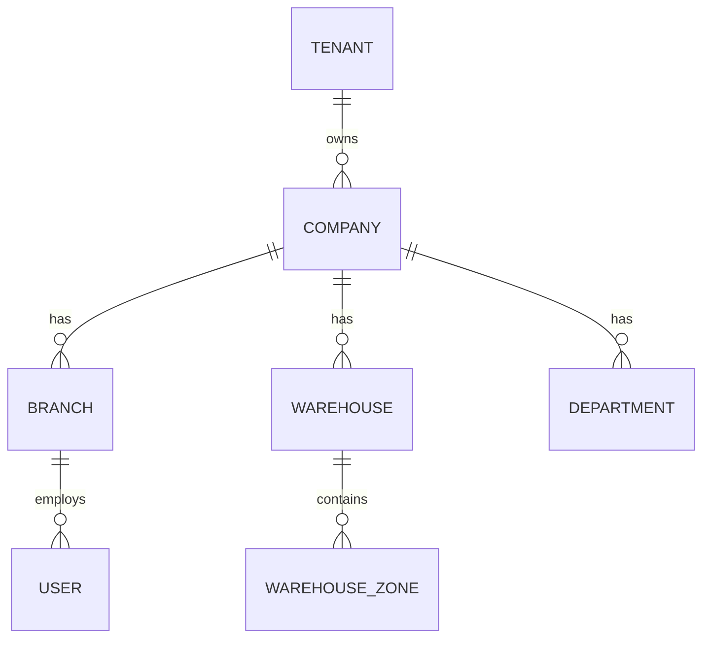
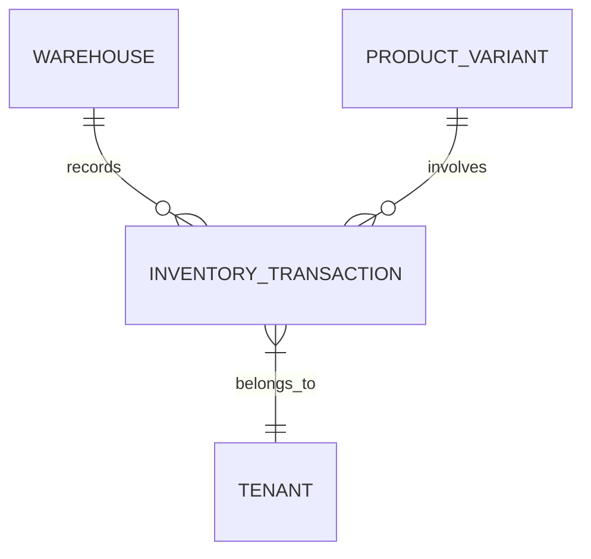
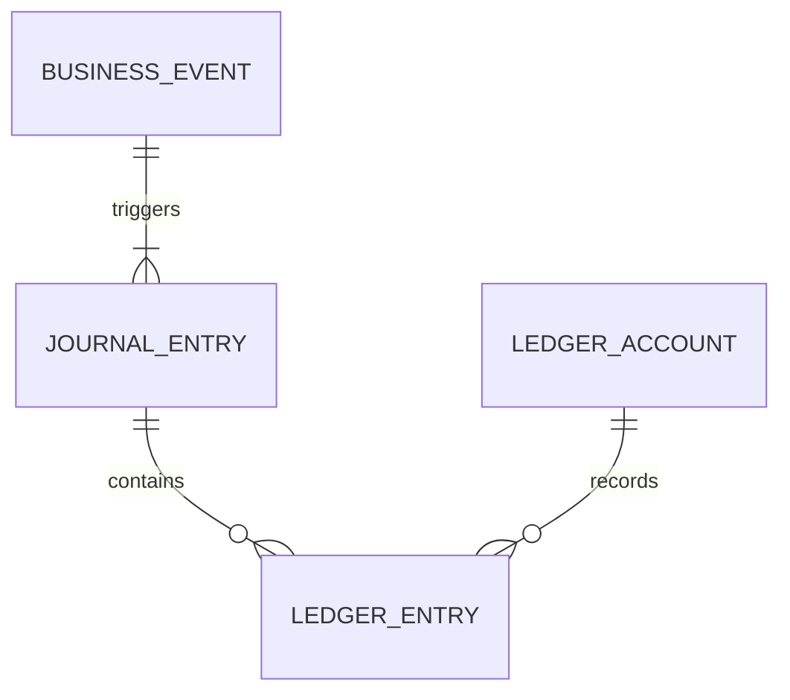
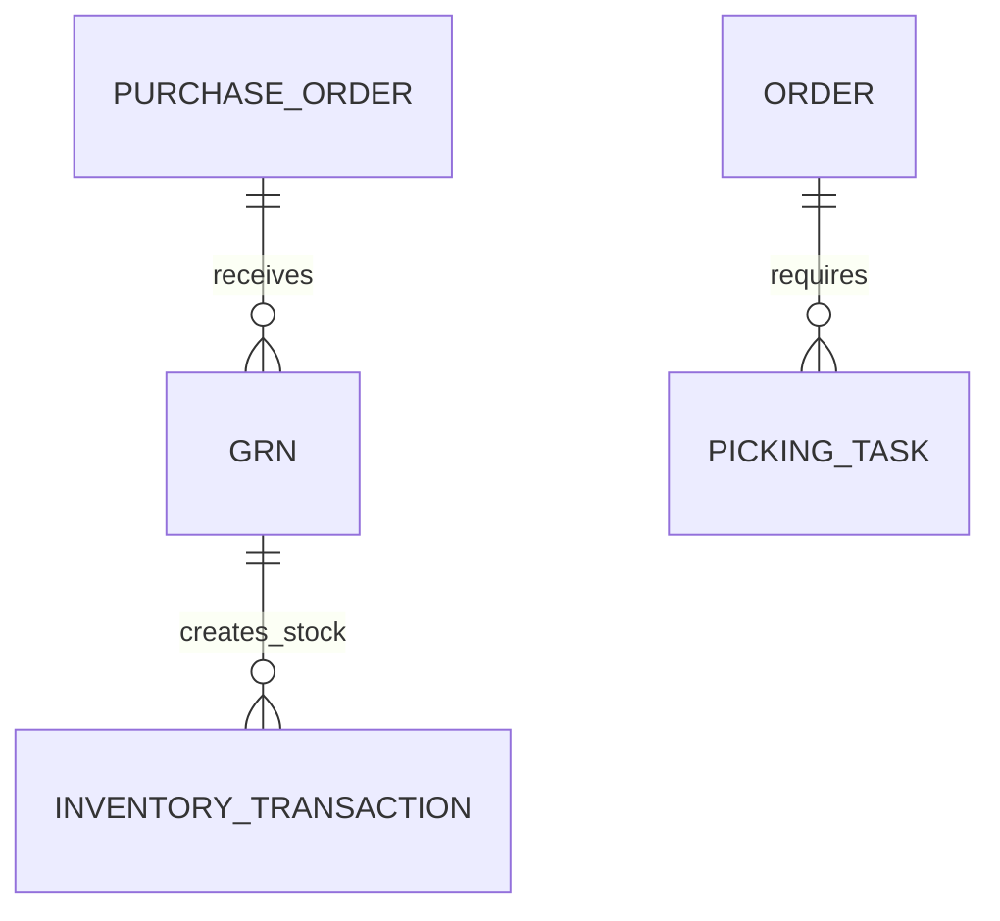

# ERP Database Design Document

This document outlines the database design for the multi-tenant SaaS ERP system, mapping existing entities to the domain-driven architecture defined in `ERP-Architecture.md` and identifying necessary additions.

## 1. Core Architecture Principles
- **Multi-tenancy**: All entities (except system-wide ones like `SubscriptionPlan`) include a `tenant_id` for data isolation.
- **Immutability**: Ledgers (Inventory, Accounting) should be used for all financial and stock changes.
- **Domain-Driven Design**: Tables are grouped by business domains.
- **Soft Deletes**: Use `deleted_at` for all business-critical entities.
- **Organizational Hierarchy**: `Tenant -> Companies -> Branches/Warehouses`.

---

## 2. Database Domains & Entities

### 2.1 Identity Domain
Responsible for users, authentication, and access control.

| Entity | Description | Status |
| :--- | :--- | :--- |
| `users` | Core user accounts with role-based access. | Existing |
| `staff_invitations` | Pending invitations for new staff members. | Existing |
| `roles` | Granular permission sets (currently using `UserRole` enum). | **Proposed** |
| `permissions` | Specific action-level permissions. | **Proposed** |
| `sessions` | Active user sessions. | **Proposed** |

### 2.2 Organization Domain
Defines the business structure.

| Entity | Description | Status |
| :--- | :--- | :--- |
| `tenants` | Root of the hierarchy (the SaaS customer). | Existing |
| `companies` | Legal entities under a tenant (useful for multi-company). | **Proposed** |
| `branches` | Physical business locations (stores/offices). | **Proposed** |
| `departments` | Organizational units within a branch/company. | **Proposed** |

### 2.3 Catalog Domain
Manages the product offerings.

| Entity | Description | Status |
| :--- | :--- | :--- |
| `products` | Base product definitions. | Existing |
| `product_variants` | Specific versions (size, color, etc.). | Existing |
| `categories` | Product classification hierarchy. | Existing |
| `brands` | Product manufacturers/brands. | Existing |
| `product_attributes` | Dynamic attributes for products/variants. | Existing |
| `reviews` | Customer product reviews. | Existing |

### 2.4 Inventory Domain
The heart of stock management. Transitioning from CRUD to Ledger-based.

| Entity | Description | Status |
| :--- | :--- | :--- |
| `inventory_transactions` | Ledger of all stock changes (sale, purchase, etc.). | Existing |
| `warehouses` | Storage locations. | **Proposed** |
| `warehouse_zones` | Sections within a warehouse. | **Proposed** |
| `warehouse_bins` | Specific storage locations (racks/shelves). | **Proposed** |
| `inventory_reservations`| Temporary stock holds for pending orders. | **Proposed** |
| `inventory_items` | Specific instances of variants in a warehouse/bin. | **Proposed** |

> [!IMPORTANT]
> **Action Item**: The `stock` field in `products` and `product_variants` should be deprecated in favor of an aggregate view of `inventory_transactions` per warehouse, adhering to the Ledger System model described in `ERP-Architecture.md`.

### 2.5 Commerce & Sales Domain
Handles the customer-facing transactions.

| Entity | Description | Status |
| :--- | :--- | :--- |
| `orders` | Sales records. | Existing |
| `order_items` | Individual products in an order. | Existing |
| `order_returns` | Customer return requests. | Existing |
| `carts` | Customer shopping carts. | Existing |
| `cart_items` | Items in shopping carts. | Existing |
| `payments` | Transaction records. | Existing |
| `coupons` | Discount codes. | Existing |
| `promotions` | Automated discount rules. | Existing |

### 2.6 Procurement Domain
Manages supplier relationships and stock intake.

| Entity | Description | Status |
| :--- | :--- | :--- |
| `suppliers` | Vendor information. | Existing |
| `purchase_orders` | Requests to buy stock from suppliers. | Existing |
| `purchase_order_items`| Items in a purchase order. | Existing |
| `supplier_payments` | Payments made to vendors. | Existing |
| `grns` | Goods Received Notes (confirmation of delivery). | **Proposed** |
| `rfqs` | Requests for Quotation to suppliers. | **Proposed** |

### 2.7 Finance & Accounting Domain
Ensures financial consistency and auditability.

| Entity | Description | Status |
| :--- | :--- | :--- |
| `expenses` | General business expenses. | Existing |
| `invoices` | Billing records. | Existing |
| `journal_entries` | Low-level accounting records (Double-entry). | **Proposed** |
| `ledger_accounts` | Chart of Accounts (Assets, Liabilities, etc.). | **Proposed** |
| `business_events` | Source events triggering accounting entries. | **Proposed** |

### 2.8 CRM & Marketing Domain
Customer relationship management.

| Entity | Description | Status |
| :--- | :--- | :--- |
| `leads` | Potential customers. | Existing |
| `subscribers` | Newsletter/Email subscribers. | Existing |
| `campaigns` | Marketing efforts (SMS/Email). | Existing |
| `campaign_messages` | Individual messages in a campaign. | Existing |
| `campaign_logs` | Tracking campaign execution. | Existing |
| `wishlists` | Customer saved items. | Existing |

### 2.9 Fulfillment & Logistics Domain
Handles the movement and delivery of goods.

| Entity | Description | Status |
| :--- | :--- | :--- |
| `shipping_addresses` | Saved customer addresses. | Existing |
| `picking_tasks` | Tasks for warehouse staff to pick items. | **Proposed** |
| `packing_tasks` | Tasks for packing orders. | **Proposed** |
| `shipments` | Delivery dispatches. | **Proposed** |

### 2.10 HRM Domain
Human Resource Management.

| Entity | Description | Status |
| :--- | :--- | :--- |
| `employees` | Staff records extending `users`. | **Proposed** |
| `attendance` | Time tracking. | **Proposed** |
| `payroll` | Salary and wages management. | **Proposed** |

### 2.11 System & Platform Domain
SaaS infrastructure.

| Entity | Description | Status |
| :--- | :--- | :--- |
| `subscription_plans` | SaaS tiers (Basic, Pro, etc.). | Existing |
| `subscription_invoices`| Invoices for the tenant's SaaS fee. | Existing |
| `tenant_traffic` | Tracking API usage/traffic per tenant. | Existing |
| `audit_logs` | System-wide audit trail. | Existing |
| `files` | Managed file uploads. | Existing |
| `devices` | Registered devices for push notifications. | Existing |
| `site_settings` | Configuration per tenant. | Existing |
| `platform_settings` | Global platform configuration. | Existing |
| `faqs` | Frequently asked questions. | Existing |

---

## 3. Detailed Entity Schema & ER Diagrams (Proposed Additions)

This section provides the column-level design and Entity-Relationship diagrams for the newly proposed ERP domains. All entities implicitly extend `BaseEntity` (providing `id`, `createdAt`, `updatedAt`, `deletedAt`).

### 3.1 Organization Domain

The foundation of the ERP. A Tenant can have multiple Companies, which have Branches (for operations) and Warehouses (for inventory).

#### Proposed Entities

**`companies`**
- `id` (uuid, PK)
- `tenant_id` (uuid, FK to tenants)
- `name` (varchar)
- `registration_number` (varchar, nullable)
- `tax_id` (varchar, nullable)
- `currency` (varchar, default 'BDT')

**`branches`**
- `id` (uuid, PK)
- `company_id` (uuid, FK to companies)
- `tenant_id` (uuid, FK to tenants)
- `name` (varchar)
- `type` (enum: RETAIL, OFFICE, HQ)
- `address` (text)
- `contact_phone` (varchar)

**`warehouses`**
- `id` (uuid, PK)
- `company_id` (uuid, FK to companies)
- `tenant_id` (uuid, FK to tenants)
- `name` (varchar)
- `type` (enum: MAIN, TRANSIT, RETURN)
- `address` (text)

### 3.2 Ledger-Based Inventory Domain

Inventory is not a static number but a calculated sum of all ledger transactions within a warehouse.

#### Proposed/Updated Entities

**`inventory_transactions`** (Refactoring existing)
- `id` (uuid, PK)
- `tenant_id` (uuid, FK to tenants)
- `warehouse_id` (uuid, FK to warehouses) - **NEW**
- `product_id` (uuid, FK to products)
- `variant_id` (uuid, FK to product_variants)
- `type` (enum: IN, OUT)
- `status` (enum: AVAILABLE, RESERVED, DAMAGED, IN_TRANSIT) - **NEW**
- `quantity` (int, positive number)
- `reference_type` (enum: ORDER, PURCHASE, TRANSFER, ADJUSTMENT)
- `reference_id` (uuid, nullable)

### 3.3 Double-Entry Accounting Domain

All financial events generate balanced Debit and Credit journal entries.

#### Proposed Entities

**`ledger_accounts`** (Chart of Accounts)
- `id` (uuid, PK)
- `tenant_id` (uuid, FK to tenants)
- `company_id` (uuid, FK to companies)
- `code` (varchar, e.g., '1000')
- `name` (varchar, e.g., 'Cash')
- `type` (enum: ASSET, LIABILITY, EQUITY, REVENUE, EXPENSE)
- `is_active` (boolean)

**`journal_entries`**
- `id` (uuid, PK)
- `tenant_id` (uuid, FK to tenants)
- `company_id` (uuid, FK to companies)
- `reference_type` (enum: ORDER, INVOICE, EXPENSE, MANUAL)
- `reference_id` (uuid)
- `description` (varchar)
- `entry_date` (date)

**`ledger_entries`** (The lines of the journal entry)
- `id` (uuid, PK)
- `journal_entry_id` (uuid, FK to journal_entries)
- `account_id` (uuid, FK to ledger_accounts)
- `type` (enum: DEBIT, CREDIT)
- `amount` (decimal)

### 3.4 Procurement & Fulfillment Additions

Bridging the gap between orders and physical stock.

#### Proposed Entities

**`grns`** (Goods Received Notes)
- `id` (uuid, PK)
- `tenant_id` (uuid, FK to tenants)
- `purchase_order_id` (uuid, FK to purchase_orders)
- `warehouse_id` (uuid, FK to warehouses)
- `received_by` (uuid, FK to users)
- `status` (enum: DRAFT, CONFIRMED, CANCELLED)
- `received_date` (timestamptz)

**`picking_tasks`**
- `id` (uuid, PK)
- `tenant_id` (uuid, FK to tenants)
- `order_id` (uuid, FK to orders)
- `warehouse_id` (uuid, FK to warehouses)
- `assigned_to` (uuid, FK to users)
- `status` (enum: PENDING, IN_PROGRESS, COMPLETED)

---

## 4. Critical Relationships (Aligning with Architecture)

### 4.1 Organization & Inventory
- `Tenant` (1) → (N) `Company`
- `Company` (1) → (N) `Branch`
- `Company` (1) → (N) `Warehouse`
- `Warehouse` (1) → (N) `InventoryTransaction`

*Note: Branches do not own inventory directly. Warehouses do.*

### 4.2 Sales & Inventory
- `Order` (1) → (N) `OrderItem`
- `OrderItem` (1) → (1) `ProductVariant`
- `Order` (1) → (N) `InventoryTransaction` (Type: OUT, Reference: ORDER)
- `Order` (1) → (1) `Branch` (The branch that captured the sale)

### 4.3 Procurement & Inventory
- `PurchaseOrder` (1) → (N) `PurchaseOrderItem`
- `PurchaseOrder` (1) → (1) `Warehouse` (Destination)
- `PurchaseOrder` (1) → (1) `GRN` (Goods Received Note)
- `GRN` (1) → (N) `InventoryTransaction` (Type: IN, Reference: PURCHASE)

### 4.4 Accounting Driven by Events
Instead of tight coupling, events create accounting entries.
- `Order Paid Event` → Creates `Journal Entry` (Debit Cash, Credit Revenue)
- `Inventory Deducted Event` → Creates `Journal Entry` (Debit COGS, Credit Inventory Asset)
- `Purchase Received Event` → Creates `Journal Entry` (Debit Inventory Asset, Credit Accounts Payable)

---

## 5. Key Recommendations for Next Steps

1. **Implement Warehouse & Branch Architecture**: Create `warehouses`, `branches`, and `companies` entities to establish the correct enterprise hierarchy. Link `inventory_transactions` to `warehouses`.
2. **Migrate to Ledger Inventory**: Remove `stock` columns from `products` and `product_variants`. Calculate stock dynamically or via read-models based on `inventory_transactions`.
3. **Establish Double-Entry Accounting**: Create `ledger_accounts` and `journal_entries`. Wire up business events (Order completion, GRN creation) to automatically generate balanced journal entries.
4. **Fulfillment Workflows**: Introduce `picking_tasks`, `packing_tasks`, and `shipments` to manage warehouse operations, separating Order creation from Order fulfillment.
