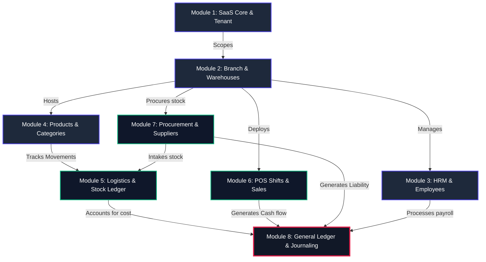
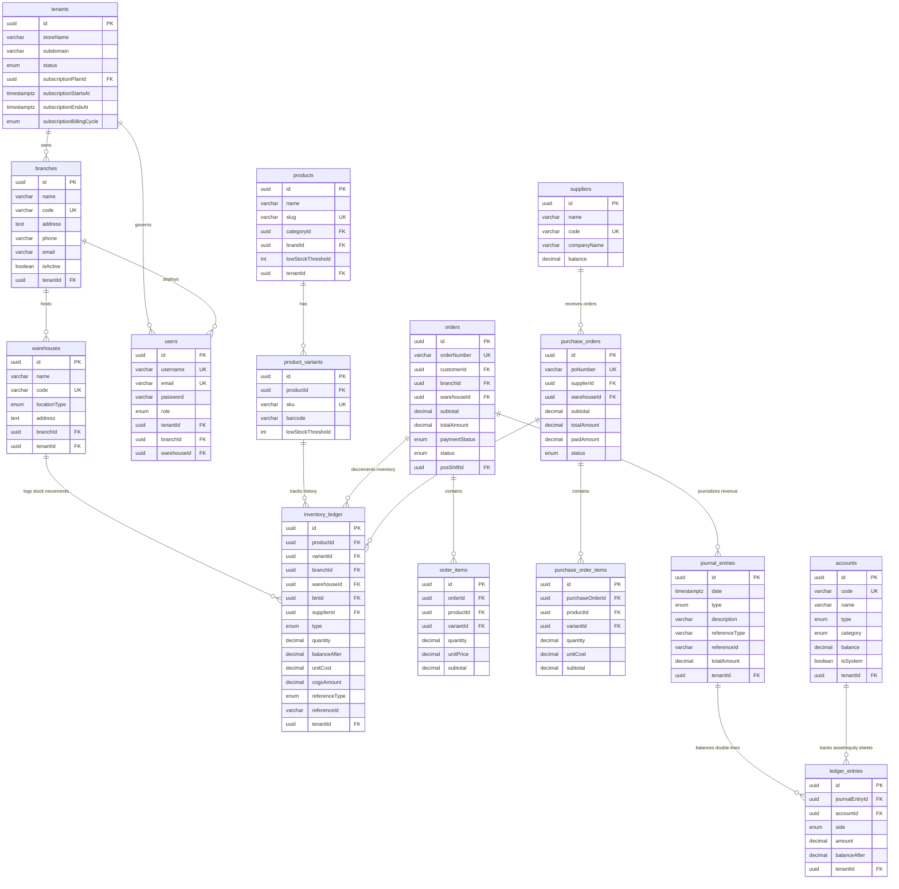

# Multi-Tenant eCommerce ERP/POS PostgreSQL Database Schema

This document serves as the absolute, single-source-of-truth reference for the TypeORM PostgreSQL database layout of the **eCommerce Multi-Tenant ERP/POS SaaS platform**. 

It details the data models, entity fields, foreign-key relationships, and custom enumerations across all primary business domains.

---

## 🗺️ Architectural Structural Map

The platform transitioned from a standard e-commerce site into an enterprise-grade multi-location ERP by partitioning the database into **8 high-fidelity modules**, completely scoped per tenant.

---

## 📂 Module 1: SaaS Core & Platform Administration
Tracks the global state of subscription tiers, active store hosting, and супер-админ configurations.

### 1. `TenantEntity` (Table: `tenants`)
Represents individual merchants/business accounts running in a shared-database multitenant environment.
*   **Key Fields**:
    *   `id` (`uuid`, Primary Key)
    *   `storeName` (`varchar`, Name of the storefront/company)
    *   `subdomain` (`varchar`, unique subdomain index, e.g., `gowtam.localhost`)
    *   `status` (`enum`, e.g., `active`, `suspended`, `trial`)
    *   `subscriptionPlanId` (`uuid`, FK to `subscription_plans`)
    *   `subscriptionStartsAt` (`timestamptz`)
    *   `subscriptionEndsAt` (`timestamptz`)
    *   `subscriptionBillingCycle` (`enum`, `monthly` | `yearly`)
    *   `isExpired` (`boolean`, virtual flag)
*   **Relationships**:
    *   `ManyToOne` with `SubscriptionPlanEntity`
    *   `OneToMany` with `BranchEntity`, `WarehouseEntity`, `UserEntity`, etc.

### 2. `SubscriptionPlanEntity` (Table: `subscription_plans`)
Platform-wide tiers defining access constraints and available features.
*   **Key Fields**:
    *   `id` (`uuid`, PK)
    *   `name` (`varchar`, e.g., `Starter`, `Premium`, `Enterprise`)
    *   `monthlyPrice` (`decimal`)
    *   `yearlyPrice` (`decimal`)
    *   `features` (`text[]`, array of active route paths enabled for this plan)
    *   `maxUsers`, `maxBranches`, `maxWarehouses` (`int`)
    *   `isActive` (`boolean`)

### 3. `SubscriptionInvoiceEntity` (Table: `subscription_invoices`)
Billing transactions processed via gateway (SSLCommerz) for plan renewals.
*   **Key Fields**:
    *   `invoiceNumber` (`varchar`, unique billing code)
    *   `tenantId` (`uuid`)
    *   `subscriptionPlanId` (`uuid`)
    *   `amount` (`decimal`)
    *   `currency` (`varchar`, e.g., `BDT`)
    *   `status` (`enum`, `PENDING`, `COMPLETED`, `FAILED`)
    *   `transactionId` (`varchar`, unique gateway reference)
    *   `billingDate` (`timestamptz`)

### 4. `AuditLogEntity` (Table: `audit_logs`)
System-wide security logging tracking administrator and staff mutations.
*   **Key Fields**:
    *   `id` (`uuid`, PK)
    *   `userId` (`uuid`, actor)
    *   `action` (`varchar`, e.g., `CREATE_PRODUCT`, `UPDATE_ROLE`)
    *   `ipAddress` (`varchar`)
    *   `payload` (`jsonb`, snapshot of state before/after)
    *   `tenantId` (`uuid`)

---

## 🏢 Module 2: Organization Hierarchy & Locations (Phase 1 & 2)
Provides organizational mapping allowing merchants to deploy stores across physical branches and warehouses.

### 1. `BranchEntity` (Table: `branches`)
Outlets, retail shops, or business offices running under a tenant.
*   **Key Fields**:
    *   `id` (`uuid`, PK)
    *   `name` (`varchar`)
    *   `code` (`varchar`, unique per tenant)
    *   `address` (`text`)
    *   `phone` & `email` (`varchar`)
    *   `isActive` (`boolean`)
    *   `tenantId` (`uuid`, FK to `tenants`)
*   **Relationships**:
    *   `ManyToOne` with `TenantEntity`
    *   `OneToMany` with `WarehouseEntity`

### 2. `WarehouseEntity` (Table: `warehouses`)
Storage spaces housing physical stocks, linked to retail branches.
*   **Key Fields**:
    *   `id` (`uuid`, PK)
    *   `name` (`varchar`)
    *   `code` (`varchar`, unique)
    *   `locationType` (`enum`: `CENTRAL` | `RETAIL` | `TRANSIT`)
    *   `address` (`text`)
    *   `branchId` (`uuid`, FK to `branches`, nullable for stand-alone depots)
    *   `tenantId` (`uuid`)
*   **Relationships**:
    *   `ManyToOne` with `BranchEntity`
    *   `OneToMany` with `WarehouseBinEntity`

### 3. `WarehouseBinEntity` (Table: `warehouse_bins`)
Micro-shelving units within a warehouse for precision item tracking.
*   **Key Fields**:
    *   `id` (`uuid`, PK)
    *   `warehouseId` (`uuid`)
    *   `binCode` (`varchar`, unique per warehouse, e.g., `AISLE-4-BIN-2`)
    *   `capacity` (`decimal`, max weight/volume)

---

## 👥 Module 3: Authentication, RBAC & Human Capital (HRM)
System credentials and internal operational team definitions.

### 1. `UserEntity` (Table: `users`)
Global profile table supporting shoppers, staff accounts, and administrators.
*   **Key Fields**:
    *   `id` (`uuid`, PK)
    *   `username` & `email` (`varchar`, scoped unique)
    *   `password` (`varchar`, hashed)
    *   `role` (`enum`, e.g., `admin`, `store_manager`, `operator`, `employee`, `support`, `marketing`, `customer`)
    *   `tenantId` (`uuid`, nullable for platform-level super-admins)
    *   `branchId` & `warehouseId` (`uuid`, scopes system users to their assigned operations desk)
*   **Relationships**:
    *   `ManyToOne` with `TenantEntity`, `BranchEntity`, `WarehouseEntity`

### 2. `StaffInvitationEntity` (Table: `staff_invitations`)
Tracks pending workspace invites.
*   **Key Fields**:
    *   `email` & `token` (`varchar`)
    *   `role` (`enum`)
    *   `branchId` & `warehouseId` (`uuid`)
    *   `expiresAt` (`timestamptz`)
    *   `isAccepted` (`boolean`)

### 3. `EmployeeEntity` (Table: `employees`)
Complete Human Resources profile, payroll bindings, and designations.
*   **Key Fields**:
    *   `id` (`uuid`, PK)
    *   `userId` (`uuid`, link to credentials)
    *   `departmentId` & `designationId` (`uuid`)
    *   `shiftId` (`uuid`, link to work shift)
    *   `salary` (`decimal`)
    *   `joiningDate` (`date`)
    *   `status` (`enum`: `ACTIVE` | `ON_LEAVE` | `TERMINATED`)

---

## 📦 Module 4: Product Catalog & Dynamic Pricing
Core product schemas, variants, and price listing matrices.

### 1. `ProductEntity` (Table: `products`)
Base merchandise descriptions.
*   **Key Fields**:
    *   `id` (`uuid`, PK)
    *   `name` & `slug` (`varchar`)
    *   `description` & `images` (`text` / `text[]`)
    *   `categoryId` & `brandId` (`uuid`)
    *   `lowStockThreshold` (`int`, defaults to 5)
    *   `tenantId` (`uuid`)
    *   *Note*: Direct physical columns like `stock` are **deprecated**; stock sums are dynamically computed from `inventory_ledger`.

### 2. `ProductVariantEntity` (Table: `product_variants`)
Stock Keeping Units (SKUs) tracking combinations (e.g., sizes, colors).
*   **Key Fields**:
    *   `id` (`uuid`, PK)
    *   `productId` (`uuid`)
    *   `sku` (`varchar`, unique per tenant)
    *   `barcode` (`varchar`)
    *   `lowStockThreshold` (`int`)

### 3. `PriceBookEntity` (Table: `price_books`)
Custom tariff configurations (e.g., Retail, Wholesale, VIP Client prices).
*   **Key Fields**:
    *   `id` (`uuid`, PK)
    *   `name` (`varchar`)
    *   `isDefault` & `isActive` (`boolean`)
    *   `tenantId` (`uuid`)

### 4. `ProductPriceEntity` (Table: `product_prices`)
Matrix matching SKU pricing to custom Price Books.
*   **Key Fields**:
    *   `variantId` (`uuid`)
    *   `priceBookId` (`uuid`)
    *   `price` (`decimal`, precision 15, scale 2)

---

## 🚚 Module 5: Multi-Location Logistics & Stock Ledger (Phase 2)
Manages the physical movements of goods across depots with an audit-proof ledger.

### 1. `InventoryLedgerEntity` (Table: `inventory_ledger`)
The immutable, double-entry style ledger tracking physical stock balances. **All physical additions, deductions, transfers, and COGS margins are compiled here.**
*   **Key Fields**:
    *   `id` (`uuid`, PK)
    *   `productId` & `variantId` (`uuid`)
    *   `branchId` & `warehouseId` (`uuid`)
    *   `binId` (`uuid`, warehouse rack slot)
    *   `supplierId` (`uuid`, optional, ties stock to supplier)
    *   `type` (`enum`: `IN` | `OUT` | `ADJUSTMENT` | `TRANSFER` | `RESERVED`)
    *   `quantity` (`decimal`, positive for intake, negative for dispatches)
    *   `balanceAfter` (`decimal`, running stock balance at that specific location)
    *   `remainingQuantity` (`decimal`, tracks remaining batch stocks for FIFO costing)
    *   `unitCost` (`decimal`, purchase valuation)
    *   `cogsAmount` (`decimal`, Cost of Goods Sold registered upon shipment)
    *   `referenceType` (`enum`: `GRN` | `ORDER` | `STOCK_TAKE` | `ORDER_RETURN`)
    *   `referenceId` (`varchar`, UUID or invoice number of reference ticket)
    *   `tenantId` (`uuid`)
*   **Indexes**:
    *   `Index(['tenantId', 'createdAt'])`
    *   `Index(['productId', 'warehouseId', 'createdAt'])`

### 2. `GrnEntity` (Goods Received Note, Table: `grns`)
Represents verified stock intakes from suppliers, checking items against a Purchase Order.
*   **Key Fields**:
    *   `grnNumber` (`varchar`, unique receipt index)
    *   `purchaseOrderId` (`uuid`)
    *   `supplierId` (`uuid`)
    *   `warehouseId` (`uuid`, destination warehouse)
    *   `receivedDate` (`timestamptz`)
    *   `status` (`enum`: `DRAFT` | `VERIFIED` | `CANCELLED`)

---

## 🛒 Module 6: POS Terminals, Shifts & Sales Processing (Phase 5)
Registers cashiers, shifts, and high-speed sales orders.

### 1. `PosRegisterEntity` (Table: `pos_registers`)
Hardware/terminal registrations mapped to branches.
*   **Key Fields**:
    *   `id` (`uuid`, PK)
    *   `name` & `code` (`varchar`)
    *   `branchId` (`uuid`)
    *   `status` (`enum`: `ACTIVE` | `INACTIVE`)
    *   `currentShiftId` (`uuid`, ties register to active drawer session)

### 2. `PosShiftEntity` (Table: `pos_shifts`)
Tracks cashier shifts, drawer cash drops, and payments reconciliation.
*   **Key Fields**:
    *   `id` (`uuid`, PK)
    *   `registerId` (`uuid`)
    *   `userId` (`uuid`, cashier profile)
    *   `startTime` & `endTime` (`timestamptz`)
    *   `openingBalance` (`decimal`, initial cash tray float)
    *   `closingBalance` (`decimal`, counted final tray)
    *   `expectedClosingBalance` (`decimal`, computed opening + cash sales)
    *   `difference` (`decimal`, mismatch tally)
    *   `status` (`enum`: `OPEN` | `CLOSED`)

### 3. `OrderEntity` (Table: `orders`)
Commercial receipts for sales.
*   **Key Fields**:
    *   `id` (`uuid`, PK)
    *   `orderNumber` (`varchar`, unique format per tenant, e.g., `ORD-2026-0001`)
    *   `customerId` (`uuid`, FK to `users`)
    *   `branchId` & `warehouseId` (`uuid`, records where the order was taken/dispatched)
    *   `subtotal` & `totalAmount` (`decimal`)
    *   `discountAmount` & `taxAmount` (`decimal`)
    *   `paymentStatus` (`enum`: `UNPAID` | `PARTIAL` | `PAID`)
    *   `status` (`enum`: `pending` | `processing` | `shipped` | `delivered` | `cancelled`)
    *   `posShiftId` (`uuid`, nullable, populated for POS cash register transactions)

---

## 🏭 Module 7: SCM, Sourcing & Supplier Procurement (Phase 4)
Handles procurement, internal requisitions, vendor pricing, and liability ledgers.

### 1. `SupplierEntity` (Table: `suppliers`)
Vendor database records.
*   **Key Fields**:
    *   `id` (`uuid`, PK)
    *   `name` & `code` (`varchar`, unique index)
    *   `companyName` (`varchar`)
    *   `phone`, `email`, `address` (`text`)
    *   `balance` (`decimal`, outstanding balance owed to supplier)

### 2. `SupplierApLedgerEntity` (Accounts Payable, Table: `supplier_ap_ledger`)
Detailed transactions tracking liabilities, invoice approvals, and payouts.
*   **Key Fields**:
    *   `id` (`uuid`, PK)
    *   `supplierId` (`uuid`)
    *   `type` (`enum`: `INVOICE` | `PAYMENT` | `DEBIT_NOTE` | `ADJUSTMENT`)
    *   `amount` (`decimal`, positive increases liability, negative represents payout)
    *   `runningBalance` (`decimal`)
    *   `referenceType` (`enum`: `PURCHASE_ORDER` | `SUPPLIER_PAYMENT`)
    *   `referenceId` (`varchar`)
    *   `billingDate` (`timestamptz`)

### 3. `PurchaseOrderEntity` (Table: `purchase_orders`)
Commercial purchase contracts sent to suppliers.
*   **Key Fields**:
    *   `id` (`uuid`, PK)
    *   `poNumber` (`varchar`, e.g. `PO-123456`)
    *   `supplierId` (`uuid`)
    *   `warehouseId` (`uuid`, target intake location)
    *   `subtotal` & `totalAmount` (`decimal`)
    *   `paidAmount` (`decimal`, registers payouts)
    *   `status` (`enum`: `draft` | `pending` | `approved` | `received` | `cancelled`)

---

## 📊 Module 8: Chart of Accounts & General Ledger (Phase 3)
Supports double-entry bookkeeping, tracking assets, liabilities, revenues, and operating expenses.

### 1. `AccountEntity` (Chart of Accounts, Table: `accounts`)
Tracks financial heads scoped per tenant.
*   **Key Fields**:
    *   `id` (`uuid`, PK)
    *   `code` (`varchar`, unique scoped to `tenantId`, e.g., `10100`, `50100`)
    *   `name` (`varchar`, e.g., `Inventory Asset`, `Cost of Goods Sold`, `Sales Revenue`)
    *   `type` (`enum`: `ASSET` | `LIABILITY` | `EQUITY` | `REVENUE` | `EXPENSE`)
    *   `category` (`enum`: `CURRENT_ASSET` | `COST_OF_SALES` | `OPERATING_REVENUE` | `TAX_LIABILITY` etc.)
    *   `balance` (`decimal`, outstanding account tally)
    *   `isSystem` (`boolean`, system accounts protected from manual deletions)

### 2. `JournalEntryEntity` (Table: `journal_entries`)
Header records grouping credit and debit transactions.
*   **Key Fields**:
    *   `id` (`uuid`, PK)
    *   `date` (`timestamptz`)
    *   `type` (`enum`: `GENERAL` | `SALES` | `PURCHASE` | `CASH_RECEIPT` | `CASH_DISBURSEMENT`)
    *   `description` (`varchar`, narration text)
    *   `referenceType` (`varchar`, e.g., `ORDER`, `PURCHASE_ORDER`)
    *   `referenceId` (`varchar`, ID or document reference)
    *   `totalAmount` (`decimal`, sum of debits)
    *   `tenantId` (`uuid`)

### 3. `LedgerEntryEntity` (Table: `ledger_entries`)
Lines recording individual debits and credits posted to specific accounts.
*   **Key Fields**:
    *   `id` (`uuid`, PK)
    *   `journalEntryId` (`uuid`, FK to `journal_entries`)
    *   `accountId` (`uuid`, FK to `accounts`)
    *   `side` (`enum`: `DEBIT` | `CREDIT`)
    *   `amount` (`decimal`)
    *   `balanceAfter` (`decimal`, running account balance printed on ledger reports)
    *   `tenantId` (`uuid`)

## 🔗 Schema Relationship Model (Mermaid Entity Details)

This relational model matches the actual schema fields, primary keys (PK), foreign keys (FK), unique constraints (UK), and database types, mapping the complete data network:

