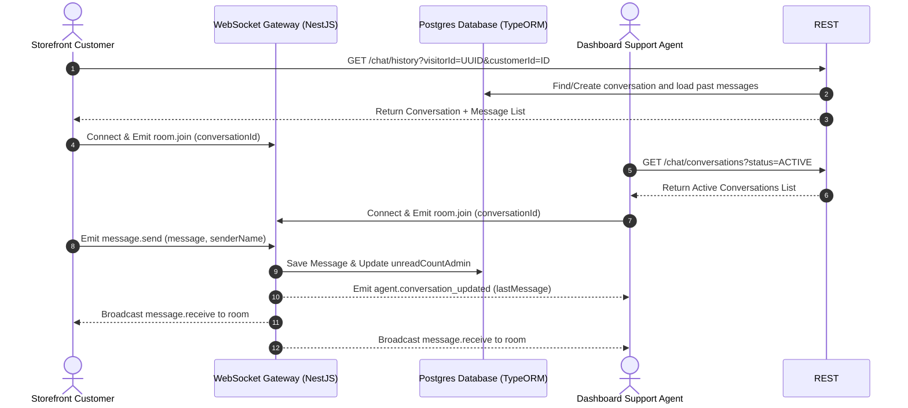

# Live Chat Support System Architecture & Implementation

This document details the design, data flows, database schemas, and client-side setup for the real-time Multi-Tenant Live Chat Support System.

---

## 1. System Overview

The live chat support system allows storefront visitors (both anonymous guests and logged-in customers) to chat in real-time with merchant support agents. The architecture is built on a hybrid REST and WebSocket model:
- **REST APIs**: Used for loading historical messages, conversation lists, and marking messages as read (visitor-side).
- **WebSockets (Socket.io)**: Used for instantaneous message exchanges, room subscription, and pushing real-time conversation list updates/notifications to support agents.



---

## 2. Database Schema

### Conversation Entity (`ConversationEntity`)
Represents a chat thread between a customer/visitor and the tenant's support team.

| Field Name | Type | Description |
| :--- | :--- | :--- |
| `id` | `uuid` (Primary Key) | Unique identifier. |
| `tenantId` | `string` (Nullable) | Associated store tenant ID. |
| `visitorId` | `uuid` | Persistent anonymous visitor tracking ID stored in client storage. |
| `customerId` | `uuid` (Nullable) | References the logged-in storefront customer. |
| `status` | `enum` (`ACTIVE`, `RESOLVED`) | Current lifecycle state of the conversation. |
| `unreadCountAdmin` | `int` | Count of unread messages pending agent reply. |
| `unreadCountVisitor`| `int` | Count of unread messages pending visitor view. |
| `lastMessageAt` | `timestamp` | Time of the last message sent in this thread. |

### Chat Message Entity (`ChatMessageEntity`)
Represents individual messages within a conversation.

| Field Name | Type | Description |
| :--- | :--- | :--- |
| `id` | `uuid` (Primary Key) | Unique identifier. |
| `conversationId` | `uuid` | Relation to the parent `ConversationEntity`. |
| `senderType` | `enum` (`VISITOR`, `AGENT`) | Originator category. |
| `senderId` | `string` (Nullable) | User ID of the sender. |
| `senderName` | `string` (Nullable) | Display name of the sender. |
| `message` | `text` | Text content of the message. |
| `isRead` | `boolean` | Viewed status. |
| `createdAt` | `timestamp` | Automated creation timestamp. |

---

## 3. WebSocket Gateway (`ChatGateway`)

Mounted on the `/chat` namespace, the gateway manages WebSockets connections, authorization, and room broadcasts.

### Event Interface Map

#### Client-to-Server (Emits)
- **`room.join`**: Client joins a conversation room to receive messages.
  ```typescript
  payload: {
    conversationId: string;
    senderType: 'VISITOR' | 'AGENT';
  }
  ```
- **`message.send`**: Transmit a message to the active room.
  ```typescript
  payload: {
    conversationId: string;
    message: string;
    senderType: 'VISITOR' | 'AGENT';
    senderName: string;
  }
  ```

#### Server-to-Client (Broadcasts/Listens)
- **`message.receive`**: Broadcasted to `room:chat_${conversationId}` on message arrival.
  ```typescript
  payload: ChatMessageEntity
  ```
- **`agent.conversation_updated`**: Broadcasted to all logged-in support agents to refresh lists and show toast alerts.
  ```typescript
  payload: {
    conversationId: string;
    visitorId: string;
    lastMessage: string;
  }
  ```

---

## 4. Client Implementations

### Storefront Chat Widget (`LiveChatWidget.tsx`)
A floating widget injected into storefront pages.

- **Visitor Persistence**: Generates a random `uuid` and stores it in `localStorage` as `chat_visitor_id` to sustain conversation state across page reloads.
- **Profile Integration**: Imports `useSession()` from Next-Auth. If a customer is logged in, the widget forwards `session.user.id` to `/chat/history` query string to link the anonymous visitor session to their account.
- **Persistent Socket Connection**: Resolves connection states via React Refs (`isOpenRef`) to maintain a single socket handshake and prevent socket reconnections when opening or closing the chat bubble.

### Agent Support Page (`client/app/admin/support/page.tsx`)
A complete real-time messaging console integrated within the merchant admin dashboard.

- **Selective Room Streaming**: Utilizes dynamic selection effects combined with React `useRef` to handle active room subscriptions seamlessly without triggering socket teardowns on selection changes.
- **Read Tracker**: Selecting a conversation auto-triggers a read state update via the backend, resetting the local unread count badge.
- **Desktop Alerts**: Displays toast notifications to agents when new messages arrive from conversations they are not actively viewing.
