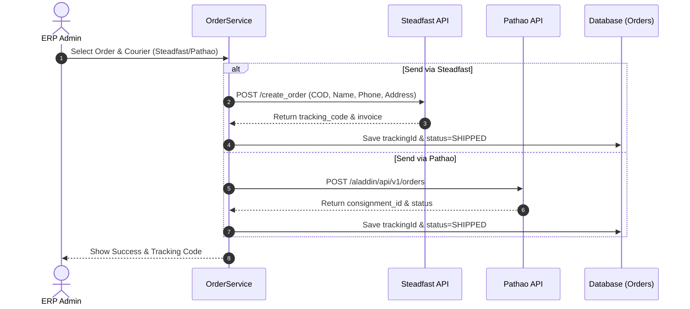
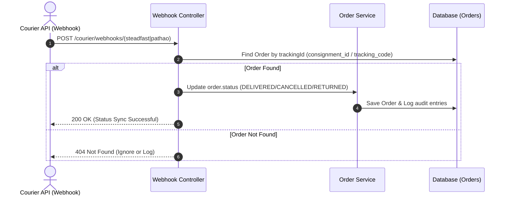

# Phase 5: Courier SDK Integrations — Technical Design Document

This design document outlines the architecture, integration patterns, webhooks, security mechanisms, and step-by-step implementation plan for **Phase 5: Courier SDK Integrations**.

---

## 📊 1. System Overview & Flowcharts

The Courier SDK Integration will connect our ERP sales and order modules to third-party shipping solutions (Steadfast and Pathao) to automate shipping labels, status synchronization, and rate calculation.

### A. Order Shipping & Tracking Lifecycle

### B. Webhook Update Lifecycle

---

## ⚙️ 2. API Endpoints & Interfaces

### A. Steadfast API Methods
We will extend `SteadfastService` with:
- `getSteadfastStatus(trackingCode: string, ctx: RequestContextDto): Promise<any>`
- `getSteadfastLabel(trackingCode: string, ctx: RequestContextDto): Promise<string>`

### B. Pathao API Methods
We will extend `PathaoService` with:
- `calculatePathaoPrice(data: any, ctx: RequestContextDto): Promise<any>`
- `getPathaoStatus(trackingCode: string, ctx: RequestContextDto): Promise<any>`

### C. Webhook Endpoints
We will implement a public webhook controller to receive callbacks from couriers:

| Method | Endpoint | Description | Security Validation |
|--------|----------|-------------|---------------------|
| `POST` | `/api/v1/courier/webhooks/steadfast` | Receives delivery notifications from Steadfast. | Validates payload secret match. |
| `POST` | `/api/v1/courier/webhooks/pathao` | Receives delivery notifications from Pathao. | Validates signature hash header. |

---

## 💾 3. Data Mapping & Status Translation

To maintain a consistent order state inside the ERP, third-party status strings will map to our system enum `OrderStatus`:

| Courier Status (Steadfast) | Courier Status (Pathao) | ERP OrderStatus |
|-----------------------------|-------------------------|-----------------|
| `delivered`                 | `Delivered`             | `DELIVERED`     |
| `cancelled`                 | `Cancelled`             | `CANCELLED`     |
| `returned`                  | `Returned`              | `RETURNED`      |
| `in_transit`                | `Picked`                | `SHIPPED`       |
| `hold`                      | `On Hold`               | `PROCESSING`    |

---

## 🚀 4. Recommended Enhancements for Enterprise Safety

To make the integration extremely robust, we recommend adding the following enhancements:

1. **Public Webhook Guard Bypass with Tenant Context Binding**:
   - Since third-party servers call webhook endpoints, they do not include JWT auth headers. We will introduce a public webhook route bypass and query the `tenant_id` from the matching Order in the database to bind context before updating the database.
2. **Post-Delivery Cash Clearing Double-Entry Integration**:
   - When a status updates to `DELIVERED` via Cash-on-Delivery (COD) webhook, the system will automatically post a journal entry clearing the AR ledger:
     * **Debit:** `1000 - Cash & Bank`
     * **Credit:** `1200 - Accounts Receivable`
3. **Admin Live Status Lookup & Label Generator Components**:
   - Instead of forcing admins to check external tracking websites, we will add a live tracking timeline modal and direct shipping label PDF print button onto the Admin Order Details dashboard.

---

## 📂 5. Implementation Roadmap & Checklist

- [x] **1. Extend Steadfast Integration:**
  * Add live tracking status checker method.
  * Add shipping label PDF or print redirect link builder.
  * Register endpoints in `SteadfastController`.
- [x] **2. Extend Pathao Integration:**
  * Add price calculation endpoint (`/merchant/price-calculation`).
  * Register city, zone, area dropdown APIs in `PathaoController`.
- [x] **3. Implement Webhook Receivers:**
  * Create `CourierWebhookController` (public, bypassed from standard JWT guard for validation).
  * Validate webhook signatures.
  * Retrieve order by tracking ID and update to matching `OrderStatus`.
- [x] **4. Build Frontend UI Management Screen:**
  * Add courier options panel on order details page.
  * Add tracking buttons, live status lookup modal, and print label action.
