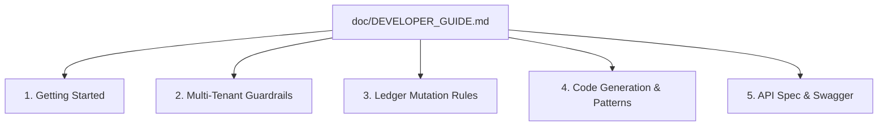

# Enterprise SaaS ERP — Coding Documentation & User Manual Strategic Plan

**Document Version:** 1.0.0  
**Prepared By:** Senior Systems Architect & Principal Engineer  
**Date:** May 24, 2026  
**Status:** Approved for Documentation Phase  

---

## Executive Summary
For an Enterprise ERP platform to succeed, it is not enough for the code to run correctly. The system requires two distinct tiers of documentation:
1.  **Coding Documentation:** A clear set of standards and architecture guidelines to ensure that new and existing developers can modify the system without breaking multi-tenant security, GAAP double-entry rules, or ledger-based inventory invariants.
2.  **User Manuals:** Scoped, role-based instruction guides that direct Tenant Admins, Cashiers, Accountants, HR Managers, and external Suppliers on how to navigate and operate their respective modules.

This document lays out the comprehensive plan, structures, and tables of contents to execute both writing initiatives.

---

## 1. Coding Documentation Strategic Plan

### 1.1 Goals of Coding Documentation
*   **Developer Onboarding:** Reduce developer ramp-up time from weeks to days by explaining the monorepo structure.
*   **Modular Monolith Boundaries:** Enforce rules that prevent tight coupling between distinct domains (e.g., Catalog services calling POS database repositories directly).
*   **Transaction & Ledger Safety:** Outline the step-by-step requirements for modifying the stock or accounting systems.

### 1.2 Master Developer Guide Structure
The Coding Documentation will be compiled into `doc/DEVELOPER_GUIDE.md` and cover the following sections:



#### Section 1: Architecture Overview & Getting Started
*   **Local Setup:** Docker Compose definitions for PostgreSQL, Redis, and LocalStack.
*   **Folder Layout:** Explanation of NestJS modular boundaries (`server/src/modules/`) and Next.js frontend structure.
*   **Context Flow:** How `RequestContextDto` aggregates user scopes, branch scopes, and tenant contexts dynamically via global guards.

#### Section 2: Multi-Tenant Database Guardrails (The "Golden Rules")
*   **Scoping Invariant:** Every repository method must append `.andWhere('entity.tenantId = :tenantId')` to the SQL query builder.
*   **Unique Index Scoping:** Every business key unique constraint must include `tenant_id` (e.g., `UQ_tenant_product_sku`).
*   **S3/File Scoping:** Dynamic storage paths must be prefixed with `t/{tenantId}/` to prevent media cross-leaking.

#### Section 3: Ledger Mutation Rules (The "Double-Entry Invariant")
*   **No Direct CRUD on Stock:** Documenting how to use `productQueue.add('update-stock')` instead of editing `stock` fields.
*   **Debit/Credit Balances:** Visual instructions for ensuring that all event-driven journal postings compile balanced `Debits = Credits` operations.
*   **Idempotency Keys:** Mandatory mapping guidelines for payment webhooks, POS sync, and cron jobs to prevent double-execution.

#### Section 4: Code Generation & Standards
*   **TypeORM Migrations:** Rules for writing TypeORM migrations that are safe for production multi-tenant databases (avoiding locks on large tables).
*   **Linting & Style:** Strict ESLint rules prohibiting direct import of database repositories across different modules.

---

## 2. User Manual Strategic Plan

### 2.1 Persona-Based Manual Structure
Unlike standard websites, an ERP cannot have a single generic help manual. ERP documentation must be **role-based (Persona-based)**, ensuring that a retail cashier is not confused by financial general ledger terms, and an accountant does not have to sift through HR geofencing parameters.

We will create **5 distinct user manuals** isolated within a centralized help desk or downloadable documentation vault:

```
                  ┌───────────────────────────────┐
                  │      Enterprise Help Desk     │
                  └───────────────┬───────────────┘
          ┌───────────────────────┼───────────────────────┐
          ▼                       ▼                       ▼
┌──────────────────┐    ┌──────────────────┐    ┌──────────────────┐
│ 2.2 Super-Admin  │    │  2.3 Tenant Admin│    │ 2.4 Retail POS   │
│   (SaaS Owner)   │    │  (Company Owner) │    │    (Cashier)     │
└──────────────────┘    └──────────────────┘    └──────────────────┘
          │                       │
          ▼                       ▼
┌──────────────────┐    ┌──────────────────┐
│  2.5 Financial   │    │ 2.6 Human Resource│
│   (Accountant)   │    │    (HR Team)     │
└──────────────────┘    └──────────────────┘
```

---

### 2.2 Super-Admin Manual (The SaaS Platform Owner)
*Target Audience: Platform Operations, DevOps, and Platform Owners.*

*   **1. Tenant Onboarding:**
    *   Creating new subscription plans, billing parameters, and logical feature keys.
    *   Approving custom domain mapping requests and validating DNS setups.
*   **2. Monitoring & Metrics:**
    *   Reading the global Platform Dashboard (active tenants, total MRR, resource usages).
    *   Investigating tenant throttling, CPU spikes, or Redis usage alarms.
*   **3. System Operations:**
    *   Seeding regional default tax templates and permissions.
    *   Triggering soft-deleted tenant data purge/anonymization workflows.

---

### 2.3 Tenant-Owner / Manager Manual
*Target Audience: Business Owners, CEO, CFO, and Operations Managers.*

*   **1. Company & Org Structure:**
    *   Configuring multi-company parameters, regional legal currencies, and tax IDs.
    *   Setting up retail Branches and inventory Warehouses.
*   **2. Staff Roll & Security Scopes:**
    *   Inviting staff members via secure email link.
    *   Creating custom security roles and mapping branch/warehouse scopes (e.g. limiting a manager's access to Branch A only).
*   **3. Catalog Setup:**
    *   Setting up base products, manufacturing lots, and FEFO expiry rules.
    *   Configuring Price Books for VIP vs. B2B wholesale buyers.

---

### 2.4 Retail POS & Sales Manual
*Target Audience: Store Cashiers, Sales Representatives, and Register Managers.*

*   **1. Shift & Register Control:**
    *   Opening till workflows (verifying physical starting cash balance).
    *   Drawer operations (recording cash-in/cash-out for mid-day cash adjustments).
    *   Closing register audits (inputting final counts, printing Z-reports, reconciling cash drawer variances).
*   **2. Cashier Operations:**
    *   High-speed catalog searches and barcode scanning.
    *   Applying split tender payment splits (Mobile Banking + Cash).
    *   Using offline mode during network drops and verifying automatic local storage synchronization.
*   **3. Returns & Exchanges:**
    *   Receipt scanning, restock verifications, and issuing instant refund credits to customer wallets.

---

### 2.5 Financial Accountant Manual
*Target Audience: Chartered Accountants, CFOs, and Bookkeepers.*

*   **1. Chart of Accounts (COA) Setup:**
    *   Initializing and editing Asset, Liability, Equity, Revenue, and Expense codes.
    *   Configuring tax/VAT regional rules and running Sandbox simulations.
*   **2. Subledgers & Matching:**
    *   Operating the 3-way invoice matcher (matching Purchase Order vs. GRN vs. Supplier Bill).
    *   Reviewing B2B Accounts Receivable aging buckets and managing credit hold blocks.
*   **3. Fiscal Year Closure:**
    *   Creating journal entries, posting reversing/adjustment entries, and exporting P&L or Cash Flow statements.

---

### 2.6 Human Resource & Payroll Manual
*Target Audience: HR Specialists, Recruiters, and Payroll Officers.*

*   **1. Employee Onboarding:**
    *   Creating employment records, assigning salary structures, and managing the digital contract document locker.
*   **2. Attendance & Leave Auditing:**
    *   Monitoring geofenced clock-in/out check-in punches.
    *   Approving leave requests and verifying rolling balance deductions.
*   **3. Processing Payroll Batches:**
    *   Auto-compiling monthly salary sheets, applying late-punch penalties, adding overtime premiums, withholding tax, and generating bank payment sheets.

---

## 3. Execution & Writing Timeline

To compile these guides efficiently, we recommend a phased approach running alongside final system tests:

```
Phase 1: Developer Guide Creation (1 Week)
  ├── Document code structures, guards, and DB invariants.
  └── Generate Swagger schemas for developer sandbox.

Phase 2: Cashier & HR Manuals (1 Week)
  ├── Capture step-by-step checkout screenshots.
  └── Outline geofencing and mobile check-in panels.

Phase 3: Financial & Super-Admin Manuals (1 Week)
  ├── Map the 3-way match, ledger entries, and audit trail.
  └── Draft plan seeding and tenant limit rules.
```
