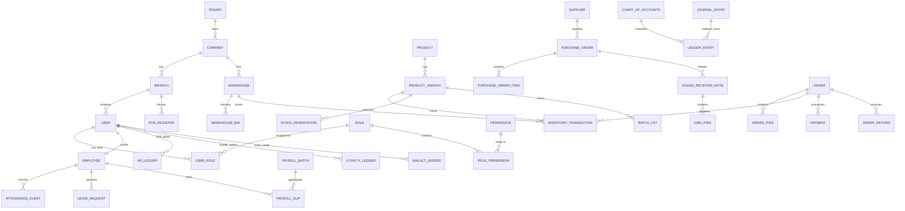

# Enterprise Multi-Tenant SaaS ERP — Master Database Design Document

**Document Version:** 1.0.0  
**Prepared By:** Senior Systems Architect & Principal Engineer  
**Date:** May 24, 2026  
**Status:** Approved for Core Architecture  

---

## 1. Database Architecture & Design Principles

To support a high-volume, multi-tenant enterprise system, the database is architected on four non-negotiable principles:

1.  **Strict Multi-Tenant Isolation (Logical Shared-Database Model):** All business tables contain a `tenant_id` column. Every database query, mutation, and index must use `tenant_id` to guarantee that Tenant A can never view or manipulate Tenant B's data under any circumstance.
2.  **Physical Asset Ledger-Based Auditability:** Inventory levels and cash flow are never represented as simple editable numeric fields on tables (e.g., `product.stock` is deprecated). Instead, stock and cash are derived dynamically or through high-performance snapshot tables computed from immutable transaction ledger logs (`inventory_transactions`, `journal_entries`, `ledger_entries`).
3.  **Financial Immutability (GAAP Compliance):** Financial entries are strictly append-only. Running an SQL `UPDATE` or `DELETE` on accounting journal lines is prohibited. To correct mistakes, accountants must write reversing/adjusting journal entries.
4.  **Decoupled Domain Ownership:** Tables are divided into logical boundaries. Tables from one domain (e.g., *Procurement*) reference other domains (e.g., *Catalog*) using UUID foreign keys, but operational logic is isolated at the application level.

---

## 2. Complete Enterprise Database ER Diagram (ERD)



---

## 3. Comprehensive Domain Schema Definitions

*All schemas extend `BaseEntity` providing `id` (UUID PK), `created_at` (TIMESTAMPTZ), `updated_at` (TIMESTAMPTZ), and `deleted_at` (TIMESTAMPTZ, nullable for soft deletes).*

### 3.1 Organization Domain
The core structural grid defining branches, warehouses, and legal entities.

#### `tenants`
*   `id` UUID (PK)
*   `name` VARCHAR(255) (NOT NULL)
*   `subdomain` VARCHAR(100) (UNIQUE, NOT NULL)
*   `custom_domain` VARCHAR(255) (UNIQUE, NULL)
*   `custom_domain_status` VARCHAR(50) (DEFAULT 'PENDING')
*   `plan_id` UUID (FK to subscription_plans)
*   `status` VARCHAR(50) (DEFAULT 'ACTIVE')

#### `companies`
*   `id` UUID (PK)
*   `tenant_id` UUID (FK, NOT NULL)
*   `name` VARCHAR(255) (NOT NULL)
*   `registration_number` VARCHAR(100) (NULL)
*   `tax_id` VARCHAR(100) (NULL)
*   `currency` VARCHAR(10) (DEFAULT 'BDT')

#### `branches`
*   `id` UUID (PK)
*   `tenant_id` UUID (FK, NOT NULL)
*   `company_id` UUID (FK, NOT NULL)
*   `name` VARCHAR(255) (NOT NULL)
*   `type` VARCHAR(50) (e.g. RETAIL, OFFICE, HQ)
*   `address` TEXT (NOT NULL)
*   `contact_phone` VARCHAR(30) (NULL)
*   `is_active` BOOLEAN (DEFAULT TRUE)

#### `warehouses`
*   `id` UUID (PK)
*   `tenant_id` UUID (FK, NOT NULL)
*   `company_id` UUID (FK, NOT NULL)
*   `name` VARCHAR(255) (NOT NULL)
*   `type` VARCHAR(50) (e.g. MAIN, TRANSIT, RETURN)
*   `address` TEXT (NOT NULL)
*   `is_active` BOOLEAN (DEFAULT TRUE)

#### `warehouse_bins`
*   `id` UUID (PK)
*   `warehouse_id` UUID (FK, NOT NULL)
*   `zone` VARCHAR(50) (NOT NULL) (e.g. 'Zone-A')
*   `bin_code` VARCHAR(50) (NOT NULL) (e.g. 'A-01-05')

---

### 3.2 Identity & Access Control (RBAC) Domain
Manages users and their explicit authorization policies.

#### `users`
*   `id` UUID (PK)
*   `tenant_id` UUID (FK, NOT NULL)
*   `email` VARCHAR(255) (NOT NULL)
*   `password_hash` VARCHAR(255) (NOT NULL)
*   `membership_tier` VARCHAR(50) (DEFAULT 'BRONZE')
*   `credit_limit` DECIMAL(15,2) (DEFAULT 0.00)
*   `credit_hold` BOOLEAN (DEFAULT FALSE)
*   `is_active` BOOLEAN (DEFAULT TRUE)

#### `roles`
*   `id` UUID (PK)
*   `tenant_id` UUID (FK, NOT NULL)
*   `name` VARCHAR(100) (NOT NULL)
*   `description` TEXT (NULL)

#### `permissions`
*   `id` UUID (PK)
*   `code` VARCHAR(100) (UNIQUE, NOT NULL) (e.g., 'catalog:edit-price')
*   `module` VARCHAR(100) (NOT NULL) (e.g., 'CATALOG')

#### `role_permissions`
*   `role_id` UUID (FK, PK)
*   `permission_id` UUID (FK, PK)

#### `user_roles`
*   `user_id` UUID (FK, PK)
*   `role_id` UUID (FK, PK)
*   `scope_branch_id` UUID (FK, NULL) (Limits role permissions to a single Branch)
*   `scope_warehouse_id` UUID (FK, NULL) (Limits role permissions to a single Warehouse)

---

### 3.3 Catalog & Pricing Domain
Handles product definitions and tier pricing strategies.

#### `products`
*   `id` UUID (PK)
*   `tenant_id` UUID (FK, NOT NULL)
*   `name` VARCHAR(255) (NOT NULL)
*   `sku` VARCHAR(100) (NOT NULL)
*   `barcode` VARCHAR(100) (NULL)
*   `low_stock_threshold` DECIMAL(12,2) (DEFAULT 5.00)
*   `is_active` BOOLEAN (DEFAULT TRUE)

#### `product_variants`
*   `id` UUID (PK)
*   `product_id` UUID (FK, NOT NULL)
*   `sku` VARCHAR(100) (NOT NULL)
*   `name` VARCHAR(255) (NOT NULL)
*   `purchase_price` DECIMAL(15,2) (NOT NULL)
*   `retail_price` DECIMAL(15,2) (NOT NULL)

#### `price_books`
*   `id` UUID (PK)
*   `tenant_id` UUID (FK, NOT NULL)
*   `name` VARCHAR(100) (NOT NULL)

#### `product_prices`
*   `id` UUID (PK)
*   `price_book_id` UUID (FK, NOT NULL)
*   `variant_id` UUID (FK, NOT NULL)
*   `min_quantity` DECIMAL(12,2) (DEFAULT 1.00)
*   `price` DECIMAL(15,2) (NOT NULL)

---

### 3.4 Ledger-Based Inventory Domain
Traces all physical stock events.

#### `inventory_transactions`
*   `id` UUID (PK)
*   `tenant_id` UUID (FK, NOT NULL)
*   `warehouse_id` UUID (FK, NOT NULL)
*   `bin_id` UUID (FK, NULL)
*   `variant_id` UUID (FK, NOT NULL)
*   `quantity` DECIMAL(12,4) (NOT NULL) -- Positive for IN, Negative for OUT
*   `type` VARCHAR(50) (NOT NULL) (e.g. PURCHASE, SALE, TRANSFER, ADJUSTMENT)
*   `reference_type` VARCHAR(100) (NOT NULL) (e.g. 'GOODS_RECEIVED_NOTE', 'ORDER')
*   `reference_id` UUID (NOT NULL)
*   `balance_after` DECIMAL(12,4) (NOT NULL) -- Snapshotted running total

#### `stock_reservations`
*   `id` UUID (PK)
*   `tenant_id` UUID (FK, NOT NULL)
*   `order_id` UUID (FK, NOT NULL)
*   `variant_id` UUID (FK, NOT NULL)
*   `quantity` DECIMAL(12,4) (NOT NULL)
*   `expires_at` TIMESTAMPTZ (NOT NULL)

#### `batch_lots`
*   `id` UUID (PK)
*   `tenant_id` UUID (FK, NOT NULL)
*   `variant_id` UUID (FK, NOT NULL)
*   `batch_number` VARCHAR(100) (NOT NULL)
*   `manufactured_date` DATE (NULL)
*   `expiry_date` DATE (NOT NULL)

---

### 3.5 Procurement & Supply Chain Domain
Handles Supplier relations and Goods Verification Notes.

#### `suppliers`
*   `id` UUID (PK)
*   `tenant_id` UUID (FK, NOT NULL)
*   `name` VARCHAR(255) (NOT NULL)
*   `supplier_code` VARCHAR(50) (UNIQUE, NOT NULL)
*   `tax_id` VARCHAR(100) (NULL)
*   `credit_limit` DECIMAL(15,2) (DEFAULT 0.00)
*   `payment_terms_days` INT (DEFAULT 30)

#### `purchase_orders`
*   `id` UUID (PK)
*   `tenant_id` UUID (FK, NOT NULL)
*   `supplier_id` UUID (FK, NOT NULL)
*   `warehouse_id` UUID (FK, NOT NULL)
*   `status` VARCHAR(50) (DEFAULT 'DRAFT') (e.g. DRAFT, SENT, RECEIVED)
*   `total_amount` DECIMAL(15,2) (NOT NULL)

#### `purchase_order_items`
*   `id` UUID (PK)
*   `purchase_order_id` UUID (FK, NOT NULL)
*   `variant_id` UUID (FK, NOT NULL)
*   `qty_ordered` DECIMAL(12,2) (NOT NULL)
*   `unit_cost` DECIMAL(15,2) (NOT NULL)

#### `goods_received_notes`
*   `id` UUID (PK)
*   `tenant_id` UUID (FK, NOT NULL)
*   `purchase_order_id` UUID (FK, NOT NULL)
*   `warehouse_id` UUID (FK, NOT NULL)
*   `received_by` UUID (FK to users)
*   `status` VARCHAR(50) (DEFAULT 'PENDING')
*   `received_date` TIMESTAMPTZ (NOT NULL)

#### `grn_items`
*   `id` UUID (PK)
*   `grn_id` UUID (FK, NOT NULL)
*   `variant_id` UUID (FK, NOT NULL)
*   `qty_ordered` DECIMAL(12,2) (NOT NULL)
*   `qty_received` DECIMAL(12,2) (NOT NULL)
*   `qty_rejected` DECIMAL(12,2) (DEFAULT 0.00)
*   `unit_cost` DECIMAL(15,2) (NOT NULL)

---

### 3.6 Finance & Double-Entry Accounting Domain
GAAP compliant Balanced General Ledger sub-system.

#### `chart_of_accounts`
*   `id` UUID (PK)
*   `tenant_id` UUID (FK, NOT NULL)
*   `account_code` VARCHAR(50) (NOT NULL) (e.g. '1000', '1200')
*   `account_name` VARCHAR(150) (NOT NULL)
*   `account_type` VARCHAR(50) (NOT NULL) (e.g. ASSET, LIABILITY, EQUITY, REVENUE, EXPENSE)
*   `parent_account_id` UUID (FK, NULL)

#### `journal_entries`
*   `id` UUID (PK)
*   `tenant_id` UUID (FK, NOT NULL)
*   `reference_type` VARCHAR(100) (NOT NULL) (e.g. 'ORDER', 'GRN', 'MANUAL')
*   `reference_id` UUID (NOT NULL)
*   `description` TEXT (NULL)
*   `entry_date` DATE (NOT NULL)

#### `ledger_entries`
*   `id` UUID (PK)
*   `journal_entry_id` UUID (FK, NOT NULL)
*   `account_id` UUID (FK, NOT NULL)
*   `type` VARCHAR(10) (NOT NULL) (e.g. DEBIT, CREDIT)
*   `amount` DECIMAL(15,2) (NOT NULL)

---

### 3.7 Human Resource Management (HRM) Domain
Tracks employee attendance events and maps salary releases to double-entry payables.

#### `employees`
*   `id` UUID (PK)
*   `tenant_id` UUID (FK, NOT NULL)
*   `user_id` UUID (FK, UNIQUE, NOT NULL)
*   `branch_id` UUID (FK, NOT NULL)
*   `salary_basic` DECIMAL(15,2) (NOT NULL)
*   `salary_allowances` DECIMAL(15,2) (DEFAULT 0.00)
*   `salary_deductions` DECIMAL(15,2) (DEFAULT 0.00)

#### `attendance_events`
*   `id` UUID (PK)
*   `tenant_id` UUID (FK, NOT NULL)
*   `employee_id` UUID (FK, NOT NULL)
*   `punch_time` TIMESTAMPTZ (NOT NULL)
*   `type` VARCHAR(20) (NOT NULL) (e.g. PUNCH_IN, PUNCH_OUT)

#### `leave_requests`
*   `id` UUID (PK)
*   `tenant_id` UUID (FK, NOT NULL)
*   `employee_id` UUID (FK, NOT NULL)
*   `start_date` DATE (NOT NULL)
*   `end_date` DATE (NOT NULL)
*   `status` VARCHAR(50) (DEFAULT 'PENDING')

#### `payroll_batches`
*   `id` UUID (PK)
*   `tenant_id` UUID (FK, NOT NULL)
*   `billing_month` DATE (NOT NULL) (e.g. '2026-05-01')
*   `status` VARCHAR(50) (DEFAULT 'DRAFT')

#### `payroll_slips`
*   `id` UUID (PK)
*   `payroll_batch_id` UUID (FK, NOT NULL)
*   `employee_id` UUID (FK, NOT NULL)
*   `basic_salary` DECIMAL(15,2) (NOT NULL)
*   `overtime_pay` DECIMAL(15,2) (DEFAULT 0.00)
*   `deductions` DECIMAL(15,2) (DEFAULT 0.00)
*   `net_pay` DECIMAL(15,2) (NOT NULL)

---

### 3.8 CRM & Wallets Subledgers
Tracks secondary accounting balances.

#### `ar_ledger` (Accounts Receivable)
*   `id` UUID (PK)
*   `tenant_id` UUID (FK, NOT NULL)
*   `user_id` UUID (FK, NOT NULL) -- Customer/Wholesaler
*   `reference_type` VARCHAR(100) (NOT NULL)
*   `reference_id` UUID (NOT NULL)
*   `debit` DECIMAL(15,2) (DEFAULT 0.00) -- Customer debt increased
*   `credit` DECIMAL(15,2) (DEFAULT 0.00) -- Customer payment received
*   `running_balance` DECIMAL(15,2) (NOT NULL)

#### `loyalty_ledger`
*   `id` UUID (PK)
*   `tenant_id` UUID (FK, NOT NULL)
*   `user_id` UUID (FK, NOT NULL)
*   `points` INT (NOT NULL) -- Positive for earned, Negative for redeemed
*   `running_balance` INT (NOT NULL)

#### `wallet_ledger` (Store Credit Wallet)
*   `id` UUID (PK)
*   `tenant_id` UUID (FK, NOT NULL)
*   `user_id` UUID (FK, NOT NULL)
*   `amount` DECIMAL(15,2) (NOT NULL) -- Positive for credit add, Negative for debit use
*   `running_balance` DECIMAL(15,2) (NOT NULL)

---

## 4. Performance Tuning & Indexing Strategy

To maintain sub-100ms API response times across millions of tenant rows:

1.  **Composite Multi-Tenant Indexes:** Every foreign key and lookup column must be indexed together with `tenant_id`.
    ```sql
    -- Indexing inventory lookups by variant within a warehouse
    CREATE INDEX "idx_inventory_tenant_variant_warehouse" 
    ON "inventory_transactions"("tenant_id", "variant_id", "warehouse_id");
    ```
2.  **Date-Scoped Indexes for Ledger Reports:** Reports (P&L, stock aging) query heavy date ranges. Indexes must optimize time boundaries.
    ```sql
    -- Optimizing Journal date queries
    CREATE INDEX "idx_journal_tenant_date" 
    ON "journal_entries"("tenant_id", "entry_date");
    ```
3.  **Unique Scoping Safeguards:** Business keys (SKUs, codes) must have unique constraints combined with `tenant_id` to allow separate tenants to use duplicate codes.
    ```sql
    -- Allow separate tenants to have the same internal supplier code
    CREATE UNIQUE INDEX "uq_supplier_tenant_code" 
    ON "suppliers"("tenant_id", "supplier_code") 
    WHERE "deleted_at" IS NULL;
    ```
4.  **UUID PK Clustering:** Since PostgreSQL does not support default clustered indexes on non-sequential UUIDs, use sequential UUIDs (UUIDv7) at the application level to prevent B-Tree index fragmentation and maintain fast insert performance.
