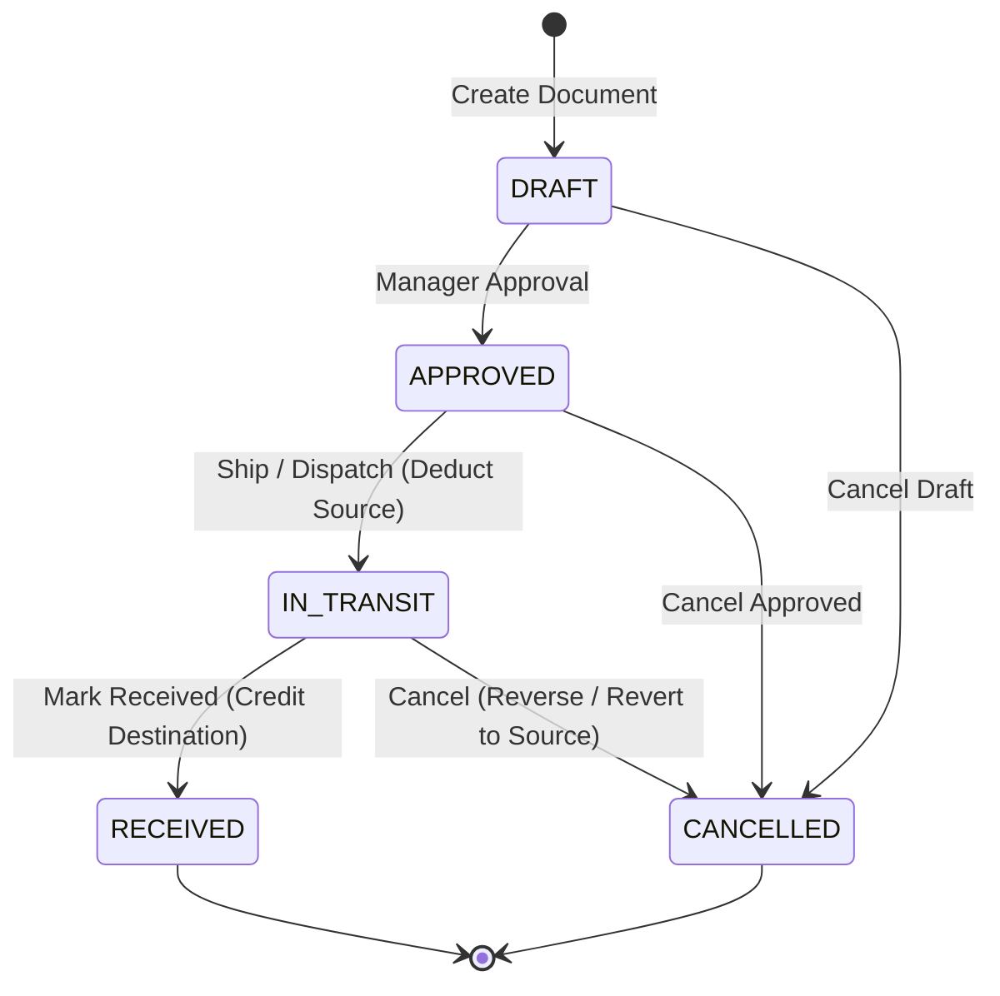
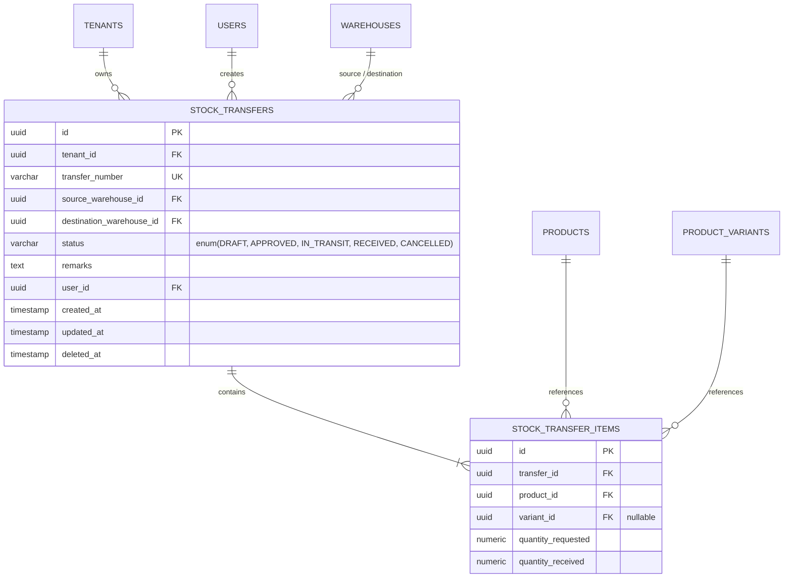

# eCommerce Multi-Tenant SaaS ERP — Multi-Warehouse Stock Documents System & Project Analysis

This document provides a comprehensive technical analysis, architectural review, and implementation summary of the **Multi-Warehouse Stock Transfer Document System**, alongside an updated **Project Feature Completion & Gap Analysis** for the eCommerce Multi-Tenant SaaS ERP platform.

---

## 1. Executive Summary

In enterprise resource planning (ERP) systems, inventory movements must be auditable, traceable, and subject to formal business control policies. Previously, the system suffered from a major operational gap: it supported direct database inventory adjustments and two-leg ledger updates without a formal document trail or workflow state tracking.

To resolve this gap, we implemented a **State-Tracked, Document-Based Stock Transfer System**. This design replaces direct database stock writes with a rigorous multi-stage transaction model, enforcing strict business rules, manager approval, double-entry inventory ledger synchronization, and robust error validation.

---

## 2. Multi-Warehouse Stock Transfer Lifecycle

The stock transfer system transitions through a formal state machine to ensure inventory accuracy and auditability.



### State Definitions & Financial Rules

| Status | Editability | Stock Ledger Impact | Double-Entry Accounting Impact | Business Rule |
| :--- | :--- | :--- | :--- | :--- |
| **`DRAFT`** | Fully Editable | None | None | Initial input state. Items, source, and destination warehouses can be modified. |
| **`APPROVED`** | Read-Only | None | None | Document locked. Ready for logistics dispatch. |
| **`IN_TRANSIT`**| Read-Only | Deducts requested quantities from Source Warehouse (`TRANSFER_OUT`). | *Debit*: Inventory in Transit<br>*Credit*: Source Inventory Asset | Checks live stock at source warehouse before shipping. Throws error if stock is insufficient. |
| **`RECEIVED`** | Read-Only | Credits actual received quantities to Destination Warehouse (`TRANSFER_IN`). | *Debit*: Dest Inventory Asset<br>*Credit*: Inventory in Transit | Supports recording of custom received quantities to account for damage, loss, or leakage in transit. |
| **`CANCELLED`**| Read-Only | Reverses deduction if cancelled from `IN_TRANSIT` (`TRANSFER_IN` to Source). | Reverses the `IN_TRANSIT` accounting journal entry. | Terminal state. Can be triggered from `DRAFT`, `APPROVED`, or `IN_TRANSIT`. |

---

## 3. Data Model Architecture

The implementation introduces two main entities inside the database to support document-based transfers. Both tables strictly enforce `tenant_id` scoping to prevent cross-tenant data leaks.

### 3.1 Entity Relationship Diagram



### 3.2 Database Indexes & Constraints
To optimize querying and enforce tenant separation:
* **Composite Indexes**: Index on `[tenant_id, status]` and `[tenant_id, transfer_number]` for rapid dashboard lookup and validation.
* **Uniqueness**: `transfer_number` is unique per tenant, automatically generated with the prefix `ST-YYYYMMDD-[SEQUENCE]`.
* **Foreign Keys**: Cascading deletion rules are applied to line items (`ON DELETE CASCADE` when the parent document is deleted).

---

## 4. API & Backend Service Implementation

The backend is built in **NestJS** and utilizes **TypeORM** transactions to ensure atomic operations. When a document transitions states, both the status update and the ledger postings are committed together in a single transaction block.

### 4.1 Key Endpoints (`StockTransferController`)

All endpoints require JWT authentication and verify tenant-scoped access:

* `POST /api/stock-transfers` — Create a new `DRAFT` transfer document.
* `GET /api/stock-transfers` — Paginated list of tenant transfers.
* `GET /api/stock-transfers/:id` — Retrieve a single transfer document with details.
* `PUT /api/stock-transfers/:id` — Update draft transfer (editable fields only).
* `POST /api/stock-transfers/:id/approve` — Approve a draft transfer.
* `POST /api/stock-transfers/:id/ship` — Dispatch the transfer, validating stock and creating `TRANSFER_OUT` ledger entries.
* `POST /api/stock-transfers/:id/receive` — Accept the goods, creating `TRANSFER_IN` ledger entries for received quantities.
* `POST /api/stock-transfers/:id/cancel` — Cancel the transfer. Reverses stock back to source if it was already `IN_TRANSIT`.

### 4.2 Code Execution Highlights (Transaction Wrapping)

The transition methods in `StockTransferService` utilize TypeORM `connection.transaction` blocks:

```typescript
await this.connection.transaction(async (manager) => {
  // 1. Lock stock transfer row for writing
  // 2. Perform validation checks (e.g. status flow rules)
  // 3. Write Ledger Entry via InventoryLedgerService
  // 4. Update product cached stock (Dual-Write)
  // 5. Commit status update
});
```

---

## 5. Frontend User Experience (UI)

The UI was designed to match the premium, responsive dashboard guidelines of the project, located in [StockTransfer.tsx](file:///home/gowtamkumar/projects/eCommerce-multi-tenant-saas/client/features/admin/inventory/components/StockTransfer.tsx).

### 5.1 Design & Visual Highlights
* **List Registry & Badges**: Clean table list featuring color-coded status pills:
  * `DRAFT`: Slate Gray
  * `APPROVED`: Deep Blue
  * `IN_TRANSIT`: Amber/Orange
  * `RECEIVED`: Emerald Green
  * `CANCELLED`: Rose Red
* **Slide-out Detail Drawer**: Displays metadata, transit route mapping, and individual item status without forcing full-page reloads.
* **Interactive State Controls**: Contextual actions display dynamically based on status:
  * A `DRAFT` displays "Approve" and "Cancel" buttons.
  * An `APPROVED` transfer shows "Ship / Dispatch" and "Cancel".
  * An `IN_TRANSIT` transfer triggers the "Record Receipt" modal where users can modify actual quantities received (to report missing or damaged goods) before completing, or choose "Cancel" to roll back.
* **Add / Edit Modal**: Handles real-time search for products and variants, listing the current available quantities at the source warehouse to prevent human error during transfer drafting.

---

## 6. End-to-End Test Verification

A robust E2E test suite was developed at `server/test/stock-transfer.e2e-spec.ts`. All test suites compile, run, and pass successfully.

### 6.1 Executed Tests
1. **Complete Lifecycle Pass**: Verifies a transfer successfully transitions `DRAFT` $\rightarrow$ `APPROVED` $\rightarrow$ `IN_TRANSIT` $\rightarrow$ `RECEIVED`, adjusting quantities correctly and creating ledger rows.
2. **Cancellation and Reversal**: Verifies that if an `IN_TRANSIT` shipment is cancelled, the inventory is credited back to the source warehouse.
3. **Out-of-Stock Validation**: Verifies that shipping a transfer fails immediately if the source warehouse has insufficient stock for any item.

### 6.2 Test Logs
```bash
docker exec multi_tenant_server_dev npx jest --config test/jest-e2e.json test/stock-transfer.e2e-spec.ts
```
```text
PASS test/stock-transfer.e2e-spec.ts (5.622 s)
  Stock Transfer Document Flow (e2e)
    ✓ should execute a complete successful stock transfer lifecycle (128 ms)
    ✓ should revert stock deductions when a transfer in transit is cancelled (58 ms)
    ✓ should throw an error when shipping a transfer with insufficient stock at the source warehouse (24 ms)

Test Suites: 1 passed, 1 total
Tests:       3 passed, 3 total
Snapshots:   0 total
Time:        5.849 s
```

---

## 7. Updated Project Analysis & Feature Gaps

Following the implementation of the Stock Transfer Document System, we have updated the platform's features progress matrix and identified the remaining development roadmap.

### 7.1 Status Matrix of ERP Capabilities

| Module | Features Implemented | Current Status | Remaining Work / Gaps |
| :--- | :--- | :--- | :--- |
| **Organization** | Branches, warehouses, warehouse bins CRUD. | **Completed** | None. |
| **Inventory / WMS** | Immutable ledger, stock summary, low-stock alerts, stock adjustments, **Stock Transfer Documents**. | **Mostly Completed** | Batch/expiration tracking, barcode PDF generator, physical inventory cycle counts. |
| **Procurement** | Supplier profiles, PO creation, GRN creation & validation, AP ledger, Supplier Payments. | **Partially Completed** | Persistent purchase requisitions (PR), Supplier Quotations (RFQ), 3-way matching engine. |
| **Finance** | Chart of Accounts, balanced journal entries, P&L, balance sheet, expense ledger. | **Partially Completed** | Reversal journals, tax/VAT rules engine, month-end fiscal closing lock. |
| **POS / Retail** | Register opening/closing, cashier cart UI, order sync. | **Partially Completed** | True offline-first POS sync (IndexedDB queue), split tender payments (e.g. Cash + Card). |
| **Fulfillment** | Pick, pack, ship task lifecycle, shipping courier API sync. | **Partially Completed** | Split-shipment delivery, stock reservation consumption engine. |
| **HRM & Payroll** | Departments, employees, attendance, leave logs, payroll batches. | **Partially Completed** | Link payroll directly to attendance penalties, remove development/demo seed backdoors. |
| **RBAC & Security** | Dynamic roles, permission decorators, tenant isolation. | **Mostly Completed** | Security audit of high-risk operational permissions. |

---

## 8. Development Recommendations (Phase Roadmap)

To progress this platform toward a production-grade multi-tenant ERP, we recommend executing changes in the following order:

1. **API Idempotency Middleware**: Protect payment, order sync, and inventory posting endpoints using `X-Idempotency-Key` headers saved in Redis.
2. **Offline-First POS Queue**: Move the retail checkout process to load from a browser IndexedDB cache so cashier desks can transact offline and sync automatically upon reconnection.
3. **3-Way Purchase Matching**: Implement automated checks comparing Purchase Order vs. Goods Received Note vs. Supplier Invoice to catch billing discrepancies.
4. **Lot & Expiration Tracking**: Add lot/batch identifiers to products and inventory ledger lines to support pharmaceutical, food, or cosmetic merchants.
5. **Fiscal Period Controls**: Add settings to freeze historical accounting periods, preventing back-dated entries.
