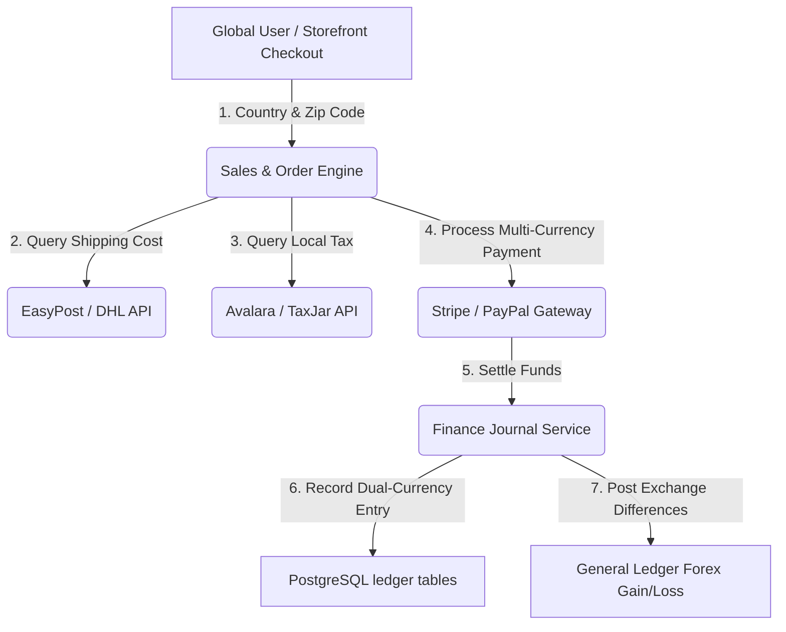

# Global Market Readiness Analysis Report
**Project:** eCommerce Multi-Tenant SaaS ERP  
**Target:** Global Market (Multi-currency, Multi-jurisdictional compliance)  
**Author:** AI Pair Programmer  

---

## 1. Executive Summary

This report analyzes the global market readiness of the modular monolith eCommerce SaaS ERP. The system currently features robust tenant isolation, ledger-based GAAP compliance, and modular domain design. However, its business-logic integrations, onboarding flows, and configurations are tightly coupled with the local market context (primarily Bangladesh, e.g., default `BDT` currency, local couriers Pathao/Steadfast, local gateway SSLCommerz, and hardcoded tax lists). 

To transition this ERP into a global SaaS platform, the core architecture must shift from **single-region assumptions** to **dynamic, localized configurations**.

---

## 2. Component-by-Component Analysis

### A. System Tenant & Onboarding Module
*   **Location:** [server/src/modules/system/tenant/](file:///home/gowtamkumar/projects/eCommerce-multi-tenant-saas-erp/server/src/modules/system/tenant/)
*   **Current Limitations:**
    *   Onboarding (`tenant.service.ts`) initializes all stores with standard Bangladesh-specific templates (defaulting to the same hardcoded [DEFAULT_CHART_OF_ACCOUNTS](file:///home/gowtamkumar/projects/eCommerce-multi-tenant-saas-erp/server/src/modules/admin/operations/finance/accounting/constants/default-coa.ts) and site settings).
    *   No input parameters exist in signup payloads for base currency, timezone, locale, or accounting framework.
*   **Global Enhancements Needed:**
    *   Expand `CreateTenantDto` to collect `baseCurrency`, `timezone`, `country`, and `accountingStandard`.
    *   Dynamically seed the Chart of Accounts (COA) based on the user's region (e.g., seeding a US-GAAP compliant COA vs. an IFRS compliant COA).
    *   Support dynamic database routing for tenants requesting residency in specific regions (e.g., EU servers for German merchants to satisfy GDPR residency rules).

### B. Catalog & Pricing Module
*   **Location:** [server/src/modules/admin/catalog/](file:///home/gowtamkumar/projects/eCommerce-multi-tenant-saas-erp/server/src/modules/admin/catalog/)
*   **Current Limitations:**
    *   `ProductVariantEntity` lacks critical fields for international logistics (item weight, height, width, length, and country of origin).
    *   `PriceBookEntity` does not natively support base prices in different currencies. It forces the system to convert the default currency via client-side multiplication/division using static conversion rates.
*   **Global Enhancements Needed:**
    *   Add dimensional and customs metadata (HS Codes) directly to the product variant tables.
    *   Extend the Pricing engine (`catalog/pricing/`) to resolve explicit base prices per currency rather than basic mathematical conversion (allowing a merchant to sell a product at `$10 USD` and €`12 EUR` explicitly).

### C. Sales, POS & Checkout Module
*   **Location:** [server/src/modules/admin/sales/](file:///home/gowtamkumar/projects/eCommerce-multi-tenant-saas-erp/server/src/modules/admin/sales/)
*   **Current Limitations:**
    *   Payment gateway support is locked to local Cash on Delivery and SSLCommerz (`sslcommerz-payment.strategy.ts`).
    *   Customer address fields at checkout do not conform to international standard address validation (missing fields for county, postal codes, and region-specific states).
*   **Global Enhancements Needed:**
    *   Implement co-existence of both **local Bangladesh payment methods** (SSLCommerz, Cash on Delivery, and MFS options like bKash/Nagad) and **global payment gateways** (Stripe, PayPal, Adyen) dynamically based on checkout currency or merchant location within [payment strategies](file:///home/gowtamkumar/projects/eCommerce-multi-tenant-saas-erp/server/src/common/strategies/payment/).
    *   Support SCA (Strong Customer Authentication/3D Secure) on the frontend storefront and backend payment validation logs for international cards.
    *   Add international address formatting and validation (e.g., using APIs like Google Places or SmartyStreets) for overseas orders.

### D. Logistics & Shipping Module
*   **Location:** [server/src/modules/admin/operations/logistics/](file:///home/gowtamkumar/projects/eCommerce-multi-tenant-saas-erp/server/src/modules/admin/operations/logistics/)
*   **Current Limitations:**
    *   Couriers are hardcoded to Pathao and Steadfast (domestic Bangladeshi networks).
    *   No dynamic international shipping cost computations exist.
*   **Global Enhancements Needed:**
    *   Integrate global logistics aggregators like **EasyPost** or **ShipStation**.
    *   Automate weight-and-dimension-based shipping rate quotes at storefront checkout using DHL, FedEx, UPS, or USPS API integrations.
    *   Support automated printing of international customs labels (CN22/CN23) and commercial invoices.

### E. Finance & Accounting Module
*   **Location:** [server/src/modules/admin/operations/finance/](file:///home/gowtamkumar/projects/eCommerce-multi-tenant-saas-erp/server/src/modules/admin/operations/finance/)
*   **Current Limitations:**
    *   Double-entry journals are written in a single flat currency rate.
    *   Tax calculation (`tax.service.ts`) uses hardcoded lookup rates for local state/cities. This cannot scale to the US's 10,000+ local sales tax zip codes or the complex calculations of EU VAT OSS.
*   **Global Enhancements Needed:**
    *   Support recording transaction values in both **transaction currency** and **base reporting currency** on each journal voucher, registering foreign exchange differences automatically to a system-controlled Forex Gain/Loss account.
    *   Integrate third-party sales tax automation APIs (**TaxJar** or **Avalara**) for live checkout calculations.
    *   Support VAT reverse charges and VAT registration verification checks for B2B cross-border European trades.

### F. Site Settings & Region Localization
*   **Location:** [server/src/modules/admin/settings/](file:///home/gowtamkumar/projects/eCommerce-multi-tenant-saas-erp/server/src/modules/admin/settings/) & [client/hooks/SettingsContext.tsx](file:///home/gowtamkumar/projects/eCommerce-multi-tenant-saas-erp/client/hooks/SettingsContext.tsx)
*   **Current Limitations:**
    *   The settings config ([defaultSettings.ts](file:///home/gowtamkumar/projects/eCommerce-multi-tenant-saas-erp/client/services/defaultSettings.ts)) defines local defaults (e.g., BDT currency and Dhaka timezone).
*   **Global Enhancements Needed:**
    *   Ensure decimal and currency formatting dynamically uses localized number formatting (such as `Intl.NumberFormat`) corresponding to the customer's region/currency instead of hardcoded symbol concatenation.

---

## 3. High-Level Architecture Flow

This diagram illustrates how global variables flow through the platform post-enhancement:

---

## 4. Phased Roadmap to Global Expansion

To implement these improvements without breaking the current modular monolith, a phased approach is recommended (excluding frontend multilingual translation localization per request):

| Phase | Title | Core Tasks | Affected Modules |
| :--- | :--- | :--- | :--- |
| **Phase 1** | **Onboarding & Configuration Foundation** | Expand onboarding variables, dynamic COA seeding, and regional setting initializations. | `Tenant`, `Settings` |
| **Phase 2** | **Co-existence of local and global Checkout Payments** | Integrate Stripe/PayPal alongside existing SSLCommerz and Cash on Delivery methods; support standard global address fields. | `Sales`, `Settings`, Storefront |
| **Phase 3** | **Global Tax & Multi-Currency Ledger** | Integrate Avalara/TaxJar, modify TypeORM journals for base vs. transaction currencies, and automate currency feed worker. | `Finance`, `Catalog` |
| **Phase 4** | **Global Logistics & Fulfillment** | Integrate DHL/EasyPost, support HS customs codes on variants, and generate commercial invoices. | `Logistics`, `Catalog` |

---
