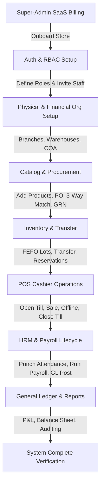

# Enterprise Multi-Store SaaS ERP — Manual Testing Guidelines

This document outlines the step-by-step, module-by-module manual testing protocols for the eCommerce Multi-Store SaaS ERP platform. It is designed to help engineers, QA testers, and developers verify end-to-end business scenarios across the entire modular monolith.

---

## Testing Environment Requirements
Before beginning, ensure:
1. **Database & Services**: PostgreSQL, Redis, and BullMQ workers are running.
2. **Access URL**: Use the local development URL (e.g., `http://localhost:3000` or `http://store.localhost:3000`).
3. **Mail/SMS Sandbox**: MailHog or a local terminal mail-catcher is running to verify OTPs and invitations.
4. **Tools**: Postman/Insomnia (for API endpoints) and a web browser with developer tools open to monitor local storage and networks.

---

## Step-by-Step Module Testing



---

## Module 1: Platform Super-Admin & Store Lifecycle

### 1.1 Store Onboarding & Routing
*   **Goal**: Verify that new stores can register, receive a clean database sandbox, and route via subdomains.
*   **Steps**:
    1. Send a POST request to `/api/system/stores/onboard` with a new store payload:
       ```json
       {
         "storeName": "Apex Retail",
         "subdomain": "apex",
         "ownerEmail": "owner@apex.com",
         "ownerPassword": "SecurePassword123!",
         "planId": "[UUID_OF_ENTERPRISE_PLAN]"
       }
       ```
    2. Check the database to confirm the `store` record is created, and default roles/Chart of Accounts (COA) are seeded for this `storeId`.
    3. Access `http://apex.localhost:3000/api/public/store/apex` and verify it returns correct store metadata (theme, status).
    4. Verify store isolation: Attempt to query `apex` resources using a token from a different store. Ensure a `403 Forbidden` or `404 Not Found` is returned.

### 1.2 Custom Domain Mapping & DNS Verification
*   **Goal**: Verify that stores can map custom domains and trigger DNS validation.
*   **Steps**:
    1. Log in as the Store Owner of `apex`.
    2. Submit a custom domain (e.g., `apexretail.com`) via POST `/api/system/stores/domain`.
    3. Verify that `customDomainStatus` is marked as `PENDING`.
    4. Mock DNS/CNAME resolution on the local server or trigger the verification endpoint.
    5. Verify the domain status changes to `VERIFIED` and `customDomainVerifiedAt` is populated.

### 1.3 Subscription Gating
*   **Goal**: Ensure features are locked according to the store's active subscription plan.
*   **Steps**:
    1. Onboard a store on a "Basic" plan that excludes "HRM Payroll".
    2. Try to access `/api/admin/hrm/payroll/process` with this store's credentials. Verify the request is blocked by the `SubscriptionGuard` with a `403 Forbidden` (Feature Not Entitled).
    3. Update the store's plan to "Enterprise" using the Super-Admin endpoint.
    4. Re-attempt the payroll access. Verify the request is now allowed.
    5. Set the subscription expiry date (`subscriptionEndsAt`) to a past timestamp. Verify all admin dashboard calls return a subscription expired block.

---

## Module 2: Authentication & RBAC (Role-Based Access Control)

### 2.1 Staff Invitation Flow
*   **Goal**: Test invitation delivery, token expiration, and automated role assignment.
*   **Steps**:
    1. Log in as Store Owner. Navigate to Staff Settings and send an invite to `cashier@apex.com` with the role of `Cashier`.
    2. Verify that an entry is added to `StaffInvitationEntity` with status `PENDING` and a valid token.
    3. Open the email sandbox, extract the invitation link, and navigate to the acceptance URL.
    4. Fill out the registration form. Submit.
    5. Log in with the new cashier account. Verify that the user record has `isStaff: true` and the `Cashier` role is automatically assigned.

### 2.2 Permissions & Scope Enforcement (Branch & Warehouse Gates)
*   **Goal**: Verify that users are restricted to their assigned branch and warehouse scope.
*   **Steps**:
    1. Create two branches: **Dhaka Branch** and **Chittagong Branch**.
    2. Assign the cashier user `cashier@apex.com` to a role scoped *only* to **Dhaka Branch** (`scopeBranchId` matches Dhaka's UUID).
    3. Log in as `cashier@apex.com` and attempt to retrieve orders from **Chittagong Branch**.
    4. Verify that the `BranchScopeGuard` rejects the request.
    5. Repeat the test for inventory: attempt to adjust stock in **Chittagong Warehouse** using the Dhaka cashier account, and verify the `403 Forbidden` response.

### 2.3 Permission Overrides
*   **Goal**: Verify that direct permission overrides take precedence over role definitions.
*   **Steps**:
    1. Ensure the `Cashier` role does *not* contain the `pos:override-price` permission.
    2. As Store Owner, assign a direct override to the cashier user: set `permissionCode: "pos:override-price"` and `isGranted: true`.
    3. Log in as the cashier and verify that POS price changes are now allowed.
    4. Set the override `isGranted: false` and verify the action is immediately blocked again.

---

## Module 3: Physical & Financial Setup (Onboarding)

### 3.1 Organizational Setup
*   **Goal**: Verify branch, warehouse, and bin creation.
*   **Steps**:
    1. Navigate to **Organization Settings**.
    2. Create a physical branch (e.g., "Dhaka Central") and a physical warehouse (e.g., "Main Distribution Center").
    3. Link the warehouse to the branch.
    4. Create multiple warehouse bins (e.g., Zone: `A`, Bin Code: `A-01-01`).
    5. Verify in the database that tables `branch`, `warehouse`, and `warehouse_bin` display records correctly mapped to your active `storeId`.

### 3.2 Chart of Accounts (COA) Initialization
*   **Goal**: Ensure default financial accounts exist and are structured correctly.
*   **Steps**:
    1. Navigate to the **Accounting / Chart of Accounts** dashboard.
    2. Verify the system has auto-generated core standard accounts:
       *   `1010` — Cash on Hand (Asset)
       *   `1200` — Inventory Asset (Asset)
       *   `2100` — Accounts Payable (Liability)
       *   `4010` — Sales Revenue (Revenue)
       *   `5010` — Cost of Goods Sold (Expense)
    3. Create a custom sub-account (e.g., `1011` — Bank Asia Operating Account under cash equivalents).
    4. Confirm hierarchical rendering: the sub-account must roll up into the parent account group.

---

## Module 4: Catalog & Procurement Lifecycle

### 4.1 Product Catalog Setup & Expiry Tracking
*   **Goal**: Add products with attributes, prices, and configure lot/batch properties.
*   **Steps**:
    1. Create a product: **Paracetamol 500mg**. Add variants (e.g., Box of 10, Box of 100).
    2. Enable "Batch/Expiry Tracking" on the product settings.
    3. Assign prices to each variant within the active price books.

### 4.2 Purchase Requisition to Purchase Order (PO)
*   **Goal**: Test procurement validation and PO authorization.
*   **Steps**:
    1. Log in as a department staff member. Create a **Purchase Requisition** for `50 boxes of Paracetamol` from Supplier `Square Pharma`.
    2. Log in as Procurement Manager. Review the requisition and click **Approve & Convert to PO**.
    3. Verify the status of the Purchase Order changes to `DRAFT`, then click **Send to Supplier** to transition it to `SENT`.

### 4.3 Goods Received Note (GRN) & Double-Entry Accounting
*   **Goal**: Verify physical inventory increments, damaged goods rejection, and AP journal entry generation.
*   **Steps**:
    1. Log in as Warehouse Supervisor. Navigate to **GRN Verification** and search for the PO created above.
    2. Enter the actual counts received from the delivery:
       *   Ordered: `50 boxes`
       *   Received: `48 boxes` (specify Batch Number: `SQ-1029`, Manufactured Date, Expiry Date: FEFO compliant)
       *   Rejected / Damaged: `2 boxes` (enter reason: "Crushed Packaging")
    3. Click **Verify GRN**.
    4. **Verify Inventory Ledger**: Go to Inventory Ledger. Verify 48 boxes of Paracetamol have been added to the warehouse stock ledger with the specified batch details.
    5. **Verify Journal Entries**: Navigate to Accounting. Search for the auto-posted journal entry mapped to this GRN. Verify:
       *   `DEBIT`: Inventory Asset Account (`1200`) — 48 × Unit Cost
       *   `CREDIT`: Accounts Payable Account (`2100`) — 48 × Unit Cost

### 4.4 Supplier Invoice & 3-Way Matching
*   **Goal**: Ensure invoices cannot be paid unless they match both the PO and the GRN.
*   **Steps**:
    1. Create a **Supplier Invoice** with a quantity of `50` (matching the original PO).
    2. Submit the invoice for verification.
    3. Verify the system triggers a **3-Way Match Variance Warning** because the GRN recorded only `48` units received.
    4. Adjust the invoice to `48` units. Re-run the match. Verify it passes validation.
    5. Approve the invoice and release a payment via `SupplierPaymentEntity`. Verify the Accounts Payable ledger is settled (`DEBIT` AP / `CREDIT` Cash).

---

## Module 5: POS Cashier Operations

### 5.1 Shift Opening
*   **Goal**: Start cashier session and verify cash balances.
*   **Steps**:
    1. Log in as a Cashier. Open the POS link.
    2. Input the opening balance (e.g., `৳5,000.00`). Click **Open Shift**.
    3. Verify in the database that `PosShiftEntity` status is set to `OPEN` and the cashier ID is recorded.

### 5.2 Checkout & Multi-Payment Processing (Split Tender)
*   **Goal**: Verify item selection, coupons, tax calculation, and split payments.
*   **Steps**:
    1. Add items to the cart using search or category panels.
    2. Apply a discount coupon (e.g., `SAVE10`). Verify the cart subtotal, discount, tax, and total amount recalculate correctly.
    3. Click **Charge**. Select **Split Payment**.
    4. Enter payment breakdown:
       *   Amount 1: `৳500` via **Cash**
       *   Amount 2: Remaining balance via **bKash Mobile Banking**
    5. Click **Complete Sale**. Verify the transaction is successful, the receipt is rendered, and stock levels are decremented in the branch warehouse.
    6. Verify the general ledger postings:
       *   `DEBIT` Cash on Hand Account (`1010`) — `৳500`
       *   `DEBIT` Mobile Money Account (e.g., `1015`) — remaining balance
       *   `CREDIT` Sales Revenue Account (`4010`) — total before tax
       *   `CREDIT` Tax Payable Account (`2250`) — tax amount
       *   `DEBIT` COGS (`5010`) / `CREDIT` Inventory (`1200`)

### 5.3 Offline POS Checkout & Sync
*   **Goal**: Test offline-first capabilities, browser storage backup, and idempotent upload.
*   **Steps**:
    1. While in the POS checkout screen, disconnect your network connection (or toggle offline in Chrome DevTools).
    2. Verify the yellow **"Offline Mode"** banner is visible.
    3. Add products and complete a sale.
    4. Check the browser's `IndexedDB` or `LocalStorage` to verify the transaction is saved locally with a generated `clientSaleId` (stored in `offlineSaleId`).
    5. Reconnect the network.
    6. Verify that the POS automatically syncs the offline transaction to the server `/api/admin/sales/pos/sync`.
    7. Verify the order appears in the backend order list.
    8. Send the same payload *again* via API tool to verify **Idempotency**: check that the backend returns `200 Success` or ignores the duplicate write without creating a second order.

### 5.4 Cash Drawer Operations & Shift Closing (Z-Report)
*   **Goal**: Verify mid-shift adjustments and daily reconciliation.
*   **Steps**:
    1. Mid-shift, click **Drawer Operations** → **Cash Out**. Withdraw `৳1,000` to pay for office stationery. Enter reason and submit.
    2. Click **Close Shift**.
    3. Count physical cash in drawer and enter count (e.g., `৳6,200.00`).
    4. Review system-calculated Expected Cash:
       $$\text{Expected} = \text{Opening Float} + \text{Cash Sales} - \text{Cash Out}$$
    5. If a variance exists, verify you are forced to enter a remark.
    6. Click **Close & Submit**.
    7. Verify the system prints the Z-Report and locks the shift records.

---

## Module 6: Logistics, Stock Transfer & Reservations

### 6.1 Stock Transfer Workflow
*   **Goal**: Verify multi-step inter-warehouse transfers.
*   **Steps**:
    1. Create a **Stock Transfer Request** from **Main Warehouse** to **Branch-1 Warehouse** for `10 units` of Paracetamol. Status = `DRAFT`.
    2. Click **Approve**. Status changes to `APPROVED`.
    3. Mark the transfer as **Dispatched / In-Transit**.
    4. **Verify Inventory Ledger**: Check Main Warehouse. Stock must be immediately *deducted* (Quantity: `-10`) in the ledger. Check Branch-1 Warehouse: stock must *not* yet be added.
    5. Mark the transfer as **Received** at the destination.
    6. **Verify Inventory Ledger**: Check Branch-1 Warehouse. Stock must now be *credited* (Quantity: `+10`) in the ledger.

### 6.2 Stock Reservations
*   **Goal**: Verify stock is locked temporarily during checkout and auto-released on expiration.
*   **Steps**:
    1. Check available stock for a product variant. Let's say stock hand = `100`.
    2. Initiate a storefront checkout cart for `5 units`.
    3. Check `StockReservationEntity`. Verify a reservation record exists for `5 units` with status `ACTIVE`.
    4. Query product availability. Verify Available-to-Promise (ATP) inventory equals `95` (`100 - 5`).
    5. Force/wait for the reservation timer (`expiresAt`) to pass.
    6. Verify that `StockReservationSchedulerService` cron worker releases the reservation (`status: EXPIRED` or deleted).
    7. Verify available stock returns to `100`.

---

## Module 7: HRM & Payroll Lifecycle

### 7.1 Geofenced Attendance Punching
*   **Goal**: Test punch locations and daily attendance aggregation.
*   **Steps**:
    1. Set up a branch with a geofenced GPS location (lat/lng) and a radius of `100 meters`.
    2. Using a test user, simulate an attendance punch (POST `/api/admin/hrm/attendance/punch`) with coordinates *outside* the geofence. Verify the API returns `400 Bad Request` (Out of Geofence).
    3. Simulate a punch *within* the geofence. Verify the event is recorded in `AttendanceEventEntity` as `PUNCH_IN`.
    4. Simulate a `PUNCH_OUT` event 9 hours later.
    5. Verify `AttendanceEntity` has aggregated these events into a single daily log, marking the employee as `PRESENT` with `workMinutes: 540`.

### 7.2 Monthly Payroll Run & GL Integration
*   **Goal**: Process monthly salary payroll, approve, and check automatic general ledger integration.
*   **Steps**:
    1. Add basic salary, allowances, and deductions to an employee profile.
    2. Navigate to **HRM / Payroll** and select the target billing month. Click **Process Payroll**.
    3. Review the generated payroll sheet. Ensure the Net Pay calculation matches:
       $$\text{Net Pay} = \text{Basic Salary} + \text{Allowances} - \text{Deductions} - \text{Leave/Unpaid Penalties}$$
    4. Click **Approve Payroll Batch**.
    5. **Verify Journal Postings**: Go to Accounting journals. Verify an entry has been created for payroll:
       *   `DEBIT`: Salary Expense Account (`6100`) — Gross Salaries
       *   `CREDIT`: Salaries Payable Account (`2200`) — Net Salaries Payable
    6. Click **Release Payments**.
    7. Verify the payroll batch status changes to `PAID`. Check the settlement journal entry:
       *   `DEBIT`: Salaries Payable Account (`2200`)
       *   `CREDIT`: Bank/Cash Account (`1011`/`1010`)

---

## Module 8: Finance, Accounting & Reporting

### 8.1 Ledger Double-Entry Check
*   **Goal**: Confirm accounting ledger boundaries cannot be violated.
*   **Steps**:
    1. Try to submit a manual journal entry where total Debits = `৳1,000` and total Credits = `৳950`.
    2. Verify the system returns an error and rejects the posting because the transaction is out of balance.
    3. Submit a balanced journal entry. Verify the records are appended to `LedgerEntryEntity` and are immutable (cannot be updated or deleted directly).

### 8.2 Financial Statement Verification
*   **Goal**: Verify calculation accuracy in Balance Sheets and P&Ls.
*   **Steps**:
    1. Process 3 POS orders (Revenue) and 1 supplier GRN (Inventory Purchase).
    2. Run the **Income Statement (Profit & Loss)** for the current day.
    3. Verify that Net Revenue equals the sum of the POS orders minus tax, and Cost of Goods Sold matches the inventory value depleted.
    4. Run the **Balance Sheet**. Verify that the Accounting Equation holds true:
       $$\text{Assets} = \text{Liabilities} + \text{Equity}$$

---

## Escalation & Bug Reporting
If a manual test fails, document:
1. **Store Subdomain & Context**: (e.g., `apex.localhost:3000`)
2. **User Role Used**: (e.g., Scoped Cashier, Global Admin)
3. **Payload / Steps Performed**
4. **Error Logs**: Extract from NestJS console (`docker-compose logs server`) or audit logs.
5. **Impact**: Financial discrepancy, security bypass, or UI blocker.
