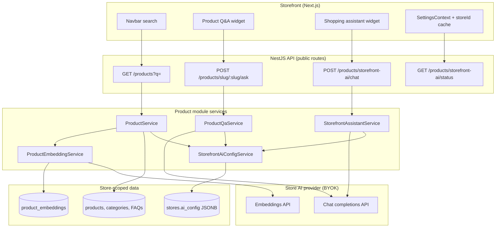
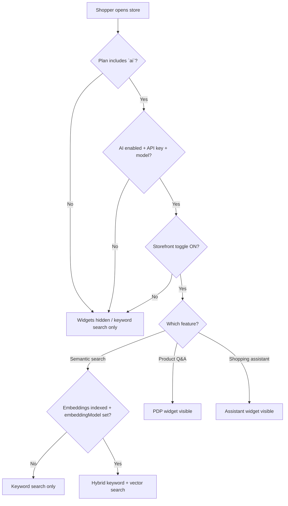
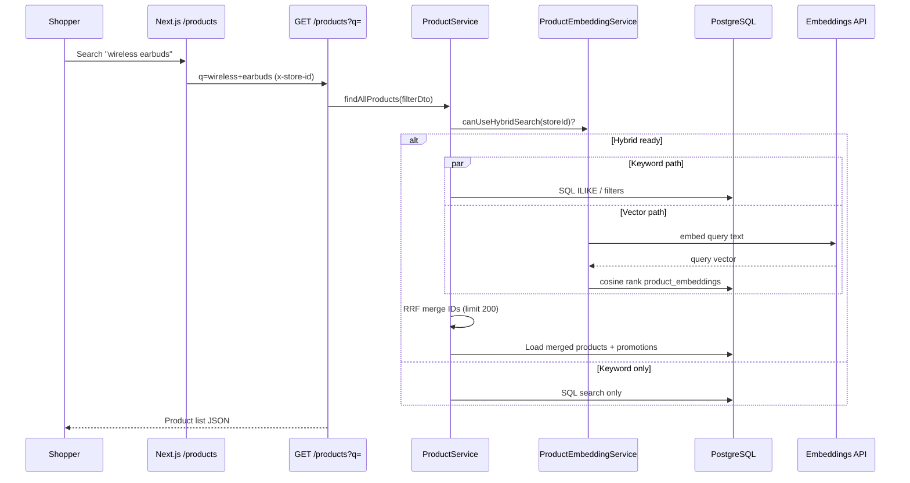
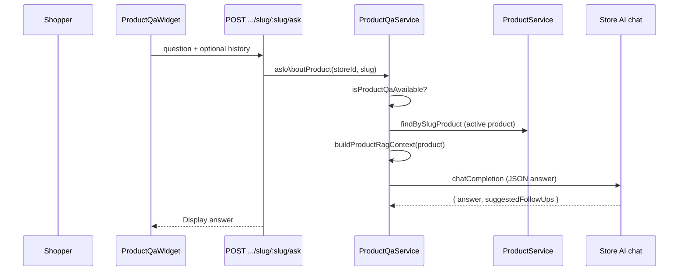
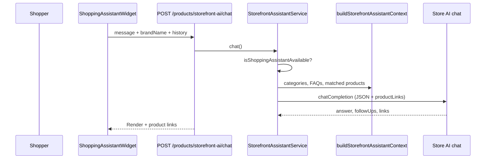

# Storefront AI — User Manual & Developer Guide

**Document version:** 1.0.0  
**Audience:** Store owners, store managers, frontend/backend developers  
**Last updated:** June 2026  
**Scope:** Customer-facing AI on the public storefront (not admin AI Studio)

---

## Table of contents

1. [Overview](#1-overview)
2. [Architecture at a glance](#2-architecture-at-a-glance)
3. [Part A — User manual (store admin)](#part-a--user-manual-store-admin)
4. [Part B — Developer guide](#part-b--developer-guide)
5. [API reference](#5-api-reference)
6. [Troubleshooting](#6-troubleshooting)
7. [Related documents](#7-related-documents)

---

## 1. Overview

Storefront AI adds three optional capabilities for **shoppers** on your public store:

| Feature | Where shoppers see it | What it does |
|--------|------------------------|--------------|
| **Semantic product search** | Catalog search bar (`/products`) | Combines keyword SQL search with vector similarity when indexed |
| **Product Q&A** | Product detail page (PDP) | “Ask about this product” — answers grounded in that product’s data |
| **Shopping assistant** | Floating widget (bottom-left) | Catalog + FAQ help; suggests products; **no checkout** |

### Important principles

- **BYOK (Bring Your Own Key):** Each store connects their own AI provider in **Admin → Settings → AI**. The platform does not host a shared LLM for stores.
- **Plan gate:** Subscription must include the `ai` feature.
- **Draft & guardrails:** AI never changes prices, stock, cart, or checkout. It only reads catalog/FAQ context and returns text.
- **Separate from live chat:** Human support chat (WebSocket, bottom-right) is a different system.

---

## 2. Architecture at a glance

### 2.1 High-level system diagram



### 2.2 Feature availability decision tree

A storefront feature is **live** only when **all** required checks pass:



---

## Part A — User manual (store admin)

### A.1 Who should read this

- **Store owner / store manager** setting up AI for customers  
- **Support staff** explaining what shoppers can and cannot do with AI  

### A.2 Prerequisites checklist

Before any storefront AI works:

| Step | Location | Requirement |
|------|----------|-------------|
| 1 | Subscription | Plan includes **`ai`** feature |
| 2 | Admin → Settings → AI | **Enable AI** + valid **API key** + **default chat model** |
| 3 | Same page | **Storefront AI** toggles turned on per feature |
| 4 | Semantic search only | **Embedding model** set + **Reindex product catalog** run |

### A.3 Step-by-step setup

#### Step 1 — Connect AI provider

1. Log in to **Admin** → **Settings** → **AI** (`/admin/settings/ai`).
2. Enable **AI features for this store**.
3. Choose provider (OpenAI, OpenRouter, Google, Azure, Anthropic, Custom).
4. Enter **API key**, **base URL** (if needed), and **default model** (e.g. `gpt-4o-mini`).
5. For semantic search, set **Embedding model** (e.g. `text-embedding-3-small` for OpenAI).
6. Click **Save AI settings**, then **Test connection**.

#### Step 2 — Enable storefront features

In the **Storefront AI** section on the same page:

| Toggle | Effect when ON |
|--------|----------------|
| **Shopping assistant chat** | Sparkles button bottom-left on storefront |
| **Product Q&A** | “Ask about this product” block on product pages |
| **Semantic product search** | Hybrid search when catalog is indexed |

Status badges (**Live** / **Off**) reflect real availability (provider + toggle + index for search).

Click **Save AI settings** again after changing toggles.

#### Step 3 — Index catalog (semantic search only)

1. Ensure **embedding model** is saved.
2. In **Storefront semantic search**, click **Reindex product catalog**.
3. Wait for completion toast (indexed / skipped counts).
4. Confirm **Hybrid search** shows **Ready on storefront** in the status card.

Re-run reindex after large catalog imports or bulk description changes.

### A.4 What shoppers experience

#### Semantic product search

- Shoppers use the **navbar search** or `/products?search=...`.
- The storefront sends `q=` to the API (mapped from URL `search` param).
- If hybrid mode is active, results merge **keyword matches** and **meaning-based matches** (e.g. “gift for runner” can surface relevant products even without exact words in titles).

#### Product Q&A (PDP)

- On an **active** product page, a card titled **Ask about this product** appears.
- Shoppers can use suggested prompts or type a question (max 500 characters).
- Answers use product description, attributes, variants, stock, FAQs on the product, and recent reviews — **not** the whole web.
- Footer note: for orders/returns, contact support (not AI checkout).

#### Shopping assistant

- **Bottom-left** sparkles button opens a chat panel.
- Helps browse catalog, categories, and **store FAQs**.
- May link to product pages (`/products/{slug}`).
- **Cannot:** add to cart, checkout, change prices, or access order history.
- For order tracking, shoppers should use **live chat** (bottom-right) if enabled.

### A.5 Admin vs storefront AI

| | Admin AI (Settings, products, campaigns) | Storefront AI |
|---|------------------------------------------|---------------|
| **Users** | Staff with permissions | Anonymous/guest shoppers |
| **Auth** | JWT + RBAC | Public routes + store context |
| **Config** | Same `stores.ai_config` | Same config + `storefront` toggles |
| **Checkout** | N/A | **Never** |

### A.6 Operational tips

- **Keep product data clean:** Q&A and search quality depend on descriptions, attributes, and FAQs.
- **Reindex after bulk edits** to refresh semantic search.
- **Turn off toggles** temporarily instead of deleting API keys if you need to disable customer-facing AI quickly.
- **Monitor API usage** on your provider dashboard (OpenAI, etc.) — you pay per token.

---

## Part B — Developer guide

### B.1 Design goals

1. **Store isolation** — every query scoped by `storeId` from host/header/cache.
2. **Hybrid search** — keyword search remains the baseline; vectors enhance recall.
3. **RAG-only answers** — LLM prompts include DB context; system prompts forbid inventing policies/prices.
4. **Graceful degradation** — missing config, toggles, or index → feature hidden or keyword-only search.

### B.2 Request flow — hybrid search



**RRF (Reciprocal Rank Fusion):** keyword and semantic ID lists are merged with `k=60` — see `mergeHybridProductIds()` in `semantic-search.util.ts`.

### B.3 Request flow — product Q&A



### B.4 Request flow — shopping assistant



### B.5 Configuration schema

Stored on **`stores.ai_config`** (JSONB):

```typescript
{
  enabled: boolean
  provider: string          // openai | openrouter | google | ...
  apiKey: string            // never returned to client in full
  baseUrl?: string
  defaultModel: string      // chat model for Q&A + assistant
  embeddingModel?: string   // required for semantic search
  maxTokens?: number
  temperature?: number
  storefront?: {
    shoppingAssistantEnabled?: boolean  // default true when unset
    productQaEnabled?: boolean
    semanticSearchEnabled?: boolean
  }
}
```

Normalization: `server/src/common/utils/storefront-ai-config.util.ts`  
Admin API: `GET/PATCH /stores/ai-config`

**Availability helpers:** `StorefrontAiConfigService`

- `isProviderReady(storeId)` — plan `ai` + enabled + key + default model  
- `getStorefrontFlags(storeId)` — merged storefront toggles  

### B.6 Database — product embeddings

**Migration:** `1781380000000-AddProductEmbeddings.ts`

**Table:** `product_embeddings`

| Column | Purpose |
|--------|---------|
| `store_id` | Isolation |
| `product_id` | FK to product |
| `embedding` | JSONB float vector |
| `content_hash` | Skip re-embed if catalog text unchanged |
| `model` | Embedding model used |

**Indexing:** `ProductEmbeddingService.reindexStoreCatalog()` batches active products (20 per batch), calls `StoreAiClientService.createEmbeddings()`.

**Search document text** built from: name, descriptions, SKU, category, brand, meta fields, attributes (`buildSearchDocument()`).

### B.7 Backend file map

| Path | Role |
|------|------|
| `server/src/modules/admin/catalog/product/controllers/product.controller.ts` | Public storefront routes |
| `server/src/modules/admin/catalog/product/services/product.service.ts` | Catalog list + hybrid branch |
| `server/src/modules/admin/catalog/product/services/product-embedding.service.ts` | Index, search, hybrid merge |
| `server/src/modules/admin/catalog/product/services/product-qa.service.ts` | PDP Q&A |
| `server/src/modules/admin/catalog/product/services/storefront-assistant.service.ts` | Assistant chat + status |
| `server/src/modules/admin/catalog/product/services/storefront-ai-config.service.ts` | Plan + provider + flags |
| `server/src/modules/admin/catalog/product/utils/build-product-rag-context.ts` | PDP context string |
| `server/src/modules/admin/catalog/product/utils/build-storefront-assistant-context.ts` | Assistant RAG context |
| `server/src/modules/admin/catalog/product/utils/semantic-search.util.ts` | Cosine similarity + RRF |
| `server/src/modules/admin/ai/services/store-ai-client.service.ts` | Provider HTTP (chat + embeddings) |
| `server/src/common/utils/storefront-ai-config.util.ts` | Toggle defaults |
| `server/src/common/types/store-ai-config.types.ts` | TypeScript types |

**Module wiring:** `product.module.ts` — imports `AiModule`, `FaqModule`, `CategoryModule`.

### B.8 Frontend file map

| Path | Role |
|------|------|
| `client/app/(user)/layout.tsx` | Mounts `ShoppingAssistantWidget` |
| `client/components/shared/ShoppingAssistantWidget.tsx` | Assistant UI (bottom-left) |
| `client/features/product/shop/ProductQaWidget.tsx` | PDP Q&A UI |
| `client/features/product/shop/ProductDetails.tsx` | Embeds Q&A widget |
| `client/features/product/shop/hooks/useShoppingAssistant.ts` | Status + chat API |
| `client/features/product/shop/hooks/useProductQa.ts` | Status + ask API |
| `client/features/admin/setting/components/AiSetting.tsx` | Admin config + reindex |
| `client/features/admin/setting/hooks/useAiConfig.ts` | Load/save AI + embedding status |
| `client/components/layout/Navbar.tsx` | Search autocomplete (`q=`) |
| `client/features/product/shop/Products.tsx` | Maps URL `search` → API `q` |
| `client/lib/store-store-id.ts` | Cache store ID for localhost API calls |
| `client/hooks/SettingsContext.tsx` | Sets store ID from SSR settings |
| `client/services/api.ts` | `x-store-id` header / cached fallback |

### B.9 Store resolution on the storefront

Public routes require **`RequestContext.storeId`**.

| Environment | Resolution |
|-------------|------------|
| Production subdomain / custom domain | Host header → store middleware |
| Localhost dev | `x-store-id` header from client cache populated by settings SSR |

Without store ID, `/products/storefront-ai/status` fails and widgets stay hidden.

### B.10 Guardrails (enforced in code)

| Rule | Implementation |
|------|----------------|
| No checkout / cart changes | Assistant system prompt + JSON schema |
| No invented prices/discounts | Q&A + assistant prompts |
| Active products only for Q&A | `isProductEligibleForStorefrontQa()` |
| Plan feature `ai` | `StorefrontAiConfigService.isPlanAiEnabled` |
| Subscription guard on catalog | `@RequireFeature('catalog')` on controller |
| Public routes | `@Public()` on status, chat, ask, product list |

### B.11 Local development checklist

1. Store on a plan with **`ai`** feature.
2. Configure **Admin → Settings → AI** (provider + models).
3. Enable storefront toggles; save.
4. Run migration `1781380000000-AddProductEmbeddings` if not applied.
5. **Reindex** catalog from admin AI settings.
6. Open storefront with store context (subdomain or localhost with settings loaded).
7. Verify status:

```bash
curl -s "http://localhost:3900/api/v1/products/storefront-ai/status" \
  -H "x-store-id: YOUR_STORE_UUID"
```

Expected shape:

```json
{
  "success": true,
  "data": {
    "productQaAvailable": true,
    "shoppingAssistantAvailable": true,
    "semanticSearchAvailable": true,
    "productQaEnabled": true,
    "shoppingAssistantEnabled": true,
    "semanticSearchEnabled": true
  }
}
```

8. Test search: `GET /products?q=gift&status=active`
9. Test Q&A: `POST /products/slug/my-product/ask` with `{ "question": "..." }`
10. Test assistant: `POST /products/storefront-ai/chat` with `{ "message": "..." }`

### B.12 Extending storefront AI

| Task | Suggested approach |
|------|-------------------|
| Add new RAG source (e.g. shipping policy page) | Extend `buildStorefrontAssistantContext()` |
| Tune search ranking | Adjust RRF `k` or candidate limits in `product-embedding.service.ts` |
| New widget | Copy pattern: status check → hook → public POST → service with RAG |
| Rate limiting | Add throttle guard on public AI routes per store |

---

## 5. API reference

Base path: `/api/v1` (see server `API_URL`). All storefront AI routes are **public** but require **store context**.

### 5.1 GET `/products/storefront-ai/status`

Returns which features are **available** (ready for shoppers) vs **enabled** (toggle state).

| Field | Meaning |
|-------|---------|
| `productQaAvailable` | Provider ready + toggle + plan |
| `shoppingAssistantAvailable` | Same for assistant |
| `semanticSearchAvailable` | Provider + toggle + embeddings indexed + embedding model |
| `*Enabled` | Toggle from `ai_config.storefront` |

### 5.2 POST `/products/storefront-ai/chat`

**Body:**

```json
{
  "message": "Do you have running shoes?",
  "brandName": "My Store",
  "conversationHistory": [
    { "role": "user", "content": "Hi" },
    { "role": "assistant", "content": "Hello!" }
  ]
}
```

**Response:**

```json
{
  "answer": "...",
  "suggestedFollowUps": ["...", "..."],
  "productLinks": [{ "name": "Product Name", "slug": "product-slug" }]
}
```

### 5.3 POST `/products/slug/:slug/ask`

**Body:**

```json
{
  "question": "Is this waterproof?",
  "conversationHistory": []
}
```

**Response:**

```json
{
  "answer": "...",
  "suggestedFollowUps": ["...", "..."]
}
```

### 5.4 GET `/products?q=` (semantic search)

Standard catalog filter DTO. When `q` is present and hybrid search is ready, results use merged ranking.

Common query params: `q`, `page`, `limit`, `status`, `categoryId`, `brandId`, filters.

### 5.5 Admin-only embedding routes

| Method | Path | Auth |
|--------|------|------|
| GET | `/products/embeddings/status` | JWT + `ai` + catalog read |
| POST | `/products/embeddings/reindex` | JWT + `ai` + catalog write |

### 5.6 Admin AI config

| Method | Path | Auth |
|--------|------|------|
| GET | `/stores/ai-config` | JWT + settings |
| PATCH | `/stores/ai-config` | JWT + settings (includes `storefront` object) |
| POST | `/stores/ai-config/test` | JWT + settings |

---

## 6. Troubleshooting

| Symptom | Likely cause | Fix |
|---------|--------------|-----|
| Widgets never appear | `productQaAvailable` / `shoppingAssistantAvailable` false | Enable AI provider; check plan `ai`; enable storefront toggles |
| Widgets missing on localhost only | No `x-store-id` | Ensure settings load and `setClientStoreId` runs |
| Semantic search feels “keyword only” | `semanticSearchAvailable: false` | Set embedding model; run reindex |
| Q&A says “not available” | Product not **active** or toggle off | Publish product; enable Product Q&A |
| Assistant empty / error | Provider quota or bad model | Test connection in admin; check server logs |
| Reindex fails | No embedding model or invalid API key | Fix AI config; verify embeddings API for provider |
| Status API 503 store missing | Host not mapped to store | Use correct subdomain or pass store header |

**Debug command:**

```bash
curl -s "$API_URL/products/storefront-ai/status" -H "x-store-id: $STORE_ID" | jq
```

---

## 7. Related documents

| Document | Topic |
|----------|--------|
| [ai_system_guide.md](../system-design/ai_system_guide.md) | Full AI stack A–Z (admin, storefront, platform) |
| [ai_improvement_backlog.md](../system-design/ai_improvement_backlog.md) | Improvement checklists and testing |
| [ai_feature_opportunity_analysis.md](../system-design/ai_feature_opportunity_analysis.md) | AI roadmap and storefront phase |
| [10_customer_crm_and_storefront.md](../codebase-understanding/10_customer_crm_and_storefront.md) | Broader storefront architecture |
| [live_chat_system_design.md](../system-design/live_chat_system_design.md) | Human live chat (separate widget) |
| [subscription-and-features.md](../system-design/subscription-and-features.md) | Plan feature gating (`ai`, `catalog`) |
| [02_STORE_OWNER_MANUAL.md](./02_STORE_OWNER_MANUAL.md) | General store admin operations |

---

*End of document.*
