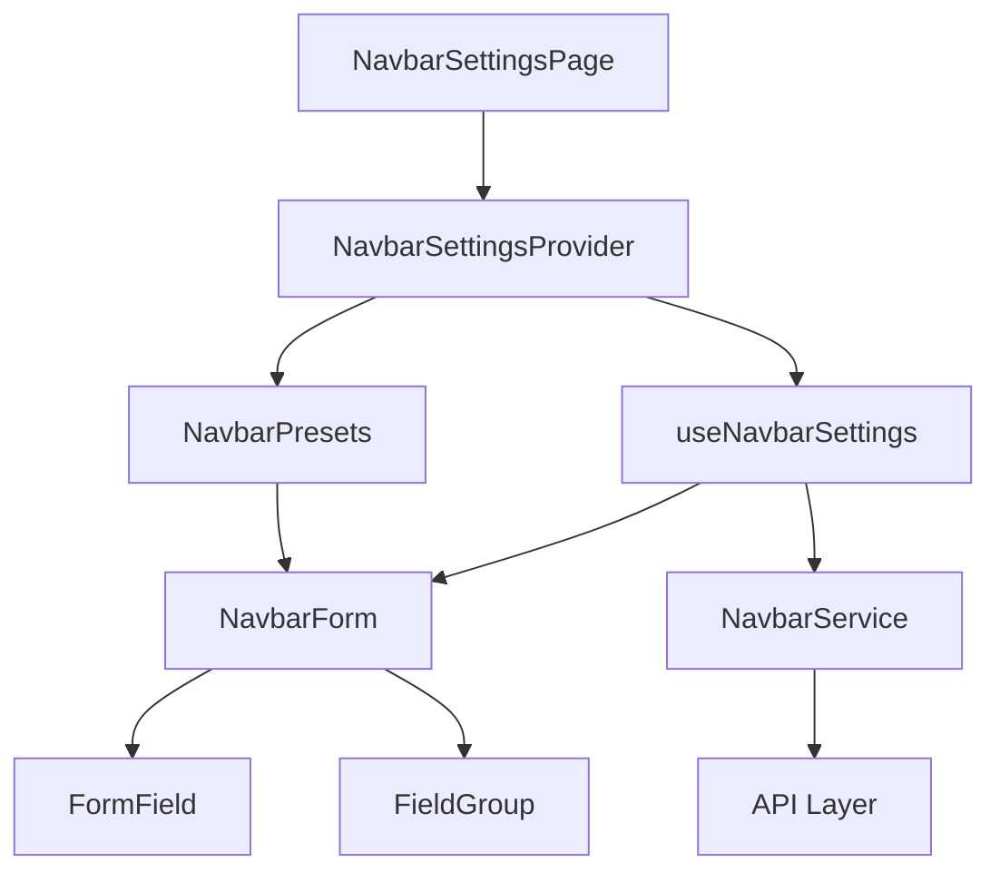

# Navbar Settings Page – Scalability, Separation of Concerns, and DRY Refactor

## 1. Current State

The current implementation of the navbar settings page is tightly coupled with the UI, state, and API logic. It contains:

- Inline state handling for each field.
- Repeated JSX for each setting group.
- Direct API calls inside the component.
- No form validation or schema.

This monolithic structure makes it hard to extend, test, or reuse.

## 2. Goals

1. **Scalability** – Add new navbar options without touching the core component.
2. **Separation of Concerns (SoC)** – Split UI, state, validation, and API into distinct layers.
3. **DRY** – Reuse form controls, validation logic, and state updates.

## 3. Proposed Architecture

```
NavbarSettingsPage
├─ NavbarSettingsProvider (Context + Reducer)
├─ useNavbarSettings (custom hook)
├─ NavbarForm (generic form component)
│  ├─ FormField (reusable field component)
│  └─ FieldGroup (layout helper)
├─ NavbarSchema (JSON schema for validation)
├─ NavbarService (API wrapper)
└─ NavbarPresets (predefined configurations)
```

### 3.1 Context + Reducer

- Holds the current settings state.
- Dispatches actions for field updates, reset, and submit.
- Keeps the component tree thin.

### 3.2 Custom Hook – `useNavbarSettings`

- Encapsulates form logic: validation, dirty check, submit.
- Returns `values`, `errors`, `handleChange`, `handleSubmit`.

### 3.3 Generic Form Component

- Accepts a `schema` and `onSubmit`.
- Renders `FormField` for each schema entry.
- Handles layout via `FieldGroup`.

### 3.4 Validation Schema

- JSON schema (or Yup) describing each field type, default, and validation rules.
- Allows adding new fields by extending the schema.

### 3.5 API Service

- `NavbarService.getSettings()` and `NavbarService.updateSettings()`.
- Handles caching, error handling, and retry logic.

### 3.6 Presets

- `NavbarPresets` component loads preset configurations.
- Uses the same form schema to apply preset values.

## 4. Diagram (Mermaid)



## 5. Implementation Steps

1. **Create Context & Reducer** – `NavbarSettingsProvider.tsx`.
2. **Implement `useNavbarSettings` Hook** – handles state, validation, and submit.
3. **Build Generic `NavbarForm`** – renders fields based on schema.
4. **Define `NavbarSchema`** – JSON/Yup schema for all settings.
5. **Create `NavbarService`** – wrapper around `/api/settings/navbar`.
6. **Refactor `NavbarSettingsPage`** – use provider, hook, and form.
7. **Add `NavbarPresets`** – load and apply preset configurations.
8. **Extract Reusable UI Components** – `FormField`, `FieldGroup`.
9. **Add Tests** – unit tests for reducer, hook, and form.
10. **Update Documentation** – update README and doc files.

## 6. Benefits

- **Scalable** – New fields added to the schema automatically appear in the form.
- **Maintainable** – Logic is isolated; UI changes don't affect state.
- **Reusable** – `FormField` can be used in other settings pages.
- **Testable** – Reducer and hook can be unit‑tested in isolation.
- **Performance** – Memoized components prevent unnecessary re‑renders.

## 7. Next Steps

- Create the `NavbarSettingsProvider` and reducer.
- Implement the `useNavbarSettings` hook.
- Build the generic form and field components.
- Wire everything together in `NavbarSettingsPage`.

---

_Feel free to adjust the schema or component names to match your existing codebase conventions._
