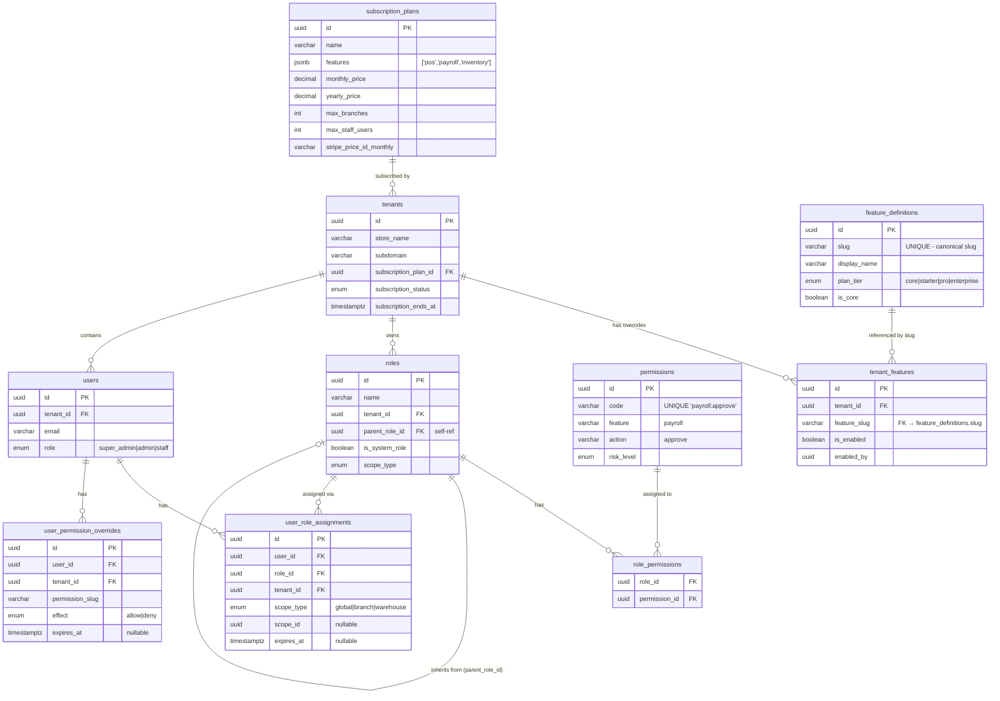
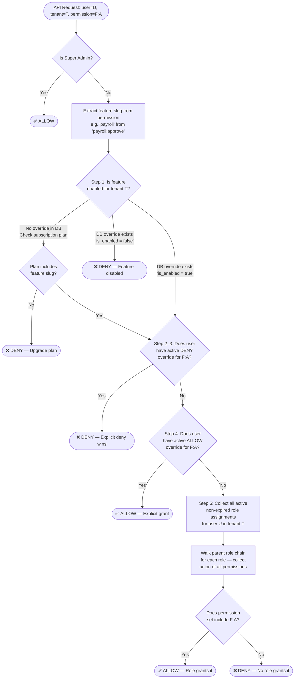
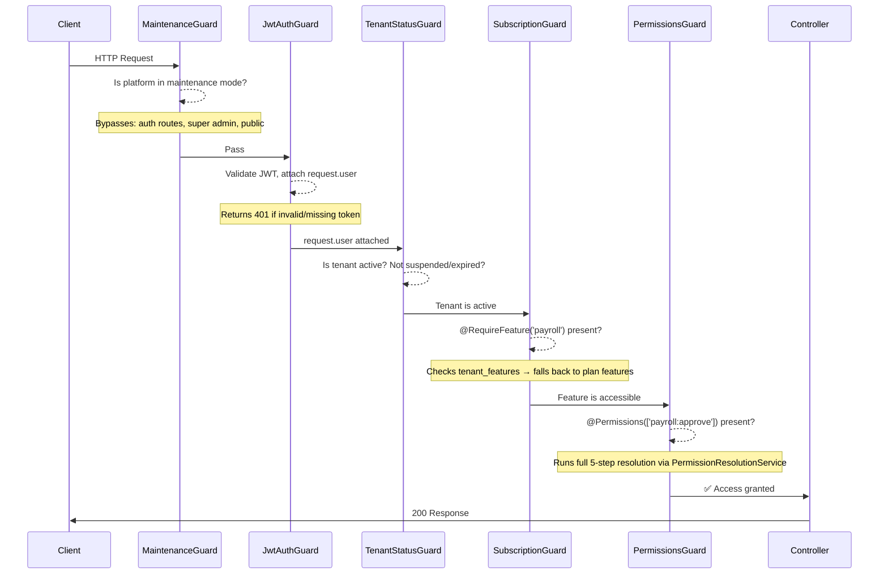
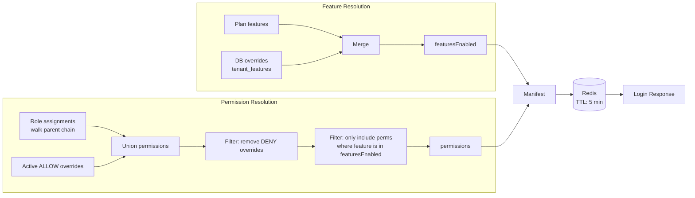

# Subscription Plan & Feature Access Control — System Design

> **Audience**: Backend and full-stack developers joining or reviewing this project.  
> **Goal**: Give a complete, end-to-end understanding of how subscription plans, feature gating, and fine-grained permission control work together in this multi-tenant SaaS platform.

---

## Table of Contents

1. [Overview](#overview)
2. [Core Concepts & Glossary](#core-concepts--glossary)
3. [Database Schema](#database-schema)
4. [Entity Relationship Diagram](#entity-relationship-diagram)
5. [The 5-Step Permission Resolution Algorithm](#the-5-step-permission-resolution-algorithm)
6. [Guard Pipeline — Request Lifecycle](#guard-pipeline--request-lifecycle)
7. [Feature Catalog (`feature_definitions`)](#feature-catalog-feature_definitions)
8. [Subscription Plans (`subscription_plans`)](#subscription-plans-subscription_plans)
9. [Tenant Feature Overrides (`tenant_features`)](#tenant-feature-overrides-tenant_features)
10. [Role & Permission System (RBAC)](#role--permission-system-rbac)
11. [User Permission Overrides](#user-permission-overrides)
12. [Permission Manifest (Login Cache)](#permission-manifest-login-cache)
13. [Frontend Feature Gating](#frontend-feature-gating)
14. [Key Invariants & Rules](#key-invariants--rules)
15. [Common Scenarios — Decision Tree](#common-scenarios--decision-tree)
16. [File Reference Map](#file-reference-map)

---

## Overview

This platform serves multiple independent **tenants** (stores), each on a **subscription plan**. Access to features and fine-grained operations is controlled by a 3-layer model:

```
Layer 1: Subscription Plan  →  Does this tenant's plan include the feature at all?
Layer 2: Tenant Override     →  Has a platform admin toggled a specific feature on/off for this tenant?
Layer 3: RBAC               →  Does this user's role grant the specific action within the enabled feature?
```

Every API request passes through this stack in order. A **DENY at any layer is final** — a user cannot access a feature their plan doesn't include, even if their role grants it.

---

## Core Concepts & Glossary

| Term | Definition |
|---|---|
| **Tenant** | An independent store with its own data, users, and configuration. Identified by `tenantId` (UUID). |
| **Subscription Plan** | A tiered product offering (e.g. Starter, Pro, Enterprise) that defines which **features** are included. |
| **Feature** | A functional area of the application (e.g. `payroll`, `pos`, `inventory`). Identified by a **slug** string. |
| **Feature Slug** | A lowercase string like `payroll`, `pos`, `hrm`. Canonical ID for a feature across all layers. |
| **Feature Override** | A per-tenant database record that enables or disables a single feature, overriding the plan default. |
| **Permission** | An atomic capability within a feature. Format: `feature:action` (e.g. `payroll:approve`, `pos:refund`). |
| **Role** | A named collection of permissions. Assigned to users within a tenant scope. |
| **Permission Manifest** | A cached JSON blob returned at login listing all `featuresEnabled` and `permissions` for a user. |
| **Super Admin** | A platform-level user (`UserRole.SUPER_ADMIN`) who bypasses ALL feature and permission checks. |

---

## Database Schema

### `subscription_plans`

The central catalog of available subscription tiers created by the platform.

```sql
CREATE TABLE subscription_plans (
  id                      UUID PRIMARY KEY DEFAULT gen_random_uuid(),
  name                    VARCHAR(255) NOT NULL,            -- "Starter", "Pro", "Enterprise"
  description             TEXT,
  price                   DECIMAL(10,2) DEFAULT 0,
  monthly_price           DECIMAL(10,2) DEFAULT 0,
  yearly_price            DECIMAL(10,2) DEFAULT 0,
  billing_cycle           ENUM('monthly','yearly') DEFAULT 'monthly',
  features                JSONB DEFAULT '[]',               -- ← Array of feature slugs: ["pos","inventory","payroll"]
  is_active               BOOLEAN DEFAULT true,
  is_popular              BOOLEAN DEFAULT false,
  trial_period_days       INT DEFAULT 14,
  code                    VARCHAR UNIQUE,                   -- Short code: "starter", "pro", "enterprise"
  currency                VARCHAR(3) DEFAULT 'USD',
  max_branches            INT DEFAULT 1,
  max_warehouses          INT DEFAULT 1,
  max_staff_users         INT DEFAULT 3,
  max_products            INT DEFAULT 100,
  max_monthly_orders      INT DEFAULT 500,
  max_storage_mb          INT DEFAULT 1024,
  stripe_price_id_monthly VARCHAR,
  stripe_price_id_yearly  VARCHAR,
  created_at              TIMESTAMPTZ DEFAULT now(),
  updated_at              TIMESTAMPTZ DEFAULT now()
);
```

> **Key field**: `features JSONB` stores an **array of feature slugs** that this plan includes.  
> Example: `["pos", "inventory", "loyalty", "crm"]`

---

### `tenants`

Each tenant (store) subscribes to exactly one plan.

```sql
CREATE TABLE tenants (
  id                       UUID PRIMARY KEY,
  store_name               VARCHAR NOT NULL,
  subdomain                VARCHAR UNIQUE NOT NULL,
  custom_domain            VARCHAR UNIQUE,
  custom_domain_status     ENUM('pending','verified','failed') DEFAULT 'pending',
  status                   ENUM('active','suspended','inactive','maintenance') DEFAULT 'active',
  ssl_enabled              BOOLEAN DEFAULT false,
  -- ─── Subscription ───────────────────────────────────────
  subscription_plan_id     UUID REFERENCES subscription_plans(id),
  subscription_billing_cycle ENUM('monthly','yearly') DEFAULT 'monthly',
  subscription_status      ENUM('trial','active','past_due','canceled','expired') DEFAULT 'active',
  subscription_starts_at   TIMESTAMPTZ,
  subscription_ends_at     TIMESTAMPTZ,
  -- ─── Ownership ──────────────────────────────────────────
  user_id                  UUID REFERENCES users(id) ON DELETE SET NULL,
  created_at               TIMESTAMPTZ DEFAULT now(),
  updated_at               TIMESTAMPTZ DEFAULT now()
);
```

---

### `feature_definitions`

Platform-owned catalog of **all** possible features. Seeded on bootstrap. Tenants cannot modify this table.

```sql
CREATE TABLE feature_definitions (
  id           UUID PRIMARY KEY DEFAULT gen_random_uuid(),
  slug         VARCHAR(100) UNIQUE NOT NULL,   -- "payroll", "pos", "inventory"
  display_name VARCHAR(255) NOT NULL,
  description  TEXT,
  plan_tier    ENUM('core','starter','pro','enterprise') DEFAULT 'starter',
  is_core      BOOLEAN DEFAULT false,          -- Core features cannot be disabled
  is_active    BOOLEAN DEFAULT true,
  created_at   TIMESTAMPTZ DEFAULT now(),
  updated_at   TIMESTAMPTZ DEFAULT now()
);
```

> **`is_core = true`**: Features like `settings` and `user-management` that are always enabled for every tenant, regardless of plan.  
> **`plan_tier`**: The minimum subscription tier that unlocks this feature in a plan.

---

### `tenant_features`

Per-tenant on/off switches for individual features. Acts as the **override layer** on top of subscription plan defaults.

```sql
CREATE TABLE tenant_features (
  id           UUID PRIMARY KEY DEFAULT gen_random_uuid(),
  tenant_id    UUID NOT NULL REFERENCES tenants(id) ON DELETE CASCADE,
  feature_slug VARCHAR(100) NOT NULL,           -- Must match feature_definitions.slug
  is_enabled   BOOLEAN DEFAULT true,
  enabled_by   UUID,                            -- Who last toggled this feature
  enabled_at   TIMESTAMPTZ,
  created_at   TIMESTAMPTZ DEFAULT now(),
  updated_at   TIMESTAMPTZ DEFAULT now(),
  UNIQUE (tenant_id, feature_slug)
);
```

> **⚠️ Critical Rule**: Rows are **NEVER deleted** on plan downgrade. Only `is_enabled` is set to `false`.  
> This preserves role-permission configurations so that an upgrade automatically restores access without re-configuration.

---

### `permissions`

Atomic capabilities in the system. Platform-owned and seeded. Format: `feature:action`.

```sql
CREATE TABLE permissions (
  id          UUID PRIMARY KEY DEFAULT gen_random_uuid(),
  code        VARCHAR UNIQUE NOT NULL,     -- "payroll:approve", "pos:refund"
  name        VARCHAR NOT NULL,
  description VARCHAR,
  module      VARCHAR NOT NULL,            -- Grouping label: "Finance", "POS", "HRM"
  feature     VARCHAR(100),               -- Parent feature slug: "payroll", "pos"
  action      VARCHAR(100),               -- The action: "approve", "refund", "delete"
  risk_level  ENUM('low','medium','high','critical') DEFAULT 'low'
);
```

---

### `roles`

Named collections of permissions scoped to a tenant.

```sql
CREATE TABLE roles (
  id                UUID PRIMARY KEY DEFAULT gen_random_uuid(),
  name              VARCHAR(255) NOT NULL,
  description       TEXT,
  tenant_id         UUID REFERENCES tenants(id) ON DELETE CASCADE,
  is_system_role    BOOLEAN DEFAULT false,    -- Immutable platform-provisioned roles
  is_system_default BOOLEAN DEFAULT false,    -- @deprecated use is_system_role
  parent_role_id    UUID REFERENCES roles(id) ON DELETE SET NULL,  -- For role inheritance
  scope_type        ENUM('global','branch','warehouse') DEFAULT 'global',
  UNIQUE (name, tenant_id)
);

-- Junction table for role ↔ permission many-to-many
CREATE TABLE role_permissions (
  role_id       UUID REFERENCES roles(id) ON DELETE CASCADE,
  permission_id UUID REFERENCES permissions(id) ON DELETE CASCADE,
  PRIMARY KEY (role_id, permission_id)
);
```

> **Role Inheritance**: If `parent_role_id` is set, the effective permission set = own permissions ∪ all ancestor permissions (recursively, max depth 10 to prevent cycles).

---

### `user_role_assignments`

Associates a user with a role, optionally scoped to a branch or warehouse.

```sql
CREATE TABLE user_role_assignments (
  id          UUID PRIMARY KEY DEFAULT gen_random_uuid(),
  user_id     UUID NOT NULL REFERENCES users(id) ON DELETE CASCADE,
  role_id     UUID NOT NULL REFERENCES roles(id) ON DELETE CASCADE,
  tenant_id   UUID NOT NULL REFERENCES tenants(id) ON DELETE CASCADE,
  scope_type  ENUM('global','branch','warehouse') DEFAULT 'global',
  scope_id    UUID,             -- Branch or warehouse UUID (NULL when scope_type = 'global')
  assigned_by UUID,
  expires_at  TIMESTAMPTZ,     -- NULL = permanent; otherwise auto-expires
  assigned_at TIMESTAMPTZ DEFAULT now(),
  updated_at  TIMESTAMPTZ DEFAULT now(),
  UNIQUE (user_id, role_id, scope_id)
);
```

---

### `user_permission_overrides`

Per-user explicit ALLOW or DENY for a specific permission. Bypasses role grants.

```sql
CREATE TABLE user_permission_overrides (
  id              UUID PRIMARY KEY DEFAULT gen_random_uuid(),
  user_id         UUID NOT NULL REFERENCES users(id) ON DELETE CASCADE,
  tenant_id       UUID NOT NULL REFERENCES tenants(id) ON DELETE CASCADE,
  permission_slug VARCHAR(150) NOT NULL,    -- "payroll:approve"
  effect          ENUM('allow','deny') DEFAULT 'allow',
  reason          TEXT,                     -- Required for audit trail
  override_by     UUID,                     -- Admin who set this override
  expires_at      TIMESTAMPTZ,             -- Auto-expiry; NULL = permanent
  created_at      TIMESTAMPTZ DEFAULT now(),
  updated_at      TIMESTAMPTZ DEFAULT now()
);
```

---

## Entity Relationship Diagram



---

## The 5-Step Permission Resolution Algorithm

The `PermissionResolutionService` implements this decision tree for every protected API call:



### Step-by-Step Breakdown

| Step | Logic | Source |
|---|---|---|
| **0** | **Super Admin bypass**: `UserRole.SUPER_ADMIN` skips all checks | `permissions.guard.ts` |
| **1** | **Feature enabled for tenant?**: First checks `tenant_features` DB. If row exists, use `is_enabled`. If no row, fall back to `subscription_plans.features[]` | `permission-resolution.service.ts → isFeatureEnabledForTenant()` |
| **2–3** | **User DENY override**: Query `user_permission_overrides` for `effect = DENY`. Non-expired DENY wins over everything including roles | `resolvePermission()` |
| **4** | **User ALLOW override**: Non-expired `effect = ALLOW` grants access without needing a role | `resolvePermission()` |
| **5** | **Role-based check**: Walk all active non-expired role assignments, collect permission union (with role inheritance), check if `permission_slug` is in the set | `getEffectivePermissions()` |

### Resolution Priority (Highest to Lowest)

```
Super Admin bypass
    ↓
Feature disabled for tenant (plan or override) → DENY
    ↓
Active DENY user override → DENY
    ↓
Active ALLOW user override → ALLOW
    ↓
Role-granted permission → ALLOW or DENY
```

---

## Guard Pipeline — Request Lifecycle

Every incoming HTTP request to a protected endpoint passes through this ordered guard chain:



### Guard Responsibilities

| Guard | File | Responsibility |
|---|---|---|
| `MaintenanceGuard` | `guards/maintenance.guard.ts` | Blocks all traffic when `platform_settings.is_maintenance_mode = true` |
| `JwtAuthGuard` | `guards/jwt-auth.guard.ts` | Validates Bearer JWT, rejects if invalid or missing |
| `TenantStatusGuard` | `guards/tenant-status.guard.ts` | Ensures tenant is `active` and subscription is not `expired` |
| `SubscriptionGuard` | `guards/subscription.guard.ts` | Route-level feature check via `@RequireFeature('slug')` decorator |
| `PermissionsGuard` | `guards/permissions.guard.ts` | Per-permission check via `@Permissions(['feature:action'])` — runs the 5-step engine |

---

## Feature Catalog (`feature_definitions`)

The platform maintains a single source of truth for all features:

| Slug | Display Name | Tier | Is Core |
|---|---|---|---|
| `settings` | Store Settings | core | ✅ |
| `user-management` | User Management | core | ✅ |
| `audit-logs` | Audit Logs | core | ✅ |
| `pos` | Point of Sale | starter | ❌ |
| `inventory` | Inventory Management | starter | ❌ |
| `ecommerce` | E-Commerce Store | starter | ❌ |
| `crm` | CRM & Leads | pro | ❌ |
| `loyalty` | Loyalty & Rewards | pro | ❌ |
| `payroll` | Payroll | pro | ❌ |
| `hrm` | Human Resources | pro | ❌ |
| `accounting` | Accounting & Finance | enterprise | ❌ |
| `reports` | Advanced Reports | enterprise | ❌ |

> **Core features** (`is_core = true`) are always enabled for every tenant. They cannot be disabled through `tenant_features` or subscription downgrades.

---

## Subscription Plans (`subscription_plans`)

Plans define the feature set AND resource limits for a tenant:

### Example Plan Configurations

**Starter Plan**
```json
{
  "name": "Starter",
  "code": "starter",
  "monthly_price": 29.99,
  "features": ["pos", "inventory", "ecommerce"],
  "max_branches": 1,
  "max_staff_users": 5,
  "max_products": 500,
  "max_monthly_orders": 1000,
  "max_storage_mb": 2048
}
```

**Pro Plan**
```json
{
  "name": "Pro",
  "code": "pro",
  "monthly_price": 79.99,
  "features": ["pos", "inventory", "ecommerce", "crm", "loyalty", "payroll", "hrm"],
  "max_branches": 5,
  "max_staff_users": 25,
  "max_products": 5000,
  "max_monthly_orders": 10000,
  "max_storage_mb": 10240
}
```

**Enterprise Plan**
```json
{
  "name": "Enterprise",
  "code": "enterprise",
  "monthly_price": 199.99,
  "features": ["pos", "inventory", "ecommerce", "crm", "loyalty", "payroll", "hrm", "accounting", "reports"],
  "max_branches": -1,
  "max_staff_users": -1,
  "max_products": -1,
  "max_monthly_orders": -1,
  "max_storage_mb": -1
}
```

> `-1` for limits = unlimited.

---

## Tenant Feature Overrides (`tenant_features`)

This table gives platform admins **surgical control** over individual features without changing a tenant's plan.

### Use Cases

| Scenario | Action |
|---|---|
| Grant a Starter tenant early access to `payroll` for a trial period | Insert row: `{tenantId, featureSlug: 'payroll', isEnabled: true}` |
| Suspend `pos` for a specific tenant due to compliance review | Upsert row: `{tenantId, featureSlug: 'pos', isEnabled: false}` |
| Tenant downgrades from Pro → Starter (loses `payroll`) | Update existing rows to `is_enabled = false` — DO NOT DELETE |

### Resolution Logic (from `isFeatureEnabledForTenant`)

```typescript
// 1. Check explicit DB override first
const override = await tenantFeatureRepo.findOne({ where: { tenantId, featureSlug } })
if (override) {
  return override.isEnabled  // DB override is authoritative
}

// 2. No override → check if plan includes this feature
const tenant = await tenantRepo.findOne({ relations: ['subscriptionPlan'] })
return tenant.subscriptionPlan?.features?.includes(featureSlug) ?? false
```

---

## Role & Permission System (RBAC)

### Role Inheritance

Roles can form an inheritance tree via `parent_role_id`. The resolution engine walks the entire chain:

```
Store Manager (parent: Staff)
├── permissions: [payroll:view, payroll:approve, hrm:manage]
└── inherits from Staff:
    └── permissions: [pos:view, pos:create, inventory:view]

Effective permissions for Store Manager:
  [payroll:view, payroll:approve, hrm:manage, pos:view, pos:create, inventory:view]
```

### Scope Types

| Scope | When to Use | `scope_id` |
|---|---|---|
| `GLOBAL` | User acts across the entire tenant | `null` |
| `BRANCH` | User is restricted to a specific branch | `branchId` (UUID) |
| `WAREHOUSE` | User is restricted to a specific warehouse | `warehouseId` (UUID) |

A user can hold **multiple role assignments simultaneously** — e.g., `Staff (GLOBAL)` + `Branch Manager (BRANCH: branch-123)`. The permission engine takes the **union** of all active assignments that match the request scope.

### System Roles

System roles (`is_system_role = true`) are auto-provisioned when a tenant is created. They **cannot be modified or deleted** by the tenant admin. Examples:
- `Super Admin` (tenant-level super user)
- `Store Owner`

---

## User Permission Overrides

When a role configuration doesn't fit a specific user, platform admins can create direct overrides:

### DENY Override (Absolute Block)

```typescript
// Even if a role grants payroll:approve, this override blocks it
{
  userId: 'user-123',
  tenantId: 'tenant-456',
  permissionSlug: 'payroll:approve',
  effect: 'deny',
  reason: 'User is under HR review pending audit completion',
  overrideBy: 'admin-789',
  expiresAt: '2025-09-01T00:00:00Z'
}
```

### ALLOW Override (Grant Without Role)

```typescript
// Grants payroll:export without assigning a role
{
  userId: 'user-123',
  tenantId: 'tenant-456',
  permissionSlug: 'payroll:export',
  effect: 'allow',
  reason: 'Temporary access for Q2 audit',
  overrideBy: 'admin-789',
  expiresAt: '2025-07-01T00:00:00Z'
}
```

> **Best Practice**: Always set `expiresAt`. Permanent overrides (`null`) should be exceptional and require documentation in the `reason` field.

---

## Permission Manifest (Login Cache)

On login, the server generates and caches a **Permission Manifest** for the user. This is delivered to the frontend and used for **UI gating only** (showing/hiding menu items, buttons, etc.).

### Structure

```typescript
interface PermissionManifest {
  featuresEnabled: string[]   // ["pos", "inventory", "payroll"]
  permissions: string[]       // ["pos:view", "pos:create", "payroll:view", "payroll:approve"]
}
```

### How It's Built



### Cache Key

```
rbac:manifest:{tenantId}:{userId}
```

**Cache is invalidated whenever**:
- A role is assigned or revoked
- A permission override is added or removed
- A tenant's plan or feature overrides change

> ⚠️ **Security Warning**: The manifest is for UI convenience **only**. The backend always re-validates permissions on every request via `PermissionsGuard`. Never trust the manifest alone for access control decisions.

---

## Frontend Feature Gating

The client receives the manifest after login and stores it in the auth context. Components use it to conditionally render UI:

```typescript
// Check if a feature is enabled
const canAccessPayroll = featuresEnabled.includes('payroll')

// Check if a specific permission is granted
const canApprovePayroll = permissions.includes('payroll:approve')

// Navigation guard example
if (!featuresEnabled.includes('pos')) {
  redirect('/dashboard')
}
```

### Where It's Used

| Location | What it gates |
|---|---|
| Sidebar navigation | Show/hide menu sections (POS, Payroll, HRM) |
| Route guards (Next.js middleware) | Redirect if feature not in plan |
| Action buttons | Disable "Approve Payroll" if permission missing |
| Form fields | Hide admin-only fields from staff users |

---

## Key Invariants & Rules

1. **DENY always wins**: An active DENY override trumps role grants. This mirrors the AWS IAM model.
2. **Feature first**: If a feature is disabled (plan or override), NO permission within that feature can be granted — regardless of role.
3. **Never delete override rows on downgrade**: Only set `is_enabled = false`. This preserves config for future upgrades.
4. **Expired items are ignored, not deleted**: Both `user_role_assignments.expires_at` and `user_permission_overrides.expires_at` are checked at runtime. Cleanup is optional.
5. **Super Admin bypasses everything**: `UserRole.SUPER_ADMIN` skips the entire guard chain.
6. **Backend always re-validates**: The permission manifest is a hint for the UI. The backend runs the full resolution on every request.
7. **Role inheritance max depth is 10**: Prevents infinite cycles from circular `parent_role_id` references.
8. **Permissions are platform-owned**: Tenants cannot invent new permissions. Only platform seeds them.
9. **Core features are indestructible**: Features with `is_core = true` cannot be disabled via `tenant_features`.

---

## Common Scenarios — Decision Tree

### Scenario A: User tries to access Payroll module but tenant is on Starter plan

```
Step 1: isFeatureEnabledForTenant('payroll')
  → No row in tenant_features
  → Check plan.features = ['pos', 'inventory', 'ecommerce']
  → 'payroll' NOT in plan features
  → DENY ❌ (403: Upgrade your plan)
```

### Scenario B: Platform admin enabled 'payroll' override for tenant on Starter plan

```
Step 1: isFeatureEnabledForTenant('payroll')
  → Row in tenant_features: { featureSlug: 'payroll', isEnabled: true }
  → Return true ✅ (override wins over plan)
  → Continue to Step 2...
```

### Scenario C: User has Store Manager role (grants payroll:approve) but has a DENY override

```
Step 1: Feature enabled ✅
Step 2: Check DENY overrides for user → Found active DENY for 'payroll:approve'
  → DENY ❌ (override wins over role)
```

### Scenario D: New staff user with no roles, but has a temporary ALLOW override for 'pos:view'

```
Step 1: Feature 'pos' enabled ✅
Step 3: No DENY override
Step 4: Found active ALLOW override for 'pos:view'
  → ALLOW ✅ (override grants without needing a role)
```

---

## File Reference Map

| File | Role |
|---|---|
| [`subscription-plan.entity.ts`](../server/src/modules/system/subscription-plan/entities/subscription-plan.entity.ts) | Plan schema: `features` JSONB, pricing, limits |
| [`tenant.entity.ts`](../server/src/modules/system/tenant/entities/tenant.entity.ts) | Tenant schema: `subscriptionPlanId` FK, subscription status |
| [`tenant-feature.entity.ts`](../server/src/modules/system/tenant/entities/tenant-feature.entity.ts) | Per-tenant feature override: `featureSlug`, `isEnabled` |
| [`feature-definition.entity.ts`](../server/src/modules/system/platform/entities/feature-definition.entity.ts) | Platform feature catalog: `slug`, `planTier`, `isCore` |
| [`permission.entity.ts`](../server/src/modules/admin/core/user/entities/permission.entity.ts) | Atomic permission: `code = 'feature:action'` |
| [`role.entity.ts`](../server/src/modules/admin/core/user/entities/role.entity.ts) | Role with parent chain for inheritance |
| [`user-role-assignment.entity.ts`](../server/src/modules/admin/core/user/entities/user-role-assignment.entity.ts) | User ↔ Role assignment with scope and expiry |
| [`user-permission-override.entity.ts`](../server/src/modules/admin/core/user/entities/user-permission-override.entity.ts) | Direct ALLOW/DENY override per user |
| [`permission-resolution.service.ts`](../server/src/common/services/permission-resolution.service.ts) | **Core engine**: 5-step resolution + manifest builder |
| [`permissions.guard.ts`](../server/src/common/guards/permissions.guard.ts) | Guard that calls resolution service per request |
| [`subscription.guard.ts`](../server/src/common/guards/subscription.guard.ts) | Route-level feature check via `@RequireFeature` |
| [`maintenance.guard.ts`](../server/src/common/guards/maintenance.guard.ts) | Platform-wide maintenance mode gate |
| [`tenant-status.guard.ts`](../server/src/common/guards/tenant-status.guard.ts) | Checks tenant is active and not suspended/expired |
| [`require-feature.decorator.ts`](../server/src/common/decorators/require-feature.decorator.ts) | `@RequireFeature('slug')` route decorator |
| [`permissions.decorator.ts`](../server/src/common/decorators/permissions.decorator.ts) | `@Permissions(['feature:action'])` route decorator |
| [`feature-tier.enum.ts`](../server/src/common/enums/feature-tier.enum.ts) | `FeatureTier: CORE \| STARTER \| PRO \| ENTERPRISE` |
| [`subscription-status.enum.ts`](../server/src/common/enums/subscription/subscription-status.enum.ts) | `SubscriptionStatus: TRIAL \| ACTIVE \| PAST_DUE \| CANCELED \| EXPIRED` |
| [`override-effect.enum.ts`](../server/src/common/enums/override-effect.enum.ts) | `OverrideEffect: ALLOW \| DENY` |
| [`role-scope-type.enum.ts`](../server/src/common/enums/role-scope-type.enum.ts) | `RoleScopeType: GLOBAL \| BRANCH \| WAREHOUSE` |

---

*Last updated: 2026-05-27 — Generated from live codebase analysis.*
