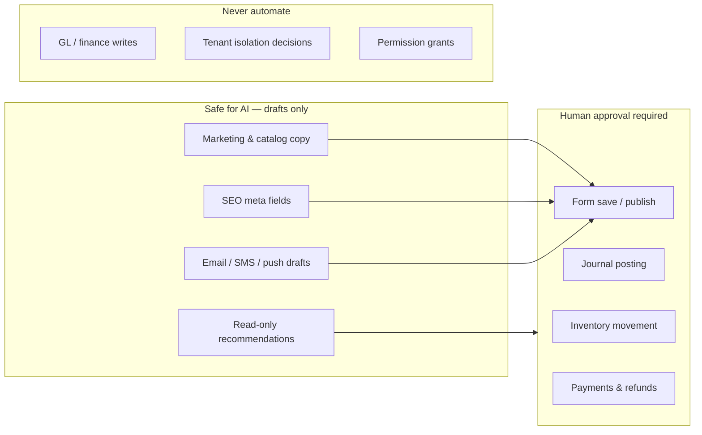

# AI Feature Opportunity Analysis

> **Purpose:** Identify where AI adds value across this multi-tenant eCommerce ERP — what is already built, what should be built next, and what must stay human-controlled.  
> **Audience:** Product, engineering, and implementation planning.  
> **Companion docs:** [AI System Guide](ai_system_guide.md) (A–Z architecture) · [AI Improvement Backlog](ai_improvement_backlog.md) (checklists & next work)

---

## Table of Contents

1. [Executive Summary](#1-executive-summary)
2. [How AI Fits This Platform](#2-how-ai-fits-this-platform)
3. [Status at a Glance](#3-status-at-a-glance)
4. [Integration Patterns](#4-integration-patterns)
5. [Module-by-Module Analysis](#5-module-by-module-analysis)
6. [Priority Roadmap](#6-priority-roadmap)
7. [What AI Must Never Do](#7-what-ai-must-never-do)
8. [Technical Prerequisites](#8-technical-prerequisites)
9. [Success Metrics](#9-success-metrics)

---

## 1. Executive Summary

This platform treats AI as a **draft-and-approve productivity layer** on top of a deterministic ERP core ([ERP Master Design — Phase 7](erp_master_system_design.md#phase-7--future-aiapi-extension-separate-doc)). Tenants bring their own API keys; the platform does not host a shared LLM.

**Today (through Phase D + platform infra):**

- Configuration, multi-provider client, permissions, plan gating
- AI Studio (chat + product/campaign labs)
- Inline assist on **40+ admin surfaces** (catalog, marketing, sales, support, procurement, finance, HRM)
- Storefront: hybrid semantic search, product Q&A, shopping assistant
- Platform AI: plan copy, tenant health narrative, support ticket summary, onboarding hints
- Infrastructure: `ai_jobs` + BullMQ, token usage logs, usage dashboard, rate limits, integration tests
- Embeddings: auto-sync on product save, background reindex, search analytics
- Automation: product SEO draft job, abandoned-cart draft job, async invoice OCR, demand forecast job
- Copilot: dashboard KPI snapshot + admin read-only tools (`listOrders`, `getStockLevel`, etc.)

**Biggest gaps (highest ROI next):**

| Gap | Why it matters |
|-----|----------------|
| **AI Studio tabs** (FAQ, page SEO, store SEO) | Reuse existing endpoints; self-serve experimentation |
| **Support conversation summary** | Agent handoff; complements reply assist |
| **Bulk product import descriptions** | High volume; needs async `ai_jobs` batch |
| **Global copilot sidebar** | Cross-module access outside dashboard |
| **E2E storefront AI smoke** | CI confidence for public `x-tenant-id` routes |

---

## 2. How AI Fits This Platform

**Rules (non-negotiable):**

1. AI returns **suggestions**; existing APIs persist data only when a user saves.
2. AI **never** posts journals, adjusts stock, issues refunds, or changes prices without explicit human action.
3. AI **never** bypasses tenant isolation, RBAC, or plan feature gates.
4. Sensitive finance/HRM data should only be sent to the LLM when the tenant opts in and the use case is read-only summarization.

---

## 3. Status at a Glance

Legend: ✅ Implemented · 🟡 Partial · ⬜ Not started · 🔒 Planned (needs async/infra)

### 3.1 Admin — Content & Marketing

| Area | Route / surface | AI need | Status | Suggested capability |
|------|-----------------|---------|--------|-------------------|
| AI configuration | `/admin/settings/ai` | Provider setup | ✅ | — |
| AI Studio | `/admin/ai` | Sandbox for chat & generation | ✅ | Add FAQ/page/marketing tabs |
| Products | `/admin/products/new` | Descriptions + SEO | ✅ | Bulk generate, variant copy |
| Categories | `/admin/categories` | Name → description + SEO | ✅ | `CatalogAiAssist` + `metaTitle` / `metaDescription` |
| Brands | `/admin/brands` | Brand story + SEO | ✅ | `CatalogAiAssist` + `metaTitle` / `metaDescription` |
| Campaigns | `/admin/campaigns` | Email/SMS/push copy | ✅ | Audience-aware variants |
| Coupons | `/admin/coupons` | Customer-facing description | ✅ | Suggest code names (optional) |
| Promotions | `/admin/promotions` | Offer description | ✅ | — |
| FAQs | `/admin/faqs` | Q&A from topic | ✅ | Bulk import from doc/PDF |
| Page builder — SEO | Page customizer | Meta title/description | ✅ | — |
| Page builder — blocks | Page customizer sections | Headings, paragraphs, CTAs | ✅ | `PageBlockAiAssist` on heading/paragraph/button/text-block |
| Store SEO settings | `/admin/settings/marketing` | Site-wide meta defaults | ✅ | `StoreSeoAiAssist` + `metaTitle` field |
| Loyalty program | `/admin/marketing/loyalty` | Rule explanations, email copy | ✅ | `LoyaltyProgramAiAssist` + `LoyaltyRuleAiAssist` |
| Newsletter / leads | `/admin/leads` | Follow-up email drafts | ✅ | `LeadFollowUpModal` + nurture intents |

### 3.2 Admin — Sales, Support & CRM

| Area | Route | AI need | Status | Suggested capability |
|------|-------|---------|--------|-------------------|
| Dashboard | `/admin` | Natural-language KPI questions | ✅ | `DashboardCopilot` + **AdminCopilot** (read-only tools) |
| Orders | `/admin/orders` | Status explanation, customer email draft | ✅ | `OrderAiAssistModal` on list + order detail |
| Returns | `/admin/returns` | Refund explanation letter | ✅ | Draft only |
| Customers | `/admin/customers` | Support summary, segment labels | ✅ | Read-only profile summary |
| Live chat | `/admin/support` | Suggested replies | ✅ | FAQ + order lookup context |
| Reviews | `/admin/reviews` | Reply draft, toxicity flag | ✅ | Moderation assist |
| Active carts | `/admin/carts` | Abandoned cart message | ✅ | Manual draft + BullMQ `cart.abandoned` automation (no auto-send) |

### 3.3 Admin — Catalog & Media

| Area | Route | AI need | Status | Suggested capability |
|------|-------|---------|--------|-------------------|
| Products | `/admin/products` | Full listing copy | ✅ | Image alt-text from filename |
| Price books | `/admin/price-books` | Pricing rationale notes | ✅ | Internal draft notes only |
| Media library | `/admin/media` | Alt text, file naming | ✅ | Vision optional (OpenAI-compatible) |
| Reviews (catalog) | `/admin/reviews` | See above | ✅ | — |

### 3.4 Admin — Operations & Inventory

| Area | Route | AI need | Status | Suggested capability |
|------|-------|---------|--------|-------------------|
| Inventory dashboard | `/admin/inventory` | Anomaly explanation | ✅ | Read-only narrative |
| Stock transfers | `/admin/stock-transfers` | Transfer reason notes | ✅ | Low priority |
| Cycle count | `/admin/cycle-count` | Variance explanation | ✅ | Read-only |
| Fulfillment | `/admin/fulfillment` | Packing slip notes | ✅ | Low priority |
| Batches / expiry | `/admin/batches` | Waste reduction tips | ✅ | Heuristic forecasting tie-in (read-only) |

### 3.5 Admin — Procurement (SCM)

| Area | Route | AI need | Status | Suggested capability |
|------|-------|---------|--------|-------------------|
| Requisitions | `/admin/procurement/requisitions` | Justification text | ✅ | Draft line notes |
| RFQs | `/admin/procurement/rfqs` | Supplier email body | ✅ | Campaign-copy pattern |
| Purchase orders | `/admin/procurement/purchases` | PO cover letter | ✅ | Low priority |
| GRN | `/admin/procurement/grn` | Receipt discrepancy notes | ✅ | Low priority |
| Supplier invoices | `/admin/procurement/invoices` | **Invoice OCR** | ✅ | Sync + **async** job (`POST /ai/jobs/invoice-ocr`); extract lines → draft |
| Debit notes | `/admin/procurement/debit-notes` | Dispute letter draft | ✅ | Medium priority |
| Suppliers | `/admin/procurement/suppliers` | Supplier profile summary | ✅ | Low priority |

### 3.6 Admin — Finance

| Area | Route | AI need | Status | Suggested capability |
|------|-------|---------|--------|-------------------|
| AR aging | `/admin/finance/ar` | **Collection email drafts** | ✅ | Phase C — per overdue invoice (sync draft; manual send) |
| AP | `/admin/finance/ap` | **Payment reminder to internal approver** | ✅ | Phase C — aging row + batch tab (sync draft; manual send) |
| Expenses | `/admin/expenses` | **Categorization suggest** | ✅ | Phase C — expense form (sync suggest; user applies category) |
| P&L / reports | `/admin/reports/*` | **Executive summary narrative** | ✅ | Phase C — P&L, finance summary, cash flow (sync draft; numbers from DB) |
| Tax engine | `/admin/finance/tax` | **Rule explanation** | ✅ | Phase C — rules table + create modal (docs only; no calculation) |
| General ledger | `/admin/finance/ledger` | — | ❌ | **No AI writes to ledger** |

### 3.7 Admin — HRM

| Area | Route | AI need | Status | Suggested capability |
|------|-------|---------|--------|-------------------|
| Recruitment | `/admin/hrm/recruitment` | **Job description, screening questions** | ✅ | Phase C — post job modal (sync draft; screening Qs copy-only) |
| Performance | `/admin/hrm/performance` | **Review phrase bank** | ✅ | Phase C — new review modal (PII-minimized; draft only) |
| Payroll | `/admin/hrm/payroll` | **Payslip explanation to employee** | ✅ | Phase C — slip drawer (template fill from DB; draft only) |
| Leave policies | `/admin/hrm/leaves` | Policy FAQ generation | ⬜ | Link to store FAQ |

### 3.8 Storefront (customer-facing)

| Area | Surface | AI need | Status | Suggested capability |
|------|---------|---------|--------|-------------------|
| Product search | Storefront catalog | **Semantic / vector search** | ✅ | Phase D — hybrid keyword + vector (`GET /products?q=`); reindex at `/admin/settings` AI |
| Product pages | PDP | Q&A widget (“Ask about this product”) | ✅ | RAG on product fields + FAQs (`POST /products/slug/:slug/ask`) |
| Chat widget | Storefront | Shopping assistant | ✅ | RAG on catalog + FAQs (`POST /products/storefront-ai/chat`); no checkout |
| Checkout | Cart / checkout | — | ❌ | **No AI price or discount changes** |

**Full user + developer guide:** [manuals/12_STOREFRONT_AI_GUIDE.md](../manuals/12_STOREFRONT_AI_GUIDE.md)

### 3.9 Platform (Super Admin)

| Area | AI need | Status | Notes |
|------|---------|--------|-------|
| Plan descriptions | ✅ | Marketing copy for SaaS plans; configure provider at **Platform Settings → AI** |
| Tenant health | ✅ | Churn risk narrative from aggregate metrics (`POST /super-admin/ai/generate/tenant-health-narrative`) |
| Support tooling | ✅ | Ticket summary + onboarding hints (`POST /super-admin/ai/generate/*`); Super Admin dashboard panel |

---

## 4. Integration Patterns

Use the same patterns already proven in Phase B:

| Pattern | When to use | Example in codebase |
|---------|-------------|---------------------|
| **Inline bar** | Form with 1–3 text fields | `AiInlineBar`, `ProductAiAssist`, `CampaignAiAssist` |
| **Inline button** | Single optional field | `DescriptionAiButton` on coupon/promotion |
| **AI Studio tab** | Experimentation, no form context | `AiStudio.tsx` tabs |
| **Chat panel** | Open-ended questions | `AiChatPanel` |
| **Async job** | OCR, bulk, post-create SEO | ✅ `ai_jobs` + BullMQ `ai` queue (`automation_dispatch`, `ocr`, `bulk_seo`, …) |
| **Copilot sidebar** | Cross-module questions | ✅ Dashboard KPI + admin copilot with read-only tools; global sidebar ⬜ |

### Recommended reuse

| New feature | Reuse endpoint / hook |
|-------------|----------------------|
| Category / brand description | Extend `POST /ai/generate/product-content` or add `generate/catalog-entity` |
| Page block text | New `POST /ai/generate/page-content` with `blockType` |
| Support reply | `POST /ai/chat` + injected context (FAQ snippets, order status) |
| RFQ email | `POST /ai/generate/campaign-copy` with `channel: email` |
| Review reply | New `POST /ai/generate/review-reply` |

**Shared client hook:** `client/features/admin/ai/hooks/useAiGenerate.ts`  
**Shared UI:** `AiInlineBar`, `DescriptionAiButton`

---

## 5. Module-by-Module Analysis

### 5.1 Catalog (high value, low risk)

**Implemented:** Product name → description, short description, SEO title/description, tags.

**Still needed:**

1. **Categories** (`CategoryForm.tsx`) — `name`, `description`; no SEO fields today but valuable for category landing pages.
2. **Brands** (`BrandForm.tsx`) — `description` textarea; brand storytelling.
3. **Bulk product import** — After CSV import, batch-generate missing descriptions (async job).
4. **Image alt text** (`ProductMedia.tsx`, media library) — Accessibility + SEO; optional vision API.

**Why priority is high:** Same user workflow as products; copy-paste of `ProductAiAssist` pattern; no ERP side effects.

---

### 5.2 Marketing & Content (mostly done)

**Implemented:** Campaigns, coupons, promotions, FAQs, page SEO.

**Still needed:**

1. **Page builder blocks** (`SimpleContentEditor.tsx`) — `heading`, `paragraph`, `text-block`, `button` labels; merchants spend most time here after SEO.
2. **Global store SEO** (`MarketingSetting.tsx`) — default meta when page-level SEO empty.
3. **Loyalty** (`AdminLoyaltyPage.tsx`) — explain tiers/rewards in customer-friendly language.
4. **Abandoned cart** — Trigger on `cart.abandoned` event; draft SMS/email only (Phase C).

---

### 5.3 Support & CRM (high operational value)

**Live chat** (`SupportChat.tsx`) — Pure manual typing today.

| Capability | Inputs | Output | Risk |
|------------|--------|--------|------|
| Suggested reply | Last N messages + FAQ search + order ID if linked | Draft reply in input box | Low — agent sends manually |
| Conversation summary | Full thread | Bullet summary for handoff | Low |
| Intent tag | Message | `shipping`, `return`, `product` | Low |

**Orders / returns** — “Write customer email” button with order context (status, tracking, refund amount). Uses chat or dedicated endpoint; **must not** change order state.

---

### 5.4 Reviews & trust

**Reviews** (`ReviewCard.tsx`) — Display only; no admin reply flow visible.

| Capability | Value |
|------------|-------|
| Suggested public reply | Thank customer, address concern |
| Sentiment / policy flag | Highlight reviews needing attention |
| Fake review hint | Heuristic only; human decides |

---

### 5.5 Procurement & finance (Phase C — infrastructure required)

Per ERP Phase 7 backlog:

| Feature | Trigger | AI output | Human step |
|---------|---------|-----------|------------|
| Invoice OCR | Supplier invoice PDF upload | Line items, amounts, dates | Approve → create draft supplier invoice |
| AR collection draft | Invoice overdue N days | Email subject/body | Finance sends manually |
| Demand forecast | Scheduled job | Reorder quantity suggestion | Buyer approves PO |

These **require**:

- `ai_jobs` table + status tracking
- BullMQ `ai` queue
- Domain events (`supplier_invoice.uploaded`, `invoice.overdue`, `product.created`)
- Token usage logging for future billing

---

### 5.6 Reports & analytics (read-only copilot)

**Reports** (`/admin/reports/*`) — Charts and tables exist; no narrative layer.

| Capability | Example question | Data source |
|------------|------------------|-------------|
| Report narrator | “Why did margin drop this month?” | P&L + sales APIs (read-only) |
| Anomaly callout | “Stock for SKU X is unusually low” | Warehouse stock report |

**Status:** Admin copilot with **read-only** tools is live (`POST /ai/copilot/admin`); write tools only after audit trail exists.

---

### 5.7 HRM (medium priority, higher sensitivity)

| Feature | Notes |
|---------|-------|
| Job postings | Public copy; similar to product descriptions |
| Interview questions | Draft from job title + department |
| Performance review phrases | **PII risk** — minimize data sent to LLM |
| Payroll explanations | Template-based; no salary data in prompt if possible |

Recommend separate permission: `ai:use` with HRM scope or `ai:manage` policy for sensitive modules.

---

### 5.8 Storefront search & assistant (Phase D)

| Feature | Dependency |
|---------|------------|
| Semantic product search | `embeddingModel` in `ai_config`, vector store per tenant |
| “Ask about this product” | Embed `description` + `attributes` + FAQs |
| Storefront chatbot | FAQ RAG + product catalog read APIs; escalate to human support |

**Not a substitute for** keyword search initially — run hybrid (keyword + vector).

---

## 6. Priority Roadmap

### Phase B+ — Quick wins (1–2 sprints)

Reuse existing endpoints and `useAiGenerate`; no new infrastructure.

| # | Feature | Surface | Effort |
|---|---------|---------|--------|
| 1 | Category description assist | `CategoryForm` | ✅ Done |
| 2 | Brand description assist | `BrandForm` | ✅ Done |
| 3 | Page block content assist | `SimpleContentEditor` | ✅ Done |
| 4 | AI Studio: FAQ + page SEO tabs | `AiStudio.tsx` | S |
| 5 | Review reply draft | `ReviewCard` | S |

### Phase C — ERP integration (3–5 sprints)

| # | Feature | Depends on | Status |
|---|---------|------------|--------|
| 1 | `ai_jobs` + BullMQ processor | Infra | ✅ |
| 2 | `product.created` → background SEO draft | BullMQ | ✅ |
| 3 | `cart.abandoned` → message draft | BullMQ + marketing | ✅ |
| 4 | Supplier invoice OCR (async) | File upload + vision | ✅ |
| 5 | AR collection email drafts | Finance overdue query | ✅ (sync draft) |
| 6 | Demand forecasting (read-only) | Reports + historical orders | ✅ (scheduled job) |

### Phase D — Search & copilot (5+ sprints)

| # | Feature | Status |
|---|---------|--------|
| 1 | Embedding pipeline per tenant | ✅ `product_embeddings` + admin reindex + auto-sync |
| 2 | Storefront semantic search API | ✅ Hybrid search on `GET /products?q=` |
| 3 | Admin copilot (read-only tools) | ✅ `DashboardCopilot` + `POST /ai/copilot/admin` |
| 4 | Support chat with RAG (FAQ + orders) | ✅ Reply assist with context |
| 5 | Token metering / usage dashboard | ✅ `ai_usage_logs` + Settings → AI dashboard |
| 6 | Global copilot sidebar | ⬜ |

**Effort key:** S = small (< 1 day), M = medium (2–3 days), L = large (1+ week)

---

## 7. What AI Must Never Do

| Action | Reason |
|--------|--------|
| Post or edit journal entries | Financial integrity |
| Adjust inventory quantities | Stock truth is ledger-based |
| Issue refunds or capture payments | Money movement |
| Change prices, discounts, or tax rules | Commercial terms |
| Grant/revoke permissions | Security |
| Cross-tenant data access | Isolation |
| Auto-publish campaigns or products | Draft-and-approve principle |
| Auto-send emails/SMS/push | Compliance and brand risk |

---

## 8. Technical Prerequisites

Before expanding AI beyond inline forms:

| Prerequisite | Status | Needed for |
|--------------|--------|------------|
| `tenants.ai_config` + BYOK | ✅ | Everything |
| `ai:use` permission + plan feature `ai` | ✅ | Everything |
| `useAiGenerate` + `AiInlineBar` | ✅ | New inline surfaces |
| `ai_jobs` table | ✅ | OCR, bulk, automation dispatch |
| BullMQ `ai` queue | ✅ | Async work |
| BullMQ automation dispatch | ✅ | `product.created`, `cart.abandoned` |
| Embedding API in `TenantAiClientService` | ✅ | Semantic search |
| Token usage audit log | ✅ | Billing, quotas, usage dashboard |
| `ai:manage` policy UI | ⬜ | Sensitive modules (HRM, finance) |

---

## 9. Success Metrics

Track per tenant after each phase:

| Metric | Target |
|--------|--------|
| Time to publish first product | ↓ 30% with AI assist |
| Campaign creation time | ↓ 25% |
| FAQ coverage (active entries) | ↑ with AI lowering effort |
| Support first-response time | ↓ with suggested replies |
| AI feature adoption (% tenants with `configured: true`) | ↑ via onboarding prompt |
| Token cost per tenant | Visible in Settings → AI usage dashboard |

---

## Related Documents

| Document | Content |
|----------|---------|
| [ai_system_guide.md](ai_system_guide.md) | A–Z architecture, configuration, APIs, providers, file map |
| [ai_improvement_backlog.md](ai_improvement_backlog.md) | Improvement checklists by phase and module |
| [erp_master_system_design.md](erp_master_system_design.md) | ERP Phase 7 AI extension principles |
| [event_driven_architecture.md](../developer/event_driven_architecture.md) | Event hooks for async AI |
| [subscription-and-features.md](subscription-and-features.md) | Plan feature `ai` gating |

---

## Summary

| Layer | Coverage today | Highest-impact next |
|-------|----------------|---------------------|
| **Marketing & content** | ✅ Inline assists across campaigns, coupons, pages, loyalty, leads | AI Studio FAQ/page/store SEO tabs |
| **Catalog** | ✅ Copy assists, media alt-text, embeddings + auto-sync, hybrid search | Bulk import descriptions, variant copy |
| **Support & CRM** | ✅ Reply assist, handoff summary, optional message intent tags, profiles, reviews, cart drafts | Storefront → live chat handoff |
| **Operations / inventory** | ✅ Anomaly, transfer, cycle count, fulfillment, batches; demand forecast job | Global copilot sidebar |
| **Procurement / finance** | ✅ Sync drafts + async invoice OCR job | 3-way match explanation |
| **HRM** | ✅ Job copy, review phrases, payslip explain | Leave policy FAQ, sensitive-module opt-out |
| **Storefront** | ✅ Hybrid search, Q&A, assistant, tenant guards, search analytics, live chat handoff | Multilingual prompts, assistant analytics |
| **Copilot** | ✅ Dashboard KPI + admin read-only tools (`listOrders`, `getStockLevel`, …) | Global sidebar (cross-route) |
| **Platform & infra** | ✅ `ai_jobs`, BullMQ, token metering UI, platform AI + support tooling | E2E storefront smoke, churn trend narratives |

**Detailed checklists:** [ai_improvement_backlog.md](ai_improvement_backlog.md)

AI should continue to expand **where humans write repetitive text** or **need read-only explanations** — not where the ERP enforces invariants (stock, money, permissions).

---

*Last updated: 2026-06-19 — reflects P0–P3 infra, embeddings, automation, copilot, and platform support AI.*
