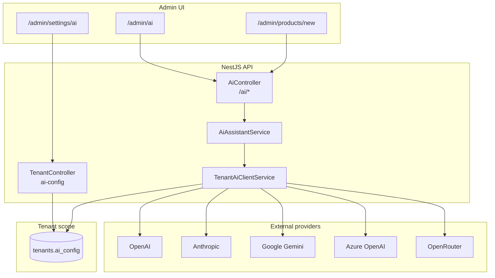
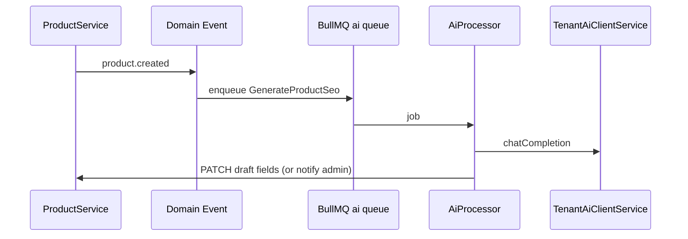

# AI Implementation Analysis

> **Audience:** Backend, frontend, and product engineers extending AI in this platform.  
> **Related:** [ERP Master System Design — Phase 7](erp_master_system_design.md#phase-7--future-aiapi-extension-separate-doc) · [Subscription & Features](subscription-and-features.md) · [Event-Driven Architecture](../developer/event_driven_architecture.md)

---

## Table of Contents

1. [Executive Summary](#1-executive-summary)
2. [Design Principles](#2-design-principles)
3. [Current Implementation Status](#3-current-implementation-status)
4. [Architecture Overview](#4-architecture-overview)
5. [Tenant AI Configuration](#5-tenant-ai-configuration)
6. [Provider Layer](#6-provider-layer)
7. [API Surface](#7-api-surface)
8. [Permissions & Plan Gating](#8-permissions--plan-gating)
9. [Frontend Surfaces](#9-frontend-surfaces)
10. [Roadmap Phases](#10-roadmap-phases)
11. [Future: Async Jobs & Events](#11-future-async-jobs--events)
12. [Operational Notes](#12-operational-notes)
13. [File Reference Map](#13-file-reference-map)

---

## 1. Executive Summary

AI in this platform is implemented as a **tenant-scoped extension layer** on top of the deterministic ERP core described in `erp_master_system_design.md`. Each store brings its own API key and provider (OpenAI, Anthropic, Google Gemini, Azure OpenAI, OpenRouter, or custom). The platform does not host a shared LLM for all tenants.

**What exists today (foundation + first features):**

| Layer | Status |
|-------|--------|
| Per-tenant `ai_config` JSONB on `tenants` | ✅ Done |
| Multi-provider chat client | ✅ Done |
| Admin settings UI (provider, key, test) | ✅ Done |
| AI Studio (chat, product copy, campaign copy) | ✅ Done |
| Product form AI assist (`/admin/products/new`) | ✅ Done |
| Async job queue / `ai_jobs` table | ❌ Not started |
| Embeddings / semantic search | ❌ Not started |
| Event-driven auto-generation (e.g. `product.created`) | ❌ Not started |

AI **never writes directly to the database**. It returns drafts; admins review and save through existing catalog, marketing, and settings APIs.

---

## 2. Design Principles

Aligned with ERP master design Phase 7 and `doc/ARCHITECTURE.md` (“boring before clever”):

1. **ERP APIs are the source of truth** — AI calls services the same way the admin UI does; no bypassing inventory, orders, or finance rules.
2. **Drafts only** — Generated product descriptions, SEO fields, and campaign copy are suggestions until the user saves the form.
3. **Tenant isolation** — API keys and config live in `tenants.ai_config`; never shared across stores.
4. **Bring-your-own-key (BYOK)** — Tenants pay their provider; the platform stores credentials encrypted at rest in JSONB (masked in API responses).
5. **Feature + RBAC gating** — Plan slug `ai` + permission `ai:use` on every AI endpoint; config uses `settings` + `settings:manage`.
6. **Provider abstraction** — `TenantAiClientService` normalizes OpenAI-compatible, Anthropic, Gemini, and Azure APIs behind one `chatCompletion()` interface.

---

## 3. Current Implementation Status

### 3.1 Backend

```
server/src/modules/admin/ai/
├── ai.module.ts
├── controllers/ai.controller.ts
├── services/
│   ├── tenant-ai-client.service.ts   # Low-level provider HTTP
│   ├── ai-assistant.service.ts       # Prompts + business use cases
│   └── ai-feature-bootstrap.service.ts
└── dto/
    ├── ai-chat.dto.ts
    ├── generate-product-content.dto.ts
    └── generate-campaign-copy.dto.ts
```

**Also wired outside `AiModule`:**

| Concern | Location |
|---------|----------|
| Config CRUD + connection test | `TenantController` (`GET/PATCH/POST .../tenants/ai-config`) |
| Config types & presets | `server/src/common/types/tenant-ai-config.types.ts` |
| Normalize / mask / merge config | `server/src/modules/system/tenant/utils/tenant-ai.util.ts` |
| DB column | Migration `1781310000000-AddTenantAiConfig.ts` → `tenants.ai_config jsonb` |

### 3.2 Frontend

| Surface | Path | Purpose |
|---------|------|---------|
| AI Configuration | `/admin/settings/ai` | Provider, API key, models, test connection |
| AI Studio | `/admin/ai` | Assistant chat, product content lab, campaign copy lab |
| Product AI assist | `/admin/products/new` (and edit) | Inline generate → fill description & SEO fields |

### 3.3 Not Yet Built

- Invoice OCR, demand forecasting, AR collection drafts (Phase 7 backlog)
- Storefront semantic / vector search
- Admin copilot with tool-calling into ERP APIs
- Usage metering, token budgets, audit log per AI job
- BullMQ `ai` queue and `ai_jobs` persistence

---

## 4. Architecture Overview



**Request flow (e.g. product content generation):**

1. `PermissionsGuard` checks `ai:use` and that plan feature `ai` is enabled.
2. `SubscriptionGuard` on `AiController` re-validates feature `ai`.
3. `AiAssistantService` builds a structured prompt (JSON output).
4. `TenantAiClientService` loads `tenants.ai_config`, selects provider adapter, POSTs to provider.
5. Response parsed and returned; **no** `ProductService.update` unless the user saves the form.

---

## 5. Tenant AI Configuration

### 5.1 Storage

```typescript
// tenants.ai_config (JSONB)
{
  enabled: boolean
  provider: 'openai' | 'anthropic' | 'google' | 'azure_openai' | 'openrouter' | 'custom'
  apiKey?: string              // never returned in full; masked in API
  baseUrl?: string
  defaultModel?: string
  embeddingModel?: string      // reserved for future embeddings
  apiVersion?: string          // Azure only
  siteUrl?: string             // OpenRouter HTTP-Referer
  siteName?: string            // OpenRouter X-Title
  maxTokens?: number
  temperature?: number
  extraHeaders?: Record<string, string>
}
```

### 5.2 Settings API (tenant-scoped)

| Method | Endpoint | Feature | Permission |
|--------|----------|---------|------------|
| `GET` | `/api/v1/tenants/ai-config` | `settings` | `settings:manage` |
| `PATCH` | `/api/v1/tenants/ai-config` | `settings` | `settings:manage` |
| `POST` | `/api/v1/tenants/ai-config/test` | `settings` | `settings:manage` |

API key updates use sentinel `__UNCHANGED__` to keep the existing key when the field is left blank.

### 5.3 Default provider

Default preset is **OpenAI** (`gpt-4o-mini`). Tenants can switch to any supported native provider in settings without code changes.

---

## 6. Provider Layer

`TenantAiClientService.chatCompletion(tenantId, messages, options?)` routes by `config.provider`:

| Provider | Endpoint style | Auth |
|----------|----------------|------|
| `openai`, `openrouter`, `custom` | `{baseUrl}/chat/completions` | `Authorization: Bearer` |
| `anthropic` | `{baseUrl}/messages` | `x-api-key` + `anthropic-version` |
| `google` | `{baseUrl}/models/{model}:generateContent` | `?key=` query param |
| `azure_openai` | `{deployment}/chat/completions?api-version=` | `api-key` header |

OpenRouter-specific headers (`HTTP-Referer`, `X-Title`) are applied only when `provider === openrouter`.

**Embeddings:** `embeddingModel` is stored for future use; no embedding API is implemented yet.

---

## 7. API Surface

Base path: `/api/v1/ai`  
Controller: `@RequireFeature('ai')` + `@UseGuards(JwtAuthGuard, SubscriptionGuard)`

| Method | Path | Permission | Description |
|--------|------|------------|-------------|
| `GET` | `/ai/status` | `ai:use` | `enabled`, `configured`, `provider`, `defaultModel` |
| `POST` | `/ai/chat` | `ai:use` | Store assistant; optional `history[]` |
| `POST` | `/ai/generate/product-content` | `ai:use` | Title, descriptions, SEO, tags (JSON) |
| `POST` | `/ai/generate/campaign-copy` | `ai:use` | Email subject/body, SMS text (JSON) |

### 7.1 Product content payload

```json
{
  "productName": "Premium Wireless Headphones",
  "keywords": "noise cancelling, bluetooth",
  "existingDescription": "optional text to improve",
  "tone": "professional"
}
```

Response fields: `title`, `shortDescription`, `description`, `seoTitle`, `seoDescription`, `tags[]`.

### 7.2 Campaign copy payload

```json
{
  "campaignName": "Summer Sale",
  "audience": "returning customers",
  "offerDetails": "20% off with code SUMMER20",
  "channel": "both",
  "tone": "friendly"
}
```

---

## 8. Permissions & Plan Gating

### 8.1 Feature slug

- **`ai`** — included on Pro Seller, Enterprise, and Starter (via seed/migrations).
- Nav: **Marketing → AI Studio** (`/admin/ai`).
- Config remains under **`settings`** (core feature) at `/admin/settings/ai`.

### 8.2 Permissions

| Code | Purpose |
|------|---------|
| `ai:use` | AI Studio, product assist, generation endpoints |
| `ai:manage` | Reserved for future admin-only AI policy controls |

Seeded in `UserService.seedPermissions()`. Tenant **Super Admin** system role should hold all permissions (synced on boot via `RoleManagementService.syncSystemRolePermissions()`).

### 8.3 Guard order

```
MaintenanceGuard → TenantIsolationGuard → TenantStatusGuard → BranchScopeGuard
→ PermissionsGuard (global)
→ JwtAuthGuard + SubscriptionGuard (on AiController)
```

---

## 9. Frontend Surfaces

### 9.1 Settings — `AiSetting.tsx`

- Provider dropdown (OpenAI, Anthropic, Google, Azure, OpenRouter, Custom)
- Masked API key, base URL, models, Azure API version
- OpenRouter-only site URL / name fields
- Save + test connection

### 9.2 AI Studio — `AiStudio.tsx`

Tabs: **Assistant** | **Product content** | **Campaign copy**  
Hook: `useAiStudio.ts` → `/ai/*` endpoints.

### 9.3 Product form — `ProductAiAssist.tsx`

Embedded at top of `ProductForm` (new + edit):

- Inputs: tone, keywords (optional)
- Uses product **name** from the form (required to generate)
- Applies: `shortDescription`, `description`, `metaTitle`, `metaDescription`
- Does **not** change category, price, or inventory

Hook: `useProductAi.ts`.

---

## 10. Roadmap Phases

### Phase A — Foundation ✅ (complete)

- [x] `tenants.ai_config` migration
- [x] Multi-provider `TenantAiClientService`
- [x] Settings UI + test endpoint
- [x] `AiModule`, permissions, plan feature `ai`
- [x] Role/plan bootstrap migrations

### Phase B — Admin productivity ✅

- [x] AI Studio chat assistant
- [x] Product content generation (Studio + product form)
- [x] Campaign copy generation (Studio API)
- [x] Campaign form integration (`CampaignForm` — email/SMS/push fields)
- [x] FAQ content assist (`FAQForm` — question + answer)
- [x] Page builder SEO assist (`SeoFieldsSection` — meta title + description)
- [x] Coupon description helper (`CouponFormFields`)
- [x] Promotion description helper (`PromotionFormFields`)

**API endpoints added for Phase B:**

| Endpoint | Use case |
|----------|----------|
| `POST /ai/generate/faq` | FAQ question & answer |
| `POST /ai/generate/page-seo` | Page meta title & description |
| `POST /ai/generate/marketing-description` | Coupon/promotion description |
| `POST /ai/generate/campaign-copy` | Extended with `push` channel |

### Phase C — Deep ERP integration (planned)

Per `erp_master_system_design.md` Phase 7:

| Feature | Integration point | Notes |
|---------|-------------------|-------|
| Product SEO on create | `product.created` event → BullMQ | See `event_driven_architecture.md` |
| Abandoned cart copy | `cart.abandoned` → marketing queue | Draft discount message only |
| Invoice OCR | `purchase` / GRN upload | Extract line items → draft PO |
| AR collection drafts | `finance` overdue invoices | Email draft, human sends |
| Demand forecasting | `reports` + historical orders | Read-only recommendations |

All Phase C jobs should:

1. Enqueue to `ai` queue (to be created).
2. Persist job row (`ai_jobs`: `tenant_id`, `type`, `status`, `input`, `output`, `tokens`).
3. Call existing services on **approve**, not on generation.

### Phase D — Search & copilot (planned)

- Embedding pipeline using `embeddingModel` from tenant config
- Product / FAQ vector index per tenant
- Storefront semantic search API
- Admin copilot with **read-only** tool calls (list orders, stock levels) before any write tools

---

## 11. Future: Async Jobs & Events

Recommended shape (not implemented):



**Rules:**

- Idempotent job keys (`tenantId:productId:jobType`).
- Retry with backoff on 429/5xx from providers.
- Store token usage for future billing add-on.
- Never auto-publish; status `draft` until user confirms.

---

## 12. Operational Notes

### 12.1 Migrations

| Migration | Purpose |
|-----------|---------|
| `1781310000000-AddTenantAiConfig` | `ai_config` column |
| `1781320000000-EnableAiPlanFeature` | Plan feature `ai`, permissions, role links |
| `1781330000000-EnableReportsForPlans` | Related plan/role fixes |
| `1781340000000-RepairCorruptedRolePermissions` | Repair roles after bad permission sync |

Run: `cd server && npm run migration:run`

### 12.2 Bootstrap services

- `AiFeatureBootstrapService` — appends `ai` to plans; adds AI permissions via **SQL only** (never partial TypeORM `save()` on role permissions).
- `RoleManagementService.syncSystemRolePermissions()` — Super Admin gets all platform permissions on boot.

### 12.3 Pitfalls (learned in production)

1. **Do not** load `role.permissions` with a filtered JOIN and then `roleRepo.save(role)` — TypeORM replaces the join table and **wipes** permissions.
2. Use **SQL `INSERT ... SELECT ... WHERE NOT EXISTS`** for permission backfill.
3. After permission/plan changes, users must **re-login** (JWT `features` + 5-minute RBAC manifest cache).
4. AI config test uses live provider call — rate-limit sensitive routes in production if re-enabled.

### 12.4 Environment

No global `OPENAI_API_KEY` required for tenant features. Optional platform keys could be added later for super-admin tooling only.

---

## 13. File Reference Map

### Server

| File | Role |
|------|------|
| `server/src/modules/admin/ai/ai.module.ts` | Module registration |
| `server/src/modules/admin/ai/controllers/ai.controller.ts` | `/ai` REST API |
| `server/src/modules/admin/ai/services/tenant-ai-client.service.ts` | Provider HTTP adapters |
| `server/src/modules/admin/ai/services/ai-assistant.service.ts` | Prompts & JSON parsing |
| `server/src/common/types/tenant-ai-config.types.ts` | Types & presets |
| `server/src/modules/system/tenant/tenant.controller.ts` | AI config endpoints |
| `server/src/modules/system/tenant/tenant.service.ts` | Config get/update |
| `server/src/common/enums/user/permissions.enum.ts` | `AI_USE`, `AI_MANAGE` |

### Client

| File | Role |
|------|------|
| `client/app/admin/settings/ai/page.tsx` | Settings page |
| `client/features/admin/setting/components/AiSetting.tsx` | Config UI |
| `client/app/admin/ai/page.tsx` | AI Studio page |
| `client/features/admin/ai/AiStudio.tsx` | Studio shell |
| `client/features/product/admin/form/ProductAiAssist.tsx` | Product form AI bar |
| `client/features/product/admin/hooks/useProductAi.ts` | Product AI hook |
| `client/routes.ts` | Nav: AI Studio, AI Configuration |

---

## Summary

The platform has a **production-ready AI foundation**: per-tenant BYOK config, multi-provider client, gated APIs, and three admin UX entry points (settings, studio, product form). The ERP core remains authoritative; AI is a draft-and-approve productivity layer.

**Next recommended engineering steps:**

1. Wire **campaign form** to `/ai/generate/campaign-copy`.
2. Add **`ai_jobs` table** + BullMQ processor for async work.
3. Hook **`product.created`** event for optional background SEO drafts.
4. Add **usage tracking** (tokens per tenant) for future billing.

---

*Last updated: 2026-06-18 — reflects implemented codebase state.*
