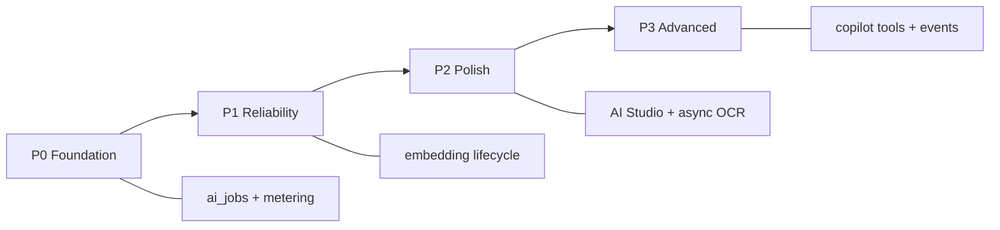

# AI Improvement Backlog & Checklist

**Document version:** 1.0.0  
**Audience:** Product, engineering, QA  
**Last updated:** June 2026  
**Purpose:** Track what is built, what needs improvement, and actionable checklists per module and priority phase.

**Companion docs:**

- [AI System Guide](ai_system_guide.md) — A–Z architecture and file map  
- [AI Feature Opportunity Analysis](ai_feature_opportunity_analysis.md) — module inventory and roadmap  
- [Storefront AI Guide](../manuals/12_STOREFRONT_AI_GUIDE.md) — customer-facing AI deep dive

---

## Table of contents

1. [Executive summary](#1-executive-summary)
2. [Maturity at a glance](#2-maturity-at-a-glance)
3. [Master improvement checklist](#3-master-improvement-checklist)
4. [Phase checklists (P0–P3)](#4-phase-checklists-p0p3)
5. [Module-by-module checklists](#5-module-by-module-checklists)
6. [Cross-cutting quality checklist](#6-cross-cutting-quality-checklist)
7. [Testing checklist (per tenant)](#7-testing-checklist-per-tenant)
8. [What must never be built](#8-what-must-never-be-built)
9. [Related documents](#9-related-documents)

---

## 1. Executive summary

Admin AI coverage is **very strong** (~40 generate endpoints, 50+ UI components). Storefront AI and platform AI are **functional but early**. The largest gaps are **not missing inline assists** — they are:

1. **Platform infrastructure** — async jobs, token metering, rate limits, tests  
2. **Embedding lifecycle** — auto sync on product save/delete  
3. **Automation** — event-driven drafts (abandoned cart, post-create SEO)  
4. **Depth** — copilot tools, usage analytics, async OCR  

Use this doc as a **living checklist**. Mark items `[x]` when done in PRs; keep `[ ]` for open work.

**Legend:** ✅ Done · 🟡 Partial · ⬜ Not started · 🔒 Blocked (needs infra)

---

## 2. Maturity at a glance

| Layer | Maturity | Highest-impact next |
|-------|----------|---------------------|
| Tenant BYOK + config | ✅ Strong | Token usage dashboard |
| Admin inline assists | ✅ Very strong | AI Studio expansion |
| Storefront AI | 🟢 Strong | Tenant assert + embedding lifecycle |
| Platform AI | 🟡 Early | Support tooling |
| Async / jobs / metering | ⬜ Not built | **P0** |
| Tests & observability | ⬜ Weak | **P0** |

---

## 3. Master improvement checklist

High-level tracker. Details in [Section 4](#4-phase-checklists-p0p3) and [Section 5](#5-module-by-module-checklists).

### Platform infrastructure

- [x] `ai_jobs` table (status, tenant_id, type, payload, result, error, tokens)
- [x] BullMQ `ai` queue + processor worker
- [x] Persist token usage per request (`tenant_id`, endpoint, model, tokens, timestamp)
- [x] Tenant AI usage dashboard (Settings → AI or dedicated tab)
- [x] Rate limiting on `POST /ai/*` generate endpoints
- [x] Rate limiting on storefront AI chat (`POST /products/storefront-ai/chat`)
- [x] AI integration tests (config, status, sample generate, storefront status)
- [x] Provider error mapping (user-friendly messages for 401, 429, model not found)

### Embeddings & search

- [x] `product_embeddings` table + hybrid search on `GET /products?q=`
- [x] Admin reindex UI (`Settings → AI`)
- [x] Reindex single product on create/update (incremental, queued `EMBEDDING_BATCH`)
- [x] Remove embeddings on product delete (`removeEmbeddingsForProducts` wired)
- [x] Background full reindex via `ai_jobs` (large catalogs)
- [x] UI warning when provider lacks embedding API (e.g. Anthropic-only)
- [x] Storefront search analytics (AI vs keyword hit counts)

### Automation & events

- [x] Domain event: `product.created` → optional background SEO draft job
- [x] Domain event: `cart.abandoned` → draft email/SMS (no auto-send)
- [x] Async supplier invoice OCR (move from sync vision upload)
- [x] Scheduled demand forecast job (read-only suggestions)

### Copilot & platform

- [x] Dashboard KPI copilot (`POST /ai/copilot/dashboard`)
- [x] Admin copilot with read-only tools (`listOrders`, `getStockLevel`, etc.)
- [x] Platform plan description AI
- [x] Platform tenant health narrative
- [x] Platform support tooling AI (ticket summary, onboarding hints)

### Documentation

- [x] [AI System Guide](ai_system_guide.md)
- [x] [Storefront AI Guide](../manuals/12_STOREFRONT_AI_GUIDE.md)
- [x] This improvement backlog
- [x] Refresh stale summary in [ai_feature_opportunity_analysis.md](ai_feature_opportunity_analysis.md) § Summary

---

## 4. Phase checklists (P0–P3)

### P0 — Foundation (1–2 sprints) — **start here**

| # | Task | Owner | Status |
|---|------|-------|--------|
| 1 | Design `ai_jobs` schema + migration | | [x] |
| 2 | Register BullMQ `ai` queue in app module | | [x] |
| 3 | `AiJobProcessor` — run job types: `embedding_batch`, `ocr`, `bulk_seo` | | [x] |
| 4 | `ai_usage_logs` table + write from `TenantAiClientService` | | [x] |
| 5 | `@Throttle` on `/ai/generate/*` and storefront chat | | [x] |
| 6 | E2E or integration test: tenant config → `/ai/status` → one generate | | [x] usage + job e2e |
| 7 | E2E test: storefront status with valid `x-tenant-id` | | [ ] |

**P0 exit criteria:**

- [x] At least one job type runs end-to-end (e.g. embedding batch)
- [x] Token count persisted for every LLM call
- [x] CI includes AI smoke tests

---

### P1 — Reliability (1 sprint)

| # | Task | Owner | Status |
|---|------|-------|--------|
| 1 | Call embedding upsert on product create/update | | [x] |
| 2 | Call `removeEmbeddingsForProducts` on product delete | | [x] |
| 3 | `BadRequestException` when `tenantId` null on public storefront AI routes | | [x] |
| 4 | Settings UI: warn if `embeddingModel` empty but semantic search enabled | | [x] |
| 5 | Settings UI: warn if Anthropic selected without embedding-capable provider | | [x] |
| 6 | Update opportunity analysis summary table to match current ✅ status | | [x] |

**P1 exit criteria:**

- [x] Product edit → embedding updated within same request or queued job
- [x] Product delete → no orphan rows in `product_embeddings`
- [x] Public AI routes fail fast with clear message when tenant missing

---

### P2 — Product polish (2–3 sprints)

| # | Task | Owner | Status |
|---|------|-------|--------|
| 1 | AI Studio tab: FAQ generator | | [x] |
| 2 | AI Studio tab: Page SEO generator | | [x] |
| 3 | AI Studio tab: Store SEO generator | | [x] |
| 4 | Move invoice OCR to async job + progress UI | | [x] |
| 5 | Tenant usage dashboard (tokens by day / endpoint) | | [x] |
| 6 | Support: conversation summary for handoff | | [x] |
| 7 | Support: intent tags on messages (optional) | | [x] |

**P2 exit criteria:**

- [x] Tenant can see last 30 days token usage
- [x] Large invoice PDF does not block HTTP request > 30s

---

### P3 — Advanced (ongoing)

| # | Task | Owner | Status |
|---|------|-------|--------|
| 1 | `cart.abandoned` listener → draft message job | | [x] |
| 2 | `product.created` listener → optional SEO draft job | | [x] |
| 3 | Bulk product description job after CSV import | | [x] |
| 4 | Admin copilot read-only tool registry | | [x] |
| 5 | Storefront assistant → “Talk to human” deep link to live chat | | [x] |
| 6 | Platform Super Admin support AI assist | | [x] |
| 7 | 3-way match explanation (procurement/finance) | | [ ] |
| 8 | Multilingual prompt locale from store settings | | [ ] |

---

## 5. Module-by-module checklists

### 5.1 Platform infrastructure

| Item | Priority | Status |
|------|----------|--------|
| `ai_jobs` + BullMQ processor | P0 | [x] |
| Token usage persistence | P0 | [x] |
| Usage dashboard UI | P2 | [x] |
| Rate limits on generate endpoints | P0 | [x] |
| AI integration / smoke tests | P0 | [x] |
| Split `AiAssistantService` by domain (refactor) | P2 | [x] |

---

### 5.2 Catalog & embeddings

| Item | Priority | Status |
|------|----------|--------|
| Product content assist | — | [x] |
| Category / brand assist (`CatalogAiAssist`) | — | [x] |
| Media alt-text assist (optional vision) | — | [x] |
| Semantic search + admin reindex | — | [x] |
| Auto embedding on product save | P1 | [x] |
| Remove embeddings on product delete | P1 | [x] |
| Incremental / background reindex | P2 | [x] |
| Bulk description generate after import | P3 | [x] |
| Variant-level copy assist | P3 | [ ] |
| Provider embedding capability warning in UI | P1 | [x] |

---

### 5.3 Marketing & content

| Item | Priority | Status |
|------|----------|--------|
| Campaign / coupon / promotion copy | — | [x] |
| FAQ assist | — | [x] |
| Page SEO assist | — | [x] |
| Page block content assist | — | [x] |
| Store SEO assist | — | [x] |
| Loyalty program / rule copy | — | [x] |
| Lead follow-up drafts | — | [x] |
| AI Studio: only chat + product + campaign tabs | — | [x] |
| AI Studio: FAQ tab | P2 | [x] |
| AI Studio: page SEO tab | P2 | [x] |
| AI Studio: store SEO tab | P2 | [x] |
| Audience-aware campaign variants | P3 | [ ] |
| Abandoned cart **manual** draft | — | [x] |
| Abandoned cart **event** automation | P3 | [x] |
| Coupon code name suggestions | P3 | [x] |

---

### 5.4 Support & CRM

| Item | Priority | Status |
|------|----------|--------|
| Support reply assist (FAQ + order context) | — | [x] |
| Customer profile summary | — | [x] |
| Lead follow-up assist | — | [x] |
| Conversation summary for handoff | P2 | [x] |
| Intent tagging (`shipping`, `return`, etc.) | P3 | [ ] |
| Richer auto order lookup in support assist | P2 | [ ] |
| Storefront assistant → live chat handoff | P3 | [x] |

---

### 5.5 Sales (orders, returns, carts, reviews)

| Item | Priority | Status |
|------|----------|--------|
| Order assist (email templates) | — | [x] |
| Return assist | — | [x] |
| Review reply assist | — | [x] |
| Abandoned cart message draft | — | [x] |
| Review toxicity / policy flag UX | P2 | [ ] |
| POS cashier AI assist | P3 | [x] |
| Auto-send emails/SMS | — | 🔒 Never |

---

### 5.6 Operations & inventory

| Item | Priority | Status |
|------|----------|--------|
| Inventory anomaly narrative | — | [x] |
| Stock transfer reason notes | — | [x] |
| Cycle count variance explanation | — | [x] |
| Fulfillment packing slip notes | — | [x] |
| Batch waste reduction tips | — | [x] |
| Demand forecast job (read-only) | P3 | [x] |
| Reorder alert narrative linked to reports | P3 | [ ] |

---

### 5.7 Procurement & finance

| Item | Priority | Status |
|------|----------|--------|
| Requisition justification | — | [x] |
| RFQ supplier email | — | [x] |
| PO cover letter | — | [x] |
| GRN discrepancy notes | — | [x] |
| Invoice OCR (sync vision) | — | [x] |
| Invoice OCR **async** + job status UI | P2 | [x] |
| Debit note dispute draft | — | [x] |
| Supplier profile summary | — | [x] |
| AR collection email draft | — | [x] |
| AP payment reminder draft | — | [x] |
| Expense category suggest | — | [x] |
| Report executive summary | — | [x] |
| Tax rule explanation | — | [x] |
| 3-way match explanation | P3 | [ ] |
| AI writes to GL / ledger | — | 🔒 Never |

---

### 5.8 HRM

| Item | Priority | Status |
|------|----------|--------|
| Recruitment job copy | — | [x] |
| Performance review phrase bank | — | [x] |
| Payslip explanation draft | — | [x] |
| Leave policy → FAQ generation | P3 | [ ] |
| Interview screening questions (dedicated flow) | P3 | [ ] |
| Sensitive-module AI opt-out in settings | P2 | [ ] |
| Separate `ai:use` scope for HRM/finance | P2 | [ ] |

---

### 5.9 Storefront (customer-facing)

| Item | Priority | Status |
|------|----------|--------|
| Hybrid semantic search | — | [x] |
| Product Q&A widget | — | [x] |
| Shopping assistant widget | — | [x] |
| Storefront AI toggles in tenant settings | — | [x] |
| Explicit server reject when `tenantId` missing | P1 | [ ] |
| Localhost `store_tenant_id` fallback documented | — | [x] |
| Search ranking tuning / fallback UX | P2 | [ ] |
| Assistant usage analytics | P2 | [ ] |
| Multilingual prompts | P3 | [ ] |
| AI changes prices / checkout | — | 🔒 Never |

---

### 5.10 Platform (Super Admin)

| Item | Priority | Status |
|------|----------|--------|
| Platform Settings → AI config UI | — | [x] |
| Env fallback (`PLATFORM_AI_*`) | — | [x] |
| Plan description assist | — | [x] |
| Tenant health snapshot + narrative | — | [x] |
| Support tooling AI | P3 | [x] |
| New tenant onboarding copy assist | P3 | [x] |
| Churn narrative week-over-week trends | P3 | [ ] |

---

### 5.11 Admin copilot (cross-module)

| Item | Priority | Status |
|------|----------|--------|
| Dashboard KPI copilot | — | [x] |
| Read-only tool registry (orders, stock, reports) | P3 | [x] |
| Global copilot sidebar | P3 | [ ] |
| Write tools (any ERP mutation) | — | 🔒 Never without audit |

---

## 6. Cross-cutting quality checklist

Use before merging significant AI changes.

### Code

- [ ] New generate endpoint has DTO + `@RequirePermissions` + `@RequireFeature('ai')`
- [ ] Prompt asks for JSON only where structured output expected
- [ ] Parsed JSON validated before returning to client
- [ ] No API keys in logs or API responses
- [ ] All DB queries scoped by `tenantId`
- [ ] `TenantAiClientService` used for tenant LLM calls (not raw axios in modules)
- [ ] Platform AI uses `PlatformAiClientService` only

### Client

- [ ] Uses `useAiGenerate` or dedicated hook (not duplicate fetch logic)
- [ ] Shows setup banner when `configured === false`
- [ ] Generated text is **applied to form** — user must save manually
- [ ] Loading and error toasts present
- [ ] Storefront widgets pass `tenantId` on public routes

### Security & compliance

- [ ] No cross-tenant data in prompts
- [ ] Finance/HRM prompts minimize PII where possible
- [ ] No auto-send of email/SMS/push
- [ ] Super Admin routes do not expose tenant BYOK keys

### Docs

- [ ] New endpoint listed in [ai_system_guide.md](ai_system_guide.md) if public API
- [ ] Checklist item marked in this doc when shipped

---

## 7. Testing checklist (per tenant)

Run for **each tenant** after config changes or releases. Requires valid `x-tenant-id`.

### Setup

- [ ] Plan includes `ai` feature
- [ ] Admin → Settings → AI: enabled, API key, default model set
- [ ] Test connection succeeds (`POST /tenants/ai-config/test`)
- [ ] `GET /ai/status` returns `configured: true`

### Admin AI

- [ ] AI Studio chat returns a reply
- [ ] Product content generate fills title/description fields
- [ ] One module-specific assist tested (e.g. order, support, campaign)
- [ ] Dashboard copilot answers a KPI question (user with `reports:read`)

### Storefront AI

- [ ] Storefront toggles enabled in Settings → AI
- [ ] `GET /products/storefront-ai/status` shows expected flags
- [x] Embeddings reindex completed (if semantic search on)
- [ ] Catalog search returns results with `?q=`
- [ ] Product Q&A on PDP returns grounded answer
- [ ] Shopping assistant widget replies (no checkout actions)

### Isolation

- [ ] Tenant A config does not affect Tenant B status endpoint
- [ ] JWT tenant matches `x-tenant-id` on admin routes (403 on mismatch)

### Platform AI (Super Admin only)

- [ ] Platform Settings → AI configured
- [ ] `GET /super-admin/ai/status` → `configured: true`
- [ ] Plan description generate works in Plan form
- [ ] Tenant health narrative generates from snapshot

---

## 8. What must never be built

| Action | Reason |
|--------|--------|
| Post or edit journal entries | Financial integrity |
| Adjust inventory quantities | Ledger-based stock truth |
| Issue refunds or capture payments | Money movement |
| Change prices, discounts, or tax rules | Commercial terms |
| Grant/revoke permissions | Security |
| Cross-tenant data in prompts | Tenant isolation |
| Auto-publish products/campaigns | Draft-and-approve |
| Auto-send email/SMS/push | Compliance and brand risk |
| Checkout or cart mutation from storefront AI | Customer safety |

---

## 9. Related documents

| Document | Content |
|----------|---------|
| [ai_system_guide.md](ai_system_guide.md) | Full A–Z architecture |
| [ai_feature_opportunity_analysis.md](ai_feature_opportunity_analysis.md) | Opportunity map and module inventory |
| [12_STOREFRONT_AI_GUIDE.md](../manuals/12_STOREFRONT_AI_GUIDE.md) | Storefront user + developer guide |
| [event_driven_architecture.md](../developer/event_driven_architecture.md) | Event hooks for async AI |
| [subscription_plan_entitlements.md](subscription_plan_entitlements.md) | Plan feature `ai` gating |

---

## Progress log

| Date | Change |
|------|--------|
| 2026-06-18 | Initial backlog created from codebase audit |
| 2026-06-18 | P0 platform infra: `ai_jobs`, `ai_usage_logs`, BullMQ `ai` queue, usage logging, rate limits, tests |
| 2026-06-19 | Implement POS cashier AI assist (upsell scripts, till audit steps, remarks draft) |

---

*Update checkboxes and the progress log when items ship. Prefer linking PR numbers in the progress log.*
