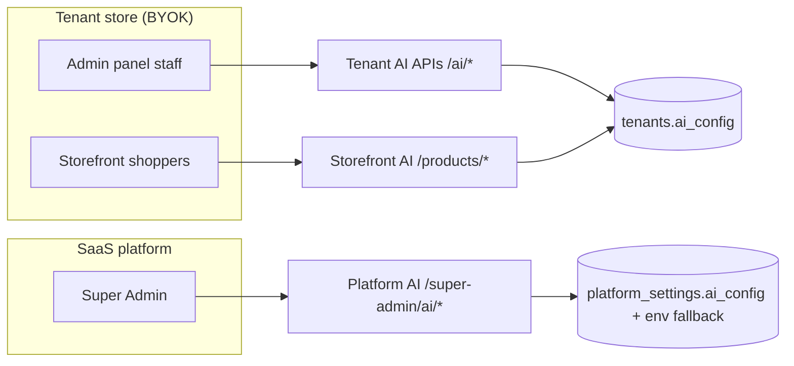
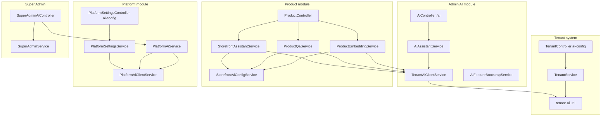
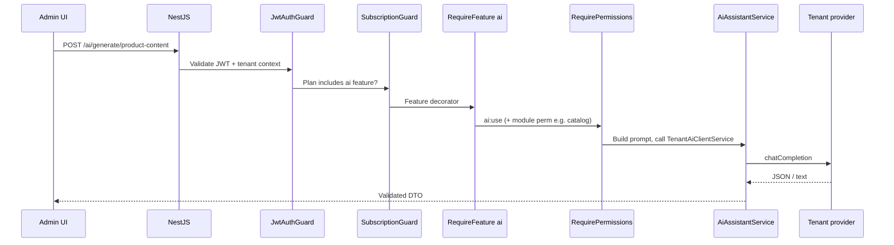
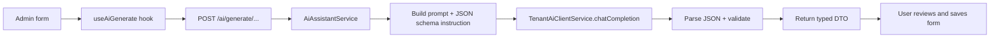
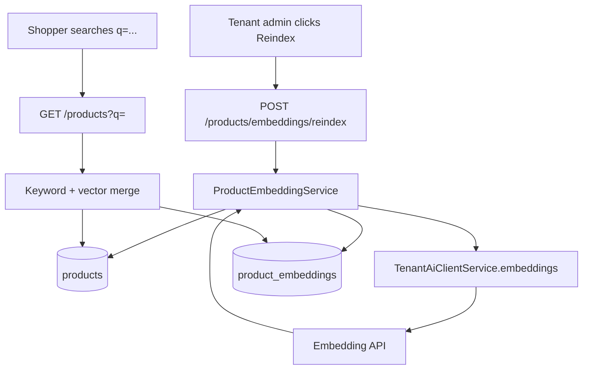
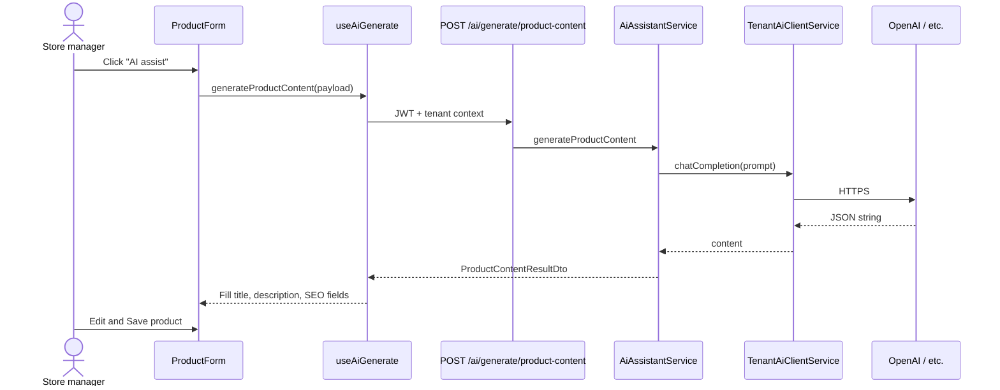
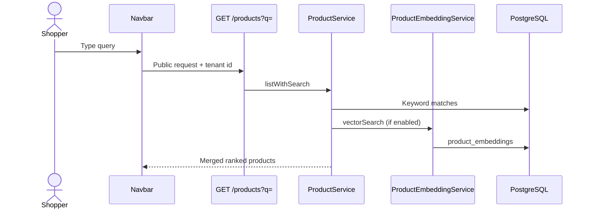
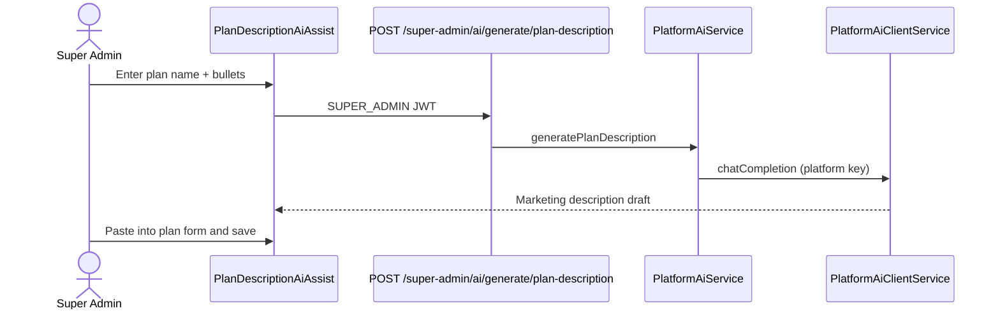

# AI System Guide — A to Z

**Document version:** 1.0.0  
**Audience:** Product owners, tenant admins, Super Admins, backend and frontend developers  
**Last updated:** June 2026  
**Scope:** The entire AI stack — tenant admin assists, storefront AI, platform AI, embeddings, and access control

**Companion docs:**

- [AI Feature Opportunity Analysis](ai_feature_opportunity_analysis.md) — roadmap, module inventory, what to build next  
- [Storefront AI Guide](../manuals/12_STOREFRONT_AI_GUIDE.md) — customer-facing search, Q&A, shopping assistant (deep dive)

---

## Table of contents

1. [Executive summary](#1-executive-summary)
2. [Three AI layers](#2-three-ai-layers)
3. [Architecture overview](#3-architecture-overview)
4. [Configuration A to Z](#4-configuration-a-to-z)
5. [Access control and gating](#5-access-control-and-gating)
6. [Tenant admin AI (staff)](#6-tenant-admin-ai-staff)
7. [Storefront AI (shoppers)](#7-storefront-ai-shoppers)
8. [Platform AI (Super Admin)](#8-platform-ai-super-admin)
9. [Embeddings and semantic search](#9-embeddings-and-semantic-search)
10. [Frontend integration patterns](#10-frontend-integration-patterns)
11. [Provider support](#11-provider-support)
12. [Guardrails and safety](#12-guardrails-and-safety)
13. [End-to-end request flows](#13-end-to-end-request-flows)
14. [File map](#14-file-map)
15. [Troubleshooting](#15-troubleshooting)
16. [Related documents](#16-related-documents)

---

## 1. Executive summary

This platform treats AI as a **draft-and-approve productivity layer** on top of a deterministic ERP core. AI suggests text; humans approve changes. AI never posts journals, changes stock, processes payments, or completes checkout.

### Core design decisions

| Principle | What it means |
|-----------|----------------|
| **BYOK (Bring Your Own Key)** | Each **tenant store** connects its own LLM provider. Usage and billing stay with the tenant. |
| **Separate platform AI** | **Super Admin** SaaS operations (plan marketing copy, tenant health narratives) use **platform** credentials — not tenant keys. |
| **Plan gate** | Subscription plans must include the `ai` feature (`@RequireFeature('ai')`). |
| **Permission gate** | Staff need `ai:use` to generate; `ai:manage` + `settings:manage` to edit AI config. |
| **Structured outputs** | Most admin endpoints ask the model for **JSON** with fixed shapes; services validate and map to DTOs. |
| **No shared hosted LLM** | The platform does not run a central model for tenants. |

### Who uses what



---

## 2. Three AI layers

The codebase implements **three independent AI surfaces**. They share provider types and HTTP client patterns but **do not share API keys or config storage**.

| Layer | Config stored in | Who configures | Primary routes | Typical use |
|-------|------------------|----------------|----------------|-------------|
| **Tenant admin AI** | `tenants.ai_config` JSONB | Tenant owner → Settings → AI | `GET/PATCH /tenants/ai-config`, `POST /ai/*` | Product copy, order emails, support drafts, dashboard copilot |
| **Storefront AI** | Same JSONB + `storefront` toggles | Tenant owner → Settings → AI → Storefront | Public `GET/POST /products/storefront-ai/*`, hybrid `GET /products?q=` | Semantic search, product Q&A, shopping assistant |
| **Platform AI** | `platform_settings.ai_config` JSONB (+ `PLATFORM_AI_*` env fallback) | Super Admin → Platform Settings → AI | `GET/PATCH /platform/settings/ai-config`, `POST /super-admin/ai/*` | Plan descriptions, tenant health narrative |

### Mental model

Think of AI as **three pipes**:

1. **Staff pipe** — authenticated JWT, subscription + permissions, ~40 specialized generate endpoints.  
2. **Shopper pipe** — public catalog routes, tenant resolved by domain/`x-tenant-id`, feature toggles in `ai_config.storefront`.  
3. **Platform pipe** — Super Admin role only, aggregate SaaS metrics, never tenant PII in bulk exports to the model beyond what the narrative endpoint explicitly sends.

---

## 3. Architecture overview

### 3.1 Server-side module layout



### 3.2 Data storage

| Table / column | Contents |
|----------------|----------|
| `tenants.ai_config` | Provider, API key, models, temperature, `storefront` toggles |
| `platform_settings.ai_config` | Platform provider credentials (Super Admin only) |
| `product_embeddings` | Per-tenant vector rows: `product_id`, `embedding`, `embedding_model`, `content_hash` |

API keys are **masked** in GET responses (`hasApiKey`, partial mask). PATCH can omit `apiKey` to keep the existing secret.

---

## 4. Configuration A to Z

### 4.1 Tenant admin — enable AI for a store

**Path:** Admin → **Settings → AI**  
**API:** `GET/PATCH /tenants/ai-config`, `POST /tenants/ai-config/test`  
**Guards:** JWT + subscription feature `settings` + permission `settings:manage`

**Steps:**

1. Confirm the subscription plan includes **`ai`** (automatically backfilled on server bootstrap for existing plans).
2. Open **Settings → AI**.
3. Turn **Enable AI** on.
4. Choose a **provider preset** (OpenAI, OpenRouter, Anthropic, Google, Azure OpenAI, or Custom).
5. Paste **API key**, set **default chat model** (and **embedding model** if using semantic search).
6. Optionally tune `maxTokens`, `temperature`, `baseUrl`, Azure `apiVersion`.
7. Click **Test connection** — hits `POST /tenants/ai-config/test`.
8. Under **Storefront AI**, toggle shopping assistant, product Q&A, and semantic search independently.
9. If semantic search is on, run **Reindex embeddings** from catalog settings (admin) so vectors exist.

**Configured** means: `enabled === true` AND API key present AND `defaultModel` set. The UI and `GET /ai/status` expose `configured: boolean`.

### 4.2 Platform — enable AI for Super Admin

**Path:** Super Admin → **Platform Settings → AI** tab (`?tab=ai`)  
**API:** `GET/PATCH /platform/settings/ai-config`, `POST /platform/settings/ai-config/test`

**Resolution order:**

1. Database `platform_settings.ai_config` (preferred).  
2. Environment fallback: `PLATFORM_AI_API_KEY`, `PLATFORM_AI_BASE_URL`, `PLATFORM_AI_MODEL`.

Public `GET /platform/settings` **strips** `aiConfig` so credentials never leak to tenants.

### 4.3 Config shape (tenant)

Defined in `server/src/common/types/tenant-ai-config.types.ts`:

```typescript
interface TenantAiConfig {
  enabled: boolean
  provider: 'openai' | 'openrouter' | 'anthropic' | 'azure_openai' | 'google' | 'custom'
  apiKey?: string
  baseUrl?: string
  defaultModel?: string
  embeddingModel?: string
  apiVersion?: string        // Azure
  maxTokens?: number
  temperature?: number
  storefront?: {
    shoppingAssistantEnabled?: boolean
    productQaEnabled?: boolean
    semanticSearchEnabled?: boolean
  }
}
```

Storefront toggles default to **enabled** when omitted (`normalizeStorefrontAiConfig` treats `false` as the only explicit off).

---

## 5. Access control and gating

### 5.1 Subscription feature

```typescript
@RequireFeature('ai')  // on AiController and embedding admin routes
```

`AiFeatureBootstrapService` (runs on app start):

- Adds `"ai"` to all subscription plans missing it.  
- Backfills `ai:use` and `ai:manage` permissions to system roles, Branch Manager, and roles that already have `settings:manage` or `marketing:manage`.

### 5.2 Permissions

| Code | Purpose |
|------|---------|
| `ai:use` | Call `/ai/*` generate endpoints, embeddings reindex (with catalog perms) |
| `ai:manage` | Reserved for future fine-grained AI admin; seeded alongside `ai:use` |
| `settings:manage` | Required to read/update `/tenants/ai-config` |

### 5.3 Guard chain (typical admin AI request)



### 5.4 Storefront vs admin

| Surface | Auth | Feature gate |
|---------|------|--------------|
| Admin `/ai/*` | JWT required | `ai` feature + `ai:use` |
| Admin embeddings | JWT | `ai` + `ai:use` + catalog read/write |
| Storefront AI | Public (tenant from host/header) | Tenant AI enabled + storefront toggle + provider ready |
| Super Admin AI | JWT + `SUPER_ADMIN` role | Platform AI configured |

---

## 6. Tenant admin AI (staff)

### 6.1 Entry points

| UI surface | Route / hook | Backend |
|------------|--------------|---------|
| **AI Studio** | `/admin/ai` — chat, product lab, campaign lab | `POST /ai/chat`, `generate/product-content`, `generate/campaign-copy` |
| **Inline assist buttons** | Scattered admin forms (`AiInlineBar`, `*AiAssist*` components) | Matching `POST /ai/generate/*` |
| **Dashboard copilot** | Reports dashboard | `POST /ai/copilot/dashboard` (needs `reports:read`) |

### 6.2 Service architecture

1. **`AiController`** — HTTP layer, permissions per endpoint.  
2. **`AiAssistantService`** — Builds prompts, parses JSON, applies domain-specific instructions. One method per generate use case (~40).  
3. **`TenantAiClientService`** — Loads tenant config, switches on provider, executes HTTP to OpenAI-compatible / Anthropic / Google / Azure APIs. Supports optional vision via image URL on last user message.

**Status check:**

```
GET /ai/status → { enabled, configured, provider, defaultModel, hasApiKey }
```

### 6.3 Generate endpoints (catalog)

All under `@Controller('ai')`, require `@RequireFeature('ai')` and `@RequirePermissions(AI_USE)` unless noted.

| Endpoint | Domain | Extra permission |
|----------|--------|------------------|
| `POST /ai/chat` | General assistant | — |
| `POST /ai/copilot/dashboard` | KPI-aware copilot | `reports:read` |
| `POST /ai/generate/product-content` | Catalog | — |
| `POST /ai/generate/catalog-content` | Categories/brands | — |
| `POST /ai/generate/campaign-copy` | Marketing | — |
| `POST /ai/generate/faq` | FAQs | — |
| `POST /ai/generate/page-seo` | Page builder SEO | — |
| `POST /ai/generate/store-seo` | Store settings SEO | — |
| `POST /ai/generate/page-block-content` | Page blocks | `content:manage` |
| `POST /ai/generate/marketing-description` | Coupons/promotions | — |
| `POST /ai/generate/loyalty-copy` | Loyalty | — |
| `POST /ai/generate/lead-follow-up` | CRM leads | — |
| `POST /ai/generate/order-assist` | Orders | `orders:read` |
| `POST /ai/generate/return-assist` | Returns | `returns:read` |
| `POST /ai/generate/support-reply` | Live chat | — |
| `POST /ai/generate/customer-profile` | CRM | `crm:read` |
| `POST /ai/generate/review-assist` | Reviews | `catalog:read` |
| `POST /ai/generate/abandoned-cart-message` | Carts | `orders:read` |
| `POST /ai/generate/price-book-rationale` | Pricing | `catalog:read` |
| `POST /ai/generate/media-assist` | Media library | `content:manage` |
| `POST /ai/generate/inventory-anomaly` | Inventory | `inventory:read` |
| `POST /ai/generate/stock-transfer-reason` | Transfers | `inventory:read` |
| `POST /ai/generate/cycle-count-variance` | Cycle count | `inventory:read` |
| `POST /ai/generate/packing-slip-notes` | Fulfillment | `fulfillment:manage` |
| `POST /ai/generate/batch-waste-reduction` | Batches | `inventory:read` |
| `POST /ai/generate/requisition-justification` | Procurement | `purchasing:read` |
| `POST /ai/generate/po-cover-letter` | POs | `purchasing:write` |
| `POST /ai/generate/grn-discrepancy-notes` | GRN | `purchasing:read` |
| `POST /ai/generate/invoice-ocr` | AP invoices | `purchasing:read` |
| `POST /ai/generate/debit-note-dispute` | Debit notes | `purchasing:read` |
| `POST /ai/generate/supplier-profile-summary` | Suppliers | `supplier:manage` |
| `POST /ai/generate/ar-collection-draft` | AR | `accounting:read` |
| `POST /ai/generate/ap-payment-reminder` | AP | `accounting:read` |
| `POST /ai/generate/expense-category` | Expenses | — |
| `POST /ai/generate/report-executive-summary` | Reports | — |
| `POST /ai/generate/tax-rule-explanation` | Tax | — |
| `POST /ai/generate/recruitment-job-copy` | HRM | — |
| `POST /ai/generate/performance-review-phrases` | HRM | — |
| `POST /ai/generate/payslip-explanation` | Payroll | — |

### 6.4 Typical generate flow (implementation pattern)



Adding a new assist:

1. Add DTO + result type in `server/src/modules/admin/ai/dto/`.  
2. Add method on `AiAssistantService` (prompt + JSON parse).  
3. Add route on `AiController` with correct `@RequirePermissions`.  
4. Add caller in `useAiGenerate.ts` and a small UI component (often modal or `AiInlineBar`).

---

## 7. Storefront AI (shoppers)

Customer-facing AI lives in the **Product module**, not `AiController`. It reuses **`TenantAiClientService`** for LLM and embedding calls but gates on **`storefront`** toggles via **`StorefrontAiConfigService`**.

| Feature | Public API | Service |
|---------|------------|---------|
| Status | `GET /products/storefront-ai/status` | Aggregates config + embedding counts |
| Shopping assistant | `POST /products/storefront-ai/chat` | `StorefrontAssistantService` (catalog + FAQ RAG) |
| Product Q&A | `POST /products/slug/:slug/ask` | `ProductQaService` |
| Semantic search | `GET /products?q=` (hybrid) | `ProductService` + `ProductEmbeddingService` |

**Full documentation:** [Storefront AI Guide](../manuals/12_STOREFRONT_AI_GUIDE.md)

---

## 8. Platform AI (Super Admin)

Platform AI powers **SaaS operator** workflows only. It never reads `tenants.ai_config`.

### 8.1 Configuration

- **UI:** `PlatformSetting.tsx` → AI tab → `PlatformAiSetting.tsx`  
- **API:** `GET/PATCH /platform/settings/ai-config`, test POST  
- **Client:** `PlatformAiClientService` → `PlatformAiService`

### 8.2 Features

| Feature | API | UI |
|---------|-----|-----|
| Status | `GET /super-admin/ai/status` | Platform AI settings banner |
| Plan marketing copy | `POST /super-admin/ai/generate/plan-description` | `PlanDescriptionAiAssist` in `PlanForm` |
| Tenant health snapshot | `GET /super-admin/ai/tenant-health/snapshot?days=30` | `TenantHealthAiPanel` |
| Churn narrative | `POST /super-admin/ai/generate/tenant-health-narrative` | Same panel — aggregate metrics only |

Tenant health narrative receives **aggregated** counts (active/suspended tenants, signups, churn signals) — not individual customer records.

---

## 9. Embeddings and semantic search

### 9.1 Purpose

Convert product title + description + category into vectors stored in `product_embeddings`. At search time, combine:

- **Keyword** — existing SQL `ILIKE` / full-text style listing.  
- **Vector** — cosine similarity on query embedding vs product rows.

Controlled by `storefront.semanticSearchEnabled` and requires `embeddingModel` on tenant config.

### 9.2 Admin operations

| Action | API |
|--------|-----|
| Index status | `GET /products/embeddings/status` |
| Full reindex | `POST /products/embeddings/reindex` |

Reindex walks published products in batches, skips unchanged content via `content_hash`, upserts embeddings. Failures log per batch; partial index is possible.

### 9.3 Pipeline diagram



---

## 10. Frontend integration patterns

### 10.1 Shared hooks

| Hook | Purpose |
|------|---------|
| `useAiConfig` | Load/patch tenant AI + storefront toggles (Settings page) |
| `useAiGenerate` | Central POST wrappers + `configured` state from `/ai/status` |
| `useAiStudio` | AI Studio chat + labs |
| `usePlatformAi` | Super Admin platform generate calls |

### 10.2 UI components

| Component | Role |
|-----------|------|
| `AiSetting.tsx` | Full tenant AI + storefront config form |
| `AiStudio.tsx` | Dedicated AI workspace |
| `AiInlineBar` / `DescriptionAiButton` | Reusable “Generate with AI” affordance |
| `*AiAssist*.tsx` | Domain-specific modals/panels (~50 files) |
| `PlatformAiSetting.tsx` | Platform credentials |
| Storefront widgets | `ShoppingAssistant`, product Q&A — under `client/features/product/shop/` |

### 10.3 Disabled state pattern

Most assists call `useAiGenerate().checkStatus()` on mount. If `configured === false`, show a link to **Settings → AI** instead of calling the API. This avoids opaque 503 errors when BYOK is incomplete.

---

## 11. Provider support

`TenantAiClientService` routes by `config.provider`:

| Provider | Chat | Embeddings | Notes |
|----------|------|------------|-------|
| OpenAI | ✅ | ✅ | Default preset |
| OpenRouter | ✅ | ✅ | OpenAI-compatible base URL |
| Anthropic | ✅ | ❌ | Messages API format |
| Google Gemini | ✅ | ✅ | Generative Language API |
| Azure OpenAI | ✅ | ✅ | Deployment URL + `apiVersion` |
| Custom | ✅ | ✅* | OpenAI-compatible if URL supports it |

Platform AI currently uses **OpenAI-compatible** HTTP (`PlatformAiClientService`).

Presets and default models live in `AI_PROVIDER_PRESETS` (`tenant-ai-config.types.ts`).

---

## 12. Guardrails and safety

### AI must never (by design)

- Execute financial transactions or post GL journals  
- Change inventory quantities or prices  
- Approve orders, returns, or payroll  
- Complete checkout or modify carts server-side  
- Expose raw API keys in API responses or public settings  

### Prompt-level rules

- System prompts instruct models **not to invent** orders, stock, or revenue (dashboard copilot receives real KPI snapshot instead).  
- Storefront assistant explicitly avoids checkout actions.  
- Product Q&A grounds answers in product fields + policies loaded server-side.  
- Generate endpoints request **JSON-only** responses to reduce free-form hallucination in forms.

### Operational notes

- Rate limiting can be applied on test endpoints (throttle decorators exist but may be commented).  
- Token usage is returned to the client for transparency (`totalTokens`).  
- No persistent chat log storage for AI Studio in Phase A/B — history is client-session only.

---

## 13. End-to-end request flows

### 13.1 Staff generates product description



### 13.2 Shopper uses semantic search



### 13.3 Super Admin plan description



---

## 14. File map

### Server — core

| Path | Role |
|------|------|
| `server/src/modules/admin/ai/` | Admin AI module (controller, assistant, client, bootstrap) |
| `server/src/modules/admin/ai/controllers/ai.controller.ts` | All `/ai/*` routes |
| `server/src/modules/admin/ai/services/ai-assistant.service.ts` | Prompt + parse logic |
| `server/src/modules/admin/ai/services/tenant-ai-client.service.ts` | Multi-provider HTTP client |
| `server/src/modules/admin/ai/services/ai-feature-bootstrap.service.ts` | Plan + permission backfill |
| `server/src/common/types/tenant-ai-config.types.ts` | Types + provider presets |
| `server/src/modules/system/tenant/` | Tenant AI config CRUD |
| `server/src/modules/system/tenant/utils/tenant-ai.util.ts` | Normalize, merge, mask keys |

### Server — storefront & embeddings

| Path | Role |
|------|------|
| `server/src/modules/admin/catalog/product/services/product-embedding.service.ts` | Index + vector search |
| `server/src/modules/admin/catalog/product/services/product-qa.service.ts` | PDP Q&A |
| `server/src/modules/admin/catalog/product/services/storefront-assistant.service.ts` | Floating assistant |
| `server/src/modules/admin/catalog/product/services/storefront-ai-config.service.ts` | Storefront gate helper |
| `server/src/common/utils/storefront-ai-config.util.ts` | Toggle normalization |
| `server/src/modules/admin/catalog/product/entities/product-embedding.entity.ts` | ORM entity |

### Server — platform

| Path | Role |
|------|------|
| `server/src/modules/system/platform/services/platform-ai-client.service.ts` | Platform LLM client |
| `server/src/modules/system/platform/services/platform-ai.service.ts` | Plan copy + health narrative |
| `server/src/modules/system/platform/utils/platform-ai.util.ts` | Normalize + env fallback |
| `server/src/modules/system/super-admin/controllers/super-admin-ai.controller.ts` | Super Admin AI routes |

### Client

| Path | Role |
|------|------|
| `client/features/admin/setting/components/AiSetting.tsx` | Tenant AI settings |
| `client/features/admin/ai/` | Studio, hooks, shared components |
| `client/features/admin/ai/hooks/useAiGenerate.ts` | Generate API facade |
| `client/features/system/components/PlatformAiSetting.tsx` | Platform AI settings |
| `client/features/system/components/PlanDescriptionAiAssist.tsx` | Plan copy assist |
| `client/features/system/components/dashboard/TenantHealthAiPanel.tsx` | Health narrative |
| `client/features/product/shop/` | Storefront AI widgets |

### Migrations (representative)

| Migration | Change |
|-----------|--------|
| `1781310000000-AddTenantAiConfig.ts` | `tenants.ai_config` column |
| `1781320000000-EnableAiPlanFeature.ts` | `ai` feature + permissions |
| `1781380000000-AddProductEmbeddings.ts` | `product_embeddings` table |
| `1781390000000-AddPlatformAiConfig.ts` | `platform_settings.ai_config` |

---

## 15. Troubleshooting

| Symptom | Likely cause | Fix |
|---------|--------------|-----|
| All AI buttons disabled | `configured: false` | Enable AI, add API key + default model, test connection |
| 403 on `/ai/*` | Plan missing `ai` or no `ai:use` | Upgrade plan; assign role permissions |
| 503 "AI is not configured" | `enabled` false or empty key | Settings → AI |
| Storefront widgets hidden | Storefront toggles off | Settings → AI → Storefront section |
| Semantic search feels like keyword only | No embeddings | Run reindex; confirm `embeddingModel` set |
| Reindex fails | Provider lacks embeddings | Use OpenAI/OpenRouter/Google preset embedding model |
| Platform assist unavailable | No platform config | Platform Settings → AI or set `PLATFORM_AI_*` env |
| Anthropic + semantic search | Anthropic has no embeddings API | Use OpenAI/OpenRouter for embedding model or provider |
| Local dev storefront 404 | Missing tenant context | Set `x-tenant-id` / store tenant id cache (see storefront guide) |

---

## 16. Related documents

| Document | Contents |
|----------|----------|
| [ai_feature_opportunity_analysis.md](ai_feature_opportunity_analysis.md) | Roadmap, module-by-module opportunities |
| [12_STOREFRONT_AI_GUIDE.md](../manuals/12_STOREFRONT_AI_GUIDE.md) | Storefront-only deep dive |
| [erp_master_system_design.md](erp_master_system_design.md) | Phase 7 — AI as extension layer |
| [07_auth_and_rbac.md](../codebase-understanding/07_auth_and_rbac.md) | Guard chain details |
| [subscription_plan_entitlements.md](subscription_plan_entitlements.md) | Feature gating matrix |

---

*This guide reflects the codebase as of June 2026. When adding new AI endpoints, update Section 6.3 and the file map.*
