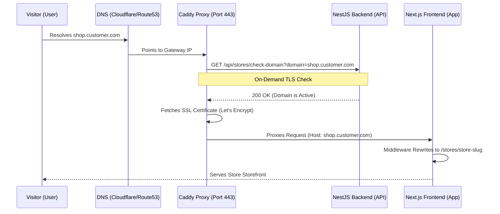
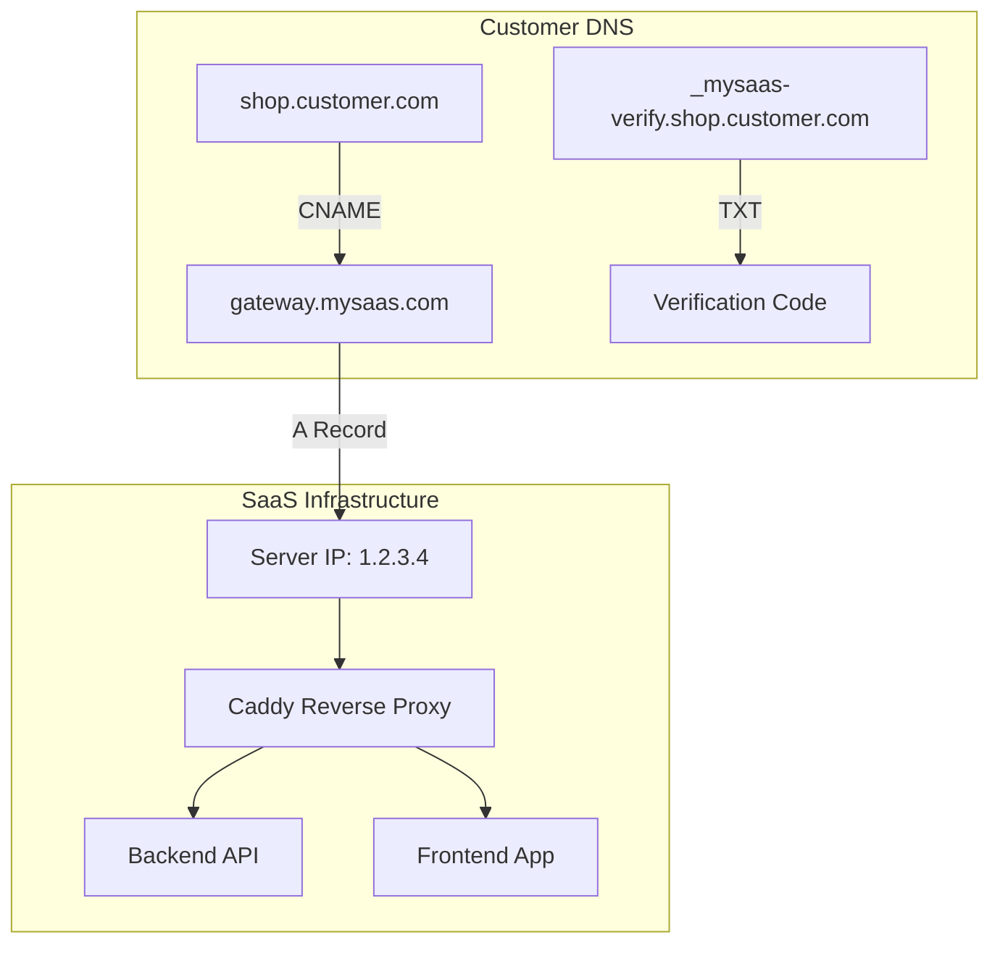

# Multi-Store Custom Domain & Subdomain Implementation

As a senior engineer, implementing custom domains and subdomains requires a mix of infrastructure configuration, DNS management, and application-level routing. Below is the architectural breakdown and implementation guide.

## 1. Core Architecture

The goal is to route requests from different hostnames to a single application instance, where the store is identified dynamically.

### 1.1 Architecture Visualization



### 1.2 DNS Setup Relationship




### Subdomains vs. Custom Domains
- **Subdomains** (`store1.mysaas.com`): Easier to set up. We control the main domain DNS. We typically use a wildcard CNAME (`*.mysaas.com`) pointing to our server.
- **Custom Domains** (`shop.customer.com`): Harder to set up. The customer controls the DNS. They must point a CNAME to our "Gateway" domain.

### The "Gateway" Strategy
Do not ask customers to point to your IP address directly (A Record). If your IP changes, all their domains break.
Instead, use a **Gateway Domain**:
- User sets: `CNAME shop.customer.com` -> `gateway.mysaas.com`
- You set: `A gateway.mysaas.com` -> `1.2.3.4` (Your Server IP)

---

## 2. Infrastructure: The Reverse Proxy (Caddy)

For a SaaS, you need **On-Demand TLS**. Manually running Certbot for every customer domain is not scalable and will hit rate limits.

### Caddy Configuration (Recommended)
Caddy handles SSL termination and automatically fetches certificates for any domain that hits it, *provided* you verify it belongs to a store.

```caddyfile
# Caddyfile
{
    on_demand_tls {
        # Ask our backend if this domain is allowed before getting a cert
        ask http://localhost:4000/api/stores/check-domain
        interval 2m
        burst 5
    }
}

:443 {
    tls {
        on_demand
    }

    # Pass the actual host to our application
    reverse_proxy localhost:3000 {
        header_up Host {host}
        header_up X-Real-IP {remote_host}
    }
}
```

---

## 3. Real-World Implementation (Code Examples)

### A. Backend: Domain Verification Logic (NestJS)
When a user adds a domain, you MUST verify ownership via a TXT record to prevent "Domain Takeover".

```typescript
// store.service.ts
import { resolveTxt } from 'dns/promises';

async verifyDomainOwnership(domain: string, expectedToken: string): Promise<boolean> {
  try {
    // We look for a TXT record like: _mysaas-verify.shop.customer.com
    const records = await resolveTxt(`_mysaas-verify.${domain}`);
    const tokenFound = records.flat().includes(expectedToken);
    
    if (tokenFound) {
      // Update store status to ACTIVE in DB
      return true;
    }
    return false;
  } catch (error) {
    this.logger.error(`DNS Verification failed for ${domain}`, error);
    return false;
  }
}
```

### B. Backend: Caddy Permission Check
```typescript
// store.controller.ts
@Get('check-domain')
async checkDomain(@Query('domain') domain: string) {
  const store = await this.storeService.findByCustomDomain(domain);
  if (store && store.customDomainStatus === 'ACTIVE') {
    return { status: 200 }; // Caddy will issue SSL
  }
  throw new ForbiddenException(); // Caddy will refuse SSL
}
```

### C. Application Middleware (Next.js)
This handles internal routing. If someone visits `shop.customer.com`, we rewrite them to the store's store page.

```typescript
// middleware.ts
import { NextResponse } from 'next/server';

export function middleware(req) {
  const url = req.nextUrl;
  const hostname = req.headers.get('host');

  // 1. Skip internal routes and APIs
  if (url.pathname.startsWith('/_next') || url.pathname.startsWith('/api')) {
    return NextResponse.next();
  }

  // 2. Resolve Store
  // For subdomains: store1.mysaas.com
  // For custom domains: shop.customer.com
  const isCustom = !hostname.endsWith('mysaas.com');
  const storeSlug = isCustom ? hostname : hostname.split('.')[0];

  // 3. Rewrite Path
  // Internally serve /stores/[slug]/...
  return NextResponse.rewrite(new URL(`/stores/${storeSlug}${url.pathname}`, req.url));
}
```

---

## 4. Real-World Workflow (Steps for User)

1.  **In SaaS Dashboard**:
    - User enters `shop.mybrand.com`.
    - System generates a verification token: `mysaas-v=8f3j...`.
2.  **In User's DNS Provider (e.g., GoDaddy/Cloudflare)**:
    - User adds **TXT** record: `_mysaas-verify` -> `mysaas-v=8f3j...`.
    - User adds **CNAME** record: `shop` -> `gateway.mysaas.com`.
3.  **Verification**:
    - User clicks "Verify" in your app.
    - Your backend checks the TXT record. If valid, set status to `ACTIVE`.
4.  **Live**:
    - Visitor visits `shop.mybrand.com`.
    - Caddy sees the request, asks your API "Is this domain active?", API says "Yes".
    - Caddy gets SSL, proxies to Next.js.
    - Next.js Middleware sees `Host: shop.mybrand.com`, rewrites to the store's store.

## 5. Security Considerations
- **Rate Limiting**: Limit DNS checks to prevent abuse.
- **Reserved Subdomains**: Do not let users register `admin`, `api`, `support`, `www`, etc.
- **SSL Limits**: Caddy handles this, but be aware of Let's Encrypt rate limits for new registrations per week.
