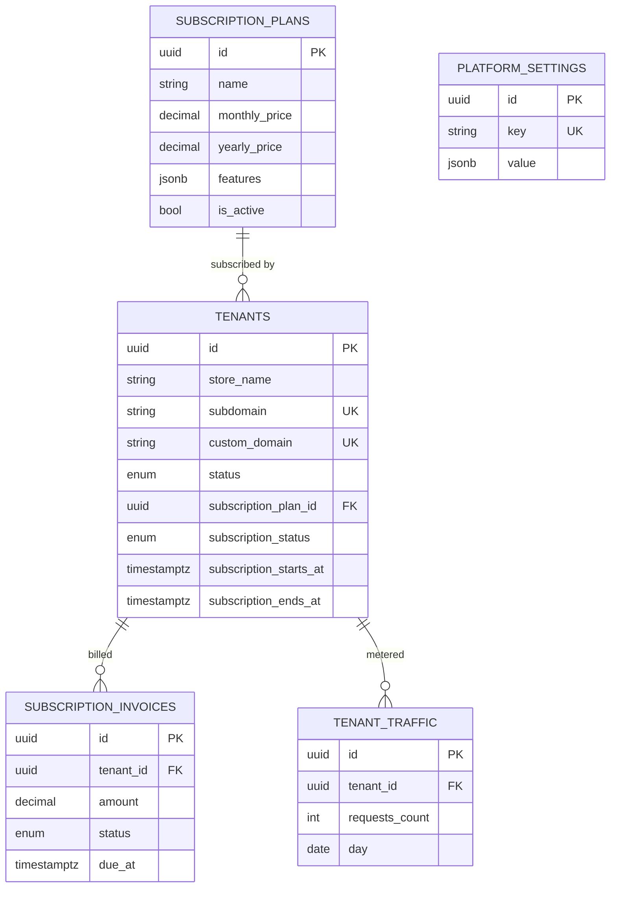
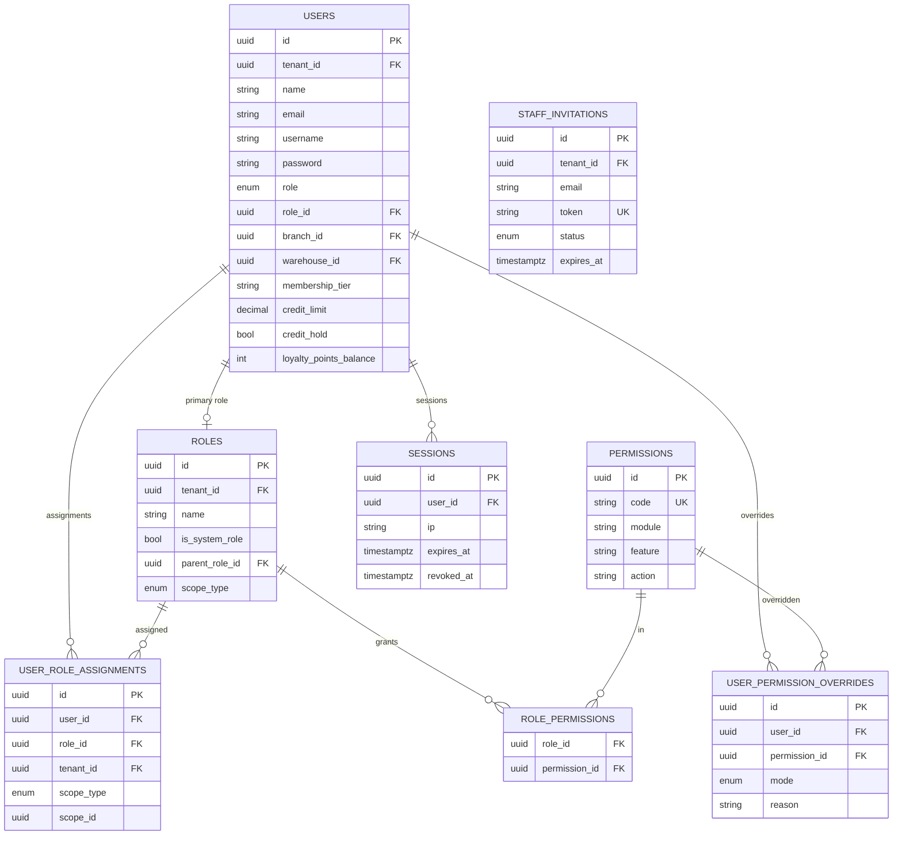
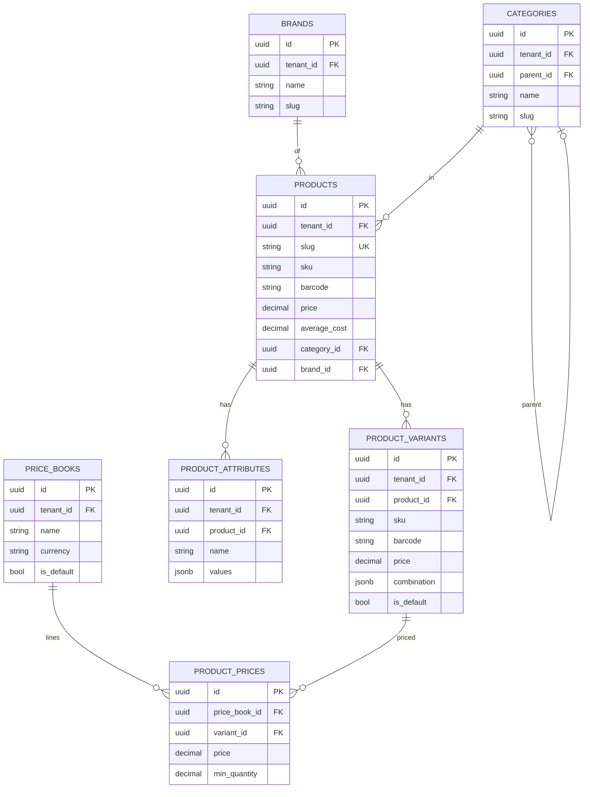
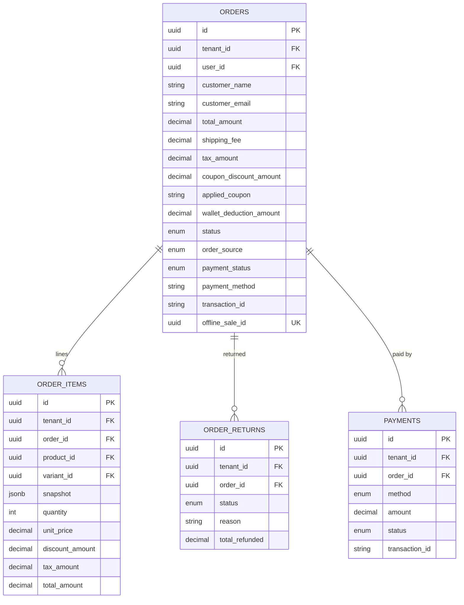
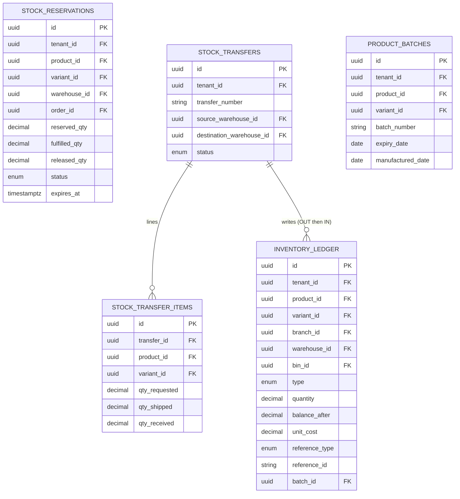
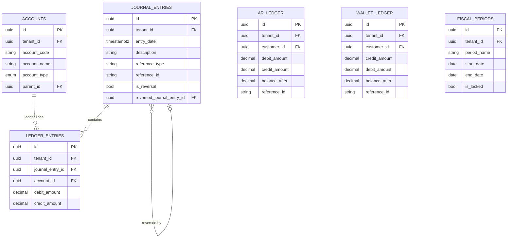

# Database Design & Entity Relationship Diagrams (ERD)

This document contains the unified Master ERD and per-domain database diagrams for the Enterprise Multi-Tenant SaaS ERP. Use these diagrams to trace table relations, foreign keys, and indices during manual QA database audits.

---

## 1. Master ERD (Cross-Domain Relationships)

This bird's-eye view shows how the major business aggregates link together across tenant boundaries.

```mermaid
erDiagram
  TENANTS ||--o{ BRANCHES                : "owns"
  TENANTS ||--o{ WAREHOUSES             : "owns"
  TENANTS ||--o{ USERS                  : "owns"
  TENANTS ||--o{ ROLES                  : "owns"
  TENANTS ||--o{ PRODUCTS               : "owns"
  TENANTS ||--o{ SUPPLIERS              : "owns"
  TENANTS ||--o{ ORDERS                 : "owns"
  TENANTS ||--o{ ACCOUNTS               : "owns"
  TENANTS ||--o{ EMPLOYEES              : "owns"
  TENANTS ||--o{ AUDIT_LOGS             : "owns"

  BRANCHES ||--o{ WAREHOUSES             : "hosts"
  WAREHOUSES ||--o{ WAREHOUSE_BINS      : "contains"

  USERS }o--o| ROLES                    : "primary role"
  USERS ||--o{ USER_ROLE_ASSIGNMENTS    : "has"
  USERS ||--o{ USER_PERMISSION_OVERRIDES : "has"
  ROLES ||--o{ ROLE_PERMISSIONS         : "grants"
  PERMISSIONS ||--o{ ROLE_PERMISSIONS   : "maps"
  USERS ||--o| EMPLOYEES                : "if staff"

  PRODUCTS ||--o{ PRODUCT_VARIANTS      : "has"
  PRODUCT_VARIANTS ||--o{ INVENTORY_LEDGER : "movements"
  PRODUCT_VARIANTS ||--o{ STOCK_RESERVATIONS : "locks"
  PRODUCT_VARIANTS ||--o{ PRODUCT_BATCHES : "lots"

  ORDERS ||--o{ ORDER_ITEMS             : "lines"
  ORDERS ||--o{ PAYMENTS                 : "split tender"
  ORDERS ||--o{ ORDER_RETURNS           : "returns"
  ORDERS }o--o| USERS                   : "customer"

  SUPPLIERS ||--o{ PURCHASE_ORDERS      : "receives"
  SUPPLIERS ||--o{ SUPPLIER_INVOICES     : "bills"
  PURCHASE_ORDERS ||--o{ PURCHASE_ORDER_ITEMS : "lines"
  PURCHASE_ORDERS ||--o{ GOODS_RECEIVED_NOTES : "received via"
  GOODS_RECEIVED_NOTES ||--o{ GRN_ITEMS : "lines"
  GOODS_RECEIVED_NOTES ||--o{ INVENTORY_LEDGER : "adds stock"

  ACCOUNTS ||--o{ LEDGER_ENTRIES         : "ledger lines"
  JOURNAL_ENTRIES ||--o{ LEDGER_ENTRIES   : "contains"
  JOURNAL_ENTRIES }o--o| JOURNAL_ENTRIES  : "reversed by"

  USERS ||--o{ WALLET_LEDGER           : "balances"
  USERS ||--o{ LOYALTY_LEDGER          : "points"
  USERS ||--o{ AR_LEDGER               : "owes"

  EMPLOYEES ||--o{ ATTENDANCE_EVENTS    : "raw punches"
  EMPLOYEES ||--o{ LEAVE_REQUESTS       : "applies"
  EMPLOYEES ||--o{ PAYROLL_SLIPS        : "slips"
  PAYROLL_BATCHES ||--o{ PAYROLL_SLIPS   : "contains"

  POS_REGISTERS ||--o{ POS_SHIFTS       : "tracks"
  POS_SHIFTS ||--o{ POS_DRAWER_TRANSACTIONS : "cash flows"
```

---

## 2. Per-Domain Entity Relationship Diagrams

---

### 2.1 System & Tenant Schema
Manages new tenant provisioning, custom domain configurations, and SaaS subscription billing schedules.

---

### 2.2 Identity & Role-Based Access Control (RBAC)
Governs authentication, active sessions, and multi-tenant user permission structures.

---

### 2.3 Catalog & Pricing
Defines variant-level configurations, pricing rules across price books, and brand categorization.

---

### 2.4 Sales: Orders, Returns & Payments
Captures customer sales transactions, POS split payment details, and returns processing.

---

### 2.5 Inventory & Warehouse Management System (WMS)
Tracks append-only physical inventory movements, bin structures, lot details, and stock reservations.

---

### 2.6 Finance & General Ledger
Implements GAAP compliant financial accounting entries, wallets, and Accounts Receivable (AR) ledgers.

