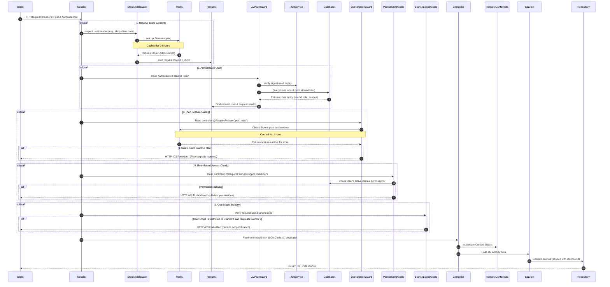
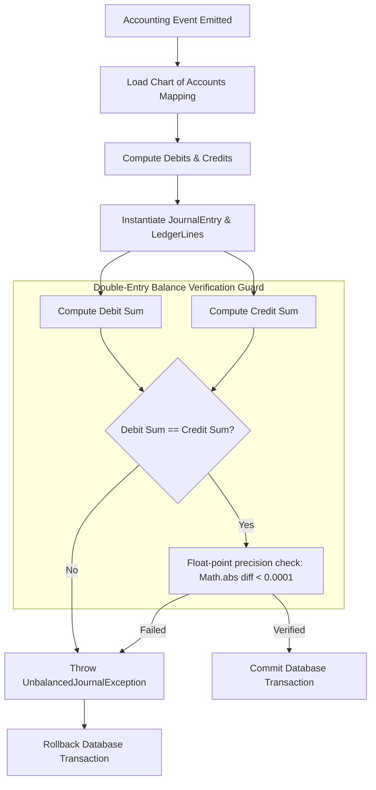
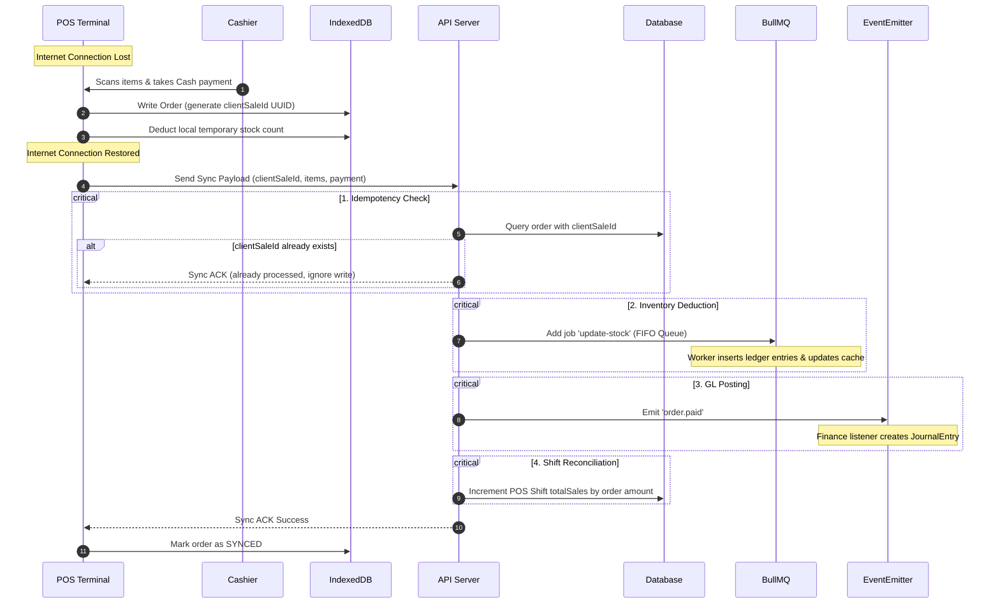

# Developer Architectural Onboarding & System Flow Map

**Document Version:** 1.0.0  
**Prepared By:** Senior Systems Architect & Principal Engineer  
**Scope:** Engineering onboarding, codebase layout, request lifecycles, and core transactional patterns.

---

## 1. System Architecture Map (Monolith Decoupling)

While this platform is a **monolith** in deployment (running as a single NestJS process and a single PostgreSQL database), it is architected as a **Modular Monolith** to prevent spaghetti code. All business modules are strictly isolated.

```
                          ┌──────────────────────────┐
                          │    Next.js Client App    │
                          └────────────┬─────────────┘
                                       │ HTTP Requests
                                       ▼
                          ┌──────────────────────────┐
                          │   NestJS API Gateway     │
                          │   - Subdomain Resolver   │
                          │   - JWT Auth & RBAC      │
                          │   - Plan Feature Gate    │
                          └────────────┬─────────────┘
                                       │
         ┌─────────────────────────────┼─────────────────────────────┐
         │ (Sync/Event Emitters)       │ (Sync/Event Emitters)       │ (Sync/Event Emitters)
         ▼                             ▼                             ▼
┌─────────────────┐           ┌─────────────────┐           ┌─────────────────┐
│ Catalog Module  │           │  Sales Module   │           │ Finance Module  │
│ - Products      │           │ - Orders        │           │ - General Ledger│
│ - Variants      │           │ - POS checkout  │           │ - Chart of Accts│
│ - Price Books   │           │ - Returns       │           │ - AP/AR balances│
└─────────────────┘           └────────┬────────┘           └─────────────────┘
                                       │
                                       │ Async Queue Job
                                       ▼
                          ┌──────────────────────────┐
                          │   BullMQ Queue Worker    │
                          │   - Stock Ledger updates │
                          │   - Journal Entry posts  │
                          └────────────┬─────────────┘
                                       │ Write / Update
                                       ▼
                          ┌──────────────────────────┐
                          │   PostgreSQL Database    │
                          │ (Logical Store Isolation│
                          │  via store_id columns)  │
                          └──────────────────────────┘
```

### 1.1 Decoupling Rules (Strictly Enforced)
1.  **No Cross-Module Database Joins:** A query in the `Sales` module must never join tables from the `HRM` or `Accounting` modules. Instead, retrieve IDs first or fetch data via intermediate service interfaces.
2.  **No Cross-Module Direct Writes:** The `Sales` module must never write directly to the `inventory_transactions` or `ledger_entries` tables. It must call `InventoryService` or emit a domain event.
3.  **Use Domain Events for Side Effects:** Operations that affect multiple domains (e.g., POS sale affecting inventory, finance, and customer wallet) must commit the sale record first, then emit an asynchronous event.

---

## 2. Server Codebase Directory Structure

New developers must structure their code according to this directory tree under `server/src/`:

```
server/src/
├── common/                               # Shareable code across all modules
│   ├── decorators/                       # Custom decorators (e.g. @GetContext, @RequirePermission)
│   ├── dto/                              # Global DTOs (e.g. RequestContextDto)
│   ├── enums/                            # Centralized system enums
│   └── guards/                           # Auth, Subscription, RBAC, and Scope guards
├── database/
│   ├── migrations/                       # TypeORM migrations (auto-generated & manual)
│   └── seeds/                            # Database seed scripts (plans, permission codes)
├── modules/
│   ├── admin/                            # Admin Backoffice operations (ERP core)
│   │   ├── operations/
│   │   │   ├── catalog/                  # Products, variants, categories
│   │   │   ├── finance/
│   │   │   │   ├── accounting/           # General ledger, COA, journals
│   │   │   │   └── asset/                # Fixed asset management
│   │   │   ├── hrm/                      # Employees, attendance, payroll
│   │   │   └── procurement/              # Suppliers, POs, GRNs, 3-way match
│   │   └── sales/
│   │       ├── orders/                   # Sales orders, coupons, returns
│   │       └── pos/                      # POS registers, cashier shifts
│   └── system/
│       ├── auth/                         # Staff and User authentication controllers
│       └── store/                       # Store onboarding and subscription management
└── main.ts                               # Application bootstrap entry point
```

---

## 3. End-to-End Request Lifecycle & Context Propagation

Every HTTP request sent to a store-scoped endpoint follows this step-by-step path:



---

## 4. Double-Entry General Ledger Event Verification Flow

To guarantee absolute mathematical accuracy for finance audits, the system intercepts all financial events. Balance validation occurs inside the transaction boundary before database commit.



---

## 5. Offline POS Checkout Sync Strategy

POS terminals (running as PWAs) must be capable of processing checkouts offline under zero network conditions. When network connectivity is restored, a deterministic reconciliation lifecycle syncs transactions.



### 5.1 Handling Sync Conflicts
*   **Pricing Conflicts:** If a product's price changed in the central database while the terminal was offline, **the offline sale-time price is preserved**. The order item's `unitPrice` is written as a snapshot to avoid modifying customer receipts.
*   **Out of Stock Conflict:** If the system is configured to disallow negative stock, but the item was sold offline: the backend **accepts the sale anyway** and logs a warning in the inventory ledger (`NEGATIVE_STOCK_FORCE_SYNC`). Retail physical transactions must always take precedence over software constraints.

---

## 6. Developer Cheat Sheet: Common Code Smells & Constraints

| Avoid (Code Smell) | Use Instead | Why? |
| :--- | :--- | :--- |
| Writing `update(ProductEntity, { stock: X })` | `InventoryService.postLedgerEntry()` | Simple numeric updates cause race conditions and destroy the audit log. |
| Inverting relations with `{ eager: true }` | `.leftJoinAndSelect()` in Repository | Eager loading creates massive nested queries that kill performance. |
| Reading `req.body.storeId` in controllers | `@GetContext() ctx: RequestContextDto` | Prevents cross-store injection attacks. `storeId` must come from JWT/Domain resolver. |
| Hardcoding database transactions with raw SQL | `this.dataSource.transaction()` | Prevents SQL injection and handles pool release automatically. |
| Mutating posted ledger rows | Emitting a reversal journal entry | Prevents compliance audits (GAAP/IAS) from failing. |
| Running heavy reports inside HTTP request threads | BullMQ worker + Redis caching | Heavy queries will block the single Node.js event loop thread. |
