# ERP Business Logic Deep Dive

> Companion to [`erp_master_system_design.md`](erp_master_system_design.md), [`erp_master_dataflow.md`](erp_master_dataflow.md), and [`erp_master_database_design.md`](erp_master_database_design.md).
>
> This document explains the ERP in **real business language**: what each module does, why it exists, who uses it, what data it changes, which modules it connects to, and what can go wrong.

**Audience:** founders, product owners, senior engineers, module developers, QA, implementation teams.
**Style:** real-world examples first, then system behaviour, then database impact.
**Last updated:** May 25, 2026

---

## How To Read This Document

Read this after the master dataflow doc if you want a deeper understanding of **business logic**, not just APIs and tables.

Each module uses the same format:

| Section | Meaning |
| ------- | ------- |
| Business purpose | Why the module exists in a real ERP business. |
| Real-world example | Simple scenario from a retail/eCommerce/POS company. |
| Main users | Who uses this module. |
| Business rules | Rules the system must protect. |
| Data changes | What rows are added, updated, removed, or read. |
| Module connections | Which modules this module depends on or triggers. |
| Edge cases | Failure, fraud, race condition, correction, or audit cases. |

Legend:

| Symbol | Meaning |
| ------ | ------- |
| `A` | Add new row |
| `U` | Update existing row |
| `D` | Delete/remove row |
| `R` | Read only |
| `L` | Append-only ledger row |
| `O` | Accounting outbox row |
| `Q` | Queue job |
| `X` | External service |

---

## Executive Business Picture

This ERP runs the full operating loop of a retail business:

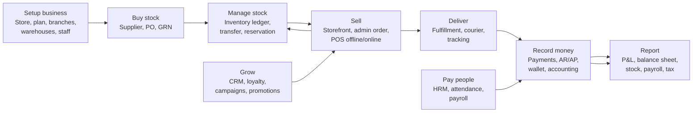

The most important idea: **documents describe business events, ledgers preserve truth**.

Examples:

- An order says what the customer bought.
- An inventory ledger row explains why stock changed.
- A journal entry explains why money changed.
- A wallet ledger row explains why store credit changed.
- An AR/AP ledger row explains who owes whom.

---

# Part I - Platform Foundation

## 1. Store, Subscription, and Feature Access

### Business Purpose

This is a multi-store SaaS ERP. One codebase runs many businesses. A store is one business/store. Each store can have different branches, warehouses, users, subscription plan, and enabled features.

### Real-World Example

`Demo Fashion Ltd` signs up for the ERP.

They choose:

- Store name: `Demo Fashion`
- Subdomain: `demo-fashion`
- Plan: `Pro`
- Features: POS, Inventory, HRM, Campaigns
- Branches: Dhaka, Chittagong
- Warehouses: Central Warehouse, Dhaka Store Stockroom

Another store, `ABC Electronics`, uses the same software but must never see Demo Fashion's data.

### Main Users

- SaaS platform owner
- Store owner
- Store administrator
- Billing/support team

### Business Rules

| Rule | Why |
| ---- | --- |
| Every store has isolated data. | Prevents cross-business data leak. |
| A suspended store cannot operate normal ERP workflows. | Enforces billing/compliance. |
| Feature access comes from subscription plan features. | Allows pricing tiers. |
| Store id must come from trusted request context/header, not request body. | Prevents store spoofing. |

### Data Changes

| Action | Data impact |
| ------ | ----------- |
| Store signup | `A stores`, `A users` owner, `A subscription_invoices`. |
| Plan upgrade | `U stores.subscription_plan_id`, `A subscription_invoices`. |
| Store suspend | `U stores.status='SUSPENDED'`. |
| Custom domain verify | `U stores.custom_domain_status`, `custom_domain_verified_at`. |

### Module Connections

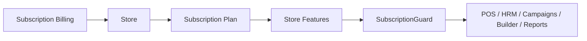

### Edge Cases

| Case | Expected behaviour |
| ---- | ------------------ |
| Store expired while cashier is using POS | Block new server sync; offline POS may queue locally but server sync should fail until billing resolved. |
| Store changes plan from Pro to Basic | Disable gated features, but do not delete historical data. |
| Store has custom domain and subdomain | Both resolve to same `store_id`; cache keys still use store id. |
| Store owner leaves company | Transfer ownership by updating store `user_id` after verifying authority. |

---

## 2. Identity, Auth, RBAC, and Branch Scope

### Business Purpose

Identity answers **who is using the system**. RBAC answers **what they can do**. Branch scope answers **where they can do it**.

### Real-World Example

Demo Fashion has:

- Owner: can see all branches, finance, payroll.
- Dhaka manager: can manage Dhaka products, inventory, orders.
- Chittagong cashier: can only use POS in Chittagong branch.
- Accountant: can manage finance but not HR salary rules.
- Warehouse staff: can receive GRN but cannot approve supplier payments.

### Main Users

- Store owner
- HR/admin staff
- Department managers
- Cashiers
- Accountants
- Super-admin support staff

### Business Rules

| Rule | Why |
| ---- | --- |
| A user belongs to one store except platform super-admin. | Data isolation. |
| Permission can be role-based and scope-based. | `orders:create` may be allowed in Dhaka but not all branches. |
| Admin bypass should be explicit. | Prevents accidental privilege escalation. |
| Branch id can be supplied through `x-branch-id`, but guard validates it. | Prevents staff choosing another branch. |

### Data Changes

| Action | Data impact |
| ------ | ----------- |
| Login | `A sessions`, `U users.refresh_token`. |
| Logout | `U sessions.revoked_at`. |
| Create role | `A roles`, `A role_permissions`. |
| Assign role | `A user_role_assignments`. |
| Temporary deny/allow | `A permission_overrides`. |
| Password reset | `U users.reset_password_token`, then `U users.password`. |

### Module Connections

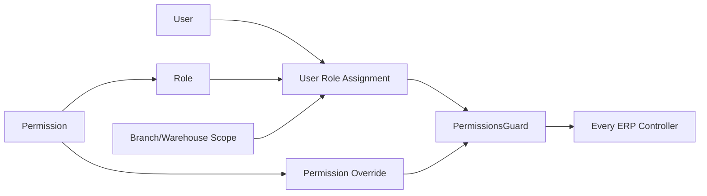

### Edge Cases

| Case | Expected behaviour |
| ---- | ------------------ |
| User has role allow but override deny | Deny should win. |
| User tries `x-branch-id` for another branch | Guard blocks unless admin/super-admin. |
| Role permission changed while user is logged in | Next request should use DB permission truth, not stale UI menu. |
| User is deactivated | JWT may still exist, but guard/service should reject inactive users. |

---

## 3. Organization: Branch, Warehouse, Bin

### Business Purpose

Organization defines **where business happens**.

- Branch = sales/reporting location.
- Warehouse = physical stock storage.
- Bin = smaller storage location inside warehouse.

### Real-World Example

Demo Fashion has:

- Dhaka Branch
- Chittagong Branch
- Central Warehouse
- Dhaka Store Stockroom
- Bins: `A-01`, `A-02`, `B-01`

An online order from Dhaka should reserve stock from Dhaka warehouse or Central Warehouse depending on routing rules.

### Business Rules

| Rule | Why |
| ---- | --- |
| Branch controls sales, POS, staff scope, reports. | Profitability by location. |
| Warehouse controls inventory. | Stock truth is warehouse-specific. |
| Warehouse can serve multiple branches if configured. | Central distribution model. |
| Do not delete branch/warehouse with historical stock/orders. | Keeps audit history. |

### Data Changes

| Action | Data impact |
| ------ | ----------- |
| Create branch | `A branches`. |
| Create warehouse | `A warehouses`. |
| Create bin | `A warehouse_bins`. |
| Disable branch | `U branches.status='INACTIVE'`. |
| Disable warehouse | `U warehouses.status='INACTIVE'`. |

### Module Connections

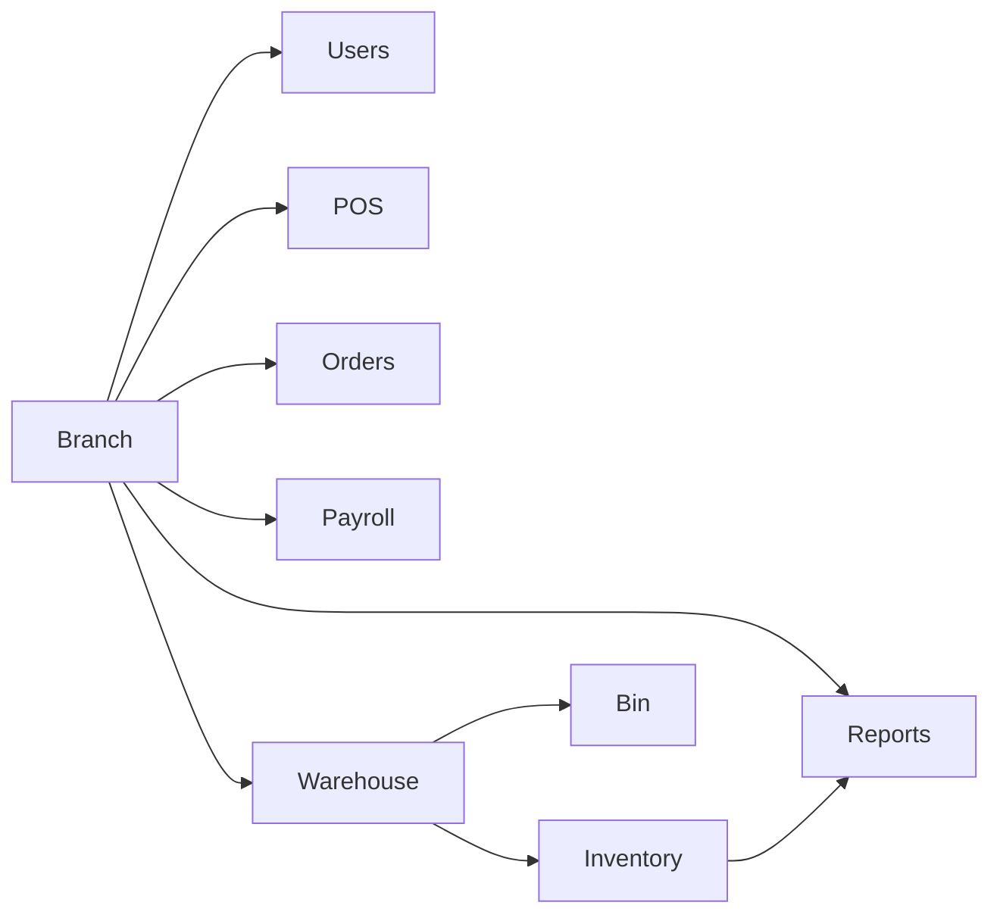

### Edge Cases

| Case | Expected behaviour |
| ---- | ------------------ |
| Warehouse disabled but has stock | Block new movements, allow reporting/transfer-out workflow. |
| Branch closed | Historical orders/reports remain; new POS shifts blocked. |
| Product exists but no warehouse stock | Storefront can show out-of-stock; order creation should fail or backorder if supported. |

---

# Part II - Commercial Flow

## 4. Catalog: Product, Variant, Price, Category, Brand

### Business Purpose

Catalog is the sellable product master. It tells the system what can be sold, how it is priced, how it is categorized, and how it appears in the storefront/POS.

### Real-World Example

Product: `Cotton T-Shirt`

Variants:

- Red / M
- Red / L
- Black / M

Prices:

- Retail: 500 BDT
- Wholesale: 420 BDT for 20+ quantity
- Member price: 450 BDT

Category:

- Clothing > Men > T-Shirts

### Business Rules

| Rule | Why |
| ---- | --- |
| SKU must be unique per store. | Prevents stock confusion. |
| Product can be inactive without deleting history. | Old orders still need product snapshot. |
| Variant carries size/color/attribute-specific stock and SKU. | Stock for Red/M is not same as Black/L. |
| Average cost is updated by purchase/GRN, not manually during sale. | Correct COGS. |
| Price used in order is snapshotted. | Later price changes do not rewrite old orders. |

### Data Changes

| Action | Data impact |
| ------ | ----------- |
| Create product | `A products`, optional `A product_variants`, pricing rows. |
| Update price | `U products.base_price` or pricing rows. |
| Publish/unpublish | `U products.status`. |
| Receive stock | `U products.average_cost`, `L inventory_ledger PURCHASE`. |
| Delete product | Soft-delete or inactive, never remove historical reference. |

### Module Connections

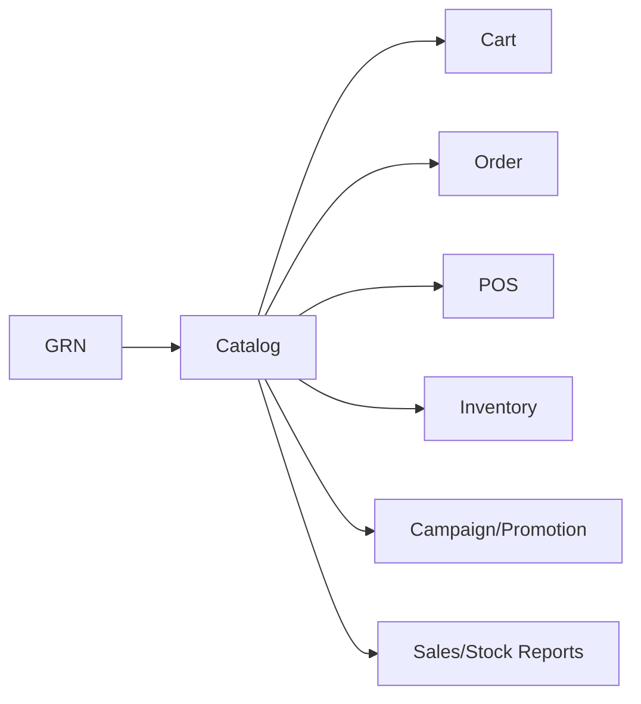

### Edge Cases

| Case | Expected behaviour |
| ---- | ------------------ |
| Price changes after cart created | Checkout should recalculate or confirm current price before order. |
| Product deleted after order | Order keeps product snapshot; product row soft-deleted only. |
| Variant stock exists but parent product inactive | Storefront/POS should not sell it. |
| Duplicate SKU imported | Reject import or map conflict for manual resolution. |

---

## 5. Cart and Checkout

### Business Purpose

Cart is a temporary shopping basket. It is not financial truth and not stock truth. Checkout converts cart intent into an order, reservation, payment attempt, and eventually accounting impact.

### Real-World Example

A customer adds:

- 2x Red/M T-Shirt
- 1x Black/M T-Shirt
- Coupon `EID10`
- Wallet redeem 200 BDT

Before checkout, this is only intent. The system has not yet reduced stock or recognized revenue.

### Business Rules

| Rule | Why |
| ---- | --- |
| Cart can be changed or deleted freely. | It is temporary. |
| Coupon can be previewed in cart but usage is counted only on order create. | Avoids fake coupon exhaustion. |
| Stock is reserved at order creation, not cart add. | Avoids abandoned cart locking stock forever. |
| Checkout recalculates totals. | Prevents client-side tampering. |

### Data Changes

| Action | Data impact |
| ------ | ----------- |
| Add item | `A/U cart_items`. |
| Change quantity | `U cart_items.quantity`. |
| Remove item | `D cart_items`. |
| Apply coupon | `U carts.applied_coupon_code`. |
| Checkout success | `D cart_items` or clear cart after order creation. |

### Module Connections

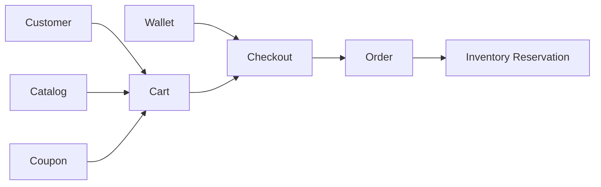

### Edge Cases

| Case | Expected behaviour |
| ---- | ------------------ |
| Stock available during add-to-cart but sold out before checkout | Checkout fails or adjusts quantity. |
| Coupon valid in cart but expired at checkout | Checkout rejects coupon. |
| Customer edits request total in browser | Server recalculates all totals. |
| Cart abandoned | No stock or accounting impact. |

---

## 6. Sales Order: Online/Admin Order

### Business Purpose

Order is the central sales document. It captures what the customer bought, where it will be delivered, how it will be paid, and what stock must be reserved/fulfilled.

### Real-World Example

Customer places order:

- 2x Red/M T-Shirt at 500 BDT
- Shipping fee: 80 BDT
- VAT: 100 BDT
- Coupon discount: 50 BDT
- Wallet used: 200 BDT
- Card payment: 930 BDT

Total: `2*500 + 80 + 100 - 50 = 1130`.
Payment split: `Wallet 200 + Card 930`.

### Business Rules

| Rule | Why |
| ---- | --- |
| Order stores snapshots of product price/customer address. | Historical accuracy. |
| Stock reservation happens inside order transaction. | Prevents oversell. |
| Payment success does not automatically mean revenue recognition. | Business recognizes sale when order completes/delivers. |
| Order cancellation releases reservations. | Stock becomes available again. |
| Return creates reversal rows. | Do not delete or rewrite original sale. |

### Data Changes

| Action | Data impact |
| ------ | ----------- |
| Create order | `A orders`, `A order_items`, `A stock_reservations`, `L inventory_ledger RESERVATION`. |
| Apply coupon | `U coupons.used_count`. |
| Redeem wallet | `L wallet_ledger WALLET_SPEND`. |
| B2B on-account | `L ar_ledger INVOICE`. |
| Payment success | `A payments`, `U orders.payment_status`. |
| Complete order | `L inventory_ledger SALE`, `O accounting_outbox`, then `L journal_entries/ledger_entries`. |
| Return order | `A order_returns`, `L inventory_ledger RETURN_IN`, reversal journal/wallet refund. |

### Module Connections

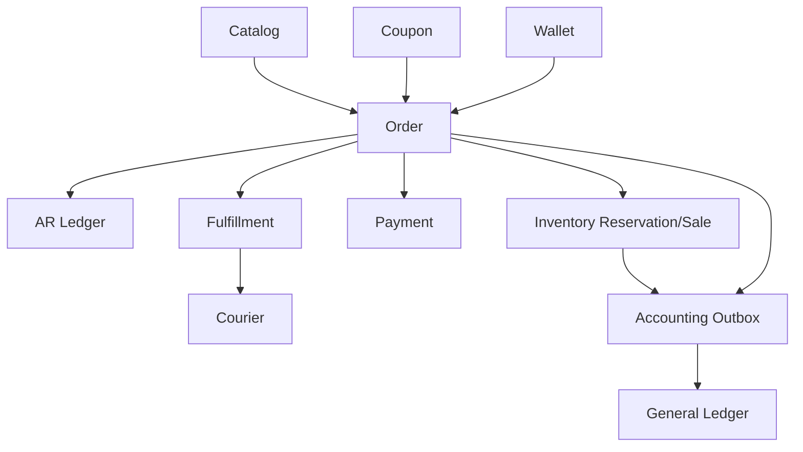

### Example Journal

If order completes:

| Account | Debit | Credit |
| ------- | ----- | ------ |
| Cash/Card clearing `1000` | 930 | |
| Wallet liability `2300` | 200 | |
| Sales revenue `4000` | | 1000 |
| VAT payable `2400` | | 100 |
| Shipping revenue/recovery | | 30 |
| COGS `5000` | 400 | |
| Inventory `1100` | | 400 |

The exact account codes depend on the configured chart of accounts, but the business idea is: money/receivable increases, revenue/tax liability increases, inventory decreases, COGS increases.

### Edge Cases

| Case | Expected behaviour |
| ---- | ------------------ |
| Two customers buy last item at same time | Reservation transaction/locking prevents both from committing. |
| Payment gateway sends duplicate success callback | Payment/order update must be idempotent. |
| Order paid but cancelled before ship | Refund/payment reversal + reservation release. |
| Order delivered but stock ledger failed | Outbox/retry should preserve accounting/inventory side-effect. |
| Customer returns partial items | Return only those lines; reverse stock and money proportionally. |

---

## 7. POS and Offline Sales

### Business Purpose

POS handles physical store sales, cashier shifts, cash drawer, split payments, and offline sync.

### Real-World Example

Cashier opens Dhaka register with 5,000 BDT cash float. During the day:

- Cash sale: 600 BDT
- Card sale: 1,200 BDT
- Mobile banking sale: 900 BDT
- Cash out: 200 BDT for petty expense

Expected closing cash:

`opening 5000 + cash_sales 600 + cash_in 0 - cash_out 200 = 5400`.

If cashier counts 5,350, difference = `-50`.

### Business Rules

| Rule | Why |
| ---- | --- |
| Cashier must open shift before selling. | Cash accountability. |
| Offline sale must have unique `offlineSaleId`. | Prevent duplicate sync. |
| POS order is usually immediately completed. | Customer receives goods instantly. |
| Drawer cash-in/out must be recorded. | Reconciliation/audit. |
| Shift close calculates variance. | Detect cash shortage/excess. |

### Data Changes

| Action | Data impact |
| ------ | ----------- |
| Open shift | `A pos_shifts`. |
| POS sale | `A orders`, `A order_items`, `L inventory_ledger SALE`, optional `L wallet_ledger`, optional `L ar_ledger`, `O accounting_outbox`. |
| Cash in/out | `A pos_drawer_transactions`, `U pos_shifts.cash_in/cash_out`. |
| Close shift | `U pos_shifts.status`, `closing_balance`, `difference`. |
| Duplicate offline sync | `R orders.offline_sale_id`; no duplicate insert. |

### Module Connections

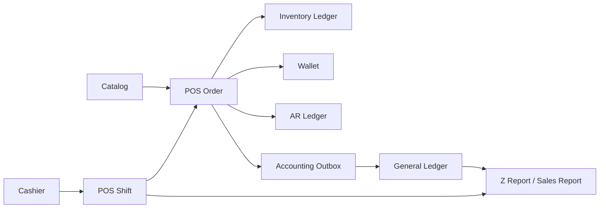

### Edge Cases

| Case | Expected behaviour |
| ---- | ------------------ |
| Device syncs same offline sale twice | Return existing order using `offline_sale_id`. |
| Cashier closes with mismatch | Save difference; manager reviews. |
| Offline sale uses stale price | Server can accept POS snapshot or flag for review depending policy. |
| Stock became negative during offline period | Server must either allow negative stock with audit or reject sync; policy must be explicit. |
| Cash drawer transaction entered wrong | Add correction transaction, do not silently edit old row after close. |

---

# Part III - Supply Chain and Inventory

## 8. Procurement and Purchase Orders

### Business Purpose

Procurement controls buying. It turns internal need into supplier purchase orders and later supplier invoices/payments.

### Real-World Example

Warehouse manager sees T-Shirts are low. They request 500 units. Procurement asks suppliers for price, chooses one, creates PO, supplier delivers, warehouse verifies GRN, accounting pays supplier.

### Business Rules

| Rule | Why |
| ---- | --- |
| Purchase request is not stock. | It is only demand. |
| Purchase order is not stock. | It is commitment to buy. |
| GRN is stock truth. | Only received goods increase inventory. |
| Supplier invoice should match PO and GRN. | Prevents overbilling. |
| Supplier payment reduces AP. | Tracks liability. |

### Data Changes

| Action | Data impact |
| ------ | ----------- |
| Create PR | `A purchase_requisitions`. |
| Approve PR | `U purchase_requisitions.status`. |
| Create RFQ | `A rfqs`, supplier invite rows if implemented. |
| Create PO | `A purchase_orders`, `A purchase_order_items`. |
| Receive goods | See GRN module. |
| Supplier invoice | `A supplier_invoices`, matching status. |
| Supplier payment | `L supplier_ap_ledger PAYMENT`, `O accounting_outbox`. |

### Module Connections

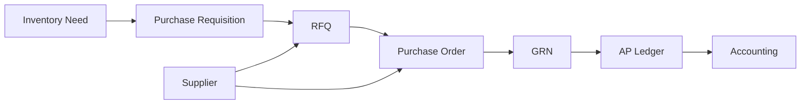

### Edge Cases

| Case | Expected behaviour |
| ---- | ------------------ |
| Supplier delivers less than PO | PO becomes partially received. |
| Supplier invoice exceeds PO price | 3-way match should fail or require approval. |
| Goods damaged at receiving | GRN reject/partial receive; no stock increase for rejected qty. |
| Duplicate supplier invoice number | Reject per supplier/store. |

---

## 9. GRN and Inventory Receiving

### Business Purpose

GRN confirms physical goods arrived. It is the operational bridge between Procurement, Inventory, Supplier AP, and Accounting.

### Real-World Example

PO says 500 T-Shirts at 120 BDT each. Supplier delivers 480. Warehouse counts and accepts 470, rejects 10 damaged.

System should:

- Increase stock by 470.
- Create AP liability for accepted amount.
- Update product average cost.
- Keep rejected qty visible.

### Business Rules

| Rule | Why |
| ---- | --- |
| Only verified GRN increases stock. | Prevents fake stock. |
| Accepted qty can be less than ordered qty. | Real deliveries are imperfect. |
| AP should be based on accepted value. | Do not owe supplier for rejected goods. |
| Average cost updates on purchase receipt. | Accurate COGS. |

### Data Changes

| Action | Data impact |
| ------ | ----------- |
| Create GRN draft | `A goods_received_notes`, `A goods_received_note_items`. |
| Verify accepted | `U goods_received_notes.status='RECEIVED'`, `L supplier_ap_ledger`, `Q product:update-stock`. |
| Stock processor | `L inventory_ledger PURCHASE`, `U products.average_cost`, `O accounting_outbox`. |
| Reject GRN | `U goods_received_notes.status='REJECTED'`; no stock/AP. |

### Module Connections

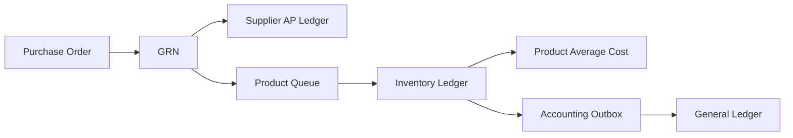

### Edge Cases

| Case | Expected behaviour |
| ---- | ------------------ |
| Queue fails after GRN commit | Job retry must eventually write stock ledger. |
| Stock written but accounting outbox fails | Should be in same controlled processing path; failed outbox remains retryable. |
| Wrong GRN accepted | Correct through stock adjustment/debit note/reversal, not row deletion. |

---

## 10. Inventory, Reservation, Transfer, and Costing

### Business Purpose

Inventory answers:

- How much stock do we have?
- Where is it?
- Why did it change?
- What did sold items cost?

### Real-World Example

Central Warehouse has 100 Red/M T-Shirts.

Events:

1. GRN receives +50.
2. Online order reserves -2.
3. Fulfillment ships -2 sale.
4. Transfer sends -20 to Chittagong.
5. Customer returns +1.

The stock number is not guessed. It is explained by ledger rows.

### Business Rules

| Rule | Why |
| ---- | --- |
| Stock changes are append-only ledger rows. | Audit and costing. |
| Reservation affects available-to-promise, not necessarily physical on-hand. | Stock is still in warehouse but promised. |
| Sale consumes stock and calculates COGS. | Finance needs margin. |
| Transfer has out and in legs. | Stock moves between warehouses. |
| Batch/expiry uses FEFO where applicable. | Sell oldest/expiring goods first. |

### Data Changes

| Action | Data impact |
| ------ | ----------- |
| Purchase receive | `L inventory_ledger PURCHASE`. |
| Order reserve | `A stock_reservations`, `L inventory_ledger RESERVATION`. |
| Ship sale | `U stock_reservations.fulfilled_qty`, `L inventory_ledger SALE`, `O COGS accounting_outbox`. |
| Release reservation | `U stock_reservations.released_qty`, `L inventory_ledger RESERVATION_CANCEL`. |
| Transfer ship | `U stock_transfers.status='IN_TRANSIT'`, `L inventory_ledger TRANSFER_OUT`. |
| Transfer receive | `U stock_transfers.status='RECEIVED'`, `L inventory_ledger TRANSFER_IN`. |
| Adjustment | `L inventory_ledger ADJUSTMENT`, approval required. |

### Module Connections

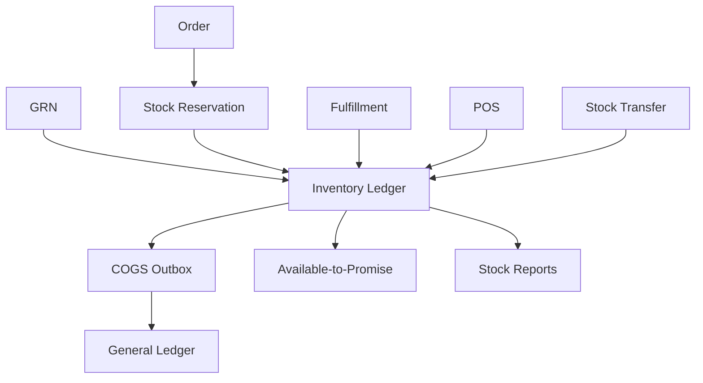

### Edge Cases

| Case | Expected behaviour |
| ---- | ------------------ |
| Negative stock | Either blocked or allowed by explicit store policy with audit. |
| Expired reservation | Sweep job releases it. |
| Batch expired | FEFO excludes expired batches from sale. |
| Transfer lost in transit | Receive partial and create variance adjustment. |
| Cycle count mismatch | Approved adjustment ledger row. |

---

# Part IV - Finance and Money

## 11. Accounting and General Ledger

### Business Purpose

Accounting converts business events into financial truth. It explains revenue, cost, cash, receivables, payables, liabilities, expenses, and profit.

### Real-World Example

When an order completes:

- Cash/card receivable increases.
- Revenue increases.
- VAT payable increases.
- Inventory decreases.
- Cost of goods sold increases.

This becomes a balanced journal.

### Business Rules

| Rule | Why |
| ---- | --- |
| Every journal must balance debits and credits. | Accounting correctness. |
| Journal and ledger rows are immutable. | Audit and compliance. |
| Mistake correction is reversal journal. | Historical truth preserved. |
| Cross-module posting uses outbox. | Avoids missing side effects. |
| Manual journals require accountant permission. | Prevents fraud. |

### Data Changes

| Action | Data impact |
| ------ | ----------- |
| Source event posts outbox | `O accounting_outbox`. |
| Outbox processing | `L journal_entries`, `L ledger_entries`, `U accounts.balance`. |
| Manual journal | `L journal_entries`, `L ledger_entries`, `U accounts.balance`. |
| Reversal | `L reversal journal`, link `reversed_journal_entry_id`. |

### Module Connections

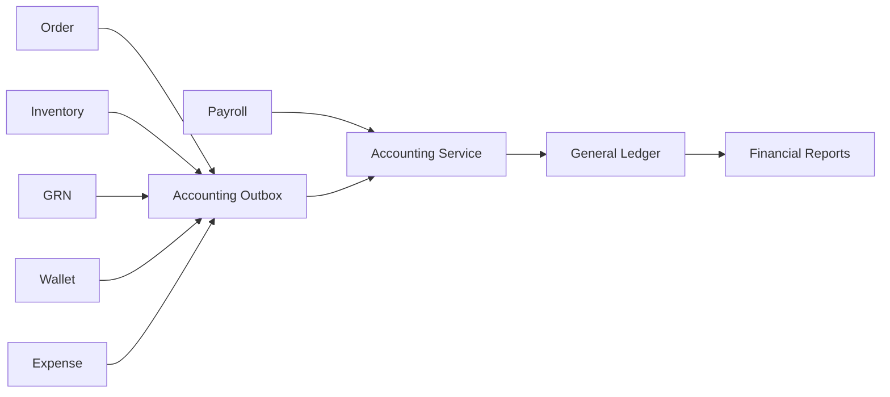

### Edge Cases

| Case | Expected behaviour |
| ---- | ------------------ |
| Outbox row fails | Status becomes failed/retryable with error. |
| Journal not balanced | Reject before insert. |
| Account missing | Reject posting; fix chart of accounts. |
| Wrong journal posted | Create reversal journal and new correct journal. |

---

## 12. AR, AP, Wallet, and Cash

### Business Purpose

These modules track who owes money.

| Ledger | Meaning |
| ------ | ------- |
| AR | Customer owes the business. |
| AP | Business owes supplier. |
| Wallet | Business owes store credit to customer. |
| Cash/bank | Money actually received or paid. |

### Real-World Examples

AR:

Business customer buys 50,000 BDT on credit. They pay after 30 days.

AP:

Supplier delivers stock worth 60,000 BDT. Business pays next week.

Wallet:

Customer returns an item and receives 500 BDT store credit.

### Business Rules

| Rule | Why |
| ---- | --- |
| AR/AP/wallet ledgers are append-only. | Running balance audit. |
| Credit limit blocks risky B2B orders. | Prevents bad debt. |
| Wallet redemption reduces liability. | Store credit is money owed to customer. |
| Supplier payment reduces AP. | Liability settlement. |

### Data Changes

| Action | Data impact |
| ------ | ----------- |
| B2B sale on account | `L ar_ledger INVOICE`, GL DR AR / CR Revenue. |
| Customer payment | `L ar_ledger PAYMENT`, GL DR Cash / CR AR. |
| GRN accepted | `L supplier_ap_ledger GRN_RECEIVED`, GL DR Inventory / CR AP. |
| Supplier payment | `L supplier_ap_ledger PAYMENT`, GL DR AP / CR Cash. |
| Wallet credit | `L wallet_ledger WALLET_CREDIT`, GL DR Expense/Revenue reversal / CR Wallet Liability. |
| Wallet redeem | `L wallet_ledger WALLET_SPEND`, sale journal DR Wallet Liability. |

### Module Connections

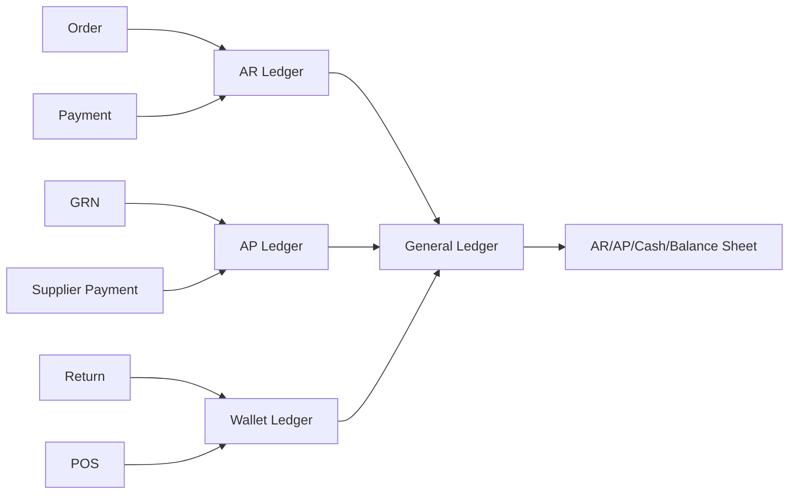

### Edge Cases

| Case | Expected behaviour |
| ---- | ------------------ |
| Customer exceeds credit limit | Block `ON_ACCOUNT` order or require manager approval. |
| Customer pays partial invoice | AR balance decreases partially. |
| Supplier overpayment | Create debit balance/advance or require correction. |
| Wallet balance insufficient | Reject checkout wallet redemption. |
| Wallet refund duplicated | Idempotency by reference type/id should prevent duplicate credit. |

---

# Part V - People, CRM, Growth

## 13. HRM and Payroll

### Business Purpose

HRM manages employees. Payroll calculates what the business owes employees and posts salary expenses/liabilities to accounting.

### Real-World Example

Employee has:

- Basic salary: 30,000
- Allowance: 5,000
- Overtime: 2,000
- Tax: 2,500
- Advance deduction: 1,000

Gross = 37,000.
Net payable = 33,500.

Payroll approval posts:

- DR Salary Expense 37,000
- CR Salary Payable 33,500
- CR Tax Payable 2,500
- CR Other Deduction Payable 1,000

Payroll payment posts:

- DR Salary Payable 33,500
- CR Cash/Bank 33,500

### Business Rules

| Rule | Why |
| ---- | --- |
| Attendance and leave affect payroll. | Salary calculation depends on work/time. |
| Payroll batch approval creates accounting liability. | Business owes salary after approval. |
| Payroll payment settles liability. | Cash leaves business. |
| Approved payroll should not be deleted. | Compliance and employee trust. |

### Data Changes

| Action | Data impact |
| ------ | ----------- |
| Employee create | `A employees`/HRM employee row. |
| Attendance punch | `A attendance` row. |
| Leave request | `A leave_requests`, later `U status`. |
| Process payroll | `A payroll_batches`, `A payroll_slips`, `U payroll_batches.status='APPROVED'`, `L journal_entries`. |
| Pay payroll | `U payroll_batches.status='PAID'`, `L journal_entries`. |

### Module Connections

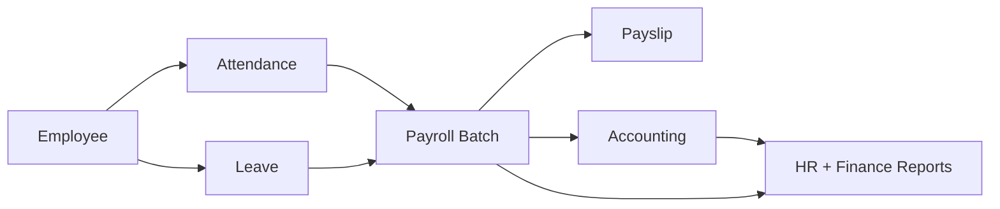

### Edge Cases

| Case | Expected behaviour |
| ---- | ------------------ |
| Employee joins mid-month | Prorate salary. |
| Employee leaves mid-month | Final settlement payroll. |
| Attendance missing | Flag payroll slip for review. |
| Payroll calculated wrong | Adjustment batch or reversal journal. |
| Tax rate changes | Use rate effective for payroll period. |

---

## 14. CRM, Loyalty, Campaigns, and Promotions

### Business Purpose

These modules help the business grow revenue and retain customers.

- CRM tracks leads/customers/subscribers.
- Loyalty rewards repeat customers.
- Campaigns send messages.
- Promotions/coupons discount orders.

### Real-World Example

A customer buys 10,000 BDT in a month. They move from Bronze to Silver. Marketing sends them an Eid campaign with coupon `EID10`. They use the coupon at checkout.

### Business Rules

| Rule | Why |
| ---- | --- |
| Coupon validation must happen server-side. | Prevent discount fraud. |
| Coupon usage should increment only after order creation. | Avoid abandoned cart consuming coupons. |
| Loyalty points ledger is truth. | Avoid incorrect customer rewards. |
| Campaign logs must track success/failure. | Compliance and debugging. |
| Subscriber unsubscribe must be respected. | Legal/privacy. |

### Data Changes

| Action | Data impact |
| ------ | ----------- |
| New lead | `A leads`. |
| Convert lead | `U leads.status`, `A/Update users` customer. |
| Subscribe | `A subscribers`. |
| Launch campaign | `U campaigns.status`, `Q campaign:start-campaign`. |
| Send message | `A campaign_logs`, `X Mail/SMS/Push`. |
| Apply coupon to order | `U coupons.used_count`. |
| Earn loyalty | `L loyalty_ledger EARN`, `U users.loyalty_points_balance`. |
| Tier assessment | `U users.membership_tier`, `L loyalty_ledger TIER_CHANGE`. |

### Module Connections

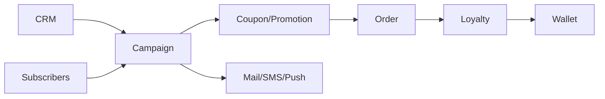

### Edge Cases

| Case | Expected behaviour |
| ---- | ------------------ |
| Coupon expired between cart and checkout | Reject at checkout. |
| Customer returns order that earned points | Reverse or adjust loyalty points. |
| Campaign provider fails | Log failure and retry if safe. |
| Customer unsubscribed | Exclude from campaign sends. |
| Coupon usage limit reached | Reject new order usage. |

---

# Part VI - Fulfillment, Reporting, and Operations

## 15. Fulfillment and Courier

### Business Purpose

Fulfillment turns a paid/confirmed order into physical picking, packing, shipping, tracking, and delivery.

### Real-World Example

Order `ORD-1001` is confirmed. Warehouse staff picks 2 T-Shirts, packs them, ships through Pathao, receives tracking number, and customer gets delivery updates.

### Business Rules

| Rule | Why |
| ---- | --- |
| Fulfillment consumes reservation. | Reserved stock becomes sold stock. |
| Courier status updates order tracking, not accounting directly. | Delivery state and finance state are related but separate. |
| Partial fulfillment may split shipment. | Real warehouses may ship from multiple locations. |
| Courier webhook must be public but verified. | External provider callback. |

### Data Changes

| Action | Data impact |
| ------ | ----------- |
| Create fulfillment | `A fulfillment_tasks`, `A fulfillment_items`. |
| Pick/pack | `U fulfillment_tasks.status`, item quantities. |
| Ship | `U orders.status='SHIPPED'`, tracking fields, `L inventory_ledger SALE`, reservation fulfilled. |
| Courier webhook | `U orders.courier_status`, maybe `orders.status`. |

### Module Connections

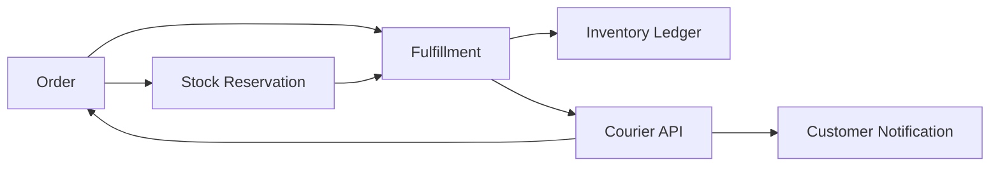

### Edge Cases

| Case | Expected behaviour |
| ---- | ------------------ |
| Courier API fails | Keep fulfillment pending/error; retry or manual dispatch. |
| Partial stock unavailable | Split fulfillment or backorder. |
| Courier marks returned | Trigger return/failed delivery workflow, not silent stock increase. |
| Tracking webhook duplicate | Idempotent update. |

---

## 16. Reporting and Dashboards

### Business Purpose

Reporting turns operational and ledger data into management decisions.

### Real-World Example

Owner asks:

- How much profit did Dhaka branch make this month?
- Which products are low stock?
- How much do customers owe us?
- How much do we owe suppliers?
- What was salary cost this month?

### Business Rules

| Rule | Why |
| ---- | --- |
| Reports should read truth ledgers, not UI guesses. | Accuracy. |
| Reports are store and branch scoped. | Access control and business segmentation. |
| Reports should not mutate source data. | Read-only safety. |
| Financial reports depend on posted journals. | Draft documents should not inflate finance. |

### Data Sources

| Report | Reads from |
| ------ | ---------- |
| Sales report | `orders`, `order_items`, `payments`, `journal_entries`. |
| Stock report | `inventory_ledger`, `stock_reservations`, `products`, `warehouses`. |
| P&L | `journal_entries`, `ledger_entries`, `accounts`. |
| Balance sheet | `accounts`, `ledger_entries`. |
| AR aging | `ar_ledger`, `users`. |
| AP aging | `supplier_ap_ledger`, `suppliers`. |
| Payroll report | `payroll_batches`, `payroll_slips`, journals. |

### Edge Cases

| Case | Expected behaviour |
| ---- | ------------------ |
| Outbox pending | Financial report may lag until journal posts; show processing status if needed. |
| User branch scoped | Report filters to allowed branch. |
| Time zone difference | Store timezone controls date buckets. |
| Historical price changed | Report uses order item snapshot, not current product price. |

---

## 17. Infra: Cache, Queue, File, Notification, Audit

### Business Purpose

Infra modules keep the ERP fast, reliable, traceable, and connected to outside services.

### Business Rules

| Service | Rule |
| ------- | ---- |
| Cache | Key must include store prefix `t:{storeId}:`. |
| Queue | Jobs must be idempotent and retry-safe. |
| File | Files must be store partitioned. |
| Notification | Do not block main transaction on slow delivery. |
| Audit | Important actions must be traceable. |
| SMS/Mail/Push | External failure should be logged and retryable if safe. |

### Data Changes

| Action | Data impact |
| ------ | ----------- |
| Cache set | Redis key `t:{storeId}:...`. |
| Queue job | `Q` in BullMQ queue. |
| File upload | `A files`, S3 object under store prefix. |
| Notification | `A notifications`, optional push job. |
| Audit decorated route | `A audit_logs`. |
| Chat message | `A chat_messages`, socket broadcast. |

### Module Connections

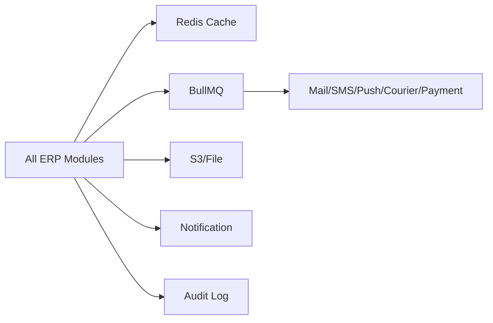

### Edge Cases

| Case | Expected behaviour |
| ---- | ------------------ |
| Redis down | Critical writes should still work if cache is optional; queues may pause. |
| Queue job retries | Must not duplicate ledger/order/payment effects. |
| File upload succeeds but DB save fails | Cleanup orphan object or mark pending. |
| Audit write fails | Should not break business transaction unless compliance requires hard fail. |

---

# Part VII - Deep End-to-End Examples

## 18. Example 1: Online Customer Buys With Wallet + Card

### Scenario

Customer has 200 BDT wallet balance and buys:

- 2 T-Shirts x 500 = 1000
- VAT = 100
- Shipping = 80
- Coupon discount = 50

Order total = `1130`.

Payment:

- Wallet = 200
- Card = 930

### Step-by-Step

| Step | Business action | System result |
| ---- | --------------- | ------------- |
| 1 | Customer adds products to cart | `A/U cart_items`; no stock change. |
| 2 | Customer applies coupon | `U carts.applied_coupon_code`; no coupon count yet. |
| 3 | Customer confirms checkout | Server recalculates price/tax/discount. |
| 4 | Order is created | `A orders`, `A order_items`. |
| 5 | Stock is reserved | `A stock_reservations`, `L inventory_ledger RESERVATION`. |
| 6 | Coupon usage counted | `U coupons.used_count`. |
| 7 | Wallet is spent | `L wallet_ledger WALLET_SPEND`, no separate GL because sale journal includes wallet. |
| 8 | Payment gateway succeeds | `A payments`, `U orders.payment_status='PAID'`. |
| 9 | Warehouse ships | reservation fulfilled, `L inventory_ledger SALE`. |
| 10 | Order completes | `O accounting_outbox`. |
| 11 | Outbox posts journal | `L journal_entries`, `L ledger_entries`, `U accounts.balance`. |

### Important Business Insight

Wallet is not a discount. Wallet is a liability the business already owes customer. When customer redeems it, the sale journal debits wallet liability.

---

## 19. Example 2: Supplier Delivers Less Than Ordered

### Scenario

PO ordered 500 units at 120 BDT.
Supplier delivered 480.
Warehouse accepted 470 and rejected 10 damaged.

### Step-by-Step

| Step | Business action | System result |
| ---- | --------------- | ------------- |
| 1 | Procurement creates PO for 500 | `A purchase_orders`, no stock. |
| 2 | Warehouse creates GRN draft | `A goods_received_notes`, `A goods_received_note_items`. |
| 3 | Warehouse verifies 470 accepted | `U GRN status='RECEIVED'`. |
| 4 | AP liability created | `L supplier_ap_ledger +56400`. |
| 5 | Stock update job runs | `Q product:update-stock`. |
| 6 | Inventory increases | `L inventory_ledger PURCHASE +470`. |
| 7 | Product cost updates | `U products.average_cost`. |
| 8 | Accounting outbox posts | DR Inventory 56,400 / CR AP 56,400. |

### Important Business Insight

PO is a promise. GRN is proof. Only proof increases stock and AP.

---

## 20. Example 3: Payroll Month End

### Scenario

Company processes May payroll for 50 employees.

Total:

- Gross salary: 1,500,000
- Tax: 100,000
- Other deductions: 50,000
- Net payable: 1,350,000

### Step-by-Step

| Step | Business action | System result |
| ---- | --------------- | ------------- |
| 1 | HR reviews attendance and leave | Reads attendance/leave data. |
| 2 | HR processes payroll | `A payroll_batches`, `A payroll_slips`. |
| 3 | Batch approved | `U payroll_batches.status='APPROVED'`. |
| 4 | Accrual journal posts | DR Salary Expense 1,500,000 / CR Salary Payable 1,350,000 / CR Tax Payable 100,000 / CR Deduction Payable 50,000. |
| 5 | Payroll is paid | `U payroll_batches.status='PAID'`. |
| 6 | Settlement journal posts | DR Salary Payable 1,350,000 / CR Cash 1,350,000. |

### Important Business Insight

Approving payroll creates liability. Paying payroll settles liability.

---

## 21. Example 4: POS Offline Sale Sync

### Scenario

Internet is down. Cashier sells:

- 1 T-Shirt = 500
- Paid cash
- Offline sale id = `offline-abc-001`

Later internet returns and POS syncs.

### Step-by-Step

| Step | Business action | System result |
| ---- | --------------- | ------------- |
| 1 | Cashier sells offline | Local POS stores sale. Server unchanged. |
| 2 | POS syncs sale | Server checks `orders.offline_sale_id`. |
| 3 | Sale not found | Server creates POS order. |
| 4 | Stock decreases | `L inventory_ledger SALE`. |
| 5 | Shift totals update | `U pos_shifts.cash_sales`, expected closing balance. |
| 6 | Journal outbox created | `O accounting_outbox`. |
| 7 | Same sale syncs again | Server finds existing `offline_sale_id`; no duplicate order. |

### Important Business Insight

Offline sync must be idempotent. The same offline sale may reach the server multiple times.

---

## 22. Module Development Checklist

When adding or changing any ERP module, answer these questions before coding:

| Question | Why |
| -------- | --- |
| Who owns this data? | Prevents wrong module writing another module's truth. |
| Is this master data, document data, temporary data, or ledger data? | Determines update/delete rules. |
| What store/branch/warehouse scope applies? | Prevents data leaks. |
| Does this action need a transaction? | Multi-row business changes must be atomic. |
| Does it write money or stock truth? | Must use ledgers/outbox. |
| Does it need approval state? | Procurement, payroll, adjustments, returns often do. |
| What happens on retry? | Queue/payment/webhook/offline sync must be idempotent. |
| What should be audited? | Financial, stock, payroll, permission, and store actions. |
| What report should reflect this change? | Ensures downstream reporting correctness. |

---

## 23. Golden Rules

1. Never trust client totals. Recalculate on server.
2. Never read/write data without store scope.
3. Never directly mutate ledger truth.
4. Never delete posted financial or stock history.
5. Never enqueue non-idempotent jobs without a retry strategy.
6. Never treat payment success as full business completion unless the business workflow says so.
7. Never increase stock from PO alone; only GRN/adjustment/return can increase stock.
8. Never recognize payroll payment before payroll approval.
9. Never let subscription gates live only in UI; backend must enforce them.
10. Never make reports from mutable UI totals when ledger truth exists.

---

*Use this document for business reasoning and module design. Use `erp_master_dataflow.md` for request/DB/queue traces, and `erp_master_database_design.md` for exact fields, indexes, and schema details.*
