# ERP Master Database Design

**Document Version:** 2.0.0
**Status:** Approved for Engineering
**Last Updated:** May 24, 2026
**Scope:** Authoritative schema reference for the entire multi-tenant ERP. Every table that exists in `server/src/modules/**/entities/*.entity.ts` is documented here. The diagrams are layered — start with §3 (Master ERD) then drill into the per-domain ERDs in §5.

> Cross-references: [HLD](erp_master_system_design.md) · [LLD](erp_low_level_system_design.md) · [Dataflow](erp_master_dataflow.md) (which tables each module writes, with row-level examples).

---

## Table of Contents

**Part I — Foundations**
1. [Design Principles](#1-design-principles)
2. [Naming & Conventions](#2-naming--conventions)

**Part II — Diagrams**
3. [Master ERD (Cross-Domain)](#3-master-erd-cross-domain)
4. [Table Inventory by Domain](#4-table-inventory-by-domain)
5. [Per-Domain ERDs](#5-per-domain-erds)
   - 5.1 [System & Tenant](#51-system--tenant-erd)
   - 5.2 [Identity & RBAC](#52-identity--rbac-erd)
   - 5.3 [Catalog & Pricing](#53-catalog--pricing-erd)
   - 5.4 [Sales: Orders · Returns · Payments · Cart](#54-sales-orders--returns--payments--cart-erd)
   - 5.5 [POS](#55-pos-erd)
   - 5.6 [Inventory · WMS](#56-inventory--wms-erd)
   - 5.7 [Procurement (PR → PO → GRN → Invoice → Payment)](#57-procurement-erd)
   - 5.8 [Finance / Accounting & Subledgers](#58-finance--accounting--subledgers-erd)
   - 5.9 [HRM (Employee · Attendance · Payroll · Recruitment)](#59-hrm-erd)
   - 5.10 [CRM (Customer · Lead · Wallet · Loyalty)](#510-crm-erd)
   - 5.11 [Marketing (Campaign · Page · FAQ · Settings)](#511-marketing--content-erd)
   - 5.12 [Logistics: Fulfillment & GRN](#512-logistics-fulfillment--grn-erd)
   - 5.13 [Infra (Audit · Notifications · Files · Chat · Device · Outbox)](#513-infra-erd)

**Part III — Schemas**
6. [Schema Definitions per Domain](#6-schema-definitions-per-domain)
   - 6.1 [System & Tenant Tables](#61-system--tenant-tables)
   - 6.2 [Identity & RBAC Tables](#62-identity--rbac-tables)
   - 6.3 [Organization Tables](#63-organization-tables)
   - 6.4 [Catalog & Pricing Tables](#64-catalog--pricing-tables)
   - 6.5 [Sales · POS · Coupon · Promotion Tables](#65-sales--pos--coupon--promotion-tables)
   - 6.6 [Inventory & WMS Tables](#66-inventory--wms-tables)
   - 6.7 [Procurement Tables](#67-procurement-tables)
   - 6.8 [Logistics: GRN & Fulfillment Tables](#68-logistics-grn--fulfillment-tables)
   - 6.9 [Finance / Accounting Tables](#69-finance--accounting-tables)
   - 6.10 [HRM Tables](#610-hrm-tables)
   - 6.11 [CRM Tables (Customer · Subscriber · Lead · Loyalty · Wallet)](#611-crm-tables)
   - 6.12 [Marketing & Content Tables](#612-marketing--content-tables)
   - 6.13 [Infra Tables (Audit · Notifications · Files · Chat · Device · Outbox)](#613-infra-tables)

**Part IV — Rules**
7. [Append-Only Ledger Tables — Special Rules](#7-append-only-ledger-tables--special-rules)
8. [Multi-Tenant FK Invariants](#8-multi-tenant-fk-invariants)
9. [Indexes & Constraints (Authoritative List)](#9-indexes--constraints-authoritative-list)
10. [Soft Delete & Retention Strategy](#10-soft-delete--retention-strategy)
11. [Partitioning Candidates](#11-partitioning-candidates)
12. [Migration Playbook (Cross-Reference)](#12-migration-playbook-cross-reference)
13. [Planned / Future Tables](#13-planned--future-tables)
14. [Author's Checklist for Schema Changes](#14-authors-checklist-for-schema-changes)

---

# Part I — Foundations

## 1. Design Principles

The database is governed by **four non-negotiable principles**, each backed by a concrete enforcement mechanism in code.

| # | Principle | Enforcement |
| --- | --- | --- |
| 1 | **Strict multi-tenant isolation** (logical shared-database model) | Every business table has a `tenant_id uuid NOT NULL` column; every query starts with `WHERE tenant_id = $1`; every multi-column index begins with `tenant_id`; every unique business key (sku, code, slug, email) is unique **per tenant**, not globally. |
| 2 | **Ledger-based truth for money & stock** | Stock and money balances are derived by `SUM()` over append-only ledger tables (`inventory_ledger`, `ledger_entries`, `ar_ledger`, `supplier_ap_ledger`, `wallet_ledger`, `loyalty_ledger`). Cached/snapshot fields (e.g., `accounts.balance`, `users.loyalty_points_balance`) are recomputed from ledgers, never edited directly. |
| 3 | **Financial immutability (GAAP)** | `journal_entries` and `ledger_entries` enforce immutability at the ORM layer via `@BeforeUpdate()` / `@BeforeRemove()` hooks that throw. To correct, post a reversing journal (`isReversal = true`, `reversedJournalEntryId` set). |
| 4 | **Decoupled domain ownership** | Tables in domain A reference tables in domain B by `uuid` FK only. Cross-domain writes go through service-layer interfaces, never via shared repositories. |

Two additional supporting principles:

- **Snapshots over joins for historical truth.** Order items store product name/SKU/price/tax at the time of sale (`snapshot` jsonb). Payroll slips store salary component breakdowns. GRN items store unit cost at receipt. Invoices store supplier name/tax.
- **Sequential UUIDs for write performance.** Use UUIDv7 at the application layer to avoid B-tree fragmentation on PK indexes.

---

## 2. Naming & Conventions

### 2.1 Table naming

| Convention | Rule | Example |
| --- | --- | --- |
| Plural snake_case | All table names are plural snake_case | `orders`, `purchase_orders`, `inventory_ledger` |
| Ledger suffix | Append-only tables use a singular noun + `_ledger` or `_logs` | `ar_ledger`, `wallet_ledger`, `audit_logs` |
| Junction tables | Use both entity names in the order of relation | `role_permissions`, `user_role_assignments` |
| Items pattern | Line-item tables append `_items` | `order_items`, `purchase_order_items`, `grn_items`, `stock_transfer_items` |

### 2.2 Column naming

| Concept | Type / Name |
| --- | --- |
| Primary key | `id uuid PRIMARY KEY DEFAULT gen_random_uuid()` (UUIDv7 at app layer) |
| Tenant scope | `tenant_id uuid NOT NULL` (FK → `tenants.id ON DELETE CASCADE`) |
| Foreign keys | `{entity}_id uuid` (e.g., `customer_id`, `warehouse_id`, `journal_entry_id`) |
| Timestamps | `created_at`, `updated_at`, `deleted_at` — all `timestamptz` |
| Money columns | `decimal(10,2)` for prices, `decimal(15,2)` for journal lines, `decimal(12,2)` for stock qty/cost |
| Soft delete | `deleted_at timestamptz NULL` (TypeORM `@DeleteDateColumn`) |
| Status enums | DB `enum` type, name `status` or `{prefix}_status`, default to the initial state (e.g., `DRAFT`, `PENDING`) |
| Booleans | `is_active`, `is_default`, `is_system_role`, `is_admin` |

### 2.3 Base entity inheritance

Two abstract base classes in `server/src/common/base-entity/`:

```typescript
// BaseEntity (used by most business tables)
abstract class BaseEntity {
  @PrimaryGeneratedColumn('uuid') id: string
  @CreateDateColumn({ name: 'created_at' }) createdAt: Date
  @UpdateDateColumn({ name: 'updated_at' }) updatedAt: Date
  @DeleteDateColumn({ name: 'deleted_at' }) deletedAt?: Date
  @Column({ name: 'user_id', nullable: true }) userId?: string | null  // who created
}

// BaseTenantEntity (used when tenant_id is part of the abstract base)
abstract class BaseTenantEntity extends BaseEntity {
  @Column() tenantId: string
}
```

Most entities extend `BaseEntity` and add their own `tenant_id` column with explicit FK. A small number extend `BaseTenantEntity`.

### 2.4 Index naming

- Indexes prefixed with `IDX_` for non-unique, `UQ_` for unique. (TypeORM auto-generates IDs; we accept the auto-generated names.)
- Multi-column indexes always have `tenant_id` first.

### 2.5 Enum values

- Database enums use `UPPER_SNAKE_CASE` (e.g., `ACTIVE`, `IN_TRANSIT`, `PARTIALLY_PAID`).
- Adding a new enum value requires a migration that calls `ALTER TYPE ... ADD VALUE`.

### 2.6 Currency & money

- All money columns store amounts in the row's `currency` (default `BDT` for tenant base). For multi-currency rows we additionally store `fx_rate` snapshotted to the tenant's base currency.
- Avoid floats. All decimals.

---

# Part II — Diagrams

## 3. Master ERD (Cross-Domain)

> A bird's-eye view. Each domain's internal detail is in §5. Only the **major aggregates** and their **cross-domain links** are shown here.

```mermaid
erDiagram
  TENANT ||--o{ BRANCH                : "owns"
  TENANT ||--o{ WAREHOUSE             : "owns"
  TENANT ||--o{ USER                  : "owns"
  TENANT ||--o{ ROLE                  : "owns"
  TENANT ||--o{ PRODUCT               : "owns"
  TENANT ||--o{ SUPPLIER              : "owns"
  TENANT ||--o{ ORDER                 : "owns"
  TENANT ||--o{ ACCOUNT               : "owns"
  TENANT ||--o{ EMPLOYEE              : "owns"
  TENANT ||--o{ AUDIT_LOG             : "owns"
  TENANT }o--|| SUBSCRIPTION_PLAN     : "subscribes to"
  TENANT ||--o{ TENANT_FEATURE        : "has"

  BRANCH ||--o{ WAREHOUSE             : "may host"
  WAREHOUSE ||--o{ WAREHOUSE_BIN      : "contains"

  USER }o--o| ROLE                    : "primary role"
  USER ||--o{ USER_ROLE_ASSIGNMENT    : "has"
  USER ||--o{ USER_PERMISSION_OVERRIDE : "has"
  ROLE ||--o{ ROLE_PERMISSION         : "grants"
  PERMISSION ||--o{ ROLE_PERMISSION   : "in"
  USER ||--o| EMPLOYEE                : "if staff"

  PRODUCT ||--o{ PRODUCT_VARIANT      : "has"
  PRODUCT }o--o| BRAND                : "of"
  PRODUCT }o--o| CATEGORY             : "in"
  PRODUCT_VARIANT ||--o{ INVENTORY_LEDGER : "movements"
  PRODUCT_VARIANT ||--o{ STOCK_RESERVATION : "reservations"
  PRODUCT_VARIANT ||--o{ PRODUCT_BATCH : "batches"

  ORDER ||--o{ ORDER_ITEM             : "lines"
  ORDER ||--o{ PAYMENT                : "paid by"
  ORDER ||--o{ ORDER_RETURN           : "returned via"
  ORDER ||--o{ STOCK_RESERVATION      : "reserves"
  ORDER ||--o{ INVENTORY_LEDGER       : "movements"
  ORDER }o--o| USER                   : "customer"

  SUPPLIER ||--o{ PURCHASE_ORDER      : "issued for"
  SUPPLIER ||--o{ SUPPLIER_AP_LEDGER  : "ap"
  SUPPLIER ||--o{ SUPPLIER_INVOICE    : "billed"
  PURCHASE_ORDER ||--o{ PURCHASE_ORDER_ITEM : "lines"
  PURCHASE_ORDER ||--o{ GOODS_RECEIVED_NOTE : "receives via"
  GOODS_RECEIVED_NOTE ||--o{ GRN_ITEM : "lines"
  GOODS_RECEIVED_NOTE ||--o{ INVENTORY_LEDGER : "writes"

  ACCOUNT ||--o{ LEDGER_ENTRY         : "appears in"
  JOURNAL_ENTRY ||--o{ LEDGER_ENTRY   : "balances"
  JOURNAL_ENTRY }o--o| JOURNAL_ENTRY  : "reversed by"

  USER ||--o{ AR_LEDGER               : "owes"
  USER ||--o{ WALLET_LEDGER           : "credit"
  USER ||--o{ LOYALTY_LEDGER          : "points"

  EMPLOYEE }o--o| BRANCH              : "based at"
  EMPLOYEE }o--o| DEPARTMENT          : "in"
  EMPLOYEE }o--o| DESIGNATION         : "as"
  EMPLOYEE ||--o{ ATTENDANCE_EVENT    : "punches"
  EMPLOYEE ||--o{ LEAVE_REQUEST       : "requests"
  EMPLOYEE ||--o{ PAYROLL_SLIP        : "paid"
  PAYROLL_BATCH ||--o{ PAYROLL_SLIP   : "aggregates"

  POS_REGISTER ||--o{ POS_SHIFT       : "opens"
  POS_SHIFT ||--o{ POS_DRAWER_TRANSACTION : "movements"
  POS_SHIFT }o--o| USER               : "cashier"

  STOCK_TRANSFER ||--o{ STOCK_TRANSFER_ITEM : "lines"
  STOCK_TRANSFER ||--o{ INVENTORY_LEDGER : "writes"

  CAMPAIGN ||--o{ CAMPAIGN_MESSAGE    : "messages"
  CAMPAIGN ||--o{ CAMPAIGN_LOG        : "deliveries"

  ACCOUNTING_OUTBOX }o--|| TENANT     : "pending events"
```

The master ERD shows the top-level relationships. For column-level detail use §5 (per-domain ERDs) and §6 (schema definitions).

---

## 4. Table Inventory by Domain

There are **100 tables** in the system, grouped into **13 domains**.

| # | Domain | Tables | Count |
| --- | --- | --- | ---: |
| 1 | **System & Tenant** | `tenants`, `tenant_features`, `feature_definitions`, `platform_settings`, `subscription_plans`, `subscription_invoices`, `tenant_traffic` | 7 |
| 2 | **Identity & RBAC** | `users`, `sessions`, `roles`, `permissions`, `role_permissions`, `user_role_assignments`, `user_permission_overrides`, `staff_invitations` | 8 |
| 3 | **Organization** | `branches`, `warehouses`, `warehouse_bins` | 3 |
| 4 | **Catalog** | `products`, `product_variants`, `product_attributes`, `brands`, `categories`, `price_books`, `product_prices`, `reviews` | 8 |
| 5 | **Sales (Orders, Cart, Coupon, Promotion, Payment)** | `orders`, `order_items`, `order_returns`, `payments`, `coupons`, `promotions`, `carts`, `cart_items`, `wishlists`, `shipping_addresses` | 10 |
| 6 | **POS** | `pos_registers`, `pos_shifts`, `pos_drawer_transactions` | 3 |
| 7 | **Inventory & WMS** | `inventory_ledger`, `stock_reservations`, `stock_transfers`, `stock_transfer_items`, `product_batches` | 5 |
| 8 | **Procurement** | `suppliers`, `supplier_documents`, `supplier_ap_ledger`, `purchase_requisitions`, `purchase_requisition_items`, `rfqs`, `quotations`, `purchase_orders`, `purchase_order_items`, `supplier_invoices`, `supplier_invoice_items`, `supplier_payments`, `debit_notes` | 13 |
| 9 | **Logistics: GRN & Fulfillment** | `goods_received_notes`, `goods_received_note_items`, `fulfillment_tasks`, `fulfillment_items` | 4 |
| 10 | **Finance / Accounting** | `accounts`, `journal_entries`, `ledger_entries`, `ar_ledger`, `wallet_ledger`, `fiscal_periods`, `tax_rules`, `dunning_rules`, `dunning_logs`, `accounting_outbox`, `expenses`, `invoices` | 12 |
| 11 | **HRM** | `employees`, `employee_personal_details`, `employee_documents`, `departments`, `designations`, `shifts`, `employee_shift_assignments`, `attendance_sessions`, `attendance_events`, `leave_quotas`, `leave_requests`, `payroll_batches`, `payroll_slips`, `performance_reviews`, `job_postings`, `applicants`, `interviews` | 17 |
| 12 | **CRM & Marketing** | `subscribers`, `leads`, `loyalty_configs`, `loyalty_rules`, `loyalty_ledger`, `campaigns`, `campaign_messages`, `campaign_logs` | 8 |
| 13 | **Content & Infra** | `pages`, `faqs`, `site_settings`, `audit_logs`, `system_notifications`, `files`, `devices`, `chat_conversations`, `chat_messages` | 9 |
|  | **TOTAL** |  | **107** |

Note: `feature_definitions`, `platform_settings`, `tenant_traffic` are platform-level (not tenant-scoped). All others carry `tenant_id`.

---

## 5. Per-Domain ERDs

### 5.1 System & Tenant ERD

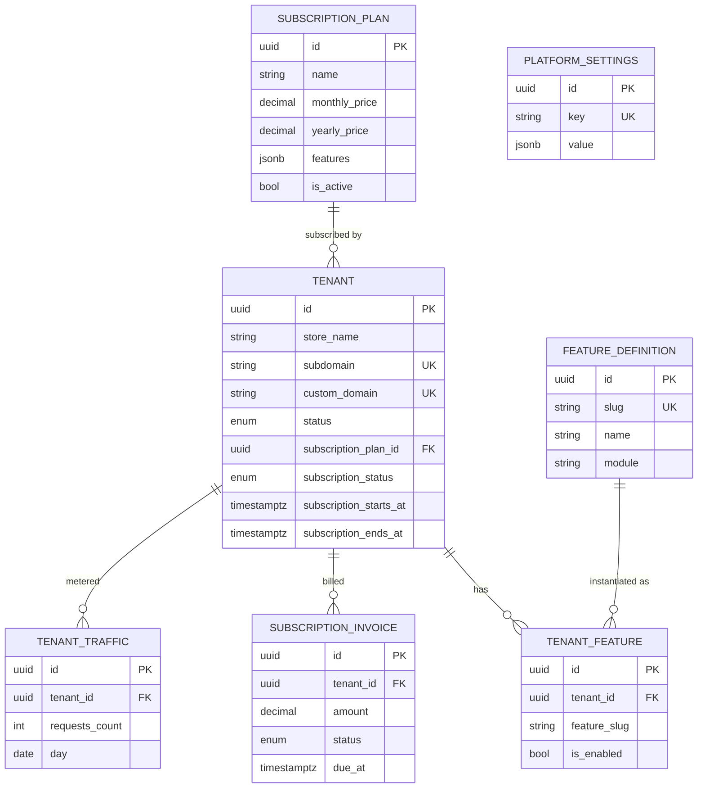

### 5.2 Identity & RBAC ERD

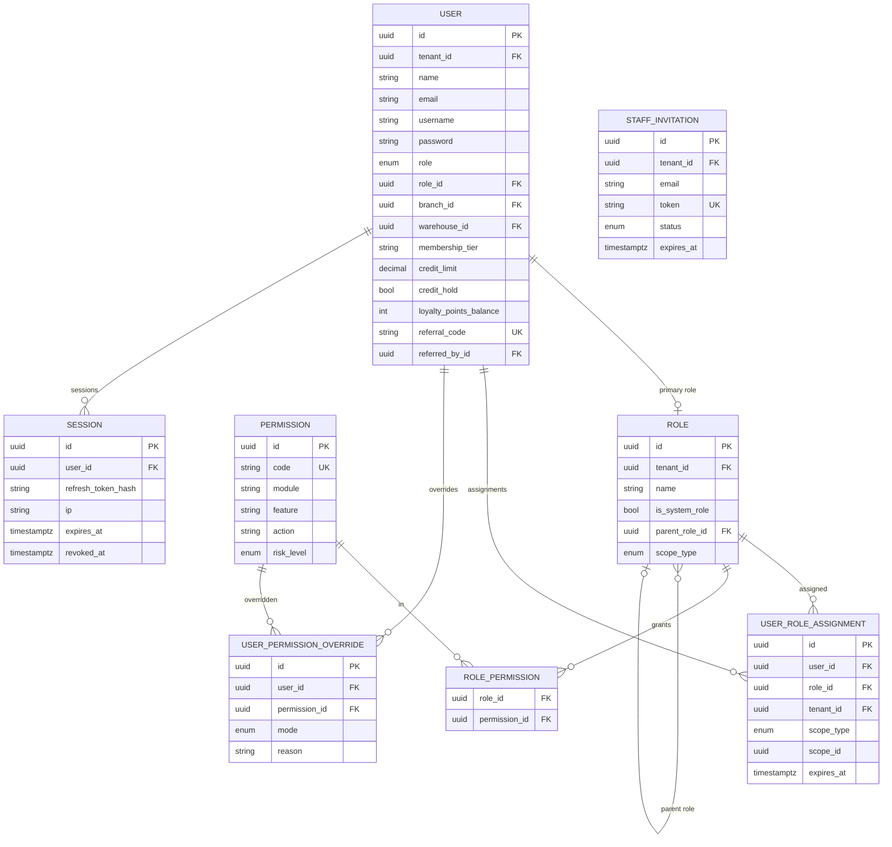

### 5.3 Catalog & Pricing ERD

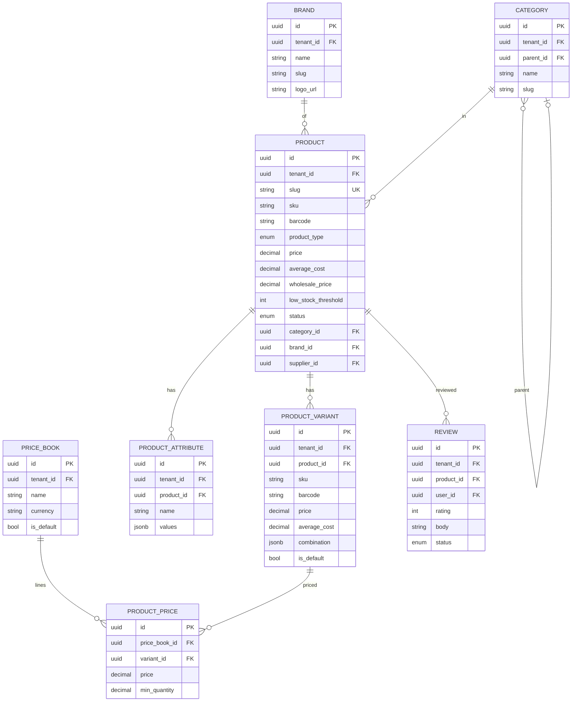

### 5.4 Sales: Orders · Returns · Payments · Cart ERD

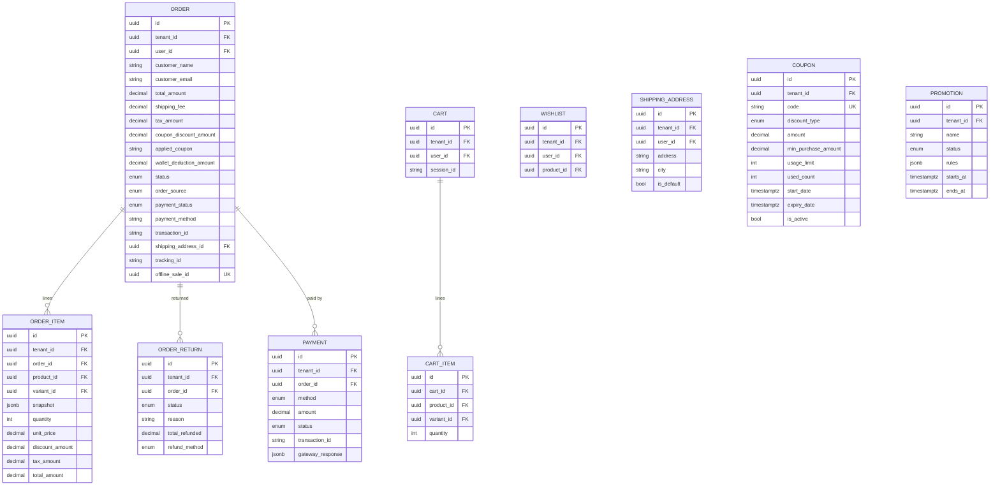

### 5.5 POS ERD

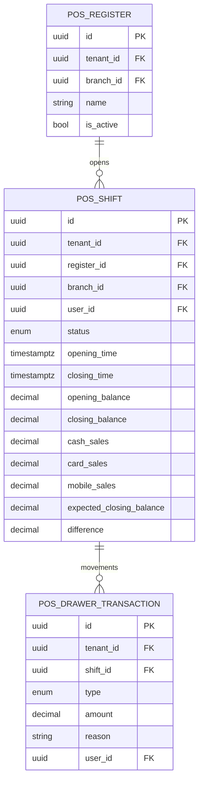

### 5.6 Inventory · WMS ERD

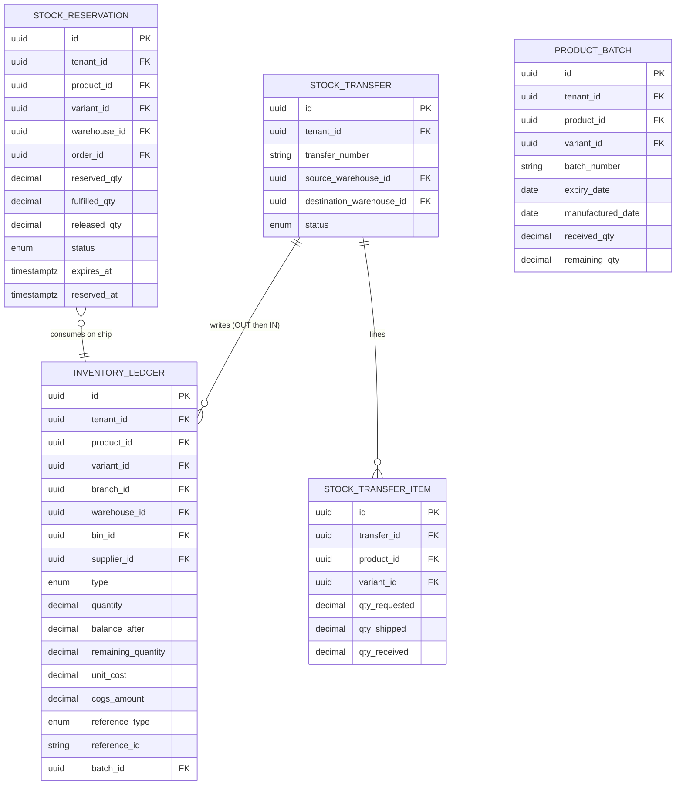

### 5.7 Procurement ERD

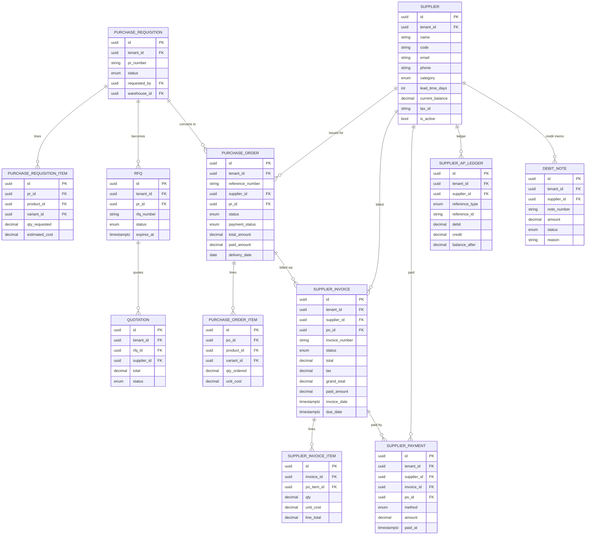

### 5.8 Finance / Accounting & Subledgers ERD

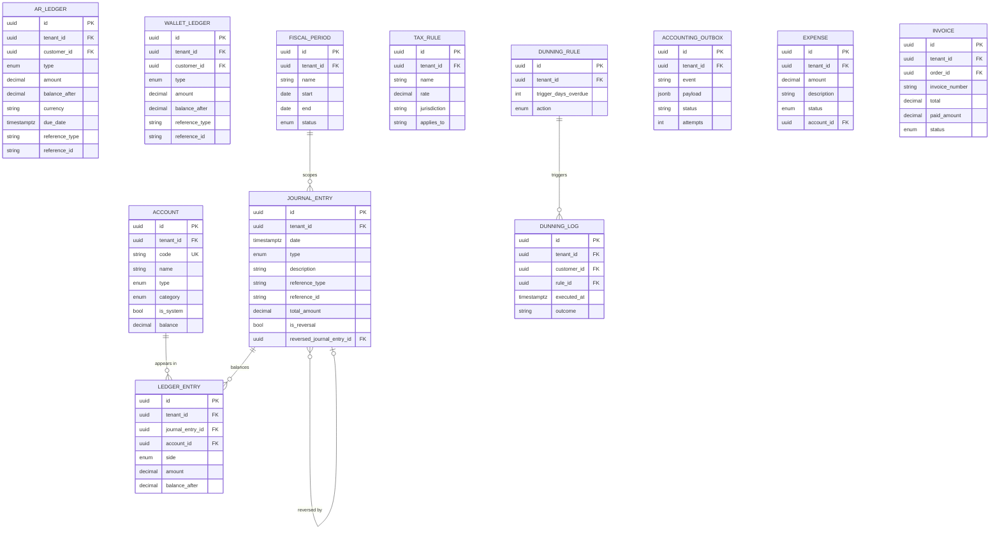

### 5.9 HRM ERD

```mermaid
erDiagram
  EMPLOYEE {
    uuid id PK
    uuid tenant_id FK
    uuid user_id FK
    string employee_id UK
    uuid department_id FK
    uuid designation_id FK
    uuid branch_id FK
    uuid manager_id FK
    enum status
    enum contract_type
    jsonb salary_config
    date joining_date
    date exit_date
  }
  EMPLOYEE_PERSONAL_DETAILS {
    uuid id PK
    uuid employee_id FK
    string national_id
    date dob
    string emergency_contact
  }
  EMPLOYEE_DOCUMENT {
    uuid id PK
    uuid employee_id FK
    string doc_type
    string url
  }
  DEPARTMENT {
    uuid id PK
    uuid tenant_id FK
    string name
  }
  DESIGNATION {
    uuid id PK
    uuid tenant_id FK
    string name
  }
  SHIFT {
    uuid id PK
    uuid tenant_id FK
    string name
    time start_time
    time end_time
  }
  EMPLOYEE_SHIFT_ASSIGNMENT {
    uuid id PK
    uuid employee_id FK
    uuid shift_id FK
    date effective_from
    date effective_to
  }
  ATTENDANCE_SESSION {
    uuid id PK
    uuid tenant_id FK
    uuid employee_id FK
    date date
    decimal hours_worked
    enum status
  }
  ATTENDANCE_EVENT {
    uuid id PK
    uuid tenant_id FK
    uuid employee_id FK
    enum type
    timestamptz punch_time
    jsonb geo
  }
  LEAVE_QUOTA {
    uuid id PK
    uuid tenant_id FK
    uuid employee_id FK
    string leave_type
    int total_days
    int used_days
  }
  LEAVE_REQUEST {
    uuid id PK
    uuid tenant_id FK
    uuid employee_id FK
    date start_date
    date end_date
    string leave_type
    enum status
  }
  PAYROLL_BATCH {
    uuid id PK
    uuid tenant_id FK
    string name
    string period
    decimal total_amount
    string status
    uuid journal_entry_id FK
  }
  PAYROLL_SLIP {
    uuid id PK
    uuid tenant_id FK
    uuid batch_id FK
    uuid employee_id FK
    decimal basic_salary
    decimal total_allowances
    decimal total_deductions
    decimal net_salary
    jsonb details
  }
  PERFORMANCE_REVIEW {
    uuid id PK
    uuid employee_id FK
    int rating
    string period
    string comments
  }
  JOB_POSTING {
    uuid id PK
    uuid tenant_id FK
    string title
    string description
    enum status
  }
  APPLICANT {
    uuid id PK
    uuid tenant_id FK
    uuid job_id FK
    string name
    string email
    string resume_url
    enum stage
  }
  INTERVIEW {
    uuid id PK
    uuid tenant_id FK
    uuid applicant_id FK
    timestamptz scheduled_at
    string outcome
  }

  EMPLOYEE ||--o| EMPLOYEE_PERSONAL_DETAILS  : "personal"
  EMPLOYEE ||--o{ EMPLOYEE_DOCUMENT          : "docs"
  EMPLOYEE }o--o| DEPARTMENT                 : "in"
  EMPLOYEE }o--o| DESIGNATION                : "as"
  EMPLOYEE ||--o{ EMPLOYEE_SHIFT_ASSIGNMENT  : "shifts"
  SHIFT ||--o{ EMPLOYEE_SHIFT_ASSIGNMENT     : "assigned"
  EMPLOYEE ||--o{ ATTENDANCE_SESSION         : "attendance"
  EMPLOYEE ||--o{ ATTENDANCE_EVENT           : "punches"
  EMPLOYEE ||--o{ LEAVE_QUOTA                : "quota"
  EMPLOYEE ||--o{ LEAVE_REQUEST              : "requests"
  EMPLOYEE ||--o{ PAYROLL_SLIP               : "slips"
  PAYROLL_BATCH ||--o{ PAYROLL_SLIP          : "aggregates"
  EMPLOYEE ||--o{ PERFORMANCE_REVIEW         : "reviews"
  JOB_POSTING ||--o{ APPLICANT               : "applicants"
  APPLICANT ||--o{ INTERVIEW                 : "interviews"
```

### 5.10 CRM ERD

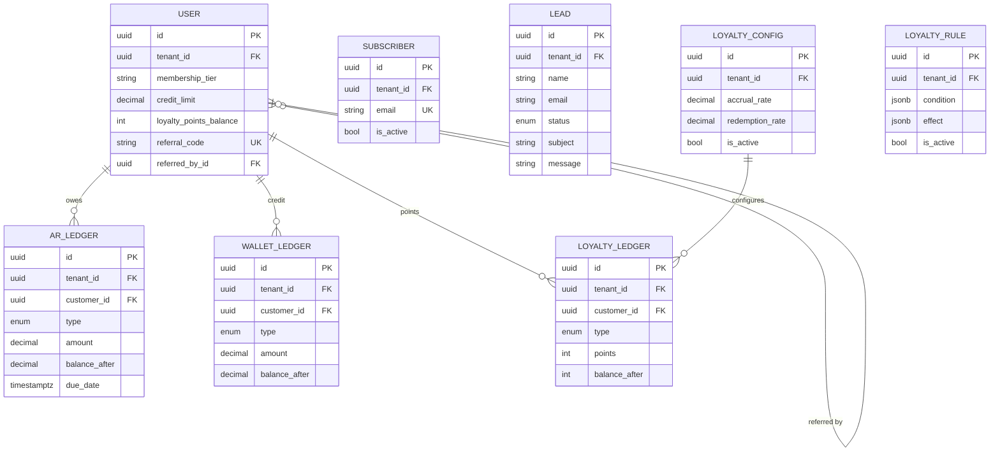

### 5.11 Marketing & Content ERD

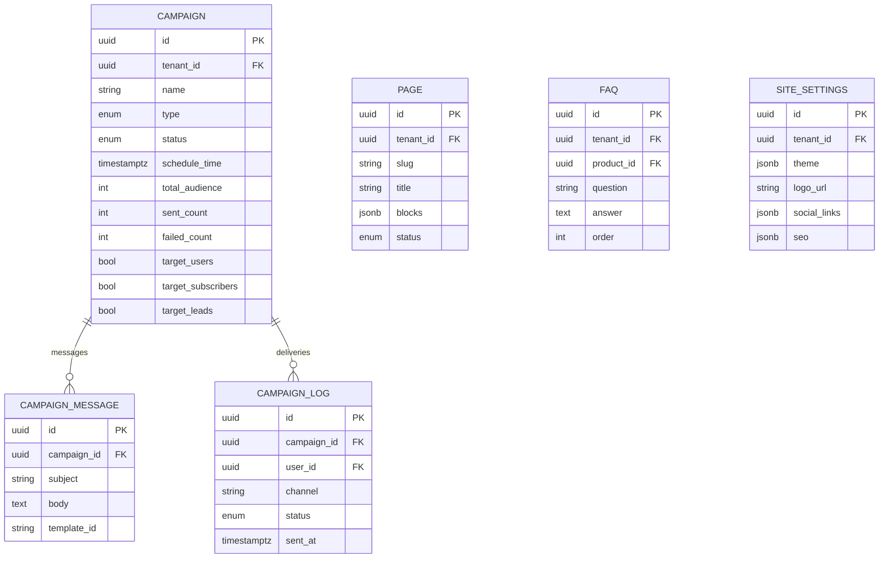

### 5.12 Logistics: Fulfillment & GRN ERD

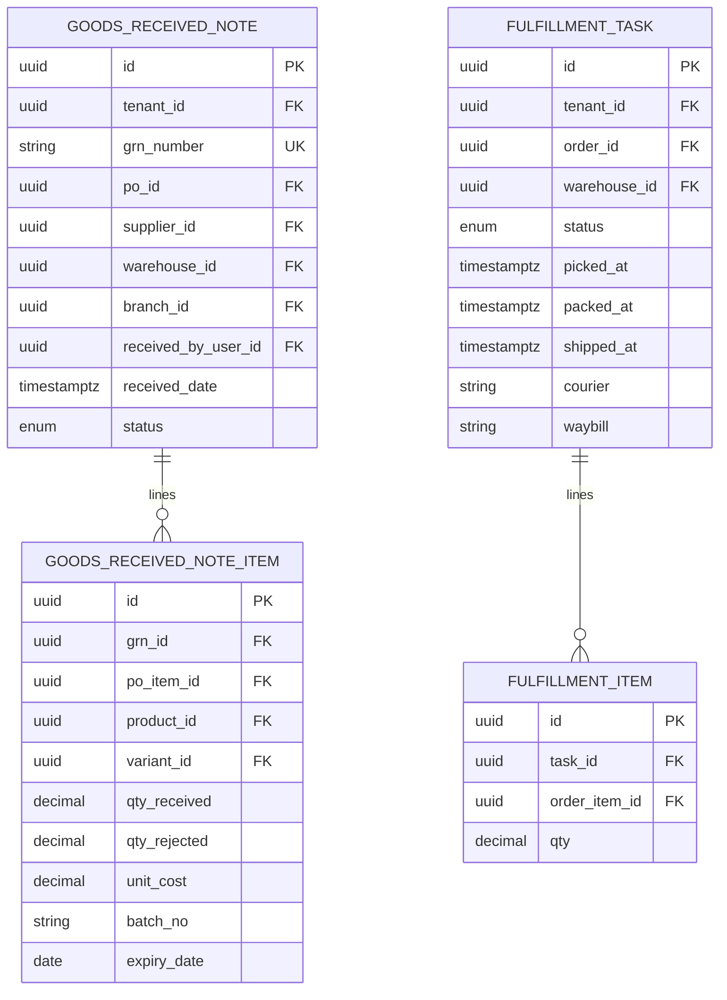

### 5.13 Infra ERD

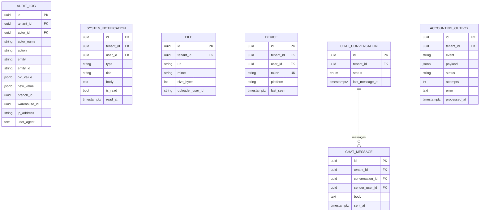

---

# Part III — Schemas

> Convention used in §6: each table is documented with **columns + indexes + constraints**. Inherited columns from `BaseEntity` (`id`, `created_at`, `updated_at`, `deleted_at`, `user_id`) are listed inline only where they carry domain meaning (e.g., the audit `user_id` for "who created this row"). Columns shown match the actual code in `server/src/modules/**/entities/*.entity.ts` and the migrations in `server/src/database/migrations/`.

## 6. Schema Definitions per Domain

### 6.1 System & Tenant Tables

#### `tenants`
| Column | Type | Constraint | Notes |
| --- | --- | --- | --- |
| `id` | uuid | PK | |
| `store_name` | varchar | NOT NULL | |
| `subdomain` | varchar | UNIQUE NOT NULL | Tenant resolution key |
| `custom_domain` | varchar | UNIQUE NULL | Optional vanity domain |
| `custom_domain_status` | enum | DEFAULT 'PENDING' | `PENDING` / `VERIFIED` / `FAILED` |
| `custom_domain_verified_at` | timestamptz | NULL | |
| `status` | enum | DEFAULT 'ACTIVE' | `ACTIVE` / `SUSPENDED` / `TRIAL` / `CANCELED` |
| `ssl_enabled` | bool | DEFAULT false | |
| `subscription_plan_id` | uuid | FK → `subscription_plans.id` NULL | |
| `subscription_billing_cycle` | enum | DEFAULT 'MONTHLY' | `MONTHLY` / `YEARLY` |
| `subscription_status` | enum | DEFAULT 'ACTIVE' | |
| `subscription_starts_at` | timestamptz | NULL | |
| `subscription_ends_at` | timestamptz | NULL | |
| `user_id` | uuid | FK → `users.id` NULL | Tenant owner (set after first admin signs up) |

#### `tenant_features`
| Column | Type | Constraint |
| --- | --- | --- |
| `id` | uuid | PK |
| `tenant_id` | uuid | FK → `tenants.id` ON DELETE CASCADE |
| `feature_slug` | varchar(100) | NOT NULL — matches `feature_definitions.slug` |
| `is_enabled` | bool | DEFAULT true |
| `enabled_by` | uuid | NULL |
| `enabled_at` | timestamptz | NULL |

Indexes: `UQ(tenant_id, feature_slug)`, `IDX(tenant_id)`.

#### `feature_definitions` (platform-level — not tenant-scoped)
| Column | Type |
| --- | --- |
| `id` | uuid PK |
| `slug` | varchar(100) UNIQUE — e.g. `pos`, `hrm.payroll`, `marketing.campaigns` |
| `name` | varchar(255) |
| `description` | text |
| `module` | varchar(100) |
| `default_enabled` | bool |

#### `platform_settings` (platform-level)
| Column | Type |
| --- | --- |
| `id` | uuid PK |
| `key` | varchar UNIQUE |
| `value` | jsonb |

#### `subscription_plans`
| Column | Type |
| --- | --- |
| `id` | uuid PK |
| `name` | varchar(255) |
| `description` | text NULL |
| `price` | decimal(10,2) |
| `monthly_price` | decimal(10,2) |
| `yearly_price` | decimal(10,2) |
| `billing_cycle` | enum DEFAULT 'MONTHLY' |
| `features` | jsonb DEFAULT '[]' |
| `is_active` | bool DEFAULT true |
| `is_popular` | bool DEFAULT false |

#### `subscription_invoices`
| Column | Type |
| --- | --- |
| `id` | uuid PK |
| `tenant_id` | uuid FK |
| `plan_id` | uuid FK |
| `amount` | decimal(10,2) |
| `currency` | varchar(10) |
| `status` | enum (`PENDING` / `PAID` / `FAILED` / `VOID`) |
| `due_at` | timestamptz |
| `paid_at` | timestamptz NULL |

#### `tenant_traffic` (platform-level analytics)
| Column | Type |
| --- | --- |
| `id` | uuid PK |
| `tenant_id` | uuid FK |
| `day` | date |
| `requests_count` | int |
| `errors_count` | int |
| `bytes_in` | bigint |
| `bytes_out` | bigint |

---

### 6.2 Identity & RBAC Tables

#### `users`
| Column | Type | Constraint | Notes |
| --- | --- | --- | --- |
| `id` | uuid | PK | |
| `tenant_id` | uuid | FK → `tenants.id` ON DELETE CASCADE NULL | Null for SUPER_ADMIN |
| `name` | varchar | NOT NULL | |
| `email` | varchar | NULL | |
| `username` | varchar | NOT NULL | |
| `password` | varchar | NOT NULL | bcrypt hash |
| `phone` | varchar | NULL | |
| `address` | text | NULL | |
| `image` | varchar | NULL | |
| `push_token`, `fcm_token` | varchar | NULL | |
| `is_admin` | bool | DEFAULT false | Platform super-admin flag |
| `is_email_verified` | bool | DEFAULT false | |
| `email_verification_token`, `reset_password_token` | varchar | NULL | |
| `reset_password_expires` | timestamptz | NULL | |
| `role` | enum | DEFAULT 'USER' | `SUPER_ADMIN` / `ADMIN` / `MANAGER` / `STAFF` / `USER` (customer) |
| `role_id` | uuid | FK → `roles.id` NULL | Primary role for the user |
| `status` | enum | DEFAULT 'ACTIVE' | |
| `refresh_token` | varchar | NULL | Last-rotated refresh token (hashed) |
| `branch_id` | uuid | FK → `branches.id` NULL | Default branch |
| `warehouse_id` | uuid | FK → `warehouses.id` NULL | Default warehouse |
| `preferred_branch_id` | uuid | NULL | Customer preference |
| `credit_limit` | decimal(12,2) | DEFAULT 0 | AR credit limit |
| `credit_hold` | bool | DEFAULT false | |
| `membership_tier` | varchar(20) | DEFAULT 'BRONZE' | `BRONZE`/`SILVER`/`GOLD`/`PLATINUM` |
| `referral_code` | varchar(50) | UNIQUE (partial: where not null) | |
| `referred_by_id` | uuid | FK → `users.id` NULL | |
| `loyalty_points_balance` | int | DEFAULT 0 | Cached; ledger is source of truth |
| `tax_id`, `company_name`, `customer_code` | varchar | NULL | B2B customers |

Indexes:
- `UQ(email, tenant_id)`, `UQ(username, tenant_id)`, `IDX(tenant_id)`, `IDX(branch_id)`, `IDX(warehouse_id)`, `IDX(referral_code) WHERE referral_code IS NOT NULL`.

#### `sessions`
| Column | Type |
| --- | --- |
| `id` | uuid PK |
| `tenant_id` | uuid NULL |
| `user_id` | uuid FK |
| `refresh_token_hash` | varchar |
| `ip` | varchar(45) |
| `user_agent` | text |
| `expires_at` | timestamptz |
| `revoked_at` | timestamptz NULL |

#### `roles`
| Column | Type |
| --- | --- |
| `id` | uuid PK |
| `name` | varchar |
| `description` | text NULL |
| `is_system_default` | bool DEFAULT false (deprecated) |
| `is_system_role` | bool DEFAULT false |
| `parent_role_id` | uuid FK → `roles.id` NULL — for permission inheritance |
| `scope_type` | enum DEFAULT 'GLOBAL' (`GLOBAL`/`BRANCH`/`WAREHOUSE`) |
| `tenant_id` | uuid FK NULL — system roles have NULL |

Indexes: `UQ(name, tenant_id)`.

#### `permissions` (platform-seeded)
| Column | Type |
| --- | --- |
| `id` | uuid PK |
| `code` | varchar UNIQUE — slug `feature:action` |
| `name` | varchar |
| `description` | varchar NULL |
| `module` | varchar |
| `feature` | varchar(100) NULL — matches `feature_definitions.slug` |
| `action` | varchar(100) NULL |
| `risk_level` | enum DEFAULT 'LOW' (`LOW`/`MEDIUM`/`HIGH`/`CRITICAL`) |

#### `role_permissions` (join table, generated by TypeORM `@ManyToMany`)
| Column | Type |
| --- | --- |
| `role_id` | uuid PK FK |
| `permission_id` | uuid PK FK |

#### `user_role_assignments`
| Column | Type |
| --- | --- |
| `id` | uuid PK |
| `user_id` | uuid FK |
| `role_id` | uuid FK |
| `tenant_id` | uuid FK |
| `scope_type` | enum DEFAULT 'GLOBAL' |
| `scope_id` | uuid NULL — branch_id or warehouse_id |
| `assigned_by` | uuid NULL |
| `expires_at` | timestamptz NULL |
| `assigned_at` | timestamptz |

Indexes: `UQ(user_id, role_id, scope_id)`, `IDX(user_id, tenant_id)`.

#### `user_permission_overrides`
| Column | Type |
| --- | --- |
| `id` | uuid PK |
| `user_id` | uuid FK |
| `permission_id` | uuid FK |
| `mode` | enum (`ALLOW`/`DENY`) |
| `reason` | text NULL |
| `tenant_id` | uuid FK |

Indexes: `UQ(user_id, permission_id)`.

#### `staff_invitations`
| Column | Type |
| --- | --- |
| `id` | uuid PK |
| `tenant_id` | uuid FK |
| `email` | varchar |
| `role_id` | uuid FK |
| `token` | varchar UNIQUE |
| `status` | enum (`PENDING`/`ACCEPTED`/`EXPIRED`/`REVOKED`) |
| `expires_at` | timestamptz |
| `invited_by` | uuid FK → `users.id` |

---

### 6.3 Organization Tables

#### `branches`
| Column | Type |
| --- | --- |
| `id` | uuid PK |
| `tenant_id` | uuid FK |
| `name` | varchar |
| `code` | varchar UNIQUE |
| `address` | text NULL |
| `phone` | varchar(20) NULL |
| `email` | varchar(100) NULL |
| `is_active` | bool DEFAULT true |
| `ip_whitelist` | text NULL |

> ⚠ **Note:** `code` is globally unique in current code. Should be `(tenant_id, code)` unique — flagged in §13 as planned correction.

#### `warehouses`
| Column | Type |
| --- | --- |
| `id` | uuid PK |
| `tenant_id` | uuid FK |
| `branch_id` | uuid FK NULL — central warehouses have null |
| `name` | varchar |
| `code` | varchar UNIQUE |
| `location_type` | enum DEFAULT 'CENTRAL' (`CENTRAL`/`MAIN`/`TRANSIT`/`RETURN`/`RETAIL`) |
| `address` | text NULL |
| `is_active` | bool DEFAULT true |
| `ip_whitelist` | text NULL |

#### `warehouse_bins`
| Column | Type |
| --- | --- |
| `id` | uuid PK |
| `warehouse_id` | uuid FK |
| `zone` | varchar |
| `bin_code` | varchar |

Indexes: `UQ(warehouse_id, bin_code)`.

---

### 6.4 Catalog & Pricing Tables

#### `products`
| Column | Type | Notes |
| --- | --- | --- |
| `id` | uuid PK | |
| `tenant_id` | uuid FK | |
| `slug` | varchar UNIQUE | ⚠ globally unique today; should be tenant-scoped (see §13) |
| `sku` | varchar(100) NULL | |
| `barcode` | varchar(100) NULL | |
| `product_type` | enum DEFAULT 'SIMPLE' (`SIMPLE`/`VARIABLE`/`BUNDLE`/`SERVICE`) | |
| `name` | varchar | |
| `description` | text | |
| `short_description` | text NULL | |
| `price` | decimal(10,2) | base price |
| `average_cost` | decimal(10,2) DEFAULT 0 | moving average cost |
| `wholesale_price` | decimal(10,2) DEFAULT 0 NULL | |
| `min_wholesale_qty` | int DEFAULT 1 NULL | |
| `tax_rate` | decimal(5,2) DEFAULT 0 NULL | percentage |
| `discount_amount`, `discount_type` | decimal, enum | |
| `low_stock_threshold` | int DEFAULT 5 | |
| `status` | enum DEFAULT 'INACTIVE' | |
| `category_id`, `brand_id`, `supplier_id`, `landing_page_id` | uuid FK NULL | |
| `images` | text[] | simple-array column |
| `is_review` | bool DEFAULT true | |
| `meta_title`, `meta_description`, `og_image` | varchar/text | SEO |
| `is_new`, `is_hot`, `is_sale` | bool DEFAULT false | |
| `faq_source`, `faq_ids` | varchar, text[] | |

Indexes: `IDX(slug)`, `IDX(tenant_id, status)`, `IDX(tenant_id, created_at)`, `IDX(category_id)`, `IDX(brand_id)`, `IDX(tenant_id)`.

#### `product_variants`
| Column | Type |
| --- | --- |
| `id` | uuid PK |
| `tenant_id` | uuid |
| `product_id` | uuid FK ON DELETE CASCADE |
| `sku` | varchar(255) |
| `barcode` | varchar(100) NULL |
| `price` | decimal(10,2) NULL |
| `average_cost` | decimal(10,2) DEFAULT 0 |
| `wholesale_price` | decimal(10,2) NULL |
| `is_default` | bool DEFAULT false |
| `low_stock_threshold` | int DEFAULT 5 |
| `images` | text[] |
| `combination` | jsonb — e.g. `{"Color":"Red","Size":"XL"}` |

Indexes: `UQ(sku, tenant_id)`, `IDX(product_id)`, `IDX(tenant_id)`.

#### `product_attributes`
Same-product attribute schema (e.g., `Color`, `Size`) with allowed values stored as JSONB.

#### `brands`
| Column | Type |
| --- | --- |
| `id` | uuid PK |
| `tenant_id` | uuid FK |
| `name` | varchar |
| `slug` | varchar |
| `logo_url` | varchar NULL |
| `is_active` | bool DEFAULT true |

#### `categories`
Hierarchical: `parent_id` self-FK, `slug`, `path` (LTREE / dotted-path text).

#### `price_books`
Per-tenant named price books with currency.

#### `product_prices` (price book line items)
Tier pricing — `(price_book_id, variant_id, min_quantity)` triple key for tier resolution.

#### `reviews`
Customer reviews on products with moderation status.

---

### 6.5 Sales · POS · Coupon · Promotion Tables

#### `orders`
| Column | Type | Notes |
| --- | --- | --- |
| `id` | uuid PK | |
| `tenant_id` | uuid FK ON DELETE CASCADE | |
| `user_id` | uuid FK NULL | Customer (nullable for guest checkouts) |
| `customer_name`, `customer_email`, `customer_phone` | varchar | Snapshot |
| `address` | text | Snapshot of shipping address |
| `shipping_address_id` | uuid FK NULL | Reference to saved address |
| `total_amount` | decimal(10,2) | |
| `shipping_fee` | decimal(10,2) DEFAULT 0 | |
| `tax_amount` | decimal(10,2) DEFAULT 0 | |
| `coupon_discount_amount` | decimal(10,2) DEFAULT 0 | |
| `applied_coupon` | varchar(50) NULL | snapshot of coupon code |
| `wallet_deduction_amount` | decimal(10,2) DEFAULT 0 | |
| `currency` | varchar(10) DEFAULT 'BDT' | |
| `currency_rate` | decimal(10,4) DEFAULT 1 | FX snapshot |
| `status` | enum DEFAULT 'PENDING' | `PENDING`/`CONFIRMED`/`PAID`/`SHIPPED`/`DELIVERED`/`CANCELED`/`RETURNED` |
| `order_source` | enum DEFAULT 'WEBSITE' | `WEBSITE`/`POS`/`API`/`ADMIN` |
| `payment_method` | varchar(50) NULL | |
| `payment_status` | enum DEFAULT 'PENDING' | |
| `transaction_id` | varchar(255) NULL | Gateway ref |
| `tracking_id`, `courier_status` | varchar | |
| `delivery_zone` | varchar(50) NULL | |
| `order_notes` | text NULL | |
| `offline_sale_id` | uuid UNIQUE NULL | POS idempotency key |
| `payments` | jsonb NULL | Multi-payment snapshot |

Indexes: `IDX(tenant_id, created_at)`, `IDX(tenant_id, status)`, `UQ(offline_sale_id)` (implicit from UNIQUE).

#### `order_items`
| Column | Type |
| --- | --- |
| `id` | uuid PK |
| `order_id` | uuid FK ON DELETE CASCADE |
| `tenant_id` | uuid FK |
| `product_id` | uuid FK |
| `variant_id` | uuid FK NULL |
| `snapshot` | jsonb — full product snapshot at sale time |
| `quantity` | int |
| `unit_price` | decimal(10,2) |
| `discount_amount` | decimal(10,2) DEFAULT 0 |
| `tax_amount` | decimal(10,2) DEFAULT 0 |
| `total_amount` | decimal(10,2) |

#### `order_returns`
| Column | Type |
| --- | --- |
| `id` | uuid PK |
| `tenant_id` | uuid FK |
| `order_id` | uuid FK |
| `status` | enum (`PENDING`/`APPROVED`/`REJECTED`/`REFUNDED`) |
| `reason` | text |
| `total_refunded` | decimal(10,2) |
| `refund_method` | enum (`CASH`/`WALLET`/`ORIGINAL`) |

#### `payments`
| Column | Type |
| --- | --- |
| `id` | uuid PK |
| `tenant_id` | uuid FK |
| `order_id` | uuid FK ON DELETE CASCADE |
| `transaction_id` | varchar(255) — gateway ref |
| `amount` | decimal(10,2) |
| `currency` | varchar(10) DEFAULT 'BDT' |
| `method` | enum (`CASH`/`CARD`/`MOBILE`/`WALLET`/`BANK`/`COD`/`ACCOUNT`) |
| `status` | enum DEFAULT 'PENDING' |
| `gateway_response` | jsonb NULL |

Indexes: `IDX(tenant_id, created_at)`, `IDX(tenant_id, status, created_at)`, `IDX(transaction_id)`.

#### `coupons`
| Column | Type |
| --- | --- |
| `id` | uuid PK |
| `tenant_id` | uuid FK |
| `code` | varchar(50) |
| `description` | varchar(255) NULL |
| `discount_type` | enum DEFAULT 'PERCENTAGE' (`PERCENTAGE`/`FIXED`/`FREE_SHIPPING`) |
| `amount` | decimal(10,2) |
| `min_purchase_amount` | decimal(10,2) DEFAULT 0 |
| `start_date`, `expiry_date` | timestamp NULL |
| `usage_limit` | int NULL |
| `used_count` | int DEFAULT 0 |
| `is_active` | bool DEFAULT true |

Indexes: `UQ(tenant_id, code)`, `IDX(tenant_id, is_active, expiry_date)`.

#### `promotions`
Server-side automatic promotion engine; `rules` JSONB schema described in LLD §26.4.

#### `carts`, `cart_items`
Persistent session/user carts.

#### `wishlists`
Customer wishlists. Unique on `(user_id, product_id, tenant_id)`.

#### `shipping_addresses`
Customer's saved addresses; `is_default` flag.

#### `pos_registers`
| Column | Type |
| --- | --- |
| `id` | uuid PK |
| `tenant_id` | uuid FK |
| `branch_id` | uuid FK |
| `name` | varchar |
| `is_active` | bool DEFAULT true |

#### `pos_shifts`
| Column | Type |
| --- | --- |
| `id` | uuid PK |
| `tenant_id` | uuid FK |
| `register_id` | uuid FK |
| `branch_id` | uuid FK NULL |
| `user_id` | uuid FK |
| `status` | enum (`OPEN`/`CLOSED`) DEFAULT 'OPEN' |
| `opening_time` | timestamptz DEFAULT now() |
| `closing_time` | timestamptz NULL |
| `opening_balance` | decimal(12,2) DEFAULT 0 |
| `closing_balance` | decimal(12,2) NULL |
| `cash_sales`, `card_sales`, `mobile_sales` | decimal(12,2) DEFAULT 0 |
| `expected_closing_balance` | decimal(12,2) DEFAULT 0 |
| `difference` | decimal(12,2) NULL — variance |
| `cash_in`, `cash_out` | decimal(12,2) DEFAULT 0 |
| `remarks` | text NULL |

Recommended (not yet in code): partial unique index `UQ(tenant_id, user_id) WHERE status='OPEN'` to enforce one-open-shift invariant.

#### `pos_drawer_transactions`
| Column | Type |
| --- | --- |
| `id` | uuid PK |
| `tenant_id` | uuid FK |
| `shift_id` | uuid FK ON DELETE CASCADE |
| `type` | enum (`CASH_IN`/`CASH_OUT`/`PAYOUT`/`DROP`) |
| `amount` | decimal(12,2) |
| `reason` | varchar |
| `user_id` | uuid FK |

---

### 6.6 Inventory & WMS Tables

#### `inventory_ledger` (append-only — see §7)
| Column | Type | Notes |
| --- | --- | --- |
| `id` | uuid PK | |
| `tenant_id` | uuid FK | |
| `product_id` | uuid FK ON DELETE CASCADE | |
| `variant_id` | uuid FK NULL | |
| `branch_id` | uuid FK NULL | reporting dimension |
| `warehouse_id` | uuid FK NULL | owning location |
| `bin_id` | uuid FK NULL | |
| `supplier_id` | uuid FK NULL | populated on PURCHASE rows |
| `user_id` | uuid FK NULL | who recorded (from BaseEntity) |
| `type` | enum | `PURCHASE`/`SALE`/`RESERVATION`/`RESERVATION_CANCEL`/`TRANSFER_OUT`/`TRANSFER_IN`/`ADJUSTMENT_IN`/`ADJUSTMENT_OUT`/`RETURN_IN`/`RETURN_OUT` |
| `quantity` | decimal(12,2) | signed |
| `balance_after` | decimal(12,2) | snapshot running on-hand |
| `remaining_quantity` | decimal(12,2) | for FIFO layer tracking |
| `unit_cost` | decimal(15,2) DEFAULT 0 | |
| `cogs_amount` | decimal(15,2) DEFAULT 0 | computed for SALE rows |
| `reference_type` | enum | `ORDER`/`GRN`/`TRANSFER`/`ADJUSTMENT`/`RETURN`/`OPENING_STOCK` |
| `reference_id` | varchar(255) NULL | UUID or document number |
| `batch_id` | uuid FK NULL | |
| `remarks` | text NULL | |

Indexes: `IDX(tenant_id, created_at)`, `IDX(product_id, warehouse_id, created_at)`, `IDX(product_id)`, `IDX(variant_id)`, `IDX(branch_id)`, `IDX(warehouse_id)`, `IDX(batch_id)`, `IDX(type)`.

**Invariants:** never UPDATE or DELETE. Corrections are new rows (`ADJUSTMENT_IN` / `ADJUSTMENT_OUT`) tied to an approval record.

#### `stock_reservations`
| Column | Type |
| --- | --- |
| `id` | uuid PK |
| `tenant_id` | uuid FK |
| `product_id` | uuid FK |
| `variant_id` | uuid FK NULL |
| `warehouse_id` | uuid FK NULL |
| `order_id` | uuid FK NULL |
| `reserved_qty` | decimal(12,2) — original, never mutated |
| `fulfilled_qty` | decimal(12,2) DEFAULT 0 |
| `released_qty` | decimal(12,2) DEFAULT 0 |
| `status` | enum (`ACTIVE`/`FULFILLED`/`RELEASED`/`EXPIRED`) DEFAULT 'ACTIVE' |
| `expires_at` | timestamptz NULL |
| `reserved_at` | timestamptz DEFAULT now() |
| `released_at` | timestamptz NULL |
| `notes` | text NULL |

Indexes: `UQ(tenant_id, order_id, product_id, variant_id)`, `IDX(tenant_id, status)`, `IDX(product_id, variant_id, tenant_id, status)`, `IDX(expires_at)`.

#### `stock_transfers`, `stock_transfer_items`
Multi-step movement document; lifecycle `DRAFT → APPROVED → IN_TRANSIT → RECEIVED` (or `CANCELED`). Each transition can write `inventory_ledger` rows (`TRANSFER_OUT` at ship, `TRANSFER_IN` at receive).

#### `product_batches`
For pharmaceutical / perishable products with batch + expiry tracking. FEFO consumption is driven by `expiry_date`.

---

### 6.7 Procurement Tables

#### `suppliers`
| Column | Type |
| --- | --- |
| `id` | uuid PK |
| `tenant_id` | uuid FK |
| `name` | varchar |
| `contact_name`, `contact_person` | varchar NULL |
| `email`, `phone` | varchar NULL |
| `address` | text NULL |
| `category` | enum DEFAULT 'OTHER' |
| `rating` | decimal(3,2) DEFAULT 0 |
| `lead_time_days` | int DEFAULT 0 |
| `is_active` | bool DEFAULT true |
| `code` | varchar NULL |
| `tax_id` | varchar NULL |
| `opening_balance`, `current_balance` | decimal(12,2) DEFAULT 0 |
| `status` | varchar DEFAULT 'ACTIVE' |
| `performance` | jsonb NULL — `{onTimeDeliveryRate, fulfillmentRate, qualityScore}` |

Indexes: `IDX(tenant_id, name)`, `IDX(email)`.

#### `supplier_documents`
Attached supplier documents (contracts, tax certificates) with `file_id` link.

#### `supplier_ap_ledger` (append-only)
| Column | Type |
| --- | --- |
| `id` | uuid PK |
| `tenant_id` | uuid FK |
| `supplier_id` | uuid FK |
| `reference_type` | enum (`PO_ACCRUAL`/`GRN`/`INVOICE`/`PAYMENT`/`DEBIT_NOTE`/`OPENING`/`ADJUSTMENT`) |
| `reference_id` | uuid NULL |
| `debit` | decimal(12,2) DEFAULT 0 |
| `credit` | decimal(12,2) DEFAULT 0 |
| `balance_after` | decimal(12,2) DEFAULT 0 |
| `remarks` | text NULL |

#### `purchase_requisitions`, `purchase_requisition_items`
Internal purchase request. PR → approved → RFQ.

#### `rfqs`, `quotations`
RFQ sent to multiple suppliers; quotations come back, one is awarded.

#### `purchase_orders`
| Column | Type |
| --- | --- |
| `id` | uuid PK |
| `tenant_id` | uuid FK |
| `reference_number` | varchar(255) |
| `supplier_id` | uuid FK |
| `pr_id` | uuid NULL |
| `status` | enum DEFAULT 'DRAFT' (`DRAFT`/`SENT`/`APPROVED`/`PARTIAL`/`RECEIVED`/`CANCELED`) |
| `payment_status` | enum DEFAULT 'PENDING' (`PENDING`/`PARTIAL`/`PAID`) |
| `total_amount` | decimal(10,2) DEFAULT 0 |
| `paid_amount` | decimal(10,2) DEFAULT 0 |
| `delivery_date` | date NULL |

Indexes: `IDX(tenant_id, created_at)`, `IDX(tenant_id, status)`, `IDX(supplier_id)`, `IDX(reference_number)`, `IDX(status)`, `IDX(payment_status)`.

#### `purchase_order_items`
Lines of a PO with `qty_ordered`, `unit_cost`, `qty_received` (running count).

#### `supplier_invoices`, `supplier_invoice_items`
Vendor's invoice document. 3-way matched against PO + GRN before payment.

#### `supplier_payments`
Recorded payments to a supplier. Updates `supplier_ap_ledger` and posts journal.

#### `debit_notes`
Returns to suppliers / credit memos. Reduces AP.

---

### 6.8 Logistics: GRN & Fulfillment Tables

#### `goods_received_notes`
| Column | Type |
| --- | --- |
| `id` | uuid PK |
| `tenant_id` | uuid FK |
| `grn_number` | varchar(50) UNIQUE |
| `po_id` | uuid FK |
| `supplier_id` | uuid FK |
| `warehouse_id` | uuid FK |
| `branch_id` | uuid FK |
| `received_by_user_id` | uuid FK |
| `received_date` | timestamp |
| `status` | enum DEFAULT 'DRAFT' (`DRAFT`/`PENDING`/`VERIFIED`/`REJECTED`) |
| `notes` | text NULL |

Indexes: `IDX(tenant_id, status)`, `IDX(po_id)`, `IDX(supplier_id)`.

#### `goods_received_note_items`
GRN lines with `qty_received`, `qty_rejected`, `unit_cost`, optional `batch_no` + `expiry_date`.

#### `fulfillment_tasks`
| Column | Type |
| --- | --- |
| `id` | uuid PK |
| `tenant_id` | uuid FK |
| `order_id` | uuid FK |
| `warehouse_id` | uuid FK |
| `status` | enum (`PENDING`/`PICKING`/`PICKED`/`PACKING`/`PACKED`/`SHIPPED`/`COMPLETED`/`CANCELED`) |
| `picked_at`, `packed_at`, `shipped_at` | timestamptz NULL |
| `courier`, `waybill` | varchar NULL |

#### `fulfillment_items`
Per-line link `(fulfillment_task_id, order_item_id, qty)`. Supports split shipments (one order_item → multiple tasks).

---

### 6.9 Finance / Accounting Tables

#### `accounts`
| Column | Type |
| --- | --- |
| `id` | uuid PK |
| `tenant_id` | uuid FK |
| `code` | varchar(50) |
| `name` | varchar(255) |
| `type` | enum (`ASSET`/`LIABILITY`/`EQUITY`/`REVENUE`/`EXPENSE`) |
| `category` | enum (granular subcategory) |
| `is_active` | bool DEFAULT true |
| `is_system` | bool DEFAULT false — protected accounts (Inventory, COGS) |
| `balance` | decimal(15,2) DEFAULT 0 — cached, recomputed from ledger |
| `description` | text NULL |

Indexes: `UQ(tenant_id, code)`.

#### `journal_entries` (immutable — see §7)
| Column | Type |
| --- | --- |
| `id` | uuid PK |
| `tenant_id` | uuid FK |
| `date` | timestamptz DEFAULT now() |
| `type` | enum (`SALE`/`PURCHASE`/`PAYMENT`/`PAYROLL`/`EXPENSE`/`ADJUSTMENT`/`REVERSAL`/`MANUAL`) |
| `description` | varchar(255) |
| `reference_type`, `reference_id` | varchar | source document |
| `total_amount` | decimal(15,2) — sum of DR side |
| `is_reversal` | bool DEFAULT false |
| `reversed_journal_entry_id` | uuid FK NULL |

Indexes: `IDX(tenant_id, date)`.

**Invariants:** `@BeforeUpdate`/`@BeforeRemove` throw at ORM. To revert, post a new journal with `is_reversal=true`.

#### `ledger_entries` (immutable — see §7)
| Column | Type |
| --- | --- |
| `id` | uuid PK |
| `tenant_id` | uuid FK |
| `journal_entry_id` | uuid FK ON DELETE CASCADE |
| `account_id` | uuid FK |
| `side` | enum (`DEBIT`/`CREDIT`) |
| `amount` | decimal(15,2) |
| `balance_after` | decimal(15,2) — running balance per account |

Indexes: `IDX(tenant_id, account_id)`.

#### `ar_ledger` (append-only)
Per-customer AR transactions. Columns: `type` (INVOICE/PAYMENT/CREDIT_NOTE/ADJUSTMENT/WRITE_OFF), `amount` (±), `balance_after`, `currency`, `due_date`, `reference_type`, `reference_id`, `created_by`.

#### `wallet_ledger` (append-only)
Per-customer store credit ledger. `type` (CREDIT/DEBIT/EXPIRY/REFUND), signed `amount`, `balance_after`, `reference_type`, `reference_id`, `created_by`.

#### `fiscal_periods`
Bookkeeping windows: `name` (e.g., `2026-Q1`), `start`, `end`, `status` (`OPEN`/`CLOSED`). Postings to closed periods are rejected.

#### `tax_rules`
Tenant-defined tax rates and jurisdictions. Used by `TaxService.computeForOrder`.

#### `dunning_rules`, `dunning_logs`
Automated AR reminders. Rules trigger based on days overdue; logs record each action taken per customer.

#### `accounting_outbox`
Specialized outbox for accounting events. Columns: `event` (e.g., `OrderPaid`), `payload` jsonb, `status` (`PENDING`/`PROCESSED`/`FAILED`), `attempts`, `error`, `processed_at`.

Indexes: `IDX(status, created_at)`, `IDX(tenant_id, status)`.

#### `expenses`
General business expenses (rent, utilities). Approval workflow + journal posting on approve.

#### `invoices`
Sales invoices linked to orders (especially B2B credit sales). Tracks `paid_amount`, `status`.

---

### 6.10 HRM Tables

#### `employees`
| Column | Type |
| --- | --- |
| `id` | uuid PK |
| `tenant_id` | uuid FK |
| `user_id` | uuid FK NULL — links to a portal-login user (OneToOne) |
| `employee_id` | varchar UNIQUE NULL — human-readable HR ID |
| `department_id`, `designation_id`, `branch_id`, `manager_id` | uuid FK |
| `status` | enum DEFAULT 'PROBATION' (`ACTIVE`/`PROBATION`/`ON_LEAVE`/`INACTIVE`/`TERMINATED`) |
| `contract_type` | enum DEFAULT 'FULL_TIME' (`FULL_TIME`/`PART_TIME`/`CONTRACTOR`/`INTERN`) |
| `salary_config` | jsonb — `{ basicSalary, allowances[], deductions[] }` |
| `joining_date` | date |
| `exit_date` | date NULL |

#### `employee_personal_details`
Sensitive PII (NID, DOB, emergency contact). Strict permission gate.

#### `employee_documents`
Uploaded HR documents linked to `files`.

#### `departments`, `designations`, `shifts`
Master data for HR.

#### `employee_shift_assignments`
Assigns employees to shifts over a date range.

#### `attendance_sessions`
Daily attendance summary per employee — derived from `attendance_events`.

#### `attendance_events`
Raw GPS-geofenced punch events (IN/OUT/BREAK).

#### `leave_quotas`, `leave_requests`
Leave entitlements + approval workflow.

#### `payroll_batches`
| Column | Type |
| --- | --- |
| `id` | uuid PK |
| `tenant_id` | uuid FK |
| `name` | varchar — e.g. `May 2026 Payroll` |
| `period` | varchar — e.g. `2026-05` |
| `total_amount` | decimal(15,2) DEFAULT 0 |
| `status` | enum (`DRAFT`/`APPROVED`/`PAID`/`CANCELLED`) DEFAULT 'DRAFT' |
| `journal_entry_id` | uuid FK NULL — posted on approve |

#### `payroll_slips`
Per-employee slip with `basic_salary`, `total_allowances`, `total_deductions`, `net_salary`, plus full `details` jsonb breakdown (allowances/deductions/overtime/leave/tax).

#### `performance_reviews`
Periodic reviews with rating + comments.

#### `job_postings`, `applicants`, `interviews`
Recruitment workflow.

---

### 6.11 CRM Tables (Customer · Subscriber · Lead · Loyalty · Wallet)

The CRM "customer" is `users` rows with `role = USER`. There is no separate `customers` table — the consolidated `users` table holds both staff and customers with role-based fields:
- `membership_tier`, `credit_limit`, `credit_hold`, `loyalty_points_balance`, `referral_code`, `referred_by_id`, `customer_code`, `company_name`, `tax_id`.

#### `subscribers`
Email newsletter subscribers (may or may not be `users`).
| Column | Type |
| --- | --- |
| `id` | uuid PK |
| `tenant_id` | uuid FK |
| `email` | varchar UNIQUE per tenant |
| `is_active` | bool DEFAULT true |
| `source` | varchar NULL — `STOREFRONT_FOOTER`/`POPUP`/`MANUAL` |

#### `leads`
Pre-customer sales pipeline. Status workflow `NEW → CONTACTED → QUALIFIED → WON / LOST`.

#### `loyalty_configs`
Tenant-wide loyalty program config: accrual rate, redemption rate, expiry months.

#### `loyalty_rules`
Conditional rule engine for bonus points (signup bonus, birthday, milestone).

#### `loyalty_ledger` (append-only)
| Column | Type |
| --- | --- |
| `id` | uuid PK |
| `tenant_id` | uuid FK |
| `customer_id` | uuid FK |
| `type` | enum (`EARN`/`REDEEM`/`EXPIRY`/`ADJUSTMENT`/`REFERRAL_BONUS`) |
| `points` | int (signed) |
| `balance_after` | int |
| `reference_type`, `reference_id` | varchar |
| `note` | text NULL |
| `created_by` | uuid NULL |

#### AR & Wallet ledgers
See §6.9 (Finance) — `ar_ledger` and `wallet_ledger` are also CRM-facing as per-customer balances.

---

### 6.12 Marketing & Content Tables

#### `campaigns`
| Column | Type |
| --- | --- |
| `id` | uuid PK |
| `tenant_id` | uuid FK |
| `name` | varchar |
| `type` | enum (`EMAIL`/`SMS`/`PUSH`/`IN_APP`) |
| `status` | enum (`DRAFT`/`SCHEDULED`/`DISPATCHING`/`COMPLETED`/`FAILED`/`CANCELED`) |
| `schedule_time` | timestamp NULL |
| `total_audience`, `sent_count`, `failed_count` | int DEFAULT 0 |
| `target_users`, `target_subscribers`, `target_leads` | bool |

Indexes: `IDX(tenant_id, status)`, `IDX(tenant_id, schedule_time)`.

#### `campaign_messages`
Templated message bodies (subject, body, template id).

#### `campaign_logs`
Per-recipient delivery log. One row per user × campaign × channel.

#### `pages`
Page-builder pages: `slug` (unique per tenant), `title`, `blocks` (jsonb), `status` (`DRAFT`/`PUBLISHED`).

#### `faqs`
Optionally linked to a product for product-specific FAQs.

#### `site_settings`
Tenant-wide storefront config: theme, logo, social links, SEO defaults, payment methods enabled, shipping zones.

---

### 6.13 Infra Tables (Audit · Notifications · Files · Chat · Device · Outbox)

#### `audit_logs`
Append-only. Columns: `actor_id`, `actor_name` (denormalized), `action`, `entity`, `entity_id`, `old_value` jsonb, `new_value` jsonb, `branch_id`, `warehouse_id`, `ip_address`, `user_agent`.

Indexes: `IDX(tenant_id, created_at)`, `IDX(tenant_id, entity, entity_id)`, `IDX(tenant_id, actor_id)`, `IDX(tenant_id, branch_id)`, `IDX(tenant_id, warehouse_id)`.

Partitioned by month (planned — see §11).

#### `system_notifications`
In-app notifications for users. `is_read`, `read_at`, type, payload jsonb.

#### `files`
S3-uploaded files with `url`, `mime`, `size_bytes`, `uploader_user_id`. Owning entity references files by `file_id` or `url`.

#### `devices`
Mobile / web push devices. Unique on `(tenant_id, token)`.

#### `chat_conversations`, `chat_messages`
Tenant support chat. Conversation has status (`OPEN`/`CLOSED`); messages stored with sender + body.

#### `accounting_outbox`
See §6.9.

---

# Part IV — Rules

## 7. Append-Only Ledger Tables — Special Rules

The following tables are **strictly append-only**. UPDATE and DELETE are forbidden at the database, ORM, and application layer.

| Table | Purpose | Aggregation |
| --- | --- | --- |
| `inventory_ledger` | Stock movements | `SUM(quantity)` by `(tenant_id, product_id, variant_id, warehouse_id)` |
| `journal_entries` + `ledger_entries` | Double-entry accounting | `SUM(amount * side_sign)` by `(tenant_id, account_id)` per fiscal period |
| `ar_ledger` | Customer AR | `SUM(amount)` by `(tenant_id, customer_id)` |
| `supplier_ap_ledger` | Supplier AP | `SUM(debit - credit)` by `(tenant_id, supplier_id)` |
| `wallet_ledger` | Customer store credit | `SUM(amount)` by `(tenant_id, customer_id)` |
| `loyalty_ledger` | Customer loyalty points | `SUM(points)` by `(tenant_id, customer_id)` |
| `audit_logs` | Mutation audit trail | n/a |
| `attendance_events` | Raw punch log | aggregated into `attendance_sessions` |
| `accounting_outbox` | Event dispatcher | status changes only — payload immutable |

### 7.1 Enforcement mechanisms

1. **ORM level:** `@BeforeUpdate()` and `@BeforeRemove()` hooks throw on `journal_entries` and `ledger_entries`.
2. **Application level:** No service exposes an `update()` or `delete()` method on append-only repositories.
3. **Database level (recommended):** Trigger that raises an exception on UPDATE/DELETE for these tables. Not yet enforced — planned in §13.

### 7.2 Correction patterns

| Mistake | Fix |
| --- | --- |
| Wrong journal posted | Post a **reversal** journal (`is_reversal=true`, `reversed_journal_entry_id` set), then post the correct one |
| Wrong stock quantity recorded | Post an `ADJUSTMENT_IN` or `ADJUSTMENT_OUT` with `reason_code` and approval row |
| Wrong AR amount | Post a `CREDIT_NOTE` AR txn against the offending invoice |
| Audit log mistake | Cannot be corrected — it is the audit log. Note the correction in the next audit row. |

---

## 8. Multi-Tenant FK Invariants

For any FK between two tenant-scoped tables, the referenced row **must** belong to the same tenant. This is checked at three layers:

1. **Repository layer** — every `findOne`, `findMany`, `save` includes `tenant_id` filter.
2. **Service layer** — when joining child to parent, both rows are validated to share `tenant_id` before commit.
3. **Database layer (recommended)** — `CHECK` constraints enforce this for the highest-risk relationships. Example:

```sql
ALTER TABLE warehouses
  ADD CONSTRAINT warehouses_branch_same_tenant
  CHECK (
    branch_id IS NULL OR
    branch_id IN (SELECT id FROM branches WHERE tenant_id = warehouses.tenant_id)
  );
```

Not all FK pairs have this CHECK today — see §13 for a backlog of additions.

### 8.1 Composite FK pattern (planned)

For maximum safety, business tables can include both the child key AND `tenant_id` in the FK so that the database enforces tenant consistency directly:

```sql
ALTER TABLE order_items
  ADD CONSTRAINT order_items_order_same_tenant
  FOREIGN KEY (order_id, tenant_id) REFERENCES orders(id, tenant_id);
```

This requires a `UNIQUE(id, tenant_id)` on the parent. Track in §13 — large refactor.

---

## 9. Indexes & Constraints (Authoritative List)

### 9.1 Multi-tenant lookup indexes (always lead with `tenant_id`)

| Table | Index |
| --- | --- |
| `users` | `UQ(email, tenant_id)`, `UQ(username, tenant_id)`, `IDX(tenant_id)`, `IDX(branch_id)`, `IDX(warehouse_id)` |
| `tenant_features` | `UQ(tenant_id, feature_slug)` |
| `products` | `IDX(tenant_id, status)`, `IDX(tenant_id, created_at)`, `IDX(slug)`, `IDX(brand_id)`, `IDX(category_id)` |
| `product_variants` | `UQ(sku, tenant_id)`, `IDX(product_id)`, `IDX(tenant_id)` |
| `orders` | `IDX(tenant_id, created_at)`, `IDX(tenant_id, status)`, `UQ(offline_sale_id)` |
| `payments` | `IDX(tenant_id, created_at)`, `IDX(tenant_id, status, created_at)`, `IDX(transaction_id)` |
| `coupons` | `UQ(tenant_id, code)`, `IDX(tenant_id, is_active, expiry_date)` |
| `inventory_ledger` | `IDX(tenant_id, created_at)`, `IDX(product_id, warehouse_id, created_at)`, `IDX(variant_id)`, `IDX(batch_id)`, `IDX(type)` |
| `stock_reservations` | `UQ(tenant_id, order_id, product_id, variant_id)`, `IDX(tenant_id, status)`, `IDX(product_id, variant_id, tenant_id, status)`, `IDX(expires_at)` |
| `stock_transfers` | `IDX(tenant_id, created_at)`, `IDX(tenant_id, status)`, `IDX(transfer_number)` |
| `purchase_orders` | `IDX(tenant_id, created_at)`, `IDX(tenant_id, status)`, `IDX(reference_number)`, `IDX(supplier_id)` |
| `goods_received_notes` | `UQ(grn_number)`, `IDX(tenant_id, status)`, `IDX(po_id)`, `IDX(supplier_id)` |
| `suppliers` | `IDX(tenant_id, name)`, `IDX(email)` |
| `supplier_ap_ledger` | `IDX(tenant_id, supplier_id)` |
| `accounts` | `UQ(tenant_id, code)` |
| `journal_entries` | `IDX(tenant_id, date)` |
| `ledger_entries` | `IDX(tenant_id, account_id)` |
| `ar_ledger` | `IDX(tenant_id, customer_id)`, `IDX(tenant_id, created_at)` |
| `wallet_ledger` | `IDX(tenant_id, customer_id)`, `IDX(tenant_id, created_at)` |
| `loyalty_ledger` | `IDX(tenant_id, customer_id)`, `IDX(tenant_id, created_at)` |
| `audit_logs` | `IDX(tenant_id, created_at)`, `IDX(tenant_id, entity, entity_id)`, `IDX(tenant_id, actor_id)` |
| `accounting_outbox` | `IDX(status, created_at)`, `IDX(tenant_id, status)` |
| `pos_shifts` | `IDX(tenant_id)`, `IDX(branch_id)`, `IDX(register_id)` |
| `roles` | `UQ(name, tenant_id)` |
| `user_role_assignments` | `UQ(user_id, role_id, scope_id)`, `IDX(user_id, tenant_id)` |
| `campaigns` | `IDX(tenant_id, status)`, `IDX(tenant_id, schedule_time)` |
| `coupons` | `UQ(tenant_id, code)` |
| `devices` | `UQ(tenant_id, token)` |
| `wishlists` | `UQ(user_id, product_id, tenant_id)` |
| `pages` | `UQ(slug, tenant_id)` |
| `leads` | `IDX(tenant_id, created_at)`, `IDX(tenant_id, status, created_at)` |

### 9.2 Critical unique constraints (business correctness)

| Constraint | Why |
| --- | --- |
| `UQ(tenant_id, slug)` on `products` (planned — currently global) | Tenant isolation for product URLs |
| `UQ(sku, tenant_id)` on `product_variants` | SKU uniqueness per tenant |
| `UQ(tenant_id, code)` on `coupons` | Coupon code lookup |
| `UQ(tenant_id, code)` on `accounts` | Chart of accounts uniqueness |
| `UQ(tenant_id, offline_sale_id)` on `orders` (currently global UNIQUE on `offline_sale_id`) | POS sync idempotency |
| `UQ(grn_number)` on `goods_received_notes` | Document numbering |
| `UQ(name, tenant_id)` on `roles` | Role name uniqueness per tenant |
| `UQ(user_id, role_id, scope_id)` on `user_role_assignments` | No duplicate assignments |
| `UQ(tenant_id, order_id, product_id, variant_id)` on `stock_reservations` | One reservation row per order line |
| **Planned:** Partial `UQ(tenant_id, user_id) WHERE status='OPEN'` on `pos_shifts` | One open shift per cashier (see §13) |
| **Planned:** `UQ(tenant_id, code)` on `branches` and `warehouses` (currently global UNIQUE on `code`) | Tenant-scoped codes (see §13) |

### 9.3 Recommended PostgreSQL extensions

| Extension | Use case |
| --- | --- |
| `uuid-ossp` or `pgcrypto` (`gen_random_uuid()`) | UUID generation |
| `pg_trgm` | Trigram search on product name / customer name |
| `btree_gin` / `btree_gist` | Hybrid indexes on jsonb + scalar |
| `ltree` (optional) | Category hierarchy path queries |

---

## 10. Soft Delete & Retention Strategy

### 10.1 Where soft delete is used

All tables extending `BaseEntity` have `deleted_at timestamptz NULL`. TypeORM's `@DeleteDateColumn` automatically:
- Sets `deleted_at = now()` on `.softRemove()`.
- Filters out deleted rows on default queries unless `withDeleted: true` is set.

### 10.2 Where soft delete is NOT used

Append-only ledgers do not soft delete. They are corrected via reversing entries (see §7.2).

### 10.3 Retention

| Data class | Retention | Purge mechanism |
| --- | --- | --- |
| Soft-deleted business rows | Indefinite (compliance) — periodic anonymization for GDPR | Manual purge per legal request |
| Audit logs | 7 years (regulatory) | Partition drop (planned) |
| Sessions | 30 days after expiry | Cron: delete `WHERE expires_at < now() - interval '30 days'` |
| Idempotency keys | 24 hours | Cron: delete `WHERE expires_at < now()` |
| Notification rows | 90 days | Cron |
| Outbox events (DISPATCHED) | 7 days | Cron |
| Chat messages | 1 year | Cron / archive |

---

## 11. Partitioning Candidates

These tables grow without bound and benefit from time-based partitioning:

| Table | Partition by | Strategy |
| --- | --- | --- |
| `audit_logs` | `created_at` monthly | Drop partitions > 7 years |
| `inventory_ledger` | `tenant_id` (list) or `created_at` (monthly) | Latter is simpler |
| `ledger_entries` | `created_at` by fiscal year | Aligns with closed periods |
| `system_notifications` | `created_at` monthly | Drop > 90 days |
| `accounting_outbox` | `status` (list: PENDING vs others) | Keeps hot path tiny |
| `attendance_events` | `created_at` monthly | High write volume |
| `tenant_traffic` | `day` monthly | |
| `campaign_logs` | `created_at` monthly | |

Implementation note: PostgreSQL native partitioning requires the partition key to be part of every unique index. Plan migrations carefully.

---

## 12. Migration Playbook (Cross-Reference)

Migration rules live in [LLD §6](erp_low_level_system_design.md#6-typeorm-migration-safety-rules). Highlights:

- Never `ALTER COLUMN` type on populated columns in one deploy.
- Always `CREATE INDEX CONCURRENTLY` on large tables.
- Backfills go in a **separate** migration from the schema change.
- Every migration MUST have a working `down()`.

For database design changes specifically:

1. Update the entity TypeScript file.
2. `npm run typeorm migration:generate -- -n YourMigrationName`.
3. Review and **hand-edit** the generated SQL (TypeORM's defaults often miss CONCURRENTLY and partial indexes).
4. Update this document — add the new table to §4, add it to the right §6 subsection, draw it in the relevant §5 ERD.
5. Open a PR using the checklist in §14.

---

## 13. Planned / Future Tables

These tables do not exist yet but are anticipated by the system design. They are listed here so engineers do not invent ad-hoc structures when the feature is implemented.

### 13.1 Missing tables (to add)

| Table | Purpose | Tracked in |
| --- | --- | --- |
| `outbox` (generic) | Cross-domain outbox (alongside `accounting_outbox`) for non-finance events | HLD §22.2 |
| `idempotency_keys` | Generic idempotency cache for inbound mutating requests | LLD §8.1 |
| `inventory_adjustment_approvals` | Approval row required before any negative/manual `inventory_ledger` write | HLD §19.2 |
| `payroll_components` | Master list of allowance/deduction component definitions | HLD §19.2 |
| `payroll_approvals` | Two-step approval flow before payroll batch payout | HLD §19.2 |
| `attendance_policies`, `holiday_calendars`, `overtime_rules` | HR policy data | HLD §19.2 |
| `tax_jurisdictions` | Multi-region tax (currently single rule per row) | HLD §19.2 |
| `payment_allocations` | Allocate a single payment across multiple invoices | HLD §19.2 |
| `customer_segments`, `customer_segment_members` | Computed segment tags for marketing targeting | HLD §19.2 |
| `customer_communication_log` | Outbound channel history (email/SMS/call) per customer | HLD §19.2 |
| `three_way_match_results` | Persisted PO/GRN/Invoice match decisions | HLD §19.2 |
| `pos_sale_idempotency_keys` | POS-specific idempotency table (currently uses `orders.offline_sale_id`) | HLD §19.2 |
| `pos_sync_attempts` | Trail of POS sync attempts (success/conflict) | HLD §19.2 |
| `pos_return_sessions` | Aggregate of multi-step POS returns | HLD §19.2 |

### 13.2 Schema corrections to apply

| Item | Current | Correct |
| --- | --- | --- |
| `products.slug` uniqueness | Global UNIQUE | `UNIQUE(tenant_id, slug)` |
| `branches.code` uniqueness | Global UNIQUE | `UNIQUE(tenant_id, code)` |
| `warehouses.code` uniqueness | Global UNIQUE | `UNIQUE(tenant_id, code)` |
| `orders.offline_sale_id` uniqueness | Global UNIQUE | `UNIQUE(tenant_id, offline_sale_id)` |
| `pos_shifts` one-open-shift | Not enforced in DB | Partial `UQ(tenant_id, user_id) WHERE status='OPEN'` |
| Database-level immutability triggers | Only ORM hooks | Add `BEFORE UPDATE/DELETE` triggers on `journal_entries`, `ledger_entries`, all `*_ledger` tables |
| Multi-tenant FK CHECK constraints | Application-only | Add CHECK constraints for high-risk FKs (warehouse→branch, order_items→orders, etc.) |
| Composite FK with `tenant_id` | Single-column FKs | Adopt `(id, tenant_id)` composite FKs on the highest-traffic tables |

### 13.3 Index gaps (to add)

| Table | Missing index | Reason |
| --- | --- | --- |
| `pos_shifts` | Partial unique on open shift per user | invariant enforcement |
| `inventory_ledger` | `(tenant_id, product_id, variant_id, warehouse_id, created_at)` | hot stock-on-hand query |
| `payments` | `(tenant_id, order_id)` | order-payment join |
| `audit_logs` | Brin on `created_at` | partition pruning |

---

## 14. Author's Checklist for Schema Changes

Every PR that adds, renames, or removes a table MUST tick all of these before merging:

- [ ] **Entity file** added/updated under `server/src/modules/.../entities/`. Class name ends in `Entity`. Table name is plural snake_case.
- [ ] Extends `BaseEntity` (or `BaseTenantEntity`) so timestamps and soft-delete come for free.
- [ ] `tenant_id` column present on every tenant-scoped table. FK to `tenants.id ON DELETE CASCADE`.
- [ ] Every multi-column index leads with `tenant_id`.
- [ ] Unique business keys are unique **per tenant** (SKU, slug, code, email, etc.).
- [ ] Money columns use `decimal`. No floats.
- [ ] Status enums explicit: enum name in DB, default to initial state, listed in [LLD §10.2](erp_low_level_system_design.md#102-canonical-error-codes) error code map.
- [ ] Append-only? If yes: add `@BeforeUpdate`/`@BeforeRemove` hooks AND open a follow-up to add DB triggers.
- [ ] Migration generated via TypeORM, hand-reviewed for `CONCURRENTLY`, partial indexes, and `down()` correctness.
- [ ] **This document** updated:
  - [ ] Table added to §4 inventory.
  - [ ] Schema definition added to the right §6 subsection.
  - [ ] ERD in §5 redrawn if relationships changed.
  - [ ] Index added to §9.1 / §9.2.
  - [ ] If append-only: row in §7.
- [ ] **LLD** updated: §11 module catalog row touched, §29 etc. updated if entities owned changed.
- [ ] Integration test added: tenant-isolation test (`user from tenant A cannot read tenant B`) covers the new table.

PRs that do not pass this checklist MUST be rejected.

---

*This document is the single source of truth for the ERP database schema. If the code and this document disagree, the code wins — but a PR to align this document is mandatory.*
