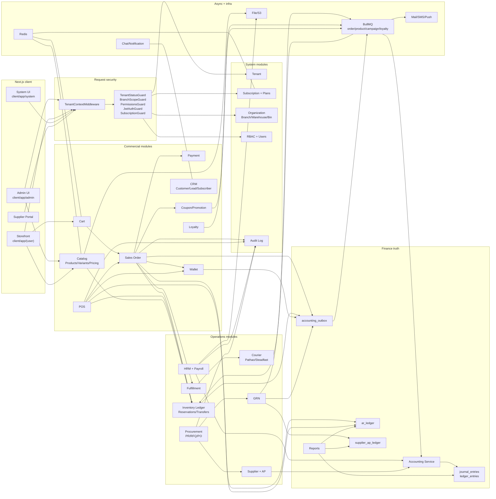
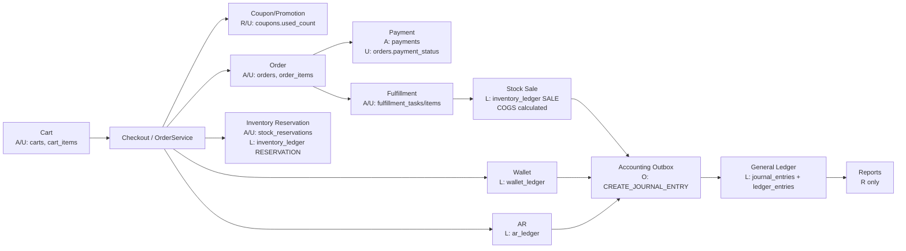
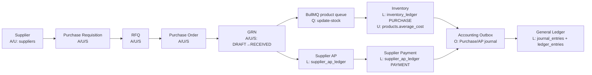
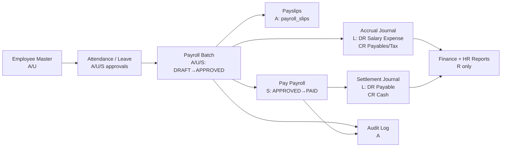
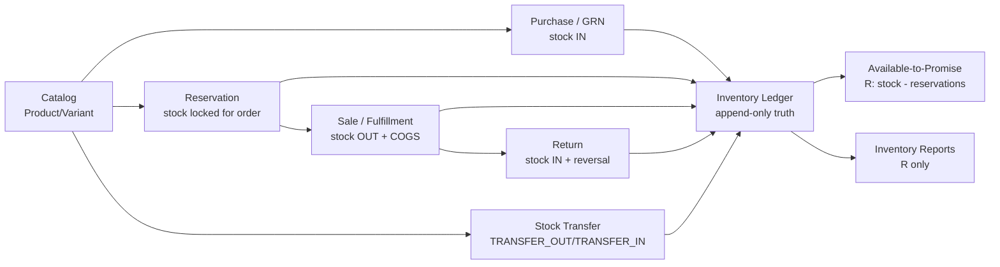
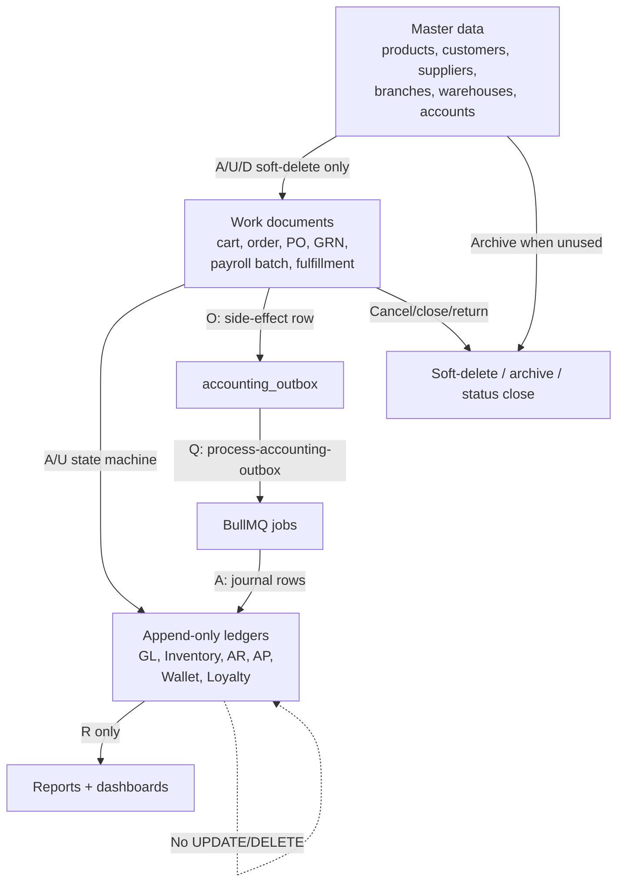

# ERP Master Dataflow

> **Companion to** [`erp_master_system_design.md`](erp_master_system_design.md) (the "what & why"), [`erp_business_logic_deep_dive.md`](erp_business_logic_deep_dive.md) (real-world module business logic), and [`erp_master_database_design.md`](erp_master_database_design.md) (the "where it is stored").
> **This document answers the third question:** _how does data actually move through the system, end-to-end, on every important request?_
>
> Every flow below is **traced from the source code in `server/src/` and `client/`** (see citations).
> Where the older READMEs or design docs claim a behaviour that does not match the code, this document follows the **code** and the discrepancy is logged in §33.

**Stack:** NestJS 11 · TypeORM (PostgreSQL) · Redis · BullMQ · Next.js 15 (App Router) · NextAuth
**Architecture:** Modular monolith · Tenant-scoped · Append-only ledgers · Transactional outbox · BullMQ side-effects
**Last verified against code:** May 25, 2026

---

## Table of Contents

**Part 0 — Executive summary**
- [0.1 One-page picture of every request](#01-one-page-picture-of-every-request)
- [0.2 Twelve dataflow primitives that govern everything](#02-twelve-dataflow-primitives-that-govern-everything)
- [0.3 How to read this document](#03-how-to-read-this-document)
- [0.4 Data movement legend](#04-data-movement-legend)
- [0.5 Master module connection diagram](#05-master-module-connection-diagram)
- [0.6 Module connection matrix](#06-module-connection-matrix)
- [0.7 Core business-cycle diagrams](#07-core-business-cycle-diagrams)

**Part I — Cross-cutting dataflow**
1. [Request lifecycle (browser → DB → response)](#1-request-lifecycle-browser--db--response)
2. [Tenant, Branch & Permission resolution](#2-tenant-branch--permission-resolution)
3. [Transaction boundaries](#3-transaction-boundaries)
4. [The Outbox + BullMQ side-effect machinery](#4-the-outbox--bullmq-side-effect-machinery)
5. [Money & Stock — the four append-only ledgers](#5-money--stock--the-four-append-only-ledgers)
6. [Multi-tenant invariants every flow must honour](#6-multi-tenant-invariants-every-flow-must-honour)
7. [Client → Server contract (how Next.js calls Nest)](#7-client--server-contract-how-nextjs-calls-nest)

**Part II — Module-by-module dataflow**
8. [Identity & Authentication](#8-identity--authentication)
9. [RBAC (Roles & Permissions)](#9-rbac-roles--permissions)
10. [Tenant onboarding & Subscription](#10-tenant-onboarding--subscription)
11. [Organization (Branch · Warehouse · Bin)](#11-organization-branch--warehouse--bin)
12. [Catalog (Product · Variant · Pricing · Category · Brand · Review)](#12-catalog-product--variant--pricing--category--brand--review)
13. [Sales Order — Online](#13-sales-order--online)
14. [Storefront Cart](#14-storefront-cart)
15. [POS — Online + Offline Sync](#15-pos--online--offline-sync)
16. [Payment (Init · Success · IPN)](#16-payment-init--success--ipn)
17. [Inventory · Reservations · Transfers](#17-inventory--reservations--transfers)
18. [GRN → AP outbox](#18-grn--ap-outbox)
19. [Procurement (PR · RFQ · PO · Supplier Invoice · Debit Note · Payment)](#19-procurement-pr--rfq--po--supplier-invoice--debit-note--payment)
20. [Finance Accounting (Journal pipeline)](#20-finance-accounting-journal-pipeline)
21. [AR Ledger & Dunning](#21-ar-ledger--dunning)
22. [Wallet (Credit · Debit · Redeem)](#22-wallet-credit--debit--redeem)
23. [HRM & Payroll](#23-hrm--payroll)
24. [Marketing — Campaigns & Coupons](#24-marketing--campaigns--coupons)
25. [Loyalty (Points & Tier engine)](#25-loyalty-points--tier-engine)
26. [CRM (Customer · Lead · Subscriber)](#26-crm-customer--lead--subscriber)
27. [Logistics — Fulfillment & Courier (Pathao · Steadfast)](#27-logistics--fulfillment--courier-pathao--steadfast)
28. [Reporting (P&L · Balance Sheet · Cash Flow · Trial Balance)](#28-reporting-pl--balance-sheet--cash-flow--trial-balance)
29. [Infra services (Cache · Mail · Push · SMS · Chat · File · Notification)](#29-infra-services-cache--mail--push--sms--chat--file--notification)
30. [Audit Log](#30-audit-log)

**Part III — Database write maps (row-level)**
31. [Module ownership + data mutation map](#31-module-ownership--data-mutation-map)
32. [Per-flow "tables touched + example row" map](#32-per-flow-tables-touched--example-row-map)

**Part IV — Operational concerns**
33. [Code-vs-docs discrepancy log](#33-code-vs-docs-discrepancy-log)
34. [Cross-reference index](#34-cross-reference-index)

---

# Part 0 — Executive summary

## 0.1 One-page picture of every request

```
┌──────────────────────── Next.js client ─────────────────────────┐
│ app/{admin|system|(user)|...}/page.tsx                          │
│      → features/<area>/...      (UI components, hooks)          │
│      → services/<area>.ts       (fetch wrappers)                │
│      → services/api.ts: fetchAPI()                              │
│         · sets x-tenant-id  (cookie/host-derived)               │
│         · sets x-branch-id  (localStorage)                      │
│         · sets Authorization: Bearer <NextAuth JWT>             │
└────────────────────────────┬────────────────────────────────────┘
                             │ HTTPS
                             ▼
┌────────────────────── NestJS API (api/v1/*) ────────────────────┐
│ main.ts:                                                        │
│   ValidationPipe (whitelist+transform) → CORS → compression     │
│   → cookieParser → express.json{20mb}                           │
│                                                                 │
│ AppModule middleware:                                           │
│   TenantContextMiddleware  ──▶ req.tenantId (from x-tenant-id)  │
│                                                                 │
│ Global guards (order = registration order):                     │
│   1) TenantStatusGuard    : block SUSPENDED/EXPIRED tenants     │
│   2) BranchScopeGuard     : non-admin sees only own branch      │
│   3) PermissionsGuard     : @RequirePermissions(...)            │
│                                                                 │
│ Route guards (declared per controller):                         │
│   JwtAuthGuard → SubscriptionGuard (@RequireFeature) → Roles    │
│                                                                 │
│ Global interceptors:                                            │
│   TransformInterceptor (envelope) → AuditLogInterceptor (@Audit)│
│   → LoggingInterceptor                                          │
│                                                                 │
│ Controller → Service:                                           │
│   · dataSource.transaction(...) wraps multi-row writes          │
│   · writes append-only ledgers (NEVER update)                   │
│   · inserts AccountingOutboxEntity rows (status=PENDING)        │
│                                                                 │
│ BullMQ background:                                              │
│   queue `order`   → OrderProcessor.process()                    │
│                       · create-invoice                          │
│                       · send-order-notification                 │
│                       · sweep-expired-reservations              │
│                       · process-accounting-outbox  ◀──────┐     │
│   queue `product` → ProductProcessor.handleUpdateStock()  │     │
│   queue `campaign`→ CampaignProcessor                      │     │
│   queue `loyalty` → TierSchedulerProcessor                 │     │
│                                                            │     │
│ Outbox consumer (process-accounting-outbox):              │     │
│   AccountingOutboxService.processPending()  ──────────────┘     │
│      → AccountingService.createJournal(...)                     │
│      → journal_entries + ledger_entries  (immutable)            │
│                                                                 │
│ Global filter: GlobalExceptionFilter ─▶ {success:false,…}       │
└────────────────────────────┬────────────────────────────────────┘
                             ▼
                ┌─────────────────────┐    ┌──────────────────┐
                │ PostgreSQL          │    │  Redis (cache +  │
                │  · ledgers          │    │   BullMQ broker) │
                │  · OLTP tables      │    │   key prefix     │
                │  · accounting_outbox│    │   t:{tenantId}:* │
                └─────────────────────┘    └──────────────────┘
```

**Sources** (verbatim):

```17:36:server/main.ts
  const API_PREFIX = 'api/v1'
  app.setGlobalPrefix(API_PREFIX)
  app.useGlobalPipes(
    new ValidationPipe({
      whitelist: true,
      transform: true,
      skipUndefinedProperties: true,
    }),
  )
  app.enableCors({ origin: true, credentials: true })
  app.use(compression())
  app.use(cookieParser())
  app.use(json({ limit: '20mb' }))
```

```76:103:server/src/app.module.ts
    { provide: APP_FILTER, useClass: GlobalExceptionFilter },
    { provide: APP_GUARD, useClass: TenantStatusGuard },
    { provide: APP_GUARD, useClass: BranchScopeGuard },
    { provide: APP_GUARD, useClass: PermissionsGuard },
    { provide: APP_INTERCEPTOR, useClass: TransformInterceptor },
    { provide: APP_INTERCEPTOR, useClass: AuditLogInterceptor },
    { provide: APP_INTERCEPTOR, useClass: LoggingInterceptor },
```

## 0.2 Twelve dataflow primitives that govern everything

| # | Primitive | Where in code | Why |
| - | --------- | ------------- | --- |
| 1 | **Tenant id is read from the `x-tenant-id` header by middleware**, never the body. | `server/src/common/middleware/tenant-context.middleware.ts` | Prevents tenant-injection. |
| 2 | **Branch is read from `x-branch-id` header**; non-admins are pinned to `user.branchId`. | `server/src/common/guards/branch-scope.guard.ts` | Branch isolation. |
| 3 | **JWT is route-level, not global** (route stacks `@UseGuards(JwtAuthGuard, …)`). | `server/src/common/guards/jwt-auth.guard.ts` + controllers | Allows public webhooks (Pathao/Steadfast/SSL Commerz IPN). |
| 4 | **Append-only ledgers** (`journal_entries`, `ledger_entries`, `inventory_ledger`, `wallet_ledger`, `ar_ledger`, `supplier_ap_ledger`) **throw on update/delete** via `@BeforeUpdate()` / `@BeforeRemove()`. | `journal-entry.entity.ts`, `ledger-entry.entity.ts` | GAAP-compliance + audit trail. |
| 5 | **Cross-domain side-effects are written through `accounting_outbox`**, not via EventEmitter. The README mentions `order.paid` etc. but the **code uses an outbox** consumed by the BullMQ `order` queue job `process-accounting-outbox`. | `accounting-outbox.entity.ts`, `accounting-outbox.service.ts`, `OrderProcessor.process()` | Atomicity (outbox + DB write in same TX), retries, idempotency. |
| 6 | **Multi-row writes are wrapped in `dataSource.transaction(...)` or `queryRunner.startTransaction()`** — never raw repository sequences. | `OrderService.createOrder()`, `GrnService.verifyGrn()`, `StockTransferService.ship()`, `HrmService.processPayroll()` | All-or-nothing. |
| 7 | **Idempotency for POS offline sales** uses the **`offlineSaleId`** column UNIQUE on `orders` (not "clientSaleId" as docs say). | `pos.service.ts: syncPosSale()` + `OrderEntity.offlineSaleId` | Re-syncs are no-ops. |
| 8 | **BullMQ queues actually registered**: `order`, `product`, `campaign`, `loyalty`. There are **no others**. | `queue.module.ts`, `*.processor.ts` | Bounded operational surface. |
| 9 | **Permissions are dynamic** (DB-driven), not hard-coded. `@RequirePermissions('orders:create')` is resolved per request against `user_role_assignments` + `role_permissions` + `permission_overrides`. | `permissions.guard.ts`, `rbac/*` | Tenant-customisable RBAC. |
| 10 | **Subscription gating is route-level** via `@RequireFeature('hrm.payroll' | 'pos' | …)`. | `subscription.guard.ts` | Plan tiers gate features without code branches. |
| 11 | **Response envelope** is `{ success: true, statusCode, data }`. Errors are `{ success: false, statusCode, timestamp, path, message, error }`. | `transform.interceptor.ts`, `exception-filter.ts` | Stable client contract. |
| 12 | **Audit is on demand**: only routes decorated with `@Audit({entity, action})` log; the interceptor reads request method/url/ip/user/headers/body/params and writes asynchronously. | `audit-log.interceptor.ts` | Avoids audit-log spam on read-only endpoints. |

## 0.3 How to read this document

- **Part I** documents the cross-cutting machinery (request lifecycle, guards, outbox, queues, ledgers). Read once.
- **Part II** is the working reference. Each section is a self-contained module trace with a fixed shape:
  1. **Triggers** (HTTP routes + client surfaces)
  2. **Sequence diagram** (browser → controller → service → DB → outbox/queue → consumer)
  3. **State machine** (where applicable)
  4. **Tables written** (with row-level example payloads)
  5. **Side effects** (outbox events, queue jobs, audit rows, cache invalidations)
  6. **Cross-reference** → the matching anchor in `erp_master_system_design.md` and `erp_master_database_design.md`.
- **Part III** is a one-glance "row map" — for each major flow, the literal sample rows the system inserts across affected tables. This is the **row-field-table** view requested by stakeholders.
- **Part IV** lists where the code disagrees with the older docs so they can be reconciled.

## 0.4 Data movement legend

Use this legend when reading every diagram and table below. It separates **data ownership** from **data usage**.

| Symbol | Meaning | Example |
| ------ | ------- | ------- |
| `A` | **Add / insert** a new row. | `OrderService.createOrder()` adds `orders`, `order_items`, `stock_reservations`. |
| `U` | **Update** an existing row. | `PaymentService.handleSuccessPayment()` updates `orders.payment_status`. |
| `D` | **Delete or remove** data. | `CartService.removeItem()` removes `cart_items`; many admin deletes should be soft-delete through `deleted_at`. |
| `R` | **Read only**. | Reporting reads `journal_entries`, `ledger_entries`, `accounts`; it does not write. |
| `L` | **Append-only ledger insert**. | `inventory_ledger`, `wallet_ledger`, `ar_ledger`, `journal_entries`, `ledger_entries`. Never update/delete ledger truth. |
| `O` | **Outbox insert** for later async posting. | `accounting_outbox` row with `event='CREATE_JOURNAL_ENTRY'`. |
| `Q` | **BullMQ job enqueue / consume**. | `product:update-stock`, `order:process-accounting-outbox`. |
| `S` | **State transition**. | `payroll_batches: DRAFT → APPROVED → PAID`. |
| `X` | **External integration**. | Pathao, Steadfast, payment gateway, SMS, SMTP, FCM. |

### Add vs update vs remove rules

| Data category | Add allowed? | Update allowed? | Remove allowed? | Rule |
| ------------- | ------------ | --------------- | --------------- | ---- |
| Master data (`products`, `categories`, `branches`, `warehouses`, `suppliers`) | Yes | Yes, with tenant scope | Prefer soft-delete (`deleted_at`) | Master rows are editable, but historical documents keep snapshots. |
| Business documents (`orders`, `purchase_orders`, `grn`, `payroll_batches`) | Yes | Only state/status and controlled fields | Usually no hard delete | Move through state machines; do not erase history after approval/posting. |
| Ledgers (`journal_entries`, `ledger_entries`, `inventory_ledger`, `wallet_ledger`, `ar_ledger`, `supplier_ap_ledger`) | Yes, append-only | No | No | Corrections use reversing rows, never mutation. |
| Temporary user data (`carts`, `cart_items`, sessions) | Yes | Yes | Yes | Cart/session data can be removed because it is not accounting truth. |
| Infra data (`notifications`, `campaign_logs`, `audit_logs`, `files`) | Yes | Limited | Retention policy only | Keep enough history for support/audit. |

## 0.5 Master module connection diagram

This diagram is the fastest way to understand **which module talks to which module**. Read arrows as: "left module calls, writes, enqueues, or depends on right module".



## 0.6 Module connection matrix

This is the same diagram in table form. Use it when you need to answer: **"If I change module X, which modules can break?"**

| Module | Owns / source-of-truth tables | Reads from | Writes to / calls | Downstream side-effects |
| ------ | ----------------------------- | ---------- | ----------------- | ----------------------- |
| Auth/User | `users`, `sessions` | `tenants`, `roles` | `sessions`, `users.refresh_token` | JWT identity for every secured module. |
| RBAC | `roles`, `permissions`, `role_permissions`, `user_role_assignments`, `permission_overrides` | `users`, `branches`, `warehouses` | permission checks in guards | Blocks or allows all admin writes. |
| Tenant/Subscription | `tenants`, `tenant_features`, `subscription_plans`, `subscription_invoices` | `users`, `feature_definitions` | `tenant_features`, `subscription_invoices` | `SubscriptionGuard` gates modules such as POS, HRM, Campaigns. |
| Organization | `branches`, `warehouses`, `warehouse_bins` | `tenants`, `users` | branch/warehouse master data | Branch/warehouse scope for orders, stock, payroll, reports. |
| Catalog | `products`, `product_variants`, `categories`, `brands`, `price_books`, `reviews` | `warehouses`, `suppliers` | product master, variants, batches | Inventory, Cart, Order, POS, Campaign audience. |
| Cart | `carts`, `cart_items` | `products`, `product_variants`, `coupons`, `wallet_ledger` | `carts`, `cart_items` | Feeds checkout/order creation. |
| Order | `orders`, `order_items`, `order_returns` | Catalog, Coupon, Wallet, Inventory ATP, Customer | `orders`, `order_items`, `stock_reservations`, `inventory_ledger`, `wallet_ledger`, `ar_ledger`, `accounting_outbox` | Invoice job, notification job, fulfillment, GL posting. |
| POS | `pos_registers`, `pos_shifts`, `pos_drawer_transactions` | Catalog, Inventory, Wallet, Customer, Coupons | POS shifts/drawer rows, `orders`, `inventory_ledger`, `wallet_ledger`, `ar_ledger`, `accounting_outbox` | GL posting, shift reconciliation, offline idempotency. |
| Payment | `payments` | `orders`, gateway response | `payments`, `orders.payment_status`, `orders.transaction_id` | Does not post revenue journal; order completion does. |
| Inventory | `inventory_ledger`, `stock_reservations`, `stock_transfers`, `product_batches` | Catalog, Warehouse, Order, GRN, POS | append stock ledger rows, reservation status, transfer state | COGS outbox, ATP read model. |
| GRN | `goods_received_notes`, `goods_received_note_items` | PO, Supplier, Warehouse | GRN status, AP ledger, product queue `update-stock` | Inventory purchase rows, average cost, AP journal outbox. |
| Procurement | `purchase_requisitions`, `rfqs`, `purchase_orders`, `supplier_invoices`, `debit_notes` | Supplier, Catalog, GRN | procurement documents, supplier AP/payment rows | AP journal outbox, supplier portal visibility. |
| Supplier/AP | `suppliers`, `supplier_ap_ledger` | GRN, Supplier Invoice, Supplier Payment | AP ledger rows | AP aging, balance sheet liabilities. |
| Accounting | `accounts`, `journal_entries`, `ledger_entries`, `accounting_outbox` | outbox payloads, source refs | immutable GL journals and account balances | Reports, compliance, audit trail. |
| AR/Dunning | `ar_ledger`, customer credit fields on `users` | Orders, Payments | AR ledger rows, `users.credit_hold` | AR aging, customer credit blocks. |
| Wallet | `wallet_ledger` | Customer, Orders, POS | wallet ledger rows, accounting outbox unless `skipGlPost` | Storefront wallet balance, order/POS discount liability. |
| HRM/Payroll | employees, attendance, leave, payroll batches/slips | Users, Branches, Accounts | HRM rows, payroll journals, audit logs | Payroll liability, salary expense, payslips. |
| Marketing/Campaign | `campaigns`, `campaign_logs`, `coupons`, `promotions` | Customers, Subscribers, Products, Orders | campaign rows, coupon usage, campaign queue jobs | Mail/SMS/Push dispatch, coupon impact on orders. |
| Loyalty | `loyalty_ledger`, `loyalty_tier_rules`, `users.membership_tier` | Orders, Customers | loyalty ledger, user tier cache | Loyalty balance in storefront and customer profile. |
| CRM | `leads`, `subscribers`, customer fields on `users` | Orders, Wallet, AR, Loyalty | lead/subscriber/customer rows | Campaign audience, support context, B2B credit rules. |
| Fulfillment/Courier | `fulfillment_tasks`, `fulfillment_items`, courier fields on `orders` | Orders, Reservations, Warehouses | fulfillment rows, order tracking/status fields | Courier API call, webhook updates. |
| Reporting | no source-of-truth writes | GL, AR, AP, Inventory, Orders, Payroll | read-only projections | Tenant owner, accountant, manager dashboards. |
| Infra | `audit_logs`, `notifications`, `files`, `campaign_logs`, queue state | All modules | cache, files, messages, notifications, audit rows | Operational reliability and support traceability. |

## 0.7 Core business-cycle diagrams

The master module diagram is broad. These cycle diagrams show the main ERP business loops that developers usually need to trace.

### 0.7.1 Order-to-cash



Important: payment success updates payment status, but revenue/COGS journal posting happens when the order becomes `COMPLETED`.

### 0.7.2 Procure-to-pay



Key rule: GRN verification is the moment stock and AP become business truth. PO approval alone does not increase stock.

### 0.7.3 Payroll-to-GL



Key rule: approved payroll should not be deleted. Corrections are adjustment batches or reversal journals.

### 0.7.4 Stock lifecycle



Key rule: stock number is never trusted from a direct mutable field alone. Ledger rows plus reservations explain how the number was reached.

---

# Part I — Cross-cutting dataflow

## 1. Request lifecycle (browser → DB → response)

The system has **eleven** observable stages on every HTTP request. The stages and their owning code are:

| # | Stage | Owner | What it does | Reads | Writes |
| - | ----- | ----- | ------------ | ----- | ------ |
| 1 | **Network ingress** | Reverse proxy / Next.js rewrite | TLS termination, host → tenant routing for custom domains. | TLS + Host | — |
| 2 | **Next.js page render** | `client/app/**/page.tsx` | Server-rendered shell + client-rendered widgets. | NextAuth session cookie | — |
| 3 | **Client fetch wrapper** | `client/services/api.ts: fetchAPI()` | Adds `x-tenant-id`, `x-branch-id`, `Authorization: Bearer`. | tenant resolver, localStorage, NextAuth session | HTTP headers |
| 4 | **Nest bootstrap pipeline** | `server/src/main.ts` | `ValidationPipe(whitelist+transform)`, CORS, compression, cookieParser, `json({limit:'20mb'})`. | request body | normalises DTO |
| 5 | **TenantContextMiddleware** | `common/middleware/tenant-context.middleware.ts` | Mandatory `x-tenant-id`; throws `BadRequestException('Tenant context missing')` otherwise. | `req.headers['x-tenant-id']` | `req.tenantId` |
| 6 | **Global guards** | `TenantStatusGuard → BranchScopeGuard → PermissionsGuard` (registration order in `AppModule`). | See §2. | — |
| 7 | **Route-level guards** | Controller `@UseGuards(JwtAuthGuard, SubscriptionGuard, RolesGuard?)` | JWT verify, feature gating, role check. | JWT, `tenant_features`, `subscription_plans.features`, `request.user.role` | `request.user` |
| 8 | **Controller** | `*.controller.ts` | Maps HTTP → service method, applies DTO transforms. | DTO | — |
| 9 | **Service** | `*.service.ts` | Business logic; opens TX with `dataSource.transaction(...)` for multi-row writes; inserts append-only ledger rows; inserts `accounting_outbox` rows; enqueues BullMQ jobs. | repositories | DB rows |
| 10 | **Interceptors (post-handler)** | `TransformInterceptor → AuditLogInterceptor → LoggingInterceptor` | Wrap response; conditional audit row (only on `@Audit`); log line. | response object | `audit_logs` (if decorated) |
| 11 | **Exception filter** | `GlobalExceptionFilter` | Maps any thrown error to `{success:false, statusCode, timestamp, path, message, error}`. | Error | logs + response |

**Async continuation** (after HTTP response is sent):

| # | Stage | Owner | Job names | Behaviour |
| - | ----- | ----- | --------- | --------- |
| A | BullMQ `order` consumer | `server/src/modules/admin/sales/order/queue/order.processor.ts` | `create-invoice`, `send-order-notification`, `sweep-expired-reservations`, `process-accounting-outbox` | Reads pending `accounting_outbox` rows for the tenant and posts journals. |
| B | BullMQ `product` consumer | `server/src/modules/admin/catalog/product/queue/product.processor.ts` | `create-purchase-order`, `update-stock` | Writes `inventory_ledger` rows (FEFO batch allocation when applicable). |
| C | BullMQ `campaign` consumer | `marketing/campaign/queue/campaign.processor.ts` | `start-campaign`, `send-message` | Walks audience, dispatches mail/SMS/push. |
| D | BullMQ `loyalty` consumer | `marketing/loyalty/queue/tier-scheduler.processor.ts` | `assess-tiers` | Re-evaluates `users.membership_tier` from rolling 12-month spend. |

> **The architecture has no `EventEmitter2`**. Where the codebase-understanding docs and the top-level `doc/README.md` list domain events (`order.paid`, `grn.verified`, `payroll.batch.approved`, …), the **actual mechanism is the `accounting_outbox` table + the BullMQ `order` queue**. See §33 for the discrepancy.

## 2. Tenant, Branch & Permission resolution

### 2.1 The five-step resolution pipeline

```
            Header: x-tenant-id            Header: x-branch-id            JWT: sub=user_id
                  │                              │                               │
                  ▼                              ▼                               ▼
┌─────────────────────────────────┐  ┌─────────────────────────┐  ┌─────────────────────────────┐
│ TenantContextMiddleware         │  │ BranchScopeGuard         │  │ PermissionsGuard            │
│ ─ throws if missing             │  │ ─ admins pass through    │  │ ─ admins pass through       │
│ ─ writes req.tenantId           │  │ ─ non-admins forced to   │  │ ─ resolves @RequirePermissions │
└────────────┬────────────────────┘  │   user.branchId          │  │ ─ supports scope (branch/   │
             │                       │ ─ if header missing &    │  │   warehouse via x-scope-id) │
             ▼                       │   user has branchId,     │  │ ─ checks                    │
┌─────────────────────────────────┐  │   writes header back     │  │   role_permissions ∪        │
│ TenantStatusGuard               │  └─────────────────────────┘  │   permission_overrides      │
│ ─ loads tenant by req.tenantId  │                               └─────────────────────────────┘
│ ─ blocks SUSPENDED/EXPIRED      │
│   unless @PublicDuringExpiration│
└─────────────────────────────────┘
```

### 2.2 Decorator → guard mapping

| Decorator | Read by | Effect |
| --------- | ------- | ------ |
| `@Public()` | `JwtAuthGuard`, `SubscriptionGuard`, `PermissionsGuard` | Skips all three. |
| `@PublicDuringExpiration()` | `TenantStatusGuard` | Allows access even on `SUSPENDED`/`EXPIRED` tenant (used for billing UI). |
| `@RequireFeature('hrm.payroll')` | `SubscriptionGuard` | Reads `tenant_features` and `subscription_plans.features` JSON. |
| `@RequirePermissions('orders:create')` | `PermissionsGuard` | Resolves dynamic permission via RBAC tables. |
| `@Roles('ADMIN','MANAGER')` | `RolesGuard` | Static check against `users.role` enum. |
| `@Audit({entity:'order', action:'create'})` | `AuditLogInterceptor` | Persists `audit_logs` row post-success. |
| `@CurrentUser()` | controllers | Returns `request.user`. |
| `@TenantId()` | controllers | Returns `request.tenantId || x-tenant-id`. |
| `@RequestContext()` | controllers | Returns `{userId, tenantId, branchId, user, sessionId}`. |

### 2.3 Worked example — POST `/orders`

| Step | Component | Side effect |
| ---- | --------- | ----------- |
| 1 | `TenantContextMiddleware` | `req.tenantId = '8e3a…'` |
| 2 | `TenantStatusGuard` | `tenants` row loaded; `status='ACTIVE'` ✔ |
| 3 | `BranchScopeGuard` | header `x-branch-id` = `b-01`, matches user.branchId ✔ |
| 4 | `PermissionsGuard` | reads `@RequirePermissions('orders:create')`; admin pass-through OR DB check passes |
| 5 | `JwtAuthGuard` (route-level) | verifies JWT; `request.user = {id, role, tenantId, branchId,…}` |
| 6 | `SubscriptionGuard` | route does not declare `@RequireFeature`, skip |
| 7 | `OrderController.createOrder()` → `OrderService.createOrder()` | full TX (see §13) |

## 3. Transaction boundaries

The system uses **two** TX patterns. **Avoid mixing them in new code; pick one per service.**

### 3.1 Pattern A — `dataSource.transaction(async (manager) => { ... })`

Used in: `OrderService.createOrder()`, `FulfillmentService.shipOrder()`, `PosService.syncPosSale()`, `PosService.createDrawerTransaction()`, `StockTransferService.{ship,receive,cancel}()`, `WalletService.{creditWallet,debitWallet}()`.

Idiom:

```ts
return this.dataSource.transaction(async (manager) => {
  await manager.save(InventoryLedgerEntity, { ... })   // ledger write
  await manager.save(StockReservationEntity, { ... })  // OLTP write
  await manager.save(OrderEntity, { ... })             // OLTP write
  await manager.save(AccountingOutboxEntity, { ... })  // outbox row in same TX
  return order
})
```

The outbox row is committed **with** the business rows, so journal posting cannot be lost or duplicated.

### 3.2 Pattern B — `queryRunner.startTransaction()`

Used in: `GrnService.verifyGrn()`, `HrmService.{processPayroll,payPayrollBatch}()`.

Idiom:

```ts
const qr = this.dataSource.createQueryRunner()
await qr.connect(); await qr.startTransaction()
try {
  await qr.manager.save(...); await qr.manager.update(...)
  await qr.commitTransaction()
} catch (e) { await qr.rollbackTransaction(); throw e }
finally { await qr.release() }
```

Functionally identical; choose Pattern A in new code (less boilerplate).

### 3.3 Forbidden patterns

- Calling `BullMQ.add()` **before** `commitTransaction()` — the job may fire on a row that never committed. Always enqueue after commit, or, preferably, write an outbox row inside the TX and let the `process-accounting-outbox` job consume it.
- Reading the running balance for a ledger and writing it back without `SELECT … FOR UPDATE` on the row. The ledger services do their reads inside the TX with explicit locking; copy that pattern.

## 4. The Outbox + BullMQ side-effect machinery

### 4.1 Why an outbox, not events

Cross-domain financial side-effects (e.g., "an order completed → post DR Cash / CR Revenue / DR COGS / CR Inventory journal") must be:

- **Atomic with the originating business write** (no orphan journals, no missing journals).
- **Idempotent** (retry-safe if the consumer crashes).
- **Auditable** (you can replay every journal that has ever been posted).

A standard `EventEmitter2.emit('order.paid', ...)` cannot guarantee any of these. The system instead uses a **transactional outbox**:

| Table | File | Rows |
| ----- | ---- | ---- |
| `accounting_outbox` | `accounting-outbox.entity.ts` | Pending side-effects, JSON payload, status, attempts. |

### 4.2 Schema of `accounting_outbox`

| Column | Type | Notes |
| ------ | ---- | ----- |
| `id` | uuid PK | |
| `tenant_id` | uuid | Always tenant-scoped. |
| `event` | varchar(100) | Today: `'CREATE_JOURNAL_ENTRY'`. Designed extensible. |
| `payload` | jsonb | Headed by `{ journalType, description, referenceType, referenceId, lines:[{accountCode, side, amount}…] }`. |
| `status` | varchar(50) default `'PENDING'` | `PENDING` / `PROCESSING` / `COMPLETED` / `FAILED`. |
| `attempts` | int default 0 | Incremented per retry; cap of N before `FAILED`. |
| `error` | text nullable | Captured last error message. |
| `created_at` | timestamptz | |
| `processed_at` | timestamptz nullable | Set when status → COMPLETED. |

Indexes: `(status, created_at)`, `(tenant_id, status)`.

### 4.3 End-to-end flow

```
[Service inside TX]                                  [BullMQ order queue]                          [Outbox consumer]
  manager.save(InventoryLedger, …)
  manager.save(OrderEntity, …)
  manager.save(AccountingOutboxEntity, {              ──▶  (job 'process-accounting-outbox'
    event:'CREATE_JOURNAL_ENTRY',                            scheduled by scheduler or
    payload:{ journalType:'SALE',                            enqueued ad-hoc)
              referenceType:'ORDER',
              referenceId: order.id,
              lines:[ {accountCode:'4000', side:'CREDIT', amount:1000},
                      {accountCode:'2300', side:'CREDIT', amount:200},
                      {accountCode:'1000', side:'DEBIT',  amount:1200} ] },
    status:'PENDING' })
  COMMIT
                                                                                                  AccountingOutboxService.processPending()
                                                                                                    ├─ SELECT … WHERE status='PENDING'
                                                                                                    │   ORDER BY created_at LIMIT N FOR UPDATE SKIP LOCKED
                                                                                                    ├─ status = 'PROCESSING'
                                                                                                    ├─ AccountingService.createJournal(payload)
                                                                                                    │     INSERT journal_entries (immutable)
                                                                                                    │     INSERT ledger_entries[] (immutable)
                                                                                                    │     UPDATE accounts.balance
                                                                                                    └─ status = 'COMPLETED', processed_at = now()
```

### 4.4 BullMQ queues — authoritative inventory

| Queue | Producer modules | Consumer | Jobs |
| ----- | ---------------- | -------- | ---- |
| `order` | `order`, `inventory-transaction`, accounting integration | `OrderProcessor.process()` | `create-invoice`, `send-order-notification`, `sweep-expired-reservations`, `process-accounting-outbox` |
| `product` | `product`, `purchase`, `grn` | `ProductProcessor.process()` | `create-purchase-order`, `update-stock` |
| `campaign` | `campaign` | `CampaignProcessor` | `start-campaign`, `send-message` |
| `loyalty` | `loyalty` | `TierSchedulerProcessor` | `assess-tiers` |

Redis connection: `REDIS_HOST` / `REDIS_PORT` env (`queue.module.ts`).

## 5. Money & Stock — the four append-only ledgers

There are **four immutable ledgers** in the system. Every financial or stock truth lives in one of them. They cannot be UPDATEd or DELETEd (entities throw via `@BeforeUpdate()` / `@BeforeRemove()`).

| Ledger | Table | What it tracks | Row write trigger |
| ------ | ----- | -------------- | ----------------- |
| **General Ledger** | `journal_entries` (header) + `ledger_entries` (debit/credit lines) | All money movements (Sales, COGS, AP, AR, payroll, expenses, wallet…). | `AccountingService.createJournal()` consuming `accounting_outbox`. |
| **Inventory Ledger** | `inventory_ledger` | Stock IN, OUT, RESERVATION, TRANSFER_IN/OUT, SALE, PURCHASE, ADJUSTMENT. | `InventoryLedgerService` from Order/POS/GRN/Transfer/Adjustment flows. |
| **Wallet Ledger** | `wallet_ledger` | Customer store-credit balances. | `WalletService.{credit,debit}Wallet()`. |
| **AR Ledger** | `ar_ledger` | Customer accounts-receivable balances (B2B on-account). | `OrderService.createOrder()` for `paymentMethod=ON_ACCOUNT`, then payment receipts decrement. |
| **AP Ledger** | `supplier_ap_ledger` | Supplier accounts-payable balances. | `GrnService.verifyGrn()` and supplier-payment service. |

### 5.1 Row-level field walkthrough — `journal_entries` + `ledger_entries`

**`journal_entries`** (header):

| Field | Sample value | Source code |
| ----- | ------------ | ----------- |
| `id` | `je_8f3b…` | PK |
| `tenant_id` | `t_8e3a…` | from ctx |
| `date` | `2026-05-25 14:42:11+06` | TX time |
| `type` | `SALE` | `JournalType` enum (`SALE`, `PURCHASE`, `PAYROLL`, `EXPENSE`, `WALLET`, `ADJUSTMENT`, `RETURN`, …) |
| `description` | `Sale completion order ORD-2026-00123` | Service-generated |
| `referenceType` | `ORDER` | Drives `je → originating row` traceability |
| `referenceId` | `o_a1b2…` | OrderEntity.id |
| `totalAmount` | `1200.00` | Sum of debits = sum of credits |
| `isReversal` | `false` | Always start false |
| `reversedJournalEntryId` | NULL | Set if this je is a reversal |

**`ledger_entries`** (lines — two or more per journal, must balance):

| Field | Line 1 | Line 2 | Line 3 |
| ----- | ------ | ------ | ------ |
| `journal_entry_id` | `je_8f3b…` | `je_8f3b…` | `je_8f3b…` |
| `account_id` | `acc_cash` | `acc_revenue` | `acc_vat_payable` |
| `side` | `DEBIT` | `CREDIT` | `CREDIT` |
| `amount` | `1200.00` | `1000.00` | `200.00` |
| `balance_after` | (running snapshot for the account) | … | … |
| `tenant_id` | `t_8e3a…` | `t_8e3a…` | `t_8e3a…` |

**Invariant**: `SUM(side='DEBIT'.amount) = SUM(side='CREDIT'.amount)` per `journal_entry_id`. Enforced in the service before commit.

### 5.2 Row-level field walkthrough — `inventory_ledger`

| Field | Reservation row | Sale (FEFO) row | Purchase (GRN) row | Transfer-out row |
| ----- | --------------- | ---------------- | ------------------- | ----------------- |
| `product_id` | `p_001` | `p_001` | `p_001` | `p_001` |
| `variant_id` | `v_red_m` | `v_red_m` | `v_red_m` | `v_red_m` |
| `branch_id` | `b_main` | `b_main` | NULL | NULL |
| `warehouse_id` | `w_central` | `w_central` | `w_central` | `w_central` |
| `bin_id` | NULL | `bin_a1` | `bin_a1` | NULL |
| `batch_id` | NULL | `lot_2026_05` | NULL | `lot_2026_05` |
| `supplier_id` | NULL | NULL | `s_xyz` | NULL |
| `type` | `RESERVATION` | `SALE` | `PURCHASE` | `TRANSFER_OUT` |
| `quantity` | `-2.00` (reserved removes from ATP) | `-2.00` | `+50.00` | `-10.00` |
| `balance_after` | `48.00` (on-hand unchanged for reservation? **see §17**) | `46.00` | `96.00` | `36.00` |
| `unit_cost` | 0 | 0 | `120.00` | 0 |
| `cogs_amount` | 0 | `240.00` (FEFO-cost-weighted) | 0 | 0 |
| `reference_type` | `ORDER` | `ORDER` | `GOODS_RECEIVED_NOTE` | `STOCK_TRANSFER` |
| `reference_id` | `o_a1b2…` | `o_a1b2…` | `grn_…` | `tr_…` |
| `tenant_id` | `t_8e3a…` | `t_8e3a…` | `t_8e3a…` | `t_8e3a…` |

> See [§6.6 of `erp_master_database_design.md`](erp_master_database_design.md#66-inventory--wms-tables) for the full schema.

### 5.3 Row-level field walkthrough — `wallet_ledger`

| Field | Credit row | Debit row (manual) | Debit row (redeem inside order) |
| ----- | ---------- | -------------------- | ------------------------------- |
| `customer_id` | `u_cust_1` | `u_cust_1` | `u_cust_1` |
| `type` | `WALLET_CREDIT` | `WALLET_DEBIT` | `WALLET_SPEND` |
| `amount` | `+500.00` | `-300.00` | `-200.00` |
| `balance_after` | `500.00` | `200.00` | `0.00` |
| `currency` | `BDT` | `BDT` | `BDT` |
| `reference_type` | `MANUAL` | `MANUAL` | `ORDER` (or `POS_SALE`) |
| `reference_id` | NULL | NULL | `o_a1b2…` |
| `tenant_id` | `t_8e3a…` | `t_8e3a…` | `t_8e3a…` |

> Important: for **redemption inside an order/POS**, `WalletService` is called with `skipGlPost: true`. The GL impact is then folded into the order's single SALE journal (DR `2300` Wallet Liability rather than emitting a separate WALLET journal). This avoids double counting.

### 5.4 Row-level field walkthrough — `ar_ledger`

| Field | Invoice row | Payment receipt row |
| ----- | ----------- | -------------------- |
| `customer_id` | `u_cust_b2b` | `u_cust_b2b` |
| `type` | `INVOICE` | `PAYMENT` |
| `amount` | `+12500.00` | `-12500.00` |
| `balance_after` | `12500.00` | `0.00` |
| `currency` | `BDT` | `BDT` |
| `due_date` | `2026-06-24` | NULL |
| `reference_type` | `ORDER` | `PAYMENT` |
| `reference_id` | `o_a1b2…` | `pmt_…` |

### 5.5 Row-level field walkthrough — `supplier_ap_ledger`

| Field | GRN credit row | Supplier payment debit row |
| ----- | --------------- | -------------------------- |
| `supplier_id` | `s_xyz` | `s_xyz` |
| `type` | `GRN_RECEIVED` | `PAYMENT` |
| `amount` | `+6000.00` | `-6000.00` |
| `balance_after` | `6000.00` | `0.00` |
| `reference_type` | `GRN` | `SUPPLIER_PAYMENT` |
| `reference_id` | `grn_…` | `sp_…` |

## 6. Multi-tenant invariants every flow must honour

Every service must satisfy **all five** of the following — they are tested in the integration suite under `server/test/`:

1. **No write reaches the DB without a `tenantId`.** Repositories enforce this; missing `tenantId` → 400.
2. **Every SELECT query filters by `tenant_id` first**, even if the table is small and even if subsequent filters look unique.
3. **No FK ever crosses tenants.** `branches.tenant_id`, `warehouses.tenant_id`, `products.tenant_id` … form a tenant-cohesive graph. (Composite FK is the *planned* enforcement; see master DB design §8.)
4. **Redis keys** always start with `t:{tenantId}:`. Tenant deletion can flush `t:<id>:*` in one operation.
5. **Files in S3** are partitioned by tenant prefix (`tenants/{tenantId}/...`).

## 7. Client → Server contract (how Next.js calls Nest)

### 7.1 Header & auth contract

`client/services/api.ts: fetchAPI()` builds every request with:

| Header / setting | Source | Server consumer |
| ---------------- | ------ | --------------- |
| `Authorization: Bearer <token>` | NextAuth session via `getServerSession`/`useSession` | `JwtAuthGuard`, `PermissionsGuard` |
| `x-tenant-id` | `getTenantId()` (resolves from cookie/subdomain/custom-domain) | `TenantContextMiddleware` |
| `x-branch-id` | `localStorage.getItem('x-branch-id')` (chosen in admin UI) | `BranchScopeGuard` |
| `x-scope-id` | optional — for scoped permission checks | `PermissionsGuard` |

Base URL: `NEXT_PUBLIC_API_URL` (browser) or `API_URL_INTERNAL` (server-side fetch). Both default to `http://localhost:3900/api/v1`.

### 7.2 Three client "shells"

| App segment | Audience | Service wrappers |
| ----------- | -------- | ---------------- |
| `client/app/admin/**` | Tenant staff (back-office) | `fetchAPI()` with bearer + tenant + branch headers. Examples: `services/accounting.ts`, `hrm.ts`, `procurement.ts`. |
| `client/app/system/**` | Platform super-admin | `services/supperAdminApi.ts: fetchSuperAdminAPI()` — requires platform super-admin JWT. |
| `client/app/(user)/**`, `client/app/supplier-portal/**` | Customers, suppliers | `services/publicSaasApi .ts: fetchAPI()` for unauthenticated reads; cart/order endpoints require customer JWT. |

### 7.3 NextAuth proxy guard

`client/proxy.ts` is the Next.js middleware that:

- Matches `/admin/:path*` and `/profile/:path*`.
- Reads NextAuth JWT.
- Requires `user.role ∈ { ADMIN, STORE_MANAGER, OPERATOR, SUPPORT, MARKETING, SUPER_ADMIN }` for `/admin/*`.
- Redirects unauthorised access to `/login`.

> The proxy **does not** intercept `/api/*` — those calls are server-to-server via `fetchAPI()` and rely on the Nest guards.

---

# Part II — Module-by-module dataflow

> Format reminder (see [§0.3](#03-how-to-read-this-document)): each section follows the same template.

## 8. Identity & Authentication

### 8.1 Trigger surfaces

| Surface | Route | Calls | Controller |
| ------- | ----- | ----- | ---------- |
| Storefront login | `client/app/(user)/(auth)/...` | NextAuth Credentials provider | `auth.controller.ts: login()` |
| Admin login | `client/app/admin/...` (guarded by NextAuth) | NextAuth Credentials provider | `auth.controller.ts: login()` |
| Super-admin login | `client/app/system/...` | NextAuth Credentials with `isSuperAdmin` flag | `super-admin.controller.ts` |
| OTP request | `POST /auth/otp/request` | `services/api.ts` | `auth.controller.ts: requestOtp()` |
| OTP verify | `POST /auth/otp/verify` | `services/api.ts` | `auth.controller.ts: verifyOtp()` |
| Refresh | `POST /auth/refresh` | `services/api.ts` | `auth.controller.ts: refresh()` |

### 8.2 Sequence — interactive login

```
Browser (NextAuth Credentials provider)
   │ POST /auth/login  { username, password, isAdmin? }
   ▼
TenantContextMiddleware    ── reads x-tenant-id; sets req.tenantId
TenantStatusGuard          ── ensures tenant ACTIVE
BranchScopeGuard           ── pass (no x-branch-id yet)
PermissionsGuard           ── route is @Public()
AuthController.login()
   │
   ▼ AuthService.login(dto)
       ├─ users repo: findOne by username & tenantId
       ├─ bcrypt.compare(password, user.password)
       ├─ sign JWT { sub: user.id, role, tenantId, branchId }
       ├─ rotate refresh token; hash; write users.refresh_token
       ├─ create sessions row { user_id, refresh_token_hash, ip, user_agent, expires_at }
       └─ return { accessToken, refreshToken, user }
TransformInterceptor wraps response → { success:true, data:{ accessToken, … } }
```

### 8.3 State machine

`users.status`: `ACTIVE → SUSPENDED → ACTIVE` (admin-toggled).
`sessions`: `active → expired` (by `expires_at`) → `revoked_at` on logout.

### 8.4 Tables written

| Table | Action | Sample row |
| ----- | ------ | ---------- |
| `users` | UPDATE `refresh_token`, `last_login_at` (where present) | — |
| `sessions` | INSERT | `{ id, tenant_id, user_id, refresh_token_hash, ip:'1.2.3.4', user_agent:'…', expires_at }` |

### 8.5 Side effects

- `AuditLogInterceptor` writes `audit_logs` row only if `@Audit({entity:'auth'})` is applied.
- No outbox, no queue jobs.

### 8.6 Failure paths

| Failure | Where caught | HTTP |
| ------- | ------------ | ---- |
| Wrong tenant or no `x-tenant-id` | `TenantContextMiddleware` | 400 `Tenant context missing` |
| Suspended tenant | `TenantStatusGuard` | 403 |
| Wrong password | `AuthService` | 401 |
| Expired JWT on later request | `JwtAuthGuard` (passport-jwt) | 401 |

> Cross-ref: [`erp_master_system_design.md` §9](erp_master_system_design.md#9-user--customer-scope-inside-boundaries), [`erp_master_database_design.md` §6.2](erp_master_database_design.md#62-identity--rbac-tables).

## 9. RBAC (Roles & Permissions)

### 9.1 Seed → assignment → check pipeline

```
[ Platform seed ]                  [ Tenant admin assigns ]                [ Request time check ]
permissions table     ─────▶   user_role_assignments   ────────▶    PermissionsGuard reads
( seeded from script,          (user_id, role_id, scope_type,        @RequirePermissions metadata
  CRUD codes per module,       scope_id, expires_at?)                 → resolves per request
  e.g. 'orders:create' )                                              against:
                                role_permissions                       ─ role_permissions
                                (role_id, permission_id)               ─ permission_overrides
                                                                       returns 200 or 403.
                                permission_overrides
                                (user_id, permission_id, grant/deny,
                                 scope_type, scope_id, expires_at)
```

### 9.2 Tables — row-level

| Table | Sample row |
| ----- | ---------- |
| `permissions` | `{ id:'perm_orders_create', code:'orders:create', module:'sales', action:'create', is_system_default:true }` |
| `roles` | `{ id:'role_manager', tenant_id:'t_8e3a…', name:'Manager', scope_type:'BRANCH', is_system_role:false }` |
| `role_permissions` | `{ role_id:'role_manager', permission_id:'perm_orders_create' }` |
| `user_role_assignments` | `{ user_id:'u_1', role_id:'role_manager', scope_type:'BRANCH', scope_id:'b_01', expires_at:null }` |
| `permission_overrides` | `{ user_id:'u_2', permission_id:'perm_orders_create', effect:'DENY', scope_type:'BRANCH', scope_id:'b_01' }` |

### 9.3 Cross-references

- Roles & permissions overall: [`erp_master_system_design.md` §11](erp_master_system_design.md#11-boundary-enforcement-rules).
- Tables: [`erp_master_database_design.md` §6.2](erp_master_database_design.md#62-identity--rbac-tables).
- Dynamic seed: [`developer/dynamic_role_feature_permission.md`](../developer/dynamic_role_feature_permission.md).

## 10. Tenant onboarding & Subscription

### 10.1 Trigger surfaces

| Surface | Route | Endpoint |
| ------- | ----- | -------- |
| Sign up "Create your store" | `client/app/(user)/create-store/` | `POST /tenants/onboarding` |
| Plan checkout | `client/app/billing/...` | `POST /subscription-billing/checkout` |
| Custom-domain bind | admin settings | `POST /tenants/me/custom-domain` |

### 10.2 Sequence — sign-up

```
Customer → POST /tenants/onboarding { storeName, subdomain, ownerEmail, ownerPassword, planSlug? }
TenantContextMiddleware: this route is in the allowlist — does NOT require x-tenant-id.
TenantService.onboard()  (TX):
   ├─ INSERT tenants { id, store_name, subdomain, status:'TRIAL', subscription_status:'TRIAL', subscription_plan_id }
   ├─ INSERT users   { tenant_id, role:'ADMIN', is_email_verified:false, … }      ← becomes tenant owner
   ├─ UPDATE tenants.user_id = owner.user.id
   ├─ INSERT subscription_invoices { tenant_id, plan_id, status:'PENDING' }       ← trial period
   ├─ INSERT tenant_features for the plan defaults
   └─ enqueue mail (verification + welcome)
   COMMIT
   → returns { tenant, owner }; client stores tenant + JWT.
```

### 10.3 State machine (tenants)

`TRIAL → ACTIVE → SUSPENDED → CANCELED`.
`subscription_status`: `TRIAL → ACTIVE → PAST_DUE → CANCELED`.

### 10.4 Tables written

| Table | Sample row |
| ----- | ---------- |
| `tenants` | `{ id:'t_8e3a…', store_name:'Demo Shop', subdomain:'demo', status:'TRIAL', subscription_plan_id:'pl_basic', subscription_status:'TRIAL', user_id:null }` |
| `users` (owner) | `{ tenant_id:'t_8e3a…', role:'ADMIN', username:'demo_owner', password:'<bcrypt>', is_email_verified:false }` |
| `subscription_invoices` | `{ tenant_id:'t_8e3a…', plan_id:'pl_basic', amount:0, status:'PENDING', due_at:'2026-06-08' }` |
| `tenant_features` | rows for every default `feature_definitions.slug` of the plan |

### 10.5 Cross-references

- Onboarding doc: [`developer/onboarding_data_flow.md`](../developer/onboarding_data_flow.md).
- Subscription gating: [`subscription_plan_entitlements.md`](subscription_plan_entitlements.md), [`erp_subscription_feature_completion_matrix.md`](erp_subscription_feature_completion_matrix.md).
- Schema: [`erp_master_database_design.md` §6.1](erp_master_database_design.md#61-system--tenant-tables).

## 11. Organization (Branch · Warehouse · Bin)

### 11.1 Trigger surfaces

| Surface | Route | Endpoint |
| ------- | ----- | -------- |
| Admin → Branches | `/admin/branches` | `GET/POST/PATCH /system/branches` |
| Admin → Warehouses | `/admin/warehouses` | `GET/POST/PATCH /system/warehouses` |

### 11.2 Sequence (create branch)

`BranchController.create()` → `OrganizationService.createBranch()` (no TX needed):
- INSERT `branches { tenant_id, code, name, status:'ACTIVE', address, currency, time_zone }`
- Optional: cache invalidate `t:{tenantId}:branches:*`.

### 11.3 Tables written

| Table | Sample row |
| ----- | ---------- |
| `branches` | `{ id:'b_main', tenant_id:'t_8e3a…', code:'BR-01', name:'Dhaka HQ', status:'ACTIVE', currency:'BDT', time_zone:'Asia/Dhaka' }` |
| `warehouses` | `{ id:'w_central', tenant_id, branch_id:'b_main', code:'WH-01', name:'Central WH', type:'STANDARD', status:'ACTIVE' }` |
| `warehouse_bins` | `{ id:'bin_a1', warehouse_id:'w_central', code:'A-01', max_capacity:200 }` |

### 11.4 Cross-references

- Boundary rules: [`erp_master_system_design.md` §§5–8](erp_master_system_design.md#5-hierarchy-overview).
- Schema: [`erp_master_database_design.md` §6.3](erp_master_database_design.md#63-organization-tables).

## 12. Catalog (Product · Variant · Pricing · Category · Brand · Review)

### 12.1 Trigger surfaces

| Surface | Route | Endpoint |
| ------- | ----- | -------- |
| Admin → Products list/create | `/admin/products` | `GET/POST /products` |
| Admin → Price books | `/admin/price-books` | `GET/POST /products/price-books` |
| Admin → Categories | `/admin/categories` | `GET/POST /categories` |
| Storefront PDP | `/(user)/products/[slug]` | `GET /products/slug/:slug` |
| Reviews | `/admin/reviews`, `/(user)/products/[slug]` | `GET/POST /products/:id/reviews` |

### 12.2 Sequence — create product

```
POST /products { name, sku, basePrice, categoryId, variants:[…], pricingTiers:[…] }
ProductController.create()
   ▼ ProductService.create()  (no TX needed unless variants > 0)
       ├─ INSERT products { tenant_id, name, sku, slug, base_price, category_id, brand_id, status:'DRAFT' }
       ├─ INSERT product_variants[]
       ├─ INSERT product_price_tiers[]   (wholesale, member, etc.)
       ├─ optional: queue 'create-purchase-order' on product queue
       └─ cache invalidate t:{tenantId}:catalog:*
```

### 12.3 Tables written

| Table | Sample row |
| ----- | ---------- |
| `products` | `{ id:'p_001', tenant_id, name:'Tee', sku:'TEE-001', base_price:500.00, average_cost:0, category_id:'c_apparel', status:'PUBLISHED' }` |
| `product_variants` | `{ id:'v_red_m', product_id:'p_001', sku:'TEE-001-R-M', attributes:{color:'red',size:'M'}, price:500.00 }` |
| `product_price_tiers` | `{ product_id:'p_001', tier:'WHOLESALE', min_qty:10, price:400.00 }` |
| `product_batches` | `{ id:'lot_2026_05', product_id, expiry_date:'2026-12-31', received_qty:50, remaining:30 }` |

### 12.4 Cross-references

- Catalog implementation: [`developer/catalog_module_implementation_guide.md`](../developer/catalog_module_implementation_guide.md).
- Pricing & tiers: same doc, plus [`erp_master_database_design.md` §6.4](erp_master_database_design.md#64-catalog--pricing-tables).

## 13. Sales Order — Online

### 13.1 Trigger surfaces

| Surface | Route | Endpoint |
| ------- | ----- | -------- |
| Storefront checkout | `/(user)/checkout` → `services/cart.ts`/`order.ts` | `POST /orders` |
| Admin manual order | `/admin/orders` | `POST /orders` (with `orderSource:'ADMIN'`) |
| Status update | `/admin/orders/[id]` | `PATCH /orders/:id` |
| Return initiate | `/admin/returns` | `POST /orders/:id/return` |

### 13.2 Sequence — online order create (paid checkout)

```
POST /orders { items, addressId, couponCode?, useWalletBalance?, paymentMethod }
OrderController.createOrder()
   ▼ OrderService.createOrder()                                              ┌─ accounting_outbox row enqueued
       dataSource.transaction(async manager => {                              │ on COMPLETE step
                                                                              │
         for each item:                                                       │
           INSERT inventory_ledger  { type:'RESERVATION', quantity: -qty,     │
                                       reference_type:'ORDER', reference_id:'<tbd>' }
           INSERT stock_reservations { status:'ACTIVE', reservedQty, ... }    │
                                                                              │
         if couponCode:                                                       │
           CouponService.validate(...)                                        │
           UPDATE coupons SET used_count = used_count + 1                     │
                                                                              │
         if useWalletBalance:                                                 │
           WalletService.debitWallet({ skipGlPost:true, type:'WALLET_SPEND' })│
                                                                              │
         if paymentMethod=='ON_ACCOUNT' (B2B):                                │
           INSERT ar_ledger { type:'INVOICE', amount: +total }                │
                                                                              │
         INSERT orders { offlineSaleId:null, status:'PENDING'                 │
                         | 'PROCESSING' depending on paymentMethod,           │
                         payment_status:'PENDING'|'PAID',                     │
                         payments:[{method,amount,transactionId}],            │
                         tenant_id, branch_id, currency, totalAmount,         │
                         shippingFee, taxAmount, couponDiscountAmount,        │
                         walletDeductionAmount, ... }                         │
         INSERT order_items[]                                                 │
         backfill inventory_ledger.reference_id = order.id                    │
         backfill stock_reservations.order_id  = order.id                     │
                                                                              │
       })   // COMMIT
       enqueue BullMQ 'order' → 'create-invoice' { orderId, tenantId }
       if paymentMethod=='COD': enqueue 'send-order-notification'
       return order
```

### 13.3 Sequence — order completion + COGS

```
PATCH /orders/:id { status:'COMPLETED' }
OrderService.updateOrder()
   ▼ on transition → COMPLETED  (TX)
       ├─ FulfillmentService.shipOrder() (if not already shipped) :
       │     · UPDATE stock_reservations  fulfilled_qty
       │     · INSERT inventory_ledger { type:'RESERVATION_CANCEL', quantity: +reservedQty }
       │     · INSERT inventory_ledger { type:'SALE', quantity: -qty, cogs_amount: <FEFO> }
       ├─ AccountingIntegrationService.postSale(order) :
       │     · INSERT accounting_outbox  { event:'CREATE_JOURNAL_ENTRY',
       │           payload:{ journalType:'SALE',
       │                     referenceType:'ORDER', referenceId:order.id,
       │                     lines:[
       │                       { accountCode:'1000'|'1200', side:'DEBIT',  amount:cashOrAR },
       │                       { accountCode:'4000',         side:'CREDIT', amount:revenue },
       │                       { accountCode:'2300',         side:'CREDIT', amount:walletPortion }, // if wallet redeemed
       │                       { accountCode:'2400',         side:'CREDIT', amount:tax },
       │                       { accountCode:'5000',         side:'DEBIT',  amount:cogs },
       │                       { accountCode:'1100',         side:'CREDIT', amount:cogs },
       │                     ] } }
       └─ COMMIT
   then BullMQ 'order' → 'process-accounting-outbox' picks up the row, calls
   AccountingService.createJournal(payload) → INSERT journal_entries + ledger_entries.
```

### 13.4 State machine

`orders.status`: `PENDING → PROCESSING → SHIPPED → DELIVERED → COMPLETED` (and `CANCELLED` from PENDING/PROCESSING).
`orders.paymentStatus`: `PENDING → PARTIAL → PAID → REFUNDED`.

### 13.5 Tables written (header order, no item rows shown)

| Table | When | Sample row |
| ----- | ---- | ---------- |
| `inventory_ledger` | TX of create | `{ type:'RESERVATION', quantity:-2, product_id, warehouse_id, reference_type:'ORDER', reference_id }` |
| `stock_reservations` | TX of create | `{ status:'ACTIVE', reservedQty:2, fulfilledQty:0, releasedQty:0, expiresAt:null }` |
| `coupons` | TX of create | `used_count += 1` |
| `wallet_ledger` | TX of create (if redeem) | `{ type:'WALLET_SPEND', amount:-200, balance_after:0, reference_type:'ORDER' }` |
| `ar_ledger` | TX of create (B2B on-account) | `{ type:'INVOICE', amount:+12500, due_date, reference_type:'ORDER' }` |
| `orders` | TX of create | full snapshot incl. `customer_name`, `address`, `currency`, `payments:[…]`, `offline_sale_id:null` |
| `order_items` | TX of create | per-line with `unit_price_snapshot`, `tax_snapshot` |
| `accounting_outbox` | TX of completion | as above |
| `journal_entries` + `ledger_entries` | async by outbox consumer | as in §5.1 |
| `fulfillment_tasks` + `fulfillment_items` | TX of completion / confirmation | see §27 |

### 13.6 Sequence — return

```
POST /orders/:id/return { items[], reason, refundMethod:'WALLET'|'CASH' }
OrderService.return()  (TX)
   ├─ INSERT order_returns { status:'REQUESTED' }
   ├─ enum transition: status:'APPROVED' → triggers inventory & accounting reversal:
   │     · INSERT inventory_ledger { type:'RETURN_IN', quantity:+qty, reference_type:'ORDER_RETURN' }
   │     · INSERT accounting_outbox { journalType:'RETURN',
   │           lines:[ DR 4000 Revenue (refund), CR 1000 or 2300 (wallet) ; CR 5000 COGS, DR 1100 Inventory ] }
   └─ if refundMethod='WALLET': WalletService.creditWallet({ type:'WALLET_REFUND' })
```

### 13.7 Cross-references

- Boundary rules for orders: [`erp_master_system_design.md` §7.6 and §10](erp_master_system_design.md#76-branch-and-orders).
- Schema: [`erp_master_database_design.md` §6.5](erp_master_database_design.md#65-sales--pos--coupon--promotion-tables).
- Promotions strategy: [`developer/discount_and_promotion_strategy.md`](../developer/discount_and_promotion_strategy.md).

## 14. Storefront Cart

### 14.1 Trigger surfaces

| Action | Endpoint | Service |
| ------ | -------- | ------- |
| Add to cart | `POST /cart/items` | `CartController.addToCart() → CartService.addToCart()` |
| Apply coupon | `POST /cart/coupon/apply` | `CartService.applyCoupon()` |
| Get cart | `GET /cart` | `CartService.getCart()` |
| Remove item | `DELETE /cart/items/:id` | `CartService.removeItem()` |

### 14.2 Sequence

```
POST /cart/items { productId, variantId, quantity }
CartService.addToCart(ctx, dto)
   ├─ SELECT carts WHERE user_id=ctx.userId AND tenant_id=ctx.tenantId  (or create)
   ├─ UPSERT cart_items  ( cart_id, product_id, variant_id, quantity )
   └─ return updated cart with computed totals
```

> Cart does **not** write inventory ledger rows. Inventory is only reserved when an order is created. Storefront UI may surface a `getAvailableStock()` query that uses §5.2 formula for ATP.

### 14.3 Tables written

| Table | Sample row |
| ----- | ---------- |
| `carts` | `{ id:'cart_…', user_id, tenant_id, applied_coupon_code:null, total_items:3 }` |
| `cart_items` | `{ cart_id, product_id, variant_id, quantity:2, unit_price:500, line_total:1000 }` |

### 14.4 Cross-references

- [`codebase-understanding/10_customer_crm_and_storefront.md`](../codebase-understanding/10_customer_crm_and_storefront.md).
- Schema: [`erp_master_database_design.md` §6.5](erp_master_database_design.md#65-sales--pos--coupon--promotion-tables).

## 15. POS — Online + Offline Sync

### 15.1 Trigger surfaces

| Action | Endpoint | Service |
| ------ | -------- | ------- |
| Open shift | `POST /pos/shift/open` | `PosService.openShift()` |
| Sync sales batch | `POST /pos/sync` | `PosService.syncPosSale()` |
| Drawer transaction | `POST /pos/shift/:id/drawer-transaction` | `PosService.createDrawerTransaction()` |
| Close shift | `POST /pos/shift/:id/close` | `PosService.closeShift()` |

### 15.2 Idempotency model (offline)

Each POS terminal generates an `offlineSaleId` (UUID) per sale **locally** while offline. When connectivity returns, the terminal POSTs a batch to `/pos/sync`. The server:

1. For each sale, `SELECT orders WHERE offline_sale_id = :id AND tenant_id = :t`.
2. If found → return existing order (idempotent no-op).
3. Otherwise process as below.

> Column is **`offline_sale_id` (UNIQUE)** on `orders`, not `client_sale_id` as some older docs say. See §33.

### 15.3 Sequence — sync sale

```
POST /pos/sync { sales: [ { offlineSaleId, items, payments, shiftId, … } ] }
PosService.syncPosSale(ctx, sale)
   if exists(offlineSaleId): return existing.id  // idempotent

   dataSource.transaction(async manager => {
     // For each item, FEFO batch allocation if product has batches
     INSERT inventory_ledger { type:'SALE', quantity:-q, cogs_amount, batch_id, reference_type:'ORDER', reference_id:'<tbd>' }
     if useWalletBalance:
       WalletService.debitWallet({ skipGlPost:true, type:'WALLET_SPEND', reference_type:'POS_SALE' })
     if on-account: INSERT ar_ledger { type:'INVOICE' }
     INSERT orders { orderSource:'POS', status:'COMPLETED', payment_status:'PAID',
                     offline_sale_id, payments:[…], … }
     INSERT order_items[]
     UPDATE pos_shifts SET cash_sales+=…, card_sales+=…, mobile_sales+=…, expected_closing_balance=…
     if coupon: UPDATE coupons.used_count += 1
     INSERT accounting_outbox { event:'CREATE_JOURNAL_ENTRY',
       payload:{ journalType:'SALE', lines:[ DR cash/2300/AR, CR 4000, CR 2400 tax, DR 5000 COGS, CR 1100 ] } }
   })
```

### 15.4 Sequence — shift close

```
POST /pos/shift/:id/close { closingBalance, remarks? }
PosService.closeShift(id)
   UPDATE pos_shifts SET
     status='CLOSED',
     closing_time = now(),
     closing_balance = $closingBalance,
     expected_closing_balance = opening + cash_sales + cash_in - cash_out,
     difference = closing_balance - expected_closing_balance,
     remarks
```

### 15.5 Tables written

| Table | Sample row |
| ----- | ---------- |
| `pos_shifts` | `{ id, register_id, user_id, status:'OPEN', opening_balance:5000, cash_sales:0, … }` |
| `pos_drawer_transactions` | `{ shift_id, type:'CASH_IN'\|'CASH_OUT', amount:200, reason, recorded_by }` |
| `orders` | `{ orderSource:'POS', status:'COMPLETED', offline_sale_id:'…' (UNIQUE), payments:[…] }` |
| `order_items` | per-line |
| `inventory_ledger` | `SALE` per item, with FEFO batch_id if applicable |
| `wallet_ledger` | if redeem |
| `ar_ledger` | if on-account |
| `accounting_outbox` | `CREATE_JOURNAL_ENTRY` |

### 15.6 Cross-references

- POS overview: [`codebase-understanding/03_sales_and_pos.md`](../codebase-understanding/03_sales_and_pos.md).
- Reconciliation formula in §0.6 and section 2 above.

## 16. Payment (Init · Success · IPN)

### 16.1 Trigger surfaces

| Action | Endpoint | Service |
| ------ | -------- | ------- |
| Init payment | `POST /payment/init` | `PaymentService.initPayment()` |
| Gateway success | `POST /payment/success?tran_id=…` | `PaymentService.handleSuccessPayment()` |
| Gateway IPN | `POST /payment/ipn` | `PaymentService.handleSuccessPayment()` (same handler, public) |
| Fail / cancel | `POST /payment/fail`, `POST /payment/cancel` | error handlers |

### 16.2 Sequence — gateway success

```
POST /payment/success?tran_id=PG-2026-…
PaymentService.handleSuccessPayment(tran_id)
   ├─ Verify gateway signature / re-query gateway (defensive)
   ├─ UPDATE orders SET payment_status='PAID', transaction_id, payments:[...]
   ├─ INSERT payments { order_id, method:'CARD', amount, gateway_ref:tran_id }
   └─ if order.status == 'PENDING' → UPDATE status='PROCESSING'
```

> The completion journal (DR Cash / CR Revenue) is **not** posted here. It is posted on `status → COMPLETED` via the order completion sequence (§13.3). This is by design: it lets cards/cash settlements clear before financial recognition.

### 16.3 Tables written

| Table | Sample row |
| ----- | ---------- |
| `orders` | UPDATE `payment_status='PAID'`, `transaction_id` |
| `payments` | `{ id, order_id, method:'CARD', amount, currency, gateway_ref, status:'SUCCESS' }` |

## 17. Inventory · Reservations · Transfers

### 17.1 ATP (Available-to-Promise) formula

```
availableStock(product, variant, warehouse) =
    stockOnHand(product, variant, warehouse)
  - SUM(stock_reservations.reservedQty - fulfilledQty - releasedQty)
        WHERE status='ACTIVE'
```

`stockOnHand` is derived from the latest `balance_after` row in `inventory_ledger` for that key, or — for performance — a denormalised view.

### 17.2 Stock transfer state machine

`stock_transfers.status`: `DRAFT → APPROVED → IN_TRANSIT → RECEIVED` (with `CANCELLED` permitted up to `IN_TRANSIT`).

### 17.3 Sequence — transfer

```
POST /stock-transfers              → status='DRAFT'         INSERT stock_transfers + stock_transfer_items
POST /stock-transfers/:id/approve  → status='APPROVED'
POST /stock-transfers/:id/ship     (TX)
    UPDATE status='IN_TRANSIT'
    for each item: INSERT inventory_ledger { type:'TRANSFER_OUT', warehouse_id:source, quantity:-q }
POST /stock-transfers/:id/receive  (TX)
    UPDATE status='RECEIVED'
    UPDATE stock_transfer_items SET quantity_received
    for each item: INSERT inventory_ledger { type:'TRANSFER_IN', warehouse_id:dest, quantity:+q }
POST /stock-transfers/:id/cancel  (TX)
    if was 'IN_TRANSIT': INSERT inventory_ledger { type:'TRANSFER_IN', warehouse_id:source, quantity:+q } // reversing
    UPDATE status='CANCELLED'
```

### 17.4 Sweep job

`order` queue, job `sweep-expired-reservations` (scheduled by `stock-reservation-scheduler.service.ts`):
- `SELECT stock_reservations WHERE status='ACTIVE' AND expires_at < now()`.
- For each: UPDATE `released_qty += outstanding`, `status='EXPIRED'`, INSERT `inventory_ledger { type:'RESERVATION_CANCEL' }`.

### 17.5 Cross-references

- Multi-warehouse rules: [`multi_warehouse_stock_documents_analysis.md`](multi_warehouse_stock_documents_analysis.md).
- Schema: [`erp_master_database_design.md` §6.6](erp_master_database_design.md#66-inventory--wms-tables).
- Implementation guide: [`developer/erp_stock_transfer_implementation_steps.md`](../developer/erp_stock_transfer_implementation_steps.md).

## 18. GRN → AP outbox

### 18.1 Trigger surfaces

| Action | Endpoint | Service |
| ------ | -------- | ------- |
| Create GRN draft | `POST /operations/logistics/grn` | `GrnService.createGrn()` |
| Verify (RECEIVE) | `PATCH /operations/logistics/grn/:id/verify` | `GrnService.verifyGrn()` |

### 18.2 State machine

`goods_received_notes.status`: `DRAFT → RECEIVED` (or `REJECTED`).

### 18.3 Sequence — verify

```
PATCH /operations/logistics/grn/:id/verify  { action:'RECEIVE'|'REJECT', items[], remarks? }
GrnService.verifyGrn()
   queryRunner.startTransaction()
       if REJECT: UPDATE status='REJECTED' ; commit ; return
       if RECEIVE:
         UPDATE goods_received_notes.status='RECEIVED'
         INSERT supplier_ap_ledger { type:'GRN_RECEIVED', amount:+totalCost, reference_type:'GRN', reference_id }
         enqueue BullMQ 'product' → 'update-stock' for each line
              payload: { productId, variantId, quantity, type:'PURCHASE', referenceType:'GOODS_RECEIVED_NOTE',
                         referenceId, supplierId, unitCost }
         commit
   // The ProductProcessor consumer:
   // INSERT inventory_ledger { type:'PURCHASE', quantity:+q, unit_cost, reference_type:'GOODS_RECEIVED_NOTE' }
   // UPDATE products.average_cost (moving average)
   // AccountingIntegrationService.postPurchase():
   //   INSERT accounting_outbox { event:'CREATE_JOURNAL_ENTRY',
   //      payload:{ journalType:'PURCHASE',
   //         lines:[ DR 1100 Inventory, CR 2100 AP ] } }
   // Outbox consumer eventually writes journal_entries + ledger_entries.
```

### 18.4 Cross-references

- Procurement spec: [`erp_master_system_design.md` §10–§12](erp_master_system_design.md#10-cross-boundary-operations).
- Schema: [`erp_master_database_design.md` §6.8](erp_master_database_design.md#68-logistics-grn--fulfillment-tables).

## 19. Procurement (PR · RFQ · PO · Supplier Invoice · Debit Note · Payment)

### 19.1 State machines

| Document | States |
| -------- | ------ |
| `purchase_requisitions.status` | `DRAFT → SUBMITTED → APPROVED → CLOSED` |
| `rfqs.status` | `DRAFT → SENT → RESPONDED → AWARDED → CLOSED` |
| `purchase_orders.status` | `DRAFT → SENT → ACKNOWLEDGED → PARTIALLY_RECEIVED → RECEIVED → CLOSED` |
| `supplier_invoices.status` | `DRAFT → MATCHED → APPROVED → PAID` |
| `debit_notes.status` | `DRAFT → ISSUED → SETTLED` |

### 19.2 3-Way match flow

```
supplier_invoices ← matched to → purchase_orders   AND   ← matched to → goods_received_notes
                                  (price, qty)              (received qty, condition)
On approve: AccountingIntegrationService.postSupplierInvoice():
            INSERT accounting_outbox { lines:[ DR Tax_Recoverable (if any), DR 1100 Inventory (residual), CR 2100 AP ] }
On supplier_payment release:
            UPDATE supplier_ap_ledger { type:'PAYMENT', amount:-amount }
            INSERT accounting_outbox { lines:[ DR 2100 AP, CR 1000 Cash at Bank ] }
```

### 19.3 Cross-references

- AP roadmap & 3-way match: [`codebase-understanding/05_finance_and_procurement.md`](../codebase-understanding/05_finance_and_procurement.md).
- Schema: [`erp_master_database_design.md` §6.7](erp_master_database_design.md#67-procurement-tables).

## 20. Finance Accounting (Journal pipeline)

### 20.1 The single posting path

```
Originating service (Order, GRN, Payroll, Expense, Wallet, …)
        │
        ▼
INSERT accounting_outbox (PENDING)   ─── inside the same DB TX as the business write
        │
        ▼  (BullMQ 'order' queue, job 'process-accounting-outbox')
AccountingOutboxService.processPending()
        │
        ▼
AccountingService.createJournal({ tenantId, journalType, referenceType, referenceId, description, lines })
        │
        ▼
       TX:
        ├─ Validate balanced (Σ debits == Σ credits)
        ├─ Resolve accounts by accountCode (chart_of_accounts table)
        ├─ INSERT journal_entries { …, type, total_amount }
        ├─ For each line: SELECT … FOR UPDATE on accounts row, INSERT ledger_entries { side, amount, balance_after = current_balance ± amount }
        ├─ UPDATE accounts.balance
        └─ (no UPDATE/DELETE on ledger; reversal is a new JE with isReversal=true and reversed_journal_entry_id set)
```

### 20.2 Manual journals

`POST /finance/accounting/journals` (admin/accountant) follows the same pipeline but does **not** go via the outbox — it calls `AccountingService.createJournal()` synchronously. The append-only invariants still hold.

### 20.3 Reversals

`POST /finance/accounting/journals/:id/reverse` → creates a new `journal_entries` row with `isReversal=true` and reversed lines. Never deletes the original.

### 20.4 Cross-references

- [`codebase-understanding/05_finance_and_procurement.md`](../codebase-understanding/05_finance_and_procurement.md).
- [`developer/erp_deeper_understand_guide.md`](../developer/erp_deeper_understand_guide.md).
- Schema: [`erp_master_database_design.md` §6.9](erp_master_database_design.md#69-finance--accounting-tables).

## 21. AR Ledger & Dunning

### 21.1 When AR is written

| Trigger | AR row | Linked journal |
| ------- | ------ | -------------- |
| B2B order with `paymentMethod='ON_ACCOUNT'` | `type='INVOICE', amount:+total` | DR 1200 AR / CR 4000 Revenue / CR 2400 Tax (and DR 5000 COGS / CR 1100 Inventory). |
| Customer payment | `type='PAYMENT', amount:-amount` | DR 1000 Cash / CR 1200 AR. |
| Write-off | `type='WRITEOFF', amount:-amount` | DR 6500 Bad Debt / CR 1200 AR. |

### 21.2 Aging buckets (read-side)

The dunning service computes `0-30 / 31-60 / 61-90 / 90+` by `(now - ar_ledger.due_date)` filtered to outstanding rows (`balance_after > 0`).

### 21.3 Credit hold

`users.credit_limit` + `users.credit_hold`. Order creation refuses `ON_ACCOUNT` when (current AR + new amount) > `credit_limit` OR `credit_hold = true`.

### 21.4 Cross-references

- CRM AR doc: [`crm_loyalty_requirements.md`](crm_loyalty_requirements.md).
- Schema: [`erp_master_database_design.md` §6.9](erp_master_database_design.md#69-finance--accounting-tables).

## 22. Wallet (Credit · Debit · Redeem)

### 22.1 Credit (manual)

`POST /finance/wallet/credit { customerId, amount, reason }`
- `WalletService.creditWallet()` TX:
  - INSERT `wallet_ledger { type:'WALLET_CREDIT', amount:+x }`.
  - INSERT `accounting_outbox` → DR 5100 Promotional Expense / CR 2300 Store Credit Liability.

### 22.2 Debit (manual)

`POST /finance/wallet/debit { customerId, amount, reason }`
- INSERT `wallet_ledger { type:'WALLET_DEBIT', amount:-x }`.
- INSERT `accounting_outbox` → DR 2300 Store Credit Liability / CR 4000 Revenue.

### 22.3 Redeem (inside order / POS)

Wallet redemption is **not** a separate journal. It is merged into the SALE journal as `DR 2300` for the redeemed portion. The wallet ledger row is still written (`type:'WALLET_SPEND', amount:-x`) but is created with `skipGlPost:true` to suppress a duplicate journal.

### 22.4 Cross-references

- Wallet design: [`crm_loyalty_requirements.md`](crm_loyalty_requirements.md).
- Storefront read-only endpoint: `client/services/wallet.ts → /store/wallet/me`.

## 23. HRM & Payroll

### 23.1 Surfaces

| Action | Endpoint | Service |
| ------ | -------- | ------- |
| Create employee | `POST /operations/hrm/employees` | `HrmService.createEmployee()` |
| Attendance punch | `POST /operations/hrm/attendance/punch` | `HrmService.punch()` |
| Leave request | `POST /operations/hrm/leave` | `HrmService.requestLeave()` |
| Process payroll | `POST /operations/hrm/payroll/process` | `HrmService.processPayroll()` |
| Pay payroll | `POST /operations/hrm/payroll/batches/:id/pay` | `HrmService.payPayrollBatch()` |

### 23.2 Payroll state machine

`payroll_batches.status`: `DRAFT → APPROVED → PAID`.

### 23.3 Sequence — process payroll

```
POST /operations/hrm/payroll/process { period:'2026-05', branchId? }
HrmService.processPayroll()  (queryRunner TX)
   INSERT payroll_batches { status:'DRAFT', period_start, period_end, total_amount:0 }
   for each employee in scope:
     INSERT payroll_slips { batch_id, employee_id, basic, allowances, overtime, deductions, tax, net_pay }
     accumulate batch totals
   UPDATE payroll_batches.total_amount, status='APPROVED'
   AccountingService.createJournal({
     journalType:'PAYROLL',
     description:'Payroll accrual <period>',
     referenceType:'PAYROLL_BATCH', referenceId:batch.id,
     lines:[ { account:'6000', side:'DEBIT', amount:gross },
             { account:'2100', side:'CREDIT', amount:netPayable },
             { account:'2200', side:'CREDIT', amount:taxes },
             { account:'2100', side:'CREDIT', amount:otherDeductions } ] })
   INSERT audit_logs { entity:'payroll_batch', action:'approve', target_id }
   COMMIT
```

### 23.4 Sequence — pay payroll

```
POST /operations/hrm/payroll/batches/:id/pay
HrmService.payPayrollBatch()  (queryRunner TX)
   UPDATE payroll_batches.status='PAID'
   AccountingService.createJournal({
     journalType:'PAYROLL',
     description:'Payroll settlement <period>',
     referenceType:'PAYROLL_BATCH', referenceId,
     lines:[ { account:'2100', side:'DEBIT',  amount:netPayable },
             { account:'1000', side:'CREDIT', amount:netPayable } ] })
   INSERT audit_logs { entity:'payroll_batch', action:'pay', target_id }
   COMMIT
```

### 23.5 Cross-references

- HRM guidelines: [`developer/erp_hrm_module_guideline.md`](../developer/erp_hrm_module_guideline.md), [`codebase-understanding/06_hrm_module.md`](../codebase-understanding/06_hrm_module.md).
- Schema: [`erp_master_database_design.md` §6.10](erp_master_database_design.md#610-hrm-tables).

## 24. Marketing — Campaigns & Coupons

### 24.1 Campaign flow

```
POST /campaigns { name, channel:'EMAIL'|'SMS'|'PUSH', audience, message }
CampaignController.create() → CampaignService.create()
   INSERT campaigns { status:'DRAFT' }
   on /campaigns/:id/launch:
     UPDATE campaigns.status='SCHEDULED'
     enqueue BullMQ 'campaign' → 'start-campaign' { campaignId }
   ── CampaignProcessor.start-campaign:
        SELECT audience_users from segment definition
        for each user: BullMQ.add('send-message', { campaignId, userId, channel })
   ── CampaignProcessor.send-message:
        channel='EMAIL' → MailService.send()
        channel='SMS'   → SmsService.send()
        channel='PUSH'  → PushService.send()
        INSERT campaign_logs { campaign_id, user_id, channel, status, sent_at, error? }
   eventual UPDATE campaigns.status='COMPLETED'
```

### 24.2 Coupon flow

| Surface | Service | Effect |
| ------- | ------- | ------ |
| Validate at checkout | `CouponService.validate()` | Returns discount; no write yet. |
| Apply on order create | `OrderService.createOrder()` | `UPDATE coupons SET used_count += 1` inside order TX. |
| Coupon admin CRUD | `coupon.controller.ts` | `INSERT/UPDATE coupons` (rules JSONB). |

### 24.3 Cross-references

- Promotions/coupon engine: [`developer/discount_and_promotion_strategy.md`](../developer/discount_and_promotion_strategy.md), [`campaign_requirements.md`](campaign_requirements.md).
- Schema: [`erp_master_database_design.md` §6.5](erp_master_database_design.md#65-sales--pos--coupon--promotion-tables) and [§6.12](erp_master_database_design.md#612-marketing--content-tables).

## 25. Loyalty (Points & Tier engine)

### 25.1 Earn

| Trigger | Effect |
| ------- | ------ |
| Order completion (online + POS) | `LoyaltyService.earn(orderId)`: INSERT `loyalty_ledger { type:'EARN', points:+x }`; UPDATE cached `users.loyalty_points_balance` (cache; ledger is truth). |

### 25.2 Redeem

| Trigger | Effect |
| ------- | ------ |
| Customer applies points at checkout | INSERT `loyalty_ledger { type:'REDEEM', points:-x }`; conversion to wallet credit via `wallet_ledger` if configured. |

### 25.3 Tier assessment

BullMQ `loyalty` queue, job `assess-tiers` (scheduled). For each customer:
- Compute rolling 12-month spend.
- Resolve target tier from `loyalty_tier_rules`.
- If different, UPDATE `users.membership_tier` and INSERT `loyalty_ledger { type:'TIER_CHANGE', notes:'BRONZE→SILVER' }`.

### 25.4 Cross-references

- [`crm_loyalty_requirements.md`](crm_loyalty_requirements.md), [`codebase-understanding/02_catalog_and_marketing.md`](../codebase-understanding/02_catalog_and_marketing.md).

## 26. CRM (Customer · Lead · Subscriber)

### 26.1 Customer profile (read mostly)

`users` is the canonical customer row. Aggregate views are computed by:
- AR balance: `SELECT SUM(amount) FROM ar_ledger WHERE customer_id`.
- Wallet balance: `SELECT balance_after FROM wallet_ledger WHERE customer_id ORDER BY created_at DESC LIMIT 1`.
- Loyalty: `SELECT balance_after FROM loyalty_ledger …`.

### 26.2 Lead pipeline

| State | Transition |
| ----- | ---------- |
| `NEW → CONTACTED → QUALIFIED → WON/LOST` |

`leads` table; converting a lead spawns a `users` row of role `USER` (customer).

### 26.3 Subscribers

Newsletter signup creates `subscribers` (tenant-scoped). Targeted by campaign audience.

### 26.4 Cross-references

- [`codebase-understanding/10_customer_crm_and_storefront.md`](../codebase-understanding/10_customer_crm_and_storefront.md).
- Schema: [`erp_master_database_design.md` §6.11](erp_master_database_design.md#611-crm-tables-customer--subscriber--lead--loyalty--wallet).

## 27. Logistics — Fulfillment & Courier (Pathao · Steadfast)

### 27.1 Fulfillment

Fulfillment is auto-created when an order moves to `CONFIRMED` (or on explicit POST). Then `POST /operations/logistics/fulfillment/:id/ship` runs the `FulfillmentService.shipOrder()` TX (see §13.3) which fulfils reservations and writes the SALE ledger + COGS journal outbox.

### 27.2 Courier API

| Provider | Service | Operation |
| -------- | ------- | --------- |
| Pathao | `PathaoService` | `POST /courier/pathao/create-order` → calls Pathao REST → UPDATE `orders.status='SHIPPED'`, `tracking_id`, `courier_status`. |
| Steadfast | `SteadfastService` | analogous. |

Both expose a public webhook (`POST /courier/pathao/webhook`, `/courier/steadfast/webhook`) that updates `orders.courier_status`.

### 27.3 Cross-references

- [`phase5_courier_analysis.md`](phase5_courier_analysis.md).

## 28. Reporting (P&L · Balance Sheet · Cash Flow · Trial Balance)

These are **read-only** services that aggregate the immutable ledgers. They never write.

| Report | Query basis |
| ------ | ----------- |
| Trial Balance | `accounts` table, joined to `SUM(ledger_entries.amount)` grouped by side. |
| P&L | Revenue (4xxx) − Expenses (5xxx/6xxx) for the period. |
| Balance Sheet | Assets (1xxx) = Liabilities (2xxx) + Equity (3xxx) as of date. |
| Cash Flow | Cash account (1000) movements grouped by `journal_entries.type`. |
| AR Aging | See §21.2. |

### 28.1 Cross-references

- [`codebase-understanding/08_finance_reporting_and_tax.md`](../codebase-understanding/08_finance_reporting_and_tax.md).

## 29. Infra services (Cache · Mail · Push · SMS · Chat · File · Notification)

| Service | Module path | Backend | Used by |
| ------- | ----------- | ------- | ------- |
| Cache | `admin/operations/infra/cache` | Redis with `t:{tenantId}:` prefix | Catalog reads, settings, branch lists. |
| Mail | `admin/operations/infra/mail` | SMTP / provider | Order confirmations, password resets, campaign messages. |
| Push (FCM) | `admin/operations/infra/push` | Firebase | Mobile staff app + customer app. |
| SMS | `admin/operations/infra/sms` | Provider | OTP, campaign messages, delivery alerts. |
| Chat | `admin/operations/infra/chat` | Socket.IO | Live customer/support chat. |
| File | `admin/operations/infra/file` | S3-compatible, `tenants/{tenantId}/...` prefix | Product images, attachments, payslip PDFs. |
| Notification | `admin/operations/infra/notification` | DB-backed (`notifications` table) | In-app real-time notifications. |
| Queue | `admin/operations/infra/queue` | BullMQ | All async work. |

### 29.1 Cross-references

- [`codebase-understanding/09_infrastructure_services.md`](../codebase-understanding/09_infrastructure_services.md).
- [`developer/api_caching_strategy.md`](../developer/api_caching_strategy.md).

## 30. Audit Log

Triggered only by `@Audit({entity, action})` on routes. The interceptor (`audit-log.interceptor.ts`) reads:
- `method`, `originalUrl`, `ip`, `user.id`, `headers`, `body`, `params`
- `tenant_id`, `branch_id`, `warehouse_id` from request/headers/body

…and writes `audit_logs` rows **after** a successful response (failures are not audited; they go to the global filter logs).

| Field | Sample |
| ----- | ------ |
| `tenant_id` | `t_8e3a…` |
| `user_id` | `u_admin_1` |
| `branch_id` | `b_main` |
| `entity` | `payroll_batch` |
| `action` | `approve` |
| `target_id` | `pb_2026_05` |
| `method` | `POST` |
| `path` | `/api/v1/operations/hrm/payroll/process` |
| `request_summary` | `{ "period":"2026-05" }` (sanitised) |
| `response_summary` | `{ "id":"pb_2026_05", "status":"APPROVED" }` |
| `created_at` | `2026-05-25T14:42:11Z` |

> Cross-ref: [`codebase-understanding/01_system_infrastructure.md`](../codebase-understanding/01_system_infrastructure.md), [`erp_master_database_design.md` §6.13](erp_master_database_design.md#613-infra-tables-audit--notifications--files--chat--device--outbox).

---

# Part III — Database write maps (row-level)

For the most critical flows, this is the **literal row inventory** the system writes. Combine this with the schema reference in [`erp_master_database_design.md`](erp_master_database_design.md) §6 for full column definitions.

## 31. Module ownership + data mutation map

This section answers: **where does each module add data, update data, remove data, or only read data?**

Legend: `A` = add row, `U` = update row, `D` = delete/remove row, `R` = read only, `L` = append-only ledger row, `O` = accounting outbox row, `Q` = queue job, `X` = external integration.

### 31.1 CRUD/data-movement matrix by module

| Module | A — adds data | U — updates data | D — removes data | R — reads data | Cross-module connection |
| ------ | ------------- | ---------------- | ---------------- | -------------- | ----------------------- |
| Auth/User | `sessions`; sometimes `users` during signup | `users.refresh_token`, verification/reset fields, `sessions.revoked_at` | Session revoke only; do not hard-delete users with history | `tenants`, `roles`, `permissions` | Auth feeds `request.user` to every secured module. |
| RBAC | `roles`, `permissions`, `role_permissions`, `user_role_assignments`, `permission_overrides` | role names/scopes, permission assignments | Soft-delete/revoke assignments; do not remove seeded permissions casually | `users`, `branches`, `warehouses` | Guard-level dependency for all admin modules. |
| Tenant/Subscription | `tenants`, `tenant_features`, `subscription_invoices` | `tenants.status`, `subscription_status`, `tenant_features.is_enabled` | Tenant cancellation is status transition; physical delete requires retention workflow | `subscription_plans`, `feature_definitions`, `users` | SubscriptionGuard gates POS, HRM, Campaigns, builder, etc. |
| Organization | `branches`, `warehouses`, `warehouse_bins` | branch/warehouse status, address, capacity | Prefer soft-delete; blocked if stock/orders reference the row | `tenants`, `users` | Used by Orders, POS, Inventory, Payroll, Reports. |
| Catalog | `products`, `product_variants`, `categories`, `brands`, pricing rows, reviews | product status, pricing, average cost, category tree | Soft-delete product/category; historical orders keep snapshots | `warehouses`, `suppliers`, reviews | Feeds Cart, Order, POS, GRN, Inventory, Campaigns. |
| Cart | `carts`, `cart_items` | cart quantities, applied coupon | Hard-remove `cart_items`; delete/clear cart after checkout | Catalog, coupons, wallet balance | Feeds Order; does not reserve stock. |
| Order | `orders`, `order_items`, `order_returns` | status, payment status, tracking fields | Cancel/return through state; do not hard-delete posted orders | Catalog, Customer, Wallet, Coupon, Inventory ATP | Writes Inventory, Wallet, AR, Fulfillment, Outbox, Payment. |
| POS | `pos_shifts`, `pos_drawer_transactions`, POS-origin `orders` | shift totals, close reconciliation, order status | Drawer rows should not be deleted; shift corrections via adjustment | Catalog, Inventory, Wallet, Customer, Coupons | Writes Order, Inventory, Wallet, AR, Outbox. |
| Payment | `payments` | `orders.payment_status`, transaction refs | Do not delete captured payments; refund via negative/reversal flow | Gateway callback, `orders` | Payment is status/data capture; Order completion posts revenue. |
| Inventory | `inventory_ledger`, `stock_reservations`, `stock_transfers`, `stock_transfer_items`, batches | reservation fulfilled/released quantities, transfer status | Never delete ledger rows; cancel via reverse ledger rows | Catalog, Warehouses, Orders, GRN, POS | Feeds ATP, COGS, Reports, Fulfillment. |
| GRN | `goods_received_notes`, `goods_received_note_items` | GRN status (`DRAFT`→`RECEIVED`/`REJECTED`) | Reject rather than delete once supplier/inventory involved | PO, Supplier, Warehouse | Writes AP ledger, queues product stock update, creates purchase outbox. |
| Procurement | PR/RFQ/PO/supplier invoice/debit note rows | document statuses and approvals | Void/cancel document; avoid delete after approval | Supplier, Catalog, GRN, Accounts | Feeds GRN, AP ledger, Accounting. |
| Supplier/AP | `suppliers`, `supplier_ap_ledger` | supplier master, payment status | Supplier soft-delete if no open AP; ledger never delete | GRN, Supplier Invoice, Payment | Feeds Balance Sheet, AP Aging, Procurement. |
| Accounting | `accounts`, `journal_entries`, `ledger_entries`, `accounting_outbox` | `accounts.balance`, outbox status | Never delete journal/ledger; reverse through new journal | Outbox payloads, source docs | Feeds all finance reports and audit/compliance. |
| AR/Dunning | `ar_ledger` | `users.credit_hold`, dunning status | Never delete AR ledger; write payment/write-off rows | Orders, Payments, Customers | Blocks B2B orders and feeds AR aging. |
| Wallet | `wallet_ledger` | none on ledger; possibly customer cached balance if present | Never delete wallet ledger; correction via debit/credit row | Customer, Orders, POS | Feeds Storefront wallet and sale journals. |
| HRM/Payroll | employees, attendance, leave, payroll batches/slips | attendance approvals, leave status, payroll status | Do not delete approved payroll; correct with adjustment batch | Users, Branches, Accounts | Writes payroll journals and audit logs. |
| Marketing/Campaign | `campaigns`, `campaign_logs`, `coupons`, promotions | campaign status, coupon usage | Archive campaigns/coupons; logs retained | Customers, Subscribers, Products, Orders | Queues Mail/SMS/Push; discount impacts Orders. |
| Loyalty | `loyalty_ledger`, tier rules | `users.membership_tier`, cached points | Ledger never delete; correction with adjustment row | Orders, Customers | Feeds CRM and Storefront profile. |
| CRM | `leads`, `subscribers`, customer fields on `users` | lead stage, subscriber status, credit metadata | Subscriber unsubscribe; lead lost/archive | Orders, Wallet, AR, Loyalty | Feeds Campaign audience, B2B credit, support. |
| Fulfillment/Courier | `fulfillment_tasks`, `fulfillment_items`, courier refs on `orders` | pick/pack/ship status, tracking status | Cancel task only before ship; no delete after dispatch | Orders, Reservations, Warehouses | Writes stock consumption through Inventory and courier tracking. |
| Reporting | no source-of-truth writes | no source-of-truth updates | no deletes | GL, AR, AP, Inventory, Orders, Payroll | Dashboards and exports only. |
| Infra/Audit | `audit_logs`, `notifications`, `files`, chat rows, queue state | notification read status, file metadata | Retention cleanup only; audit is append-only | Every decorated route/module | Cross-cutting traceability and delivery. |

### 31.2 Relationship diagram: add/update/remove paths



### 31.3 Where data is removed

Most ERP data is **not physically removed** after it becomes business truth. The remove pattern depends on the table type:

| Remove case | Correct pattern | Examples |
| ----------- | --------------- | -------- |
| User removes cart item | Hard delete or clear temporary row | `cart_items`, abandoned `carts`. |
| User logs out | Revoke, not delete history | `sessions.revoked_at`. |
| Admin disables product/category/branch/warehouse | Soft-delete or status change | `deleted_at`, `status='INACTIVE'`. |
| Order cancelled | Status transition | `orders.status='CANCELLED'`, release stock reservation, no hard delete. |
| Order returned | Return document + reversal rows | `order_returns`, `inventory_ledger RETURN_IN`, reversing GL journal/outbox. |
| Stock transfer cancelled | Reverse movement rows if needed | `stock_transfers.status='CANCELLED'`, inventory reversal rows. |
| Journal mistake | New reversal journal | `journal_entries.is_reversal=true`, `reversed_journal_entry_id`. |
| Wallet/AR/AP mistake | Adjustment ledger row | New opposite signed row; never delete ledger row. |
| Payroll mistake | Adjustment/reversal payroll batch | Do not delete approved payroll batch. |
| Audit/log retention | Retention job only | Delete/archive by policy, never manual business delete. |

## 32. Per-flow "tables touched + example row" map

### 32.1 Online order → completion → COGS

| # | Step | Table | Sample row (abbreviated to relevant fields) |
| - | ---- | ----- | ------------------------------------------- |
| 1 | order create (TX start) | `inventory_ledger` | `{type:'RESERVATION', product_id:'p_001', variant_id:'v_red_m', warehouse_id:'w_central', quantity:-2, reference_type:'ORDER', reference_id:null}` |
| 2 | | `stock_reservations` | `{product_id:'p_001', variant_id:'v_red_m', warehouse_id:'w_central', reservedQty:2, fulfilledQty:0, releasedQty:0, status:'ACTIVE'}` |
| 3 | | `coupons` (UPDATE) | `used_count += 1` for `code='SAVE10'` |
| 4 | | `wallet_ledger` (if redeem) | `{customer_id:'u_1', type:'WALLET_SPEND', amount:-200, balance_after:0, reference_type:'ORDER'}` |
| 5 | | `ar_ledger` (B2B on-account only) | `{customer_id:'u_b2b', type:'INVOICE', amount:+12500, balance_after:12500, due_date:'2026-06-24', reference_type:'ORDER'}` |
| 6 | | `orders` | `{id:'o_a1b2…', tenant_id, branch_id, customer_name:'…', total_amount:1200, currency:'BDT', status:'PENDING', payment_status:'PENDING', payment_method:'CARD', payments:[{method:'CARD',amount:1200}], offline_sale_id:null}` |
| 7 | | `order_items` | per line `{order_id, product_id, variant_id, quantity:2, unit_price:500, tax_amount, line_total:1000}` |
| 8 | | `inventory_ledger` (UPDATE-via-backfill) | set `reference_id = order.id` |
| 9 | | `stock_reservations` (UPDATE-via-backfill) | set `order_id = order.id` |
|10 | payment success | `orders` | UPDATE `payment_status='PAID', transaction_id='PG-…'` |
|11 | | `payments` | `{id:'pmt_…', order_id, method:'CARD', amount:1200, gateway_ref:'PG-…', status:'SUCCESS'}` |
|12 | order → COMPLETED | `stock_reservations` | UPDATE `fulfilled_qty += 2` |
|13 | | `inventory_ledger` | `{type:'RESERVATION_CANCEL', quantity:+2, reference_type:'ORDER'}` |
|14 | | `inventory_ledger` | `{type:'SALE', quantity:-2, cogs_amount:240, batch_id:'lot_2026_05', reference_type:'ORDER'}` |
|15 | | `accounting_outbox` | `{event:'CREATE_JOURNAL_ENTRY', payload:{journalType:'SALE', referenceType:'ORDER', referenceId:'o_a1b2…', lines:[{accountCode:'1000',side:'DEBIT',amount:1200},{accountCode:'4000',side:'CREDIT',amount:1000},{accountCode:'2400',side:'CREDIT',amount:200},{accountCode:'5000',side:'DEBIT',amount:240},{accountCode:'1100',side:'CREDIT',amount:240}]}, status:'PENDING'}` |
|16 | outbox consumer | `journal_entries` | `{id:'je_…', type:'SALE', referenceType:'ORDER', referenceId:'o_a1b2…', totalAmount:1440}` |
|17 | | `ledger_entries` | five rows matching the outbox lines, with `balance_after` snapshots. |
|18 | | `accounts` | UPDATE balance per touched account. |
|19 | | `accounting_outbox` | UPDATE `status='COMPLETED', processed_at=now()` |

### 32.2 GRN verify → AP

| # | Table | Sample row |
| - | ----- | ---------- |
| 1 | `goods_received_notes` | UPDATE `status='RECEIVED'` |
| 2 | `supplier_ap_ledger` | `{supplier_id:'s_xyz', type:'GRN_RECEIVED', amount:+6000, balance_after:6000, reference_type:'GRN', reference_id:'grn_…'}` |
| 3 | BullMQ `product`→`update-stock` | (job; no DB write at enqueue) |
| 4 | `inventory_ledger` | `{type:'PURCHASE', product_id, warehouse_id, quantity:+50, unit_cost:120, reference_type:'GOODS_RECEIVED_NOTE', reference_id:'grn_…'}` |
| 5 | `products` | UPDATE `average_cost` (moving average) |
| 6 | `accounting_outbox` | `{event:'CREATE_JOURNAL_ENTRY', payload:{journalType:'PURCHASE', referenceType:'GRN', referenceId, lines:[{accountCode:'1100',side:'DEBIT',amount:6000},{accountCode:'2100',side:'CREDIT',amount:6000}]}}` |
| 7 | `journal_entries` + `ledger_entries` | two-line journal. |

### 32.3 Payroll approve + pay

| # | Table | Sample row |
| - | ----- | ---------- |
| 1 | `payroll_batches` | `{period_start:'2026-05-01', period_end:'2026-05-31', status:'DRAFT', total_amount:0}` |
| 2 | `payroll_slips` | `{batch_id, employee_id:'e_1', basic:30000, allowances:5000, overtime:2000, tax:2500, deductions:1000, net_pay:33500}` (×N) |
| 3 | `payroll_batches` (UPDATE) | `{status:'APPROVED', total_amount:Σ gross}` |
| 4 | `journal_entries` + `ledger_entries` | Accrual: `DR 6000 Salary Expense:gross / CR 2100 Salary Payable:net / CR 2200 Tax Payable:tax / CR 2100:otherDeductions`. |
| 5 | `audit_logs` | approve event |
|---|----|----|
| 6 | `payroll_batches` (UPDATE) | `{status:'PAID'}` |
| 7 | `journal_entries` + `ledger_entries` | Settlement: `DR 2100 Salary Payable / CR 1000 Cash at Bank`. |
| 8 | `audit_logs` | pay event |

### 32.4 Stock transfer (ship + receive)

| # | Table | Sample row |
| - | ----- | ---------- |
| 1 | `stock_transfers` | `{from_warehouse_id:'w_central', to_warehouse_id:'w_north', status:'DRAFT'}` |
| 2 | `stock_transfer_items` | per line `{stock_transfer_id, product_id, variant_id, quantity:10, quantity_received:0}` |
| 3 | ship: `inventory_ledger` | `{type:'TRANSFER_OUT', warehouse_id:'w_central', quantity:-10, reference_type:'STOCK_TRANSFER', reference_id}` |
| 4 | `stock_transfers` (UPDATE) | `status='IN_TRANSIT'` |
| 5 | receive: `inventory_ledger` | `{type:'TRANSFER_IN', warehouse_id:'w_north', quantity:+10}` |
| 6 | `stock_transfer_items` (UPDATE) | `quantity_received=10` |
| 7 | `stock_transfers` (UPDATE) | `status='RECEIVED'` |

### 32.5 POS offline sync

| # | Table | Sample row |
| - | ----- | ---------- |
| 1 | `orders` (idempotency check) | `SELECT … WHERE offline_sale_id='os_…' AND tenant_id=…` |
| 2 | `inventory_ledger` | `{type:'SALE', quantity:-q, batch_id (FEFO), reference_type:'ORDER'}` |
| 3 | `wallet_ledger` (if redeem) | `{type:'WALLET_SPEND', amount:-x, reference_type:'POS_SALE'}` |
| 4 | `orders` | `{orderSource:'POS', status:'COMPLETED', payment_status:'PAID', offline_sale_id:'os_…', payments:[{method:'CASH',amount:600},{method:'CARD',amount:400}]}` |
| 5 | `order_items` | per line |
| 6 | `pos_shifts` (UPDATE) | `cash_sales += 600, card_sales += 400, expected_closing_balance = opening + cash_sales + cash_in − cash_out` |
| 7 | `accounting_outbox` | sale journal payload |

### 32.6 Wallet credit (manual)

| # | Table | Sample row |
| - | ----- | ---------- |
| 1 | `wallet_ledger` | `{customer_id:'u_1', type:'WALLET_CREDIT', amount:+500, balance_after:500, currency:'BDT', reference_type:'MANUAL'}` |
| 2 | `accounting_outbox` | journal: `DR 5100 Promotional Expense / CR 2300 Store Credit Liability`. |

---

# Part IV — Operational concerns

## 33. Code-vs-docs discrepancy log

These were found during this dataflow audit. They should be reconciled by either updating the code to match the older docs or updating the older docs to match the code. The list is short.

| # | Older doc claim | Code reality (May 2026) | Recommendation |
| - | --------------- | ----------------------- | -------------- |
| 1 | `doc/README.md` §5 "Domain Event Map" lists `order.paid`, `grn.verified`, `payroll.batch.approved`, `payroll.payment.released`, `expense.created`, `order.returned`, `wallet.credited`, `wallet.redeemed`. | `EventEmitter2` is **not imported** in `AppModule`. No `@OnEvent('order.paid')` listeners exist. Cross-domain side-effects are written to `accounting_outbox` and consumed by BullMQ `order` job `process-accounting-outbox`. | Update the README to describe outbox + BullMQ pattern, or genuinely introduce `EventEmitterModule` with the listed events as a *second* dispatch channel. |
| 2 | `codebase-understanding/03_sales_and_pos.md` references **`clientSaleId`** as the POS idempotency key. | The column on `orders` is **`offline_sale_id`** (`OrderEntity.offlineSaleId`). `PosService.syncPosSale()` looks it up by `offline_sale_id`. | Rename references to `offline_sale_id` (or rename column — but rename is more invasive). |
| 3 | `system-design` docs imply the order completion journal is posted on `payment.success`. | `PaymentService.handleSuccessPayment()` only flips `orders.payment_status='PAID'`. The SALE journal is posted on `orders.status='COMPLETED'` inside `OrderService.updateOrder()`. | Keep the code behaviour. Clarify in `erp_master_system_design.md` §0.6 that completion (not payment) is the recognition trigger. |
| 4 | `server/src/database/data-source.ts` has `synchronize: true`. | True. | Set to `false` for non-development environments; migrations are the source of truth. |
| 5 | `app.module.ts` defines `BranchScopeGuard` as a global guard. The README chain says "JWT → Subscription → Permission → BranchScope". | Code order is `TenantStatus → BranchScope → Permissions` (globals) then route-level `Jwt → Subscription`. | Update README's stated order; the actual order is fine (BranchScope before Permissions allows the permission resolver to scope by branch). |
| 6 | Throttler is mentioned in `erp_low_level_system_design.md`. | Throttler import is **commented out** in `AppModule`. | Either re-enable rate limiting or remove the claim. |
| 7 | README mentions `helmet`. | Not used. | Add helmet middleware in `main.ts` or remove the claim. |

## 34. Cross-reference index

| New section (this doc) | System design ref | DB design ref | Codebase-understanding ref |
| ---------------------- | ----------------- | ------------- | -------------------------- |
| §1 Request lifecycle | [§0.5](erp_master_system_design.md#05-request-lifecycle-in-5-steps), [§11](erp_master_system_design.md#11-boundary-enforcement-rules) | — | — |
| §2 Tenant/Branch/Permission | [§9](erp_master_system_design.md#9-user--customer-scope-inside-boundaries) | [§6.2](erp_master_database_design.md#62-identity--rbac-tables) | [07_auth_and_rbac.md](../codebase-understanding/07_auth_and_rbac.md) |
| §3 Transactions | [§0.6](erp_master_system_design.md#06-where-the-money--stock-truth-lives) | [§7](erp_master_database_design.md#7-append-only-ledger-tables--special-rules) | [DEVELOPER_GUIDE.md](../developer/DEVELOPER_GUIDE.md) |
| §4 Outbox+BullMQ | — | [§6.13](erp_master_database_design.md#613-infra-tables-audit--notifications--files--chat--device--outbox) | [09_infrastructure_services.md](../codebase-understanding/09_infrastructure_services.md) |
| §5 Ledgers | [§0.6](erp_master_system_design.md#06-where-the-money--stock-truth-lives) | [§6.9](erp_master_database_design.md#69-finance--accounting-tables), [§6.6](erp_master_database_design.md#66-inventory--wms-tables), [§6.11](erp_master_database_design.md#611-crm-tables-customer--subscriber--lead--loyalty--wallet) | [05_finance_and_procurement.md](../codebase-understanding/05_finance_and_procurement.md), [04_logistics_and_inventory.md](../codebase-understanding/04_logistics_and_inventory.md) |
| §6 Multi-tenant invariants | [§11.2](erp_master_system_design.md#112-foreign-key-tenant-consistency) | [§8](erp_master_database_design.md#8-multi-tenant-fk-invariants) | — |
| §7 Client→Server | — | — | (this doc) |
| §8 Auth | [§6.5](erp_master_system_design.md#65-tenant-subscription--boundary-interaction) | [§6.2](erp_master_database_design.md#62-identity--rbac-tables) | [07_auth_and_rbac.md](../codebase-understanding/07_auth_and_rbac.md) |
| §9 RBAC | [§11](erp_master_system_design.md#11-boundary-enforcement-rules) | [§6.2](erp_master_database_design.md#62-identity--rbac-tables) | [07_auth_and_rbac.md](../codebase-understanding/07_auth_and_rbac.md) |
| §10 Tenant onboarding | [§6](erp_master_system_design.md#6-tenant-boundary) | [§6.1](erp_master_database_design.md#61-system--tenant-tables) | [01_system_infrastructure.md](../codebase-understanding/01_system_infrastructure.md) |
| §11 Organization | [§§7,8](erp_master_system_design.md#7-branch-boundary) | [§6.3](erp_master_database_design.md#63-organization-tables) | [01_system_infrastructure.md](../codebase-understanding/01_system_infrastructure.md) |
| §12 Catalog | — | [§6.4](erp_master_database_design.md#64-catalog--pricing-tables) | [02_catalog_and_marketing.md](../codebase-understanding/02_catalog_and_marketing.md) |
| §13 Sales Order | [§7.6](erp_master_system_design.md#76-branch-and-orders) | [§6.5](erp_master_database_design.md#65-sales--pos--coupon--promotion-tables) | [03_sales_and_pos.md](../codebase-understanding/03_sales_and_pos.md) |
| §14 Cart | — | [§6.5](erp_master_database_design.md#65-sales--pos--coupon--promotion-tables) | [10_customer_crm_and_storefront.md](../codebase-understanding/10_customer_crm_and_storefront.md) |
| §15 POS | [§7.6](erp_master_system_design.md#76-branch-and-orders) | [§6.5](erp_master_database_design.md#65-sales--pos--coupon--promotion-tables) | [03_sales_and_pos.md](../codebase-understanding/03_sales_and_pos.md) |
| §16 Payment | — | [§6.5](erp_master_database_design.md#65-sales--pos--coupon--promotion-tables) | [03_sales_and_pos.md](../codebase-understanding/03_sales_and_pos.md) |
| §17 Inventory + Transfer | [§8](erp_master_system_design.md#8-warehouse-boundary) | [§6.6](erp_master_database_design.md#66-inventory--wms-tables) | [04_logistics_and_inventory.md](../codebase-understanding/04_logistics_and_inventory.md) |
| §18 GRN | [§10](erp_master_system_design.md#10-cross-boundary-operations) | [§6.8](erp_master_database_design.md#68-logistics-grn--fulfillment-tables) | [05_finance_and_procurement.md](../codebase-understanding/05_finance_and_procurement.md) |
| §19 Procurement | [§10](erp_master_system_design.md#10-cross-boundary-operations) | [§6.7](erp_master_database_design.md#67-procurement-tables) | [05_finance_and_procurement.md](../codebase-understanding/05_finance_and_procurement.md) |
| §20 Accounting | [§0.6](erp_master_system_design.md#06-where-the-money--stock-truth-lives) | [§6.9](erp_master_database_design.md#69-finance--accounting-tables) | [05_finance_and_procurement.md](../codebase-understanding/05_finance_and_procurement.md) |
| §21 AR & Dunning | [§12.3](erp_master_system_design.md#123-financial--subledgers) | [§6.9](erp_master_database_design.md#69-finance--accounting-tables) | [08_finance_reporting_and_tax.md](../codebase-understanding/08_finance_reporting_and_tax.md) |
| §22 Wallet | — | [§6.11](erp_master_database_design.md#611-crm-tables-customer--subscriber--lead--loyalty--wallet) | [10_customer_crm_and_storefront.md](../codebase-understanding/10_customer_crm_and_storefront.md) |
| §23 HRM/Payroll | — | [§6.10](erp_master_database_design.md#610-hrm-tables) | [06_hrm_module.md](../codebase-understanding/06_hrm_module.md) |
| §24 Marketing | — | [§§6.5,6.12](erp_master_database_design.md#65-sales--pos--coupon--promotion-tables) | [02_catalog_and_marketing.md](../codebase-understanding/02_catalog_and_marketing.md) |
| §25 Loyalty | — | [§6.11](erp_master_database_design.md#611-crm-tables-customer--subscriber--lead--loyalty--wallet) | [02_catalog_and_marketing.md](../codebase-understanding/02_catalog_and_marketing.md) |
| §26 CRM | — | [§6.11](erp_master_database_design.md#611-crm-tables-customer--subscriber--lead--loyalty--wallet) | [10_customer_crm_and_storefront.md](../codebase-understanding/10_customer_crm_and_storefront.md) |
| §27 Logistics | — | [§6.8](erp_master_database_design.md#68-logistics-grn--fulfillment-tables) | [04_logistics_and_inventory.md](../codebase-understanding/04_logistics_and_inventory.md) |
| §28 Reporting | — | [§6.9](erp_master_database_design.md#69-finance--accounting-tables) | [08_finance_reporting_and_tax.md](../codebase-understanding/08_finance_reporting_and_tax.md) |
| §29 Infra | — | [§6.13](erp_master_database_design.md#613-infra-tables-audit--notifications--files--chat--device--outbox) | [09_infrastructure_services.md](../codebase-understanding/09_infrastructure_services.md) |
| §30 Audit | — | [§6.13](erp_master_database_design.md#613-infra-tables-audit--notifications--files--chat--device--outbox) | [01_system_infrastructure.md](../codebase-understanding/01_system_infrastructure.md) |
| §31 Data mutation map | [§12 Data Ownership Matrix](erp_master_system_design.md#12-data-ownership-matrix) | [§6 Schema Definitions](erp_master_database_design.md#6-schema-definitions-per-domain) | All module docs |
| §32 Flow row maps | [§0.6 Money & stock truth](erp_master_system_design.md#06-where-the-money--stock-truth-lives) | [§6 Schema Definitions](erp_master_database_design.md#6-schema-definitions-per-domain) | Sales, Logistics, Finance, HRM docs |

---

*This dataflow document was assembled by tracing every flow in source as of May 2026. When code drifts (e.g., a new queue is added, an event is introduced, a journal type changes), update the affected section here as well as the master system-design and master DB design.*
