# ERP System Design

> Senior engineering system design for the `eCommerce-multi-store-saas` platform as a multi-store ERP, POS, CRM, procurement, inventory, finance, and HRM platform.
> AI is intentionally excluded. AI/API features will sit on top of this ERP core later as a separate extension layer.
> Date: 2026-05-20

> **Companion docs:** [Business Logic Deep Dive](erp_business_logic_deep_dive.md) (real-world module rules and examples) · [Master Dataflow](erp_master_dataflow.md) (request → service → DB → outbox → BullMQ per module) · [Low-Level Design](erp_low_level_system_design.md) · [Master Database Design](erp_master_database_design.md).

---

## 0. Executive Summary (One-Page HLD)

> If you only read one section of this document, read this one. Everything below is the detailed expansion.

### 0.1 What this system is

A **modular-monolith, multi-store SaaS ERP** that runs the full back-office of a retail business: online store, POS, inventory, procurement, finance, CRM, and HRM — for thousands of stores on a shared codebase with strict per-store data isolation.

### 0.2 Architecture in one diagram

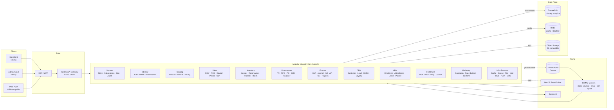

### 0.3 Ten principles that govern every change

| # | Principle | Practical meaning |
| --- | --- | --- |
| 1 | **Ledger first** | Stock + money are always derived from append-only ledgers, never mutable counters. |
| 2 | **Store isolation everywhere** | Every row, cache key, queue job, file path carries `storeId`. |
| 3 | **Strong consistency for money & stock** | DB transactions wrap the source-of-truth writes; side effects go async via outbox. |
| 4 | **Idempotent external operations** | Webhooks, POS sync, queue jobs are safe to retry. |
| 5 | **Human approval for high-risk writes** | Stock adjustments, payments, payroll, reversals require permission + audit + reason. |
| 6 | **Feature-gated by subscription** | Plan entitlement is checked separately from RBAC permission. |
| 7 | **Boundary-respecting** | Store → Branch → Warehouse hierarchy is enforced in services, queries, and UI. |
| 8 | **Reversibility** | Every business mutation has a reversal path; no silent deletes of business records. |
| 9 | **Snapshots over joins** | Order items, invoices, payslips store snapshots of price/tax/component at the time of event. |
| 10 | **Boring before clever** | Make the deterministic ERP correct first; AI/analytics sit on top later. |

### 0.4 The 12 bounded contexts

| # | Context | Source location | Owns |
| --- | --- | --- | --- |
| 1 | **System** | `modules/system/*` | Stores, subscriptions, organization (company/branch/warehouse), audit log, super-admin |
| 2 | **Identity & Access** | `modules/admin/core/{auth,user,rbac}` | Users, sessions, roles, permissions, scope assignments, overrides |
| 3 | **Catalog** | `modules/admin/catalog/*` | Products, variants, attributes, categories, brands, pricing books, reviews |
| 4 | **Sales** | `modules/admin/sales/*` | Orders, order items, returns, carts, coupons, promotions, payments |
| 5 | **POS** | `modules/admin/sales/pos` | Registers, shifts, drawer transactions |
| 6 | **Inventory / WMS** | `modules/admin/operations/logistics/inventory-transaction` | Inventory ledger, reservations, transfers, batches/lots |
| 7 | **Procurement** | `modules/admin/operations/finance/{purchase,supplier}` + `logistics/grn` | PR, RFQ, PO, supplier invoices, GRN, supplier AP ledger, debit notes |
| 8 | **Finance / Accounting** | `modules/admin/operations/finance/{accounting,expense,invoice,report}` | CoA, journal entries, ledger entries, AR ledger, wallet ledger, fiscal periods, tax rules, P&L, BS, cash flow |
| 9 | **CRM** | `modules/admin/customer/*` + `modules/admin/marketing/loyalty` + `store/wallet` | Customers, subscribers, leads, loyalty points, wallet, AR ledger (per customer) |
| 10 | **HRM** | `modules/admin/operations/hrm` | Employees, attendance, leave, shifts, payroll, recruitment, performance |
| 11 | **Fulfillment & Courier** | `modules/admin/operations/logistics/{fulfillment,courier}` | Pick/pack/ship, courier integration (Pathao, Steadfast), webhooks |
| 12 | **Marketing & Content** | `modules/admin/marketing/campaign` + `admin/content` | Campaigns, page builder, FAQs, content pages |

Cross-cutting **Infra Services** (`modules/admin/operations/infra/*`): cache, queue, file, mail, notification, chat, push, sms.

### 0.5 Request lifecycle in 5 steps

```
HTTP → StoreMiddleware → JwtAuthGuard → SubscriptionGuard → PermissionsGuard → BranchScope/WarehouseScopeGuard → Controller → Service (with RequestContextDto) → Repository (store-filtered) → DB
                                                                                                                                                   ↓
                                                                                                                                            EventEmitter / Outbox → BullMQ → Side effects
```

Every service method receives a `RequestContextDto { storeId, userId, userRole, branchId?, warehouseId?, branchScope, warehouseScope }`. **Services cannot get `storeId` from request body — only from this context.**

### 0.6 Where the money & stock truth lives

| Truth | Source table | Aggregation |
| --- | --- | --- |
| **Stock on hand** | `inventory_ledger` (append-only) | SUM by `(storeId, variantId, warehouseId)` |
| **Available stock** | `inventory_ledger` − active `stock_reservations` | Computed in `StockReservationService` |
| **Customer AR balance** | `ar_ledger` (append-only) | SUM by `(storeId, customerId)` |
| **Supplier AP balance** | `supplier_ap_ledger` (append-only) | SUM by `(storeId, supplierId)` |
| **GL account balance** | `ledger_entries` (append-only) | SUM by `(storeId, accountId, fiscal period)` |
| **Wallet balance** | `wallet_ledger` (append-only) | SUM by `(storeId, userId)` |
| **Loyalty points** | `loyalty_ledger` (append-only) | SUM by `(storeId, userId)` |

No code path may UPDATE these aggregates directly. New rows only.

### 0.7 Deployment topology (production)

- 2+ NestJS API instances (stateless, behind load balancer).
- 1+ Next.js storefront/admin instances.
- 1+ BullMQ worker instance (separate process, same code).
- 1 outbox dispatcher process.
- PostgreSQL primary + 1 read replica (reports).
- Redis (managed) — cache + BullMQ broker.
- S3-compatible object storage.
- CDN/WAF in front.

### 0.8 What this design *deliberately* does not include

- **AI/ML features** — covered in a separate extension document. AI sits on top of these APIs, never replaces them.
- **Active-active multi-region database** — out of scope for v1.
- **Cross-store analytics / shared customer master** — explicitly forbidden by store isolation principle.
- **Heavy data warehouse** — analytics use Postgres read replicas + materialized views.

### 0.9 How to read the rest of this document

| If you are a... | Jump to |
| --- | --- |
| Reviewer who needs the philosophy | Part I (§1-§4) |
| Engineer implementing a feature | Part II (boundaries) + Part III (modules) + Part IV (workflows) |
| Engineer doing reliability / SRE work | Part V (transactions, locking, events, failures) |
| Backend engineer building an API | Part VI (contracts, RBAC, security) |
| DBA / infra engineer | Part VII (indexes, caching, observability, deployment) |
| Tech-lead planning the next phase | Part VIII (testing, migration, readiness, roadmap) |

The detailed LLD per module lives in [`erp_low_level_system_design.md`](erp_low_level_system_design.md). The database schemas + ERD live in [`erp_master_database_design.md`](erp_master_database_design.md).

---

## Table of Contents

**Part I — Foundations**
1. [Purpose & Scope](#1-purpose--scope)
2. [Goals & Non-Goals](#2-goals--non-goals)
3. [Design Principles](#3-design-principles)
4. [Glossary](#4-glossary)

**Part II — Boundaries (Store / Branch / Warehouse)**
5. [Hierarchy Overview](#5-hierarchy-overview)
6. [Store Boundary](#6-store-boundary)
7. [Branch Boundary](#7-branch-boundary)
8. [Warehouse Boundary](#8-warehouse-boundary)
9. [User & Customer Scope Inside Boundaries](#9-user--customer-scope-inside-boundaries)
10. [Cross-Boundary Operations](#10-cross-boundary-operations)
11. [Boundary Enforcement Rules](#11-boundary-enforcement-rules)
12. [Data Ownership Matrix](#12-data-ownership-matrix)

**Part III — Architecture**
13. [High-Level Architecture](#13-high-level-architecture)
14. [Technology Stack](#14-technology-stack)
15. [Bounded Contexts (Modules)](#15-bounded-contexts-modules)
16. [Module Ownership & Service Boundaries](#16-module-ownership--service-boundaries)

**Part IV — Domain Workflows & Rules**
17. [Core Workflows](#17-core-workflows)
18. [Domain Invariants](#18-domain-invariants)
19. [Data Model Strategy](#19-data-model-strategy)

**Part V — Reliability**
20. [Transaction Boundaries](#20-transaction-boundaries)
21. [Locking Strategy](#21-locking-strategy)
22. [Event-Driven Architecture](#22-event-driven-architecture)
23. [Failure Mode Analysis](#23-failure-mode-analysis)
24. [Reconciliation & Repair Tools](#24-reconciliation--repair-tools)

**Part VI — APIs, Access & Security**
25. [API Contract Standards](#25-api-contract-standards)
26. [RBAC, Feature Gating & Scope](#26-rbac-feature-gating--scope)
27. [Security](#27-security)

**Part VII — Infrastructure**
28. [Database Constraints & Indexes](#28-database-constraints--indexes)
29. [Caching Strategy](#29-caching-strategy)
30. [Offline POS Design](#30-offline-pos-design)
31. [Observability](#31-observability)
32. [Deployment](#32-deployment)

**Part VIII — Delivery & Operations**
33. [Testing Strategy](#33-testing-strategy)
34. [Migration Strategy from Current Codebase](#34-migration-strategy-from-current-codebase)
35. [Production Readiness Checklist](#35-production-readiness-checklist)
36. [Phased Implementation Roadmap](#36-phased-implementation-roadmap)

**Part IX — Wrap**
37. [Acceptance Criteria](#37-acceptance-criteria)
38. [Final Senior Engineering View](#38-final-senior-engineering-view)

---

# Part I — Foundations

## 1. Purpose & Scope

This document defines the target architecture and rules to evolve the current multi-store eCommerce SaaS into a production-grade ERP platform.

The system supports:

- Multi-store store and ERP management.
- Multi-branch and multi-warehouse operations.
- Retail POS and online sales.
- Inventory ledger and warehouse workflows.
- Procurement and supplier management.
- Finance, accounting, AP, AR, and reporting.
- CRM, loyalty, wallet, and customer credit.
- HRM, attendance, leave, payroll, recruitment.
- Strong RBAC, audit logs, subscription gating, and feature permissions.

The system is designed for deterministic ERP behavior first: stock accuracy, financial correctness, store isolation, and auditable business workflows.

---

## 2. Goals & Non-Goals

### 2.1 Goals

- Run thousands of stores on a shared codebase with safe isolation.
- Cover order-to-cash, procure-to-pay, inventory-to-finance, HR-to-payroll lifecycles.
- Make every business event auditable and reversible.
- Make every cross-module event idempotent.
- Keep storefront eCommerce fast while ERP back-office grows.
- Allow each store to opt into modules by subscription tier.

### 2.2 Non-Goals (v1)

- AI/ML features (covered in a separate document).
- Cross-store analytics or shared customer master.
- Heavy data warehouse — analytics rely on Postgres + read replicas + materialized views.
- Multi-region active-active database.

---

## 3. Design Principles

1. **Ledger first.** Inventory and accounting are ledger-driven. Cached counters exist only as derived values.
2. **Store isolation everywhere.** Every row, cache key, queue job, file path, and report carries `storeId`.
3. **Strong consistency for money and stock.** Orders, reservations, movements, payments, and journals run inside DB transactions.
4. **Event-driven but not event-dependent for correctness.** Source-of-truth records are written transactionally; side effects flow via outbox and queues.
5. **Idempotent external operations.** Payment webhooks, POS sync, courier callbacks, queue jobs are safe to retry.
6. **Human approval for high-risk workflows.** Stock adjustments, supplier payments, payroll, journal reversals, and credit overrides require permission + audit + approval.
7. **Feature-gated by subscription.** Feature flags and RBAC permissions are separate concerns.
8. **Boundary-respecting design.** Store > Branch > Warehouse hierarchy is enforced consistently in services, repositories, and APIs.
9. **Reversibility.** Every business mutation must be reversible through audit/reversal paths.
10. **Boring before clever.** Make the deterministic system work; add intelligence later.

---

## 4. Glossary

| Term | Meaning |
| :--- | :--- |
| **Store** | A business that uses the SaaS. Top-level isolation boundary. |
| **Branch** | A physical or logical business location belonging to a store (store, office). |
| **Warehouse** | A physical storage location owning stock. May belong to a branch or be store-level. |
| **Bin** | A subdivision inside a warehouse (rack, shelf, zone). |
| **Cashier shift** | An open POS session at a register, owned by one user inside a branch. |
| **Stock reservation** | A commitment of stock for an order, not yet physically deducted. |
| **Inventory ledger** | Immutable append-only log of all stock movements. |
| **Journal entry** | A balanced double-entry accounting record. |
| **Outbox event** | A row written in the same DB transaction as a business mutation, later published as an event. |
| **Idempotency key** | A client-provided value that prevents duplicate processing of the same logical request. |
| **Feature gate** | A subscription-level check that the store is allowed to use a feature. |
| **Permission** | An RBAC entitlement granting a user the right to perform an action. |
| **Scope** | The branch/warehouse limit applied to a user's permissions. |

---

# Part II — Boundaries (Store / Branch / Warehouse)

> Boundaries are the most important rules in this ERP. They determine **who owns what**, **who can see what**, and **how data is allowed to flow between locations**. Almost every production incident in a multi-store ERP — wrong totals, leaked data, broken P&L, payroll miscredits — comes from a fuzzy boundary. This part defines them precisely.

**How to read Part II.** Sections §5–§8 define the *hierarchy* and *what belongs at each level*. Section §9 defines *user/customer/supplier scope within those levels*. Section §10 defines *operations that legally cross a boundary*. Section §11 defines *how the boundaries are enforced* in code, DB, cache, queue, and tests. Section §12 is the *authoritative ownership matrix* you can cite in PR reviews.

## 5. Hierarchy Overview

### 5.1 The Canonical Chain

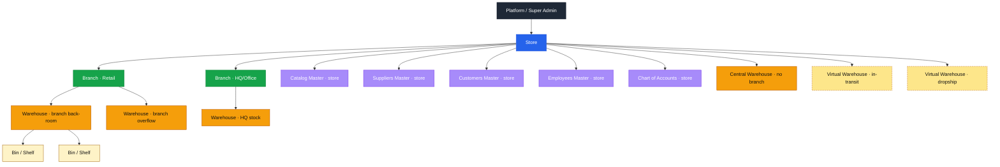

The chain is always `Platform → Store → Branch → Warehouse → Bin`, with two important *variations*:

| Variation | Description | Used for |
| :--- | :--- | :--- |
| **Store-level warehouse** | A warehouse whose `branchId` is NULL — owned directly by the store. | Central fulfillment, online-only operation, in-transit/dropship virtual warehouses. |
| **Branchless operation** | A store that has 0 branches (pure-online seller) operates entirely at store + warehouse level. | SMB e-commerce tier. |
| **Warehouseless branch** | A branch with no attached warehouse (consulting / service-only office). | Service businesses, holding-company branches. |

### 5.2 Boundary Cardinality Rules

| From | To | Cardinality | Notes |
| :--- | :--- | :--- | :--- |
| Platform | Store | 1 → N | One platform owns many stores. |
| Store | Branch | 1 → N | A store may have 0…N branches. |
| Store | Warehouse | 1 → N | Every warehouse belongs to exactly one store. |
| Branch | Warehouse | 0…1 → 0…N | A warehouse may belong to a branch or be store-level. A branch may have 0…N warehouses. |
| Warehouse | Bin | 1 → 0…N | Bins are optional refinement of a warehouse. |
| Branch | Branch | — | Branches do not nest. (No "sub-branch" hierarchy.) |
| Warehouse | Warehouse | — | Warehouses do not nest. (Use bins for sub-locations.) |

### 5.3 What Boundaries Are NOT

Common confusions worth eliminating up-front:

| Wrong mental model | Correct model |
| :--- | :--- |
| "Branches own stock" | **Warehouses** own stock. Branches are reporting/operational dimensions. A branch's stock figure is a *rollup* of its attached warehouses. |
| "Each branch has its own product master" | Catalog is **store-wide**. Branch-specific availability is modeled via warehouse stock + branch-specific price books, not duplicated SKUs. |
| "Each branch has its own customers" | Customers are **store-wide**. `preferredBranchId` is just a marketing tag. |
| "Each branch has its own Chart of Accounts" | CoA is **store-wide**. Branch P&L is a reporting *dimension* on journal lines, not a separate ledger. |
| "Warehouses have their own P&L" | Warehouses have **stock-value summaries**, not P&L. P&L lives at store level with branch dimension. |
| "Multi-company under one store" | A *legal multi-company group* is modeled as multiple **stores**, federated only at the platform level. One store = one set of books. |

### 5.4 Lifecycle States Per Level

Every boundary level has a finite state machine. Lifecycle transitions are gated by permissions and never silently delete history.

| Level | States | Transitions |
| :--- | :--- | :--- |
| **Store** | `PROVISIONING` → `TRIAL` → `ACTIVE` → `SUSPENDED` → `DELETED (soft)` | `SUSPENDED` blocks all admin writes except billing; `DELETED` triggers anonymization. |
| **Branch** | `DRAFT` → `ACTIVE` → `SUSPENDED` → `CLOSED` | `SUSPENDED` rejects new POS shifts/orders; `CLOSED` is final, retains history, blocks all writes. |
| **Warehouse** | `DRAFT` → `ACTIVE` → `FROZEN` → `CLOSED` | `FROZEN` rejects movements (used during stocktake); `CLOSED` requires zero on-hand and zero open transfers. |
| **Bin** | `ACTIVE` → `INACTIVE` | Inactive bins reject put-away. |
| **POS Register** | `ACTIVE` → `INACTIVE` | Inactive registers reject new shifts. |
| **POS Shift** | `OPEN` → `CLOSED` | One open shift per cashier (partial unique index). |

Closure invariants:

- A branch cannot be `CLOSED` while it has `OPEN` shifts, unsynced POS sales, or pending fulfillment tasks.
- A warehouse cannot be `CLOSED` while it has non-zero on-hand stock, open reservations, in-transit transfers, or open GRNs.

---

## 6. Store Boundary

> **Store is the strict isolation boundary.** No row, cache key, file, queue job, search-index document, log line, or report may cross it. Crossing this boundary is a security incident, not a feature.

### 6.1 What Lives at Store Level

| Category | Items |
| :--- | :--- |
| **Master data** | Products, variants, categories, brands, attributes, media; customers; suppliers; employees; price books. |
| **Financial master** | Chart of accounts, fiscal periods, tax codes, currency settings, exchange rates. |
| **Organizational definitions** | Branches, warehouses, bins (definitions live here; *operations* live at branch/warehouse level). |
| **Identity & access** | Users (staff), roles, permissions, scope assignments, permission overrides. |
| **Subscription** | Active plan, billing cycle, feature flag overrides, usage counters. |
| **Audit & compliance** | Audit logs, retention policies, data-export requests. |
| **Content & marketing** | Storefront settings, themes, page-builder pages, FAQs, loyalty program config, campaigns. |
| **Routing & domains** | Subdomain, custom-domain mapping, DNS verification status. |
| **Per-store configuration** | Email/SMS/push provider keys (encrypted), payment-gateway credentials, courier credentials. |

### 6.2 Store-Level Rules

1. **Every store-owned table includes `store_id uuid NOT NULL`** and at least one index leading with `store_id`.
2. **Store context derivation order:** (a) authenticated JWT claim, (b) request hostname (subdomain/custom domain), (c) explicit super-admin override header on platform routes only. **Never** from request body, query string, or user-supplied header on store routes.
3. **No store ID in store-facing URLs.** Routes are `/admin/...` and `/store/...`, never `/admin/{storeId}/...`. Store is resolved server-side.
4. **Cache, queue, file, search namespaces** all start with `t:{storeId}:` / `t/{storeId}/` / `t-{storeId}-` — see §11.4.
5. **Cross-store joins are forbidden in app code.** Only platform-admin SQL or background jobs (with explicit super-admin auth) may aggregate across stores.
6. **Store deletion is logical** — `store.status = DELETED`, `store.deleted_at = now()`. A retention worker anonymizes PII after grace period and preserves financial records per GAAP/region rules.
7. **Store suspension** does not delete data; it only blocks application writes (read may remain for the billing-reactivation flow).

### 6.3 Master Data Inside a Store

A single store has **one master record per business entity**, not one per branch.

| Entity | One per store | Branch link | Notes |
| :--- | :--- | :--- | :--- |
| Customer | ✅ | `preferredBranchId` (informational) | A customer can shop at any branch. Loyalty/wallet/AR are store-wide. |
| Supplier | ✅ | None | A supplier serves any branch/warehouse in the store. AP ledger is store-wide. |
| Employee | ✅ | `defaultBranchId` (assignment) | An employee may rotate across branches; HR profile is single. |
| Product / Variant | ✅ | None | One SKU per store. Branch-specific pricing → price books. Branch-specific availability → per-warehouse stock. |
| Chart of Accounts | ✅ | None | Branch shows up as a **dimension** on journal lines, never as a parallel CoA. |
| Tax codes | ✅ | None | Branch may *select* applicable tax codes via region, not own them. |

### 6.4 Store Uniqueness Invariants

Composite uniqueness rules that prevent cross-store collisions and enable safe per-store business keys:

```sql
-- Business keys are unique INSIDE a store, not globally
CREATE UNIQUE INDEX uq_product_sku_store
  ON products (store_id, sku) WHERE deleted_at IS NULL AND sku IS NOT NULL;

CREATE UNIQUE INDEX uq_customer_code_store
  ON customers (store_id, code) WHERE deleted_at IS NULL;

CREATE UNIQUE INDEX uq_supplier_code_store
  ON suppliers (store_id, code) WHERE deleted_at IS NULL;

CREATE UNIQUE INDEX uq_branch_code_store
  ON branches (store_id, code) WHERE deleted_at IS NULL;

CREATE UNIQUE INDEX uq_warehouse_code_store
  ON warehouses (store_id, code) WHERE deleted_at IS NULL;
```

Counter-example (a real bug we must prevent): a globally unique `products.sku` index would let one store block another from ever using SKU `IPHONE-15`.

### 6.5 Store Subscription ↔ Boundary Interaction

Boundaries are *gated by subscription tier*. The same boundary code runs everywhere; only access is shaped by the plan.

| Plan tier | Branch limit | Warehouse limit | Note |
| :--- | :--- | :--- | :--- |
| **Starter** | 1 | 1 | Single-branch, single-warehouse operation. |
| **Pro** | N (e.g. 5) | N (e.g. 10) | Multi-branch POS, multi-warehouse. |
| **Enterprise** | Unlimited (soft cap) | Unlimited (soft cap) | Includes HRM, advanced finance, transfers, batch tracking. |

Creating the `(N+1)th` branch returns `FEATURE_LIMIT_EXCEEDED` from the `SubscriptionGuard`/usage-counter, not from the branch service.

### 6.6 Forbidden Patterns at Store Level

| ❌ Do not | ✅ Do instead |
| :--- | :--- |
| Put `branchId` on the products table to make "branch-specific products" | Use one store-wide SKU + per-warehouse stock + per-branch price book. |
| Read `storeId` from the request body | Read it from `RequestContextDto` (derived from JWT/host). |
| Re-use a UUID across two stores in any column | Even soft-collisions in cache keys count — always prefix with `t:{storeId}:`. |
| Hard-delete a store | Soft delete; let the retention worker anonymize. |
| Create a "super store" who can see everyone | Use platform/super-admin routes; never grant cross-store scope to any store user. |

---

## 7. Branch Boundary

> **Branch is the operational and reporting dimension for retail/store activity.** It is *not* a data-ownership layer for masters; it is a *scope-and-attribution* layer for transactions.

### 7.1 What a Branch Is (and Is Not)

| It is | It is not |
| :--- | :--- |
| The physical/logical location where a sale happens. | A separate set of books. |
| The reporting dimension that answers "How did branch X perform?" | An owner of catalog, customers, or suppliers. |
| The scope a user is restricted to. | A wall around warehouses (a warehouse may be store-level or shared via routing). |
| Where POS registers and shifts live. | A nested hierarchy (no sub-branches). |

### 7.2 What Lives at Branch Level

| Category | Items |
| :--- | :--- |
| **POS infrastructure** | POS registers, cashier shifts, drawer transactions, branch-bound receipts. |
| **People** | Branch-assigned employees (`employee.defaultBranchId`), branch managers, cashiers. |
| **Operational config** | Branch opening hours, holiday calendar overrides, branch-specific payment-method allowlist, courier-method allowlist. |
| **Branch-tagged transactions** | POS orders (always), online orders (when assigned for fulfillment), expenses tagged at branch, attendance punches. |
| **Reporting attribution** | Sales revenue dimension on journals, expense allocation dimension, payroll cost dimension. |
| **Warehouse links** | Zero, one, or many attached warehouses (via `warehouse.branchId`). |

### 7.3 Branch-Level Rules

1. A branch belongs to **exactly one store**.
2. A branch is **not** an isolation boundary; it is a **scope and dimension** boundary inside a store.
3. A branch user without explicit cross-branch permission cannot read or write other branches' transactions.
4. A branch cannot own master data (products, customers, suppliers, accounts).
5. A branch cannot own stock — stock is owned by warehouses; branch stock = sum of attached warehouses.
6. A branch can be temporarily `SUSPENDED` (blocks new shifts/orders) without losing history.
7. A branch is `CLOSED` permanently only when it has no open shifts/orders/transfers; historical orders/payslips with `branchId` are *preserved by setting the FK to `SET NULL` only on master-data unlink, not on the transaction rows themselves*.

### 7.4 Branch as Reporting Dimension (Key Concept)

Most "branch ownership" in the system is actually **dimensional attribution**, not record ownership.

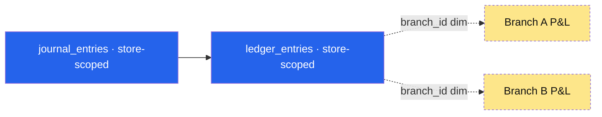

- The **table** is store-scoped (ownership).
- The **column** `branch_id` is a *dimension* used by reports (`GROUP BY branch_id`).
- Reports never have to read from a per-branch ledger; they slice the single store ledger.

This pattern applies to: `ledger_entries.branchId`, `journal_entries.branchId` (optional), `expenses.branchId`, `payroll_payslips.branchId`, `attendance_logs.branchId`.

### 7.5 Branch and Customer

- Customer profile is **store-wide**; a customer can shop at any branch.
- `customer.preferredBranchId` is *informational metadata* used by:
  - Branch-targeted marketing campaigns.
  - Default fulfillment branch for online orders (overridable).
  - Branch-tier loyalty rules (only if a store enables branch-specific loyalty).
- Customer credit (AR), wallet, loyalty points are **store-wide** — they do not split per branch.

### 7.6 Branch and Orders

| Order source | `branchId` rule | Why |
| :--- | :--- | :--- |
| **POS sale** | **Required.** Derived from `shift.registerId.branchId`. | Cash flow, cashier accountability, daily Z-report. |
| **Online order (default)** | `NULL` until routed. | Customer didn't pick a branch. |
| **Online order (assigned for fulfillment)** | Set on routing. | Revenue attribution + courier source. |
| **Admin-created order** | Optional; settable by admin. | Admin can attribute. |
| **Return (POS)** | Inherited from original sale; can be returned at *a different branch* with permission. | Customer convenience; cash drawer of accepting branch records the refund movement. |
| **Return (online)** | Inherited from the fulfillment branch (if any). | Same as above. |

### 7.7 Branch Lifecycle

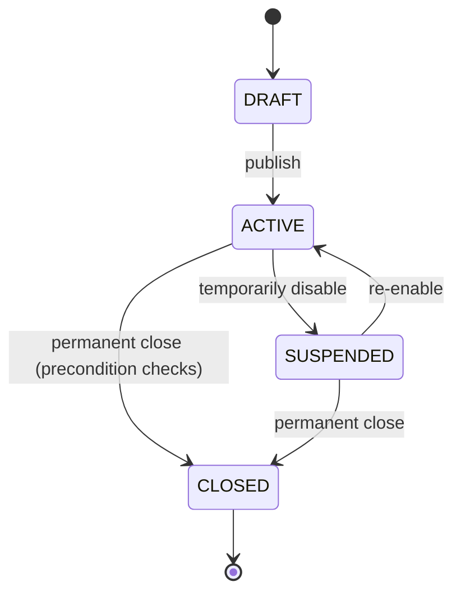

**Pre-conditions for `ACTIVE → CLOSED`:**
- No `OPEN` POS shifts.
- No `PENDING`/`PROCESSING` orders attributed to this branch.
- No `IN_TRANSIT` stock transfers in/out of this branch's warehouses.
- No `DRAFT`/`SENT` purchase orders with this branch's warehouse on lines.

If pre-conditions fail, return `BRANCH_CLOSE_BLOCKED` with the blocking record IDs.

### 7.8 Forbidden Patterns at Branch Level

| ❌ Do not | ✅ Do instead |
| :--- | :--- |
| Create branch-specific SKUs (`IPHONE-15-BRANCH-A`) | One SKU + warehouse-specific stock + price book if pricing differs. |
| Duplicate the Chart of Accounts per branch | Single CoA + `branch_id` dimension on ledger lines. |
| Store stock totals on the branch row | Stock totals are computed from warehouses owned by the branch. |
| Make customers "belong" to a branch | Store-wide customer + `preferredBranchId` tag. |
| Hard-delete a closed branch with historical orders | Set `branch.status = CLOSED`; keep `branch_id` on history rows. |

---

## 8. Warehouse Boundary

> **Warehouse is the physical inventory ownership boundary.** A unit of stock is always owned by exactly one warehouse at any moment in time. Stock cannot exist outside of a warehouse; it cannot be "stuck in space between two warehouses" — for that we use **virtual warehouses** (§8.4).

### 8.1 What Lives at Warehouse Level

| Category | Items |
| :--- | :--- |
| **Physical stock truth** | `inventory_ledger` entries (every row has `warehouseId`). |
| **Reservations** | `stock_reservations` (always warehouse-bound). |
| **Receiving** | GRN headers and lines for inbound goods. |
| **Outbound** | Pick lists, pack tasks, ship tasks scoped to this warehouse. |
| **Movements** | Stock transfer source/destination, adjustments, cycle counts. |
| **Sub-structure** | Bins / racks / zones / aisles. |
| **Batch / lot tracking** | Per-warehouse batch records for FEFO/FIFO depletion. |
| **Costing** | Weighted average cost (WAC) per `(store, variant, warehouse)`. |

### 8.2 Warehouse-Level Rules

1. A warehouse belongs to **exactly one store**.
2. A warehouse may belong to **one branch or to the store directly** (`warehouse.branchId` nullable).
3. Every physical stock movement row has `storeId` + `variantId` + `warehouseId`.
4. Every reservation row has `storeId` + `variantId` + `warehouseId`.
5. The `products` / `product_variants` table **must not store live stock totals**; if a cached counter exists (e.g. `variant.stock` for storefront speed), it is a *derived value*, never the source of truth.
6. **Negative stock is rejected by default.** It only succeeds if (a) the variant has `allowNegativeStock = true` (consignment/backorder use cases) **and** (b) an explicit approved override exists.
7. A warehouse cannot belong to two branches. To "share" a warehouse across branches, leave `branchId = NULL` (store-level).
8. Inter-warehouse moves are *documents* (`stock_transfer` + lines), never silent UPDATEs.

### 8.3 Warehouse and Reporting

Reporting rolls **up** from warehouse to branch to store:

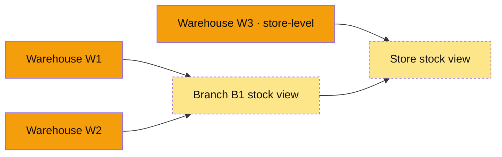

- "Stock at Branch B1" = SUM of on-hand across warehouses with `branchId = B1`.
- "Stock at Store T" = SUM of on-hand across all warehouses with `storeId = T`.
- Stock value (`qty × WAC`) is a store-level financial number, decomposable to warehouse.

### 8.4 Warehouse Types

| Type | Stores real stock? | `branchId` | Examples |
| :--- | :--- | :--- | :--- |
| `MAIN` | Yes | Optional | Central fulfillment, store back-room. |
| `RETAIL` | Yes | Required | Branch sales-floor with countable stock. |
| `RETURN` | Yes | Optional | Returned-goods staging before re-shelving or write-off. |
| `TRANSIT` *(virtual)* | Yes (in-transit only) | `NULL` | Holds units between source warehouse out and destination warehouse in. |
| `DROPSHIP` *(virtual)* | No physical on-hand; ledger receives + ships in one transaction | `NULL` | Marketplace orders fulfilled directly by supplier. |
| `CONSIGNMENT` | Yes, but cost/title is supplier's until sold | Optional | Vendor-managed inventory. Special accounting rule: COGS posts only on sale. |

Virtual warehouses keep the rule "all stock lives in a warehouse" true even when the stock is physically in transit or never on-premise.

### 8.5 Bins

- Bins are an **optional refinement** of warehouse stock for high-density picking.
- Bin-level stock is still warehouse-scoped: `(store, variant, warehouse, bin)`.
- A store can enable bin tracking per warehouse incrementally.
- Pick lists may target bins; receiving may put away to bins.
- A bin does **not** create a new ownership boundary — adjustments, transfers, and reservations are still warehouse-level.

### 8.6 Warehouse Lifecycle

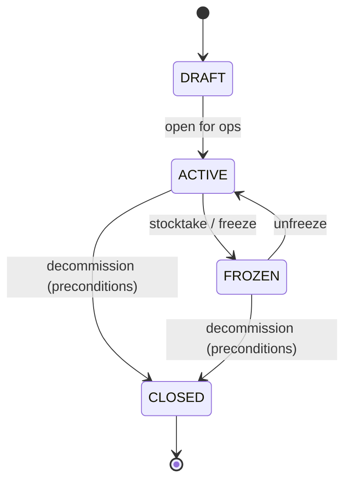

**`FROZEN`** rejects all movements (in, out, transfer, reservation, adjustment); reads are allowed. Used during cycle counts and migration.

**Pre-conditions for `ACTIVE → CLOSED`:**
- On-hand quantity = 0 across all variants and bins.
- No `ACTIVE` reservations.
- No `IN_TRANSIT` transfers in or out.
- No `DRAFT`/`SENT` POs delivering here.

If pre-conditions fail, return `WAREHOUSE_CLOSE_BLOCKED` with the blocking IDs and offer the operator a one-click "move all stock to warehouse X" transfer-draft helper.

### 8.7 Forbidden Patterns at Warehouse Level

| ❌ Do not | ✅ Do instead |
| :--- | :--- |
| Update `variant.stock` directly | Insert a row in `inventory_ledger`; let the projection recompute. |
| Move stock between warehouses with an `UPDATE` | Create a `stock_transfer` document; emit `TRANSFER_OUT` + `TRANSFER_IN` rows. |
| Allow a single `inventory_ledger` row to belong to two warehouses | Each row is exactly one warehouse; transfers are *two* rows. |
| Share a `bin` across warehouses | Bins are warehouse-scoped (`UNIQUE (store_id, warehouse_id, code)`). |
| Let a virtual warehouse have a default cashier | Virtual warehouses have no people, just movements. |

---

## 9. User & Customer Scope Inside Boundaries

> **Scope** is the per-user, per-customer, or per-supplier *slice of the store* that a request operates inside. It is separate from **role** (what the user can *do*) and from **subscription** (whether the feature is enabled at all).

### 9.1 The Three Independent Access Layers

Every request is evaluated against all three:

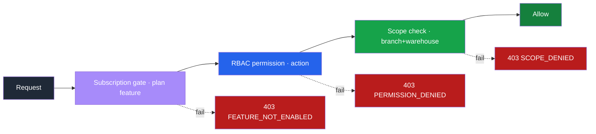

| Layer | Question | Answered by |
| :--- | :--- | :--- |
| Subscription | Is the store allowed this feature at all? | `SubscriptionGuard` + subscription plan features |
| Permission | Is the user allowed this action? | `PermissionsGuard` + `user_role_assignments` + `permissions` |
| Scope | Can the user touch this branch/warehouse? | `BranchScopeGuard` + `WarehouseScopeGuard` + `user.branchId` / role assignment scope |

### 9.2 Staff Scope Model

Each staff user resolves to a `RequestContextDto`:

```ts
type ScopeMode = 'ALL' | 'EXPLICIT' | 'NONE'

interface RequestContextDto {
  storeId: string
  userId: string
  userRole: 'SUPER_ADMIN' | 'STORE_OWNER' | 'STORE_ADMIN' | 'STAFF'
  branchScope: { mode: ScopeMode; allowedBranchIds: string[] }
  warehouseScope: { mode: ScopeMode; allowedWarehouseIds: string[] }
  activeBranchId?: string     // from X-Branch-Id header, validated against scope
  activeWarehouseId?: string  // from X-Warehouse-Id header, validated against scope
  permissions: Set<string>
}
```

**Scope mode semantics:**

| Mode | Meaning | Typical role |
| :--- | :--- | :--- |
| `ALL` | The user may operate on every branch/warehouse in the store. The "Branch Switcher" UI is enabled. | Store Owner, Store Admin, Accountant (often). |
| `EXPLICIT` | The user is restricted to a non-empty list of IDs. Requests outside the list return `SCOPE_DENIED`. | Branch Manager, Warehouse Clerk, Regional Manager (multiple branches). |
| `NONE` | The user has no operational scope (read-only at store-master level, e.g. a Compliance Auditor). | Auditor, Accountant with read-only finance, viewer roles. |

### 9.3 Scope Inheritance Rules

When `warehouseScope.mode = NONE` (i.e. unset), the system **derives warehouse scope from branch scope**:

- `branchScope.mode = ALL` ⇒ `warehouseScope = ALL` (effective).
- `branchScope.mode = EXPLICIT` with `[B1]` ⇒ effective `warehouseScope = warehouses where branchId IN (B1) OR branchId IS NULL` *(store-level warehouses are shared)*.
- `branchScope.mode = NONE` and `warehouseScope.mode = NONE` ⇒ no operational scope; only master-data reads if permission allows.

Explicit warehouse scope **always wins over derivation**. A Warehouse Clerk with `branchScope = NONE` and `warehouseScope = EXPLICIT [W1]` can act on W1 even though they have no branch scope at all.

### 9.4 Standard Role Personas

| Persona | `branchScope` | `warehouseScope` | Notes |
| :--- | :--- | :--- | :--- |
| **Store Owner** | `ALL` | `ALL` | Cannot self-revoke; permission set is widest. |
| **Store Admin** | `ALL` | `ALL` | Like Owner but optional restrictions on finance/HR. |
| **Accountant** | `ALL` | `NONE` | Store-wide finance read/write; no warehouse ops. |
| **Branch Manager (single)** | `EXPLICIT [B1]` | derived (B1's warehouses + store warehouses) | Branch P&L, staff, POS oversight. |
| **Regional Manager** | `EXPLICIT [B1, B2, B3]` | derived | Same but multi-branch. |
| **Cashier** | `EXPLICIT [B1]` | derived (read-only) | POS write permissions only. |
| **Warehouse Clerk** | `NONE` | `EXPLICIT [W1]` | Receive/transfer/adjust at W1 only. |
| **Procurement Officer** | `ALL` | `ALL` (read) + explicit on writes | Suppliers + PR/PO; GRN read only (unless dual role). |
| **HR Manager** | `ALL` | `NONE` | HRM read/write; finance read for payroll context. |
| **Compliance Auditor** | `ALL` (read) | `ALL` (read) | No writes anywhere. |

### 9.5 Active Scope vs Allowed Scope

A user with `branchScope = EXPLICIT [B1, B2, B3]` can be *currently acting on* one branch at a time via the `X-Branch-Id` request header. The guard validates the active branch is in the allowed list and writes it into `ctx.activeBranchId`.

| Scenario | `allowedBranchIds` | `X-Branch-Id` header | Result |
| :--- | :--- | :--- | :--- |
| Multi-branch manager picks one | `[B1, B2]` | `B1` | `activeBranchId = B1` |
| Tries to switch outside scope | `[B1, B2]` | `B3` | `403 SCOPE_DENIED` |
| Store Owner (`ALL`) reads everywhere | `ALL` | none | All-branches view |
| Cashier without header | `[B1]` | none | `activeBranchId = B1` auto-bound |

POS sales, attendance punches, and any branch-bound write **must have `activeBranchId` set**; the guard rejects ambiguous requests with `BRANCH_CONTEXT_REQUIRED`.

### 9.6 Customer Scope

- A customer is **store-wide** and may shop at any branch.
- `customer.preferredBranchId` is *metadata only*; it never blocks cross-branch purchase.
- Customer credit limit (AR), wallet balance, and loyalty points are **store-wide**.
- Branch-specific loyalty rules (if a store enables them) are *campaign-level* — the campaign rule filters by branch, the ledger itself is single.
- A customer cannot be "transferred" between branches; only `preferredBranchId` is editable.

### 9.7 Supplier Scope

- A supplier is **store-wide**.
- A purchase order can be raised from any branch/warehouse with permission; PO header is store-level, while GRN(s) and warehouse on PO lines define *where* delivery lands.
- Supplier AP ledger is **store-wide** (one balance per supplier).
- Branch-specific supplier price overrides (if store enables them) live on the supplier-product-price table, not on a new supplier row.

---

## 10. Cross-Boundary Operations

> Operations crossing a natural boundary are **first-class business documents**, not silent multi-row updates. Each requires (a) an explicit service method, (b) an explicit permission, (c) an audit trail, and (d) idempotent execution.

### 10.1 Cross-Store — Strictly Forbidden in Application Code

No application code path is allowed to read or write across stores. This includes:

- No JOIN across `store_id` boundaries.
- No queue worker that reads jobs of mixed stores without per-store scoping inside the handler.
- No cache key that combines stores.
- No report that aggregates across stores for a store user.

Cross-store operations exist **only** at the platform level via super-admin routes / cron jobs (e.g. billing rollups, regional tax-template seeding) and are subject to separate audit logs.

### 10.2 Cross-Branch Operations (Within One Store)

| Operation | Boundary crossed | Required permission | Audit |
| :--- | :--- | :--- | :--- |
| Cross-branch order fulfillment (order at Branch A, ship from Branch B's warehouse) | Branch ↔ Branch | `fulfillment.cross_branch.route` | Routing decision + reason logged on order. |
| Cross-branch return (POS sale at Branch A, returned at Branch B) | Branch ↔ Branch | `sales.return.cross_branch` | Refund recorded against B's drawer; revenue reversal stays on A's P&L; offset journal entries cross-tag both branches. |
| Branch reassignment of a warehouse (move W1 from Branch A to Branch B) | Branch ↔ Branch (master data move) | `org.warehouse.reassign` | Historic ledger rows keep prior `branchId` snapshot for reporting integrity. |
| Multi-branch payroll batch | HR ↔ many branches | `hrm.payroll.process` | Each payslip carries its own `branchId` for cost attribution. |
| Cross-branch promotion / coupon | Marketing ↔ many branches | `marketing.campaign.publish` | Campaign rule states applicable branches; audit on creation. |

### 10.3 Cross-Warehouse Operations (Within One Store)

| Operation | Boundary crossed | Required permission | Document type |
| :--- | :--- | :--- | :--- |
| **Stock Transfer** | Warehouse ↔ Warehouse | `inventory.transfer.create` + `inventory.transfer.approve` | `stock_transfer` header with `status DRAFT → APPROVED → IN_TRANSIT → RECEIVED` |
| **Cross-warehouse picking for one order** | Warehouse ↔ Warehouse | `fulfillment.split_shipment.create` | Multi-source fulfillment task; one shipment per source warehouse. |
| **Goods-In to store warehouse, transferred out to branch warehouse** | Warehouse ↔ Warehouse | Standard `inventory.transfer.*` | Two-step: GRN at central + transfer to branch. |
| **Cycle-count discrepancy adjustment** | Warehouse-internal only | `inventory.adjust.approve` | `inventory_adjustment` document; never an UPDATE. |

**Reservation invariant during transfers.** When a stock transfer enters `IN_TRANSIT`, the source warehouse's ledger receives a `TRANSFER_OUT` row; the destination warehouse does not yet have it. To avoid the "stock in space" problem, the transfer **may** post to a virtual `TRANSIT` warehouse (§8.4) so the store's total stock never appears to drop. Stores choose this via a per-store setting.

### 10.4 Worked Examples (Concrete Rows)

**Example A — POS sale at Branch B1 with register tied to Warehouse W1**

```
Order row:
  store_id   = T1
  branch_id   = B1
  source      = POS
  shift_id    = SH-2025-01-01-001
  client_sale_id = c0ffee... (idempotency)

Inventory ledger (stock leaves W1):
  store_id    = T1
  variant_id   = V1
  warehouse_id = W1
  qty_delta    = -2
  ref_type     = ORDER
  ref_id       = O1

Journal entries (store-scoped, branch dim):
  DR Cash (1010)        amount=200  branch_id=B1
  CR Revenue (4000)     amount=200  branch_id=B1
  DR COGS (5000)        amount=120  branch_id=B1
  CR Inventory (1100)   amount=120  branch_id=B1
```

**Example B — Online order, customer with `preferredBranchId = B1`, routed to ship from Warehouse W3 (store-level)**

```
Order row:
  store_id   = T1
  branch_id   = NULL (set later by routing decision)
  source      = WEBSITE
  customer_id = C1   (preferredBranchId metadata is read, not enforced)

Routing decision:
  → set order.branch_id = B2 (chosen for fulfillment by router)
  → fulfillment_task.warehouse_id = W3

Inventory ledger:
  warehouse_id = W3  (store-level)

Journal entries:
  Revenue branch_id = B2 (the assigned fulfillment branch)
  COGS branch_id    = B2 (same; warehouse is dimension on stock report, not on COGS)
```

**Example C — Stock Transfer W1 → W2 with TRANSIT virtual warehouse**

```
Transfer header:
  store_id = T1
  source_warehouse_id = W1
  destination_warehouse_id = W2
  status = IN_TRANSIT

Ledger entries (three rows, atomic):
  W1: -10 (TRANSFER_OUT,   ref=TRF-001)
  WT: +10 (TRANSFER_IN,    ref=TRF-001)   ← virtual TRANSIT warehouse
  -- on receipt:
  WT: -10 (TRANSFER_OUT,   ref=TRF-001)
  W2: +10 (TRANSFER_IN,    ref=TRF-001)

Store total stock = unchanged throughout.
```

**Example D — POS Return at Branch B2 of a sale originally made at Branch B1**

```
Original sale: order O1 with branch_id = B1, warehouse drawn from W1.
Customer returns at Branch B2's POS terminal.

Return doc:
  return_id = R1
  original_order_id = O1
  return_branch_id = B2          ← where the customer physically returned
  refund_drawer_branch_id = B2   ← cash leaves B2's drawer

Inventory ledger:
  warehouse_id = W4 (B2's RETURN warehouse — physically lands here, restock later)
  qty_delta    = +1
  ref_type     = RETURN

Journals (the tricky part — both branches tagged):
  DR Sales Returns (4001)  amount=100  branch_id=B1   ← reversal stays on B1's P&L
  CR Cash (1010)           amount=100  branch_id=B2   ← cash leaves B2's drawer

This dual-branch posting is allowed because journal lines, not headers, carry the branch dimension.
```

### 10.5 Cross-Boundary Anti-Patterns

| ❌ Anti-pattern | Why it's wrong |
| :--- | :--- |
| `UPDATE products SET branch_id = X` to "move products to a branch" | Products don't have a branch boundary. |
| `INSERT INTO inventory_ledger (warehouse_id = NULL, branch_id = B1)` | Physical movements require a warehouse; branch is dimension. |
| Reading another store's row for a "platform analytics" feature in store scope | Platform analytics live on super-admin routes only. |
| Silent cross-branch fulfillment without `cross_branch.route` permission | Skips audit and accountability. |
| Posting a refund directly against the original-branch drawer when the return happened at another branch | Misstates cash position; use dual-branch journal lines (Example D). |

### 10.6 Audit Trail Expectations

Every cross-boundary operation writes at least one `audit_log` entry with:

- `storeId`, `userId`, `actionCode` (e.g. `stock_transfer.approve`).
- `sourceContext` (`branchId` / `warehouseId` the user was acting from).
- `targetContext` (the other side of the boundary).
- `reason` (required for high-risk actions).
- `payload` (full request body snapshot, with PII masked per retention rule).

---

## 11. Boundary Enforcement Rules

> Boundary enforcement is **defense in depth**: never rely on a single layer. The guard chain may pass, but the repository filter, DB constraint, cache prefix, and integration test must also hold.

### 11.1 The Five Enforcement Layers

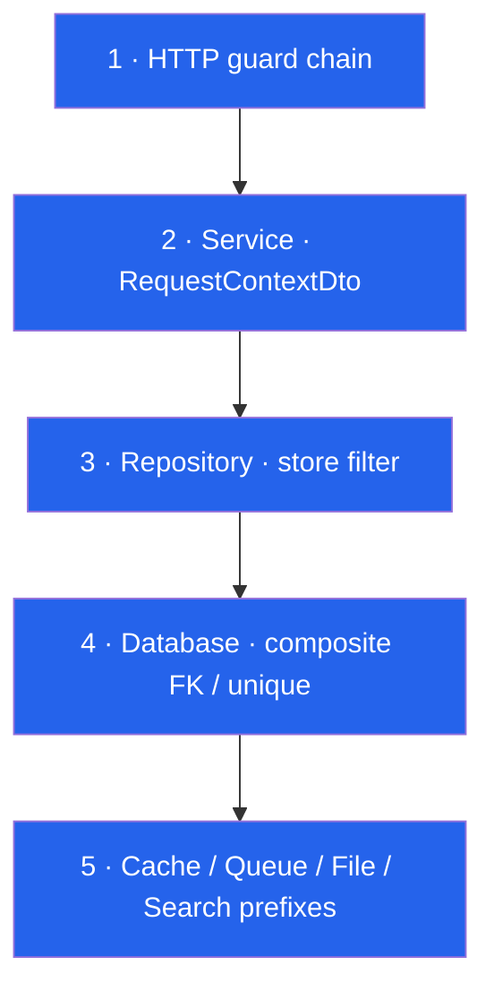

| Layer | Mechanism | What it stops |
| :--- | :--- | :--- |
| 1 | `Store middleware` + `JwtAuthGuard` + `SubscriptionGuard` + `PermissionsGuard` + `BranchScopeGuard` + `WarehouseScopeGuard` | Most unauthorized requests, plan-locked features, scope violations. |
| 2 | Services read `storeId` / `branchId` / `warehouseId` only from `RequestContextDto` | Spoofed body params, replayed payloads. |
| 3 | Every repo method `.andWhere('e.storeId = :storeId', ctx)` | Forgotten filters by developers. |
| 4 | Composite FK + composite UK + (optionally) RLS | Bugs that survive layers 1–3. |
| 5 | `t:{storeId}:`, `t/{storeId}/`, `t-{storeId}-`, queue payload schema with `storeId` required | Out-of-band cross-store leakage. |

### 11.2 Foreign-Key Store Consistency

When linking a warehouse to a branch, a PO to a supplier, an order item to a variant, etc., the referenced row **must** belong to the same store. PostgreSQL `CHECK` constraints cannot reference other tables, so the correct approach is the **composite-FK pattern** (preferred) or a **trigger** (fallback).

**Pattern A — Composite Foreign Key (preferred, no triggers):**

```sql
-- 1. Add composite unique key on the parent so a composite FK can target it.
ALTER TABLE branches
  ADD CONSTRAINT branches_store_id_id_uk UNIQUE (store_id, id);

-- 2. Replace the single-column FK on the child with a composite FK that
--    forces the child's store_id to match the parent's store_id.
ALTER TABLE warehouses
  DROP CONSTRAINT IF EXISTS warehouses_branch_id_fk;

ALTER TABLE warehouses
  ADD CONSTRAINT warehouses_branch_same_store_fk
  FOREIGN KEY (store_id, branch_id)
  REFERENCES branches (store_id, id);
```

This guarantees by the database itself that `warehouse.store_id == branch.store_id` for every row.

**Pattern B — Trigger (fallback for tables where adding composite UK to the parent is too disruptive):**

```sql
CREATE OR REPLACE FUNCTION enforce_same_store_branch_on_warehouse()
RETURNS TRIGGER AS $$
BEGIN
  IF NEW.branch_id IS NOT NULL THEN
    PERFORM 1 FROM branches
    WHERE id = NEW.branch_id AND store_id = NEW.store_id;
    IF NOT FOUND THEN
      RAISE EXCEPTION 'warehouse.branch_id % does not belong to store %', NEW.branch_id, NEW.store_id;
    END IF;
  END IF;
  RETURN NEW;
END;
$$ LANGUAGE plpgsql;

CREATE TRIGGER trg_warehouse_same_store_branch
BEFORE INSERT OR UPDATE ON warehouses
FOR EACH ROW EXECUTE FUNCTION enforce_same_store_branch_on_warehouse();
```

Apply Pattern A or B to every cross-table link where both sides carry `store_id`: `orders → customers`, `order_items → variants`, `purchase_orders → suppliers`, `pos_registers → branches`, `pos_shifts → registers`, `inventory_ledger → variants`, `inventory_ledger → warehouses`, `payslips → employees`, etc.

> **Migration strategy:** Roll out composite-FK constraints behind a feature flag per table; backfill any violating rows in a store-by-store repair job before enabling the constraint as `NOT VALID` then `VALIDATE CONSTRAINT`.

### 11.3 (Optional) Row-Level Security as a Safety Net

For sensitive subdomains (finance, payroll), consider PostgreSQL Row-Level Security as a backstop:

```sql
ALTER TABLE journal_entries ENABLE ROW LEVEL SECURITY;

CREATE POLICY journal_entries_store_isolation ON journal_entries
USING (store_id = current_setting('app.current_store_id', true)::uuid);

-- application sets the GUC per transaction:
SET LOCAL app.current_store_id = '...uuid...';
```

RLS is **belt-and-braces**, not a substitute for layers 1–4. It costs query-plan complexity and requires connection-pool discipline (set the GUC on every checkout). Apply selectively where the blast radius of a missed filter is unacceptable.

### 11.4 Cache, Queue, File, Search Enforcement

| Resource | Required prefix | Validation |
| :--- | :--- | :--- |
| Redis cache key | `t:{storeId}:{module}:{resource}:{paramsHash}` | Cache wrapper rejects keys without prefix. |
| Redis ratelimiter | `t:{storeId}:rl:{route}` | Same wrapper. |
| Queue job payload | JSON `{ storeId, … }`; schema-validated at enqueue and dequeue | Worker drops job and alerts if `storeId` missing. |
| Pub/sub channel | `t:{storeId}:events:{type}` | Subscriber whitelist enforces prefix. |
| File storage path | `t/{storeId}/{module}/{filename}` | Upload service rejects paths that don't start with `t/{ctx.storeId}/`. |
| Signed URL | Verified by inspecting the path before signing | Service refuses to sign cross-store paths. |
| Search index | One index per store `t-{storeId}-{resource}` *or* a shared index with mandatory `store_id` filter on every query | Search client wrapper injects the filter. |
| Log line | `storeId` field present in every structured log | Loki/ELK query templates require it. |

### 11.5 Frontend Enforcement

- The sidebar/menu is filtered by `subscription_features ∩ permissions ∩ scope`. A user cannot click into a page they don't have scope for.
- List pages default to the user's `activeBranchId` / `activeWarehouseId`; a "Show all" toggle appears only if the user has `ALL` scope on that axis.
- The branch/warehouse switcher dropdown shows only the user's allowed IDs (server-rendered from `ctx`).
- The frontend **does not enforce security** — it improves UX. All checks repeat server-side.

### 11.6 Test Enforcement

Cross-store / cross-scope tests are **required** for every module's CI. The standard fixture:

```ts
const storeA = await seedStore('Acme')
const storeB = await seedStore('Globex')

// 1. Cross-store read denial
await expect(asUser(storeA.owner).get(`/admin/orders/${storeB.order.id}`))
  .toReturn(404)   // must NOT leak that the row exists

// 2. Cross-branch denial within store
const mgrB1 = await seedUser(storeA, { branchScope: ['B1'] })
await expect(asUser(mgrB1).get(`/admin/pos/shifts?branchId=B2`))
  .toReturn(403)

// 3. Cross-warehouse adjustment denial
const clerkW1 = await seedUser(storeA, { warehouseScope: ['W1'] })
await expect(asUser(clerkW1).post(`/admin/inventory/adjust`, { warehouseId: 'W2' }))
  .toReturn(403)

// 4. Cache / queue store prefix sanity
await expect(redisKeys('*')).toAllMatch(/^t:[a-f0-9-]+:/)
```

The CI gate fails the PR if any new entity is added without an accompanying cross-store denial test.

### 11.7 Operational Safety Nets

- **Periodic invariant scan:** a nightly cron checks for orphan rows where `store_id` mismatches with any FK target. Findings open a ticket in the ops queue.
- **Read-only super-admin:** super-admin tooling for cross-store inspection runs through a separate connection pool with a different DB user (audited).
- **Backup-restore drills:** restore a single store from backup without touching others — verifies that physical isolation tooling works.

---

## 12. Data Ownership Matrix

> The authoritative ownership reference. When in doubt during code review, cite this matrix.

### 12.1 Legend

| Symbol | Meaning |
| :--- | :--- |
| ✅ | This level **owns** the record (record cannot exist without this scope). |
| dim | This level is a **dimension** on the row for reporting; the row is owned by a higher level. |
| rollup | This level reports via *rolling up* lower-level rows; it does not store the row itself. |
| opt | The column may be set or null; ownership is at a higher level. |
| 🔒 | Cross-this-boundary writes require explicit permission + audit. |

### 12.2 Master Data

| Resource | Store | Branch | Warehouse | Bin | Notes |
| :--- | :---: | :---: | :---: | :---: | :--- |
| Stores | (platform) | | | | Platform owns; store has self-config. |
| Branches | ✅ | | | | Store owns; branch is a row inside store. |
| Warehouses | ✅ | opt | | | Store owns; warehouse may attach to one branch. |
| Bins | ✅ | | ✅ | | Bin is scoped inside one warehouse. |
| Products / Variants | ✅ | | | | One SKU per store. |
| Categories / Brands | ✅ | | | | Store-wide. |
| Price Books | ✅ | opt | | | Optional branch tag for branch-specific pricing. |
| Customers | ✅ | | | | `preferredBranchId` is informational metadata. |
| Suppliers | ✅ | | | | Store-wide; supplier-product price overrides may be per-warehouse. |
| Employees | ✅ | opt | opt | | `defaultBranchId` / `defaultWarehouseId` on profile. |
| Chart of Accounts | ✅ | | | | Store-wide. |
| Fiscal Periods | ✅ | | | | Store-wide. |
| Tax Codes / Jurisdictions | ✅ | | | | Store-wide. |
| Currency / Exchange Rates | ✅ | | | | Store-wide. |
| Subscriptions / Billing | ✅ | | | | Store-wide. |
| Roles / Permissions | ✅ | | | | Store defines roles; permissions are platform-defined. |

### 12.3 Financial & Subledgers

| Resource | Store | Branch | Warehouse | Notes |
| :--- | :---: | :---: | :---: | :--- |
| Journal Entries (header) | ✅ | dim | | `branch_id` on header is optional summary tag. |
| Ledger Entries (lines) | ✅ | dim | dim | Line-level `branch_id` / `warehouse_id` for fine-grained reports. |
| AR Ledger (customer) | ✅ | | | Per customer; store-wide balance. |
| AP Ledger (supplier) | ✅ | | | Per supplier; store-wide balance. |
| Wallet Ledger | ✅ | | | Per customer; store-wide. References original branch via order linkage. |
| Loyalty Ledger | ✅ | | | Per customer; store-wide. |
| Expenses | ✅ | dim | opt | Branch dim for cost allocation. |
| Supplier Invoices | ✅ | | | Store-wide; warehouse on lines indicates receipt location. |
| Supplier Payments | ✅ | | | Store-wide. |
| Customer Invoices | ✅ | dim | | Branch dim for revenue attribution. |
| Customer Payments | ✅ | dim | | Branch dim where drawer received cash. |

### 12.4 Operations (Sales, POS, Inventory)

| Resource | Store | Branch | Warehouse | Notes |
| :--- | :---: | :---: | :---: | :--- |
| Orders (online) | ✅ | opt 🔒 | | Branch set when routed for fulfillment. |
| Orders (POS) | ✅ | ✅ | | Branch derived from shift→register. |
| Order Items | ✅ | (inherits) | | Branch via header. |
| Returns | ✅ | ✅ | dim | Return branch may differ from original order branch (see §10.4 Example D). |
| Stock on Hand | ✅ | rollup | ✅ | Authoritative per warehouse. |
| Inventory Ledger | ✅ | dim | ✅ | Warehouse required; branch is dimensional rollup. |
| Stock Reservations | ✅ | | ✅ | Always warehouse-scoped. |
| Stock Transfers | ✅ | | ✅ × 2 🔒 | Source + destination warehouse. |
| Stock Adjustments | ✅ | | ✅ 🔒 | Approval required. |
| Cycle Counts | ✅ | | ✅ | Warehouse-scoped. |
| GRN | ✅ | dim | ✅ | Warehouse required; branch dim for reports. |
| Fulfillment Tasks | ✅ | opt | ✅ | Branch optional if cross-branch fulfillment. |
| POS Registers | ✅ | ✅ | | Belongs to a branch. |
| POS Shifts | ✅ | ✅ | | Inherits from register. |
| POS Drawer Movements | ✅ | ✅ | | Inherits from shift. |
| Coupons / Promotions | ✅ | opt | | Optional branch allowlist. |
| Campaigns | ✅ | opt | | Optional branch allowlist. |
| Purchase Requisitions | ✅ | opt | opt | Branch/warehouse who requested. |
| Purchase Orders | ✅ | opt | opt | Warehouse on lines. |

### 12.5 People & Time

| Resource | Store | Branch | Warehouse | Notes |
| :--- | :---: | :---: | :---: | :--- |
| Attendance Logs | ✅ | dim | dim | Branch dim for shift reports. |
| Leave Requests | ✅ | dim | | Branch dim only. |
| Payroll Batches | ✅ | | | Store-wide batch; per-employee payslips. |
| Payslips | ✅ | dim | | Branch dim for cost allocation. |
| Recruitment / Hiring | ✅ | dim | | Branch where the role is open. |
| Performance Reviews | ✅ | dim | | Branch dim. |

### 12.6 Cross-Cutting

| Resource | Store | Branch | Warehouse | Notes |
| :--- | :---: | :---: | :---: | :--- |
| Audit Logs | ✅ | dim | dim | Always store-scoped; source/target context captured. |
| Notifications | ✅ | dim | dim | Recipient is a user; branch/warehouse dim for routing. |
| File Uploads (media) | ✅ | | | Path always `t/{storeId}/...`. |
| Search Index Docs | ✅ | dim | dim | Filter clauses include branch/warehouse where applicable. |
| Outbox Events | ✅ | dim | dim | Store-scoped; consumer reads context from payload. |
| Idempotency Keys | ✅ | | | Scoped `(store_id, key)`. |
| Cache Entries | ✅ | dim | dim | Key prefix includes any narrower scope when relevant. |
| Settings (storefront / payment / courier) | ✅ | opt | | Optional branch override. |

### 12.7 Reporting Roll-Up Paths

```
Warehouse → Branch (where warehouse.branchId is set) → Store
Warehouse (store-level) ─────────────────────────────→ Store
Branch ────────────────────────────────────────────────→ Store
Employee → Branch (defaultBranchId) ───────────────────→ Store
Order (POS) → Branch (via shift→register) ─────────────→ Store
Order (Online, routed) → Branch (assigned) ────────────→ Store
Order (Online, unrouted) ──────────────────────────────→ Store
```

All reports start from these paths. A "Branch P&L" is `journal_lines WHERE branch_id = B AND fiscal_period = P`. A "Warehouse Stock Value" is `SUM(qty × wac) FROM inventory_ledger projection WHERE warehouse_id = W`. There is no parallel ledger or stock table per branch; reports always slice store-wide tables.

---

### 12.8 Decision Cheat-Sheet

When you find yourself adding a new column to model a boundary, run this checklist:

1. **Is the entity owned by store only?** → No `branch_id` / `warehouse_id` columns. Reports slice via JOIN.
2. **Is the entity owned by a branch (POS/shift/register)?** → `store_id NOT NULL`, `branch_id NOT NULL`. Add composite-FK to enforce same store.
3. **Is the entity a physical stock fact?** → `store_id NOT NULL`, `warehouse_id NOT NULL`, optional `bin_id`. Branch is *derived* via warehouse, not stored.
4. **Does the entity need branch *attribution* but isn't branch-owned?** → `branch_id NULLABLE` as a dimension; do not add unique constraints on `(branch_id, …)`.
5. **Could two stores accidentally share a row via this column?** → Add `store_id` to every business-key unique index.
6. **Is the operation crossing boundaries?** → Create a *document* (with status), an explicit permission, and an audit log entry.

If a proposed change cannot satisfy this checklist, the model is wrong — fix the model before writing migrations.

---

# Part III — Architecture

## 13. High-Level Architecture

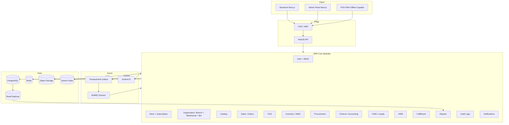

---

## 14. Technology Stack

| Layer | Technology |
| :--- | :--- |
| Backend | NestJS 11 |
| ORM | TypeORM 0.3 |
| Database | PostgreSQL |
| Queue | BullMQ |
| Cache | Redis / cache-manager |
| Realtime | Socket.IO |
| Frontend | Next.js 16 + React 19 |
| Styling | Tailwind CSS 4 |
| Auth | JWT + Passport |
| Validation | class-validator, Zod |
| Files | Existing file module, should evolve to S3-compatible storage |
| Payments | Existing payment module + gateway integrations |
| Courier | Pathao, Steadfast |

---

## 15. Bounded Contexts (Modules)

### 15.1 Store / Subscription
- Onboarding, plans, billing, feature entitlement, suspension.

### 15.2 Organization
- Branch, warehouse, warehouse bin, default warehouse, branch-warehouse links.

### 15.3 Catalog
- Products, variants, categories, brands, media, price books, reviews, taxes.

### 15.4 Sales / Orders
- Online orders, admin-created orders, lifecycle, coupons/promotions, payments, invoices, returns.

### 15.5 POS
- Registers, shifts, sale sync, receipts, multi-payment, cash drawer reconciliation.

### 15.6 Inventory / WMS
- Ledger, reservations, transfers, adjustments, cycle counts, batch/expiry, low-stock alerts.

### 15.7 Procurement
- Suppliers, PR, RFQ, PO, GRN, supplier invoice, debit note, supplier payment, 3-way match.

### 15.8 Finance / Accounting
- CoA, journals, GL, P&L, BS, cash flow, AP, AR, tax, fiscal periods, reversals.

### 15.9 CRM / Loyalty
- Customer 360, segments, loyalty points, wallet, credit limits, AR aging, referrals, consent.

### 15.10 HRM
- Departments, designations, employees, shifts, attendance, leave, payroll, recruitment, performance.

### 15.11 Fulfillment
- Pick/pack/ship, multi-warehouse routing, split shipments, courier integration.

### 15.12 Reports
- Store + branch + warehouse rollups; export center.

### 15.13 Audit & Notifications
- Append-only audit log; in-app, email, SMS, push notifications.

---

## 16. Module Ownership & Service Boundaries

### 16.1 Ownership Matrix

| Data / Action | Owning module | Other modules can |
| :--- | :--- | :--- |
| Product master | Catalog | Read product snapshots. |
| Product stock | Inventory | Request availability / reservation / movement only. |
| Order lifecycle | Sales | Trigger fulfillment / payment / finance events. |
| POS sale | POS | Create sales through Sales + Inventory + Finance services. |
| Supplier master | Procurement | Finance reads AP relations. |
| AP ledger | Finance | Procurement triggers events. |
| AR ledger | Finance / CRM | Sales triggers credit invoice. |
| Journal | Finance | Other modules request posting, not mutate directly. |
| Employee profile | HRM | Auth links staff user. |
| Customer profile | CRM / User | Sales reads snapshot. |
| Audit logs | System / Audit | All modules write append-only events. |

### 16.2 Service Boundary Rules

- Modules own their tables and expose services.
- Cross-module writes go through services, not repositories.
- Shared repositories across modules are a smell unless infrastructure-level.
- Business events should carry enough snapshot data to preserve historical truth.

Snapshot examples:

- Order item stores product name, SKU, price, tax, discount snapshot.
- Supplier invoice stores supplier name and tax snapshot.
- Payroll slip stores salary component snapshot.

---

# Part IV — Domain Workflows & Rules

## 17. Core Workflows

### 17.1 Order-to-Cash

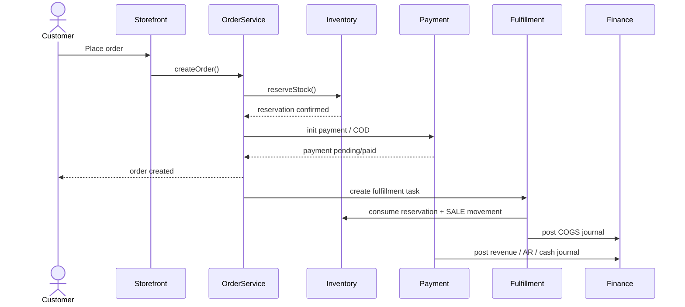

### 17.2 POS Sale

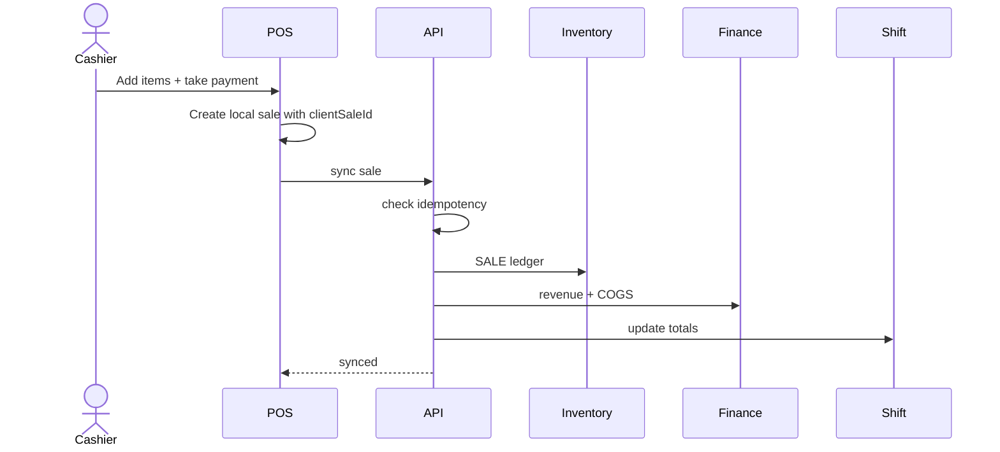

### 17.3 Procure-to-Pay

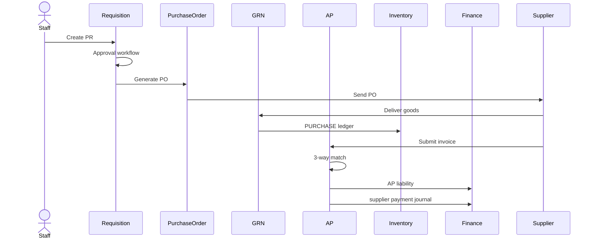

### 17.4 Inventory Transfer

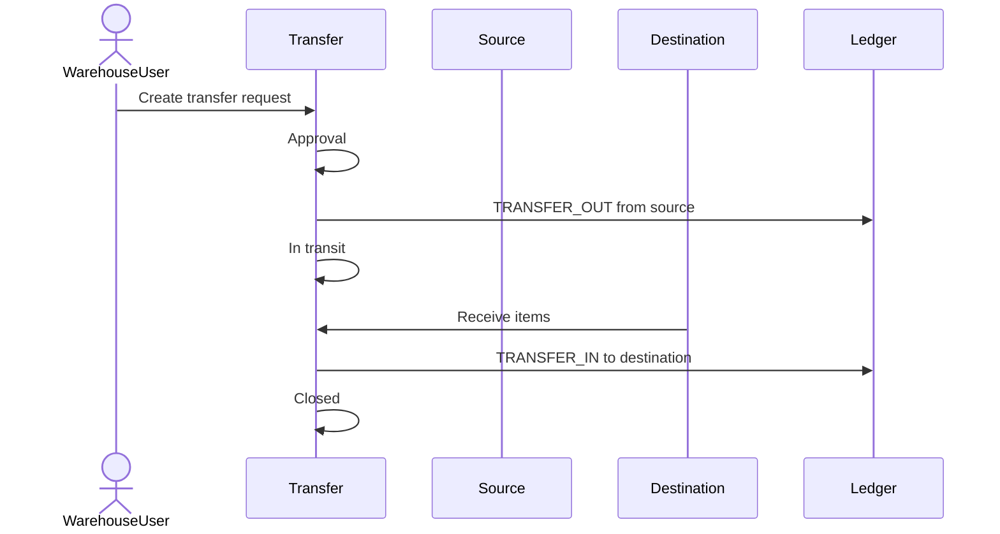

### 17.5 HR-to-Payroll

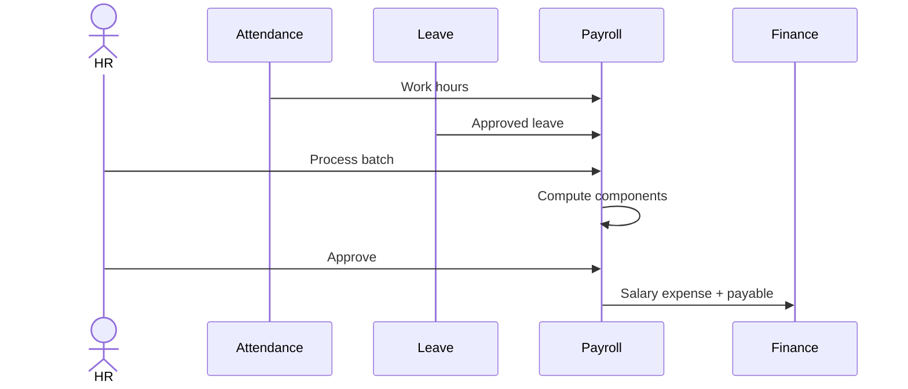

---

## 18. Domain Invariants

These rules must hold even under retries, queue replays, late webhooks, and offline POS reconnects.

### 18.1 Store Invariants

| Invariant | Enforcement |
| :--- | :--- |
| A store cannot read/write another store's data. | `storeId` filter in every query. |
| Cache cannot leak between stores. | Cache key starts with `t:{storeId}:`. |
| Queue jobs cannot run without store context. | Job schema requires `storeId`. |
| Files are store-scoped. | Path `t/{storeId}/...`, signed URL. |
| Reports default to store scope. | Service accepts `ctx` and optional branch/warehouse filters after validation. |

### 18.2 Inventory Invariants

| Invariant | Enforcement |
| :--- | :--- |
| Physical stock changes only via ledger. | No direct stock updates. |
| Reservation ≠ physical movement. | Use `stock_reservations`. |
| Available = on hand − active reservations. | `StockAvailabilityService`. |
| On hand cannot go below zero unless approved. | Lock + permission check. |
| Transfer must have equal out/in after close. | Transfer close validation. |
| Adjustment requires reason and audit. | Approval workflow + `reasonCode`. |

### 18.3 Accounting Invariants

| Invariant | Enforcement |
| :--- | :--- |
| Every journal balances. | `debitTotal == creditTotal`. |
| Posted journals are immutable. | No update/delete; reversal only. |
| Every money movement maps to a journal. | Accounting event map and reconciliation. |
| AP = unpaid supplier invoices − payments. | AP ledger consistency check. |
| AR = unpaid customer invoices − payments. | AR ledger consistency check. |
| Closed fiscal periods block postings. | Period service validates date. |

### 18.4 POS Invariants

| Invariant | Enforcement |
| :--- | :--- |
| A POS sale syncs once. | Unique `(storeId, clientSaleId)`. |
| One open shift per cashier. | Partial unique index on open shift. |
| Closed shift rejects new sales. | Sync checks shift status. |
| Cash variance is auditable. | Shift close stores expected, counted, variance, reason. |
| Offline sale keeps sale-time price. | Order item snapshot. |

### 18.5 Procurement Invariants

| Invariant | Enforcement |
| :--- | :--- |
| PO cannot be received before approval. | Status guard. |
| GRN cannot exceed ordered qty unless tolerance allowed. | Receiving validation. |
| Supplier invoice must match PO/GRN unless override approved. | 3-way matching result. |
| Supplier payment cannot exceed open AP unless advance allowed. | Lock + check. |

### 18.6 HRM / Payroll Invariants

| Invariant | Enforcement |
| :--- | :--- |
| Payroll batch cannot be paid before approval. | Status guard. |
| Approved payroll posts journal exactly once. | Idempotency key `payroll:{batchId}:journal`. |
| Attendance cannot be edited silently. | Correction record with approver. |
| Sensitive employee fields need stricter permission. | Field-level checks. |

---

## 19. Data Model Strategy

### 19.1 Shared Rules

- Every store-owned table includes `storeId`.
- Every business document has a status enum and audit timestamps.
- Every ledger table is append-only.
- Every money table stores currency + exchange-rate snapshot.
- Every high-risk action stores `createdBy`, `approvedBy`, `approvedAt`, `reason`.

### 19.2 New Tables to Add

**Inventory**

- `stock_reservations`
- `stock_transfers`, `stock_transfer_items`
- `inventory_lots`
- `cycle_counts`, `cycle_count_items`
- `inventory_adjustment_approvals`

**Procurement**

- `purchase_requisition_approvals`
- `rfq_suppliers`, `quotation_items`
- `supplier_invoices`, `supplier_invoice_items`
- `three_way_match_results`
- `supplier_payment_allocations`

**Finance**

- `accounting_events`
- `journal_reversals`
- `fiscal_periods`
- `tax_codes`, `tax_jurisdictions`
- `customer_ar_ledger`
- `payment_allocations`

**CRM**

- `customer_segments`, `customer_segment_members`
- `loyalty_programs`, `loyalty_tiers`, `loyalty_ledger`
- `wallet_ledger`
- `ar_ledger`
- `referrals`
- `customer_notes`
- `customer_communication_log`

**POS**

- `pos_cash_movements`
- `pos_sync_attempts`
- `pos_sale_idempotency_keys`
- `pos_return_sessions`

**HRM**

- `payroll_components`
- `payroll_approvals`
- `attendance_policies`
- `holiday_calendars`
- `overtime_rules`

---

# Part V — Reliability

## 20. Transaction Boundaries

### 20.1 Must Commit Atomically

| Workflow | Inside one DB transaction |
| :--- | :--- |
| Online order creation | Order header, items, reservations, coupon usage, outbox event. |
| POS sale sync | Idempotency record, order, items, payment, SALE movement, shift totals, journal, outbox. |
| PO receiving | GRN, GRN items, PURCHASE movement, AP accrual, outbox. |
| Supplier payment | Payment record, AP ledger, journal, outbox. |
| Customer credit sale | Order, AR invoice, AR ledger, journal, outbox. |
| Stock adjustment approval | Approval record, ledger entry, journal if value changes. |
| Payroll approval | Batch status, payslips, payroll journal, outbox. |

### 20.2 Should Run Async

| Async task | Why |
| :--- | :--- |
| Email/SMS/push | Don't block user. |
| Search index update | Eventually consistent. |
| Dashboard aggregates | Seconds/minutes lag is fine. |
| PDF generation | Slow and retryable. |
| Export jobs | Large data volumes. |
| Courier order creation | External dependency. |

---

## 21. Locking Strategy

| Resource | Lock | Why |
| :--- | :--- | :--- |
| Product/variant stock availability | Pessimistic write / advisory | Prevent oversell. |
| Customer AR balance | Pessimistic write | Prevent credit race. |
| Supplier AP balance | Pessimistic write | Prevent overpayment. |
| POS shift totals | Pessimistic write | Prevent total corruption. |
| Journal account balance | Pessimistic write | Maintain running balance. |

Advisory lock key examples:

```text
store:{storeId}:stock:{warehouseId}:{productId}:{variantId}
store:{storeId}:ar:{customerId}
store:{storeId}:ap:{supplierId}
store:{storeId}:shift:{shiftId}
```

Lock acquisition order (to avoid deadlocks):

1. Store / account.
2. Customer / supplier.
3. Product / variant.
4. Warehouse / bin.
5. Journal account.

---

## 22. Event-Driven Architecture

### 22.1 Why Events

Events decouple core workflows from side effects (notifications, search index, dashboards, downstream reports).

### 22.2 Transactional Outbox

```sql
outbox (
  id uuid primary key,
  store_id uuid not null,
  aggregate_type text not null,
  aggregate_id uuid not null,
  event_type text not null,
  payload jsonb not null,
  status text default 'PENDING',
  attempts int default 0,
  next_attempt_at timestamptz default now(),
  created_at timestamptz default now()
);
```

A dispatcher worker reads `PENDING` rows and publishes to BullMQ. Consumers ack only on success.

### 22.3 Important Events

| Event | Consumers |
| :--- | :--- |
| `OrderCreated` | Invoice, notification, reservation expiry job. |
| `OrderPaid` | Finance, fulfillment. |
| `OrderShipped` | Inventory, finance, notification. |
| `ReturnApproved` | Inventory, finance, wallet/loyalty. |
| `PoApproved` | Supplier notification. |
| `GrnVerified` | Inventory, AP. |
| `SupplierInvoicePosted` | Finance / AP. |
| `SupplierPaymentRecorded` | Finance / AP. |
| `StockLow` | Notification, procurement. |
| `PayrollApproved` | Finance, notification. |
| `CustomerCreditExceeded` | CRM, notification. |

---

## 23. Failure Mode Analysis

### 23.1 Payment Webhook Arrives Twice
- Idempotent by gateway transaction ID.
- Repeat call returns success without mutation.
- No duplicate payment row, revenue posting, or receipt email.

### 23.2 POS Device Reconnects After Hours Offline
- POS sends queued sales with `clientSaleId`.
- Backend processes each idempotently.
- Stock conflicts go to `CONFLICT_REVIEW`, never silently dropped.
- Shift close warns about unsynced or conflicted sales.

### 23.3 Queue Job Fails After Business Transaction
- If the side effect is source-of-truth (stock, journal), include it in the transaction.
- Pure side effects (notification, search, PDF) go through queues with retries.
- If async mutation is unavoidable, expose failures in a reconciliation dashboard.

### 23.4 Accounting Posting Fails
- Required journal failure should fail the parent transaction.
- Outbox-style postings store `FAILED` status with retry path.
- Admin reconciliation dashboard surfaces failed events.

### 23.5 Redis Unavailable
- Critical writes continue.
- Rate limiting degrades to local fallback.
- Queue processing pauses; API does not depend on Redis as source of truth.

### 23.6 DB Deadlock
- Standardize lock order (see §21).
- Retry deadlock-safe transactions with jittered backoff up to 2-3 times.

---

## 24. Reconciliation & Repair Tools

### 24.1 Reconciliation Jobs

| Job | Checks |
| :--- | :--- |
| Stock reconciliation | Ledger aggregate vs cached stock summary. |
| Accounting balance reconciliation | Account balance vs ledger entry sum. |
| AP reconciliation | Supplier AP ledger vs unpaid invoices. |
| AR reconciliation | Customer AR ledger vs unpaid invoices. |
| POS shift reconciliation | Shift totals vs synced payments. |
| Reservation reconciliation | Active reservations vs open order lines. |
| Outbox reconciliation | Failed / stuck events. |

### 24.2 Admin Repair Rules

- High-level permission required.
- Audit log entry mandatory.
- No ledger deletion — repairs create correcting entries.
- Show before/after numbers in the repair UI.

---

# Part VI — APIs, Access & Security

## 25. API Contract Standards

### 25.1 Response Shape

Success:

```json
{
  "success": true,
  "statusCode": 200,
  "message": "Human readable message",
  "data": {},
  "meta": { "requestId": "uuid", "storeId": "uuid" }
}
```

Error:

```json
{
  "success": false,
  "statusCode": 400,
  "message": "Validation failed",
  "error": { "code": "STOCK_INSUFFICIENT", "details": {} },
  "meta": { "requestId": "uuid" }
}
```

### 25.2 Stable Error Codes

| Code | Meaning |
| :--- | :--- |
| `STORE_NOT_FOUND` | Invalid store context. |
| `FEATURE_NOT_ENABLED` | Subscription does not allow feature. |
| `PERMISSION_DENIED` | User lacks permission. |
| `SCOPE_DENIED` | User cannot access branch/warehouse. |
| `STOCK_INSUFFICIENT` | Not enough available stock. |
| `CREDIT_LIMIT_EXCEEDED` | Customer exceeds credit limit. |
| `SHIFT_CLOSED` | POS shift no longer open. |
| `DUPLICATE_IDEMPOTENCY_KEY` | Request already processed. |
| `IDEMPOTENCY_PAYLOAD_MISMATCH` | Same key, different body. |
| `JOURNAL_UNBALANCED` | Debit/credit mismatch. |
| `FISCAL_PERIOD_CLOSED` | Posting date is locked. |
| `THREE_WAY_MATCH_FAILED` | PO / GRN / invoice mismatch. |

### 25.3 Pagination

```text
GET /resource?page=1&limit=20&q=...&sort=-createdAt
```

Meta:

```json
{ "page": 1, "limit": 20, "total": 120, "totalPages": 6 }
```

### 25.4 Idempotency Header

```http
Idempotency-Key: uuid-or-client-generated-key
```

Backend stores `(storeId, idempotencyKey, actionType, requestHash, responseBody, status, expiresAt)`. Different payload with same key returns `409 IDEMPOTENCY_PAYLOAD_MISMATCH`.

### 25.5 Naming Convention

```text
/admin/catalog/products
/admin/sales/orders
/admin/sales/returns
/admin/pos/registers
/admin/pos/shifts
/admin/inventory/ledger
/admin/inventory/reservations
/admin/inventory/transfers
/admin/procurement/requisitions
/admin/procurement/purchase-orders
/admin/procurement/grn
/admin/procurement/supplier-invoices
/admin/finance/journals
/admin/finance/reports/profit-loss
/admin/crm/customers
/admin/crm/segments
/admin/hrm/employees
/admin/hrm/payroll
```

Keep existing routes as aliases; new routes follow the standard above.

---

## 26. RBAC, Feature Gating & Scope

### 26.1 Layered Access Model

| Layer | Question | Example |
| :--- | :--- | :--- |
| Subscription feature gate | Is the store allowed this feature? | `/admin/inventory/transfers` |
| RBAC permission | Is the user allowed this action? | `inventory.transfer.approve` |
| Branch scope | Can the user operate on this branch? | Branch manager A vs B. |
| Warehouse scope | Can the user operate on this warehouse? | Clerk A vs W1. |
| Audit log | Who did what, when, and why? | Always written. |

All four must pass for any high-risk write.

### 26.2 Example Permissions

```text
inventory.read
inventory.adjust.create
inventory.adjust.approve
inventory.transfer.create
inventory.transfer.approve
procurement.po.create
procurement.po.approve
finance.journal.post
finance.journal.reverse
pos.shift.close
crm.credit_limit.approve
hrm.payroll.process
hrm.payroll.approve
```

### 26.3 High-Risk Actions

Require an additional explicit reason captured in the audit log:

- Stock adjustment approval.
- Stock transfer approval.
- Supplier payment.
- Journal reversal.
- Credit-limit override.
- Payroll approval.
- POS cash variance approval.

---

## 27. Security

### 27.1 Baseline

- HTTPS only.
- JWT with rotating refresh tokens.
- Rate limiting via `@nestjs/throttler` + Redis.
- Input validation (DTO + Zod).
- File upload scanning.
- Signed URLs for private files.
- Strict CORS.

### 27.2 Store Security

- Always filter by `storeId`.
- Never trust `storeId` from request body.
- Store comes from authenticated token or domain.
- Cache keys and queue payloads must include `storeId`.

### 27.3 Finance Security

- Posting permission separated from finance read.
- Reversal permission separated from posting.
- Period close permission restricted.
- Supplier payment requires approval.
- Payroll approval requires its own permission.

---

# Part VII — Infrastructure

## 28. Database Constraints & Indexes

### 28.1 Must-Have Constraints

```sql
-- POS idempotency
CREATE UNIQUE INDEX uq_pos_sale_client_id
ON pos_sales (store_id, client_sale_id);

-- One open shift per cashier
CREATE UNIQUE INDEX uq_open_shift_per_user
ON pos_shifts (store_id, user_id)
WHERE status = 'OPEN';

-- Unique SKU per store
CREATE UNIQUE INDEX uq_product_sku_store
ON products (store_id, sku)
WHERE sku IS NOT NULL;

-- Unique supplier invoice number per supplier
CREATE UNIQUE INDEX uq_supplier_invoice_number
ON supplier_invoices (store_id, supplier_id, invoice_number);

-- One journal per source event
CREATE UNIQUE INDEX uq_journal_source
ON journal_entries (store_id, reference_type, reference_id, type);
```

### 28.2 Recommended Indexes

| Table | Index |
| :--- | :--- |
| `orders` | `(store_id, status, created_at)` |
| `orders` | `(store_id, user_id, created_at)` |
| `inventory_ledger` | `(store_id, product_id, variant_id, warehouse_id, created_at)` |
| `stock_reservations` | `(store_id, status, expires_at)` |
| `purchase_orders` | `(store_id, supplier_id, status, created_at)` |
| `supplier_invoices` | `(store_id, supplier_id, status, due_date)` |
| `journal_entries` | `(store_id, date, type)` |
| `ledger_entries` | `(store_id, account_id, created_at)` |
| `ar_ledger` | `(store_id, customer_id, created_at)` |
| `ap_ledger` | `(store_id, supplier_id, created_at)` |
| `audit_logs` | `(store_id, entity, entity_id, created_at)` |

### 28.3 Partitioning Candidates

- `audit_logs` by month.
- `inventory_ledger` by store or month.
- `ledger_entries` by fiscal year.
- `notifications` by month.
- `outbox` periodically archived.

---

## 29. Caching Strategy

### 29.1 Key Convention

```text
t:{storeId}:{domain}:{resource}:{paramsHash}
```

Examples:

```text
t:abc:inventory:summary
t:abc:orders:list:p1:l20:status-pending
t:abc:finance:pnl:2026-01:2026-05
```

### 29.2 Invalidation Rules

| Event | Invalidate |
| :--- | :--- |
| Product updated | Catalog/product caches, search index. |
| Ledger movement | Inventory summary, stock value reports. |
| Order created/updated | Order list, sales dashboard. |
| Journal posted | Finance reports. |
| Supplier payment | AP reports. |
| Customer payment | AR reports. |
| Payroll approved | Finance + HR reports. |

---

## 30. Offline POS Design

### 30.1 Client Storage (IndexedDB)

- Product cache, price/tax cache.
- Customer minimal profile.
- Open shift state.
- Unsynced sale queue.
- Receipt templates.

### 30.2 Sync Flow

1. POS creates a local sale with `clientSaleId`.
2. Sale is stored locally as `LOCAL_ONLY`.
3. Background sync calls `/pos/sync`.
4. Backend checks `clientSaleId`.
5. If new, it creates the order, SALE movement, journals, shift totals.
6. Response marks sale `SYNCED`.
7. If duplicate, backend returns the existing server sale.

### 30.3 Conflict Handling

| Conflict | Handling |
| :--- | :--- |
| Product price changed | Use sale-time snapshot. |
| Product deleted | Accept sale if snapshot was valid. |
| Stock insufficient | Mark conflict; manager approval needed. |
| Shift closed | Reject sync; reopen/override required. |
| Duplicate sale | Return existing sale. |

---

## 31. Observability

### 31.1 Logs

Every log includes `storeId`, `userId`, `requestId`, `module`, `action`, `entityId`.

### 31.2 Metrics

- API latency.
- DB query time.
- Queue lag.
- Outbox backlog.
- Payment failure rate.
- POS sync failure rate.
- Journal posting failure count.
- Negative stock attempts.

### 31.3 Alerts

- Payment webhook failures.
- Accounting posting failure.
- Negative stock attempt.
- Outbox backlog above threshold.
- Redis unavailable.
- DB connection saturation.
- POS sync error spike.

---

## 32. Deployment

### 32.1 Topology

- 2+ NestJS API instances.
- 1+ Next.js storefront/admin instances.
- 1+ BullMQ worker instance.
- 1 outbox dispatcher.
- PostgreSQL primary + read replica.
- Redis managed.
- Object storage (S3-compatible).
- CDN/WAF.

### 32.2 Environments

`dev`, `staging`, `production` — each with isolated DB, Redis, file storage, payment keys, courier keys, and domain config.

---

# Part VIII — Delivery & Operations

## 33. Testing Strategy

### 33.1 Unit Tests
- Pricing, tax, discount/coupon, ledger sign rules, journal validation, permission guard behavior.

### 33.2 Integration Tests
- Order → reserve stock.
- Ship → consume reservation + SALE ledger + COGS journal.
- POS sale sync idempotency.
- PO receive → GRN + PURCHASE + AP.
- Supplier payment → AP reduction + journal.
- Return approval → restock/refund/reversal.
- Payroll approval → salary payable journal.
- **Boundary tests:** cross-store read denied, cross-branch read denied, cross-warehouse adjust denied.

### 33.3 E2E Tests
- Storefront checkout.
- Admin order lifecycle.
- POS shift open/sale/close.
- Procurement PO receive.
- Inventory adjustment approval.
- Payroll process approval.

### 33.4 Consistency Tests
- Stock summary = ledger aggregate.
- Account balance = ledger entries.
- AP balance = supplier invoices − payments.
- AR balance = customer invoices − payments.
- POS shift totals = synced sales + cash movements.

---

## 34. Migration Strategy from Current Codebase

### 34.1 Current Reality

Already present in the codebase:

- Inventory ledger.
- Procurement PO/GRN/supplier/AP slices.
- Finance CoA/journals/reports.
- POS register/shift/sync.
- Fulfillment pick/pack/ship.
- HRM breadth.
- RBAC and feature gates.

Partial systems that need work:

- Reservation lives as inventory transaction, not a first-class model.
- Accounting posting coverage is narrow.
- PR / RFQ / supplier invoice workflows are incomplete.
- HRM includes demo / schema-repair code.
- POS offline is not truly durable yet.

### 34.2 Safe Migration Order

1. Add idempotency infrastructure (no behavior change).
2. Add outbox table and route side effects through it.
3. Introduce `stock_reservations` alongside existing reservation ledger type.
4. Migrate order creation to write into `stock_reservations`.
5. Change fulfillment shipping to consume reservation + post SALE.
6. Add accounting events and reconciliation dashboard before expanding journal coverage.
7. Move demo/repair HRM code into scripts or dev-only endpoints.
8. Add new procurement workflows incrementally: PR → RFQ → supplier invoice.

### 34.3 Compatibility Rules

- Do not break existing routes immediately.
- Add new canonical routes and keep old aliases temporarily.
- Backfill new tables from existing records.
- Run dual-read mode first, then dual-write, then cutover.
- Add a reconciliation dashboard before disabling old behavior.

---

## 35. Production Readiness Checklist

### 35.1 Before First Real Store
- [ ] All store-owned tables have `storeId`.
- [ ] Every admin route has feature gate + permission guard.
- [ ] POS sync idempotency exists.
- [ ] Payment webhook idempotency exists.
- [ ] Inventory reservation model exists.
- [ ] Accounting event failure is visible in admin.
- [ ] Basic backup/restore tested.
- [ ] Audit logs enabled for high-risk actions.
- [ ] Seed/demo endpoints removed from production path.
- [ ] Error codes standardized.

### 35.2 Before Multi-Branch Store
- [ ] Branch scope guard tested.
- [ ] Warehouse scope guard tested.
- [ ] Warehouse stock availability tested.
- [ ] Stock transfers implemented.
- [ ] POS register tied to branch.
- [ ] Cashier shift scope enforced.
- [ ] Reports filter by branch.
- [ ] Staff role assignments support branch/warehouse scope.

### 35.3 Before Finance-Heavy Store
- [ ] Fiscal periods.
- [ ] Journal reversal.
- [ ] AP aging.
- [ ] AR aging.
- [ ] Tax/VAT support.
- [ ] Supplier payment journal.
- [ ] Customer payment journal.
- [ ] Account reconciliation report.

### 35.4 Before Retail Chain Store
- [ ] Offline POS IndexedDB queue.
- [ ] Stock transfer workflow.
- [ ] Cycle counts.
- [ ] Batch/expiry if needed.
- [ ] Shift cash movements.
- [ ] POS return/exchange.
- [ ] Low-stock auto PR draft.

---

## 36. Phased Implementation Roadmap

### Phase 1 — ERP Core Stabilization
- Idempotency framework.
- Outbox dispatcher.
- First-class reservations.
- POS sync uniqueness.
- Core integration tests.

### Phase 2 — Inventory / WMS Maturity
- Stock transfers (in-transit).
- Stock adjustments approval.
- Cycle counts.
- Batch/expiry.
- Warehouse / bin reporting.

### Phase 3 — Procurement Depth
- Persistent PR workflow.
- RFQ / quotations.
- Supplier invoices.
- 3-way matching.
- Supplier payments + AP aging.

### Phase 4 — Finance System of Record
- Accounting event table.
- Journal reversals.
- Fiscal periods.
- Tax/VAT.
- AR ledger.
- Cash flow.

### Phase 5 — CRM / Loyalty
- Customer 360.
- Segments.
- Loyalty points.
- Wallet / store credit.
- Credit limits.
- AR aging.
- Referrals.

### Phase 6 — HRM Production Hardening
- Attendance policies.
- Payroll components.
- Overtime rules.
- Payroll approval.
- Payslip generation.
- Remove demo/schema-repair paths.

### Phase 7 — Future AI/API Extension (separate doc)
- Product content assistant.
- Semantic search.
- Invoice OCR.
- Admin assistant.
- Demand forecasting.
- AR collection drafts.

AI uses ERP APIs/services, never bypasses them. AI produces drafts/recommendations only.

---

# Part IX — Wrap

## 37. Acceptance Criteria

The ERP system is production-ready when:

- Store isolation is enforced in every repository/query.
- Branch and warehouse scope is enforced in every restricted query.
- POS sync is idempotent.
- Stock reservation and physical stock movement are separated.
- Inventory ledger never goes negative without explicit approved override.
- Every financial event posts a balanced journal.
- Posted journals are immutable.
- Procurement supports PR → PO → GRN → Supplier Invoice → Payment.
- AR/AP aging reports match their ledgers.
- Payroll is approval-based and posts accounting entries.
- High-risk operations require permission + audit reason.
- Core workflows have integration tests.
- Reports are based on ledgers/materialized views, not UI state.
- Feature gates align with subscription plan.

---

## 38. Final Senior Engineering View

Build the deterministic ERP first.

Do not start with AI, dashboards, or automation until these are solid:

- stock truth,
- money truth,
- store / branch / warehouse boundaries,
- idempotency,
- audit,
- permission boundaries,
- workflow approvals.

Once the ERP core is correct, AI/API extensions can sit safely on top of it. If the core is weak, AI will only make wrong decisions faster. If the core is strong, AI becomes a productivity multiplier.

---

*This document intentionally excludes detailed AI implementation. See the separate AI design only when the ERP core is ready for extension.*
