# POS Payment System: Collect Payment Flow (A to Z Guide)

This document provides a comprehensive, step-by-step technical walkthrough of the payment and checkout lifecycle inside the POS (Point of Sale) terminal, covering both frontend interactions and backend database processes.

---

## 1. End-to-End Flow Diagram

```mermaid
graph TD
    A[POS Cashier clicks Checkout] --> B{Payment Options Selection}
    
    B -->|Single Method| C1[Cash, Card, Mobile, or Account]
    B -->|Split Payment| C2[Distribute total across Cash/Card/Mobile/Account]
    
    B --> D[Toggle Store Credit/Wallet]
    B --> E[Select Delivery Zone / Shipping Address]
    
    C1 & C2 & D & E --> F[Click Process Complete Sale]
    
    F --> G{Network Online Status?}
    
    G -->|Offline| H1[Store in localStorage Queue & show Receipt Modal]
    G -->|Online| H2[POST to /pos/sync endpoint]
    
    H2 --> I{Idempotency Check}
    I -->|Already Processed| J[Return Success immediately]
    I -->|New Transaction| K[Begin Database Transaction]
    
    K --> L[Save Order & OrderItem Entities]
    K --> M[FEFO batch or default Inventory Deduction]
    K --> N[Deduct Customer Wallet if used]
    K --> O[Validate B2B Credit Limit & Post Accounts Receivable]
    K --> P[Update Cashier Shift Sales Aggregates]
    K --> Q[Post General Ledger Journal Entry]
    K --> R[Commit Transaction & return status]
    
    R --> S[Show Receipt and Open Cash Drawer]
```



---

## 2. Step-by-Step Checkout Lifecycle

### Phase 1: Client-Side Input & Validations
When the cashier clicks the "Checkout" button, the **Collect Payment** modal opens.

1. **Payment Methods Selection**:
   The user interface displays four payment options: **Cash**, **Card**, **Mobile**, and **Account** (representing credit/on-account debt).
   
   Internally, these correspond to the following mapping:
   - **Cash** (UI) $\rightarrow$ Sent as `CASH` $\rightarrow$ Saved in DB as `cash`
   - **Card** (UI) $\rightarrow$ Sent as `CARD` $\rightarrow$ Saved in DB as `card`
   - **Mobile** (UI) $\rightarrow$ Sent as `MOBILE` $\rightarrow$ Saved in DB as `mobile`
   - **Account** (UI) $\rightarrow$ Sent as `ON_ACCOUNT` $\rightarrow$ Saved in DB as `on_account`

   - **Single Payment**: Cashier selects a single method from the four.
   - **Split Payment**: Cashier enters custom amount splits for Cash, Card, Mobile, and Account.
   - **Validation**: If Split Payment is checked, the sum of all inputs must equal the remaining payable amount. If "Account" (`ON_ACCOUNT`) is used, a customer profile must be selected.
2. **Store Credit / Wallet**:
   - If a customer is selected and has store credit, they can toggle "Pay with Store Credit/Wallet" and define the deduction amount.
3. **Delivery / Shipping**:
   - If it's a delivery order, a delivery zone is chosen (adding shipping fees to the total) and a shipping address is entered.
4. **Tendered Cash Calculation**:
   - If cash is chosen, the cashier enters the amount tendered (or selects quick-cash denominations: $5, $10, $20, $50, $100).
   - The UI automatically calculates the **Change Due** (`Tendered Amount - Grand Total`).

---

### Phase 2: Client-Side Offline Queueing (Fallbacks)
The POS is designed for high-availability offline retail.

1. If the browser detects it is offline (`isOnline === false`) or if the HTTP fetch request fails due to a network connection timeout, the system enters the **Offline Flow**.
2. An `offlineSaleId` is generated using a UUID.
3. The sale payload is pushed to `offlineQueue` (persisted in `localStorage`).
4. A mock receipt is generated immediately (marked with `OFF-` prefix), allowing the cashier to complete the sale and serve the customer. The queue is automatically synced back to the server once the network is restored.

---

### Phase 3: Server-Side Processing (`/pos/sync`)
When the online POST request hits the backend, the entire validation and database write cycle occurs inside a single database transaction:

```typescript
await this.dataSource.transaction(async (manager) => { ... })
```

#### Step 1: Shift Validation & Idempotency Check
1. The system checks the cashier's active shift session. If the shift is closed or audited, it rejects the sync.
2. An idempotency check is executed: if an order with the same `offlineSaleId` already exists, the server returns success immediately without duplicate processing.

#### Step 2: Order and Item Initialization
1. Customer contact info is resolved from the database (falling back to a default "Walk-in Customer" if guest).
2. The Order record is created with `OrderStatus.COMPLETED` and `PaymentStatus` (set to `PENDING` if `ON_ACCOUNT` / `on_account`, or `PAID` for other methods).
3. The uppercase payload value (`dto.paymentMethod`) is converted to lowercase (`dto.paymentMethod.toLowerCase()`) before database entry.

#### Step 3: Inventory Stock Deduction (FEFO Batch Allocation)
1. For each cart item, the service attempts to allocate inventory batches using **First-Expired, First-Out (FEFO)**:
   - Matches products by expiration dates to ensure fresh stock allocation.
   - Updates stock levels in batch cards.
2. If no batches are configured, it falls back to a default inventory ledger deduction.
3. An inventory transaction log (`SALE`) is posted to the ledger linked to the cashier's register and warehouse.

#### Step 4: Wallet Deductions & Credit Limits
1. **Store Credit Deduction**: If wallet payment is applied, the customer's wallet balance is checked, a debit transaction is logged, and the order's payable total is adjusted.
2. **B2B Credit Limits**: If an "On Account" (`ON_ACCOUNT` / `on_account`) amount is present:
   - The system checks if the customer is on credit hold.
   - Calculates their outstanding debt.
   - Rejects the checkout if the sale exceeds their remaining credit limit.
   - Logs an invoice transaction in the Accounts Receivable (AR) ledger with Net 30 payment terms.

#### Step 5: Cashier Shift Aggregates
- The shift's collected totals (`cashSales`, `cardSales`, `mobileSales`) are updated.
- The expected drawer closing cash balance is updated: `openingBalance + cashSales + cashIn - cashOut`.

#### Step 6: Double-Entry Accounting Journaling
The general ledger is automatically journaled using double-entry accounting lines:

| Account Code | Account Name | Entry Side | Amount Details |
| :--- | :--- | :--- | :--- |
| **1000** | Cash/Asset | **Debit** | Cash, Card, and Mobile payments collected |
| **1200** | Accounts Receivable | **Debit** | On-account credit amount (`ON_ACCOUNT` / `on_account`) |
| **2300** | Wallet / Store Credits | **Debit** | Wallet store credits applied |
| **4000** | Sales Revenue | **Credit** | Net revenue (sales total minus tax) |
| **2200** | VAT / Sales Tax Payable | **Credit** | Sales tax collected |

---

### Phase 4: Finalizing & Printing Receipt
1. The transaction is committed to the database.
2. The server responds with `success: true`.
3. The frontend displays the **Receipt Modal** with options to print thermal invoices, download PDF invoices, or send email receipts.
4. A physical signal (or browser print triggers) can be configured to open the POS cash drawer.
