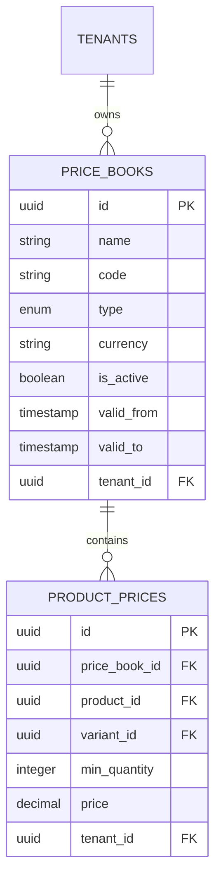

# Price Books & Volume Tier Pricing — System Design

The **Price Books Management** module provides a multi-tenant, localized, and schedule-aware pricing engine. Instead of a single static price for every product, merchants can define custom pricing books scoped by currency, date range, volume brackets (tier pricing), and customer segment.

---

## 1. Architectural Conceptual Overview

A **Price Book** is a scoped pricing catalog containing set pricing rules or override tiers for products and variants. It empowers merchants with four essential capabilities:
- **Localization**: Creating separate price catalogs for different currencies (e.g. `BDT`, `USD`) integrated with global store settings.
- **Bulk / B2B Pricing**: Rewarding bulk shoppers with volume-based brackets (e.g., Buy 10+ at 15% discount).
- **Time-Limited Campaigns**: Scheduling promotional sales that automatically activate and deactivate based on timezone-aware dates.
- **VIP Contract Pricing**: Allocating exclusive pricing schemas to specific accounts or segments.

---

## 2. Database Schema Design

The system divides pricing data into two primary tables, secured via a tenant isolation layer (`tenant_id`).

### A. The `price_books` Table (`PriceBookEntity`)
Holds the metadata, activation status, scheduling bounds, currency, and type for each book.

| Column | Data Type | Database Rules | Description |
| :--- | :--- | :--- | :--- |
| `id` | `UUID` | Primary Key, Default UUID | Unique identifier of the price book. |
| `name` | `VARCHAR` | Not Null | Human-readable title (e.g. "Summer Campaign 2026"). |
| `code` | `VARCHAR` | Not Null | Machine code (e.g. `SUMMER-2026`). Immutable after creation. |
| `type` | `ENUM` | Default `'RETAIL'` | Defines target audience and fallback precedence. |
| `currency` | `VARCHAR(10)`| Default `'BDT'` | Currency code associated with prices inside this book. |
| `is_active`| `BOOLEAN` | Default `true` | Main toggle to activate or deactivate the price book. |
| `valid_from`| `TIMESTAMPTZ`| Nullable | Date-range scheduling: book has no effect before this date. |
| `valid_to` | `TIMESTAMPTZ`| Nullable | Date-range scheduling: book has no effect after this date. |
| `tenant_id`| `UUID` | Not Null, Indexed | Enforces multi-tenant data boundaries. |

> [!IMPORTANT]
> **Composite Uniqueness Boundary**: The database enforces a composite unique constraint `@Unique('UQ_price_books_code_tenant', ['code', 'tenantId'])`. This permits multiple tenants to configure standard book codes (e.g., `RETAIL` or `WHOLESALE`) within their isolated workspaces without database conflicts.

---

### B. The `product_prices` Table (`ProductPriceEntity`)
Contains the quantity-based unit price overrides mapped to specific products or variants.

| Column | Data Type | Database Rules | Description |
| :--- | :--- | :--- | :--- |
| `id` | `UUID` | Primary Key, Default UUID | Unique identifier of the price tier. |
| `price_book_id`| `UUID` | Foreign Key (Cascade) | Mapped price book this tier belongs to. |
| `product_id` | `UUID` | Foreign Key (Cascade) | Target product. |
| `variant_id` | `UUID` | Nullable, Foreign Key | If specified, overrides a specific product SKU/variant. If `null`, applies to base product. |
| `min_quantity`| `INTEGER` | Default `1` | Minimum purchase count required to trigger this tier. |
| `price` | `DECIMAL(12,2)`| Not Null | Override unit price for this quantity tier. |
| `tenant_id` | `UUID` | Not Null | Tenant scoping indicator. |



---

## 3. Price Book Types & Specific Business Logic

The system distinguishes price books into four distinct types, each governed by specialized backend validation and resolution priority workflows.

```
       [Order Placed]
             |
      (priceBookCode?)
       /           \
     YES           NO
     /               \
[Match Code]     [Priority 1: Active PROMOTIONAL Book]
(Any Type)       (validFrom <= now <= validTo)
                          | (if none)
                 [Priority 2: Active RETAIL Book]
                 (Default Storefront fallback)
                          | (if none)
                 [Fallback: Core Product Price]
```

### 1. `RETAIL` (Base Storefront pricing)
- **Role**: Standard public storefront catalog.
- **Precedence**: Default fallback when no other rules match.
- **Validations**: A tenant is restricted to **exactly one active `RETAIL` price book per currency** at a time to prevent conflicting baseline prices.

### 2. `PROMOTIONAL` (Active campaign schedules)
- **Role**: Time-bounded sale events (e.g. "Black Friday 2026").
- **Precedence**: **High Priority**. Active promotional books automatically override retail pricing during their active scheduled range.
- **Validations**: Requires both `validFrom` and `validTo` fields, with a constraint enforcing `validTo > validFrom`.

### 3. `WHOLESALE` (B2B Volume Catalogs)
- **Role**: Bulk purchasing schemas for wholesale segments.
- **Precedence**: **Strictly Excluded** from auto-resolution lists. Wholesale pricing will never leak to public guest shoppers.
- **Application**: Applied only when explicitly targeted by passing `priceBookCode: 'WHOLESALE'` at checkout or during order creation.

### 4. `CUSTOMER_SPECIFIC` (Contract / VIP pricing)
- **Role**: Specialized account contract pricing.
- **Precedence**: **Strictly Excluded** from auto-resolution lists.
- **Application**: Targeted manually by assigning the specific custom book code to orders or VIP segments.

---

## 4. Price Resolution Algorithm

When a cart item is priced during checkout, the pricing engine runs the following hierarchy in [`pricing.service.ts`](file:///home/gowtamkumar/projects/eCommerce-multi-tenant-saas/server/src/modules/admin/catalog/pricing/pricing.service.ts):

### Step 1: Resolve the Price Book
1. **Explicit Targeting**: If a non-null `priceBookCode` is passed, the engine queries the active database books for matching `code` and date schedules.
2. **Auto-Resolution Flow** (If no code is targeted or if the requested code is invalid):
   - **First priority**: Finds the newest active `PROMOTIONAL` book where `validFrom <= now <= validTo`.
   - **Second priority**: Falls back to the oldest active `RETAIL` price book.
   - **Protection Rule**: `WHOLESALE` and `CUSTOMER_SPECIFIC` price books are filtered out of fallback chains.

### Step 2: Resolve the Tier unit price
Inside the chosen price book:
1. **Variant Specific**: Queries prices matching `productId` and `variantId` ordered by `minQuantity DESC`. Resolves the first match where ordered `quantity >= minQuantity`.
2. **Base Product Fallback**: If no variant price matches, queries base prices matching `productId` and `variantId IS NULL` (minQuantity descending). Resolves the first match where ordered `quantity >= minQuantity`.
3. **Core Price Fallback**: If no tiers match, falls back to the product/variant's own static `.price` property.

---

## 5. REST API Specifications

All endpoints are protected under the `JwtAuthGuard` + `SubscriptionGuard` and require specific permission tokens.

### A. Price Book Management

* **Create a Price Book**
  - **Method**: `POST`
  - **URL**: `/pricing/price-books`
  - **Permission**: `CATALOG_WRITE`
  - **Payload**:
    ```json
    {
      "name": "Mid-Year Sale",
      "code": "MIDYEAR-2026",
      "type": "PROMOTIONAL",
      "currency": "USD",
      "validFrom": "2026-06-01T00:00:00.000Z",
      "validTo": "2026-06-30T23:59:59.000Z",
      "isActive": true
    }
    ```

* **List Price Books**
  - **Method**: `GET`
  - **URL**: `/pricing/price-books`
  - **Permission**: `CATALOG_READ`

* **Update a Price Book**
  - **Method**: `PATCH`
  - **URL**: `/pricing/price-books/:id`
  - **Permission**: `CATALOG_WRITE`

* **Delete a Price Book (Cascades Price Tiers)**
  - **Method**: `DELETE`
  - **URL**: `/pricing/price-books/:id`
  - **Permission**: `CATALOG_WRITE`

---

### B. Tier Pricing Configurations

* **Add a Custom Price Tier**
  - **Method**: `POST`
  - **URL**: `/pricing/product-prices`
  - **Permission**: `CATALOG_WRITE`
  - **Payload**:
    ```json
    {
      "priceBookId": "65b9e07f-cf12-4217-a068-07b1d9bf5b10",
      "productId": "4ab2c510-bfae-4dbe-a178-e565985160cb",
      "variantId": null,
      "minQuantity": 10,
      "price": 450.00
    }
    ```

* **Get Tiers for a Product**
  - **Method**: `GET`
  - **URL**: `/pricing/product-prices/:productId`
  - **Permission**: `CATALOG_READ`

* **Remove a Price Tier**
  - **Method**: `DELETE`
  - **URL**: `/pricing/product-prices/:id`
  - **Permission**: `CATALOG_WRITE`

---

## 6. Frontend UI Components

### 1. The Price Books Screen (`PriceBook.tsx`)
Located at **Admin Portal → Catalog → Price Books**, it renders an interactive dashboard:
- **Search & Card Grid**: Renders cards highlighting details (Name, immutable Code, Type Badge, Currency Badge, Validity dates, and Active status).
- **Dynamic Help Notices**: Selecting a type in the form modal displays a banner explaining its specific resolution rule and auto-toggles form configurations.
- **Form Guardrails**: Selecting `PROMOTIONAL` marks the calendar inputs as strictly `required` and fires client-side check comparisons.
- **Dynamic Currency Dropdown**: Fetches the merchant's supported currencies dynamically from settings context, defaulting to the store's primary currency code.

### 2. Product Volume Pricing Form (`ProductPriceTiers.tsx`)
Rendered under **Product Form → Volume Pricing Tiers**:
- Loads all active price books to populate selector menus.
- **True Currency Labeling**: Renders localized currency indicators next to inputs (e.g. `Tier Price (BDT)`) based on the chosen book's currency settings.
- **Interactive Margin Indicators**: Calculates real-time margins against weighted product costs, displaying visual indicators:
  - 🔴 **Red** (Under 20% margin)
  - 🟡 **Yellow** (20% – 40% margin)
  - 🟢 **Green** (Over 40% margin)
