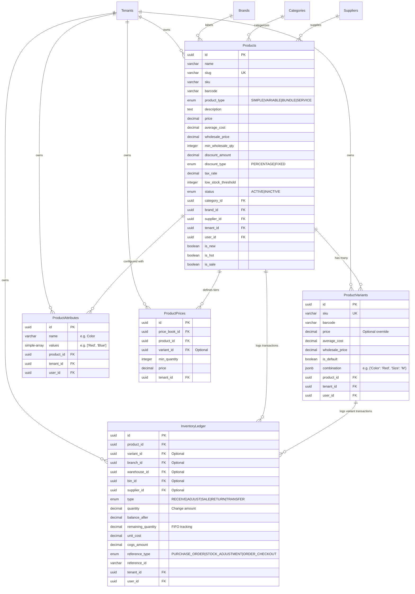
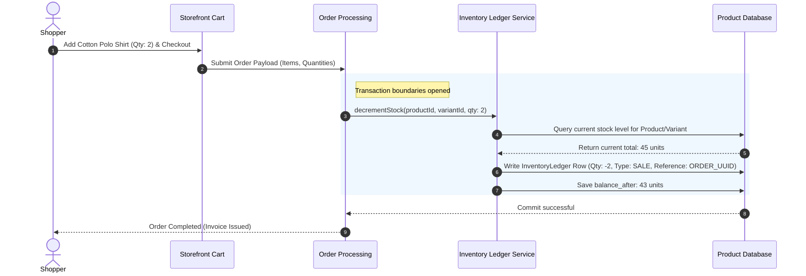
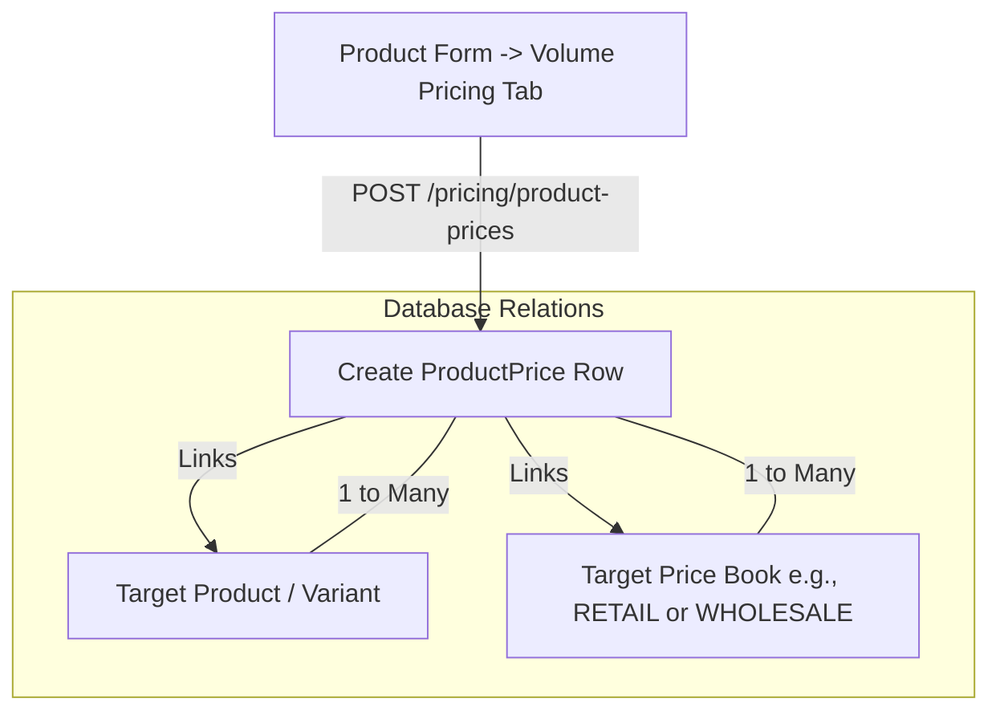
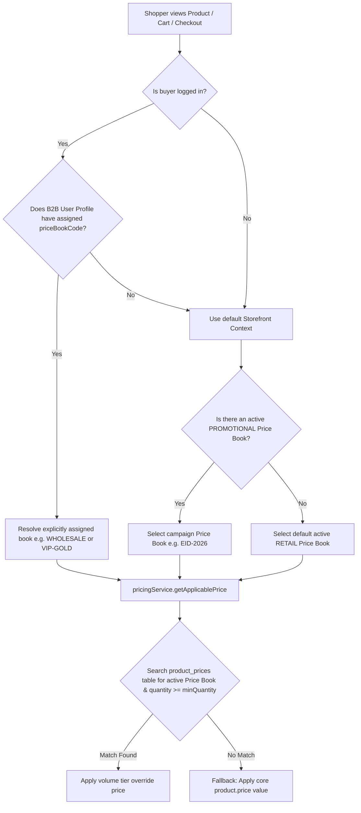

# Multi-Tenant Product & Inventory System Guide

This document provides a comprehensive analysis of the **Product Catalog & Inventory Module** in the eCommerce SaaS platform. It serves as a master guide for both **operators (users)** and **engineers (developers)** to understand how products are structured, how inventory is tracked with double-entry precision, and how database relations/workflows function.

---

## 1. Summary Matrix: Product Types & Stock Models

The catalog system supports four distinct types of products. The type dictates how pricing is resolved and how inventory is tracked in the ledger.

| Product Type | Target Use Case | Has Variants? | Stock-Tracked? | Inventory Ledger Rules |
| :--- | :--- | :--- | :--- | :--- |
| **`SIMPLE`** | Standalone products without variations (e.g. "Standard Coffee Mug"). | **No** | **Yes** (At product level) | Initial stock starts at `0`. Increases via `RECEIVE` (procurement) or `ADJUST`; decreases via `SALE`. |
| **`VARIABLE`** | Products with options like size, color, or material (e.g. "Cotton Polo Shirt"). | **Yes** (Linked variants) | **Yes** (At variant level) | Product-level stock is the dynamically computed sum of all active variant stocks. |
| **`BUNDLE`** | Multipacks, curated gift boxes, or promotional kits. | **No** | **Indirectly** (Kit items) | Resolves stock dynamically based on the minimum stock level among its composite items. |
| **`SERVICE`** | Virtual products, software licenses, memberships, or booking tickets. | **No** | **No** | Excluded from physical warehousing and inventory transaction ledger rules. |

---

## 2. Entity Relationship Diagram (ERD)

This entity diagram demonstrates the database architecture of the Product module. Notice that every core entity is strictly scoped to a **`TenantEntity`** (multi-tenant isolation) and is linked to the **`UserEntity`** who performed the creation or modification.



---

## 3. Core Business Workflows

### A. Strict ERP-Grade Stock Creation (Stock Starts at 0)
Unlike simple ecommerce systems where merchants type starting inventory levels into a text box, this platform enforces a **strict double-entry style ledger constraint**:
1. When a new product is created (either Simple or Variable), the backend **forces starting stock to exactly `0`**.
2. **Rule**: Physical stock can **only** enter the system through a traceable transaction:
   - **Procurement Flow**: Create a Purchase Order (PO), match it to a Goods Received Note (GRN), and log a `RECEIVE` inventory transaction.
   - **Adjustment Flow**: Perform a cycle count or store audit and log an authenticated `ADJUST` transaction.
3. This guarantees that every unit of stock has a complete paper trail (Supplier, Branch, Warehouse, cost history, and timestamp) for audit compliance.

---

### B. Variation & Combination Resolution
For `VARIABLE` products, merchants specify **Attributes** (e.g. Name: `"Color"`, Values: `["Red", "Blue"]`).
1. **Dynamic SKU Generation**: The platform generates deterministic, collision-safe SKUs using the product slug, combination values, and a short unique hash:
   `[PRODUCT-SLUG]-[COMBINATION-VALUES]-[SUFFIX]`
2. **Combination Storage**: Variants store their attribute mapping as a `jsonb` field in the database:
   ```json
   {
     "Color": "Red",
     "Size": "XL"
   }
   ```
3. **Database Performance**: This allows the frontend to query product pages quickly, while the database indexes and retrieves variants efficiently using PostgreSQL `jsonb` path expressions.

---

## 4. The Inventory Ledger & Stock Movement Flow

The **`InventoryLedger`** table operates as the system's financial "double-entry" ledger for items. Every increase or decrease is logged as a separate immutable row. 

### A. Stock Movement Sequence Diagram

This sequence shows how a storefront checkout decreases stock and generates ledger transactions securely:



### B. How stock is dynamically aggregated:
The system **never** reads a mutable `stock` column on the product table directly. Instead, when the catalog is listed or a product details page loads, `ProductService.populateProductsStock` dynamically calculates inventory levels:
1. Executes `InventoryLedgerService.getStockSums(tenantId)` to aggregate all balances.
2. For **Simple Products**: Sums the logged quantity transactions for `productId` where `variantId IS NULL`.
3. For **Variable Products**: Groups and sums balances per `variantId`, then sums all variants to calculate the base product's global stock level.

---

## 5. Developer Guide: Code Implementation Highlights

### A. Transactional Product Saves
When creating or editing a product, the platform must save base details, attributes, variants, and FAQs atomically. If any part of the save fails, the entire transaction rolls back to prevent orphan entities or broken SKUs:

```typescript
// From server/src/modules/admin/catalog/product/services/product.service.ts
await this.dataSource.transaction(async (manager) => {
  // 1. Save Base Product data (forces stock to 0)
  const product = await this.productRepository.createAndSave(productData, ctx);

  // 2. Save Attributes
  if (attributes && attributes.length > 0) {
    await this.attributeRepository.saveMultiple(attributes, product.id, ctx, manager);
  }

  // 3. Save Variants with Forced 0 stock
  if (variants && variants.length > 0) {
    for (const variantDto of variants) {
      variantDto.stock = 0;
      await this.variantRepository.saveNewVariant(variantDto, product.id, ctx, manager);
    }
  }
});
```

---

### B. PostgreSQL JSONB Filtering for Product Attributes
When shoppers filter products on the storefront by custom attributes (e.g. searching for products with Color: `"Red"` AND Size: `"XL"`), the repository uses a highly efficient JSON query builder:

```typescript
// From server/src/modules/admin/catalog/product/repositories/product.repository.ts
if (filterDto.attributes) {
  const attrFilters = JSON.parse(filterDto.attributes);
  const filteredEntries = Object.entries(attrFilters).filter(
    ([_, v]) => Array.isArray(v) && v.length > 0
  );

  if (filteredEntries.length > 0) {
    let existsQuery = `SELECT 1 FROM product_variants v WHERE v.product_id = product.id`;
    const params: Record<string, any> = {};

    filteredEntries.forEach(([key, values], index) => {
      // Direct JSONB key lookup on Postgres combination object
      existsQuery += ` AND v.combination->>'${key}' IN (:...values${index})`;
      params[`values${index}`] = values;
    });

    query.andWhere(`EXISTS (${existsQuery})`, params);
  }
}
```

---

### C. Smart Catalog Caching & Multi-Tenant Invalidation
To achieve extremely high storefront speeds, the catalog uses a structured caching layer. 
- List pages, filters, and detailed pages are cached.
- **Cache Invalidation**: Whenever an operator updates or creates a product, the cache for lists, latest products, and filters is invalidated selectively, scoped precisely to the active `tenantId` to ensure merchants never affect each other's cache layers:

```typescript
// Selective cache invalidation in ProductService
await this.cache.delCache(`product:${id}`, tenantId);
await this.cache.delCacheByPattern('products:list:*', tenantId);
await this.cache.delCacheByPattern('products:latest:*', tenantId);
await this.cache.delCacheByPattern('products:filter-options:*', tenantId);
```

---

## 6. How Operators Use the Product Module (User Walkthrough)

### 1. Creating a Simple Product
1. Navigate to **Catalog** -> **Products** and click **Add Product**.
2. Fill out General Info: **Product Name**, **Slug**, and **Description**. Set **Product Type** to **Simple**.
3. Under **Pricing & Inventory** (Sidebar), set the **Price**, **Average Cost** (your cost of procurement), and **Tax Rate**. 
4. **Notice**: The starting stock field is locked at `0`.
5. Save the product. To add stock, navigate to **Procurement** -> **Purchase Orders** to log a receiving shipment.

### 2. Setting Up a Variable Product
1. Set **Product Type** to **Variable**.
2. In the **Attributes** section, add an attribute, e.g. Name: `"Color"`, Values: `["Red", "Navy"]`.
3. In the **Variants** section, click **Generate Variants**.
4. The system auto-generates combinations:
   - SKU `POLO-SHIRT-RED-[SUFFIX]` (Combination: Color = Red)
   - SKU `POLO-SHIRT-NAVY-[SUFFIX]` (Combination: Color = Navy)
5. You can optionally set different pricing overrides and low-stock alerts for each variation.
6. Click **Save Product**.

### 3. Reviewing Stock Audits
1. Select any product from the dashboard list and click **Edit**.
2. Scroll to the **Inventory Ledger** sub-table.
3. This shows every stock transaction that occurred:
   - *Example Entry*: `2026-05-20` | `RECEIVE` | `+100 units` | Ref: `PO-8832` (Supplier AP: $1,200).
   - *Example Entry*: `2026-05-22` | `SALE` | `-2 units` | Ref: `Order #10029` (Subtotal: $40).
4. Provides a transparent view of the product's audit trail, cost analysis, and stock levels.

---

## 7. Connecting Products with Price Book Management (Wholesale vs. Retail)

The **Product Catalog** and the **Price Books Pricing Engine** are tightly coupled through the `product_prices` configuration. Below is a breakdown of how the connection is structured and resolved.

### A. Data Relationship Diagram (Products ↔ Price Books)

Each price book maps standard or override pricing behaviors (B2B wholesale, retail fallback, promotional windows) to products or specific variants.



---

### B. Dynamic Storefront Pricing Flow (Wholesale vs. Retail)

When a storefront cart transforms or a shopper initiates checkout, the pricing engine maps the buyer profile to the resolved price book and searches for the highest matching quantity tier:



---

### C. Merchant Pricing Configuration (Operator Context)

#### 1. Defining baseline RETAIL Pricing
- Baseline retail pricing is defined by adding a tier to the default **`RETAIL`** price book with `minQuantity = 1`.
- **Precedence**: Any regular buyer or guest shopper checking out will fall back to this active RETAIL book automatically.

#### 2. Defining B2B WHOLESALE Brackets
- B2B rates are protected by adding tiers to the **`WHOLESALE`** price book (which is excluded from public fallback lookups).
- **Brackets**: Merchants can define volume pricing, e.g.:
  - Buy **1–24 units** → `$15.00`
  - Buy **25–99 units** → `$12.00` (Tier `minQuantity = 25`)
  - Buy **100+ units** → `$10.00` (Tier `minQuantity = 100`)
- **Activation**: When a buyer with B2B wholesale clearance logs in, their profile maps to `priceBookCode: 'WHOLESALE'`. The cart service automatically fetches their pricing overrides, allowing wholesale buyers to immediately see volume savings dynamically in their active storefront session.
