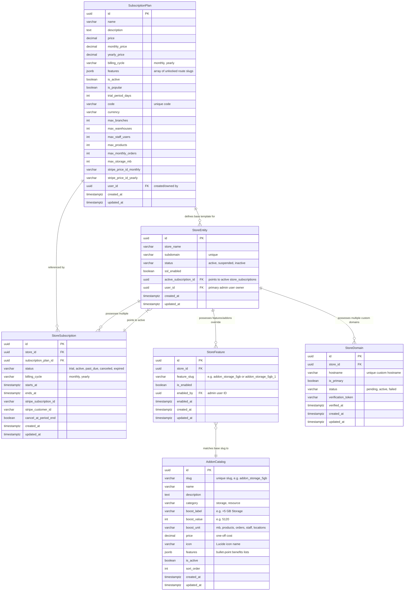
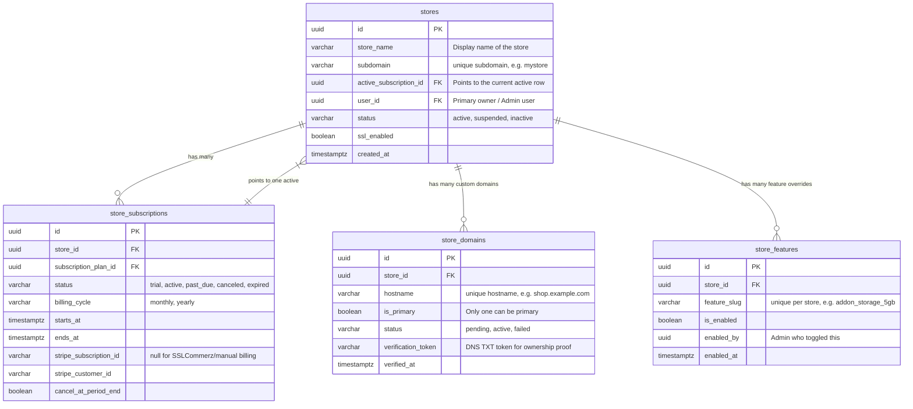

# Subscription Plans & Addon Boosts Architecture

This document details the architecture, database design, and logic flows governing **Subscription Plans** and **Dynamic Addon Boosts** within the eCommerce multi-store SaaS platform. 

It is designed as a low-level onboarding guide for developers seeking to understand, modify, or extend the billing and quota limits enforcement systems.

---

## 1. System Overview

The platform uses a hybrid subscription-and-addon model to control store capacities (limits) and feature gates.
1. **Subscription Plans**: Predefined tiers (Starter, Pro Seller, Enterprise) defining base resource quotas (e.g., maximum products, storage, locations) and feature access switches.
2. **Addon Catalog**: A superadmin-managed list of individual purchasable upgrades (e.g. `+5 GB Storage`, `+1,000 SKUs`) that stores can buy.
3. **Store Feature Overrides**: An operational registry where active addon boosts are stacked and saved. If a store buys the same storage addon multiple times, the system stacks these capabilities using a unique suffix routing strategy.

---

## 2. Entity Relationship Diagram (ERD)

The following diagram illustrates the complete, unified database schema for all store-related entities, subscription plans, custom domains, active feature registries, and the superadmin addon catalog:



---

## 3. Dynamic Limit Calculations

The backend dynamically checks resource quotas instead of reading static configuration values. The total allowed quota is computed as:

$$\text{Total Quota} = \text{Plan Base Limit} + \sum (\text{Active Addon Boost Values})$$

### 3.1 Storage Limit Logic (MinIO Uploads)
When a store requests a presigned upload URL (`FilesService.generatePresignedUpload`):
1. The base limit (`maxStorageMb`) is fetched from the store's active plan.
2. If not unlimited (`-1`), active feature overrides starting with addon storage slugs (e.g. `addon_storage_5gb`) are looked up.
3. The catalog is queried for matching addon details to extract the `boostValue` (in MB).
4. The cumulative limit is calculated, and the upload is rejected if it exceeds the sum.

```
[Upload Request (size: X)] 
          │
          ▼
Get Store's Active Plan Base limit (maxStorageMb)
          │
     ┌────┴────┐
     │         ▼
     │   [Base Limit == -1 (Unlimited)] ──► ✅ Allow Upload
     ▼
[Base Limit is Finite]
     │
     ▼
Find Store's Active Addons from 'store_features' (feature_slug starts with def.slug)
     │
     ▼
Fetch matching active definitions from 'addon_catalog' (boost_unit == 'mb')
     │
     ▼
Calculate total limit: (Base Limit + Addons Boost) * 1024 * 1024 (in Bytes)
     │
     ▼
Query total database storage used by store files ('files' table SUM of size)
     │
     ▼
Is (Used Bytes + Requested X) > Total Limit?
     ├─── YES ───► ❌ Throw 400 BadRequestException (Limit Exceeded)
     └─── NO ────► ✅ Generate Presigned URL & Save metadata
```

### 3.2 Product Count Limit Logic
When a product is added or updated (`ProductService.assertProductQuotaAvailable`):
1. The system fetches the current database product count.
2. It fetches the base `maxProducts` limit from the plan.
3. It filters active `addon_` features and matches them against `addon_catalog` items where `boostUnit === 'products'`.
4. Stacks the results to dynamically block additions if the quota is reached.

---

## 4. Multi-Purchase & Stacking (Suffix Strategy)

To allow stores to buy the same addon multiple times (e.g., purchasing three $5$ GB storage boosts) without violating the unique constraint (`store_id`, `feature_slug`) on the `store_features` table, the platform implements a **suffixed slug stack**.

### 4.1 Purchase Addon Flow (`subscription-billing.service.ts`)
```typescript
async purchaseAddon(storeId: string, addonSlug: string): Promise<void> {
  // 1. Verify slug is active in AddonCatalog
  const isValid = await this.addonCatalogService.isValidAddonSlug(addonSlug);
  if (!isValid) throw new BadRequestException(`Invalid addon slug: ${addonSlug}`);

  const featureRepo = this.dataSource.getRepository(StoreFeatureEntity);
  
  // 2. Check if this is the first purchase or a stack purchase
  let override = await featureRepo.findOne({ where: { storeId, featureSlug: addonSlug } });
  
  if (override && !override.isEnabled) {
    // Re-enable if it was previously bought and deactivated
    override.isEnabled = true;
    override.updatedAt = new Date();
    await featureRepo.save(override);
  } else if (override && override.isEnabled) {
    // 3. Stacking: Find the next available numeric suffix (e.g. addon_storage_5gb_1)
    let suffix = 1;
    let newSlug = `${addonSlug}_${suffix}`;
    while (await featureRepo.findOne({ where: { storeId, featureSlug: newSlug } })) {
      suffix++;
      newSlug = `${addonSlug}_${suffix}`;
    }
    
    override = featureRepo.create({
      storeId,
      featureSlug: newSlug,
      isEnabled: true,
      enabledAt: new Date(),
    });
    await featureRepo.save(override);
  } else {
    // First purchase of this specific addon type
    override = featureRepo.create({
      storeId,
      featureSlug: addonSlug,
      isEnabled: true,
      enabledAt: new Date(),
    });
    await featureRepo.save(override);
  }

  // 4. Invalidate subscription caches to reflect changes immediately
  await this.cacheService.delCache(`subscription:${storeId}:current`, storeId);
}
```

---

## 5. Developer Code Navigation Map

### 5.1 Backend Files
* **Entity**: [addon-catalog.entity.ts](file:///home/gowtamkumar/projects/eCommerce-multi-store-saas/server/src/modules/system/addon-catalog/entities/addon-catalog.entity.ts) — Database columns, indexes, and relations.
* **Repository**: [addon-catalog.repository.ts](file:///home/gowtamkumar/projects/eCommerce-multi-store-saas/server/src/modules/system/addon-catalog/addon-catalog.repository.ts) — Base database selectors (active-only vs superadmin-all).
* **Service**: [addon-catalog.service.ts](file:///home/gowtamkumar/projects/eCommerce-multi-store-saas/server/src/modules/system/addon-catalog/addon-catalog.service.ts) — Core CRUD logic, validation, cache invalidation, and default seed mappings.
* **Superadmin Controller**: [super-admin.controller.ts](file:///home/gowtamkumar/projects/eCommerce-multi-store-saas/server/src/modules/system/super-admin/super-admin.controller.ts) — Exposes addon catalog creation/modification under `@Roles(UserRole.SUPER_ADMIN)`.
* **Store Billing Controller**: [subscription-billing.controller.ts](file:///home/gowtamkumar/projects/eCommerce-multi-store-saas/server/src/modules/system/subscription-billing/subscription-billing.controller.ts) — Exposes `GET /billing/addon-catalog` (public listing) and `POST /billing/purchase-addon` (simulation triggers).

### 5.2 Frontend Files
* **SuperPanel Addons Page**: [page.tsx](file:///home/gowtamkumar/projects/eCommerce-multi-store-saas/client/app/system/addons/page.tsx) — Main layout container for platform managers.
* **Addon Management Panel**: [AddonCatalogList.tsx](file:///home/gowtamkumar/projects/eCommerce-multi-store-saas/client/features/system/components/AddonCatalogList.tsx) — High-fidelity administration table, catalog statistic cards, and form modals.
* **Billing Settings Dashboard**: [BillingDashboard.tsx](file:///home/gowtamkumar/projects/eCommerce-multi-store-saas/client/features/admin/settings/billing/components/BillingDashboard.tsx) — Tabs layout dividing plans and billing history.
* **Subscription Inclusions Card**: [SubscriptionOverview.tsx](file:///home/gowtamkumar/projects/eCommerce-multi-store-saas/client/features/admin/settings/billing/components/SubscriptionOverview.tsx) — Dynamic progress bar showing storage used/limit percentages, catalog boosts badge stack, and plan module indicators.
* **Store Addons Buy Grid**: [StorageAddons.tsx](file:///home/gowtamkumar/projects/eCommerce-multi-store-saas/client/features/admin/settings/billing/components/StorageAddons.tsx) — Renders purchasable grids and triggers purchases.

---

## 6. Seeding Default Addons

To seed or reset default addons, trigger the `/super-admin/register` endpoint or use the automatic seeding routine inside the `seedDefaults` service method. 

The standard addon templates populated are:

| Slug | Boost Label | Price | Category | Boost Unit | Description |
| :--- | :--- | :---: | :---: | :--- | :--- |
| `addon_storage_5gb` | `+5 GB Storage` | \$5.00 | storage | `mb` | Small storefront uploads |
| `addon_storage_10gb` | `+10 GB Storage` | \$9.00 | storage | `mb` | Growing product portfolios |
| `addon_storage_20gb` | `+20 GB Storage` | \$15.00 | storage | `mb` | High-volume image hosting |
| `addon_products_1000` | `+1,000 SKUs` | \$15.00 | resource | `products` | Expand listing capacity |
| `addon_orders_5000` | `+5,000 Orders/Mo` | \$25.00 | resource | `orders` | Raise monthly purchase limits |
| `addon_staff_10` | `+10 Staff Accounts`| \$20.00 | resource | `staff` | Multi-user roles delegation |
| `addon_locations_3` | `+3 Loc / WH` | \$35.00 | resource | `locations` | Multi-branch logistics boost |

### 6.1 Automatic Slug Generation

When a new Addon is created or updated by a SuperAdmin, the `slug` is automatically processed and generated by the backend:
1. **Fallback to Name**: If no slug is provided, the backend slugifies the `name` field (e.g., `"Luxe Domain Boost"` becomes `"luxe_domain_boost"`).
2. **Standard Prefix**: Every slug is checked and forced to start with the `addon_` prefix. For example, `"custom_domain"` automatically becomes `"addon_custom_domain"`.
3. **Cleaning**: All non-alphanumeric characters are stripped and replaced with underscores (`_`). Leading and trailing underscores are trimmed.

---

## 7. Store Model — Deep Dive

A **Store** represents a single isolated merchant store on the platform. Every store gets their own subdomain, admin user, database-scoped data, subscription, and feature access matrix.

### 7.1 Store Database Tables

The store system is split into **four database tables**, each with a specific role:



> **Key design note**: `stores.active_subscription_id` is a **pointer** to the current active `store_subscriptions` row. This means the store entity can have a full history of past subscriptions and the active subscription is resolved via join.

---

### 7.2 Subscription Status Lifecycle

A store's subscription status progresses through these states:

```
                     ┌────────────┐
  New Signup ──────► │   TRIAL    │
                     └─────┬──────┘
                           │ Trial expires OR store upgrades
                           ▼
                     ┌────────────┐
       Payment OK ──►│   ACTIVE   │◄─── Renewal Success
                     └─────┬──────┘
                           │ Payment fails
                           ▼
                     ┌────────────┐
                     │  PAST_DUE  │
                     └─────┬──────┘
                           │ Not recovered in grace period
                           ▼
                     ┌────────────┐
    Store cancels ─►│  CANCELED  │
                     └────────────┘
                           │ 
                           ▼ End of billing period
                     ┌────────────┐
                     │  EXPIRED   │
                     └────────────┘
```

| Status | `SubscriptionStatus` | Effect on store access |
| :--- | :--- | :--- |
| `trial` | `TRIAL` | Full plan features, limited by `trialPeriodDays` |
| `active` | `ACTIVE` | Full plan features, enforced by `endsAt` |
| `past_due` | `PAST_DUE` | Grace period; access continues but warnings shown |
| `canceled` | `CANCELED` | Plan locked; billing stopped, access ends at `endsAt` |
| `expired` | `EXPIRED` | `isExpired: true` — guarded routes return 403 |

---

### 7.3 Store Computed Virtual Getters

`StoreEntity` exposes **virtual getters** (not stored columns) that join through the active subscription to expose convenient flat properties to service code:

```typescript
// Example: get the plan name without a join in your service
const plan = store.subscriptionPlan           // → SubscriptionPlanEntity | null
const planId = store.subscriptionPlanId       // → string | null
const status = store.subscriptionStatus       // → SubscriptionStatus | null
const cycle = store.subscriptionBillingCycle  // → 'monthly' | 'yearly' | null
const starts = store.subscriptionStartsAt     // → Date | null
const ends = store.subscriptionEndsAt         // → Date | null
const expired = store.isExpired               // → boolean (computed: now > endsAt)
const domain = store.primaryCustomDomain      // → 'shop.example.com' | null
```

> **Important for developers**: Always load the store with `activeSubscription.subscriptionPlan` relation eagerly or these getters return `null`. The `StoreRepository.findByIdWithUser()` method does this correctly.

---

### 7.4 Store Onboarding Flow (Full Transaction)

When a new store signs up via `POST /stores` or `POST /stores/onboard`, the following steps happen atomically inside a **database transaction**:

```
POST /stores  { storeName, subdomain, planId?, email, username, password }
          │
          ▼
1. Validate subdomain uniqueness
          │
          ▼
2. Resolve SubscriptionPlan
   ├── planId provided → fetch that plan
   └── no planId → use cheapest active plan (Starter)
          │
          ▼
3. BEGIN TRANSACTION ──────────────────────────────────────────────────────┐
   │                                                                        │
   ├── 3a. INSERT stores (store_name, subdomain)                          │
   │                                                                        │
   ├── 3b. INSERT store_subscriptions                                     │
   │        status = TRIAL                                                  │
   │        ends_at = now + trialPeriodDays                                │
   │                                                                        │
   ├── 3c. UPDATE stores.active_subscription_id = new sub.id             │
   │                                                                        │
   ├── 3d. INSERT branches (Main Branch)                                   │
   │                                                                        │
   ├── 3e. INSERT warehouses (Main Warehouse → links to branch)            │
   │                                                                        │
   ├── 3f. INSERT pos_registers (Main Till → links to branch)             │
   │                                                                        │
   ├── 3g. INSERT users (Admin role, links to branch & store)             │
   │        password is bcrypt-hashed                                       │
   │                                                                        │
   ├── 3h. Seed default RBAC roles (SuperAdmin, Manager, etc.)             │
   │        Assign SuperAdmin role to the new Admin user                    │
   │                                                                        │
   └── 3i. Seed Chart of Accounts (default COA for finance module)         │
                                                                            │
END TRANSACTION ────────────────────────────────────────────────────────────┘
          │
          ▼
4. AFTER TRANSACTION (parallel, non-critical):
   ├── Initialize default site settings (store name, contact email)
   ├── Send email verification link to admin email
   └── Send "New Store Signup" notification to SuperAdmin dashboard
          │
          ▼
5. Return { store, admin: { id, name, username, email } }
```

---

### 7.5 Store Feature Overrides (`store_features` table)

This table is the **intersection registry** between a store and their active capabilities. It stores two kinds of slugs:

| Slug Pattern | Source | Example |
| :--- | :--- | :--- |
| Route slug | Subscription plan `features` array | `/admin/hrm`, `/admin/pos` |
| Addon slug (base) | First addon purchase | `addon_storage_5gb` |
| Addon slug (stacked) | Repeat addon purchase | `addon_storage_5gb_1`, `addon_storage_5gb_2` |

> **Rows are NEVER deleted on plan downgrade** — only `is_enabled` is set to `false`. This preserves addon purchase history and RBAC configuration so upgrades restore access automatically without re-purchasing.

#### How feature slugs are resolved at runtime:

```typescript
// In SubscriptionGuard / feature checks
const activeFeatures = await featureRepo.find({
  where: { storeId, isEnabled: true }
})
const hasHrm = activeFeatures.some(f => f.featureSlug === '/admin/hrm')

// For stacked addons (counting how many times a boost was purchased):
const storageAddonCount = activeFeatures.filter(f =>
  f.featureSlug === 'addon_storage_5gb' || f.featureSlug.startsWith('addon_storage_5gb_')
).length
```

---

### 7.6 Custom Domains (`store_domains` table)

Stores can attach their own domains (e.g. `shop.mybrand.com`) via the custom domain system. Caddy reverse-proxy uses **on-demand TLS** and validates ownership via a DNS check endpoint:

```
[Browser: shop.mybrand.com]
          │
          ▼
[Caddy: on_demand_tls asks → GET /api/v1/stores/check-domain?hostname=shop.mybrand.com]
          │
          ├── Found & ACTIVE → ✅ Issue certificate, proxy to client:3000
          └── Not found / PENDING → ❌ Reject connection
```

| Domain Status | Meaning |
| :--- | :--- |
| `pending` | Added by store, DNS TXT record not yet verified |
| `active` | DNS verified — Caddy will serve HTTPS for this hostname |
| `failed` | Verification attempts exhausted |

---

### 7.7 Store API Endpoints Reference

| Method | Path | Auth | Description |
| :--- | :--- | :---: | :--- |
| `POST` | `/api/v1/stores/onboard` | Public | Register a new store (public signup) |
| `POST` | `/api/v1/stores` | SuperAdmin | Create a store manually from SuperAdmin |
| `GET` | `/api/v1/stores` | SuperAdmin | List all stores with pagination |
| `GET` | `/api/v1/stores/:id` | SuperAdmin | Get one store with full subscription context |
| `PATCH` | `/api/v1/stores/:id` | SuperAdmin | Update store (status, plan, etc.) |
| `DELETE` | `/api/v1/stores/:id` | SuperAdmin | Soft-delete store |
| `GET` | `/api/v1/stores?subdomain=x` | Internal | Resolve store by subdomain (used by middleware) |
| `GET` | `/api/v1/stores/check-domain` | Internal | Caddy domain validation hook |
| `POST` | `/api/v1/billing/purchase-addon` | Store Admin | Purchase and stack an addon boost |
| `GET` | `/api/v1/billing/current` | Store Admin | Get current subscription info + active addons |
| `GET` | `/api/v1/billing/addon-catalog` | Store Admin | List all available purchasable addons |

---

### 7.8 Store Code Navigation Map

| Layer | File | Purpose |
| :--- | :--- | :--- |
| Entity | [store.entity.ts](file:///home/gowtamkumar/projects/eCommerce-multi-store-saas/server/src/modules/system/store/entities/store.entity.ts) | Main store record + virtual getters |
| Entity | [store-subscription.entity.ts](file:///home/gowtamkumar/projects/eCommerce-multi-store-saas/server/src/modules/system/store/entities/store-subscription.entity.ts) | Subscription history rows |
| Entity | [store-feature.entity.ts](file:///home/gowtamkumar/projects/eCommerce-multi-store-saas/server/src/modules/system/store/entities/store-feature.entity.ts) | Active features / addon overrides |
| Entity | [store-domain.entity.ts](file:///home/gowtamkumar/projects/eCommerce-multi-store-saas/server/src/modules/system/store/entities/store-domain.entity.ts) | Custom hostnames + TLS verification |
| DTO | [create-store.dto.ts](file:///home/gowtamkumar/projects/eCommerce-multi-store-saas/server/src/modules/system/store/dto/create-store.dto.ts) | Onboarding payload validation |
| Service | [store.service.ts](file:///home/gowtamkumar/projects/eCommerce-multi-store-saas/server/src/modules/system/store/store.service.ts) | Full onboarding transaction + business rules |
| Controller | [store.controller.ts](file:///home/gowtamkumar/projects/eCommerce-multi-store-saas/server/src/modules/system/store/store.controller.ts) | SuperAdmin-guarded CRUD endpoints |
| Controller | [public-store.controller.ts](file:///home/gowtamkumar/projects/eCommerce-multi-store-saas/server/src/modules/system/store/public-store.controller.ts) | Public onboard endpoint (signup page) |
| Billing Svc | [subscription-billing.service.ts](file:///home/gowtamkumar/projects/eCommerce-multi-store-saas/server/src/modules/system/subscription-billing/subscription-billing.service.ts) | `getCurrentSubscription`, `purchaseAddon` |
