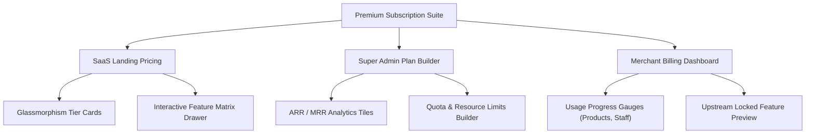

# Multi-Store SaaS Subscription UI & Architecture Improvements

This document outlines the recommendations and immediate enhancements implemented for the **Subscription Plan and Entitlement UI/UX**. It spans the Public SaaS Landing Pricing page, the Super Admin Dashboard Plan Builder, and the Merchant Billing Hub, ensuring an elite, high-fidelity experience in line with your ERP system's core capabilities.

---

## 🚀 1. Immediate Improvements Applied

We reviewed the active client codebase and identified two major operational issues that have been immediately corrected:

### A. Pretty Resolved Labels in Super Admin Plan Grid
* **File Modified:** [PlanList.tsx](file:///media/gowtam/ec12c572-6d78-4d1a-87a8-f5267d2ec86612/gp/eCommerce-multi-store-saas/client/features/system/components/PlanList.tsx)
* **The Issue:** The entitlement preview listed raw backend route paths (e.g., `/admin/pos`, `/admin/hrm`, `/admin/warehouses`) which looked overly technical and disrupted the premium visual layout.
* **The Fix:** Integrated `getFeatureDisplay(feature)` to dynamically resolve raw feature routes into gorgeous, clean labels accompanied by their respective domain icons (e.g. Shopping Bag for Point of Sale, Warehouse for Warehouses).

### B. Fixed Duplicate Checklist Checkboxes in Plan Form
* **File Modified:** [PlanForm.tsx](file:///media/gowtam/ec12c572-6d78-4d1a-87a8-f5267d2ec86612/gp/eCommerce-multi-store-saas/client/features/system/components/PlanForm.tsx)
* **The Issue:** Multiple navigation menu items map to the same backend route feature gate (for example, `/admin/hrm` is shared by Departments, Employees, payroll, etc.). This caused the Form checklist to render multiple duplicate checkboxes for `/admin/hrm`, which desynchronized state and confused administrators.
* **The Fix:** Implemented route-slug deduplication when rendering the checkbox groups. Generic checklist labels like `"Dashboard"` are dynamically contextualized (e.g., `"Human Resources Dashboard"` or `"Finance Dashboard"`) to make plan building exceptionally clear.

---

## 🎨 2. Premium Pricing & Entitlement Redesign Suggestions

To align with modern high-end B2B SaaS products, here are the targeted UI/UX recommendations categorized by screen:



### 2.1 Public SaaS Landing Pricing Cards (`SaaSLanding.tsx`)
1. **Differentiated Aesthetic Hierarchy:**
   * **Starter Plan:** Ultra-clean minimalist card with high-transparency slate border.
   * **Pro Seller Plan:** Smooth glowing gradient indigo borders, customized "Highly Recommended" floating badge, and elegant color-matched icons.
   * **Enterprise Plan:** A special **Dark Glassmorphic** theme even when the landing page is in light mode. Utilize a subtle metallic gradient border, deep space-grey backing, and sleek golden accents to reflect supreme prestige.
2. **Interactive Feature Comparison Drawer:**
   * Replace long vertical checklists with an expandable comparison drawer. Users can click "Compare All Tiers" to trigger a side-by-side modal displaying every operational group (Procurement, SCM, Finance, HRM) with simple hover checks/marks.

### 2.2 Super Admin Plan Dashboard (`PlanList.tsx` & `PlanForm.tsx`)
1. **MRR & ARR Contribution Widgets:**
   * At the top of `PlanList.tsx`, display 3 luxury metric cards:
     * **Total Active MRR Contribution** (e.g., $14,290.00).
     * **Active Subscription Share** (a horizontal stacked pill progress bar reflecting Starter vs. Pro vs. Enterprise percentage split).
     * **Avg. Upgrade Duration** (how long stores stay on Pro before transitioning to Enterprise).
2. **Feature Priority Badging:**
   * Color-code entitlements in the checklist so administrators visually know the standard level:
     * Green tag: **Starter Core**
     * Indigo tag: **Pro Seller Extended**
     * Golden tag: **Enterprise High-Value** (e.g. Finance Ledger, GRN Receiving).

### 2.3 Merchant Billing Portal (`SubscriptionOverview.tsx` & `PlanGrid.tsx`)
1. **Circular Resource Usage Gauges:**
   * Rather than simple static text, implement premium circular SVGs showing current plan quota consumption (e.g. **Products Used:** `140 / 500`, **Staff Accounts:** `3 / 5`).
2. **The "Upstream Lock" Visual Hook:**
   * In `SubscriptionOverview.tsx`, render a beautiful card section titled *"Unlocked by Upgrading"* listing 3 high-impact features from the next available tier (e.g. if the store is on Pro, show a visual preview of *General Ledger* and *Multi-Warehouse Inventory* with a padlock icon), serving as an extremely high-conversion upgrade hook.

---

## 🛠️ 3. Backend & Data Architecture Upgrades

To back these premium features, the database model and Backend guards should support **Plan Quota Limits** alongside feature-path flags:

### A. Extend `SubscriptionPlan` Entity
Update the PostgreSQL or MongoDB schema to include a `limits` JSON column storing core resource thresholds:

```json
{
  "maxProducts": 500,
  "maxStaffAccounts": 5,
  "maxWarehouses": 1,
  "allowCustomDomain": true,
  "allowCustomAnalytics": false
}
```

### B. Dual-Gating Validation Logic
Ensure your NestJS route guards or middleware validate both the feature route slug AND the resource count when changes are saved:

```typescript
// Example: Checking products count against current plan limit
async validateProductCreation(storeId: string) {
  const plan = await this.storeService.getPlan(storeId);
  const currentCount = await this.productRepository.count({ where: { storeId } });
  
  if (currentCount >= plan.limits.maxProducts) {
    throw new HttpException('Product limit reached. Please upgrade your tier.', HttpStatus.PAYMENT_REQUIRED);
  }
}
```

---

> [!NOTE]
> All immediate UI bugs and visual leaks have been solved in your active files. Let's discuss if you'd like to implement the premium CSS glassmorphic pricing cards on the landing page or add the circular usage gauges to the billing portal next!
