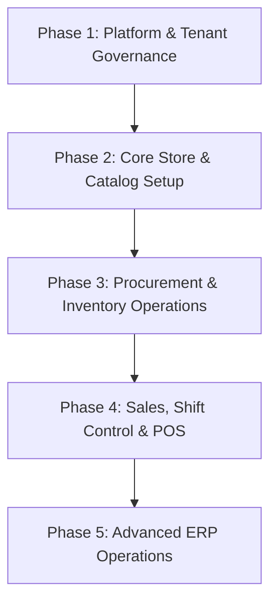

# Multi-Tenant SaaS ERP — Manual & QA Testing Master Playbook

This playbook provides a step-by-step, module-by-module manual testing and Quality Assurance (QA) guideline for the Multi-Tenant SaaS ERP system. It covers environment preparation, module-specific test steps, API verifications, database validation queries, and edge-case boundary testing.

---

## 🛠️ Section 1: Testing Environment Preparation & Setup

To perform thorough manual and QA testing, your local environment must mimic a production multi-tenant architecture. 

### 1.1 Local Services Port Mapping
Verify that the services from `docker-compose.dev.yml` are running correctly:
*   **Next.js Frontend Client**: `http://localhost:3000` (runs Next.js App Router server)
*   **NestJS Backend API Server**: `http://localhost:3900`
*   **PostgreSQL Database (pgvector)**: `localhost:5434` (User: `postgres` / Pass: `postgres` / DB: `multi_tenant_ecommerce`)
*   **pgAdmin Web Console**: `http://localhost:5051` (Login: `gowtampaul0@gmail.com` / Pass: `gowtampaul1995@`)
*   **Redis Cache Server**: `localhost:6380` (Standard Redis instance)
*   **Redis Commander**: `http://localhost:8088` (Redis GUI console)
*   **MinIO Object Storage Console**: `http://localhost:9001` (Console) / `http://localhost:9000` (API) (Access: `minioadmin` / `minioadmin`)
*   **Mail Sandbox (MailHog)**: `http://localhost:8025` (Intercepts all emails triggered by SMTP)

### 1.2 Local DNS & Subdomain Routing
The application determines tenant routing based on the hostname subdomain. Map your local hosts file to simulate this:
*   **Linux/macOS**: Edit `/etc/hosts` (requires `sudo`):
    ```hosts
    127.0.0.1  localhost
    127.0.0.1  system.localhost
    127.0.0.1  lazzpharma.localhost
    127.0.0.1  almadina.localhost
    ```
*   **Windows**: Edit `C:\Windows\System32\drivers\etc\hosts` with Administrator privileges.

---

## 📖 Section 2: Interactive API Testing with Swagger UI

The NestJS backend generates live OpenAPI/Swagger documentation. You can use it as an interactive API testing platform:

1.  **Accessing Swagger**:
    *   Open your browser and navigate to `http://localhost:3900/api/docs`.
2.  **Obtaining a JWT Bearer Token**:
    *   First, log in via `POST /api/v1/admin/login` (in the Swagger UI or via Curl/Postman).
    *   Copy the `accessToken` string returned in the response.
3.  **Authorizing the Session in Swagger**:
    *   Click the green **Authorize** button at the top right of the Swagger page.
    *   Paste your copied `accessToken` in the value field and click **Authorize**.
    *   All subsequent API requests executed within Swagger will automatically attach the `Authorization: Bearer <token>` header.

---

## 🗺️ Section 3: Phase-by-Phase Testing Plan

Testing is structured into **5 Sequential Phases** to ensure foundational configurations are functional before complex ledger transactions are executed.



---

## 🔍 Section 4: Module-by-Module Detailed Test Procedures

---

### 🏛️ Phase 1: Platform & Tenant Governance

#### Module 1: Super-Admin & Tenant Onboarding
Verify the registration of a new tenant and seed resource instantiation.
1.  **UI Step-by-Step**:
    *   Navigate to the Super-Admin panel: `http://system.localhost:3000/system` (or `/system`).
    *   Click **Onboard Tenant** and fill out the form:
        *   *Store Name*: `Lazz Pharma`, *Subdomain*: `lazzpharma`
        *   *Owner Email*: `owner@lazzpharma.com`, *Password*: `SecurePassword123!`
        *   *Subscription Plan*: Select a plan with active feature flags (e.g., HRM, POS, AI enabled).
    *   Submit the form.
2.  **API Verification**:
    *   **Endpoint**: `POST /api/v1/system/tenants/onboard`
    *   **Request Payload**:
        ```json
        {
          "storeName": "Lazz Pharma",
          "subdomain": "lazzpharma",
          "planId": "3ba7ff70-b1f8-40e5-b96e-cb32f5052248",
          "name": "Lazz Admin",
          "username": "lazzadmin",
          "email": "owner@lazzpharma.com",
          "password": "SecurePassword123!"
        }
        ```
    *   **Expected Response (201 Created)**:
        ```json
        {
          "success": true,
          "message": "Store created successfully",
          "subdomain": "lazzpharma"
        }
        ```
3.  **Database Verification**:
    *   Query the tenant status:
        ```sql
        SELECT id, store_name, subdomain, status FROM tenants WHERE subdomain = 'lazzpharma';
        -- Success criteria: 1 row returned, status is 'ACTIVE'.
        ```
    *   Verify role and Chart of Accounts (COA) seeding for the new tenant's UUID:
        ```sql
        SELECT code, name FROM accounts WHERE tenant_id = 'YOUR_TENANT_UUID' ORDER BY code;
        -- Success criteria: Standard accounting codes (e.g., Cash 1010, Inventory 1200, Revenue 4010, COGS 5010) exist.
        ```

#### Module 2: Authentication, Security & RBAC Scoping
Verify user authentication, active sessions audit logs, and branch-level scoping restriction.
1.  **UI Step-by-Step**:
    *   Navigate to `http://lazzpharma.localhost:3000/admin/login`.
    *   Log in as `owner@lazzpharma.com`.
    *   Go to **Settings -> Team Settings -> Invite Staff**.
    *   Send invitation to `cashier@lazzpharma.com` scoped strictly to the **Dhaka Branch**.
    *   Open your local SMTP interface/sandbox (MailHog at `http://localhost:8025`) and copy the activation token.
    *   Navigate to the signup activation page using the token, enter a password, and register.
2.  **API Verification**:
    *   **Endpoint**: `POST /api/v1/admin/login`
    *   **Request Payload**:
        ```json
        {
          "email": "owner@lazzpharma.com",
          "password": "SecurePassword123!"
        }
        ```
    *   **Expected Response (200 OK)**: Contains `accessToken` and `refreshToken`.
3.  **Gating Test**:
    *   Log out and log back in as `cashier@lazzpharma.com`.
    *   Attempt to navigate to settings or select **Sylhet Branch** in the UI.
    *   Verify that access is blocked with a **"403 - Forbidden / Access Denied"** warning.
4.  **Database Verification**:
    *   Verify the user's active session is logged:
        ```sql
        SELECT user_id, ip, expires_at, revoked_at FROM sessions WHERE user_id = 'USER_UUID';
        -- Success criteria: revoked_at is NULL, session details match the tester's client.
        ```
    *   Verify role assignments and branch restriction:
        ```sql
        SELECT user_id, role_id, scope_branch_id FROM user_role_assignments WHERE user_id = 'USER_UUID';
        -- Success criteria: scope_branch_id matches the Dhaka Branch UUID.
        ```

---

### 📦 Phase 2: Core Store & Catalog Setup

#### Module 3: Physical & Financial Setup (COA)
Verify creation of branches, warehouses, bins, and custom sub-accounts.
1.  **UI Step-by-Step**:
    *   Log in as the Owner.
    *   Go to **Settings -> Organization -> Branches**. Click **Add Branch** (Create "Dhaka Branch" and "Sylhet Branch").
    *   Go to **Settings -> Inventory -> Warehouses**. Create "Dhaka Central Warehouse" mapped to Dhaka Branch. Create "Bin-A1" and "Bin-A2" under this warehouse.
    *   Navigate to **Accounting -> Chart of Accounts**. Click **Create Sub-Account** (Create a child account under `1010` named `1011 - Cash Drawer 1`).
2.  **API Verification**:
    *   **Create Sub-Account Endpoint**: `POST /api/v1/finance/accounting/accounts`
    *   **Request Payload**:
        ```json
        {
          "code": "1011",
          "name": "Cash Drawer 1",
          "type": "ASSET",
          "category": "CASH"
        }
        ```
3.  **Database Verification**:
    *   Ensure the parent-child relationship maps correctly in accounts:
        ```sql
        SELECT code, name, parent_id FROM accounts WHERE code = '1011';
        -- Success criteria: parent_id points to the ID of account code '1010'.
        ```

#### Module 4: Product Catalog & Batch/FEFO Lot Registry
Verify setup of products, pricing sheets, and batch expiration tracking.
1.  **UI Step-by-Step**:
    *   Navigate to **Catalog -> Products**. Click **Add Product**.
    *   Create a product (e.g., "Napa Extra 500mg"). Add variations (e.g., "Box of 10", "Box of 100").
    *   Go to **Catalog -> Price Books**. Create a standard price list mapping separate retail values.
    *   Navigate to **Inventory -> Batches/Lots**. Create a batch lot for "Napa Extra":
        *   *Batch Number*: `B-NAPA-2026-001`
        *   *Expiry Date*: Set to 6 months from today.
2.  **API Verification**:
    *   **Create Batch Endpoint**: `POST /api/v1/operations/logistics/inventory-transaction/product-batch`
    *   **Request Payload**:
        ```json
        {
          "productId": "PRODUCT_UUID",
          "variantId": "VARIANT_UUID",
          "batchNumber": "B-NAPA-2026-001",
          "expiryDate": "2026-12-31T00:00:00.000Z",
          "manufacturedDate": "2026-06-01T00:00:00.000Z"
        }
        ```
3.  **Database Verification**:
    *   Verify batch records are mapped:
        ```sql
        SELECT id, batch_number, expiry_date, quantity_on_hand FROM product_batches WHERE batch_number = 'B-NAPA-2026-001';
        -- Success criteria: Row exists with correct expiry date and starts at 0 quantity prior to GRN.
        ```

---

### 🛒 Phase 3: Procurement & Inventory Operations

#### Module 5: Procurement & Accounts Payable (AP)
Verify creation of a Purchase Order (PO) and matching invoice verification.
1.  **UI Step-by-Step**:
    *   Navigate to **Procurement -> Purchase Orders**. Click **Create Purchase Order**.
    *   Select a supplier, add "Napa Extra" (Qty: 100 boxes, Unit Cost: $5.00), and click **Submit for Approval**.
    *   Log in as the Inventory Supervisor (or Owner) and click **Approve PO**. The status should transition to `SENT`.
    *   Navigate to **Procurement -> Supplier Invoices**. Click **Intake Invoice**. Enter the invoice details corresponding to the PO.
2.  **API Verification**:
    *   **Create Purchase Order Endpoint**: `POST /api/v1/purchase-orders`
    *   **Request Payload**:
        ```json
        {
          "supplierId": "SUPPLIER_UUID",
          "warehouseId": "WAREHOUSE_UUID",
          "branchId": "BRANCH_UUID",
          "items": [
            {
              "productId": "PRODUCT_UUID",
              "variantId": "VARIANT_UUID",
              "orderedQty": 100,
              "unitCost": 5.00
            }
          ]
        }
        ```
    *   **Record Payment Endpoint**: `POST /api/v1/purchase-orders/:id/payments`
    *   **Request Payload**:
        ```json
        {
          "paymentMethod": "BANK_TRANSFER",
          "amount": 500.00,
          "paymentDate": "2026-07-02T00:00:00.000Z",
          "referenceNumber": "TXN-PO-12345"
        }
        ```
3.  **Database Verification**:
    *   Check the General Ledger (GL) journal entries:
        ```sql
        SELECT je.id, je.narration, jl.account_code, jl.debit, jl.credit 
        FROM journal_entries je
        JOIN journal_lines jl ON je.id = jl.journal_entry_id
        WHERE je.reference_type = 'PURCHASE_PAYMENT' ORDER BY je.created_at DESC;
        -- Success criteria: Accounts Payable (2100) is DEBITED, Cash/Bank (1010/1011) is CREDITED by the exact invoice total.
        ```

#### Module 6: Goods Received Note (GRN) & Lot Allocation
Verify physical verification of incoming inventory, ledger postings, and batch registration.
1.  **UI Step-by-Step**:
    *   Navigate to **Logistics -> Goods Received Notes (GRN)**.
    *   Select the approved PO from Module 5 and click **Receive Goods**.
    *   In the receipt grid, verify quantities. For the 100 boxes of Napa Extra:
        *   Assign them to batch `B-NAPA-2026-001`.
        *   Assign the storage bin location to `Bin-A1`.
    *   Click **Verify and Save GRN**.
2.  **API Verification**:
    *   **Create GRN Endpoint**: `POST /api/v1/operations/logistics/grn`
    *   **Request Payload**:
        ```json
        {
          "poId": "PURCHASE_ORDER_UUID",
          "supplierId": "SUPPLIER_UUID",
          "warehouseId": "WAREHOUSE_UUID",
          "branchId": "BRANCH_UUID",
          "items": [
            {
              "productId": "PRODUCT_UUID",
              "variantId": "VARIANT_UUID",
              "orderedQty": 100,
              "receivedQty": 100,
              "unitCost": 5.00,
              "condition": "GOOD"
            }
          ]
        }
        ```
    *   **Verify GRN Endpoint**: `PATCH /api/v1/operations/logistics/grn/:id/verify`
    *   **Request Payload**:
        ```json
        {
          "status": "VERIFIED",
          "notes": "Verified all 100 boxes in good condition."
        }
        ```
3.  **Database Verification**:
    *   Verify ledger balance and stock tracking:
        ```sql
        -- 1. Check Inventory Ledger
        SELECT product_id, warehouse_id, quantity_change, reference_type FROM inventory_ledger WHERE reference_type = 'GRN';
        -- Success criteria: Positive change (+100) mapped to the Dhaka Central Warehouse.

        -- 2. Check general ledger allocations
        -- Success criteria: Inventory Asset (1200) is DEBITED, Accounts Payable (2100) is CREDITED.
        ```

---

### 💸 Phase 4: Sales, Shift Control & POS

#### Module 7: POS Shift Management & Drawer Control
Verify float management, drawer transactions, and Z-report shift reconciliation.
1.  **UI Step-by-Step**:
    *   Log in as Cashier (`cashier@lazzpharma.com`) scoped to Dhaka Branch.
    *   Open the POS module. The screen will prompt: **Open New Shift**.
    *   Enter starting float cash: `$100.00`. Click **Open Shift**.
    *   Perform a drawer payout (Cash Out): Navigate to **Drawer Actions -> Cash Out**. Enter `$20.00` for "Office Supplies" and save.
    *   At the end of the testing session, click **Close Shift**.
    *   Enter counted drawer cash. Click **Reconcile & Print Z-Report**.
2.  **API Verification**:
    *   **Open Shift Endpoint**: `POST /api/v1/pos/shift/open`
    *   **Request Payload**:
        ```json
        {
          "registerId": "REGISTER_UUID",
          "startingCash": 100.00
        }
        ```
    *   **Record Drawer Transaction (Cash Out)**: `POST /api/v1/pos/shift/:shiftId/drawer-transaction`
    *   **Request Payload**:
        ```json
        {
          "type": "CASH_OUT",
          "amount": 20.00,
          "reason": "Office Supplies"
        }
        ```
    *   **Close Shift Endpoint**: `POST /api/v1/pos/shift/:shiftId/close`
    *   **Request Payload**:
        ```json
        {
          "endingCashCounted": 80.00,
          "notes": "Drawer balanced exactly."
        }
        ```
3.  **Database Verification**:
    *   Verify shift record status:
        ```sql
        SELECT starting_cash, ending_cash_counted, ending_cash_expected, difference, status 
        FROM pos_shifts WHERE cashier_id = 'CASHIER_UUID' ORDER BY opened_at DESC LIMIT 1;
        -- Success criteria: Status is 'CLOSED'. difference = (Counted Cash - Expected Cash).
        ```

#### Module 8: POS Register Checkout & Payment Splits
Verify cart assembly, barcode scanning, VAT computations, and multi-tender split payments.
1.  **UI Step-by-Step**:
    *   Ensure an active shift is open. Open the **POS Register Screen**.
    *   Add "Napa Extra" to the cart (scan barcode or search name). Add 2 boxes.
    *   Verify calculations: Subtotal, VAT (e.g. 15%), and Grand Total.
    *   Click **Checkout**. Select **Split Payment**:
        *   *Cash*: `$5.00`
        *   *Mobile Wallet (e.g., bKash / Card)*: Remaining balance.
    *   Click **Complete Order**. Print or view the receipt.
2.  **API Verification**:
    *   **Create Order Endpoint**: `POST /api/v1/orders` (or synced via POS controller)
3.  **Database Verification**:
    *   Verify order records and payment details:
        ```sql
        SELECT id, total_amount, tax_amount, payment_status FROM orders ORDER BY created_at DESC LIMIT 1;
        -- Success criteria: status is 'COMPLETED', payment_status is 'PAID'.
        ```
    *   Verify double-entry ledger postings:
        ```sql
        -- Expected Journal postings for Sales:
        -- DEBIT: Cash (1010) -> cash portion
        -- DEBIT: Mobile Clearing (1015) -> card/mobile portion
        -- CREDIT: Sales Revenue (4010) -> pre-tax amount
        -- CREDIT: VAT Payable (2250) -> tax amount
        
        -- Expected Journal postings for COGS:
        -- DEBIT: Cost of Goods Sold (5010)
        -- CREDIT: Inventory Asset (1200)
        ```

#### Module 9: Offline POS Operations & Idempotent Sync
Verify offline survival, local queueing, and network reconnection synchronization.
1.  **UI Step-by-Step**:
    *   Open the POS checkout page on a browser.
    *   **Simulate Offline Mode**: Open Browser Developer Tools (F12) -> Go to the **Network** tab -> Select the throttling dropdown and set to **Offline**.
    *   Attempt to check out a new transaction with "Napa Extra".
    *   Verify that the UI displays a warning banner: **"Running in Offline Mode - Transaction Saved Locally"**. The transaction should finalize locally.
    *   **Simulate Online Mode**: Switch the Network tab throttling back to **No Throttling** (Online).
    *   Observe the synchronization log/toast on the UI dashboard.
2.  **API Verification**:
    *   **Sync POS Sale Endpoint**: `POST /api/v1/pos/sync`
    *   **Request Payload**:
        ```json
        {
          "clientSaleId": "unique-client-guid-12345",
          "shiftId": "SHIFT_UUID",
          "customerId": "CUSTOMER_UUID",
          "salespersonId": "USER_UUID",
          "branchId": "BRANCH_UUID",
          "paymentMethod": "CASH",
          "amountPaid": 30.00,
          "items": [
            {
              "productId": "PRODUCT_UUID",
              "variantId": "VARIANT_UUID",
              "quantity": 3,
              "unitPrice": 10.00
            }
          ]
        }
        ```
3.  **Technical & Database Verification**:
    *   Right-click in the browser -> Inspect -> Go to **Application** -> **IndexedDB**.
    *   Verify that the offline order is saved in the offline storage registry with a unique client-side transaction ID (`clientSaleId`).
    *   Once online, verify that the order is posted to the backend API (`POST /api/v1/pos/sync`) and deleted from the browser's IndexedDB.
    *   Verify the database `orders` table to ensure the transaction has been recorded, and inventory has been decremented.

---

### 🚚 Phase 5: Advanced ERP Operations

#### Module 10: Courier API Integrations & Webhooks
Verify Steadfast & Pathao courier integrations and external status update webhooks.
1.  **UI Step-by-Step**:
    *   Log in as Owner. Go to **Sales -> Orders**. Select a packed order.
    *   Click **Assign Courier**. Select **Steadfast**. Enter weight, package details, and click **Submit**.
    *   Confirm that a Tracking ID is fetched from Steadfast and saved on the order.
2.  **API Verification**:
    *   **Create Courier Order**: `POST /api/v1/courier/steadfast/create-order`
    *   **Steadfast Webhook Callback (Simulate Status Update)**:
        *   **Endpoint**: `POST /api/v1/courier/webhooks/steadfast`
        *   **Request Headers**: Set `Content-Type: application/json`
        *   **Payload**:
            ```json
            {
              "status": "delivered",
              "tracking_code": "TRACKING_ID_12345",
              "invoice": "INV-10001"
            }
            ```
3.  **Database Verification**:
    *   Query the updated order status:
        ```sql
        SELECT status, payment_status, tracking_id FROM orders WHERE tracking_id = 'TRACKING_ID_12345';
        -- Success criteria: status is 'COMPLETED', payment_status is 'PAID'.
        ```

#### Module 11: Logistics Stock Transfers
Verify inter-warehouse stock routing and transit states.
1.  **UI Step-by-Step**:
    *   Navigate to **Logistics -> Stock Transfers**. Click **New Request**.
    *   *Source*: Dhaka Central Warehouse. *Destination*: Sylhet Branch Warehouse.
    *   Select item: "Napa Extra" (Qty: 20 boxes). Click **Submit Transfer**.
    *   Log in as Manager. Approve the transfer and click **Dispatch**. (Status = `IN_TRANSIT`).
    *   Log in as Sylhet Warehouse Receiver. Click **Mark as Received**. (Status = `COMPLETED`).
2.  **API Verification**:
    *   **Create Stock Transfer Request**: `POST /api/v1/operations/logistics/inventory-transaction/stock-transfer`
    *   **Request Payload**:
        ```json
        {
          "sourceWarehouseId": "DHAKA_WAREHOUSE_UUID",
          "destinationWarehouseId": "SYLHET_WAREHOUSE_UUID",
          "items": [
            {
              "productId": "PRODUCT_UUID",
              "variantId": "VARIANT_UUID",
              "quantity": 20
            }
          ]
        }
        ```
3.  **Database Verification**:
    *   Ensure source warehouse inventory is decremented upon dispatch, and destination is incremented only upon receipt:
        ```sql
        SELECT warehouse_id, quantity_change, reference_type 
        FROM inventory_ledger WHERE reference_type = 'STOCK_TRANSFER' ORDER BY created_at DESC LIMIT 2;
        -- Success criteria: -20 for Dhaka Warehouse, +20 for Sylhet Warehouse.
        ```

#### Module 12: Customer CRM & B2B Credit Systems
Verify credit tier enforcement and loyalty ledger points allocation.
1.  **UI Step-by-Step**:
    *   Navigate to **CRM -> Customer Accounts**. Create a customer "ABC Retailers" (Type: B2B).
    *   Set their **Credit Limit** to `$500.00`.
    *   Open POS or B2B sales invoicing. Add items worth `$600.00`. Select "Pay on Account (Credit)".
    *   Attempt checkout. Verify that the UI blocks the action with a credit limit warning.
    *   Reduce checkout total to `$400.00` and complete the checkout.
2.  **API Verification**:
    *   Verify validation limits when requesting a B2B Credit Sale.
3.  **Database Verification**:
    *   Verify client outstanding accounts receivable ledger balance:
        ```sql
        SELECT customer_id, balance, credit_limit FROM customer_credit_balances WHERE customer_id = 'CUSTOMER_UUID';
        -- Success criteria: balance is updated to $400.00.
        ```

#### Module 13: Sales Returns, Restocking & Refunds
Verify return requests, warehouse item verification, and restocking entries.
1.  **UI Step-by-Step**:
    *   Go to **Sales -> Returns**. Click **Request Return**. Select invoice `INV-10001`.
    *   Select item: "Napa Extra" (Qty: 2 boxes). Select Reason: "Damaged packaging".
    *   Click **Submit Return**. (Status = `PENDING`).
    *   Log in as Warehouse Receiver. Click **Mark Items Received** in the return detail view. (Status = `RECEIVED`).
    *   Log in as Manager. Click **Approve Refund** and select refund target: **Store Wallet**. (Status = `REFUNDED`).
2.  **API Verification**:
    *   **Create Return Request**: `POST /api/v1/returns`
        *   *Payload*:
            ```json
            {
              "orderId": "ORDER_UUID",
              "items": [
                {
                  "productId": "PRODUCT_UUID",
                  "variantId": "VARIANT_UUID",
                  "quantity": 2,
                  "reason": "Damaged packaging"
                }
              ]
            }
            ```
    *   **Mark Items Physically Received**: `PATCH /api/v1/returns/:returnId/received`
    *   **Approve Return & Process Refund**: `PATCH /api/v1/returns/:returnId/status`
        *   *Payload*:
            ```json
            {
              "status": "REFUNDED",
              "refundMethod": "WALLET",
              "comment": "Approved and credited to wallet."
            }
            ```
3.  **Database Verification**:
    *   Verify wallet balance updates:
        ```sql
        SELECT balance FROM store_wallets WHERE customer_id = 'CUSTOMER_UUID';
        -- Success criteria: wallet credited with the exact returned items cost.
        ```

#### Module 14: Geofenced HRM Attendance System
Verify employee geofenced punch operations.
1.  **UI Step-by-Step**:
    *   Log in as an employee on a mobile web browser.
    *   Navigate to **HRM -> Clock In/Out**.
    *   **Simulate Geofence Failure**: Punch from coordinates located outside the office boundary radius (e.g., mock GPS location in developer tools).
    *   Verify that the UI displays: **"Clock-In Failed: Out of boundary location"**.
    *   **Simulate Geofence Success**: Punch from coordinates inside the configured office radius. Verify clock-in succeeds.
2.  **API Verification**:
    *   **Check-In Endpoint**: `POST /api/v1/operations/hrm/employees/:id/check-in`
    *   **Request Payload**:
        ```json
        {
          "source": "WEB",
          "deviceId": "BROWSER-CLIENT-1",
          "gpsLat": 23.8103,
          "gpsLong": 90.4125,
          "photoUrl": "http://minio/bucket/user.jpg",
          "timezoneOffset": 360
        }
        ```
3.  **Database Verification**:
    *   Query the attendance logs:
        ```sql
        SELECT employee_id, punch_in_time, punch_in_latitude, punch_in_longitude, is_verified 
        FROM hrm_attendance_logs ORDER BY punch_in_time DESC LIMIT 1;
        -- Success criteria: is_verified is true.
        ```

#### Module 15: Monthly Payroll & GL Integration
Verify automated payroll processing, deductions, and payment release journal entries.
1.  **UI Step-by-Step**:
    *   Navigate to **HRM -> Payroll Runs**. Click **Process Monthly Payroll**.
    *   Select the target month and click **Generate Batch**.
    *   Review calculations: Base salary, overtime bonuses, and tax deductions.
    *   Click **Approve Payroll Batch**.
    *   Go to **Payroll Disbursements**, select the batch, and click **Release Payments**.
2.  **API Verification**:
    *   **Process Payroll**: `POST /api/v1/operations/hrm/payroll/process`
        ```json
        {
          "period": "2026-06",
          "name": "June 2026 Salary Batch"
        }
        ```
    *   **Approve Payroll Batch**: `POST /api/v1/operations/hrm/payroll/batches/:id/approve`
    *   **Disburse Payroll**: `POST /api/v1/operations/hrm/payroll/batches/:id/pay`
3.  **Database Verification**:
    *   Check general ledger entries for payroll:
        ```sql
        -- Expected Journal postings for approval:
        -- DEBIT: Salary Expense Account (6100)
        -- CREDIT: Salaries Payable Account (2200)
        
        -- Expected Journal postings for payment release:
        -- DEBIT: Salaries Payable Account (2200)
        -- CREDIT: Bank Operating Account (1011)
        ```

#### Module 16: Ledger, Auditing & Fiscal Period Locks
Verify double-entry consistency checks and closed period enforcement.
1.  **UI Step-by-Step**:
    *   Navigate to **Accounting -> Fiscal Periods**.
    *   Click **Lock Period** for the previous calendar month.
    *   Go to **Accounting -> Journal Entries** and attempt to create a manual journal entry with a date back-posted to the locked month.
    *   Verify that the server blocks submission with an error: **"Fiscal Period Locked"**.
2.  **API Verification**:
    *   **Create Manual Journal Entry**: `POST /api/v1/finance/accounting/journal-entries`
        *   *Payload*:
            ```json
            {
              "date": "2026-05-15T00:00:00.000Z",
              "type": "MANUAL",
              "description": "Adjusting entry",
              "lines": [
                { "accountCode": "1010", "side": "DEBIT", "amount": 100.00 },
                { "accountCode": "4010", "side": "CREDIT", "amount": 100.00 }
              ]
            }
            ```
3.  **Database Verification**:
    *   Query trial balance to ensure debits and credits match:
        ```sql
        SELECT SUM(debit) AS total_debit, SUM(credit) AS total_credit FROM journal_lines;
        -- Success criteria: total_debit must equal total_credit.
        ```

#### Module 17: Live Chat & Human Support
Verify support client WebSocket connections and messages.
1.  **UI Step-by-Step**:
    *   Open two windows:
        *   *Customer Window*: `http://lazzpharma.localhost:3000` (Click on chat support widget).
        *   *Agent Window*: `http://lazzpharma.localhost:3000/admin` (Go to **Support -> Active Chats**).
    *   Send a message from the customer window ("Hello, I need help with my order").
    *   Verify that the message appears instantly in the Agent support console.
    *   Reply from the Agent window and confirm real-time receipt in the customer widget.
2.  **Technical Verification**:
    *   Open Developer Console (F12) -> Network -> **WS** tab.
    *   Verify WebSocket connection upgrades successfully to the namespace (e.g., `ws://localhost:3900/socket.io/`).
    *   Confirm the customer client emits a `join_room` event followed by `send_message`.

#### Module 18: Public Storefront Website (Customer Experience)
Verify product visibility, shopping cart pipelines, and guest checkouts.
1.  **UI Step-by-Step**:
    *   Open `http://lazzpharma.localhost:3000` (Tenant Public storefront website).
    *   Navigate the homepage, search for "Napa Extra", and verify correct currency and pricing.
    *   Click **Add to Cart**. Go to the Checkout page.
    *   Enter shipping details, select payment method (Cash on Delivery), and click **Place Order**.
    *   Confirm that order invoice code is displayed (e.g., `INV-10002`).
2.  **Database Verification**:
    *   Verify the order in the database matches the guest checkout details:
        ```sql
        SELECT id, total_amount, payment_method, status FROM orders WHERE invoice_code = 'INV-10002';
        -- Success criteria: 1 row returned, status is 'PENDING', payment_method is 'COD'.
        ```

#### Module 19: Storefront AI Integration (BYOK)
Verify semantic search query matches and search fallback thresholds.
1.  **UI Step-by-Step**:
    *   Go to `http://lazzpharma.localhost:3000`.
    *   In the main search bar, type a semantic query (e.g., "medication for headaches").
    *   Verify that "Napa Extra 500mg" is returned in the results, even if the keyword "headaches" is not in the product title, using the AI semantic search vector matches.
2.  **API Verification**:
    *   **Search Endpoint**: `GET /api/v1/store/search?q=medication%20for%20headaches`
3.  **Database/Redis Verification**:
    *   Confirm vector lookup parameters and similarity scoring queries execution in your pgvector logs.

#### Module 20: System Caching, Notifications & Infrastructure
Verify Redis caching eviction, push notifications, and MinIO storage assets.
1.  **UI Step-by-Step**:
    *   Log in as Admin. Navigate to **Catalog -> Products**. Select "Napa Extra" and change the retail price from `$10.00` to `$12.00`.
    *   Navigate to the public storefront `http://lazzpharma.localhost:3000`.
    *   Verify that the price instantly updates to `$12.00` on the homepage and details screen.
2.  **Infrastructure Checks**:
    *   Verify Redis cache evicts on price update:
        *   Open Redis Commander at `http://localhost:8088`.
        *   Inspect keys starting with the tenant slug prefix. Ensure old product price cache keys are cleared.
    *   Verify document uploads (e.g. employee resumes, product photos) write directly to MinIO:
        *   Navigate to the MinIO Console: `http://localhost:9001` (User: `minioadmin` / Pass: `minioadmin`).
        *   Inspect the configured bucket. Ensure the uploaded file exists and has public/private scoping matching the entity settings.

---

## 🎯 Section 5: General QA Testing Guidelines & Edge Cases

To ensure the ERP remains stable, secure, and resilient, QA testers should execute these edge-case testing cycles:

### 5.1 Multi-Tenant Data Segregation Testing
Ensure that a user in Tenant A cannot view or modify Tenant B's data under any circumstances.
*   **Test Action**: Log in as User A (`tenantA.localhost`). Copy a valid Order UUID. Log in as User B (`tenantB.localhost`) in a separate incognito window. Attempt to execute an API request:
    *   `GET /api/v1/admin/orders/TENANT_A_ORDER_UUID`
*   **Expected Behavior**: API must return `404 Not Found` or `403 Forbidden`, even if the UUID is correct, because the resource belongs to another tenant.

### 5.2 Inventory Race Conditions & Concurrency
Ensure that double-selling does not occur when stock is limited.
*   **Test Action**:
    1. Set the stock of "Product X" to exactly `1`.
    2. Open two separate browsers/devices logged in to the POS.
    3. Add "Product X" to the cart on both POS terminals.
    4. Click checkout simultaneously on both terminals.
*   **Expected Behavior**: The first transaction succeeds and decrements stock to 0. The second transaction must fail with an error like **"Insufficient Stock Available"**.

### 5.3 Idempotency Sync Checks
Verify that slow or interrupted networks do not cause duplicate invoice creations.
*   **Test Action**: Using Postman or a custom script, fire the same checkout payload twice consecutively within 500 milliseconds, ensuring the `Idempotency-Key` or `clientSaleId` remains identical.
*   **Expected Behavior**: The backend API processes the first request and returns the success payload. The second request returns the cached response of the first transaction without executing any double-deductions in the ledger or inventory tables.

### 5.4 Boundary Value Testing Matrix
Verify the system's resilience to extreme inputs:
*   **Negative Pricing**: Attempt to create product prices with negative values (e.g. `-$10.00`). Expect `400 Bad Request`.
*   **Zero Count Quantities**: Attempt to set purchase order quantities to `0` or negative. Expect validation rejection.
*   **Past Expiring Batches**: Register a lot batch that expired yesterday. Attempt to check out this product in POS. Expect checkout block.
*   **Out-of-Office Attendance Coordinates**: Mock GPS coordinates to be exactly on the boundary limit line. Confirm accuracy calculations.

---

## 🏁 Section 6: QA Sign-off Template

When performing manual verification, copy the following template to your QA release reports to document module status:

| Module | Feature Tested | Verified By | Date | Status (Pass/Fail) | Notes / Issues Filed |
| :--- | :--- | :--- | :--- | :--- | :--- |
| **M1** | Tenant Onboarding | | | | |
| **M2** | Auth & Branch Scope | | | | |
| **M3** | Branches & COA | | | | |
| **M4** | Product & Lot Registry| | | | |
| **M5** | PO & AP matching | | | | |
| **M6** | GRN & Stock Ledger | | | | |
| **M7** | POS Shifts Control | | | | |
| **M8** | POS Checkout | | | | |
| **M9** | Offline POS & Sync | | | | |
| **M10**| Courier Webhooks | | | | |
| **M11**| Stock Transfers | | | | |
| **M12**| CRM Credit Limits | | | | |
| **M13**| Sales Returns | | | | |
| **M14**| Geofenced Punching | | | | |
| **M15**| Payroll Processing | | | | |
| **M16**| Fiscal Period Lock | | | | |
| **M17**| Support Live Chat | | | | |
| **M18**| Guest Storefront | | | | |
| **M19**| Storefront AI Search | | | | |
| **M20**| Redis & MinIO Caches | | | | |
